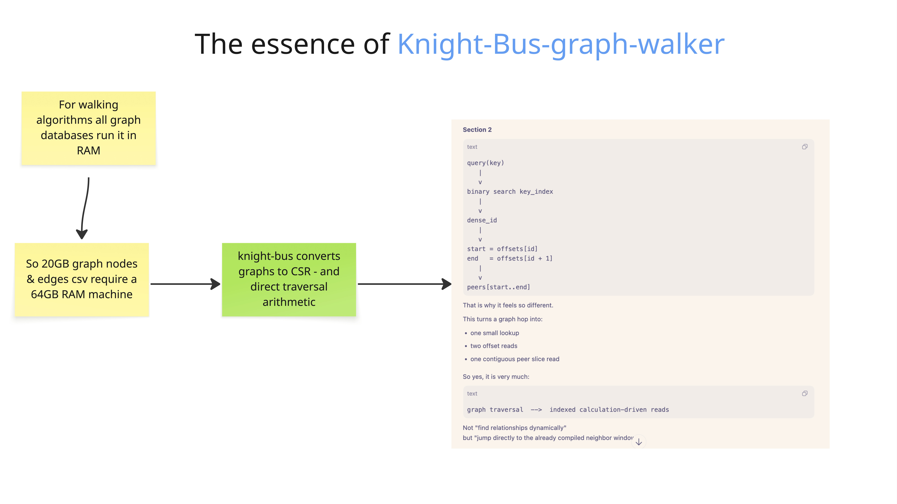

# Markdown Repository Value Index

Generated: 2026-08-11
Scope: 406 source Markdown files discovered with `rg --files -g '*.md'`, plus this generated index (407 indexed entries total).
Method: the first 15 literal lines of every source file were read. The opening title/signal, directory role, revision status, and relationship to the current A007 north star were used to classify value. After generation, the first 15 lines of this index were also read and verified separately.

## How To Use This Index

| Tier | Meaning | Count |
|---|---|---:|
| P0 | Governing or current product/architecture truth | 11 |
| P1 | Direct evidence, executable contract, or high-signal synthesis | 95 |
| P2 | Useful supporting research or targeted implementation reference | 255 |
| P3 | Historical, superseded, or duplicate material | 22 |
| OPS | Instructions, progress journals, runbooks, or audit state | 24 |

A low tier does not mean a document is bad. It means it should not overrule a newer governing document.

## Recommended Reading Spine

| Order | Document | Why |
|---:|---|---|
| 1 | [docs_PRD04/A007-spc-founder-interview-prep-v7.md](./docs_PRD04/A007-spc-founder-interview-prep-v7.md) | Current customer, pain, wedge, and falsification north star. |
| 2 | [docs_PMF_01/PMF005-Deterministic-Compute-Operating-Doctrine.md](./docs_PMF_01/PMF005-Deterministic-Compute-Operating-Doctrine.md) | Current company and product sequencing decision. |
| 3 | [README.md](./README.md) | Measured product proof and runnable baseline. |
| 4 | [docs_PMF_01/PMF006-Cypher-Bolt-Walk-Spec.md](./docs_PMF_01/PMF006-Cypher-Bolt-Walk-Spec.md) | Implemented Cypher/Bolt compatibility slice. |
| 5 | [docs_PMF_01/evidence/cypher-bolt-walk-v1/compatibility-summary.md](./docs_PMF_01/evidence/cypher-bolt-walk-v1/compatibility-summary.md) | Compact measured release evidence. |
| 6 | [docs_PRD04/reference-learning/neo4j-compat-lowram/current-implementation-gap-ledger.md](./docs_PRD04/reference-learning/neo4j-compat-lowram/current-implementation-gap-ledger.md) | Honest boundary between current code and the founder contract. |
| 7 | [docs_PRD04/reference-learning/neo4j-compat-lowram/founder-contract-spine.md](./docs_PRD04/reference-learning/neo4j-compat-lowram/founder-contract-spine.md) | Admission, enforcement, verification, and receipt contract. |
| 8 | [docs_PRD04/Algorithm-Storage-Decision-Analysis.md](./docs_PRD04/Algorithm-Storage-Decision-Analysis.md) | Best current map from algorithms to storage plans. |
| 9 | [docs_PRD04/A007-Custom-OLAP-Storage-Innovation-Atlas.md](./docs_PRD04/A007-Custom-OLAP-Storage-Innovation-Atlas.md) | Portfolio of differentiated physical plans and trade-offs. |
| 10 | [docs_PRD06/LowRAM-All-Algorithm-Architecture-Atlas.md](./docs_PRD06/LowRAM-All-Algorithm-Architecture-Atlas.md) | Broad algorithm coverage after the product spine is understood. |

## Complete Inventory

### Root: controls, current proof, and journals

| Document | Opening identity from first 15 lines | Value | Best use |
|---|---|---|---|
| [AGENTS.md](./AGENTS.md) | AGENTS: This project uses clarity to visualize code changes, provide design feedback, and guide refactoring. 1. After making changes - Run clarity to visualize your chan… | **OPS** | Repository operating instructions; consult before code or Git work. |
| [CLAUDE.md](./CLAUDE.md) | GitNexus — Code Intelligence: This project is indexed by GitNexus as knight-bus-graph-walker (12945 symbols, 16125 relationships, 300 execution flows). Use the GitNexus … | **OPS** | Repository operating instructions; consult before code or Git work. |
| [Docs-Readme.md](./Docs-Readme.md) | Git Reference Repository Readme: This document accounts for the external source repositories cloned for Knight Bus v003 architecture study. The actual clones live under … | **P2** | Supporting design or research reference; consult for the named topic. |
| [Final-Testing-Journal-v002.md](./Final-Testing-Journal-v002.md) | Final Testing Journal v002: - timestamp: 2026-04-16 16:26:18 IST - repo: /Users/neetipatni/Desktop/Codex202604/knight-bus-graph-walker - platform: macOS-14.6-arm64-arm-6… | **OPS** | Resume history and audit trail; useful for exact status, not governing product truth. |
| [journal-tests-202604-v002.md](./journal-tests-202604-v002.md) | journal-tests-202604-v002: - generatedat: 2026-04-16 16:26:18 IST - repo: /Users/neetipatni/Desktop/Codex202604/knight-bus-graph-walker - note: this is the corrected run… | **OPS** | Resume history and audit trail; useful for exact status, not governing product truth. |
| [Markdown-Repository-Index-Progress.md](./Markdown-Repository-Index-Progress.md) | TDD Progress Journal: - Task: Read the first 15 lines of every Markdown file and create a root value index - Created: 2026-08-10 05:26:49Z - Updated: 2026-08-10 05:32:36Z | **OPS** | Resume history and audit trail; useful for exact status, not governing product truth. |
| [Markdown-Value-Index.md](./Markdown-Value-Index.md) | Markdown Repository Value Index: Generated navigation spine for every Markdown document in this repository. | **P0** | Start here to choose the smallest authoritative reading set. |
| [README.md](./README.md) | Knight Bus Graph Walker v002: This repo was created in 5 hours for a codex hackathon  v002 is the cur… | **P0** | Current product proof, benchmark framing, and runnable entry point. |

### arxiv-reference: architecture invention campaign contracts and G00-G03 operations

| Document | Opening identity from first 15 lines | Value | Best use |
|---|---|---|---|
| [arxiv-reference/Arxiv-Pattern-Foundry-SOP.md](./arxiv-reference/Arxiv-Pattern-Foundry-SOP.md) | Arxiv Pattern Foundry SOP: Goal-ready executable specification for converting literature into mechanism cards, counterexamples, constraint transfers, diverse architectures, and falsifying experiments. | **P1** | Use as the bounded, resumable SOP and copy-paste goal contract for the arXiv architecture-invention campaign. |
| [arxiv-reference/README.md](./arxiv-reference/README.md) | arXiv Pattern Foundry: Operating contract for a bounded research-to-decision system that keeps artifacts goal-traceable and explicitly rejects a PDF archive or paper-summary collection. | **P1** | Use to understand the foundry boundary and the role of its governed evidence and synthesis artifacts. |
| [arxiv-reference/governance/G00-generation-ledger.md](./arxiv-reference/governance/G00-generation-ledger.md) | G00 Generation Ledger: Reproducibility record for the delegated LLM generation used to build and repair the zero-research G00 governance scaffold. | **OPS** | Audit writer identities, reconstructed prompts, bounded timestamps, output checksums, and disclosed replay limits. |
| [arxiv-reference/governance/G00-goal-packet.md](./arxiv-reference/governance/G00-goal-packet.md) | G00 Goal Packet: Standalone bounded-work contract for initializing the minimum campaign scaffold with zero external queries, papers, evidence cards, or architecture candidates. | **P1** | Use as the exact G00 objective, ownership, scope-cap, and exit-test contract. |
| [arxiv-reference/governance/architecture-question-ledger.md](./arxiv-reference/governance/architecture-question-ledger.md) | G01 Architecture Question Ledger: Twelve open, repository-grounded architecture decisions with frozen encoding, evidence, candidate options, missing evidence, and falsifiers. | **P1** | Use as the bounded decision surface that every G02 metadata query must be able to change. |
| [arxiv-reference/governance/artifact-schema-contracts.md](./arxiv-reference/governance/artifact-schema-contracts.md) | Artifact Schema Contracts: G00 implementation-facing schema contract that defines later artifact shapes and validation while creating zero artifact instances. | **P1** | Use to implement and validate future foundry artifacts without mistaking schemas for research records. |
| [arxiv-reference/governance/campaign-status.md](./arxiv-reference/governance/campaign-status.md) | Arxiv Pattern Foundry Campaign Status: G03 is complete and verified after bounded two-provider traversal, two adversarial repair cycles, and exact replay. | **OPS** | Audit final G03 counts, reviewer clearance, residual limits, Git disclosure, and the still-unstarted G04 handoff. |
| [arxiv-reference/governance/claim-evidence-policy.md](./arxiv-reference/governance/claim-evidence-policy.md) | Claim And Evidence Policy: G00 campaign contract requiring claim-granular epistemic labels and precise source pointers for source claims. | **P1** | Use to keep sourced claims, derived inferences, and speculative transfers explicit and auditable. |
| [arxiv-reference/governance/g02-metadata-contract.md](./arxiv-reference/governance/g02-metadata-contract.md) | G02 Metadata Discovery Contract: Frozen request, cache, identity, ranking, retry, and aggregation rules for bounded metadata discovery. | **P1** | Use to reproduce or audit how G02 converted 25 query families into canonical metadata candidates. |
| [arxiv-reference/governance/g02-service-preflight.md](./arxiv-reference/governance/g02-service-preflight.md) | G02 Source-Service Preflight: Dated authorization decision for respectful arXiv metadata access and explicit non-use of Crossref and OpenAlex. | **OPS** | Audit service terms, client identification, pacing, concurrency, cache, and stop conditions. |
| [arxiv-reference/governance/G03-goal-packet.md](./arxiv-reference/governance/G03-goal-packet.md) | G03 Goal Packet: Exact 25-seed, depth-2, 250-new-identity bounded citation-archaeology contract. | **P1** | Use as the scope, cap, owned-output, exclusion, and closure contract for G03. |
| [arxiv-reference/governance/g03-citation-contract.md](./arxiv-reference/governance/g03-citation-contract.md) | G03 Citation Contract: Frozen provider, identity, edge, cache, retry, exact-stop, screening, and epistemic rules for metadata-only ancestry traversal. | **P1** | Audit citation direction, semantic-edge conservatism, identity reconciliation, request provenance, screening derivation, and cache safety. |
| [arxiv-reference/governance/g03-screening-prompts.md](./arxiv-reference/governance/g03-screening-prompts.md) | G03 Screening Prompts: Frozen disjoint metadata-only assignments for backward, forward, constraint/survey, and independent accounting lanes. | **OPS** | Reproduce the four screening lanes without reading papers, caches, or repositories. |
| [arxiv-reference/governance/g03-service-preflight.md](./arxiv-reference/governance/g03-service-preflight.md) | G03 Service Preflight: Dated metadata-only authorization and stop policy for OpenAlex and Semantic Scholar. | **OPS** | Audit official policy evidence, selected fields, pacing, attribution, caching, and forbidden content. |
| [arxiv-reference/governance/reviews/G03-lane-A-backward.md](./arxiv-reference/governance/reviews/G03-lane-A-backward.md) | G03 Lane A Result: Read-only ranking of 66 retained backward identities with 12 metadata-derived acquisition nominations. | **P1** | Audit foundational and external-memory reading priorities and their exact reviewer provenance. |
| [arxiv-reference/governance/reviews/G03-lane-B-forward.md](./arxiv-reference/governance/reviews/G03-lane-B-forward.md) | G03 Lane B Result: Read-only ranking of 57 retained forward identities with 10 metadata-derived acquisition nominations. | **P1** | Audit implementation, systems, storage, and evaluation reading priorities. |
| [arxiv-reference/governance/reviews/G03-lane-C-constraints.md](./arxiv-reference/governance/reviews/G03-lane-C-constraints.md) | G03 Lane C Result: Read-only screening of 14 constraint, lower-bound, survey, or review identities with three nominations. | **P1** | Audit falsifier and survey reading priorities without treating titles as source claims. |
| [arxiv-reference/governance/reviews/G03-lane-D-audit.md](./arxiv-reference/governance/reviews/G03-lane-D-audit.md) | G03 Lane D Audit: Independent accounting of 25 seeds, 377 identities, 159 edges, 1,251 stops, and the 137-identity screening boundary. | **OPS** | Reconcile campaign arithmetic, boundaries, and known gaps before G03 closure. |
| [arxiv-reference/governance/source-service-policy.md](./arxiv-reference/governance/source-service-policy.md) | Source Service Policy: G00 campaign contract enforcing a hard no-network gate across metadata, citation, abstract, full-text, and repository source services. | **P1** | Use to enforce G00's local-only source boundary and prohibit external-service activity. |
| [arxiv-reference/journals/G00-progress.md](./arxiv-reference/journals/G00-progress.md) | TDD Progress Journal: Completed G00 scaffold journal recording six RED cycles, 23-test GREEN evidence, final verification, and the G01 stop boundary. | **OPS** | Audit G00 from its recorded phases, evidence, final handoff, and bounded next steps. |
| [arxiv-reference/journals/G01-progress.md](./arxiv-reference/journals/G01-progress.md) | TDD Progress Journal: Resumable G01 record of repository evidence mining, RED-GREEN validator work, delegated read lanes, exact artifact counts, and the G02 stop boundary. | **OPS** | Audit G01 provenance, test transitions, graph-tool evidence, and the exact next permitted action. |
| [arxiv-reference/journals/G02-progress.md](./arxiv-reference/journals/G02-progress.md) | TDD Progress Journal: G02 record of offline fixtures, two query-compiler corrections, 191 requests, four metadata-screening lanes, adversarial repair, and closure verification. | **OPS** | Resume or audit the exact G02 RED-GREEN-VERIFY history without repeating completed requests. |
| [arxiv-reference/journals/G03-progress.md](./arxiv-reference/journals/G03-progress.md) | TDD Progress Journal: Complete G03 record of provider recovery, 83 bounded requests, exact stop provenance, screening, two adversarial repair cycles, and clearance. | **OPS** | Audit the complete RED-GREEN-REFACTOR history, replay proof, Git correction, and exact G04 handoff without repeating requests. |
| [arxiv-reference/sources/G02-metadata-screening-report.md](./arxiv-reference/sources/G02-metadata-screening-report.md) | G02 Metadata Screening Report: Durable accounting, coverage analysis, ranking limitations, explicit exploration quotas, and balanced 25-seed G03 handoff. | **P1** | Start here for what G02 learned, what metadata cannot prove, and which citation branches G03 should traverse. |
| [arxiv-reference/sources/G03-citation-ancestry-report.md](./arxiv-reference/sources/G03-citation-ancestry-report.md) | G03 Citation Ancestry Report: Reproducible two-provider accounting, backward/forward/constraint/survey routing, stopped branches, four-lane review, and exact 50-paper G04 queue. | **P1** | Start here for what citation metadata changed, which evidence branches G04 should acquire, and what remains unproved. |

### docs_PMF_01/evidence: compatibility release evidence

| Document | Opening identity from first 15 lines | Value | Best use |
|---|---|---|---|
| [docs_PMF_01/evidence/cypher-bolt-walk-v1/compatibility-summary.md](./docs_PMF_01/evidence/cypher-bolt-walk-v1/compatibility-summary.md) | Cypher Bolt Walk Compatibility Summary: Verdict: passed Authorized scope: knight-bus-neighborhood-walk-v1, Neo4j Python driver 6.1.0, direct bolt://, read-only auto-comm… | **P1** | Release evidence for the measured Cypher/Bolt walk slice. |
| [docs_PMF_01/evidence/cypher-bolt-walk-v1/README.md](./docs_PMF_01/evidence/cypher-bolt-walk-v1/README.md) | Cypher Bolt Walk v1 Evidence: Date: 2026-08-07 This directory preserves the release evidence for the exact compatibility claim knight-bus-neighborhood-walk-v1: Neo4j Pyt… | **P1** | Release evidence for the measured Cypher/Bolt walk slice. |

### docs_PMF_01: current deterministic-compute and PMF doctrine

| Document | Opening identity from first 15 lines | Value | Best use |
|---|---|---|---|
| [docs_PMF_01/PMF001-Strict-RAM-Scale-Scenarios.md](./docs_PMF_01/PMF001-Strict-RAM-Scale-Scenarios.md) | PMF001 Strict RAM Scale Scenarios: Yes, but specifically resident RAM, not total data footprint. This is not a claim that a fundamentally terabyte-scale computation magi… | **P1** | Direct evidence, executable contract, or high-signal synthesis. |
| [docs_PMF_01/PMF002-Budget-Bounded-Batch-Compute.md](./docs_PMF_01/PMF002-Budget-Bounded-Batch-Compute.md) | PMF002 Budget Bounded Batch Compute: Knight Bus should begin as a graph-compute product but be architected as a budget-addressed batch execution system. Its fundamental … | **P1** | Direct evidence, executable contract, or high-signal synthesis. |
| [docs_PMF_01/PMF003-Graph-Developer-Alpha-Radar.md](./docs_PMF_01/PMF003-Graph-Developer-Alpha-Radar.md) | PMF003: Graph Developer Alpha Radar: Date started: 2026-08-07 Source surface: X direct-message group chat Graph Technology Developers, opened in the Codex in-app browser… | **P2** | Supporting design or research reference; consult for the named topic. |
| [docs_PMF_01/PMF004-Deterministic-Compute-Opportunity-Atlas.md](./docs_PMF_01/PMF004-Deterministic-Compute-Opportunity-Atlas.md) | PMF004: Deterministic Compute Opportunity Atlas: Status: Deep-exploration research dossier Date: 2026-08-07 Scope: Algorithms, analytical jobs, cloud jobs, online servic… | **P1** | Direct evidence, executable contract, or high-signal synthesis. |
| [docs_PMF_01/PMF005-Deterministic-Compute-Operating-Doctrine.md](./docs_PMF_01/PMF005-Deterministic-Compute-Operating-Doctrine.md) | PMF005: Deterministic Compute Operating Doctrine: Status: Consolidated strategic decision Date: 2026-08-07 Inputs: [PMF001](PMF001-Strict-RAM-Scale-Scenarios.md), [PMF00… | **P0** | Current company doctrine and sequencing across graph and adjacent compute. |
| [docs_PMF_01/PMF006-Cypher-Bolt-Walk-Spec.md](./docs_PMF_01/PMF006-Cypher-Bolt-Walk-Spec.md) | PMF006: Cypher Bolt Walk Spec: Date: 2026-08-07 Status: implementation-ready executable specification Compatibility profile: knight-bus-neighborhood-walk-v1 | **P0** | Implemented compatibility-slice contract and its verification boundary. |
| [docs_PMF_01/PMF007-Bolt-Cypher-Mega-Spec.md](./docs_PMF_01/PMF007-Bolt-Cypher-Mega-Spec.md) | PMF007: Bolt Cypher Mega Spec: A versioned, executable contract for accepting production Neo4j traffic and executing it through Knight Bus without pretending that wire c… | **P2** | Supporting design or research reference; consult for the named topic. |

### docs_PRD02: superseded full-GDS architecture exploration

| Document | Opening identity from first 15 lines | Value | Best use |
|---|---|---|---|
| [docs_PRD02/Low-RAM-OLAP-Format-Variants.md](./docs_PRD02/Low-RAM-OLAP-Format-Variants.md) | Low-RAM OLAP Format Variants For A Rust Neo4j Rewrite: Date: 2026-05-26 The product question is not "can we invent clever graph formats?" The product question is: | **P3** | Historical or superseded context; consult only to reconstruct decision evolution. |
| [docs_PRD02/User-Journey-50GB-OLTP-OLAP-Lag.md](./docs_PRD02/User-Journey-50GB-OLTP-OLAP-Lag.md) | User Journey: 50 GB Dataset, CRUD, Queries, and OLTP/OLAP Lag: This local version folds the existing 50 GB user-journey note into a deeper Iggy-informed architecture add… | **P3** | Historical or superseded context; consult only to reconstruct decision evolution. |
| [docs_PRD02/V003-All-GDS-Surface-Requirements.md](./docs_PRD02/V003-All-GDS-Surface-Requirements.md) | v003 Requirements: Full GDS Surface On A CSR-Centered OLAP Architecture: Purpose: capture the complete first-pass requirements for aiming at the full Neo4j Graph Data Sc… | **P3** | Historical or superseded context; consult only to reconstruct decision evolution. |
| [docs_PRD02/V003-All-GDS-Surface-Supportability-Matrix.md](./docs_PRD02/V003-All-GDS-Surface-Supportability-Matrix.md) | v003 All-GDS Surface Supportability Matrix: Purpose: answer the active architecture question directly: Can each Neo4j GDS surface area be supported by a Knight Bus CSR-c… | **P3** | Historical or superseded context; consult only to reconstruct decision evolution. |
| [docs_PRD02/V003-Diligence-CSR-Tiles-GDS-Surface.md](./docs_PRD02/V003-Diligence-CSR-Tiles-GDS-Surface.md) | v003 Diligence: CSR Tiles + GDS Surface TDD Plan: Purpose: turn the v003 OLAP architecture direction into a source-backed, test-first diligence plan. Short answer: the e… | **P3** | Historical or superseded context; consult only to reconstruct decision evolution. |

### docs_PRD03/implementation-readiness: full-surface implementation contracts

| Document | Opening identity from first 15 lines | Value | Best use |
|---|---|---|---|
| [docs_PRD03/implementation-readiness/Artifact-Model-Catalog-Contract.md](./docs_PRD03/implementation-readiness/Artifact-Model-Catalog-Contract.md) | Artifact Model Catalog Contract: Full GDS compatibility is not only graph topology and algorithms. It includes result artifacts, mutate/write targets, model catalogs, pi… | **P1** | Implementation contract or falsifier for the older full-surface v003 direction. |
| [docs_PRD03/implementation-readiness/Benchmark-Proof-Plan.md](./docs_PRD03/implementation-readiness/Benchmark-Proof-Plan.md) | Benchmark Proof Plan: This plan defines the proof needed before claiming v003 saves server cost or makes 50GB-class graphs practical on 8GB-class machines. system purpose | **P1** | Implementation contract or falsifier for the older full-surface v003 direction. |
| [docs_PRD03/implementation-readiness/Cells-Adoption-Falsifier-Plan.md](./docs_PRD03/implementation-readiness/Cells-Adoption-Falsifier-Plan.md) | Cells Adoption Falsifier Plan: Cells or Tilehouse are not a religion. They are a hypothesis: partitioned CSR payloads may improve update locality, reader locality, compa… | **P1** | Implementation contract or falsifier for the older full-surface v003 direction. |
| [docs_PRD03/implementation-readiness/Neo4j-Compatibility-Canary-Matrix.md](./docs_PRD03/implementation-readiness/Neo4j-Compatibility-Canary-Matrix.md) | Neo4j Compatibility Canary Matrix: This matrix defines canaries for zero-client-change compatibility. It does not claim the canaries pass today; it names the minimum exe… | **P1** | Implementation contract or falsifier for the older full-surface v003 direction. |
| [docs_PRD03/implementation-readiness/OLTP-Record-Store-Rust-Contract.md](./docs_PRD03/implementation-readiness/OLTP-Record-Store-Rust-Contract.md) | OLTP Record Store Rust Contract: This contract keeps OLTP storage Neo4j-shaped while allowing OLAP/GDS storage to be optimized separately. It is not a Rust implementatio… | **P1** | Implementation contract or falsifier for the older full-surface v003 direction. |
| [docs_PRD03/implementation-readiness/Projection-Build-Store-Physical-Contract.md](./docs_PRD03/implementation-readiness/Projection-Build-Store-Physical-Contract.md) | Projection Build Store Physical Contract: The Projection Build Store is the analytical foundry between Neo4j-shaped OLTP truth and published OLAP snapshots. It is not a … | **P1** | Implementation contract or falsifier for the older full-surface v003 direction. |
| [docs_PRD03/implementation-readiness/README.md](./docs_PRD03/implementation-readiness/README.md) | v003 Implementation Readiness Packet: Date: 2026-06-24 This folder converts the docsPRD03 research shelf into implementation contracts for the Rust Neo4j-compatible rewr… | **P1** | Implementation contract or falsifier for the older full-surface v003 direction. |
| [docs_PRD03/implementation-readiness/Snapshot-Publication-State-Machine.md](./docs_PRD03/implementation-readiness/Snapshot-Publication-State-Machine.md) | Snapshot Publication State Machine: This state machine protects OLAP readers from half-built files and gives freshness semantics a concrete source watermark. plane role | **P1** | Implementation contract or falsifier for the older full-surface v003 direction. |
| [docs_PRD03/implementation-readiness/Support-Status-Runtime-Semantics.md](./docs_PRD03/implementation-readiness/Support-Status-Runtime-Semantics.md) | Support Status Runtime Semantics: This file defines how the GDS procedure registry is allowed to behave at runtime. The goal is honest compatibility: v003 must never pre… | **P1** | Implementation contract or falsifier for the older full-surface v003 direction. |

### docs_PRD03/reference-learning: research batches and coverage controls

| Document | Opening identity from first 15 lines | Value | Best use |
|---|---|---|---|
| [docs_PRD03/reference-learning/Batch-01-Current-Seed-And-GDS-Baseline.md](./docs_PRD03/reference-learning/Batch-01-Current-Seed-And-GDS-Baseline.md) | Batch 01: Current Seed And GDS Baseline: Date: 2026-06-24 Assigned lanes: - Surface lane | **P2** | Source-backed research batch; consult when tracing the origin of an architecture claim. |
| [docs_PRD03/reference-learning/Batch-02-GDS-Public-Surface-Inventory.md](./docs_PRD03/reference-learning/Batch-02-GDS-Public-Surface-Inventory.md) | Batch 02: GDS Public Surface Inventory Baseline: Date: 2026-06-24 Assigned lanes: - Surface lane | **P2** | Source-backed research batch; consult when tracing the origin of an architecture claim. |
| [docs_PRD03/reference-learning/Batch-03-Projection-Build-Store-Precedents.md](./docs_PRD03/reference-learning/Batch-03-Projection-Build-Store-Precedents.md) | Batch 03: Projection Build Store Precedents: Date: 2026-06-24 Assigned lanes: - Capability lane | **P2** | Source-backed research batch; consult when tracing the origin of an architecture claim. |
| [docs_PRD03/reference-learning/Batch-04-Publication-And-Generation-Catalog.md](./docs_PRD03/reference-learning/Batch-04-Publication-And-Generation-Catalog.md) | Batch 04: Publication And Generation Catalog: Date: 2026-06-24 Assigned lanes: - Capability lane | **P2** | Source-backed research batch; consult when tracing the origin of an architecture claim. |
| [docs_PRD03/reference-learning/Batch-05-Neo4j-Compatibility-Boundary.md](./docs_PRD03/reference-learning/Batch-05-Neo4j-Compatibility-Boundary.md) | Batch 05: Neo4j Compatibility Boundary: Date: 2026-06-24 Assigned lanes: - Surface lane | **P2** | Source-backed research batch; consult when tracing the origin of an architecture claim. |
| [docs_PRD03/reference-learning/Batch-06-Sidecars-Planner-And-Compact-Competitors.md](./docs_PRD03/reference-learning/Batch-06-Sidecars-Planner-And-Compact-Competitors.md) | Batch 06: Sidecars, Planner Inputs, And Compact Competitors: Date: 2026-06-24 Assigned lanes: - Capability lane | **P2** | Source-backed research batch; consult when tracing the origin of an architecture claim. |
| [docs_PRD03/reference-learning/Batch-07-Low-RAM-Graph-Priors.md](./docs_PRD03/reference-learning/Batch-07-Low-RAM-Graph-Priors.md) | Batch 07: Low-RAM Graph Priors, Representative GDS Kernels, And Storage Fit: Date: 2026-06-24 Assigned lanes: - Capability lane | **P2** | Source-backed research batch; consult when tracing the origin of an architecture claim. |
| [docs_PRD03/reference-learning/Batch-08-Hard-GDS-Families-And-Model-Artifacts.md](./docs_PRD03/reference-learning/Batch-08-Hard-GDS-Families-And-Model-Artifacts.md) | Batch 08: Hard GDS Families, Model Artifacts, And Storage Fit: Date: 2026-06-24 Assigned lanes: - Capability lane | **P2** | Source-backed research batch; consult when tracing the origin of an architecture claim. |
| [docs_PRD03/reference-learning/Batch-09-Benchmarks-And-Observability.md](./docs_PRD03/reference-learning/Batch-09-Benchmarks-And-Observability.md) | Batch 09: Benchmarks, Observability, And Graph-Vector Market Watch: Date: 2026-06-24 Assigned lanes: - Benchmark lane | **P2** | Source-backed research batch; consult when tracing the origin of an architecture claim. |
| [docs_PRD03/reference-learning/Batch-10-GDS-Projection-Internals-And-Support-Tiers.md](./docs_PRD03/reference-learning/Batch-10-GDS-Projection-Internals-And-Support-Tiers.md) | Batch 10: GDS Projection Internals, Long-Tail Support Tiers, And Estimator Fit: Date: 2026-06-24 Assigned lanes: - Capability lane | **P2** | Source-backed research batch; consult when tracing the origin of an architecture claim. |
| [docs_PRD03/reference-learning/Batch-11-Algorithm-Oracle-And-Parity-Scaffolding.md](./docs_PRD03/reference-learning/Batch-11-Algorithm-Oracle-And-Parity-Scaffolding.md) | Batch 11: Algorithm Oracle, Flat-CSR Parity, And Rust Fixture Scaffolding: Date: 2026-06-24 Assigned lanes: - Capability lane | **P2** | Source-backed research batch; consult when tracing the origin of an architecture claim. |
| [docs_PRD03/reference-learning/Current-Codebase-Low-RAM-Patterns.md](./docs_PRD03/reference-learning/Current-Codebase-Low-RAM-Patterns.md) | Current Codebase Low-RAM Patterns: This note is about the current Knight Bus repository itself, not the mirrored external repos from Batch 07. The low-RAM outcome here d… | **P2** | Supporting design or research reference; consult for the named topic. |
| [docs_PRD03/reference-learning/GDS-PRD-L1-Evidence-Dossier-v2.md](./docs_PRD03/reference-learning/GDS-PRD-L1-Evidence-Dossier-v2.md) | GDS PRD L1 Evidence Dossier v2: Generated: 2026-06-24 22:01:14 Source scope: /Users/amuldotexe/Desktop/personal-repos-lane/knight-bus-graph-walker/gitrefrepo/neo4j-gds-s… | **P1** | Direct evidence, executable contract, or high-signal synthesis. |
| [docs_PRD03/reference-learning/GDS-PRD-L1-Evidence-Dossier.md](./docs_PRD03/reference-learning/GDS-PRD-L1-Evidence-Dossier.md) | GDS PRD L1 Evidence Dossier: Date: 2026-06-24 This dossier is a PRD rewrite evidence packet for docsPRD03/prd-l1.md. It is not a generic tour of Neo4j GDS. It records th… | **P2** | Supporting design or research reference; consult for the named topic. |
| [docs_PRD03/reference-learning/GDS-V2-Progress-Journal.md](./docs_PRD03/reference-learning/GDS-V2-Progress-Journal.md) | TDD Progress Journal: - Task: Comprehensive GDS PRD L1 Evidence Dossier v2 - Created: 2026-06-24 16:14:39Z - Updated: 2026-06-24 16:31:59Z | **OPS** | Resume history and audit trail; useful for exact status, not governing product truth. |
| [docs_PRD03/reference-learning/README.md](./docs_PRD03/reference-learning/README.md) | v003 Reference Learning Batches: This folder contains execution artifacts produced from docsPRD03/V003-Reference-Folder-Learning-Spec.md. batch status primary lanes main… | **P2** | Supporting design or research reference; consult for the named topic. |
| [docs_PRD03/reference-learning/Reference-Shelf-Graph-Evidence-Ledger.md](./docs_PRD03/reference-learning/Reference-Shelf-Graph-Evidence-Ledger.md) | Reference Shelf Graph Evidence Ledger: Date: 2026-06-24 This control artifact records the shelf-wide graph-evidence truthcheck required by [/Users/amuldotexe/Desktop/per… | **P2** | Supporting design or research reference; consult for the named topic. |
| [docs_PRD03/reference-learning/Reference-Shelf-Subpath-Coverage-Audit.md](./docs_PRD03/reference-learning/Reference-Shelf-Subpath-Coverage-Audit.md) | Reference Shelf Subpath Coverage Audit: Date: 2026-06-24 This audit implements the folder and sub-repo coverage part of [/Users/amuldotexe/Desktop/personal-repos-lane/kn… | **P2** | Supporting design or research reference; consult for the named topic. |
| [docs_PRD03/reference-learning/Requirements-Coverage-Tracker.md](./docs_PRD03/reference-learning/Requirements-Coverage-Tracker.md) | Requirements Coverage Tracker: Date: 2026-06-24 This tracker implements the executable-specs-01 discipline for the reference-learning program. It does not replace the ma… | **P2** | Supporting design or research reference; consult for the named topic. |

### docs_PRD03/reference-learning/gds-v2-dossiers: per-file GDS evidence and test oracles

| Document | Opening identity from first 15 lines | Value | Best use |
|---|---|---|---|
| [docs_PRD03/reference-learning/gds-v2-dossiers/001-catalog_lifecycle-GraphStore.md](./docs_PRD03/reference-learning/gds-v2-dossiers/001-catalog_lifecycle-GraphStore.md) | 1 catalog_lifecycle GraphStore: Evidence: Full-source read performed as required by scope. Field Value --- --- | **P2** | Graph, model, or pipeline catalog lifecycle compatibility. |
| [docs_PRD03/reference-learning/gds-v2-dossiers/002-memory_estimator-MemoryEstimateResult.md](./docs_PRD03/reference-learning/gds-v2-dossiers/002-memory_estimator-MemoryEstimateResult.md) | 2 memory_estimator MemoryEstimateResult: Evidence: Full-source read performed as required by scope. Field Value --- --- | **P2** | GDS memory-estimation semantics and admission-model research. |
| [docs_PRD03/reference-learning/gds-v2-dossiers/003-memory_estimator-MemoryEstimation.md](./docs_PRD03/reference-learning/gds-v2-dossiers/003-memory_estimator-MemoryEstimation.md) | 3 memory_estimator MemoryEstimation: Evidence: Full-source read performed as required by scope. Field Value --- --- | **P2** | GDS memory-estimation semantics and admission-model research. |
| [docs_PRD03/reference-learning/gds-v2-dossiers/004-projection_build-RelationshipType.md](./docs_PRD03/reference-learning/gds-v2-dossiers/004-projection_build-RelationshipType.md) | 4 projection_build RelationshipType: Evidence: Full-source read performed as required by scope. Field Value --- --- | **P2** | Projection, schema, orientation, property, and graph-build compatibility. |
| [docs_PRD03/reference-learning/gds-v2-dossiers/005-projection_build-Orientation.md](./docs_PRD03/reference-learning/gds-v2-dossiers/005-projection_build-Orientation.md) | 5 projection_build Orientation: Evidence: Full-source read performed as required by scope. Field Value --- --- | **P2** | Projection, schema, orientation, property, and graph-build compatibility. |
| [docs_PRD03/reference-learning/gds-v2-dossiers/006-projection_build-NodeLabel.md](./docs_PRD03/reference-learning/gds-v2-dossiers/006-projection_build-NodeLabel.md) | 6 projection_build NodeLabel: Evidence: Full-source read performed as required by scope. Field Value --- --- | **P2** | Projection, schema, orientation, property, and graph-build compatibility. |
| [docs_PRD03/reference-learning/gds-v2-dossiers/007-procedure_surface-GraphDataScienceProcedures.md](./docs_PRD03/reference-learning/gds-v2-dossiers/007-procedure_surface-GraphDataScienceProcedures.md) | 7 procedure_surface GraphDataScienceProcedures: Evidence: Full-source read performed as required by scope. Field Value --- --- | **P2** | Procedure names, configuration, modes, and return-surface compatibility. |
| [docs_PRD03/reference-learning/gds-v2-dossiers/008-projection_build-GraphProjectProc.md](./docs_PRD03/reference-learning/gds-v2-dossiers/008-projection_build-GraphProjectProc.md) | 8 projection_build GraphProjectProc: Evidence: Full-source read performed as required by scope. Field Value --- --- | **P2** | Projection, schema, orientation, property, and graph-build compatibility. |
| [docs_PRD03/reference-learning/gds-v2-dossiers/009-olap_algorithm-AlgorithmProcessingTimings.md](./docs_PRD03/reference-learning/gds-v2-dossiers/009-olap_algorithm-AlgorithmProcessingTimings.md) | 9 olap_algorithm AlgorithmProcessingTimings: Evidence: Full-source read performed as required by scope. Field Value --- --- | **P2** | Algorithm orchestration, modes, timing, state, and result behavior. |
| [docs_PRD03/reference-learning/gds-v2-dossiers/010-projection_build-ValueType.md](./docs_PRD03/reference-learning/gds-v2-dossiers/010-projection_build-ValueType.md) | 10 projection_build ValueType: Evidence: Full-source read performed as required by scope. Field Value --- --- | **P2** | Projection, schema, orientation, property, and graph-build compatibility. |
| [docs_PRD03/reference-learning/gds-v2-dossiers/011-procedure_surface-LocalCommunityProcedureFacade.md](./docs_PRD03/reference-learning/gds-v2-dossiers/011-procedure_surface-LocalCommunityProcedureFacade.md) | 11 procedure_surface LocalCommunityProcedureFacade: Evidence: Full-source read performed as required by scope. Field Value --- --- | **P2** | Procedure names, configuration, modes, and return-surface compatibility. |
| [docs_PRD03/reference-learning/gds-v2-dossiers/012-catalog_lifecycle-GraphStoreCatalog.md](./docs_PRD03/reference-learning/gds-v2-dossiers/012-catalog_lifecycle-GraphStoreCatalog.md) | 12 catalog_lifecycle GraphStoreCatalog: Evidence: Full-source read performed as required by scope. Field Value --- --- | **P2** | Graph, model, or pipeline catalog lifecycle compatibility. |
| [docs_PRD03/reference-learning/gds-v2-dossiers/013-procedure_surface-ProcedureConstants.md](./docs_PRD03/reference-learning/gds-v2-dossiers/013-procedure_surface-ProcedureConstants.md) | 13 procedure_surface ProcedureConstants: Evidence: Full-source read performed as required by scope. Field Value --- --- | **P2** | Procedure names, configuration, modes, and return-surface compatibility. |
| [docs_PRD03/reference-learning/gds-v2-dossiers/014-memory_estimator-MemoryEstimations.md](./docs_PRD03/reference-learning/gds-v2-dossiers/014-memory_estimator-MemoryEstimations.md) | 14 memory_estimator MemoryEstimations: Evidence: Full-source read performed as required by scope. Field Value --- --- | **P2** | GDS memory-estimation semantics and admission-model research. |
| [docs_PRD03/reference-learning/gds-v2-dossiers/015-olap_algorithm-AlgoBaseConfig.md](./docs_PRD03/reference-learning/gds-v2-dossiers/015-olap_algorithm-AlgoBaseConfig.md) | 15 olap_algorithm AlgoBaseConfig: Evidence: Full-source read performed as required by scope. Field Value --- --- | **P2** | Algorithm orchestration, modes, timing, state, and result behavior. |
| [docs_PRD03/reference-learning/gds-v2-dossiers/016-memory_estimator-MemoryRange.md](./docs_PRD03/reference-learning/gds-v2-dossiers/016-memory_estimator-MemoryRange.md) | 16 memory_estimator MemoryRange: Evidence: Full-source read performed as required by scope. Field Value --- --- | **P2** | GDS memory-estimation semantics and admission-model research. |
| [docs_PRD03/reference-learning/gds-v2-dossiers/017-olap_algorithm-NodePropertiesWritten.md](./docs_PRD03/reference-learning/gds-v2-dossiers/017-olap_algorithm-NodePropertiesWritten.md) | 17 olap_algorithm NodePropertiesWritten: Evidence: Full-source read performed as required by scope. Field Value --- --- | **P2** | Algorithm orchestration, modes, timing, state, and result behavior. |
| [docs_PRD03/reference-learning/gds-v2-dossiers/018-memory_estimator-Estimate.md](./docs_PRD03/reference-learning/gds-v2-dossiers/018-memory_estimator-Estimate.md) | 18 memory_estimator Estimate: Evidence: Full-source read performed as required by scope. Field Value --- --- | **P2** | GDS memory-estimation semantics and admission-model research. |
| [docs_PRD03/reference-learning/gds-v2-dossiers/019-procedure_surface-LocalCentralityProcedureFacade.md](./docs_PRD03/reference-learning/gds-v2-dossiers/019-procedure_surface-LocalCentralityProcedureFacade.md) | 19 procedure_surface LocalCentralityProcedureFacade: Evidence: Full-source read performed as required by scope. Field Value --- --- | **P2** | Procedure names, configuration, modes, and return-surface compatibility. |
| [docs_PRD03/reference-learning/gds-v2-dossiers/020-projection_build-Aggregation.md](./docs_PRD03/reference-learning/gds-v2-dossiers/020-projection_build-Aggregation.md) | 20 Aggregation: Evidence: Full-source read performed as required by scope. Field Value --- --- | **P2** | Projection, schema, orientation, property, and graph-build compatibility. |
| [docs_PRD03/reference-learning/gds-v2-dossiers/021-olap_algorithm-ResultBuilder.md](./docs_PRD03/reference-learning/gds-v2-dossiers/021-olap_algorithm-ResultBuilder.md) | 21 olap_algorithm ResultBuilder: Evidence: Full-source read performed as required by scope. Field Value --- --- | **P2** | Algorithm orchestration, modes, timing, state, and result behavior. |
| [docs_PRD03/reference-learning/gds-v2-dossiers/022-projection_build-DefaultValue.md](./docs_PRD03/reference-learning/gds-v2-dossiers/022-projection_build-DefaultValue.md) | 22 projection_build DefaultValue: Evidence: Full-source read performed as required by scope. Field Value --- --- | **P2** | Projection, schema, orientation, property, and graph-build compatibility. |
| [docs_PRD03/reference-learning/gds-v2-dossiers/023-procedure_surface-LocalPathFindingProcedureFacade.md](./docs_PRD03/reference-learning/gds-v2-dossiers/023-procedure_surface-LocalPathFindingProcedureFacade.md) | 23 procedure_surface LocalPathFindingProcedureFacade: Evidence: Full-source read performed as required by scope. Field Value --- --- | **P2** | Procedure names, configuration, modes, and return-surface compatibility. |
| [docs_PRD03/reference-learning/gds-v2-dossiers/024-olap_algorithm-Algorithm.md](./docs_PRD03/reference-learning/gds-v2-dossiers/024-olap_algorithm-Algorithm.md) | 24 olap_algorithm Algorithm: Evidence: Full-source read performed as required by scope. Field Value --- --- | **P2** | Algorithm orchestration, modes, timing, state, and result behavior. |
| [docs_PRD03/reference-learning/gds-v2-dossiers/025-procedure_surface-MutateStub.md](./docs_PRD03/reference-learning/gds-v2-dossiers/025-procedure_surface-MutateStub.md) | 25 procedure_surface MutateStub: Evidence: Full-source read performed as required by scope. Field Value --- --- | **P2** | Procedure names, configuration, modes, and return-surface compatibility. |
| [docs_PRD03/reference-learning/gds-v2-dossiers/026-procedure_surface-PipelineApplications.md](./docs_PRD03/reference-learning/gds-v2-dossiers/026-procedure_surface-PipelineApplications.md) | 26 procedure_surface PipelineApplications: Evidence: Full-source read performed as required by scope. Field Value --- --- | **P2** | Procedure names, configuration, modes, and return-surface compatibility. |
| [docs_PRD03/reference-learning/gds-v2-dossiers/027-procedure_surface-AlgorithmsProcedureFacade.md](./docs_PRD03/reference-learning/gds-v2-dossiers/027-procedure_surface-AlgorithmsProcedureFacade.md) | 27 procedure_surface AlgorithmsProcedureFacade: Evidence: Full-source read performed as required by scope. Field Value --- --- | **P2** | Procedure names, configuration, modes, and return-surface compatibility. |
| [docs_PRD03/reference-learning/gds-v2-dossiers/028-catalog_lifecycle-ModelCatalog.md](./docs_PRD03/reference-learning/gds-v2-dossiers/028-catalog_lifecycle-ModelCatalog.md) | 28 catalog_lifecycle ModelCatalog: Evidence: Full-source read performed as required by scope. Field Value --- --- | **P2** | Graph, model, or pipeline catalog lifecycle compatibility. |
| [docs_PRD03/reference-learning/gds-v2-dossiers/029-procedure_surface-ProcedureReturnColumns.md](./docs_PRD03/reference-learning/gds-v2-dossiers/029-procedure_surface-ProcedureReturnColumns.md) | 29 procedure_surface ProcedureReturnColumns: Evidence: Full-source read performed as required by scope. Field Value --- --- | **P2** | Procedure names, configuration, modes, and return-surface compatibility. |
| [docs_PRD03/reference-learning/gds-v2-dossiers/030-catalog_lifecycle-DefaultGraphCatalogApplications.md](./docs_PRD03/reference-learning/gds-v2-dossiers/030-catalog_lifecycle-DefaultGraphCatalogApplications.md) | 30 catalog_lifecycle DefaultGraphCatalogApplications: Field Value --- --- repo neo4j-gds-src | **P2** | Graph, model, or pipeline catalog lifecycle compatibility. |
| [docs_PRD03/reference-learning/gds-v2-dossiers/031-olap_algorithm-AlgorithmLabel.md](./docs_PRD03/reference-learning/gds-v2-dossiers/031-olap_algorithm-AlgorithmLabel.md) | 31 olap_algorithm AlgorithmLabel: Field Value --- --- repo neo4j-gds-src | **P2** | Algorithm orchestration, modes, timing, state, and result behavior. |
| [docs_PRD03/reference-learning/gds-v2-dossiers/032-olap_algorithm-CommunityAlgorithms.md](./docs_PRD03/reference-learning/gds-v2-dossiers/032-olap_algorithm-CommunityAlgorithms.md) | 32 olap_algorithm CommunityAlgorithms: Field Value --- --- repo neo4j-gds-src | **P2** | Algorithm orchestration, modes, timing, state, and result behavior. |
| [docs_PRD03/reference-learning/gds-v2-dossiers/033-catalog_lifecycle-Model.md](./docs_PRD03/reference-learning/gds-v2-dossiers/033-catalog_lifecycle-Model.md) | 33 catalog_lifecycle Model: Field Value --- --- repo neo4j-gds-src | **P2** | Graph, model, or pipeline catalog lifecycle compatibility. |
| [docs_PRD03/reference-learning/gds-v2-dossiers/034-olap_algorithm-RequestScopedDependencies.md](./docs_PRD03/reference-learning/gds-v2-dossiers/034-olap_algorithm-RequestScopedDependencies.md) | 34 olap_algorithm RequestScopedDependencies: Field Value --- --- repo neo4j-gds-src | **P2** | Algorithm orchestration, modes, timing, state, and result behavior. |
| [docs_PRD03/reference-learning/gds-v2-dossiers/035-memory_estimator-MemoryEstimateDefinition.md](./docs_PRD03/reference-learning/gds-v2-dossiers/035-memory_estimator-MemoryEstimateDefinition.md) | 35 memory_estimator MemoryEstimateDefinition: Field Value --- --- repo neo4j-gds-src | **P2** | GDS memory-estimation semantics and admission-model research. |
| [docs_PRD03/reference-learning/gds-v2-dossiers/036-olap_algorithm-AlgorithmSpec.md](./docs_PRD03/reference-learning/gds-v2-dossiers/036-olap_algorithm-AlgorithmSpec.md) | 36 olap_algorithm AlgorithmSpec: Field Value --- --- repo neo4j-gds-src | **P2** | Algorithm orchestration, modes, timing, state, and result behavior. |
| [docs_PRD03/reference-learning/gds-v2-dossiers/037-procedure_surface-AsNodeFunc.md](./docs_PRD03/reference-learning/gds-v2-dossiers/037-procedure_surface-AsNodeFunc.md) | 37 procedure_surface AsNodeFunc: Field Value --- --- repo neo4j-gds-src | **P2** | Procedure names, configuration, modes, and return-surface compatibility. |
| [docs_PRD03/reference-learning/gds-v2-dossiers/038-procedure_surface-NewConfigFunction.md](./docs_PRD03/reference-learning/gds-v2-dossiers/038-procedure_surface-NewConfigFunction.md) | 38 procedure_surface NewConfigFunction: Field Value --- --- repo neo4j-gds-src | **P2** | Procedure names, configuration, modes, and return-surface compatibility. |
| [docs_PRD03/reference-learning/gds-v2-dossiers/039-procedure_surface-GenericStub.md](./docs_PRD03/reference-learning/gds-v2-dossiers/039-procedure_surface-GenericStub.md) | 39 procedure_surface GenericStub: Field Value --- --- repo neo4j-gds-src | **P2** | Procedure names, configuration, modes, and return-surface compatibility. |
| [docs_PRD03/reference-learning/gds-v2-dossiers/040-olap_algorithm-PathFindingAlgorithms.md](./docs_PRD03/reference-learning/gds-v2-dossiers/040-olap_algorithm-PathFindingAlgorithms.md) | 40 olap_algorithm PathFindingAlgorithms: Field Value --- --- repo neo4j-gds-src | **P2** | Algorithm orchestration, modes, timing, state, and result behavior. |
| [docs_PRD03/reference-learning/gds-v2-dossiers/041-projection_build-PropertyMapping.md](./docs_PRD03/reference-learning/gds-v2-dossiers/041-projection_build-PropertyMapping.md) | 41 projection_build PropertyMapping: Field Value --- --- repo neo4j-gds-src | **P2** | Projection, schema, orientation, property, and graph-build compatibility. |
| [docs_PRD03/reference-learning/gds-v2-dossiers/042-projection_build-GraphProjectConfig.md](./docs_PRD03/reference-learning/gds-v2-dossiers/042-projection_build-GraphProjectConfig.md) | 42 projection_build GraphProjectConfig: Field Value --- --- repo neo4j-gds-src | **P2** | Projection, schema, orientation, property, and graph-build compatibility. |
| [docs_PRD03/reference-learning/gds-v2-dossiers/043-projection_build-RelationshipProjection.md](./docs_PRD03/reference-learning/gds-v2-dossiers/043-projection_build-RelationshipProjection.md) | 43 projection_build RelationshipProjection: Field Value --- --- repo neo4j-gds-src | **P2** | Projection, schema, orientation, property, and graph-build compatibility. |
| [docs_PRD03/reference-learning/gds-v2-dossiers/044-olap_algorithm-StreamResultBuilder.md](./docs_PRD03/reference-learning/gds-v2-dossiers/044-olap_algorithm-StreamResultBuilder.md) | 44 olap_algorithm StreamResultBuilder: Field Value --- --- repo neo4j-gds-src | **P2** | Algorithm orchestration, modes, timing, state, and result behavior. |
| [docs_PRD03/reference-learning/gds-v2-dossiers/045-olap_algorithm-CommunityAlgorithmsMutateModeBusinessFacade.md](./docs_PRD03/reference-learning/gds-v2-dossiers/045-olap_algorithm-CommunityAlgorithmsMutateModeBusinessFacade.md) | 45 olap_algorithm CommunityAlgorithmsMutateModeBusinessFacade: Field Value --- --- repo neo4j-gds-src | **P2** | Algorithm orchestration, modes, timing, state, and result behavior. |
| [docs_PRD03/reference-learning/gds-v2-dossiers/046-olap_algorithm-CentralityAlgorithms.md](./docs_PRD03/reference-learning/gds-v2-dossiers/046-olap_algorithm-CentralityAlgorithms.md) | 46 olap_algorithm CentralityAlgorithms: Field Value --- --- repo neo4j-gds-src | **P2** | Algorithm orchestration, modes, timing, state, and result behavior. |
| [docs_PRD03/reference-learning/gds-v2-dossiers/047-olap_algorithm-RelationshipsWritten.md](./docs_PRD03/reference-learning/gds-v2-dossiers/047-olap_algorithm-RelationshipsWritten.md) | 47 olap_algorithm RelationshipsWritten: Field Value --- --- repo neo4j-gds-src | **P2** | Algorithm orchestration, modes, timing, state, and result behavior. |
| [docs_PRD03/reference-learning/gds-v2-dossiers/048-procedure_surface-GdsCallable.md](./docs_PRD03/reference-learning/gds-v2-dossiers/048-procedure_surface-GdsCallable.md) | 48 procedure_surface GdsCallable: Field Value --- --- repo neo4j-gds-src | **P2** | Procedure names, configuration, modes, and return-surface compatibility. |
| [docs_PRD03/reference-learning/gds-v2-dossiers/049-procedure_surface-CommunityProcedureFacade.md](./docs_PRD03/reference-learning/gds-v2-dossiers/049-procedure_surface-CommunityProcedureFacade.md) | 49 procedure_surface CommunityProcedureFacade: Field Value --- --- repo neo4j-gds-src | **P2** | Procedure names, configuration, modes, and return-surface compatibility. |
| [docs_PRD03/reference-learning/gds-v2-dossiers/053-olap_algorithm-ProgressTrackerCreator.md](./docs_PRD03/reference-learning/gds-v2-dossiers/053-olap_algorithm-ProgressTrackerCreator.md) | 53 olap_algorithm ProgressTrackerCreator: Field Value --- --- repo neo4j-gds-src | **OPS** | Resume history and audit trail; useful for exact status, not governing product truth. |
| [docs_PRD03/reference-learning/gds-v2-dossiers/054-memory_estimator-CommunityAlgorithmsEstimationModeBusinessFacade.md](./docs_PRD03/reference-learning/gds-v2-dossiers/054-memory_estimator-CommunityAlgorithmsEstimationModeBusinessFacade.md) | 54 memory_estimator CommunityAlgorithmsEstimationModeBusinessFacade: Field Value --- --- repo neo4j-gds-src | **P2** | GDS memory-estimation semantics and admission-model research. |
| [docs_PRD03/reference-learning/gds-v2-dossiers/055-write_import_export-CommunityAlgorithmsWriteModeBusinessFacade.md](./docs_PRD03/reference-learning/gds-v2-dossiers/055-write_import_export-CommunityAlgorithmsWriteModeBusinessFacade.md) | 55 write_import_export CommunityAlgorithmsWriteModeBusinessFacade: Field Value --- --- repo neo4j-gds-src | **P2** | Mutate, write, import, or export behavior. |
| [docs_PRD03/reference-learning/gds-v2-dossiers/056-olap_algorithm-MutateStep.md](./docs_PRD03/reference-learning/gds-v2-dossiers/056-olap_algorithm-MutateStep.md) | 56 olap_algorithm MutateStep: Field Value --- --- repo neo4j-gds-src | **P2** | Algorithm orchestration, modes, timing, state, and result behavior. |
| [docs_PRD03/reference-learning/gds-v2-dossiers/057-projection_build-PropertyMappings.md](./docs_PRD03/reference-learning/gds-v2-dossiers/057-projection_build-PropertyMappings.md) | 57 projection_build PropertyMappings: Field Value --- --- repo neo4j-gds-src | **P2** | Projection, schema, orientation, property, and graph-build compatibility. |
| [docs_PRD03/reference-learning/gds-v2-dossiers/058-olap_algorithm-AlgorithmProcessingTemplateConvenience.md](./docs_PRD03/reference-learning/gds-v2-dossiers/058-olap_algorithm-AlgorithmProcessingTemplateConvenience.md) | 58 olap_algorithm AlgorithmProcessingTemplateConvenience: Field Value --- --- repo neo4j-gds-src | **P2** | Algorithm orchestration, modes, timing, state, and result behavior. |
| [docs_PRD03/reference-learning/gds-v2-dossiers/059-catalog_lifecycle-GraphStoreCatalogService.md](./docs_PRD03/reference-learning/gds-v2-dossiers/059-catalog_lifecycle-GraphStoreCatalogService.md) | 59 catalog_lifecycle GraphStoreCatalogService: Field Value --- --- repo neo4j-gds-src | **P2** | Graph, model, or pipeline catalog lifecycle compatibility. |
| [docs_PRD03/reference-learning/gds-v2-dossiers/060-catalog_lifecycle-CSRGraphStore.md](./docs_PRD03/reference-learning/gds-v2-dossiers/060-catalog_lifecycle-CSRGraphStore.md) | 60 catalog_lifecycle CSRGraphStore: Field Value --- --- repo neo4j-gds-src | **P2** | Graph, model, or pipeline catalog lifecycle compatibility. |
| [docs_PRD03/reference-learning/gds-v2-dossiers/061-projection_build-ElementProjection.md](./docs_PRD03/reference-learning/gds-v2-dossiers/061-projection_build-ElementProjection.md) | 61 projection_build ElementProjection: Field Value --- --- repo neo4j-gds-src | **P2** | Projection, schema, orientation, property, and graph-build compatibility. |
| [docs_PRD03/reference-learning/gds-v2-dossiers/062-procedure_surface-LocalSimilarityProcedureFacade.md](./docs_PRD03/reference-learning/gds-v2-dossiers/062-procedure_surface-LocalSimilarityProcedureFacade.md) | 62 procedure_surface LocalSimilarityProcedureFacade: Field Value --- --- repo neo4j-gds-src | **P2** | Procedure names, configuration, modes, and return-surface compatibility. |
| [docs_PRD03/reference-learning/gds-v2-dossiers/064-write_import_export-WritePropertyConfig.md](./docs_PRD03/reference-learning/gds-v2-dossiers/064-write_import_export-WritePropertyConfig.md) | 64 write_import_export WritePropertyConfig: Field Value --- --- repo neo4j-gds-src | **P2** | Mutate, write, import, or export behavior. |
| [docs_PRD03/reference-learning/gds-v2-dossiers/065-olap_algorithm-MutateNodeProperty.md](./docs_PRD03/reference-learning/gds-v2-dossiers/065-olap_algorithm-MutateNodeProperty.md) | 065 olap_algorithm MutateNodeProperty: Field Value --- --- repo neo4j-gds-src | **P2** | Algorithm orchestration, modes, timing, state, and result behavior. |
| [docs_PRD03/reference-learning/gds-v2-dossiers/066-olap_algorithm-GraphSageModelTrainer.md](./docs_PRD03/reference-learning/gds-v2-dossiers/066-olap_algorithm-GraphSageModelTrainer.md) | 066 olap_algorithm GraphSageModelTrainer: Field Value --- --- repo neo4j-gds-src | **P2** | Algorithm orchestration, modes, timing, state, and result behavior. |
| [docs_PRD03/reference-learning/gds-v2-dossiers/067-procedure_surface-LocalNodeEmbeddingsProcedureFacade.md](./docs_PRD03/reference-learning/gds-v2-dossiers/067-procedure_surface-LocalNodeEmbeddingsProcedureFacade.md) | 067 procedure_surface LocalNodeEmbeddingsProcedureFacade: Field Value --- --- repo neo4j-gds-src | **P2** | Procedure names, configuration, modes, and return-surface compatibility. |
| [docs_PRD03/reference-learning/gds-v2-dossiers/068-memory_estimator-PathFindingAlgorithmsEstimationModeBusinessFacade.md](./docs_PRD03/reference-learning/gds-v2-dossiers/068-memory_estimator-PathFindingAlgorithmsEstimationModeBusinessFacade.md) | 068 memory_estimator PathFindingAlgorithmsEstimationModeBusinessFacade: Field Value --- --- repo neo4j-gds-src | **P2** | GDS memory-estimation semantics and admission-model research. |
| [docs_PRD03/reference-learning/gds-v2-dossiers/069-olap_algorithm-CentralityAlgorithmsMutateModeBusinessFacade.md](./docs_PRD03/reference-learning/gds-v2-dossiers/069-olap_algorithm-CentralityAlgorithmsMutateModeBusinessFacade.md) | 069 olap_algorithm CentralityAlgorithmsMutateModeBusinessFacade: Field Value --- --- repo neo4j-gds-src | **P2** | Algorithm orchestration, modes, timing, state, and result behavior. |
| [docs_PRD03/reference-learning/gds-v2-dossiers/070-write_import_export-WriteStep.md](./docs_PRD03/reference-learning/gds-v2-dossiers/070-write_import_export-WriteStep.md) | 070 write_import_export WriteStep: Field Value --- --- repo neo4j-gds-src | **P2** | Mutate, write, import, or export behavior. |
| [docs_PRD03/reference-learning/gds-v2-dossiers/071-procedure_surface-NullComputationResultConsumer.md](./docs_PRD03/reference-learning/gds-v2-dossiers/071-procedure_surface-NullComputationResultConsumer.md) | 071 procedure_surface NullComputationResultConsumer: Field Value --- --- repo neo4j-gds-src | **P2** | Procedure names, configuration, modes, and return-surface compatibility. |
| [docs_PRD03/reference-learning/gds-v2-dossiers/072-olap_algorithm-NodeEmbeddingAlgorithms.md](./docs_PRD03/reference-learning/gds-v2-dossiers/072-olap_algorithm-NodeEmbeddingAlgorithms.md) | 072 olap_algorithm NodeEmbeddingAlgorithms: Field Value --- --- repo neo4j-gds-src | **P2** | Algorithm orchestration, modes, timing, state, and result behavior. |
| [docs_PRD03/reference-learning/gds-v2-dossiers/073-procedure_surface-LocalGraphDataScienceProcedures.md](./docs_PRD03/reference-learning/gds-v2-dossiers/073-procedure_surface-LocalGraphDataScienceProcedures.md) | 073 procedure_surface LocalGraphDataScienceProcedures: Field Value --- --- repo neo4j-gds-src | **P2** | Procedure names, configuration, modes, and return-surface compatibility. |
| [docs_PRD03/reference-learning/gds-v2-dossiers/075-olap_algorithm-StatsResultBuilder.md](./docs_PRD03/reference-learning/gds-v2-dossiers/075-olap_algorithm-StatsResultBuilder.md) | 075 olap_algorithm StatsResultBuilder: Field Value --- --- repo neo4j-gds-src | **P2** | Algorithm orchestration, modes, timing, state, and result behavior. |
| [docs_PRD03/reference-learning/gds-v2-dossiers/076-olap_algorithm-PathFindingAlgorithmsMutateModeBusinessFacade.md](./docs_PRD03/reference-learning/gds-v2-dossiers/076-olap_algorithm-PathFindingAlgorithmsMutateModeBusinessFacade.md) | 076 olap_algorithm PathFindingAlgorithmsMutateModeBusinessFacade: Field Value --- --- repo neo4j-gds-src | **P2** | Algorithm orchestration, modes, timing, state, and result behavior. |
| [docs_PRD03/reference-learning/gds-v2-dossiers/077-catalog_lifecycle-PipelineCatalog.md](./docs_PRD03/reference-learning/gds-v2-dossiers/077-catalog_lifecycle-PipelineCatalog.md) | 077 catalog_lifecycle PipelineCatalog: Field Value --- --- repo neo4j-gds-src | **P2** | Graph, model, or pipeline catalog lifecycle compatibility. |
| [docs_PRD03/reference-learning/gds-v2-dossiers/078-procedure_surface-PregelProcedureConfig.md](./docs_PRD03/reference-learning/gds-v2-dossiers/078-procedure_surface-PregelProcedureConfig.md) | 078 procedure_surface PregelProcedureConfig: Field Value --- --- repo neo4j-gds-src | **P2** | Procedure names, configuration, modes, and return-surface compatibility. |
| [docs_PRD03/reference-learning/gds-v2-dossiers/079-write_import_export-WriteToDatabase.md](./docs_PRD03/reference-learning/gds-v2-dossiers/079-write_import_export-WriteToDatabase.md) | 079 write_import_export WriteToDatabase: Field Value --- --- repo neo4j-gds-src | **P2** | Mutate, write, import, or export behavior. |
| [docs_PRD03/reference-learning/gds-v2-dossiers/080-olap_algorithm-CommunityCompanion.md](./docs_PRD03/reference-learning/gds-v2-dossiers/080-olap_algorithm-CommunityCompanion.md) | 080 olap_algorithm CommunityCompanion: Field Value --- --- repo neo4j-gds-src | **P2** | Algorithm orchestration, modes, timing, state, and result behavior. |
| [docs_PRD03/reference-learning/gds-v2-dossiers/081-memory_estimator-BitUtil.md](./docs_PRD03/reference-learning/gds-v2-dossiers/081-memory_estimator-BitUtil.md) | 081 memory_estimator BitUtil: Field Value --- --- repo neo4j-gds-src | **P2** | GDS memory-estimation semantics and admission-model research. |
| [docs_PRD03/reference-learning/gds-v2-dossiers/083-procedure_surface-GraphSageTrainConfig.md](./docs_PRD03/reference-learning/gds-v2-dossiers/083-procedure_surface-GraphSageTrainConfig.md) | 083 procedure_surface GraphSageTrainConfig: Field Value --- --- repo neo4j-gds-src | **P2** | Procedure names, configuration, modes, and return-surface compatibility. |
| [docs_PRD03/reference-learning/gds-v2-dossiers/086-projection_build-GraphProjectFromStoreConfig.md](./docs_PRD03/reference-learning/gds-v2-dossiers/086-projection_build-GraphProjectFromStoreConfig.md) | 086 projection_build GraphProjectFromStoreConfig: Field Value --- --- repo neo4j-gds-src | **P2** | Projection, schema, orientation, property, and graph-build compatibility. |
| [docs_PRD03/reference-learning/gds-v2-dossiers/087-catalog_lifecycle-GraphCatalogApplications.md](./docs_PRD03/reference-learning/gds-v2-dossiers/087-catalog_lifecycle-GraphCatalogApplications.md) | 087 catalog_lifecycle GraphCatalogApplications: Field Value --- --- repo neo4j-gds-src | **P2** | Graph, model, or pipeline catalog lifecycle compatibility. |
| [docs_PRD03/reference-learning/gds-v2-dossiers/088-olap_algorithm-CommunityAlgorithmsStreamModeBusinessFacade.md](./docs_PRD03/reference-learning/gds-v2-dossiers/088-olap_algorithm-CommunityAlgorithmsStreamModeBusinessFacade.md) | 088 olap_algorithm CommunityAlgorithmsStreamModeBusinessFacade: Field Value --- --- repo neo4j-gds-src | **P2** | Algorithm orchestration, modes, timing, state, and result behavior. |
| [docs_PRD03/reference-learning/gds-v2-dossiers/089-olap_algorithm-GraphSageHelper.md](./docs_PRD03/reference-learning/gds-v2-dossiers/089-olap_algorithm-GraphSageHelper.md) | 089 olap_algorithm GraphSageHelper: Field Value --- --- repo neo4j-gds-src | **P2** | Algorithm orchestration, modes, timing, state, and result behavior. |
| [docs_PRD03/reference-learning/gds-v2-dossiers/ROLLUP.md](./docs_PRD03/reference-learning/gds-v2-dossiers/ROLLUP.md) | GDS v2 Evidence Rollup: This file accumulates the cross-file conclusions from the complete-read queue. Source queue: docsPRD03/reference-learning/neo4j-family-dependency… | **P1** | Per-symbol GDS source evidence; use only when working on this exact surface. |
| [docs_PRD03/reference-learning/gds-v2-dossiers/V001-verification-oracle-WccMutateProcTest.md](./docs_PRD03/reference-learning/gds-v2-dossiers/V001-verification-oracle-WccMutateProcTest.md) | 1001 verification_oracle WccMutateProcTest: Field Value --- --- repo neo4j-gds-src | **P1** | Targeted GDS test oracle for WccMutateProcTest; use during parity work. |
| [docs_PRD03/reference-learning/gds-v2-dossiers/V002-verification-oracle-ModularityOptimizationMutateProcTest.md](./docs_PRD03/reference-learning/gds-v2-dossiers/V002-verification-oracle-ModularityOptimizationMutateProcTest.md) | 1002 verification_oracle ModularityOptimizationMutateProcTest: Field Value --- --- repo neo4j-gds-src | **P1** | Targeted GDS test oracle for ModularityOptimizationMutateProcTest; use during parity work. |
| [docs_PRD03/reference-learning/gds-v2-dossiers/V003-verification-oracle-LabelPropagationMutateProcTest.md](./docs_PRD03/reference-learning/gds-v2-dossiers/V003-verification-oracle-LabelPropagationMutateProcTest.md) | 1003 verification_oracle LabelPropagationMutateProcTest: Field Value --- --- repo neo4j-gds-src | **P1** | Targeted GDS test oracle for LabelPropagationMutateProcTest; use during parity work. |
| [docs_PRD03/reference-learning/gds-v2-dossiers/V004-verification-oracle-NodeClassificationPredictPipelineExecutorTest.md](./docs_PRD03/reference-learning/gds-v2-dossiers/V004-verification-oracle-NodeClassificationPredictPipelineExecutorTest.md) | 1004 verification_oracle NodeClassificationPredictPipelineExecutorTest: Field Value --- --- repo neo4j-gds-src | **P1** | Targeted GDS test oracle for NodeClassificationPredictPipelineExecutorTest; use during parity work. |
| [docs_PRD03/reference-learning/gds-v2-dossiers/V005-verification-oracle-LinkPredictionTrainPipelineExecutorTest.md](./docs_PRD03/reference-learning/gds-v2-dossiers/V005-verification-oracle-LinkPredictionTrainPipelineExecutorTest.md) | 1005 verification_oracle LinkPredictionTrainPipelineExecutorTest: Field Value --- --- repo neo4j-gds-src | **P1** | Targeted GDS test oracle for LinkPredictionTrainPipelineExecutorTest; use during parity work. |
| [docs_PRD03/reference-learning/gds-v2-dossiers/V006-verification-oracle-PregelProcTest.md](./docs_PRD03/reference-learning/gds-v2-dossiers/V006-verification-oracle-PregelProcTest.md) | 1006 verification_oracle PregelProcTest: Field Value --- --- repo neo4j-gds-src | **P1** | Targeted GDS test oracle for PregelProcTest; use during parity work. |
| [docs_PRD03/reference-learning/gds-v2-dossiers/V007-verification-oracle-LinkPredictionPredictPipelineExecutorTest.md](./docs_PRD03/reference-learning/gds-v2-dossiers/V007-verification-oracle-LinkPredictionPredictPipelineExecutorTest.md) | 1007 verification_oracle LinkPredictionPredictPipelineExecutorTest: Field Value --- --- repo neo4j-gds-src | **P1** | Targeted GDS test oracle for LinkPredictionPredictPipelineExecutorTest; use during parity work. |
| [docs_PRD03/reference-learning/gds-v2-dossiers/V008-verification-oracle-WriteNodePropertiesComputationResultConsumerTest.md](./docs_PRD03/reference-learning/gds-v2-dossiers/V008-verification-oracle-WriteNodePropertiesComputationResultConsumerTest.md) | 1008 verification_oracle WriteNodePropertiesComputationResultConsumerTest: Field Value --- --- repo neo4j-gds-src | **P1** | Targeted GDS test oracle for WriteNodePropertiesComputationResultConsumerTest; use during parity work. |
| [docs_PRD03/reference-learning/gds-v2-dossiers/V009-verification-oracle-PregelTest.md](./docs_PRD03/reference-learning/gds-v2-dossiers/V009-verification-oracle-PregelTest.md) | 1009 verification_oracle PregelTest: Field Value --- --- repo neo4j-gds-src | **P1** | Targeted GDS test oracle for PregelTest; use during parity work. |
| [docs_PRD03/reference-learning/gds-v2-dossiers/V010-verification-oracle-GraphSageTest.md](./docs_PRD03/reference-learning/gds-v2-dossiers/V010-verification-oracle-GraphSageTest.md) | 1010 verification_oracle GraphSageTest: Field Value --- --- repo neo4j-gds-src | **P1** | Targeted GDS test oracle for GraphSageTest; use during parity work. |
| [docs_PRD03/reference-learning/gds-v2-dossiers/V011-verification-oracle-LinkPredictionTrainTest.md](./docs_PRD03/reference-learning/gds-v2-dossiers/V011-verification-oracle-LinkPredictionTrainTest.md) | 1011 verification_oracle LinkPredictionTrainTest: Field Value --- --- repo neo4j-gds-src | **P1** | Targeted GDS test oracle for LinkPredictionTrainTest; use during parity work. |
| [docs_PRD03/reference-learning/gds-v2-dossiers/V012-verification-oracle-FastRPTest.md](./docs_PRD03/reference-learning/gds-v2-dossiers/V012-verification-oracle-FastRPTest.md) | 1012 verification_oracle FastRPTest: Field Value --- --- repo neo4j-gds-src | **P1** | Targeted GDS test oracle for FastRPTest; use during parity work. |
| [docs_PRD03/reference-learning/gds-v2-dossiers/V013-verification-oracle-GraphStoreToCsvExporterTest.md](./docs_PRD03/reference-learning/gds-v2-dossiers/V013-verification-oracle-GraphStoreToCsvExporterTest.md) | 1013 verification_oracle GraphStoreToCsvExporterTest: Field Value --- --- repo neo4j-gds-src | **P1** | Targeted GDS test oracle for GraphStoreToCsvExporterTest; use during parity work. |
| [docs_PRD03/reference-learning/gds-v2-dossiers/V014-verification-oracle-LinkPredictionTrainingPipelineTest.md](./docs_PRD03/reference-learning/gds-v2-dossiers/V014-verification-oracle-LinkPredictionTrainingPipelineTest.md) | 1014 verification_oracle LinkPredictionTrainingPipelineTest: Field Value --- --- repo neo4j-gds-src | **P1** | Targeted GDS test oracle for LinkPredictionTrainingPipelineTest; use during parity work. |
| [docs_PRD03/reference-learning/gds-v2-dossiers/V015-verification-oracle-HashGNNTest.md](./docs_PRD03/reference-learning/gds-v2-dossiers/V015-verification-oracle-HashGNNTest.md) | 1015 verification_oracle HashGNNTest: Field Value --- --- repo neo4j-gds-src | **P1** | Targeted GDS test oracle for HashGNNTest; use during parity work. |
| [docs_PRD03/reference-learning/gds-v2-dossiers/V016-verification-oracle-ModularityOptimizationWithoutOrientationTest.md](./docs_PRD03/reference-learning/gds-v2-dossiers/V016-verification-oracle-ModularityOptimizationWithoutOrientationTest.md) | 1016 verification_oracle ModularityOptimizationWithoutOrientationTest: Field Value --- --- repo neo4j-gds-src | **P1** | Targeted GDS test oracle for ModularityOptimizationWithoutOrientationTest; use during parity work. |
| [docs_PRD03/reference-learning/gds-v2-dossiers/V017-verification-oracle-GraphSageAlgorithmFactoryTest.md](./docs_PRD03/reference-learning/gds-v2-dossiers/V017-verification-oracle-GraphSageAlgorithmFactoryTest.md) | 1017 verification_oracle GraphSageAlgorithmFactoryTest: Field Value --- --- repo neo4j-gds-src | **P1** | Targeted GDS test oracle for GraphSageAlgorithmFactoryTest; use during parity work. |
| [docs_PRD03/reference-learning/gds-v2-dossiers/V018-verification-oracle-PipelineExecutorTest.md](./docs_PRD03/reference-learning/gds-v2-dossiers/V018-verification-oracle-PipelineExecutorTest.md) | 1018 verification_oracle PipelineExecutorTest: Field Value --- --- repo neo4j-gds-src | **P1** | Targeted GDS test oracle for PipelineExecutorTest; use during parity work. |
| [docs_PRD03/reference-learning/gds-v2-dossiers/V019-verification-oracle-GraphCatalogProcedureFacadeTest.md](./docs_PRD03/reference-learning/gds-v2-dossiers/V019-verification-oracle-GraphCatalogProcedureFacadeTest.md) | 1019 verification_oracle GraphCatalogProcedureFacadeTest: Field Value --- --- repo neo4j-gds-src | **P1** | Targeted GDS test oracle for GraphCatalogProcedureFacadeTest; use during parity work. |
| [docs_PRD03/reference-learning/gds-v2-dossiers/V020-verification-oracle-MemoryEstimationExecutorTest.md](./docs_PRD03/reference-learning/gds-v2-dossiers/V020-verification-oracle-MemoryEstimationExecutorTest.md) | 1020 verification_oracle MemoryEstimationExecutorTest: Field Value --- --- repo neo4j-gds-src | **P1** | Targeted GDS test oracle for MemoryEstimationExecutorTest; use during parity work. |
| [docs_PRD03/reference-learning/gds-v2-dossiers/V021-verification-oracle-DummyGraphStore.md](./docs_PRD03/reference-learning/gds-v2-dossiers/V021-verification-oracle-DummyGraphStore.md) | 1021 verification_oracle DummyGraphStore: Field Value --- --- repo neo4j-gds-src | **P1** | Targeted GDS test oracle for DummyGraphStore; use during parity work. |
| [docs_PRD03/reference-learning/gds-v2-dossiers/V022-verification-oracle-PredictPipelineExecutorTest.md](./docs_PRD03/reference-learning/gds-v2-dossiers/V022-verification-oracle-PredictPipelineExecutorTest.md) | 1022 verification_oracle PredictPipelineExecutorTest: Field Value --- --- repo neo4j-gds-src | **P1** | Targeted GDS test oracle for PredictPipelineExecutorTest; use during parity work. |
| [docs_PRD03/reference-learning/gds-v2-dossiers/V023-verification-oracle-GraphProjectProcTest.md](./docs_PRD03/reference-learning/gds-v2-dossiers/V023-verification-oracle-GraphProjectProcTest.md) | 1023 verification_oracle GraphProjectProcTest: Field Value --- --- repo neo4j-gds-src | **P1** | Targeted GDS test oracle for GraphProjectProcTest; use during parity work. |
| [docs_PRD03/reference-learning/gds-v2-dossiers/V024-verification-oracle-ProcedureRunner.md](./docs_PRD03/reference-learning/gds-v2-dossiers/V024-verification-oracle-ProcedureRunner.md) | 1024 verification_oracle ProcedureRunner: Field Value --- --- repo neo4j-gds-src | **P1** | Targeted GDS test oracle for ProcedureRunner; use during parity work. |
| [docs_PRD03/reference-learning/gds-v2-dossiers/V025-verification-oracle-UndirectedEdgeSplitterTest.md](./docs_PRD03/reference-learning/gds-v2-dossiers/V025-verification-oracle-UndirectedEdgeSplitterTest.md) | 1025 verification_oracle UndirectedEdgeSplitterTest: Field Value --- --- repo neo4j-gds-src | **P1** | Targeted GDS test oracle for UndirectedEdgeSplitterTest; use during parity work. |
| [docs_PRD03/reference-learning/gds-v2-dossiers/V026-verification-oracle-LouvainTest.md](./docs_PRD03/reference-learning/gds-v2-dossiers/V026-verification-oracle-LouvainTest.md) | 1026 verification_oracle LouvainTest: Field Value --- --- repo neo4j-gds-src | **P1** | Targeted GDS test oracle for LouvainTest; use during parity work. |
| [docs_PRD03/reference-learning/gds-v2-dossiers/V027-verification-oracle-LinkPredictionPipelineTrainProcTest.md](./docs_PRD03/reference-learning/gds-v2-dossiers/V027-verification-oracle-LinkPredictionPipelineTrainProcTest.md) | 1027 verification_oracle LinkPredictionPipelineTrainProcTest: Field Value --- --- repo neo4j-gds-src | **P1** | Targeted GDS test oracle for LinkPredictionPipelineTrainProcTest; use during parity work. |
| [docs_PRD03/reference-learning/gds-v2-dossiers/V028-verification-oracle-NodePropertyStepExecutorTest.md](./docs_PRD03/reference-learning/gds-v2-dossiers/V028-verification-oracle-NodePropertyStepExecutorTest.md) | 1028 verification_oracle NodePropertyStepExecutorTest: Field Value --- --- repo neo4j-gds-src | **P1** | Targeted GDS test oracle for NodePropertyStepExecutorTest; use during parity work. |
| [docs_PRD03/reference-learning/gds-v2-dossiers/V029-verification-oracle-CypherAggregationTest.md](./docs_PRD03/reference-learning/gds-v2-dossiers/V029-verification-oracle-CypherAggregationTest.md) | V029 Verification Oracle: CypherAggregationTest: Source: /Users/amuldotexe/Desktop/personal-repos-lane/knight-bus-graph-walker/gitrefrepo/Neo4j family/neo4j-gds-src/cyph… | **P1** | Targeted GDS test oracle for V029 Verification Oracle: CypherAggregationTest; use during parity work. |
| [docs_PRD03/reference-learning/gds-v2-dossiers/V030-verification-oracle-LinkPredictionPipelineIntegrationTest.md](./docs_PRD03/reference-learning/gds-v2-dossiers/V030-verification-oracle-LinkPredictionPipelineIntegrationTest.md) | V030 Verification Oracle: LinkPredictionPipelineIntegrationTest: Source: /Users/amuldotexe/Desktop/personal-repos-lane/knight-bus-graph-walker/gitrefrepo/Neo4j family/ne… | **P1** | Targeted GDS test oracle for V030 Verification Oracle: LinkPredictionPipelineIntegrationTest; use during parity work. |

### docs_PRD03/reference-learning/neo4j-family-dependency-graphs: corpus navigation and read-loop specs

| Document | Opening identity from first 15 lines | Value | Best use |
|---|---|---|---|
| [docs_PRD03/reference-learning/neo4j-family-dependency-graphs/gds-complete-read-executable-spec-goal-ready.md](./docs_PRD03/reference-learning/neo4j-family-dependency-graphs/gds-complete-read-executable-spec-goal-ready.md) | Executable Spec: GDS Complete-Read Corpus (Goal-Ready): This spec is the canonical goal contract for reading the first batch of files from: - docsPRD03/reference-learnin… | **P3** | Navigation or executable-read tooling for the Neo4j-family reference corpus. |
| [docs_PRD03/reference-learning/neo4j-family-dependency-graphs/gds-complete-read-executable-spec-v2.md](./docs_PRD03/reference-learning/neo4j-family-dependency-graphs/gds-complete-read-executable-spec-v2.md) | Executable Spec: Neo4j GDS Complete-Read Batch (Goal-Ready): Generate a verification-first evidence corpus for the Rust rewrite by reading a bounded batch from the Neo4j… | **P3** | Navigation or executable-read tooling for the Neo4j-family reference corpus. |
| [docs_PRD03/reference-learning/neo4j-family-dependency-graphs/gds-complete-read-executable-spec-v3.md](./docs_PRD03/reference-learning/neo4j-family-dependency-graphs/gds-complete-read-executable-spec-v3.md) | Executable Spec: Neo4j GDS Complete-Read Loop (Goal-Ready v3): Create a repeatable, verification-first evidence pipeline to extract high-signal architectural and behavio… | **P3** | Navigation or executable-read tooling for the Neo4j-family reference corpus. |
| [docs_PRD03/reference-learning/neo4j-family-dependency-graphs/gds-complete-read-executable-spec.md](./docs_PRD03/reference-learning/neo4j-family-dependency-graphs/gds-complete-read-executable-spec.md) | Executable Spec: Neo4j GDS Complete-Read Loop (Goal-Ready v4): This document is the authoritative execution contract for one bounded complete-read batch. It is intention… | **P2** | Navigation or executable-read tooling for the Neo4j-family reference corpus. |
| [docs_PRD03/reference-learning/neo4j-family-dependency-graphs/gds-complete-read-plan-v1.md](./docs_PRD03/reference-learning/neo4j-family-dependency-graphs/gds-complete-read-plan-v1.md) | GDS Complete Read Plan v1: This plan reduces the Neo4j-family SQLite map from 24,234 files to a complete-read queue for the Rust rewrite research loop. Inputs: docsPRD03… | **P2** | Navigation or executable-read tooling for the Neo4j-family reference corpus. |
| [docs_PRD03/reference-learning/neo4j-family-dependency-graphs/gds-read-progress-dashboard.md](./docs_PRD03/reference-learning/neo4j-family-dependency-graphs/gds-read-progress-dashboard.md) | Neo4j Family Rewrite Read Progress Dashboard (GDS v2 Corpus): Generated: 2026-07-06T10:38:19Z Scope: /Users/amuldotexe/Desktop/personal-repos-lane/knight-bus-graph-walke… | **OPS** | Resume history and audit trail; useful for exact status, not governing product truth. |
| [docs_PRD03/reference-learning/neo4j-family-dependency-graphs/neo4j-family-verification-loop-executable-spec-v4.md](./docs_PRD03/reference-learning/neo4j-family-dependency-graphs/neo4j-family-verification-loop-executable-spec-v4.md) | Executable Spec: Neo4j Family Verification-First Read Loop (v4): Create a deterministic, evidence-first workflow that selects high-priority Neo4j-family files, reads com… | **P2** | Navigation or executable-read tooling for the Neo4j-family reference corpus. |
| [docs_PRD03/reference-learning/neo4j-family-dependency-graphs/README.md](./docs_PRD03/reference-learning/neo4j-family-dependency-graphs/README.md) | Neo4j Family Clarity Dependency Graphs: Generated with clarity show --all -f dot --no-stats per nested repository in gitrefrepo/Neo4j family. Artifacts: - repo-summary.t… | **P2** | Navigation or executable-read tooling for the Neo4j-family reference corpus. |
| [docs_PRD03/reference-learning/neo4j-family-dependency-graphs/sqlite-navigation-guide.md](./docs_PRD03/reference-learning/neo4j-family-dependency-graphs/sqlite-navigation-guide.md) | SQLite Navigation Guide For Neo4j Family Graphs: This database is the map room for using Clarity output in LLM coding. Database: docsPRD03/reference-learning/neo4j-famil… | **P1** | Navigation or executable-read tooling for the Neo4j-family reference corpus. |

### docs_PRD04: architecture, GTM, evidence, and the A007 north star

| Document | Opening identity from first 15 lines | Value | Best use |
|---|---|---|---|
| [docs_PRD04/A000-spc-founder-interview-prep.md](./docs_PRD04/A000-spc-founder-interview-prep.md) | SPC Founder Interview Prep: Created: 2026-07-31 Primary objective: prepare Amul Badjatya for the South Park Commons Founder Fellowship interview around Knight Walker / K… | **P3** | Historical or superseded context; consult only to reconstruct decision evolution. |
| [docs_PRD04/A001-spc-submission-source-draft.md](./docs_PRD04/A001-spc-submission-source-draft.md) | SPC Submission: Created: 2026-07-23 Status: updated source-of-truth draft for the South Park Commons application. This document preserves the richer version supplied aft… | **P2** | Supporting design or research reference; consult for the named topic. |
| [docs_PRD04/A002-spc-founder-interview-prep-v2.md](./docs_PRD04/A002-spc-founder-interview-prep-v2.md) | SPC Founder Interview Prep V2: Created: 2026-08-01 Primary objective: prepare Amul Badjatya for the South Park Commons Founder Fellowship interview around Knight Walker … | **P3** | Historical or superseded context; consult only to reconstruct decision evolution. |
| [docs_PRD04/A003-spc-founder-interview-prep-v3.md](./docs_PRD04/A003-spc-founder-interview-prep-v3.md) | SPC Founder Interview Prep V3: Created: 2026-08-01 Primary objective: prepare Amul Badjatya for the South Park Commons Founder Fellowship interview around Knight Walker … | **P3** | Historical or superseded context; consult only to reconstruct decision evolution. |
| [docs_PRD04/A004-spc-founder-interview-prep-v4.md](./docs_PRD04/A004-spc-founder-interview-prep-v4.md) | SPC Founder Interview Prep V4: Created: 2026-08-01 Primary objective: prepare Amul Badjatya for the South Park Commons Founder Fellowship interview around Knight Walker … | **P3** | Historical or superseded context; consult only to reconstruct decision evolution. |
| [docs_PRD04/A005-spc-founder-interview-prep-v5.md](./docs_PRD04/A005-spc-founder-interview-prep-v5.md) | SPC Founder Interview Prep V5: Created: 2026-08-01 Primary objective: prepare Amul Badjatya for the South Park Commons Founder Fellowship interview around Knight Walker … | **P3** | Historical or superseded context; consult only to reconstruct decision evolution. |
| [docs_PRD04/A006-spc-founder-interview-prep-v6.md](./docs_PRD04/A006-spc-founder-interview-prep-v6.md) | SPC Founder Interview Prep V6 - GTM Narrative: Created: 2026-08-03 Primary objective: turn the Knight Walker / Knight Bus Graph Walker interview story into a sharper GTM… | **P3** | Historical or superseded context; consult only to reconstruct decision evolution. |
| [docs_PRD04/A007-Custom-OLAP-Storage-Innovation-Atlas.md](./docs_PRD04/A007-Custom-OLAP-Storage-Innovation-Atlas.md) | A007 Custom OLAP Storage Innovation Atlas: Date started: 2026-08-06 Status: architecture synthesis complete; benchmark validation pending North star: A007-spc-founder-in… | **P0** | Select and test algorithm-shaped storage and execution plans. |
| [docs_PRD04/A007-spc-founder-interview-prep-v7.md](./docs_PRD04/A007-spc-founder-interview-prep-v7.md) | SPC Founder Interview Prep V7 - Evidence-Honest GTM: Created: 2026-08-05 Primary objective: update the SPC Founder Fellowship prep narrative for Knight Walker / Knight B… | **P0** | Current customer, pain, wedge, interview, and falsification north star. |
| [docs_PRD04/A01-202607260102.md](./docs_PRD04/A01-202607260102.md) | 202607260102 — Disk Impact, The Separate-OLAP-Server Variant, And The Career Question: Date: 2026-07-26 01:37 · Revised 2026-07-26 with PART 1B Scope: three questions, a… | **P2** | Supporting design or research reference; consult for the named topic. |
| [docs_PRD04/AlgoExplainers-ASCII.md](./docs_PRD04/AlgoExplainers-ASCII.md) | The Seven Algorithm Families, Explained in ASCII: Companion to simulation01.md §13 (who uses these) and Arch06.md (our bespoke storage plans). For each family: the pract… | **P2** | Supporting design or research reference; consult for the named topic. |
| [docs_PRD04/Algorithm-Storage-Decision-Analysis.md](./docs_PRD04/Algorithm-Storage-Decision-Analysis.md) | A007 Algorithm-to-Storage Decision Analysis: Date started: 2026-08-06 Last reconciled: 2026-08-06 Scope: every artifact directly under docsPRD04/ | **P0** | Select and test algorithm-shaped storage and execution plans. |
| [docs_PRD04/Arch-options.md](./docs_PRD04/Arch-options.md) | Arch 01: CSR Multiple Options: This is the canonical v003 architecture decision ledger for OLAP storage options. It preserves the serious snapshot-oriented options we co… | **P2** | Architecture option history; mine alternatives and assumptions, then reconcile with A007. |
| [docs_PRD04/Arch-Summary-ASCII-v1.md](./docs_PRD04/Arch-Summary-ASCII-v1.md) | Architecture Summary (ASCII, ELI5) — All Approaches x Algorithm Families: Date: 2026-07-08 Scope: one-page-per-idea summary of the whole Arch01-Arch05 series. Deep dives… | **P2** | Architecture option history; mine alternatives and assumptions, then reconcile with A007. |
| [docs_PRD04/Arch01.md](./docs_PRD04/Arch01.md) | Arch01: Possible Architectures For Rewriting Neo4j In Rust (OLAP-Focused): Date: 2026-07-08 Method: Timeline Traverser — simulate plausible futures per architecture, the… | **P2** | Architecture option history; mine alternatives and assumptions, then reconcile with A007. |
| [docs_PRD04/Arch02.md](./docs_PRD04/Arch02.md) | Arch02: The Adoption-Driving Algorithms × The Arch01 Architectures: Date: 2026-07-08 Method: internet research first (which algorithms actually drive Neo4j/GDS adoption)… | **P2** | Architecture option history; mine alternatives and assumptions, then reconcile with A007. |
| [docs_PRD04/Arch03.md](./docs_PRD04/Arch03.md) | Arch03: The Evidence Corpus Re-Prices The Architectures — And The Real Fork Is Build Order: Date: 2026-07-08 Method: Timeline Traverser, third iteration. Arch01 simulate… | **P2** | Architecture option history; mine alternatives and assumptions, then reconcile with A007. |
| [docs_PRD04/Arch04.md](./docs_PRD04/Arch04.md) | Arch04: Rubber-Duck Debugging Arch01-03 — And The Fork They All Missed: Date: 2026-07-08 Method: Timeline Traverser, fourth iteration. Before simulating anything new, th… | **P2** | Architecture option history; mine alternatives and assumptions, then reconcile with A007. |
| [docs_PRD04/Arch05.md](./docs_PRD04/Arch05.md) | Arch05: Greenfield — The Storage Format IS The Estimator: Date: 2026-07-08 Method: Timeline Traverser, fifth iteration. Per instruction, this document assumes a GREENFIE… | **P2** | Architecture option history; mine alternatives and assumptions, then reconcile with A007. |
| [docs_PRD04/Arch06.md](./docs_PRD04/Arch06.md) | Arch06 — Beyond the Format: Four New Lever Classes (ASCII Explainers): Date: 2026-07-08 Status: ideation (greenfield framing, current repo code = POC only) Predecessors:… | **P2** | Architecture option history; mine alternatives and assumptions, then reconcile with A007. |
| [docs_PRD04/ASCII-Conclusion-01-v2-First-Principles.md](./docs_PRD04/ASCII-Conclusion-01-v2-First-Principles.md) | ASCII-Conclusion-01-v2: Deriving PageRank From The Hardware Up: Terminal companion to Conclusion-01-v2-First-Principles-Derivation.md. Also reconciles innovation-storage… | **P2** | Architecture option history; mine alternatives and assumptions, then reconcile with A007. |
| [docs_PRD04/ASCII-innovation-mega-arch-20260726v1.md](./docs_PRD04/ASCII-innovation-mega-arch-20260726v1.md) | ASCII-innovation-mega-arch-20260726v1: ELI5 Terminal Edition: Plain-English companion to innovation-mega-arch-20260726v1.md. Same six architectures, same numbers, no jar… | **P2** | Architecture option history; mine alternatives and assumptions, then reconcile with A007. |
| [docs_PRD04/Conclusion-01-Spend-Disk-Buy-RAM.md](./docs_PRD04/Conclusion-01-Spend-Disk-Buy-RAM.md) | Conclusion-01-Spend-Disk-Buy-RAM — The PageRank Verdict: Date: 2026-07-26 Voice: Doshi lens — buyer-felt outcomes first, spec second, confidence graded. Status: decision… | **P2** | Architecture option history; mine alternatives and assumptions, then reconcile with A007. |
| [docs_PRD04/Conclusion-01-v2-First-Principles-Derivation.md](./docs_PRD04/Conclusion-01-v2-First-Principles-Derivation.md) | Conclusion-01-v2 — First-Principles Derivation: Date: 2026-07-26 Relationship to v1: v2 replaces v1's method, not just its numbers. Conclusion-01-Spend-Disk-Buy-RAM.md d… | **P2** | Architecture option history; mine alternatives and assumptions, then reconcile with A007. |
| [docs_PRD04/Everything-We-Know-Now.md](./docs_PRD04/Everything-We-Know-Now.md) | Everything-We-Know-Now — Consolidated State Of Knowledge: Date: 2026-07-26 Status: the single document to read if you read only one. Consolidates the verified evidence, … | **P1** | Direct evidence, executable contract, or high-signal synthesis. |
| [docs_PRD04/evidence01.md](./docs_PRD04/evidence01.md) | evidence01 — Vendor-Primary Evidence Dossier (URL-cited): Date: 2026-07-25 Method: 110-agent deep-research fan-out (6 angles, 27 sources fetched, 134 claims extracted, 2… | **P1** | Direct evidence, executable contract, or high-signal synthesis. |
| [docs_PRD04/Gap-Closure-Executable-Spec.md](./docs_PRD04/Gap-Closure-Executable-Spec.md) | Gap Closure Executable Spec: Date: 2026-06-24 This spec converts the critique in Reference-Learning-Critique-Gaps.md into executable requirements for the next documentat… | **P2** | Supporting design or research reference; consult for the named topic. |
| [docs_PRD04/Gap-Closure-Implementation-Plan.md](./docs_PRD04/Gap-Closure-Implementation-Plan.md) | Gap Closure Implementation Plan: Date: 2026-06-24 This file implements Gap-Closure-Executable-Spec.md as an execution plan. It tells the next agent exactly what to creat… | **P2** | Supporting design or research reference; consult for the named topic. |
| [docs_PRD04/GDS-PRD-L1-Evidence-Dossier-Executable-Spec.md](./docs_PRD04/GDS-PRD-L1-Evidence-Dossier-Executable-Spec.md) | GDS PRD L1 Evidence Dossier Executable Spec: Date: 2026-06-24 This spec converts the GDS-folder relevance analysis into an executable documentation task. The task is int… | **P2** | Supporting design or research reference; consult for the named topic. |
| [docs_PRD04/GDS-PRD-L1-Evidence-Dossier-v2-Executable-Spec.md](./docs_PRD04/GDS-PRD-L1-Evidence-Dossier-v2-Executable-Spec.md) | GDS PRD L1 Evidence Dossier v2 Executable Spec: Date: 2026-06-24 This spec defines the second-pass GDS evidence dossier task. It intentionally does not overwrite the fir… | **P1** | Direct evidence, executable contract, or high-signal synthesis. |
| [docs_PRD04/github-repo-longlist.md](./docs_PRD04/github-repo-longlist.md) | GitHub Repo Longlist for v003 PRD: Research date: 2026-06-24. Source method: internet search plus GH CLI checks using gh search repos and gh repo view. Scores are not po… | **P2** | Supporting design or research reference; consult for the named topic. |
| [docs_PRD04/graph-adoption-wave-thesis-202608011557.md](./docs_PRD04/graph-adoption-wave-thesis-202608011557.md) | Graph Adoption Wave Thesis: Date: 2026-08-01 Question examined: "Graph algos will pick up in the next few years — just like RDBMS did, or better, as OLAP did." First-pri… | **P2** | Earlier PMF or market reasoning; use for hypotheses and contradictions, not as the latest decision. |
| [docs_PRD04/graph-compute-customer-evidence-dossier.md](./docs_PRD04/graph-compute-customer-evidence-dossier.md) | Real Customer Evidence for the Knight Walker / Knight Bus GTM Thesis: Research date: 2026-08-05 Scope: Neo4j and adjacent graph databases, graph analytics systems, local… | **P1** | Direct evidence, executable contract, or high-signal synthesis. |
| [docs_PRD04/gtm-POC-01.md](./docs_PRD04/gtm-POC-01.md) | gtm-POC-01 — The One-Algorithm Swap: Replacing a Single GDS Procedure with a Rust Engine over FFI: The question this document answers: if we could change how just ONE al… | **P1** | Direct evidence, executable contract, or high-signal synthesis. |
| [docs_PRD04/innovation-mega-arch-20260726v1.md](./docs_PRD04/innovation-mega-arch-20260726v1.md) | innovation-mega-arch-20260726v1 — Novel Architectures Under Perfect Foreknowledge: Date: 2026-07-26 Method: Timeline Traverser + first-principles systems design. No inte… | **P2** | Architecture option history; mine alternatives and assumptions, then reconcile with A007. |
| [docs_PRD04/innovation-storage-timelines-20260726v2.md](./docs_PRD04/innovation-storage-timelines-20260726v2.md) | innovation-storage-timelines-20260726v2 — Five More Storage Designs From First Principles: Date: 2026-07-26 Method: Timeline Traverser simulation. No internet research. … | **P2** | Architecture option history; mine alternatives and assumptions, then reconcile with A007. |
| [docs_PRD04/innovation-storage-timelines-20260726v3.md](./docs_PRD04/innovation-storage-timelines-20260726v3.md) | innovation-storage-timelines-20260726v3 — Storage Designs For The Corrected Cost Model: Date: 2026-07-26 Method: Timeline Traverser. No internet research. First-principl… | **P2** | Architecture option history; mine alternatives and assumptions, then reconcile with A007. |
| [docs_PRD04/mega-arch-20260726v1.md](./docs_PRD04/mega-arch-20260726v1.md) | mega-arch-20260726v1 — The Consolidated Architecture Document: Date: 2026-07-26 Scope: every architecture-bearing document across docs/, docsPRD02/, docsPRD03/, docsPRD0… | **P2** | Architecture option history; mine alternatives and assumptions, then reconcile with A007. |
| [docs_PRD04/Neo4j-Compatibility-LowRAM-Mega-Spec.md](./docs_PRD04/Neo4j-Compatibility-LowRAM-Mega-Spec.md) | Neo4j Compatibility x Bounded Low-RAM Graph Compute Mega Spec: Status: Evidence-reconciled executable specification; implementation is not complete Founder north star: d… | **P0** | Long-form target contract; execute only the slice demanded by the north star. |
| [docs_PRD04/Not-First-Still-Different.md](./docs_PRD04/Not-First-Still-Different.md) | Not-First-Still-Different — Priority, Originality, And What Is Actually Ours: Date: 2026-07-25 Status: judgment. Facts sourced in evidence01.md (URL-cited, verified 2026… | **P2** | Supporting design or research reference; consult for the named topic. |
| [docs_PRD04/PMF01.md](./docs_PRD04/PMF01.md) | PMF01: Differentiation, PMF Offerings, And The Replacement Narrative (Shreyas Doshi POV): Date: 2026-07-08 Voice: written as Shreyas Doshi would reason about this produc… | **P2** | Earlier PMF or market reasoning; use for hypotheses and contradictions, not as the latest decision. |
| [docs_PRD04/PMF02.md](./docs_PRD04/PMF02.md) | PMF02: The Evidence Corpus Meets The Go-To-Market — Wedge-Order Timelines: Date: 2026-07-08 Method: Timeline Traverser, second PMF iteration. PMF01 defined the different… | **P2** | Earlier PMF or market reasoning; use for hypotheses and contradictions, not as the latest decision. |
| [docs_PRD04/PMF03.md](./docs_PRD04/PMF03.md) | PMF03: Rubber-Duck Debugging PMF01/PMF02 — The World Moved; Re-Simulate: Date: 2026-07-08 Method: Timeline Traverser, third PMF iteration. This pass rubber-duck-debugs P… | **P2** | Earlier PMF or market reasoning; use for hypotheses and contradictions, not as the latest decision. |
| [docs_PRD04/PMF04.md](./docs_PRD04/PMF04.md) | PMF04: Selling A Format, Not Just An Engine — The "Parquet Moment" Timelines: Date: 2026-07-08 Method: Timeline Traverser, fourth PMF iteration. Greenfield framing per i… | **P2** | Earlier PMF or market reasoning; use for hypotheses and contradictions, not as the latest decision. |
| [docs_PRD04/prd-l1.md](./docs_PRD04/prd-l1.md) | v003 PRD L1: Neo4j-Compatible Rust Rewrite: This is the top of the Minto pyramid. It states the durable product constraints and the answer first. It deliberately does no… | **P2** | Supporting design or research reference; consult for the named topic. |
| [docs_PRD04/Real-Pain-Wrong-Product.md](./docs_PRD04/Real-Pain-Wrong-Product.md) | Real-Pain-Wrong-Product — Assimilation And Verdict: Date: 2026-07-25 Status: judgment, not evidence. Every fact here is sourced in evidence01.md (vendor-primary, verifie… | **P2** | Earlier PMF or market reasoning; use for hypotheses and contradictions, not as the latest decision. |
| [docs_PRD04/Reference-Learning-Critique-Gaps.md](./docs_PRD04/Reference-Learning-Critique-Gaps.md) | Reference Learning Critique Gaps: Date: 2026-06-24 This document critiques the docsPRD03/reference-learning/ notes against: - docsPRD03/prd-l1.md | **P2** | Supporting design or research reference; consult for the named topic. |
| [docs_PRD04/simulation01.md](./docs_PRD04/simulation01.md) | Simulation 01 — Do Real Users Actually Feel This Pain?: A truth-seeking market-evidence dossier, written in the voice and with the discipline of Shreyas Doshi: insight b… | **P2** | Earlier PMF or market reasoning; use for hypotheses and contradictions, not as the latest decision. |
| [docs_PRD04/Sol-01.md](./docs_PRD04/Sol-01.md) | Sol-01: Verification-First Architecture And A 90-Day Build Plan: Date: 2026-07-10 Status: proposed architecture and execution strategy Source scope: the architecture and… | **P2** | Architecture option history; mine alternatives and assumptions, then reconcile with A007. |
| [docs_PRD04/Sol-02.md](./docs_PRD04/Sol-02.md) | Sol-02: Stepwise Architecture Conclusions: Date: 2026-07-10 Status: living decision record, expanded one answered question at a time Purpose: distill the large architect… | **P2** | Architecture option history; mine alternatives and assumptions, then reconcile with A007. |
| [docs_PRD04/spc-interview-prep-critique-202607311413.md](./docs_PRD04/spc-interview-prep-critique-202607311413.md) | SPC Interview Prep Critique: Date: 2026-07-31 14:13 UTC Subject: critique of the "SPC Founder Interview Prep" document (2026-07-31), for the 2026-08-05 Founder Fellowshi… | **P2** | Supporting design or research reference; consult for the named topic. |
| [docs_PRD04/SUM01.md](./docs_PRD04/SUM01.md) | SUM01: What docs_PRD03 Is About (ELI5, ASCII edition): This folder is the planning brain for Knight Bus v003: rewriting Neo4j in Rust so that huge graphs (50 GB-class) c… | **P2** | Supporting design or research reference; consult for the named topic. |
| [docs_PRD04/The-One-Question-Left.md](./docs_PRD04/The-One-Question-Left.md) | The-One-Question-Left — Final Conclusion And Decision: Date: 2026-07-26 Status: conclusion. Not a survey. This file reasons from everything already established and ends … | **P1** | Direct evidence, executable contract, or high-signal synthesis. |
| [docs_PRD04/V003-Reference-Folder-Learning-Spec.md](./docs_PRD04/V003-Reference-Folder-Learning-Spec.md) | v003 Reference Folder Learning Spec: This spec turns the v003 reference-repo study plan into executable learning contracts. It exists so future research passes produce r… | **P2** | Supporting design or research reference; consult for the named topic. |
| [docs_PRD04/Win-The-Whales-Vision.md](./docs_PRD04/Win-The-Whales-Vision.md) | Win-The-Whales-Vision — Product Strategy For Large, Paying Neo4j Users: Date: 2026-07-25 · REVISED 2026-07-26 — consistency pass Method: Doshi-lens strategy analysis — p… | **P2** | Earlier PMF or market reasoning; use for hypotheses and contradictions, not as the latest decision. |

### docs_PRD04/reference-learning/lowram-architecture-corpus: A007 architecture synthesis evidence

| Document | Opening identity from first 15 lines | Value | Best use |
|---|---|---|---|
| [docs_PRD04/reference-learning/lowram-architecture-corpus/agent-04-prd03-architecture.md](./docs_PRD04/reference-learning/lowram-architecture-corpus/agent-04-prd03-architecture.md) | Agent 04: PRD03 Low-RAM Architecture Evidence Dossier: The PRD03 corpus supports a narrower and stronger architecture than a Neo4j rewrite: Build an immutable graph arti… | **P2** | Supporting design or research reference; consult for the named topic. |
| [docs_PRD04/reference-learning/lowram-architecture-corpus/agent-05-prd04-architecture.md](./docs_PRD04/reference-learning/lowram-architecture-corpus/agent-05-prd04-architecture.md) | Agent 05: PRD04 Low-RAM Architecture Corpus: Status: complete evidence synthesis Binding source: docsPRD04/A007-spc-founder-interview-prep-v7.md Frozen denominator: docs… | **P2** | Supporting design or research reference; consult for the named topic. |
| [docs_PRD04/reference-learning/lowram-architecture-corpus/agent-06-prd05-prd06-architecture.md](./docs_PRD04/reference-learning/lowram-architecture-corpus/agent-06-prd05-prd06-architecture.md) | Agent 06: PRD05 and PRD06 Low-RAM Architecture Dossier: This dossier is governed by docsPRD04/A007-spc-founder-interview-prep-v7.md. The product is a low-RAM, determinis… | **P2** | Supporting design or research reference; consult for the named topic. |
| [docs_PRD04/reference-learning/lowram-architecture-corpus/architecture-synthesis-rubric.md](./docs_PRD04/reference-learning/lowram-architecture-corpus/architecture-synthesis-rubric.md) | Architecture Synthesis Rubric: An architecture is eligible only when it advances the A007 product: an immutable artifact-to-answer graph-analytics runner that admits wor… | **P2** | Supporting design or research reference; consult for the named topic. |
| [docs_PRD04/reference-learning/lowram-architecture-corpus/integration-audit.md](./docs_PRD04/reference-learning/lowram-architecture-corpus/integration-audit.md) | Low-RAM Architecture Integration Audit: The expanded A007 research/specification goal is evidence-complete when all validators listed below pass from a fresh working tre… | **P2** | Supporting design or research reference; consult for the named topic. |
| [docs_PRD04/reference-learning/lowram-architecture-corpus/LowRAM-Algorithm-Architecture-Decision-Atlas.md](./docs_PRD04/reference-learning/lowram-architecture-corpus/LowRAM-Algorithm-Architecture-Decision-Atlas.md) | Low-RAM Algorithm Architecture Decision Atlas: This atlas is subordinate to A007-spc-founder-interview-prep-v7.md. Knight Bus is an immutable artifact-to-answer graph an… | **P2** | Supporting design or research reference; consult for the named topic. |
| [docs_PRD04/reference-learning/lowram-architecture-corpus/main-codegraph-architecture-evidence.md](./docs_PRD04/reference-learning/lowram-architecture-corpus/main-codegraph-architecture-evidence.md) | Main Code-Graph Architecture Evidence: This note records the main-agent structural evidence used to connect the A007 product contract, the Neo4j compatibility adapter, a… | **P2** | Supporting design or research reference; consult for the named topic. |

### docs_PRD04/reference-learning/neo4j-compat-lowram: compatibility and contract-gap evidence

| Document | Opening identity from first 15 lines | Value | Best use |
|---|---|---|---|
| [docs_PRD04/reference-learning/neo4j-compat-lowram/agent-01-core-compatibility.md](./docs_PRD04/reference-learning/neo4j-compat-lowram/agent-01-core-compatibility.md) | Agent 01: Neo4j Core Compatibility and Bounded Runtime Architecture: The useful Neo4j compatibility target is not a Rust rewrite of the Neo4j database. The useful target… | **P2** | Supporting design or research reference; consult for the named topic. |
| [docs_PRD04/reference-learning/neo4j-compat-lowram/agent-02-gds-lowram.md](./docs_PRD04/reference-learning/neo4j-compat-lowram/agent-02-gds-lowram.md) | Agent 02: Neo4j GDS/APOC Evidence and Algorithm-Shaped Low-RAM Architecture: The useful thing to inherit from Neo4j GDS is not its implementation architecture. It is the… | **P2** | Supporting design or research reference; consult for the named topic. |
| [docs_PRD04/reference-learning/neo4j-compat-lowram/agent-03-verification-ecosystem.md](./docs_PRD04/reference-learning/neo4j-compat-lowram/agent-03-verification-ecosystem.md) | Agent 03: Compatibility Verification Ecosystem and Adoption Contract: Field Value ------ North star docsPRD04/A007-spc-founder-interview-prep-v7.md | **P2** | Supporting design or research reference; consult for the named topic. |
| [docs_PRD04/reference-learning/neo4j-compat-lowram/current-implementation-gap-ledger.md](./docs_PRD04/reference-learning/neo4j-compat-lowram/current-implementation-gap-ledger.md) | Current Implementation Gap Ledger: Purpose: Prevent the guiding-light spec from confusing existing Knight Bus code with the complete A007 product contract. Evidence meth… | **P0** | Separates implemented capabilities from the founder-level compute contract. |
| [docs_PRD04/reference-learning/neo4j-compat-lowram/founder-contract-spine.md](./docs_PRD04/reference-learning/neo4j-compat-lowram/founder-contract-spine.md) | Founder Contract Spine: Neo4j Compatibility x Bounded Graph Compute: Status: Binding research and specification guardrail North star: docsPRD04/A007-spc-founder-intervie… | **P0** | Binding guardrail connecting compatibility, admission, enforcement, and receipts. |
| [docs_PRD04/reference-learning/neo4j-compat-lowram/integration-audit.md](./docs_PRD04/reference-learning/neo4j-compat-lowram/integration-audit.md) | Neo4j Compatibility x Low-RAM Mega-Spec Integration Audit: Audit date: 2026-08-08 North star read: docsPRD04/A007-spc-founder-interview-prep-v7.md, 962/962 lines Guiding… | **P2** | Supporting design or research reference; consult for the named topic. |
| [docs_PRD04/reference-learning/neo4j-compat-lowram/main-codegraph-evidence.md](./docs_PRD04/reference-learning/neo4j-compat-lowram/main-codegraph-evidence.md) | Main-Agent CodeGraph Evidence: Tool: @sdsrs/code-graph / code-graph-mcp 0.114.1 via npx Date: 2026-08-08 Purpose: Independently verify the architectural spine used to in… | **P2** | Supporting design or research reference; consult for the named topic. |

### docs_PRD05: quantitative rewrite feasibility and prior art

| Document | Opening identity from first 15 lines | Value | Best use |
|---|---|---|---|
| [docs_PRD05/Neo4j-Rust-Prior-Art-Feasibility-Risk-Assessment.md](./docs_PRD05/Neo4j-Rust-Prior-Art-Feasibility-Risk-Assessment.md) | Neo4j-Compatible Rust: Prior Art, Feasibility, And Risk: - Research cutoff: 2026-07-10 - Document status: Decision research, not a performance claim - Governing local do… | **P1** | Quantitative rewrite feasibility, prior-art, and scenario evidence. |
| [docs_PRD05/Neo4j-Rust-Rewrite-Feasibility.md](./docs_PRD05/Neo4j-Rust-Rewrite-Feasibility.md) | Neo4j-To-Rust Exact-Surface Rewrite: Quantitative Feasibility: Date: 2026-07-10 Status: measured feasibility study and decision input; not an implementation commitment | **P1** | Quantitative rewrite feasibility, prior-art, and scenario evidence. |
| [docs_PRD05/Neo4j-Rust-Two-Scenario-Estimation.md](./docs_PRD05/Neo4j-Rust-Two-Scenario-Estimation.md) | Neo4j Rust Rewrite: Two-Scenario Quantitative Estimation: Date: 2026-07-10 Status: decision-grade estimate, not a performance promise Revision: 2 - rubber-duck audit of … | **P1** | Quantitative rewrite feasibility, prior-art, and scenario evidence. |
| [docs_PRD05/README.md](./docs_PRD05/README.md) | PRD05: Verification Spine Working Set: docsPRD05/ is the active home for the Neo4j rewrite's reference spine, verification spine, and new research documents until that d… | **P1** | Quantitative rewrite feasibility, prior-art, and scenario evidence. |

### docs_PRD06/graph-learning: repository-derived systems pattern knowledgebase

| Document | Opening identity from first 15 lines | Value | Best use |
|---|---|---|---|
| [docs_PRD06/graph-learning/algorithm-application-domains-map-v2.md](./docs_PRD06/graph-learning/algorithm-application-domains-map-v2.md) | Application-Domain Map V2 — The Under-Graphed Frontier: V1 (algorithm-application-domains-map.md) mapped where graphs are already bought: fraud, ER, reco, supply chain, … | **P2** | Graph-systems research reference; use for algorithm, storage, implementation, or market context. |
| [docs_PRD06/graph-learning/algorithm-application-domains-map-v3.md](./docs_PRD06/graph-learning/algorithm-application-domains-map-v3.md) | Application-Domain Map V3 — The Far Frontier of Under-Graphed Problems: V1 mapped where graphs are already bought (fraud, ER, reco, supply chain, cyber, GraphRAG, bio). … | **P2** | Graph-systems research reference; use for algorithm, storage, implementation, or market context. |
| [docs_PRD06/graph-learning/algorithm-application-domains-map.md](./docs_PRD06/graph-learning/algorithm-application-domains-map.md) | Where These Algorithms Earn Their Keep — The Application-Domain Map: The corpus (28 patterns, 8 syntheses) answered how the machinery works. docsPRD04 (Arch02's adoption… | **P2** | Graph-systems research reference; use for algorithm, storage, implementation, or market context. |
| [docs_PRD06/graph-learning/bench-testing-pattern-synthesis-ascii.md](./docs_PRD06/graph-learning/bench-testing-pattern-synthesis-ascii.md) | Bench-Testing Category Synthesis — ASCII: Field Value --- --- Kind execution | **P1** | Visual learning/prompt aid for this implementation pattern; pair with the corpus ledger before treating it as evidence. |
| [docs_PRD06/graph-learning/bench-testing-pattern-synthesis-mermaid.md](./docs_PRD06/graph-learning/bench-testing-pattern-synthesis-mermaid.md) | Bench-Testing Category Synthesis — Mermaid: Field Value --- --- Kind execution | **P1** | Visual learning/prompt aid for this implementation pattern; pair with the corpus ledger before treating it as evidence. |
| [docs_PRD06/graph-learning/bloom-filter-shortcut-ascii.md](./docs_PRD06/graph-learning/bloom-filter-shortcut-ascii.md) | Bloom Filter Shortcut — ASCII: Field Value --- --- Kind storage | **P2** | Visual learning/prompt aid for this implementation pattern; pair with the corpus ledger before treating it as evidence. |
| [docs_PRD06/graph-learning/bloom-filter-shortcut-mermaid.md](./docs_PRD06/graph-learning/bloom-filter-shortcut-mermaid.md) | Bloom Filter Shortcut — Mermaid: Field Value --- --- Kind storage | **P2** | Visual learning/prompt aid for this implementation pattern; pair with the corpus ledger before treating it as evidence. |
| [docs_PRD06/graph-learning/bm25-wand-pruning-ascii.md](./docs_PRD06/graph-learning/bm25-wand-pruning-ascii.md) | BM25 WAND Pruning — ASCII: Field Value --- --- Kind algorithm | **P2** | Visual learning/prompt aid for this implementation pattern; pair with the corpus ledger before treating it as evidence. |
| [docs_PRD06/graph-learning/bm25-wand-pruning-mermaid.md](./docs_PRD06/graph-learning/bm25-wand-pruning-mermaid.md) | BM25 WAND Pruning — Mermaid: Field Value --- --- Kind algorithm | **P2** | Visual learning/prompt aid for this implementation pattern; pair with the corpus ledger before treating it as evidence. |
| [docs_PRD06/graph-learning/component-hooking-shortcutting-ascii.md](./docs_PRD06/graph-learning/component-hooking-shortcutting-ascii.md) | Component Hooking Shortcutting — ASCII: Field Value --- --- Kind algorithm | **P2** | Visual learning/prompt aid for this implementation pattern; pair with the corpus ledger before treating it as evidence. |
| [docs_PRD06/graph-learning/component-hooking-shortcutting-mermaid.md](./docs_PRD06/graph-learning/component-hooking-shortcutting-mermaid.md) | Component Hooking Shortcutting — Mermaid: Field Value --- --- Kind algorithm | **P2** | Visual learning/prompt aid for this implementation pattern; pair with the corpus ledger before treating it as evidence. |
| [docs_PRD06/graph-learning/corpus-capstone-pattern-synthesis-ascii.md](./docs_PRD06/graph-learning/corpus-capstone-pattern-synthesis-ascii.md) | Corpus Capstone Synthesis — ASCII: Field Value --- --- Kind execution | **P1** | Visual learning/prompt aid for this implementation pattern; pair with the corpus ledger before treating it as evidence. |
| [docs_PRD06/graph-learning/corpus-capstone-pattern-synthesis-mermaid.md](./docs_PRD06/graph-learning/corpus-capstone-pattern-synthesis-mermaid.md) | Corpus Capstone Synthesis — Mermaid: Field Value --- --- Kind execution | **P1** | Visual learning/prompt aid for this implementation pattern; pair with the corpus ledger before treating it as evidence. |
| [docs_PRD06/graph-learning/corpus-research-findings.md](./docs_PRD06/graph-learning/corpus-research-findings.md) | Corpus Research Findings: Date: 2026-07-08. Method: 18 GitHub API topic/keyword searches (538 unique candidates surfaced) + verification of a curated slate; every row in… | **P1** | Graph-systems research reference; use for algorithm, storage, implementation, or market context. |
| [docs_PRD06/graph-learning/cow-tree-snapshot-ascii.md](./docs_PRD06/graph-learning/cow-tree-snapshot-ascii.md) | COW Tree Snapshot — ASCII: Field Value --- --- Kind storage | **P2** | Visual learning/prompt aid for this implementation pattern; pair with the corpus ledger before treating it as evidence. |
| [docs_PRD06/graph-learning/cow-tree-snapshot-mermaid.md](./docs_PRD06/graph-learning/cow-tree-snapshot-mermaid.md) | COW Tree Snapshot — Mermaid: Field Value --- --- Kind storage | **P2** | Visual learning/prompt aid for this implementation pattern; pair with the corpus ledger before treating it as evidence. |
| [docs_PRD06/graph-learning/csr-adjacency-layout-ascii.md](./docs_PRD06/graph-learning/csr-adjacency-layout-ascii.md) | CSR Adjacency Layout — ASCII: Field Value --- --- Kind storage | **P2** | Visual learning/prompt aid for this implementation pattern; pair with the corpus ledger before treating it as evidence. |
| [docs_PRD06/graph-learning/csr-adjacency-layout-mermaid.md](./docs_PRD06/graph-learning/csr-adjacency-layout-mermaid.md) | CSR Adjacency Layout — Mermaid: Field Value --- --- Kind storage | **P2** | Visual learning/prompt aid for this implementation pattern; pair with the corpus ledger before treating it as evidence. |
| [docs_PRD06/graph-learning/dataflow-compute-pattern-synthesis-ascii.md](./docs_PRD06/graph-learning/dataflow-compute-pattern-synthesis-ascii.md) | Dataflow Compute Pattern Synthesis — ASCII: Field Value --- --- Kind execution | **P1** | Visual learning/prompt aid for this implementation pattern; pair with the corpus ledger before treating it as evidence. |
| [docs_PRD06/graph-learning/dataflow-compute-pattern-synthesis-mermaid.md](./docs_PRD06/graph-learning/dataflow-compute-pattern-synthesis-mermaid.md) | Dataflow Compute Pattern Synthesis — Mermaid: Field Value --- --- Kind execution | **P1** | Visual learning/prompt aid for this implementation pattern; pair with the corpus ledger before treating it as evidence. |
| [docs_PRD06/graph-learning/delta-stepping-buckets-ascii.md](./docs_PRD06/graph-learning/delta-stepping-buckets-ascii.md) | Delta Stepping Buckets — ASCII: Field Value --- --- Kind algorithm | **P2** | Visual learning/prompt aid for this implementation pattern; pair with the corpus ledger before treating it as evidence. |
| [docs_PRD06/graph-learning/delta-stepping-buckets-mermaid.md](./docs_PRD06/graph-learning/delta-stepping-buckets-mermaid.md) | Delta Stepping Buckets — Mermaid: Field Value --- --- Kind algorithm | **P2** | Visual learning/prompt aid for this implementation pattern; pair with the corpus ledger before treating it as evidence. |
| [docs_PRD06/graph-learning/diskann-vamana-layout-ascii.md](./docs_PRD06/graph-learning/diskann-vamana-layout-ascii.md) | DiskANN Vamana Layout — ASCII: Field Value --- --- Kind storage | **P2** | Visual learning/prompt aid for this implementation pattern; pair with the corpus ledger before treating it as evidence. |
| [docs_PRD06/graph-learning/diskann-vamana-layout-mermaid.md](./docs_PRD06/graph-learning/diskann-vamana-layout-mermaid.md) | DiskANN Vamana Layout — Mermaid: Field Value --- --- Kind storage | **P2** | Visual learning/prompt aid for this implementation pattern; pair with the corpus ledger before treating it as evidence. |
| [docs_PRD06/graph-learning/domain-keywords-glossary.md](./docs_PRD06/graph-learning/domain-keywords-glossary.md) | Domain Keywords Glossary: The vocabulary of the graph / vector-search / full-text-search / storage space, organized by category. Two uses: (1) search keywords — what to … | **P2** | Graph-systems research reference; use for algorithm, storage, implementation, or market context. |
| [docs_PRD06/graph-learning/frontier-pushpull-switching-ascii.md](./docs_PRD06/graph-learning/frontier-pushpull-switching-ascii.md) | Frontier PushPull Switching — ASCII: Field Value --- --- Kind execution | **P2** | Visual learning/prompt aid for this implementation pattern; pair with the corpus ledger before treating it as evidence. |
| [docs_PRD06/graph-learning/frontier-pushpull-switching-mermaid.md](./docs_PRD06/graph-learning/frontier-pushpull-switching-mermaid.md) | Frontier PushPull Switching — Mermaid: Field Value --- --- Kind execution | **P2** | Visual learning/prompt aid for this implementation pattern; pair with the corpus ledger before treating it as evidence. |
| [docs_PRD06/graph-learning/fst-term-dictionary-ascii.md](./docs_PRD06/graph-learning/fst-term-dictionary-ascii.md) | FST Term Dictionary — ASCII: Field Value --- --- Kind storage | **P2** | Visual learning/prompt aid for this implementation pattern; pair with the corpus ledger before treating it as evidence. |
| [docs_PRD06/graph-learning/fst-term-dictionary-mermaid.md](./docs_PRD06/graph-learning/fst-term-dictionary-mermaid.md) | FST Term Dictionary — Mermaid: Field Value --- --- Kind storage | **P2** | Visual learning/prompt aid for this implementation pattern; pair with the corpus ledger before treating it as evidence. |
| [docs_PRD06/graph-learning/full-text-search-pattern-synthesis-ascii.md](./docs_PRD06/graph-learning/full-text-search-pattern-synthesis-ascii.md) | Full-Text Search Pattern Synthesis — ASCII: Field Value --- --- Kind execution | **P1** | Visual learning/prompt aid for this implementation pattern; pair with the corpus ledger before treating it as evidence. |
| [docs_PRD06/graph-learning/full-text-search-pattern-synthesis-mermaid.md](./docs_PRD06/graph-learning/full-text-search-pattern-synthesis-mermaid.md) | Full-Text Search Pattern Synthesis — Mermaid: Field Value --- --- Kind execution | **P1** | Visual learning/prompt aid for this implementation pattern; pair with the corpus ledger before treating it as evidence. |
| [docs_PRD06/graph-learning/graph-analytics-pattern-synthesis-ascii.md](./docs_PRD06/graph-learning/graph-analytics-pattern-synthesis-ascii.md) | Graph Analytics Pattern Synthesis — ASCII: Field Value --- --- Kind execution | **P1** | Visual learning/prompt aid for this implementation pattern; pair with the corpus ledger before treating it as evidence. |
| [docs_PRD06/graph-learning/graph-analytics-pattern-synthesis-mermaid.md](./docs_PRD06/graph-learning/graph-analytics-pattern-synthesis-mermaid.md) | Graph Analytics Pattern Synthesis — Mermaid: Field Value --- --- Kind execution | **P1** | Visual learning/prompt aid for this implementation pattern; pair with the corpus ledger before treating it as evidence. |
| [docs_PRD06/graph-learning/graph-db-pattern-synthesis-ascii.md](./docs_PRD06/graph-learning/graph-db-pattern-synthesis-ascii.md) | Graph DB Pattern Synthesis — ASCII: Field Value --- --- Kind execution | **P1** | Visual learning/prompt aid for this implementation pattern; pair with the corpus ledger before treating it as evidence. |
| [docs_PRD06/graph-learning/graph-db-pattern-synthesis-mermaid.md](./docs_PRD06/graph-learning/graph-db-pattern-synthesis-mermaid.md) | Graph DB Pattern Synthesis — Mermaid: Field Value --- --- Kind execution | **P1** | Visual learning/prompt aid for this implementation pattern; pair with the corpus ledger before treating it as evidence. |
| [docs_PRD06/graph-learning/hnsw-layered-greedy-ascii.md](./docs_PRD06/graph-learning/hnsw-layered-greedy-ascii.md) | HNSW Layered Greedy — ASCII: Field Value --- --- Kind algorithm | **P2** | Visual learning/prompt aid for this implementation pattern; pair with the corpus ledger before treating it as evidence. |
| [docs_PRD06/graph-learning/hnsw-layered-greedy-mermaid.md](./docs_PRD06/graph-learning/hnsw-layered-greedy-mermaid.md) | HNSW Layered Greedy — Mermaid: Field Value --- --- Kind algorithm | **P2** | Visual learning/prompt aid for this implementation pattern; pair with the corpus ledger before treating it as evidence. |
| [docs_PRD06/graph-learning/incremental-delta-iteration-ascii.md](./docs_PRD06/graph-learning/incremental-delta-iteration-ascii.md) | Incremental Delta Iteration — ASCII: Field Value --- --- Kind execution | **P2** | Visual learning/prompt aid for this implementation pattern; pair with the corpus ledger before treating it as evidence. |
| [docs_PRD06/graph-learning/incremental-delta-iteration-mermaid.md](./docs_PRD06/graph-learning/incremental-delta-iteration-mermaid.md) | Incremental Delta Iteration — Mermaid: Field Value --- --- Kind execution | **P2** | Visual learning/prompt aid for this implementation pattern; pair with the corpus ledger before treating it as evidence. |
| [docs_PRD06/graph-learning/ivf-partitioned-probe-ascii.md](./docs_PRD06/graph-learning/ivf-partitioned-probe-ascii.md) | IVF Partitioned Probe — ASCII: Field Value --- --- Kind execution | **P2** | Visual learning/prompt aid for this implementation pattern; pair with the corpus ledger before treating it as evidence. |
| [docs_PRD06/graph-learning/ivf-partitioned-probe-mermaid.md](./docs_PRD06/graph-learning/ivf-partitioned-probe-mermaid.md) | IVF Partitioned Probe — Mermaid: Field Value --- --- Kind execution | **P2** | Visual learning/prompt aid for this implementation pattern; pair with the corpus ledger before treating it as evidence. |
| [docs_PRD06/graph-learning/lsm-compaction-tradeoff-ascii.md](./docs_PRD06/graph-learning/lsm-compaction-tradeoff-ascii.md) | LSM Compaction Tradeoff — ASCII: Field Value --- --- Kind storage | **P2** | Visual learning/prompt aid for this implementation pattern; pair with the corpus ledger before treating it as evidence. |
| [docs_PRD06/graph-learning/lsm-compaction-tradeoff-mermaid.md](./docs_PRD06/graph-learning/lsm-compaction-tradeoff-mermaid.md) | LSM Compaction Tradeoff — Mermaid: Field Value --- --- Kind storage | **P2** | Visual learning/prompt aid for this implementation pattern; pair with the corpus ledger before treating it as evidence. |
| [docs_PRD06/graph-learning/metamorphic-oracle-testing-ascii.md](./docs_PRD06/graph-learning/metamorphic-oracle-testing-ascii.md) | Metamorphic Oracle Testing — ASCII: Field Value --- --- Kind execution | **P2** | Visual learning/prompt aid for this implementation pattern; pair with the corpus ledger before treating it as evidence. |
| [docs_PRD06/graph-learning/metamorphic-oracle-testing-mermaid.md](./docs_PRD06/graph-learning/metamorphic-oracle-testing-mermaid.md) | Metamorphic Oracle Testing — Mermaid: Field Value --- --- Kind execution | **P2** | Visual learning/prompt aid for this implementation pattern; pair with the corpus ledger before treating it as evidence. |
| [docs_PRD06/graph-learning/mvcc-snapshot-visibility-ascii.md](./docs_PRD06/graph-learning/mvcc-snapshot-visibility-ascii.md) | MVCC Snapshot Visibility — ASCII: Field Value --- --- Kind storage | **P2** | Visual learning/prompt aid for this implementation pattern; pair with the corpus ledger before treating it as evidence. |
| [docs_PRD06/graph-learning/mvcc-snapshot-visibility-mermaid.md](./docs_PRD06/graph-learning/mvcc-snapshot-visibility-mermaid.md) | MVCC Snapshot Visibility — Mermaid: Field Value --- --- Kind storage | **P2** | Visual learning/prompt aid for this implementation pattern; pair with the corpus ledger before treating it as evidence. |
| [docs_PRD06/graph-learning/neo4j-ecosystem-pattern-synthesis-ascii.md](./docs_PRD06/graph-learning/neo4j-ecosystem-pattern-synthesis-ascii.md) | Neo4j Ecosystem Pattern Synthesis — ASCII: Field Value --- --- Kind execution | **P1** | Visual learning/prompt aid for this implementation pattern; pair with the corpus ledger before treating it as evidence. |
| [docs_PRD06/graph-learning/neo4j-ecosystem-pattern-synthesis-mermaid.md](./docs_PRD06/graph-learning/neo4j-ecosystem-pattern-synthesis-mermaid.md) | Neo4j Ecosystem Pattern Synthesis — Mermaid: Field Value --- --- Kind execution | **P1** | Visual learning/prompt aid for this implementation pattern; pair with the corpus ledger before treating it as evidence. |
| [docs_PRD06/graph-learning/packstream-wire-encoding-ascii.md](./docs_PRD06/graph-learning/packstream-wire-encoding-ascii.md) | PackStream Wire Encoding — ASCII: Field Value --- --- Kind storage | **P2** | Visual learning/prompt aid for this implementation pattern; pair with the corpus ledger before treating it as evidence. |
| [docs_PRD06/graph-learning/packstream-wire-encoding-mermaid.md](./docs_PRD06/graph-learning/packstream-wire-encoding-mermaid.md) | PackStream Wire Encoding — Mermaid: Field Value --- --- Kind storage | **P2** | Visual learning/prompt aid for this implementation pattern; pair with the corpus ledger before treating it as evidence. |
| [docs_PRD06/graph-learning/pagerank-iteration-convergence-ascii.md](./docs_PRD06/graph-learning/pagerank-iteration-convergence-ascii.md) | PageRank Iteration Convergence — ASCII: Field Value --- --- Kind algorithm | **P2** | Visual learning/prompt aid for this implementation pattern; pair with the corpus ledger before treating it as evidence. |
| [docs_PRD06/graph-learning/pagerank-iteration-convergence-mermaid.md](./docs_PRD06/graph-learning/pagerank-iteration-convergence-mermaid.md) | PageRank Iteration Convergence — Mermaid: Field Value --- --- Kind algorithm | **P2** | Visual learning/prompt aid for this implementation pattern; pair with the corpus ledger before treating it as evidence. |
| [docs_PRD06/graph-learning/pattern-index.md](./docs_PRD06/graph-learning/pattern-index.md) | Pattern Index: Running index of all published pattern pairs (REQ-GLC-043.1: updated in the same commit as any pair). Kind ∈ {algorithm, storage, execution}. # Pattern Ki… | **P1** | Graph-systems research reference; use for algorithm, storage, implementation, or market context. |
| [docs_PRD06/graph-learning/pmf-analysis-apache-ecosystem-lens.md](./docs_PRD06/graph-learning/pmf-analysis-apache-ecosystem-lens.md) | PMF Analysis of the Apache Ecosystem — Through a Shreyas Doshi Lens: Variant of pmf-analysis-shreyas-doshi-lens.md, applying the same frameworks (customer problem stack … | **P1** | Graph-systems research reference; use for algorithm, storage, implementation, or market context. |
| [docs_PRD06/graph-learning/pmf-analysis-shreyas-doshi-lens.md](./docs_PRD06/graph-learning/pmf-analysis-shreyas-doshi-lens.md) | PMF Analysis of the Graph-Systems Space — Through a Shreyas Doshi Lens: Companion to the technical corpus (pattern-index.md, 28 patterns, 8 category syntheses, 172 repos… | **P1** | Graph-systems research reference; use for algorithm, storage, implementation, or market context. |
| [docs_PRD06/graph-learning/posting-block-compression-ascii.md](./docs_PRD06/graph-learning/posting-block-compression-ascii.md) | Posting Block Compression — ASCII: Field Value --- --- Kind storage | **P2** | Visual learning/prompt aid for this implementation pattern; pair with the corpus ledger before treating it as evidence. |
| [docs_PRD06/graph-learning/posting-block-compression-mermaid.md](./docs_PRD06/graph-learning/posting-block-compression-mermaid.md) | Posting Block Compression — Mermaid: Field Value --- --- Kind storage | **P2** | Visual learning/prompt aid for this implementation pattern; pair with the corpus ledger before treating it as evidence. |
| [docs_PRD06/graph-learning/product-quantization-ladder-ascii.md](./docs_PRD06/graph-learning/product-quantization-ladder-ascii.md) | Product Quantization Ladder — ASCII: Field Value --- --- Kind storage | **P2** | Visual learning/prompt aid for this implementation pattern; pair with the corpus ledger before treating it as evidence. |
| [docs_PRD06/graph-learning/product-quantization-ladder-mermaid.md](./docs_PRD06/graph-learning/product-quantization-ladder-mermaid.md) | Product Quantization Ladder — Mermaid: Field Value --- --- Kind storage | **P2** | Visual learning/prompt aid for this implementation pattern; pair with the corpus ledger before treating it as evidence. |
| [docs_PRD06/graph-learning/proprietary-tools-landscape.md](./docs_PRD06/graph-learning/proprietary-tools-landscape.md) | Proprietary Tools Landscape: The closed-source / commercial side of the graph, vector-search, and search market. These systems cannot be shallow-cloned and mapped, so th… | **P2** | Graph-systems research reference; use for algorithm, storage, implementation, or market context. |
| [docs_PRD06/graph-learning/pull-operator-pipeline-ascii.md](./docs_PRD06/graph-learning/pull-operator-pipeline-ascii.md) | Pull Operator Pipeline — ASCII: Field Value --- --- Kind execution | **P2** | Visual learning/prompt aid for this implementation pattern; pair with the corpus ledger before treating it as evidence. |
| [docs_PRD06/graph-learning/pull-operator-pipeline-mermaid.md](./docs_PRD06/graph-learning/pull-operator-pipeline-mermaid.md) | Pull Operator Pipeline — Mermaid: Field Value --- --- Kind execution | **P2** | Visual learning/prompt aid for this implementation pattern; pair with the corpus ledger before treating it as evidence. |
| [docs_PRD06/graph-learning/README.md](./docs_PRD06/graph-learning/README.md) | Graph-Learning Knowledgebase: A source-grounded study of how graph systems actually work, extracted from a frozen corpus of 172 shallow-cloned repositories (corpus-ledge… | **P1** | Graph-systems research reference; use for algorithm, storage, implementation, or market context. |
| [docs_PRD06/graph-learning/record-chain-adjacency-ascii.md](./docs_PRD06/graph-learning/record-chain-adjacency-ascii.md) | Record Chain Adjacency — ASCII: Field Value --- --- Kind storage | **P2** | Visual learning/prompt aid for this implementation pattern; pair with the corpus ledger before treating it as evidence. |
| [docs_PRD06/graph-learning/record-chain-adjacency-mermaid.md](./docs_PRD06/graph-learning/record-chain-adjacency-mermaid.md) | Record Chain Adjacency — Mermaid: Field Value --- --- Kind storage | **P2** | Visual learning/prompt aid for this implementation pattern; pair with the corpus ledger before treating it as evidence. |
| [docs_PRD06/graph-learning/research-papers-ledger.md](./docs_PRD06/graph-learning/research-papers-ledger.md) | Research Papers Ledger: The literature spine behind the corpus — the papers that the corpus repos implement. Two tiers of confidence: - Verified: arXiv ID resolved live … | **P1** | Graph-systems research reference; use for algorithm, storage, implementation, or market context. |
| [docs_PRD06/graph-learning/roaring-bitmap-idsets-ascii.md](./docs_PRD06/graph-learning/roaring-bitmap-idsets-ascii.md) | Roaring Bitmap IDsets — ASCII: Field Value --- --- Kind storage | **P2** | Visual learning/prompt aid for this implementation pattern; pair with the corpus ledger before treating it as evidence. |
| [docs_PRD06/graph-learning/roaring-bitmap-idsets-mermaid.md](./docs_PRD06/graph-learning/roaring-bitmap-idsets-mermaid.md) | Roaring Bitmap IDsets — Mermaid: Field Value --- --- Kind storage | **P2** | Visual learning/prompt aid for this implementation pattern; pair with the corpus ledger before treating it as evidence. |
| [docs_PRD06/graph-learning/semiring-matrix-traversal-ascii.md](./docs_PRD06/graph-learning/semiring-matrix-traversal-ascii.md) | Semiring Matrix Traversal — ASCII: Field Value --- --- Kind algorithm | **P2** | Visual learning/prompt aid for this implementation pattern; pair with the corpus ledger before treating it as evidence. |
| [docs_PRD06/graph-learning/semiring-matrix-traversal-mermaid.md](./docs_PRD06/graph-learning/semiring-matrix-traversal-mermaid.md) | Semiring Matrix Traversal — Mermaid: Field Value --- --- Kind algorithm | **P2** | Visual learning/prompt aid for this implementation pattern; pair with the corpus ledger before treating it as evidence. |
| [docs_PRD06/graph-learning/SPEC-graph-learning-corpus-research.md](./docs_PRD06/graph-learning/SPEC-graph-learning-corpus-research.md) | SPEC: Graph Learning Corpus — Clone, Map, Extract, Publish: Field Value --- --- Version 3 — restructured per executable-specs-01 skill; repo selection removed (owned by … | **P2** | Graph-systems research reference; use for algorithm, storage, implementation, or market context. |
| [docs_PRD06/graph-learning/storage-engine-pattern-synthesis-ascii.md](./docs_PRD06/graph-learning/storage-engine-pattern-synthesis-ascii.md) | Storage-Engine Pattern Synthesis — ASCII: Field Value --- --- Kind category synthesis (storage) | **P1** | Visual learning/prompt aid for this implementation pattern; pair with the corpus ledger before treating it as evidence. |
| [docs_PRD06/graph-learning/storage-engine-pattern-synthesis-mermaid.md](./docs_PRD06/graph-learning/storage-engine-pattern-synthesis-mermaid.md) | Storage-Engine Pattern Synthesis — Mermaid: Field Value --- --- Kind category synthesis (storage) | **P1** | Visual learning/prompt aid for this implementation pattern; pair with the corpus ledger before treating it as evidence. |
| [docs_PRD06/graph-learning/stub-script-conformance-ascii.md](./docs_PRD06/graph-learning/stub-script-conformance-ascii.md) | Stub Script Conformance — ASCII: Field Value --- --- Kind execution | **P2** | Visual learning/prompt aid for this implementation pattern; pair with the corpus ledger before treating it as evidence. |
| [docs_PRD06/graph-learning/stub-script-conformance-mermaid.md](./docs_PRD06/graph-learning/stub-script-conformance-mermaid.md) | Stub Script Conformance — Mermaid: Field Value --- --- Kind execution | **P2** | Visual learning/prompt aid for this implementation pattern; pair with the corpus ledger before treating it as evidence. |
| [docs_PRD06/graph-learning/superstep-message-convergence-ascii.md](./docs_PRD06/graph-learning/superstep-message-convergence-ascii.md) | Superstep Message Convergence — ASCII: Field Value --- --- Kind execution | **P2** | Visual learning/prompt aid for this implementation pattern; pair with the corpus ledger before treating it as evidence. |
| [docs_PRD06/graph-learning/superstep-message-convergence-mermaid.md](./docs_PRD06/graph-learning/superstep-message-convergence-mermaid.md) | Superstep Message Convergence — Mermaid: Field Value --- --- Kind execution | **P2** | Visual learning/prompt aid for this implementation pattern; pair with the corpus ledger before treating it as evidence. |
| [docs_PRD06/graph-learning/tolerant-equivalence-validation-ascii.md](./docs_PRD06/graph-learning/tolerant-equivalence-validation-ascii.md) | Tolerant Equivalence Validation — ASCII: Field Value --- --- Kind execution | **P2** | Visual learning/prompt aid for this implementation pattern; pair with the corpus ledger before treating it as evidence. |
| [docs_PRD06/graph-learning/tolerant-equivalence-validation-mermaid.md](./docs_PRD06/graph-learning/tolerant-equivalence-validation-mermaid.md) | Tolerant Equivalence Validation — Mermaid: Field Value --- --- Kind execution | **P2** | Visual learning/prompt aid for this implementation pattern; pair with the corpus ledger before treating it as evidence. |
| [docs_PRD06/graph-learning/triple-permutation-indexing-ascii.md](./docs_PRD06/graph-learning/triple-permutation-indexing-ascii.md) | Triple Permutation Indexing — ASCII: Field Value --- --- Kind storage | **P2** | Visual learning/prompt aid for this implementation pattern; pair with the corpus ledger before treating it as evidence. |
| [docs_PRD06/graph-learning/triple-permutation-indexing-mermaid.md](./docs_PRD06/graph-learning/triple-permutation-indexing-mermaid.md) | Triple Permutation Indexing — Mermaid: Field Value --- --- Kind storage | **P2** | Visual learning/prompt aid for this implementation pattern; pair with the corpus ledger before treating it as evidence. |
| [docs_PRD06/graph-learning/vector-ann-pattern-synthesis-ascii.md](./docs_PRD06/graph-learning/vector-ann-pattern-synthesis-ascii.md) | Vector ANN Pattern Synthesis — ASCII: Field Value --- --- Kind execution | **P1** | Visual learning/prompt aid for this implementation pattern; pair with the corpus ledger before treating it as evidence. |
| [docs_PRD06/graph-learning/vector-ann-pattern-synthesis-mermaid.md](./docs_PRD06/graph-learning/vector-ann-pattern-synthesis-mermaid.md) | Vector ANN Pattern Synthesis — Mermaid: Field Value --- --- Kind execution | **P1** | Visual learning/prompt aid for this implementation pattern; pair with the corpus ledger before treating it as evidence. |
| [docs_PRD06/graph-learning/wal-group-commit-ascii.md](./docs_PRD06/graph-learning/wal-group-commit-ascii.md) | WAL Group Commit — ASCII: Field Value --- --- Kind storage | **P2** | Visual learning/prompt aid for this implementation pattern; pair with the corpus ledger before treating it as evidence. |
| [docs_PRD06/graph-learning/wal-group-commit-mermaid.md](./docs_PRD06/graph-learning/wal-group-commit-mermaid.md) | WAL Group Commit — Mermaid: Field Value --- --- Kind storage | **P2** | Visual learning/prompt aid for this implementation pattern; pair with the corpus ledger before treating it as evidence. |

### docs_PRD06: rewrite convergence and all-algorithm architecture

| Document | Opening identity from first 15 lines | Value | Best use |
|---|---|---|---|
| [docs_PRD06/LowRAM-All-Algorithm-Architecture-Atlas.md](./docs_PRD06/LowRAM-All-Algorithm-Architecture-Atlas.md) | Low-RAM All-Algorithm Architecture Atlas: Status: generated evidence synthesis, validator-backed. Product north star: docsPRD04/A007-spc-founder-interview-prep-v7.md | **P0** | Select and test algorithm-shaped storage and execution plans. |
| [docs_PRD06/README.md](./docs_PRD06/README.md) | PRD06: The AI-Regime Rewrite Thesis: docsPRD06/ captures the analysis that emerged from a live rewrite-sampling experiment (2026-07-08) and the discussion that followed … | **P1** | Direct evidence, executable contract, or high-signal synthesis. |
| [docs_PRD06/Rewrite-Sampling-And-Convergence-Thesis.md](./docs_PRD06/Rewrite-Sampling-And-Convergence-Thesis.md) | Rewrite Sampling And The Known-Endpoint Convergence Thesis: Date: 2026-07-08 Origin: live session experiment plus dialogue; supersedes parts of the sequencing logic in d… | **P1** | Direct evidence, executable contract, or high-signal synthesis. |

### docs: product proof, storage thesis, and runbooks

| Document | Opening identity from first 15 lines | Value | Best use |
|---|---|---|---|
| [docs/A-20260416141639-v001-tiny-harness-validation.md](./docs/A-20260416141639-v001-tiny-harness-validation.md) | Knight Bus v001 Tiny Harness Validation: Timestamp: 2026-04-16 14:16:39 IST Repo: knight-bus-graph-walker Target: v001 CLI-only Rust snapshot walker | **P2** | Historical benchmark or implementation learning; useful for regression context. |
| [docs/KNIGHT_BUS_ALGORITHM_STORAGE_ATLAS.md](./docs/KNIGHT_BUS_ALGORITHM_STORAGE_ATLAS.md) | Knight Bus Algorithm Storage Atlas: Companion matrix: [KNIGHTBUSALGORITHMSTORAGEATLAS.csv](./KNIGHTBUSALGORITHMSTORAGEATLAS.csv) This atlas answers one question: if a Kn… | **P2** | Supporting design or research reference; consult for the named topic. |
| [docs/KNIGHT_BUS_THESIS.md](./docs/KNIGHT_BUS_THESIS.md) | Knight Bus Graph Walker Thesis: - The research folder strongly supports a snapshot-first walk runtime built around dense IDs, dual adjacency, and mmap. - The research fo… | **P2** | Supporting design or research reference; consult for the named topic. |
| [docs/neo4j-smoke-runbook.md](./docs/neo4j-smoke-runbook.md) | Neo4j Smoke Runbook: This repo owns the local smoke ladder for the Rust knight-bus binary versus Neo4j, orchestrated by the Python harness in benchmarks/walkhopperv1. Th… | **P1** | Direct evidence, executable contract, or high-signal synthesis. |
| [docs/STORAGE_RUNTIME_ALIGNMENT.md](./docs/STORAGE_RUNTIME_ALIGNMENT.md) | Storage Runtime Alignment: For a plain-English companion note in the research folder, see [strategic-research/A-20260416121710-storage-runtime-alignment-eli5.md](./strat… | **P2** | Supporting design or research reference; consult for the named topic. |
| [docs/v001-PRD.md](./docs/v001-PRD.md) | v001 PRD: Document: v001 Product Requirements Document Status: Draft L1 Version: v001 | **P2** | Historical benchmark or implementation learning; useful for regression context. |
| [docs/v002-transition.md](./docs/v002-transition.md) | End of v001, Start of v002: v001 is closed as the first benchmarked CLI proof for Knight Bus. What v001 established: - CSV truth can be compiled into an immutable dual-C… | **P2** | Historical benchmark or implementation learning; useful for regression context. |

### docs/strategic-research: early strategy and benchmark interpretation

| Document | Opening identity from first 15 lines | Value | Best use |
|---|---|---|---|
| [docs/strategic-research/A-20260416121710-storage-runtime-alignment-eli5.md](./docs/strategic-research/A-20260416121710-storage-runtime-alignment-eli5.md) | Storage Runtime Alignment ELI5: We want knight-bus-graph-walker to store the graph in the same shape that the runtime wants to walk it. In simple words: - Parseltongue t… | **P2** | Supporting design or research reference; consult for the named topic. |
| [docs/strategic-research/A-20260416131130-v001-proof-ladder-eli5.md](./docs/strategic-research/A-20260416131130-v001-proof-ladder-eli5.md) | Knight Bus v001 ELI5: The big decision after the last thesis commit is simple: for v001, stop trying to prove everything at once and prove one narrow thing well. That na… | **P2** | Historical benchmark or implementation learning; useful for regression context. |
| [docs/strategic-research/A-20260416144105-open-path-and-minimum-proof-eli5.md](./docs/strategic-research/A-20260416144105-open-path-and-minimum-proof-eli5.md) | Knight Bus Open Path And Minimum Proof ELI5: The code now makes the main idea much clearer: Knight Bus is fast because it opens a prebuilt graph image and walks it like … | **P2** | Supporting design or research reference; consult for the named topic. |
| [docs/strategic-research/A-20260416151416-rust-vs-neo4j-proof-eli5.md](./docs/strategic-research/A-20260416151416-rust-vs-neo4j-proof-eli5.md) | Knight Bus Rust Vs Neo4j ELI5: The new result is simple: we now have a fresh, same-machine, same-dataset, same-query-corpus comparison where the Rust knight-bus binary i… | **P2** | Supporting design or research reference; consult for the named topic. |
| [docs/strategic-research/A-20260525164835-faithful-rust-port-dossier.md](./docs/strategic-research/A-20260525164835-faithful-rust-port-dossier.md) | Faithful Rust Port of Neo4j: Fact Check, Backend Strategy, and LLM-Readiness Dossier: This dossier fact-checks /Users/amuldotexe/Downloads/Faithful-Rust-Port-Analysis.md… | **P2** | Supporting design or research reference; consult for the named topic. |
| [docs/strategic-research/A-20260525171232-knight-bus-storage-format-story-summary.md](./docs/strategic-research/A-20260525171232-knight-bus-storage-format-story-summary.md) | Knight Bus Storage Format Story Summary: This note summarizes the Knight Bus-style storage format ideas I could find from locally accessible chat traces and repo notes o… | **P2** | Supporting design or research reference; consult for the named topic. |
| [docs/strategic-research/A-20260525180620-neo4j-backend-timeline-comparison.md](./docs/strategic-research/A-20260525180620-neo4j-backend-timeline-comparison.md) | Neo4j Backend Strategy Timeline Comparison: This note compares three plausible paths for building a Neo4j-compatible Rust system: - a near-literal Rust port of Neo4j-sty… | **P2** | Supporting design or research reference; consult for the named topic. |
| [docs/strategic-research/A-20260525203023-oltp-olap-e2e-benchmark-estimates.md](./docs/strategic-research/A-20260525203023-oltp-olap-e2e-benchmark-estimates.md) | OLTP/OLAP E2E Benchmark Estimates: This note captures a modeled end-to-end benchmark view for a proposed split architecture: - OLTP truth plane: Neo4j-like transactional… | **P2** | Supporting design or research reference; consult for the named topic. |

### graph-database-rewrite-references-202606: broad implementation-pattern corpus

| Document | Opening identity from first 15 lines | Value | Best use |
|---|---|---|---|
| [graph-database-rewrite-references-202606/ASSIGNMENT-MANIFEST.md](./graph-database-rewrite-references-202606/ASSIGNMENT-MANIFEST.md) | Assignment Manifest: Gitrefrepo Graph Database Pattern Corpus: Date: 2026-07-07 Scope: /Users/amuldotexe/Desktop/personal-repos-lane/knight-bus-graph-walker/gitrefrepo | **P2** | Broad reference-corpus synthesis; use to locate external implementation precedents. |
| [graph-database-rewrite-references-202606/completion-audit.md](./graph-database-rewrite-references-202606/completion-audit.md) | Gitrefrepo Graph Database Rewrite Pattern Corpus Audit: Date: 2026-07-07 This audit records the current authoritative state for the active objective in: /Users/amuldotex… | **P1** | Broad reference-corpus synthesis; use to locate external implementation precedents. |
| [graph-database-rewrite-references-202606/coverage-spine.md](./graph-database-rewrite-references-202606/coverage-spine.md) | Coverage Spine: Gitrefrepo Graph Database Pattern Corpus: Date: 2026-07-07 This file is the navigation spine for the active gitrefrepo corpus. It does not describe the o… | **P1** | Broad reference-corpus synthesis; use to locate external implementation precedents. |
| [graph-database-rewrite-references-202606/graph-database-patterns-1.md](./graph-database-rewrite-references-202606/graph-database-patterns-1.md) | Graph Database Patterns 1: Neo4j Family Architecture And Compatibility Surface: Agent 1 scope: Neo4j-family architecture and compatibility surface for a future Neo4j-lik… | **P2** | Broad reference-corpus synthesis; use to locate external implementation precedents. |
| [graph-database-rewrite-references-202606/graph-database-patterns-2.md](./graph-database-rewrite-references-202606/graph-database-patterns-2.md) | Graph Database Patterns 2: Engines, RDF Stores, Property Graphs, and Query Runtimes: Date: 2026-07-06 Role: Agent 2 in the five-agent corpus build. Scope: graph database… | **P2** | Broad reference-corpus synthesis; use to locate external implementation precedents. |
| [graph-database-rewrite-references-202606/graph-database-patterns-3.md](./graph-database-rewrite-references-202606/graph-database-patterns-3.md) | Graph Database Patterns 3: Storage Engines, Query Execution, Columnar Systems, and Systems Infrastructure: Agent 3 first-version corpus note for the Neo4j-like graph dat… | **P2** | Broad reference-corpus synthesis; use to locate external implementation precedents. |
| [graph-database-rewrite-references-202606/graph-database-patterns-4.md](./graph-database-rewrite-references-202606/graph-database-patterns-4.md) | Supermeta Graph Database Patterns 4: Algorithms, Sparse Layouts, and Memory-Efficient Traversal: Agent 4 scope: graph algorithms, HPC traversal, sparse linear algebra, C… | **P2** | Broad reference-corpus synthesis; use to locate external implementation precedents. |
| [graph-database-rewrite-references-202606/graph-database-patterns-5.md](./graph-database-rewrite-references-202606/graph-database-patterns-5.md) | Meta Graph Database Patterns 5: Worker 5 slice for observability, infrastructure, agents, benchmark harnesses, testing frameworks, failure injection, developer tooling, … | **P2** | Broad reference-corpus synthesis; use to locate external implementation precedents. |
| [graph-database-rewrite-references-202606/meta-graph-database-patterns-1.md](./graph-database-rewrite-references-202606/meta-graph-database-patterns-1.md) | Meta Graph Database Patterns 1: Source-backed encyclopedia slice for Neo4j-family storage, graph database engines, graph libraries, graph algorithms, and graph benchmark… | **P2** | Broad reference-corpus synthesis; use to locate external implementation precedents. |
| [graph-database-rewrite-references-202606/meta-graph-database-patterns-2.md](./graph-database-rewrite-references-202606/meta-graph-database-patterns-2.md) | Graph Database Patterns 2: Engines, RDF Stores, Property Graphs, and Query Runtimes: Date: 2026-07-06 Role: Agent 2 in the five-agent corpus build. Scope: graph database… | **P2** | Broad reference-corpus synthesis; use to locate external implementation precedents. |
| [graph-database-rewrite-references-202606/meta-graph-database-patterns-3.md](./graph-database-rewrite-references-202606/meta-graph-database-patterns-3.md) | Meta Graph Database Patterns 3: Storage And Rust Systems Patterns: This canonical file preserves the storage-heavy Worker 3 encyclopedia slice for rewriting a Neo4j-like… | **P2** | Broad reference-corpus synthesis; use to locate external implementation precedents. |
| [graph-database-rewrite-references-202606/meta-graph-database-patterns-4.md](./graph-database-rewrite-references-202606/meta-graph-database-patterns-4.md) | Meta Graph Database Patterns 4: Parser And Code Intelligence Patterns: Source-backed encyclopedia slice for parser, compiler, code-intelligence, tree-sitter, and tooling… | **P2** | Broad reference-corpus synthesis; use to locate external implementation precedents. |
| [graph-database-rewrite-references-202606/meta-graph-database-patterns-5.md](./graph-database-rewrite-references-202606/meta-graph-database-patterns-5.md) | Meta Graph Database Patterns 5: Worker 5 slice for observability, infrastructure, agents, benchmark harnesses, testing frameworks, failure injection, developer tooling, … | **P2** | Broad reference-corpus synthesis; use to locate external implementation precedents. |
| [graph-database-rewrite-references-202606/progress-journal.md](./graph-database-rewrite-references-202606/progress-journal.md) | TDD Progress Journal: - Task: Meta graph database rewrite pattern corpus across Desktop repositories - Created: 2026-07-06 17:34:33Z - Updated: 2026-07-07 02:09:00Z | **OPS** | Resume history and audit trail; useful for exact status, not governing product truth. |
| [graph-database-rewrite-references-202606/supermeta-graph-database-patterns-1.md](./graph-database-rewrite-references-202606/supermeta-graph-database-patterns-1.md) | Supermeta Graph Database Patterns 1: Source-backed encyclopedia slice for Neo4j-family storage, graph database engines, graph libraries, graph algorithms, and graph benc… | **P2** | Broad reference-corpus synthesis; use to locate external implementation precedents. |
| [graph-database-rewrite-references-202606/supermeta-graph-database-patterns-2.md](./graph-database-rewrite-references-202606/supermeta-graph-database-patterns-2.md) | Supermeta Graph Database Patterns 2: Storage Engines, WAL, Layout, Recovery: Date: 2026-07-06 Agent: 2 of 5 Assigned lens: storage engines, WAL/checkpointing, memory lay… | **P2** | Broad reference-corpus synthesis; use to locate external implementation precedents. |
| [graph-database-rewrite-references-202606/supermeta-graph-database-patterns-3.md](./graph-database-rewrite-references-202606/supermeta-graph-database-patterns-3.md) | Supermeta Graph Database Patterns 3: Query Planning, Execution, And Cypher Surface: Date: 2026-07-06 This encyclopedia slice restores the missing query/planner/execution… | **P2** | Broad reference-corpus synthesis; use to locate external implementation precedents. |
| [graph-database-rewrite-references-202606/supermeta-graph-database-patterns-4.md](./graph-database-rewrite-references-202606/supermeta-graph-database-patterns-4.md) | Supermeta Graph Database Patterns 4: Algorithms, Sparse Layouts, and Memory-Efficient Traversal: Agent 4 scope: graph algorithms, HPC traversal, sparse linear algebra, C… | **P2** | Broad reference-corpus synthesis; use to locate external implementation precedents. |
| [graph-database-rewrite-references-202606/supermeta-graph-database-patterns-5.md](./graph-database-rewrite-references-202606/supermeta-graph-database-patterns-5.md) | Supermeta Graph Database Patterns 5: Worker 5 slice for observability, infrastructure, agents, benchmark harnesses, testing frameworks, failure injection, developer tool… | **P2** | Broad reference-corpus synthesis; use to locate external implementation precedents. |
| [graph-database-rewrite-references-202606/supplemental-gap-closure-batch-01.md](./graph-database-rewrite-references-202606/supplemental-gap-closure-batch-01.md) | Supplemental Gap Closure Batch 01: Date: 2026-07-06 This supplement closes several high-value research gaps left by the first supermeta corpus pass. It focuses on reposi… | **P2** | Broad reference-corpus synthesis; use to locate external implementation precedents. |
| [graph-database-rewrite-references-202606/supplemental-gap-closure-batch-02.md](./graph-database-rewrite-references-202606/supplemental-gap-closure-batch-02.md) | Supplemental Gap Closure Batch 02: Date: 2026-07-07 This supplement closes a high-value Neo4j compatibility gap left by the first supermeta corpus pass. It focuses on th… | **P2** | Broad reference-corpus synthesis; use to locate external implementation precedents. |
| [graph-database-rewrite-references-202606/supplemental-gap-closure-batch-03.md](./graph-database-rewrite-references-202606/supplemental-gap-closure-batch-03.md) | Supplemental Gap Closure Batch 03: Official Client And GDS Surface Contracts: Date: 2026-07-07 Active objective: /Users/amuldotexe/.codex/attachments/5ec8f8ed-6090-477c-… | **P2** | Broad reference-corpus synthesis; use to locate external implementation precedents. |
| [graph-database-rewrite-references-202606/supplemental-gap-closure-batch-04.md](./graph-database-rewrite-references-202606/supplemental-gap-closure-batch-04.md) | Supplemental Gap Closure Batch 04: Adjacent Graph Stores And Pushdown Plans: Date: 2026-07-07 This supplement closes the next high-value neo4jgdscompat gap batch in the … | **P2** | Broad reference-corpus synthesis; use to locate external implementation precedents. |
| [graph-database-rewrite-references-202606/supplemental-gap-closure-batch-05.md](./graph-database-rewrite-references-202606/supplemental-gap-closure-batch-05.md) | Supplemental Gap Closure Batch 05: Dgraph Posting Lists, DQL, And Raft WAL: Date: 2026-07-07 Purpose: close the primary gitrefrepo/dgraph-src direct-source gap in the De… | **P2** | Broad reference-corpus synthesis; use to locate external implementation precedents. |
| [graph-database-rewrite-references-202606/supplemental-parser-code-intelligence-patterns.md](./graph-database-rewrite-references-202606/supplemental-parser-code-intelligence-patterns.md) | Supplemental Parser And Code Intelligence Patterns: Source-backed encyclopedia slice for parser, compiler, code-intelligence, tree-sitter, and tooling patterns relevant … | **P2** | Broad reference-corpus synthesis; use to locate external implementation precedents. |
| [graph-database-rewrite-references-202606/supplemental-storage-rust-systems-patterns.md](./graph-database-rewrite-references-202606/supplemental-storage-rust-systems-patterns.md) | Supplemental Storage And Rust Systems Patterns: This supplemental file preserves an earlier storage-heavy Worker 3 encyclopedia slice for rewriting a Neo4j-like graph st… | **P2** | Broad reference-corpus synthesis; use to locate external implementation precedents. |
| [graph-database-rewrite-references-202606/V003-Goal-Closure-20260707.md](./graph-database-rewrite-references-202606/V003-Goal-Closure-20260707.md) | Goal Closure Snapshot: V003 Desktop Pattern Corpus (2026-07-07): This file is a final pass/closure snapshot for the active research objective in this run. It summarizes … | **P1** | Broad reference-corpus synthesis; use to locate external implementation precedents. |
| [graph-database-rewrite-references-202606/V004-Goal-Closure-20260707.md](./graph-database-rewrite-references-202606/V004-Goal-Closure-20260707.md) | Goal Closure: Graph-Dictionary Rewrite Evidence Run (2026-07-07): This is the final closure artifact for the current run. - Focus: research and evidence collection to su… | **P1** | Broad reference-corpus synthesis; use to locate external implementation precedents. |

### graph-database-rewrite-references-202606/legacy-worker-output: superseded corpus drafts

| Document | Opening identity from first 15 lines | Value | Best use |
|---|---|---|---|
| [graph-database-rewrite-references-202606/legacy-worker-output/graph-database-patterns-1.md](./graph-database-rewrite-references-202606/legacy-worker-output/graph-database-patterns-1.md) | Graph Database Patterns 1: Neo4j Family Architecture And Compatibility Surface: Agent 1 scope: Neo4j-family architecture and compatibility surface for a future Neo4j-lik… | **P3** | Superseded worker output retained for provenance; normally skip. |
| [graph-database-rewrite-references-202606/legacy-worker-output/graph-database-patterns-2.md](./graph-database-rewrite-references-202606/legacy-worker-output/graph-database-patterns-2.md) | Graph Database Patterns 2: Engines, RDF Stores, Property Graphs, and Query Runtimes: Date: 2026-07-06 Role: Agent 2 in the five-agent corpus build. Scope: graph database… | **P3** | Superseded worker output retained for provenance; normally skip. |
| [graph-database-rewrite-references-202606/legacy-worker-output/meta-graph-database-patterns-1.md](./graph-database-rewrite-references-202606/legacy-worker-output/meta-graph-database-patterns-1.md) | Supermeta Graph Database Patterns 1: Source-backed encyclopedia slice for Neo4j-family storage, graph database engines, graph libraries, graph algorithms, and graph benc… | **P3** | Superseded worker output retained for provenance; normally skip. |
| [graph-database-rewrite-references-202606/legacy-worker-output/meta-graph-database-patterns-2.md](./graph-database-rewrite-references-202606/legacy-worker-output/meta-graph-database-patterns-2.md) | Graph Database Patterns 2: Engines, RDF Stores, Property Graphs, and Query Runtimes: Date: 2026-07-06 Role: Agent 2 in the five-agent corpus build. Scope: graph database… | **P3** | Superseded worker output retained for provenance; normally skip. |
| [graph-database-rewrite-references-202606/legacy-worker-output/meta-graph-database-patterns-3.md](./graph-database-rewrite-references-202606/legacy-worker-output/meta-graph-database-patterns-3.md) | Supermeta Graph Database Patterns 3: Query Planning, Execution, And Cypher Surface: Date: 2026-07-06 This encyclopedia slice restores the missing query/planner/execution… | **P3** | Superseded worker output retained for provenance; normally skip. |
| [graph-database-rewrite-references-202606/legacy-worker-output/meta-graph-database-patterns-4.md](./graph-database-rewrite-references-202606/legacy-worker-output/meta-graph-database-patterns-4.md) | Supplemental Parser And Code Intelligence Patterns: Source-backed encyclopedia slice for parser, compiler, code-intelligence, tree-sitter, and tooling patterns relevant … | **P3** | Superseded worker output retained for provenance; normally skip. |
| [graph-database-rewrite-references-202606/legacy-worker-output/meta-graph-database-patterns-5.md](./graph-database-rewrite-references-202606/legacy-worker-output/meta-graph-database-patterns-5.md) | Meta Graph Database Patterns 5: Worker 5 slice for observability, infrastructure, agents, benchmark harnesses, testing frameworks, failure injection, developer tooling, … | **P3** | Superseded worker output retained for provenance; normally skip. |
| [graph-database-rewrite-references-202606/legacy-worker-output/README.md](./graph-database-rewrite-references-202606/legacy-worker-output/README.md) | Legacy Worker Output: This folder preserves late or stale worker files that used pre-normalization meta-graph-database-patterns-.md or graph-database-patterns-.md names.… | **P3** | Superseded worker output retained for provenance; normally skip. |

### journals: resumable workstream state

| Document | Opening identity from first 15 lines | Value | Best use |
|---|---|---|---|
| [journals/all-algorithm-lowram-atlas-progress.md](./journals/all-algorithm-lowram-atlas-progress.md) | TDD Progress Journal: - Task: Line-complete graph-learning all-algorithm low-RAM architecture atlas - Created: 2026-08-08 03:33:12Z - Updated: 2026-08-08 04:04:15Z | **OPS** | Resume history and audit trail; useful for exact status, not governing product truth. |
| [journals/cypher-bolt-walk-tdd-progress.md](./journals/cypher-bolt-walk-tdd-progress.md) | TDD Progress Journal: - Task: PMF006 Cypher and Bolt neighborhood walk compatibility end-to-end TDD - Created: 2026-08-07 16:49:58Z - Updated: 2026-08-07 18:16:19Z | **OPS** | Resume history and audit trail; useful for exact status, not governing product truth. |
| [journals/docs-prd04-algorithm-storage-reading.md](./journals/docs-prd04-algorithm-storage-reading.md) | TDD Progress Journal: - Task: Read every docsPRD04 artifact and derive algorithm-to-storage architecture scenarios using Shreyas Doshi and Jeff Dean lenses - Created: 20… | **OPS** | Resume history and audit trail; useful for exact status, not governing product truth. |
| [journals/gds-complete-read-batch1.md](./journals/gds-complete-read-batch1.md) | TDD Progress Journal: - Task: GDS complete-read executable spec batch 1 - Created: 2026-07-06 07:06:59Z - Updated: 2026-07-06 12:09:29Z | **OPS** | Resume history and audit trail; useful for exact status, not governing product truth. |
| [journals/graph-database-pattern-corpus-202606.md](./journals/graph-database-pattern-corpus-202606.md) | TDD Progress Journal: - Task: Graph database rewrite pattern corpus across /Users/amuldotexe/Desktop repositories - Created: 2026-07-06 17:25:34Z - Updated: 2026-07-07 0… | **OPS** | Resume history and audit trail; useful for exact status, not governing product truth. |
| [journals/graph-database-patterns-202606.md](./journals/graph-database-patterns-202606.md) | TDD Progress Journal: - Task: Graph database rewrite reference corpus across gitrefrepo - Created: 2026-07-06 17:27:32Z - Updated: 2026-07-07 02:37:24Z | **OPS** | Resume history and audit trail; useful for exact status, not governing product truth. |
| [journals/graph-tech-chat-alpha-capture.md](./journals/graph-tech-chat-alpha-capture.md) | TDD Progress Journal: - Task: Capture one year of graph technology developers chat URLs and budget-bounded compute insights - Created: 2026-08-07 04:36:05Z - Updated: 20… | **OPS** | Resume history and audit trail; useful for exact status, not governing product truth. |
| [journals/neo4j-compat-lowram-mega-spec-progress.md](./journals/neo4j-compat-lowram-mega-spec-progress.md) | TDD Progress Journal: - Task: Full Neo4j compatibility x low-RAM executable mega spec - Created: 2026-08-08 00:32:54Z - Updated: 2026-08-08 01:20:29Z | **OPS** | Resume history and audit trail; useful for exact status, not governing product truth. |
| [journals/V003-All-GDS-Surface-TDD-Journal.md](./journals/V003-All-GDS-Surface-TDD-Journal.md) | v003 All-GDS Surface TDD Progress Journal: Task: document all requirements for supporting the full Neo4j GDS surface with a CSR-centered, multi-plane OLAP architecture. … | **OPS** | Resume history and audit trail; useful for exact status, not governing product truth. |

### v001-learnings: original benchmark and memory lessons

| Document | Opening identity from first 15 lines | Value | Best use |
|---|---|---|---|
| [v001-learnings/Final-Testing-Journal.md](./v001-learnings/Final-Testing-Journal.md) | Final Testing Journal: - timestamp: 2026-04-16 15:11:57 IST - repo: /Users/neetipatni/Desktop/Codex202604/knight-bus-graph-walker - platform: macOS-14.6-arm64-arm-64bit-… | **OPS** | Resume history and audit trail; useful for exact status, not governing product truth. |
| [v001-learnings/journal-tests-202604.md](./v001-learnings/journal-tests-202604.md) | Knight Bus Test Journal 2026-04: This file is the singular append-only test journal for April 2026. --- - repo: knight-bus-graph-walker | **OPS** | Resume history and audit trail; useful for exact status, not governing product truth. |
| [v001-learnings/why-rust-rss-was-high.md](./v001-learnings/why-rust-rss-was-high.md) | Why Rust RSS Looked High: Short answer: partly yes, but that is not the full story. During build-time, Knight Bus has to turn nodes.csv and edges.csv into the persisted … | **P2** | Historical benchmark or implementation learning; useful for regression context. |

## Maintenance Rule

When a new Markdown file is added, index it by reading its first 15 lines, assigning one tier, and stating the decision or task for which it is useful. Promote a document to P0 only when it explicitly supersedes or governs existing strategy.
