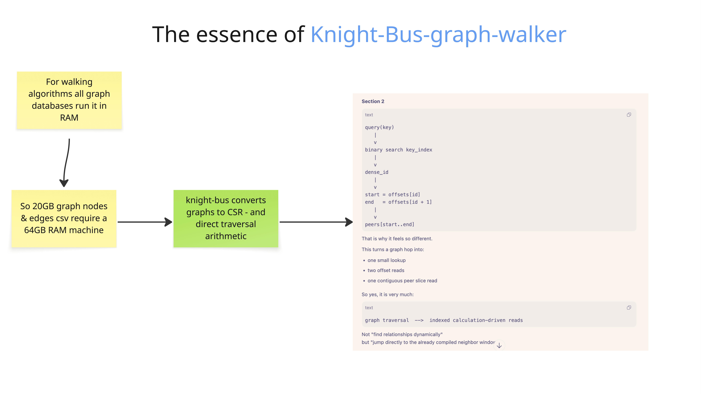

# Knight Bus Graph Walker v002

`v002` is the current benchmark record for Knight Bus Graph Walker.

The point of `v002` is simple:

- keep the Rust runtime in the immutable dual-CSR + mmap shape
- measure the RAM needed by the Rust walker process itself
- measure the RAM needed by the Neo4j server process itself
- prove Rust correctness separately through `verify`
- reuse the fixed `1 MB`, `50 MB`, and `2 GB` datasets without regenerating them

## What v002 Says

In `v002`, Knight Bus Rust is dramatically faster on walk latency across all three datasets and needs less RAM while running than Neo4j on all three datasets.

`RSS` means `resident set size`. In plain English here, read it as: `how much RAM the running process is holding onto`.

## Key Insights

Answer:

- In `v002`, Knight Bus Rust needs less RAM than Neo4j on all three datasets and remains dramatically faster on traversal latency.

Why this matters:

- The memory number here is the RAM needed by the running walker process itself.
- Build cost and verify cost are listed separately below, so the query-time RAM number stays easy to read.
- The result is not just "Rust is fast." The result is that the mmap + dual-CSR walker stays materially lighter at runtime while still answering the same fixed corpus correctly.

Evidence:

- `1 MB`: Knight Bus RAM needed while running is `78.9x` lower than Neo4j, and mean traversal latency is `833.6x` faster.
- `50 MB`: Knight Bus RAM needed while running is `42.5x` lower than Neo4j, and mean traversal latency is `6113.8x` faster.
- `2 GB`: Knight Bus RAM needed while running is `4.5x` lower than Neo4j, and mean traversal latency is `127498.8x` faster.
- The one important counterpoint is startup: Neo4j still opens faster on the `2 GB` run, so Knight Bus wins the walk path much more strongly than the cold-open path.

## v002 Runtime Comparison

### Latency

Table 1

| Dataset | Query corpus | Rust status | Neo4j status | Rust open ms | Neo4j open ms | Rust p50 ms | Neo4j p50 ms |
| --- | ---: | --- | --- | ---: | ---: | ---: | ---: |
| 1 MB | 18 | ok | ok | 0.258083 | 37.685375 | 0.00175 | 2.974563 |
| 50 MB | 60 | ok | ok | 4.32775 | 61.926542 | 0.002125 | 37.208291 |
| 2 GB | 60 | ok | ok | 189.978958 | 90.446458 | 0.004458 | 1096.492583 |

Table 2

| Dataset | Rust p95 ms | Neo4j p95 ms | Rust p99 ms | Neo4j p99 ms | Rust mean ms | Neo4j mean ms |
| --- | ---: | ---: | ---: | ---: | ---: | ---: |
| 1 MB | 0.018477 | 10.504973 | 0.02555 | 12.611896 | 0.005261 | 4.385152 |
| 50 MB | 0.020296 | 43.710169 | 0.0363 | 52.235973 | 0.006249 | 38.203163 |
| 2 GB | 0.028146 | 1382.781209 | 0.044948 | 1514.533206 | 0.008815 | 1123.882205 |

### RAM

| Dataset | Rust RAM needed while running (bytes) | Neo4j RAM needed while running (bytes) |
| --- | ---: | ---: |
| 1 MB | 6668288 | 525926400 |
| 50 MB | 14499840 | 616054784 |
| 2 GB | 234340352 | 1065615360 |

## Knight Bus Phase Costs

These are separate on purpose. They are not the same thing as the RAM needed while answering queries.

| Dataset | Build peak RAM needed (bytes) | Verify peak RAM needed (bytes) | Query-time RAM needed (bytes) |
| --- | ---: | ---: | ---: |
| 1 MB | 10977280 | 11059200 | 6668288 |
| 50 MB | 75300864 | 107954176 | 14499840 |
| 2 GB | 235143168 | 409452544 | 234340352 |

## Measurement Contract

- Rust `bench-corpus` loads only the snapshot and fixed query corpus
- Rust correctness is enforced before timing with `knight-bus verify`
- Neo4j correctness is enforced on the same fixed shared corpus
- `RSS` is the operating system memory number for the running process
- in this README, `RSS` means `RAM needed while running`
- the Rust RAM number is for the Rust walker process itself
- the Neo4j RAM number is for the Neo4j server process itself

## Main Records

- [Final-Testing-Journal-v002.md](./Final-Testing-Journal-v002.md)
- [journal-tests-202604-v002.md](./journal-tests-202604-v002.md)

## Release Links

- [v002 release](https://github.com/that-in-rust/knight-bus-graph-walker/releases/tag/v002)
- [v0.0.2 binary release](https://github.com/that-in-rust/knight-bus-graph-walker/releases/tag/v0.0.2)
