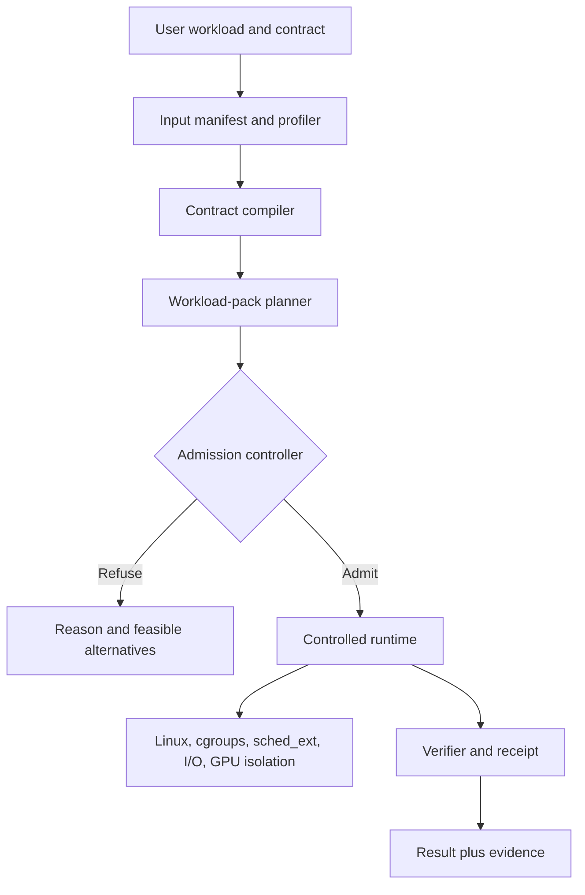

# PMF004: Deterministic Compute Opportunity Atlas

**Status:** Deep-exploration research dossier

**Date:** 2026-08-07

**Scope:** Algorithms, analytical jobs, cloud jobs, online services, and systems layers where bounded or predictable compute can create product value

**Project lineage:** [Knight Bus README](../README.md), [PMF001](PMF001-Strict-RAM-Scale-Scenarios.md), [PMF002](PMF002-Budget-Bounded-Batch-Compute.md), and the architecture evidence in `docs_PRD04/` and `docs_PRD06/`

---

## 1. Premise Check

### 1.1 The sound premise

There is a large, coherent problem hiding behind the phrase **Deterministic Compute**:

> A user should be able to describe a computation, an input envelope, and a resource or service envelope; the system should either produce a feasible physical plan and honor it, or reject the contract before wasting substantial compute.

That envelope may cover:

- maximum resident memory;
- maximum GPU memory;
- temporary disk and I/O volume;
- CPU or accelerator allocation;
- completion deadline or latency percentile;
- throughput floor;
- output exactness, approximation error, or confidence;
- retry and failure policy;
- power or energy ceiling;
- reproducibility conditions;
- degradation behavior when the preferred plan is infeasible.

This premise is supported by many existing mechanisms, but no single mechanism supplies the whole product:

- Linux cgroup v2 controls memory, CPU, and I/O resources.
- Batch schedulers accept memory, time, CPU, GPU, and deadline requests.
- analytical engines spill selected operators to disk;
- inference servers expose queue, batching, timeout, and concurrency controls;
- real-time networking performs admission control against bounded-latency envelopes;
- WebAssembly runtimes can meter deterministic instruction fuel;
- real-time and userspace schedulers reduce interference and tail latency;
- deterministic ML modes trade some performance or kernel availability for reproducibility.

The opportunity is not inventing every primitive. It is composing them into an **outcome-oriented contract system**.

### 1.2 Four corrections to the premise

#### Correction A: "Deterministic" has several meanings

These are related but not interchangeable:

| Determinism class | Question answered | Example |
|---|---|---|
| Result determinism | Will identical inputs produce identical outputs? | Bitwise-stable build or ML kernel |
| Resource determinism | Will the job stay within declared RAM, disk, I/O, and concurrency limits? | A 10 GB whole-process RSS cap |
| Temporal determinism | Will it complete or respond by a deadline? | p99 under 20 ms or finish by 06:00 |
| Quality determinism | If exact execution does not fit, what bounded loss is allowed? | Recall >= 0.95 or error <= epsilon |
| Failure determinism | What happens on overload, deadline miss, or hardware loss? | Refuse, checkpoint, degrade, or retry once |

A credible product must state which class it is guaranteeing.

#### Correction B: hard wall-clock guarantees are conditional

Hard memory and disk ceilings are often enforceable. Hard completion time on a shared, noisy cloud VM generally is not. Tail latency depends on hardware, operating-system scheduling, interrupts, power management, NUMA placement, co-tenants, storage, and network interference. Google research demonstrates that these factors can dominate p99.9 latency even when median service time is small ([Tales of the Tail](https://research.google/pubs/tales-of-the-tail-hardware-os-and-application-level-sources-of-tail-latency/)).

A temporal contract therefore needs an admitted execution envelope such as:

- named hardware and clock policy;
- reserved or isolated cores;
- bounded competing load;
- local storage or declared storage class;
- network topology and traffic envelope;
- calibrated input statistics;
- explicit failure assumptions.

#### Correction C: an operating system cannot solve this alone

The algorithm knows what can spill, tile, approximate, checkpoint, quantize, or stop early. The storage format controls bytes touched and locality. The runtime controls allocation and parallelism. The OS controls scheduling, isolation, I/O, interrupts, and page faults. Hardware controls caches, NUMA, clocks, accelerators, and thermal behavior.

Therefore the useful unit is a **cross-layer contract**, not merely a faster kernel.

#### Correction D: Rust is an enabling material, not the guarantee

Rust can improve memory safety, explicit ownership, allocator control, predictable object layout, static dispatch, zero-copy I/O, and deployment simplicity. It does not by itself make an algorithm bounded or remove queueing, I/O variance, page faults, cache misses, or GPU contention. RustHallows becomes differentiated when Rust is paired with contract-aware algorithms, storage, scheduling, and verification.

### 1.3 Premise verdict

**Premise is sound after narrowing the claim.**

The defensible thesis is not "make all cloud compute deterministic." It is:

> Make selected high-value computations contractible: preflight their feasibility, choose a workload-specific physical plan, enforce resource boundaries, expose the quality/time tradeoff, and emit evidence of what occurred.

---

## 2. Expert Lenses

### 2.1 Algorithm and data-structure architect

This expert asks whether the workload has a physical shape that can be exploited:

- sequential scan rather than random pointer traversal;
- frontier, bitmap, sparse vector, dense tile, hash partition, sorted run, or inverted list;
- exact, iterative, approximate, or anytime convergence;
- reusable immutable projection;
- predictable scratch-space equation;
- deterministic partitioning and merge behavior.

Their conclusion: the strongest differentiation comes from **workload packs**, not one universal executor.

### 2.2 Operating-systems and real-time engineer

This expert asks where variance enters after the algorithm is sound:

- involuntary preemption;
- IRQ placement;
- CPU frequency and thermal throttling;
- NUMA migration and remote memory;
- page faults and allocator behavior;
- storage queueing;
- network queueing;
- GPU kernel non-preemption;
- noisy neighbors.

Their conclusion: start on Linux with cgroups, CPU/NUMA pinning, preallocation, direct or asynchronous I/O, and an extensible scheduler. A new OS is a later optimization justified by measured residual variance.

### 2.3 Cloud platform and SRE economist

This expert asks what customers actually pay to avoid:

- OOM retries and failed overnight pipelines;
- overprovisioned instances and idle safety buffers;
- missed data-delivery windows;
- p99 incidents caused by maintenance or background work;
- unpredictable bills;
- inability to consolidate workloads;
- manual capacity tuning;
- expensive migration from local to distributed compute.

Their conclusion: the initial sale is **predictable economics and operations**, not philosophical determinism.

### 2.4 Product strategist

This expert asks which wedge has a short path to proof and a long path to platform:

- Graphs provide an existing Knight Bus proof and unusually strong storage specialization.
- SQL aggregation, joins, sorts, and backfills provide a much larger adjacent market.
- Security and code analysis combine graph/relational shapes with costly CI jobs and verifiable outputs.
- Classical ML, vector indexing, media, and scientific pipelines expand the pack library.
- Online inference and a specialized host runtime are attractive but crowded and operationally harder.

Their conclusion: sell a narrow proof-carrying engine first, then generalize the contract plane.

### 2.5 Skeptical systems engineer

This expert challenges five seductive claims:

1. Existing engines already expose memory limits, spill, timeouts, retries, and scheduling knobs.
2. Cost models fail on skew, compression variance, cache state, and shared infrastructure.
3. Exact low-memory algorithms can become unacceptably slow because of extra passes and I/O.
4. A separate physical format per algorithm can create preparation, update, and storage explosion.
5. A custom OS can consume years before a paying workload proves it is necessary.

The answer is to make these objections first-class product constraints:

- compare against the best configured incumbent, not its defaults;
- publish calibrated confidence intervals, not false precision;
- admit or refuse jobs based on observed envelopes;
- account for preparation and update cost;
- allow several packs to share common immutable columns, IDs, partitions, and compressed blocks;
- require a quantified variance budget before descending another layer of the stack.

---

## 3. Candidate Approaches

### 3.1 Conventional approach: a resource-aware batch wrapper

Wrap existing engines in Kubernetes, Slurm, or AWS Batch; ask users for CPU, RAM, disk, and time; monitor the job; retry on failure.

**Strengths**

- Fastest to ship.
- Broad engine compatibility.
- Useful operational telemetry.
- Low adoption friction.

**Weaknesses**

- It reserves or kills; it does not redesign the physical plan.
- It often learns the correct memory request only after a failed attempt.
- It cannot explain quality, storage, and execution tradeoffs.
- It is an orchestrator feature, not a deep computational advantage.

### 3.2 Alternative A: DetNet for compute

**Conceptual blend:** deterministic networking plus analytical execution.

Deterministic Networking admits a flow only when a controlled domain can provide its requested service, reserves resources, and calculates latency and buffer needs. The compute analogue is:

1. describe an input and workload envelope;
2. calculate memory, I/O, and time bounds for candidate plans;
3. reserve the needed resources;
4. refuse contracts that cannot be met;
5. run under policing and isolation;
6. report whether the envelope held.

IETF DetNet explicitly treats admission and refusal as part of providing bounded service, and its bounded-latency model calculates end-to-end latency and buffering before accepting a flow ([RFC 8655](https://www.ietf.org/rfc/rfc8655.html), [RFC 9320](https://www.ietf.org/rfc/rfc9320.html), [RFC 8578](https://datatracker.ietf.org/doc/html/rfc8578)).

**Why this blend is powerful:** it replaces "best effort plus monitoring" with "preflight plus admission."

### 3.3 Alternative B: safety case for compute

**Conceptual blend:** aviation and safety engineering plus cloud execution.

Every contract carries a structured argument:

- input fingerprint and measured statistics;
- selected algorithm and physical plan;
- resource equations and calibration evidence;
- assumptions and excluded failure modes;
- runtime monitors;
- result verifier;
- execution receipt.

This is **proof-carrying compute** in a practical, empirical sense. It need not begin with formal verification. It begins with an auditable chain from claim to benchmark to observed run.

**Why this blend is powerful:** deterministic compute is valuable partly because users can trust and audit it, not only because it is fast.

### 3.4 Alternative C: shipping containers for algorithms

**Conceptual blend:** logistics standardization plus algorithm-specific storage.

Global logistics scales because heterogeneous goods enter standard handling interfaces. Here, the common interface is a manifest plus immutable typed blocks, while each algorithm gets a pack optimized for its read pattern:

- graph CSR/CSC and frontier blocks;
- sorted runs for merge and window operations;
- partitioned columns for aggregation and joins;
- quantized cells and posting lists for vector search;
- tiled matrices for numerical kernels;
- checkpointable segments for iterative ML;
- ordered chunks for media and compression.

The common contract plane handles admission, accounting, and receipts. The pack owns physical layout and execution.

**Why this blend is powerful:** it avoids both extremes: one generic runtime for everything and a completely separate product for every algorithm.

### 3.5 Selected hybrid

Use all three alternatives together:

> **Contract plane + workload-pack compiler + controlled substrate + execution receipt.**

The DetNet model supplies admission and envelopes. The safety-case model supplies evidence and auditability. The logistics model supplies a scalable architecture for specialized algorithms and storage.

---

## 4. Chosen Thesis

### 4.1 Product definition

Deterministic Compute should be a system that accepts:

```text
workload + input manifest + semantic target + resource envelope + time envelope
         + quality policy + failure policy + hardware profile
```

and returns one of:

```text
ADMIT(plan, predicted envelope, confidence, assumptions)
REFUSE(reason, minimum feasible envelope, alternatives)
```

After execution it returns:

```text
RESULT + RECEIPT(input hash, plan hash, output hash, peak resources,
                 timing distribution, quality evidence, violations)
```

### 4.2 The core architecture



### 4.3 Contract fields

| Field | Examples | Guarantee class |
|---|---|---|
| Input identity | object hashes, row counts, graph N/E, schema | Hard |
| Semantics | exact PageRank, SQL result, top-k recall target | Hard definition |
| RAM | process RSS <= 10 GiB | Hard if whole process is controlled |
| Accelerator memory | GPU allocation <= 20 GiB | Hard with allocator and isolation caveats |
| Scratch disk | <= 500 GiB | Hard quota |
| I/O | <= 2 TiB read, <= 500 GiB write, <= 1 GB/s | Hard accounting or rate cap |
| Network | <= 100 GiB egress, reserved 10 Gbit/s path | Hard volume cap; conditional bandwidth |
| CPU | 8 reserved cores, 500 CPU-seconds | Hard allocation/accounting |
| Time | finish <= 45 min | Conditional hard or probabilistic |
| Startup | ready <= 250 ms from admitted warm state | Conditional temporal |
| Tail latency | p99 <= 20 ms at <= 5k requests/s | Conditional statistical |
| Jitter | 99.9% of loop intervals within +/- 50 microseconds | Conditional real-time |
| Quality | exact, epsilon, confidence, recall, optimality gap | Mathematical or empirical |
| Failure | zero retries, one checkpoint recovery | Hard policy |
| Recovery | restore <= 2 min from checkpoint <= 30 sec old | Conditional temporal plus hard policy |
| Energy | <= 2 kWh or 300 W cap | Hard cap, conditional work completion |
| Cost | <= $4 on a named provider/profile | Conditional on price and execution envelope |
| Reproducibility | same hardware/software and seed | Conditional result determinism |

### 4.4 Workload-pack interface

Each pack should provide:

1. **Manifest reader:** input size, shape, skew, sparsity, cardinality, compression, and update rate.
2. **Plan candidates:** in-memory, mmap, external-memory, tiled, streaming, approximate, and distributed variants.
3. **Resource equations:** fixed state, per-worker state, scratch state, I/O passes, and output state.
4. **Calibration model:** hardware-specific throughput and variance measurements.
5. **Admission test:** assumptions under which the contract is feasible.
6. **Executor:** bounded allocator, concurrency control, spill/checkpoint policy, and cancellation.
7. **Verifier:** semantic oracle, invariants, differential tests, or error bounds.
8. **Receipt schema:** predicted versus observed values and any degraded behavior.

---

## 5. Evidence and Verification

### 5.1 What already exists, and what remains missing

| Existing primitive | Evidence | What it proves | What remains missing |
|---|---|---|---|
| Per-operator spill | [DuckDB larger-than-memory workloads](https://duckdb.org/docs/current/guides/performance/how_to_tune_workloads), [PostgreSQL resource settings](https://www.postgresql.org/docs/17/runtime-config-resource.html), [ClickHouse memory guidance](https://clickhouse.com/blog/common-getting-started-issues-with-clickhouse) | Sorts, hashes, and aggregations can trade RAM for I/O | Whole-job prediction and receipt |
| Reactive worker thresholds | [Dask worker memory](https://distributed.dask.org/en/stable/worker-memory.html) | Systems can spill, pause, and terminate at thresholds | Preflight plan and semantic degradation policy |
| Fault-tolerant distributed spill | [Trino fault-tolerant execution](https://trino.io/docs/current/admin/fault-tolerant-execution.html), [Trino spill](https://trino.io/docs/current/admin/spill.html) | Exchange and retries can move state out of memory | Guaranteed total cost and universal operator coverage |
| Batch resource reservation | [Slurm sbatch](https://slurm.schedmd.com/sbatch.html), [AWS Batch resources](https://docs.aws.amazon.com/batch/latest/APIReference/API_ResourceRequirement.html) | Users value memory, CPU, GPU, time, and deadline declarations | Algorithm-aware transformation rather than kill/retry |
| Container resource controls | [Kubernetes resources](https://kubernetes.io/docs/concepts/configuration/manage-resources-containers/), [cgroup v2](https://docs.kernel.org/6.1/admin-guide/cgroup-v2.html) | Kernel-level accounting and ceilings are practical | Completion and output contracts |
| Deterministic instruction budget | [Wasmtime fuel and deadlines](https://docs.rs/wasmtime/latest/wasmtime/struct.Store.html) | A computation can be stopped at a repeatable instruction point | Whole-host I/O, host calls, and outcome planning |
| Approximation memory calculus | [Apache DataSketches HLL](https://datasketches.apache.org/docs/HLL/HllSketches.html), [Theta accuracy](https://datasketches.apache.org/docs/Theta/ThetaAccuracyPlots.html) | Memory and confidence can be explicit product knobs | Unified contract and operator selection |
| ML result determinism | [PyTorch deterministic algorithms](https://docs.pytorch.org/docs/main/generated/torch.use_deterministic_algorithms.html), [PyTorch reproducibility](https://docs.pytorch.org/docs/stable/notes/randomness.html) | Deterministic kernels can be selected or unsupported operations rejected | Resource and deadline determinism |
| Inference queue contracts | [Triton batchers](https://docs.nvidia.com/deeplearning/triton-inference-server/user-guide/docs/user_guide/batcher.html), [Triton rate limiter](https://docs.nvidia.com/deeplearning/triton-inference-server/archives/triton-inference-server-2460/user-guide/docs/user_guide/rate_limiter.html) | Delay, priority, queue size, and concurrency can be controlled | End-to-end model plus hardware guarantee |
| Hardware partitioning | [NVIDIA MIG](https://docs.nvidia.com/datacenter/tesla/mig-user-guide/introduction.html) | Accelerator resources and paths can be isolated | Cross-layer admission and model scheduling |
| Real-time network admission | [DetNet architecture](https://www.ietf.org/rfc/rfc8655.html), [DetNet bounded latency](https://www.ietf.org/rfc/rfc9320.html) | Bounded service can be calculated, admitted, and refused | Translation from flows to algorithms |
| Application-specific scheduling | [ghOSt](https://research.google/pubs/ghost-fast-and-flexible-user-space-delegation-of-linux-scheduling/), [Linux sched_ext](https://docs.kernel.org/7.0/scheduler/sched-ext.html) | Specialized policies need not start with a new OS | Workload contracts that drive policy |
| Microsecond preemption | [Shinjuku](https://www.usenix.org/conference/nsdi19/presentation/kaffes), [GPreempt](https://www.usenix.org/conference/atc25/presentation/fan) | Head-of-line blocking can be reduced on CPU and GPU | General deployment and workload integration |
| Storage-tail control | [SILK](https://www.usenix.org/conference/atc19/presentation/balmau), [PAIO](https://www.usenix.org/system/files/fast22-macedo.pdf) | Background I/O can be scheduled to protect foreground tails | A unified host resource contract |
| Hermetic results | [Bazel hermeticity](https://bazel.build/basics/hermeticity) | Input identity and environmental isolation enable reproducibility and caching | Resource and latency envelopes |

**Evidence conclusion:** the primitives are real. The integration thesis is plausible. The novelty is primarily in workload-specific planning, admission, and proof, not in claiming that resource control itself is new.

#### Novelty audit

| Element | New? | Strategic implication |
|---|---|---|
| Memory limits, CPU quotas, I/O throttles | No | Reuse the kernel and cloud primitives |
| Operator spill and external-memory algorithms | No | Compete on whole-plan composition and predictability |
| Deadlines, timeouts, and queue limits | No | Make them admission inputs rather than last-resort kills |
| Deterministic kernels and reproducible builds | No | Incorporate them as result-contract modes |
| Algorithm-specific data layouts | No | Build a differentiated pack library and preparation calculus |
| One typed contract spanning semantics, resources, time, quality, and failure | Not found as a general system in reviewed evidence | Candidate product layer; absence claim has medium confidence |
| Preflight admission plus feasible alternatives | Common in networking, uncommon across general compute | Strong conceptual transfer from DetNet |
| Portable execution receipt comparing predicted and observed envelopes | Partial precedents in tracing and provenance | Candidate trust and verification layer |

### 5.2 The computational shapes

Thousands of named algorithms reduce to a smaller family of physical execution shapes. These shapes are the right level for architecture reuse.

| Shape | Representative algorithms/jobs | Main bounded plan |
|---|---|---|
| Sequential transform | filter, map, parse, encode, compression, checksum | fixed-size chunks and bounded pipeline buffers |
| External ordering | sort, top-k, order-by, merge, index build | run generation plus bounded fan-in merge |
| Partition and aggregate | group-by, distinct, histogram, hash join | deterministic radix partitions, spill, skew isolation |
| Sparse traversal | BFS, reachability, WCC, PageRank, k-core | immutable CSR/CSC, bitmaps, bounded frontiers/vectors |
| Dense tiled algebra | GEMM, convolution, PCA blocks, FFT stages | cache/GPU tiles and explicit workspace |
| Iterative optimization | k-means, PageRank, SGD, gradient boosting | bounded state plus iteration, tolerance, or time stop |
| Search and anytime | MIP, routing, beam search, ANN | deadline stop plus best-so-far quality certificate |
| Sketch and sample | HLL, quantiles, reservoir, heavy hitters | fixed sketch size plus probabilistic error |
| Stateful stream | windows, joins, CEP, deduplication | state TTL, key partitions, watermarks, checkpoints |
| Log/segment maintenance | LSM compaction, Lucene merge, vacuum | I/O debt scheduler and foreground SLA protection |
| Request service | KV, inference, RPC, ad/fraud decision | admission, queues, preemption, isolated capacity |
| Sandboxed program | serverless, plugins, agents, CI steps | fuel, memory limiter, syscall/I/O policy, deadline |

The architecture should implement reusable primitives for these shapes, then expose domain-specific packs.

### 5.3 Comprehensive opportunity atlas

The examples below are not claims that every workload is an attractive first market. They define the reachable design space.

### Family A: graph and network analytics

**Algorithms and jobs**

- BFS, DFS, reachability, bounded-hop expansion;
- single-source and multi-source shortest path;
- Dijkstra, delta stepping, A*, and path enumeration with caps;
- PageRank and personalized PageRank;
- weakly and strongly connected components;
- triangle counting, motif counting, clustering coefficient;
- Louvain, Leiden, label propagation, modularity optimization;
- degree, closeness, betweenness, eigenvector, and harmonic centrality;
- k-core, k-truss, degeneracy, and peeling algorithms;
- node similarity, common neighbors, Jaccard, Adamic-Adar;
- random walks, graph embeddings, and sampling;
- graph projection, schema filtering, and adjacency materialization;
- code dependency, blast radius, fraud ring, identity, supply chain, and knowledge-graph analysis.

**Best contracts**

- exact result under RAM and scratch-disk caps;
- bounded iteration/tolerance for PageRank and communities;
- bounded frontier and output size for traversal;
- preprocessing cost and projection freshness explicitly included;
- immutable snapshot hash plus differential verification against Neo4j/GDS.

**Why it fits**

Graph algorithms frequently need only a narrow projection of the property graph. Algorithm-shaped CSR/CSC, bitmaps, compact IDs, and typed property columns can avoid the object and metadata overhead of a general OLTP engine. Knight Bus already supplies local evidence that this can matter substantially; those results are project evidence, not a universal benchmark claim.

### Family B: SQL, lakehouse, and data engineering

**Algorithms and jobs**

- scan, filter, projection, expression evaluation;
- group-by, rollup, cube, distinct, and approximate distinct;
- hash, merge, nested-loop, broadcast, and grace hash joins;
- sort, top-k, rank, window, and ordered aggregation;
- repartition, shuffle, exchange, union, intersect, and except;
- deduplication, change-data capture, merge/upsert, and reconciliation;
- Parquet/Arrow decode, encode, compaction, clustering, and file sizing;
- daily backfills, materialized-view refresh, metrics rollups, and attribution;
- data quality checks, schema validation, null/cardinality checks, and anomaly scans;
- feature engineering and batch dataset preparation.

**Best contracts**

- whole-process RSS, temp disk, read bytes, write bytes, and completion window;
- exact result by default, with explicit sketch/sampling alternatives;
- skew envelope and partition overflow policy;
- maximum number of passes and shuffle bytes;
- result hash or differential comparison against DuckDB, Spark, Trino, or ClickHouse.

**Why it fits**

Incumbents already spill selected operators, proving feasibility and demand. Their settings are often operator-local or reactive. PostgreSQL documents that `work_mem` may be consumed separately by multiple operations and workers, so total memory can be many multiples of the apparent setting ([PostgreSQL resource consumption](https://www.postgresql.org/docs/17/runtime-config-resource.html)). The opening is a whole-plan memory equation and predictable physical-plan selection.

### Family C: classical ML and statistical batch compute

**Algorithms and jobs**

- k-means and mini-batch k-means;
- linear and logistic regression;
- SGD, perceptron, passive-aggressive models, and online learning;
- Naive Bayes and incremental classification;
- decision trees, random forests, XGBoost, and histogram boosting;
- propensity scoring, churn, ranking, calibration, and batch prediction;
- PCA, truncated SVD, NMF, covariance, and feature selection;
- ALS and matrix factorization;
- nearest centroid, density estimation, and clustering evaluation;
- imputation, scaling, encoding, sampling, and feature materialization.

**Best contracts**

- fixed memory plus batch size;
- maximum passes/trees/iterations;
- validation metric floor or confidence band;
- deterministic seed and kernel policy;
- checkpoint and resume semantics;
- exact model comparison or tolerance-based metric verifier.

**Why it fits**

Scikit-learn explicitly lists incremental estimators including MiniBatchKMeans and SGD-family models ([scaling strategies](https://scikit-learn.org/stable/computing/scaling_strategies.html)). XGBoost supports external-memory training and documents the I/O tradeoffs ([external memory](https://xgboost.readthedocs.io/en/release_3.2.0/tutorials/external_memory.html)). The product opportunity is to compile an accuracy/time/RAM policy into a plan rather than requiring an expert to tune each library.

### Family D: vector search and information retrieval

**Algorithms and jobs**

- exact L2, inner-product, and cosine top-k;
- HNSW, NSG, Vamana, IVF, product quantization, scalar quantization;
- binary indexes, LSH, residual quantization, and reranking;
- k-means training for coarse quantizers;
- BM25, inverted indexing, posting-list intersection, and phrase search;
- index construction, segment merge, reindex, and deletion cleanup;
- hybrid lexical/vector retrieval and RAG candidate generation.

**Best contracts**

- memory bytes per vector and total index ceiling;
- recall@k, latency percentile, and throughput at admitted QPS;
- index-build time and scratch-space limit;
- update/delete policy and rebuild interval;
- exact subset or ground-truth recall verification.

**Why it fits**

Faiss exposes explicit bytes-per-vector formulas and speed/accuracy/memory choices across Flat, HNSW, IVF, SQ, and PQ indexes ([Faiss indexes](https://github.com/facebookresearch/faiss/wiki/Faiss-indexes), [index selection](https://github.com/facebookresearch/faiss/wiki/Guidelines-to-choose-an-index)). This is almost a native contract surface waiting for a compiler and receipt.

### Family E: model and LLM inference

**Algorithms and jobs**

- image, speech, ranking, recommendation, and anomaly inference;
- transformer prefill and decode;
- continuous/inflight batching;
- KV-cache allocation, eviction, prefix caching, and paging;
- speculative decoding and draft-model scheduling;
- embeddings, reranking, moderation, and RAG pipelines;
- multi-model colocation and GPU sharing;
- local and edge inference under power/RAM caps.

**Best contracts**

- TTFT, inter-token latency, p95/p99, throughput, and rejection policy;
- maximum batch delay and queue size;
- GPU memory and KV-cache budget;
- maximum input/output tokens and model set;
- quality policy for quantization or speculative decoding;
- admitted request-rate envelope.

**Why it fits**

Triton already treats batch size and queue delay as latency-throughput knobs and supports priority, timeouts, and queue limits ([Triton batchers](https://docs.nvidia.com/deeplearning/triton-inference-server/user-guide/docs/user_guide/batcher.html)). vLLM's PagedAttention partitions KV cache into blocks to reduce fragmentation ([vLLM documentation](https://docs.vllm.ai/_/downloads/en/v0.5.3.post1/pdf/)). NVIDIA MIG supplies hardware isolation. The gap is an end-to-end contract across request envelope, batching, memory, and hardware.

**Caution:** this is a crowded field. Differentiation must be stronger than another inference scheduler.

#### Training adjacency

Distributed model training and fine-tuning are also candidates:

- data loading, shuffling, augmentation, and tokenization;
- forward/backward kernels and optimizer state;
- gradient accumulation, checkpointing, and activation rematerialization;
- data, tensor, pipeline, and expert parallelism;
- all-reduce and interconnect scheduling;
- LoRA/adapter fine-tuning and batch embedding generation;
- spot interruption, elastic restart, and checkpoint placement.

Useful contracts include GPU-hours, GPU memory, checkpoint age, deterministic seed/kernel mode, maximum network bytes, loss/metric target, and finish-by deadline. The difficulty is that distributed completion time depends on accelerator topology, stragglers, collective communication, failures, and thermal/power behavior. This makes training a good long-term contract domain but a poor first pack.

### Family F: stream processing and event analytics

**Algorithms and jobs**

- tumbling, sliding, and session windows;
- keyed aggregates, stream-stream joins, and temporal joins;
- deduplication, change capture, and materialized streams;
- complex event processing and pattern detection;
- fraud rules, telemetry alerts, feature state, and online counters;
- watermarks, late-data correction, and state expiration;
- checkpoint, restore, rescale, and catch-up.

**Best contracts**

- maximum state size and TTL;
- event-time lateness and drop/side-output policy;
- sustained and burst input envelope;
- p99 event-to-result latency;
- checkpoint duration, recovery point, and recovery time;
- exactly-once or at-least-once semantics.

**Why it fits**

Flink exposes checkpoint timeout, unaligned checkpoints, state tuning, backpressure, and buffer tradeoffs ([checkpointing](https://nightlies.apache.org/flink/flink-docs-master/docs/dev/datastream/fault-tolerance/checkpointing/), [large state](https://nightlies.apache.org/flink/flink-docs-stable/docs/ops/state/large_state_tuning/), [network buffers](https://nightlies.apache.org/flink/flink-docs-release-2.2/docs/deployment/memory/network_mem_tuning/)). The opportunity is an admitted stream envelope and explicit overload behavior rather than indefinite backpressure.

### Family G: storage engines and database maintenance

**Algorithms and jobs**

- LSM flush, compaction, write amplification control, and tombstone cleanup;
- B-tree and column index build;
- Lucene segment merge;
- vacuum, garbage collection, and statistics refresh;
- backup, restore, checksum, scrubbing, and snapshot copy;
- replication catch-up, rebalancing, and shard migration;
- compression, tiering, archival, and erasure coding;
- WAL replay and recovery.

**Best contracts**

- foreground p99 protection;
- background I/O bandwidth and CPU ceiling;
- maximum compaction or merge debt;
- recovery-time objective and recovery-point objective;
- completion deadline for maintenance;
- write-amplification and temporary-space ceiling.

**Why it fits**

SILK showed that LSM maintenance interference can dominate tail latency and that scheduling/preemption can improve p99 substantially ([SILK](https://www.usenix.org/conference/atc19/presentation/balmau)). Lucene exposes merge concurrency and I/O throttling ([ConcurrentMergeScheduler](https://lucene.apache.org/core/9_9_1/core/org/apache/lucene/index/ConcurrentMergeScheduler.html)). This is a strong RustHallows systems use case, but integration into existing storage products is harder than standalone batch compute.

### Family H: security, code intelligence, and governance scans

**Algorithms and jobs**

- static analysis, taint flow, call graphs, and dependency reachability;
- CodeQL database construction and query suites;
- SBOM generation and transitive vulnerability matching;
- secret, malware, container, and package scanning;
- infrastructure-as-code and policy evaluation;
- data lineage, PII discovery, retention, and compliance checks;
- log forensics, e-discovery, and audit reconstruction;
- license and provenance analysis.

**Best contracts**

- repository/input hash and rule-pack hash;
- RAM, disk, threads, and CI completion window;
- no-file-skipped coverage receipt;
- incremental versus full-analysis semantics;
- deterministic alert set or explained allowed differences.

**Why it fits**

CodeQL exposes `--ram` and `--threads` but warns that file-backed mappings can exceed the nominal RAM threshold; GitHub recommends up to 64 GB or more for repositories above one million lines ([CLI manual](https://docs.github.com/en/enterprise-server%403.17/code-security/reference/code-scanning/codeql/codeql-cli-manual/database-analyze), [hardware guidance](https://docs.github.com/enterprise-cloud%40latest/code-security/code-scanning/creating-an-advanced-setup-for-code-scanning/recommended-hardware-resources-for-running-codeql)). The outputs are highly verifiable and the workloads overlap graph and relational execution, making this an unusually attractive adjacency.

### Family I: reproducible builds, tests, CI, and agent sandboxes

**Algorithms and jobs**

- hermetic compile, link, package, and test actions;
- remote execution and cacheable build graphs;
- fuzzing and property testing under instruction/time budgets;
- plugin execution and untrusted transformations;
- coding-agent commands, browser tasks, and tool sandboxes;
- notebook cells and user-defined functions;
- serverless event handlers.

**Best contracts**

- input/toolchain identity and hermetic filesystem;
- instruction fuel, wall time, memory, output bytes, and syscall policy;
- network allowlist and external-call budget;
- deterministic replay and action receipt;
- reject, trap, checkpoint, or yield behavior.

**Why it fits**

Bazel demonstrates that hermetic input identity enables reproducibility and caching ([Bazel hermeticity](https://bazel.build/basics/hermeticity)). Wasmtime supports deterministic fuel, lower-overhead epoch interruption, and resource limiters, while documenting that a store limiter does not cover every host allocation ([Wasmtime Store](https://docs.rs/wasmtime/latest/wasmtime/struct.Store.html), [resource limits](https://docs.rs/wasmtime/latest/src/wasmtime/runtime/limits.rs.html)). This is a credible path from deterministic jobs to safe AI-agent compute.

### Family J: media, documents, and signal processing

**Algorithms and jobs**

- video/audio transcode and transrate;
- image resize, format conversion, tiling, and thumbnail generation;
- OCR, speech recognition, diarization, and subtitle alignment;
- PDF rendering, extraction, and optimization;
- compression, decompression, deduplication, and checksumming;
- waveform, FFT, filtering, and feature extraction;
- map tiles, geospatial raster transforms, and point-cloud processing.

**Best contracts**

- maximum working set and pipeline buffers;
- frames/seconds or completion deadline;
- output bitrate, quality, resolution, or perceptual metric;
- bounded threads and hardware encoder allocation;
- input-corruption and partial-output policy.

**Why it fits**

These are naturally chunked or tiled and often have quality knobs. FFmpeg exposes thread, buffer, time-limit, and benchmarking controls ([FFmpeg documentation](https://ffmpeg.org/ffmpeg.html)). The market is established, but the differentiation must be predictable cost or local/edge operation rather than raw codec novelty.

### Family K: scientific, numerical, and life-sciences pipelines

**Algorithms and jobs**

- FFT, convolution, sparse/dense matrix multiplication;
- conjugate gradient, Krylov solvers, eigenvalue methods;
- finite-difference/finite-element stencils and PDE simulation;
- Monte Carlo, bootstrapping, Bayesian sampling, and risk simulation;
- genomics alignment, assembly, variant calling, and single-cell matrices;
- molecular dynamics, docking, and protein workflows;
- weather, climate, seismic, and computational-fluid-dynamics stages;
- geospatial joins, raster statistics, and route matrices.

**Best contracts**

- tile and checkpoint size;
- iteration, residual, or confidence target;
- CPU/GPU hours, node count, RAM, scratch, and network envelope;
- finish-before deadline;
- reproducibility seed, numerical mode, and tolerance;
- checkpoint/restart and spot-interruption policy.

**Why it fits**

Slurm already accepts memory, time, deadline, CPU, GPU, and topology controls, demonstrating demand for declared envelopes ([Slurm sbatch](https://slurm.schedmd.com/sbatch.html)). Workflow systems adapt memory and time after failed attempts, which demonstrates both demand and the weakness of reactive estimation ([Nextflow processes](https://nextflow.io/docs/edge/process.html)). A deterministic-compute planner could learn reusable stage-specific models and expose error/precision contracts.

### Family L: combinatorial optimization and planning

**Algorithms and jobs**

- linear, integer, and mixed-integer programming;
- constraint programming and SAT/SMT;
- vehicle routing, bin packing, assignment, and matching;
- scheduling, rostering, placement, and capacity planning;
- graph coloring, knapsack, and facility location;
- cloud fleet maintenance and VM migration planning.

**Best contracts**

- hard time or node budget;
- first-feasible deadline;
- optimality gap or best-bound certificate;
- maximum memory and parallel workers;
- deterministic seed and search strategy;
- incumbent solution returned on timeout.

**Why it fits**

These are naturally anytime computations. OR-Tools exposes solution and time limits for routing ([routing options](https://developers.google.com/optimization/routing/routing_options)). The contract can be honest: "return the best feasible solution in 10 minutes and report the gap," rather than falsely promising optimality.

### Family M: cryptographic, proof, and ledger compute

**Algorithms and jobs**

- password hashing and key derivation;
- Merkle tree construction, hashing, and integrity scans;
- zero-knowledge proof generation and verification;
- blockchain indexing, state replay, and historical analytics;
- privacy-preserving aggregation and secure computation stages.

**Best contracts**

- instruction, RAM, and accelerator budget;
- proof-size and verification-time ceiling;
- exact input and circuit identity;
- checkpoint and batch partitioning;
- output proof verification as the receipt.

**Why it fits**

Many jobs have deterministic work graphs and unusually strong output verifiers. The weakness is specialized hardware and rapidly changing proving systems. This is a research adjacency, not an initial wedge.

### Family N: low-latency online services

**Algorithms and jobs**

- key-value gets/puts and cache operations;
- search, ads, recommendation, fraud, and risk scoring;
- market-data processing and trading decisions;
- game simulation ticks and matchmaking;
- API gateways and high-fanout RPC services;
- feature lookup and online aggregation.

**Best contracts**

- p95/p99/p99.9 under an admitted arrival-rate and service-time envelope;
- maximum queue delay and queue depth;
- reserved cores, memory channels, NIC queues, and storage bandwidth;
- overload rejection or quality-degradation policy;
- foreground/background isolation.

**Why it fits**

The Tail at Scale shows why rare slowdowns become common at fanout ([Google research](https://research.google/pubs/the-tail-at-scale/)). Shinjuku, Caladan, Shenango, and ghOSt show that scheduling and interference control can sharply improve tails. This is technically important but operationally harder than batch compute because the contract covers a traffic distribution, not one static input.

### Family O: robotics, industrial, automotive, telecom, and edge control

**Algorithms and jobs**

- sensor fusion, localization, mapping, and path planning;
- control loops and actuator decisions;
- industrial inspection and machine vision;
- audio pipelines and interactive media;
- packet classification, virtual network functions, and radio scheduling;
- autonomous-vehicle perception and planning stages;
- medical-device and mixed-criticality computation.

**Best contracts**

- worst-case execution time and jitter;
- bounded queueing and end-to-end deadline;
- no allocation or page faults in critical paths;
- priority and mixed-criticality isolation;
- fail-safe transition on deadline miss;
- formal or high-assurance verification.

**Why it fits**

ROS 2 documents the need to avoid page faults, dynamic allocation, and indefinite blocking in real-time loops ([ROS 2 real-time](https://docs.ros.org/en/eloquent/Tutorials/Real-Time-Programming.html)). NVIDIA's automotive task manager treats worst-case timing and shared-resource contention as first-class concerns ([DRIVE STM](https://developer.nvidia.com/docs/drive/drive-os/6.0.9/public/driveworks-stm/stm_introduction.html)). This is the purest form of deterministic compute, but certification and domain liability make it a late, separate market.

### Family P: the cloud host and RustHallows substrate

**Performance areas**

- CPU scheduling, preemption, priorities, and core isolation;
- NUMA placement, memory bandwidth, huge pages, and page-fault policy;
- bounded allocators, arenas, and memory accounting;
- asynchronous/direct storage I/O and queue control;
- NIC queues, kernel bypass, traffic shaping, and congestion control;
- GPU partitioning, preemption, memory handoff, and power caps;
- microVM startup, snapshot restore, and sandbox isolation;
- clock, frequency, thermal, and energy policy;
- tracing, calibration, admission, and receipts.

**Relevant substrate evidence**

- `sched_ext` allows BPF-defined schedulers to be loaded and safely removed without replacing Linux ([Linux documentation](https://docs.kernel.org/7.0/scheduler/sched-ext.html)).
- ghOSt delegates scheduling policy to userspace and was evaluated on production data-center workloads ([ghOSt](https://research.google/pubs/ghost-fast-and-flexible-user-space-delegation-of-linux-scheduling/)).
- Shinjuku demonstrates microsecond preemption for mixed service times ([Shinjuku](https://www.usenix.org/conference/nsdi19/presentation/kaffes)).
- SPDK uses userspace polling, lockless message passing, and zero-copy techniques for low-variance storage paths ([SPDK](https://spdk.io/doc/about.html)).
- io_uring supplies shared submission/completion rings for asynchronous I/O, but is an efficiency primitive rather than a guarantee by itself ([io_uring](https://www.man7.org/linux/man-pages/man7/io_uring.7.html)).
- Firecracker demonstrates small Rust microVMs and controlled isolation for serverless workloads ([AWS Firecracker](https://aws.amazon.com/blogs/aws/firecracker-lightweight-virtualization-for-serverless-computing/)).
- GPU power limits, clocks, telemetry, and isolation are exposed through NVIDIA management interfaces ([nvidia-smi](https://docs.nvidia.com/deploy/nvidia-smi/index.html), [MIG](https://docs.nvidia.com/datacenter/tesla/mig-user-guide/introduction.html)).

**Verdict:** RustHallows is a plausible destination, but it should initially be a host profile and userspace runtime on Linux, not a from-scratch operating system.

### 5.4 Opportunity ranking

The score is a strategic estimate, not a market statistic. It combines customer pain, contract enforceability, preflight feasibility, storage/algorithm differentiation, output verifiability, adjacency to current work, economic value, and competitive headroom.

| Rank | Opportunity family | Score / 100 | Confidence | Why now | Main risk |
|---:|---|---:|---:|---|---|
| 1 | Graph analytics | 94 | 85% | Existing Knight Bus proof, high storage specialization, differential oracle | Projection/update cost and Neo4j surface-area distraction |
| 2 | SQL batch operators and backfills | 91 | 80% | Huge workload volume; exact outputs; spill and partition precedents | Mature incumbents and broad SQL semantics |
| 3 | Security, SBOM, and static analysis | 88 | 75% | Verifiable outputs, costly CI, graph/relational reuse | Language extractors and rule compatibility |
| 4 | Classical ML batch scoring/training | 86 | 75% | Natural batch/iteration knobs; daily workloads; cost sensitivity | Accuracy and reproducibility across libraries |
| 5 | Vector indexing and bounded-recall search | 84 | 75% | Explicit memory/recall/latency Pareto surface | Fast-moving, crowded ecosystem |
| 6 | Data-quality and observability rollups | 83 | 75% | Repetitive scheduled jobs; easy output checks | May be perceived as ordinary query optimization |
| 7 | Media and document processing | 80 | 70% | Chunkable; strong quality knobs; local/edge value | Commodity tooling and hardware codecs |
| 8 | Scientific and bioinformatics stages | 79 | 65% | Expensive jobs, explicit schedulers, checkpoints | Heterogeneous tools and domain-specific validation |
| 9 | Stream-state and checkpoint contracts | 78 | 65% | High pain from state growth and recovery variance | Dynamic arrival/skew makes hard contracts difficult |
| 10 | LLM/model inference | 77 | 70% | Severe VRAM and tail pain; isolation primitives exist | Extremely crowded; hardware volatility |
| 11 | Storage maintenance and compaction | 76 | 70% | Background work visibly harms foreground tails | Deep embedding in databases and storage engines |
| 12 | Optimization and planning | 75 | 75% | Deadline plus quality-gap semantics are natural | Solver incumbents already expose many knobs |
| 13 | CI, Wasm, and agent sandboxes | 74 | 70% | Fuel, hermeticity, and resource controls compose well | Host calls and external APIs escape determinism |
| 14 | Low-latency KV/RPC host runtime | 72 | 60% | Strong systems evidence and large value | Hardware, traffic, and deployment complexity |
| 15 | Energy-bounded batch/GPU compute | 71 | 60% | Power caps exist; energy cost is increasingly visible | Capping power may violate time contracts |
| 16 | Robotics/industrial/automotive | 69 | 55% | Hardest need for determinism | Certification, liability, and long sales cycles |
| 17 | Distributed AI training and fine-tuning | 68 | 55% | Huge spend; checkpoint, memory, and time pain | Topology, collectives, stragglers, and crowded tooling |
| 18 | Telecom/network functions | 67 | 55% | DetNet and real-time scheduling are direct precedents | Specialized ecosystem and hardware |
| 19 | Standalone custom OS product | 54 | 45% | Deepest possible control | No initial PMF, enormous compatibility burden |

#### Customer and cloud-job map

| Buyer or environment | Representative jobs | Most valuable contract |
|---|---|---|
| Data platform team | backfill, join, rollup, compaction, quality scan | finish window plus RAM/scratch/cost ceiling |
| Security engineering | CodeQL, SBOM, taint/reachability, container scan | complete coverage plus CI deadline and memory cap |
| Fraud and risk | graph rings, propensity scoring, Monte Carlo, daily features | exact/quality target plus fixed overnight cost |
| Recommendation/search | PageRank, embeddings, ANN build, reranking | recall/latency/RAM Pareto contract |
| AI infrastructure | inference, fine-tuning, batch embeddings, agent sandboxes | VRAM, p99, queue, token, and failure envelope |
| Media platform | transcode, OCR, thumbnails, speech, document conversion | quality plus finish time and accelerator budget |
| Life sciences | alignment, variant calling, sparse matrices, workflow stages | checkpointed finish-by contract under RAM/scratch limits |
| Finance | risk simulation, backtesting, optimization, market-data service | reproducibility, deadline, and audit receipt |
| Storage/database vendor | compaction, index merge, backup, restore, rebalance | foreground tail protection plus maintenance deadline |
| Edge/local developer | graphs, search, inference, media, analytics | strict RAM/power cap with graceful time tradeoff |
| Industrial/robotics | perception, control, signal processing, planning | worst-case timing, jitter, and fail-safe behavior |
| Cloud/SaaS operator | serverless, CI, plugins, customer-defined jobs | admission, isolation, predictable unit economics |

### 5.5 The best first product portfolio

#### Pack 1: immutable graph analytics

Start with the existing proof and make it contract-complete:

- PageRank;
- WCC;
- bounded-hop traversal or BFS;
- one path algorithm;
- projection preparation included in the receipt;
- exact Neo4j/GDS differential verification;
- declared RAM/time modes.

#### Pack 2: bounded relational batch

Implement a deliberately small operator spine:

- scan/filter/project;
- group-by;
- exact distinct and HLL distinct;
- external sort/top-k;
- one partitioned hash join;
- Parquet/Arrow input and output;
- differential verification against DuckDB or DataFusion.

This demonstrates that the thesis generalizes beyond graphs without attempting Spark compatibility.

#### Pack 3: code/security analysis

Reuse graph and relational primitives for:

- repository dependency graph;
- reachability or taint-like traversal;
- package/SBOM joins;
- deterministic incremental scan;
- coverage and alert receipt.

This may be a better commercial bridge than a generic database because buyers understand CI budgets and missed scan windows.

#### Pack 4: daily ML

Choose one constrained daily model workflow:

- mini-batch k-means or propensity/logistic scoring;
- Parquet input;
- strict RAM modes;
- time/accuracy Pareto curve;
- deterministic model artifact and metric receipt.

### 5.6 What should not be built first

1. A complete Neo4j rewrite.
2. A Spark-compatible distributed runtime.
3. A new SQL language.
4. A universal optimizer for arbitrary binaries.
5. A from-scratch operating system.
6. A generic LLM inference server.
7. Hard p100 promises on uncontrolled public-cloud instances.

These may contain useful future components, but each delays the shortest verification loop.

### 5.7 Honest guarantee matrix

| Claim | Honest today? | Required conditions |
|---|---|---|
| Process stays below 10 GiB RSS | Yes | Account all allocators/mappings; cgroup or equivalent; reserve runtime overhead |
| Job uses no more than 500 GiB scratch | Yes | Dedicated quota and cleanup policy |
| Job performs no more than 2 TiB logical reads | Yes | Runtime owns I/O path and accounting definition |
| Same input produces same exact integer result | Usually | Fixed algorithm/version and no external nondeterminism |
| Same floating result bit-for-bit | Sometimes | Same hardware, kernel/library versions, order, and deterministic kernels |
| Approximate count has stated confidence | Yes mathematically | Correct sketch assumptions and implementation |
| PageRank finishes in 20 minutes | Conditional | Input envelope, tolerance, hardware, isolation, calibrated throughput |
| API p99 < 20 ms at 5k QPS | Conditional statistical | Admitted arrival/service distribution and isolated capacity |
| p100 latency on shared cloud is bounded | Generally no | Requires stronger real-time and infrastructure control |
| Arbitrary third-party program gets transformed to fit RAM | No | Needs a supported workload pack or explicit checkpoints/spill semantics |
| Rust rewrite alone lowers tail latency | No | Must identify and remove the actual variance source |

### 5.8 Verification questions and answers

### Q1. Has the core idea already been done?

**Answer:** its components have. Resource schedulers, spill engines, real-time admission, deterministic kernels, Wasm fuel, and workload-specific schedulers all exist. The proposed integration of semantic contract, workload-specific physical plan, admission/refusal, and execution receipt is not shown by the reviewed sources as one general product. Confidence: **medium-high**, because absence claims can never be proved exhaustively.

### Q2. Can exact algorithms use bounded RAM?

**Answer:** many can through streaming, partitioning, tiling, external sorting, mmap, or repeated passes. Bounded RAM does not imply acceptable completion time. Data skew and random I/O can make a theoretically feasible plan practically poor. Confidence: **high**.

### Q3. Can latency be deterministic on commodity cloud hardware?

**Answer:** only conditionally. Admission, isolation, CPU policy, preemption, I/O control, and hardware profiles can greatly narrow tails. Hard worst-case guarantees require a much more controlled domain than a normal shared VM. Confidence: **high**.

### Q4. Is a custom OS necessary?

**Answer:** not initially. cgroups, CPU/NUMA isolation, preallocation, `sched_ext`, ghOSt-like policy, io_uring/SPDK, MIG, and microVMs provide a large experimental surface. Build a new kernel only when measurements show an important residual that these mechanisms cannot control. Confidence: **high**.

### Q5. Is graph still the right wedge?

**Answer:** yes for technical proof because the repository already has a measured end-to-end slice and algorithm-shaped storage. No if it becomes a demand to reproduce every Neo4j feature before testing willingness to adopt. Confidence: **high**.

### Q6. What is the largest adjacent market?

**Answer:** scheduled relational/data-engineering workloads are likely larger than graph analytics, but this is an inference rather than a sourced market-size claim. SQL operators are also the best test of whether the contract plane generalizes. Confidence: **medium**.

### Q7. What creates a moat if incumbents can add a memory flag?

**Answer:** the moat must be accumulated empirical and executable knowledge:

- workload-pack resource equations;
- calibration corpus across hardware and data shapes;
- specialized immutable formats;
- admission models and confidence tracking;
- verification fixtures and receipts;
- a planner that moves across exact, spill, approximate, and isolated modes.

A memory flag alone is not a moat. Confidence: **medium-high**.

### Q8. What would falsify the platform thesis?

**Answer:** any combination of these:

- preparation costs erase run-time savings for realistic update frequencies;
- cost predictions miss by more than the safety margin on common skew;
- users prefer overprovisioning because it is operationally simpler;
- only one domain benefits, so the common contract plane adds little reuse;
- incumbent engines match the result with configuration alone;
- receipts are admired but do not affect purchase decisions.

---

## 6. Final Synthesis

### 6.1 The strategic conclusion

The large vision is credible, but its winning sequence is the reverse of "build an OS and discover workloads."

> First make one computation contractible. Then make several computational shapes contractible. Then let their residual variance tell you what runtime and OS control must exist.

The product is not fundamentally a graph database, a Spark replacement, or an operating system. It is a **compiler and runtime for resource, time, quality, and failure contracts**, supplied through high-value workload packs.

### 6.2 The product ladder

| Horizon | Product | Proof required | Substrate |
|---|---|---|---|
| 0-6 months | Graph Contract Pack | Exactness, RAM, latency, preparation, repeatability versus GDS | Rust on Linux, mmap, bounded allocators |
| 4-10 months | Relational Batch Pack | Group-by/sort/join under hard RAM and scratch envelopes | Arrow/Parquet, external operators |
| 8-14 months | Receipt and Contract SDK | Third-party workload can declare, admit, run, and verify | cgroups, tracing, manifest schema |
| 10-18 months | Security or Daily-ML Pack | Cross-domain reuse of planner and receipt | Shared pack primitives |
| 15-24 months | Single-host Deterministic Runtime | Mixed jobs honor memory/I/O/priority contracts | CPU pinning, NUMA, sched_ext, io_uring |
| 20-36 months | GPU and Online Contract Runtime | p99/VRAM/QPS envelope under admitted load | MIG, batching, queue admission, power policy |
| 30-48 months | RustHallows Host Profile | Lower variance or higher consolidation than tuned Linux defaults | Minimal host services, microVMs, userspace policy |
| 42-60 months | Specialized OS or library OS | A measured, paid workload requires control Linux cannot provide | Custom kernel/library OS only where justified |

### 6.3 The trigger for descending the stack

Do not build a deeper layer because it is intellectually attractive. Descend only when all are true:

1. A paying or strongly validated workload misses its contract.
2. Profiling assigns at least 20% of the miss or variance to the lower layer.
3. Existing Linux controls cannot remove it within an acceptable operational envelope.
4. The improvement applies to at least two workload packs or one very valuable market.
5. A benchmark and verifier can prove the improvement before the rewrite begins.

### 6.4 The first canonical demonstration suite

1. **Graph:** run PageRank and WCC on an input too large for the declared RAM, with exact differential output and a receipt.
2. **SQL:** group and join 200 GB of Parquet on a 16 GB host, with hard RSS/scratch limits and a DuckDB/DataFusion oracle.
3. **ML:** train mini-batch k-means or score a propensity model under 8 GB, with metric and model-artifact verification.
4. **Mixed host:** run a latency-sensitive graph/query service while a background compaction or batch job consumes its declared I/O budget.
5. **Inference:** sustain an admitted QPS and p99 target while enforcing VRAM and queue contracts.
6. **RustHallows:** reproduce the suite under a host profile and show which variance disappears relative to tuned Linux controls.

### 6.5 Positioning

The strongest plain-language position is:

> **Compute with a contract. Know the memory, time, quality, and failure behavior before you run.**

The technical description is:

> A cross-layer compiler and runtime that converts workload semantics and input statistics into an admitted physical plan, enforces its resource envelope, and emits a verifiable execution receipt.

The internal research name can remain **RustHallows** for the controlled host/runtime layer. The company or open-source umbrella can remain **Deterministic Compute** if the promise is always qualified by contract class and execution assumptions.

---

## 7. Open Questions

### 7.1 Product questions

1. Which first buyer feels the pain most acutely: graph analyst, data engineer, security team, or local/edge developer?
2. Is the purchase driven by lower instance size, fewer failures, deadline confidence, auditability, or all four?
3. Will users adopt a new engine, or must the contract system wrap familiar SQL/CLI interfaces?
4. Is refusal before execution perceived as valuable guidance or as product failure?
5. What receipt fields change a production or procurement decision?

### 7.2 Technical questions

1. What minimum input statistics make admission reliable under skew?
2. How are mmap pages counted in the user-visible RAM contract?
3. What safety margin is needed across hardware, thermal, and kernel variation?
4. Which blocks and columns can be shared across algorithm-specific formats?
5. How is preparation amortized under different update frequencies?
6. How are conditional temporal contracts represented without misleading users?
7. Can plan calibration transfer between machine families, or must every profile be benchmarked?
8. Which verifier is strong enough for floating-point, approximate, and nondeterministic incumbents?

### 7.3 Research questions

1. Can a common algebra describe scan, partition, frontier, tile, sketch, and anytime shapes without becoming another universal engine?
2. Can the admission controller learn conservatively while preserving explainable worst-case fallbacks?
3. Can energy become a first-class contract alongside time and RAM?
4. Can proof receipts become portable across clouds and runtimes?
5. Can `sched_ext` or a ghOSt-style agent consume workload contracts directly?
6. What is the smallest RustHallows host that measurably improves two independent packs?

### 7.4 Immediate next research artifacts

1. `Contract-Schema-v0.md`: exact fields, hard/conditional/probabilistic types, and refusal semantics.
2. `Workload-Pack-Interface-v0.md`: planner, equations, calibration, executor, verifier, and receipt APIs.
3. `Graph-Pack-Resource-Equations.md`: PageRank, WCC, BFS, preparation, and output equations.
4. `SQL-Pack-Resource-Equations.md`: external sort, partitioned aggregation, distinct, and join equations.
5. `Deterministic-Benchmark-Protocol.md`: cold/warm runs, peak RSS, mmap accounting, I/O, p50/p95/p99, energy, and confidence.
6. `RustHallows-Variance-Budget.md`: allocator, page fault, scheduler, IRQ, NUMA, I/O, network, GPU, clock, and thermal contributions.

---

## Source Ledger

### Tail latency, scheduling, and host control

- Google, [The Tail at Scale](https://research.google/pubs/the-tail-at-scale/)
- Google, [Tales of the Tail](https://research.google/pubs/tales-of-the-tail-hardware-os-and-application-level-sources-of-tail-latency/)
- USENIX, [Shinjuku](https://www.usenix.org/conference/nsdi19/presentation/kaffes)
- Google, [ghOSt](https://research.google/pubs/ghost-fast-and-flexible-user-space-delegation-of-linux-scheduling/)
- Linux, [sched_ext](https://docs.kernel.org/7.0/scheduler/sched-ext.html)
- Linux, [PREEMPT_RT theory](https://docs.kernel.org/core-api/real-time/theory.html)
- USENIX, [Caladan](https://www.usenix.org/conference/osdi20/presentation/fried)
- USENIX, [Shenango](https://www.usenix.org/conference/nsdi19/presentation/ousterhout)
- USENIX, [GPreempt](https://www.usenix.org/conference/atc25/presentation/fan)

### Resource control and job scheduling

- Linux, [cgroup v2](https://docs.kernel.org/6.1/admin-guide/cgroup-v2.html)
- Kubernetes, [container resources](https://kubernetes.io/docs/concepts/configuration/manage-resources-containers/)
- Slurm, [`sbatch`](https://slurm.schedmd.com/sbatch.html)
- AWS, [Batch resource requirements](https://docs.aws.amazon.com/batch/latest/APIReference/API_ResourceRequirement.html)
- AWS, [Batch memory management](https://docs.aws.amazon.com/en_us/batch/latest/userguide/memory-management.html)
- Cloudflare, [Workers limits](https://developers.cloudflare.com/workers/platform/limits/)
- Wasmtime, [Store fuel and deadlines](https://docs.rs/wasmtime/latest/wasmtime/struct.Store.html)
- Wasmtime, [resource limits](https://docs.rs/wasmtime/latest/src/wasmtime/runtime/limits.rs.html)

### Analytics, batch, and streams

- DuckDB, [larger-than-memory tuning](https://duckdb.org/docs/current/guides/performance/how_to_tune_workloads)
- PostgreSQL, [resource consumption](https://www.postgresql.org/docs/17/runtime-config-resource.html)
- ClickHouse, [memory and spill guidance](https://clickhouse.com/blog/common-getting-started-issues-with-clickhouse)
- Spark, [performance tuning](https://spark.apache.org/docs/latest/tuning.html)
- Spark, [adaptive query execution](https://spark.apache.org/docs/3.5.5/sql-performance-tuning.html)
- Trino, [spill](https://trino.io/docs/current/admin/spill.html)
- Trino, [fault-tolerant execution](https://trino.io/docs/current/admin/fault-tolerant-execution.html)
- Dask, [worker memory](https://distributed.dask.org/en/stable/worker-memory.html)
- Apache DataFusion, [streaming and memory budgets](https://arrow.apache.org/blog/2023/06/24/datafusion-25.0.0/)
- Flink, [checkpointing](https://nightlies.apache.org/flink/flink-docs-master/docs/dev/datastream/fault-tolerance/checkpointing/)
- Flink, [large-state tuning](https://nightlies.apache.org/flink/flink-docs-stable/docs/ops/state/large_state_tuning/)
- Flink, [network buffer tuning](https://nightlies.apache.org/flink/flink-docs-release-2.2/docs/deployment/memory/network_mem_tuning/)

### ML, vectors, and inference

- Scikit-learn, [out-of-core and incremental learning](https://scikit-learn.org/stable/computing/scaling_strategies.html)
- XGBoost, [external memory](https://xgboost.readthedocs.io/en/release_3.2.0/tutorials/external_memory.html)
- PyTorch, [deterministic algorithms](https://docs.pytorch.org/docs/main/generated/torch.use_deterministic_algorithms.html)
- PyTorch, [reproducibility](https://docs.pytorch.org/docs/stable/notes/randomness.html)
- Faiss, [index memory formulas](https://github.com/facebookresearch/faiss/wiki/Faiss-indexes)
- Faiss, [index choice](https://github.com/facebookresearch/faiss/wiki/Guidelines-to-choose-an-index)
- vLLM, [PagedAttention documentation](https://docs.vllm.ai/_/downloads/en/v0.5.3.post1/pdf/)
- NVIDIA Triton, [batchers](https://docs.nvidia.com/deeplearning/triton-inference-server/user-guide/docs/user_guide/batcher.html)
- NVIDIA Triton, [rate limiter](https://docs.nvidia.com/deeplearning/triton-inference-server/archives/triton-inference-server-2460/user-guide/docs/user_guide/rate_limiter.html)
- NVIDIA, [MIG](https://docs.nvidia.com/datacenter/tesla/mig-user-guide/introduction.html)

### Storage, I/O, network, and power

- SPDK, [about](https://spdk.io/doc/about.html)
- Linux, [io_uring](https://www.man7.org/linux/man-pages/man7/io_uring.7.html)
- USENIX, [SILK](https://www.usenix.org/conference/atc19/presentation/balmau)
- USENIX, [PAIO](https://www.usenix.org/system/files/fast22-macedo.pdf)
- Zoned Storage, [ZNS](https://zonedstorage.io/docs/introduction/zns)
- IETF, [DetNet architecture](https://www.ietf.org/rfc/rfc8655.html)
- IETF, [DetNet bounded latency](https://www.ietf.org/rfc/rfc9320.html)
- IEEE, [Time-Sensitive Networking](https://1.ieee802.org/tsn/)
- NVIDIA, [`nvidia-smi`](https://docs.nvidia.com/deploy/nvidia-smi/index.html)
- Linux, [power capping](https://docs.kernel.org/5.17/power/powercap/powercap.html)

### Reproducibility, security, and specialized domains

- Bazel, [hermeticity](https://bazel.build/basics/hermeticity)
- GitHub, [CodeQL database analyze](https://docs.github.com/en/enterprise-server%403.17/code-security/reference/code-scanning/codeql/codeql-cli-manual/database-analyze)
- GitHub, [CodeQL hardware resources](https://docs.github.com/enterprise-cloud%40latest/code-security/code-scanning/creating-an-advanced-setup-for-code-scanning/recommended-hardware-resources-for-running-codeql)
- Apache DataSketches, [HLL](https://datasketches.apache.org/docs/HLL/HllSketches.html)
- Google OR-Tools, [routing limits](https://developers.google.com/optimization/routing/routing_options)
- ROS 2, [real-time programming](https://docs.ros.org/en/eloquent/Tutorials/Real-Time-Programming.html)
- NVIDIA DRIVE, [System Task Manager](https://developer.nvidia.com/docs/drive/drive-os/6.0.9/public/driveworks-stm/stm_introduction.html)
- AWS, [Firecracker](https://aws.amazon.com/blogs/aws/firecracker-lightweight-virtualization-for-serverless-computing/)

---

## Final confidence statement

| Claim | Confidence |
|---|---:|
| Bounded-compute primitives exist across many domains | 95% |
| A cross-layer contract and receipt product is technically feasible for selected workloads | 85% |
| Graph plus relational batch is the strongest technical sequence for this repository | 85% |
| Security/code analysis is a promising commercial adjacency | 75% |
| A shared contract plane can span five or more workload families | 65% |
| A specialized RustHallows host runtime will materially improve multiple packs | 60% |
| A from-scratch OS will become necessary and commercially justified | 35% |

The low confidence on the final claim is not pessimism. It is sequencing discipline. If the workload packs succeed, they will generate the measurements needed to decide whether RustHallows should remain a Linux runtime, become a library OS, or grow into a specialized operating system.
