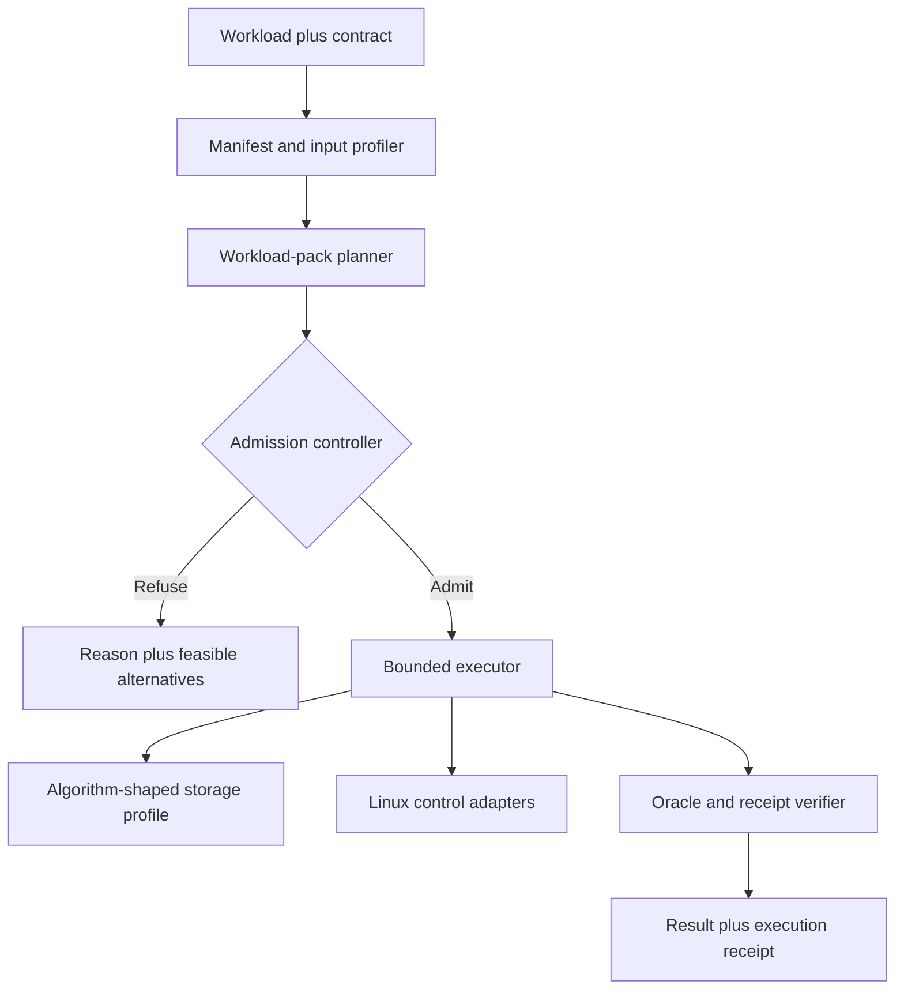

# PMF005: Deterministic Compute Operating Doctrine

**Status:** Consolidated strategic decision

**Date:** 2026-08-07

**Inputs:** [PMF001](PMF001-Strict-RAM-Scale-Scenarios.md), [PMF002](PMF002-Budget-Bounded-Batch-Compute.md), [PMF003](PMF003-Graph-Developer-Alpha-Radar.md), [PMF004](PMF004-Deterministic-Compute-Opportunity-Atlas.md), the Knight Bus evidence corpus, and the naming discussion

---

## The Decision

**Build Deterministic Compute as the umbrella for computations that run under explicit contracts. Start with proof-carrying graph jobs in Knight Bus. Generalize into other workload packs only after the graph contract, verification loop, and resource receipt work end to end. Build RustHallows only when measurements prove that Linux remains the limiting source of variance.**

This resolves four recurring ambiguities:

1. We are not primarily rewriting Neo4j.
2. We are not initially replacing Spark.
3. We are not beginning with a custom operating system.
4. We are not promising universal determinism on uncontrolled hardware.

We are building a system that makes supported computations **admissible, bounded, explainable, and verifiable**.

---

## Why This Is the Right Answer

### Situation

Knight Bus has already demonstrated the central physical insight: a graph algorithm does not need the full runtime representation of a general-purpose graph database. Immutable, algorithm-shaped storage can materially change resident memory and traversal latency.

The larger evidence corpus shows the same pattern elsewhere:

- analytical engines spill selected operators when memory is constrained;
- vector indexes expose explicit memory, recall, and latency choices;
- WebAssembly can meter deterministic instruction fuel;
- inference servers bound queues and batching delays;
- real-time networking admits or rejects requested service envelopes;
- custom schedulers and storage paths reduce interference and tail variance.

### Complication

The phrase "rewrite Neo4j in Rust" hides too many independent problems:

- OLTP storage and transactional semantics;
- Cypher parsing, planning, and runtime behavior;
- graph projection and preparation;
- algorithm state and physical layout;
- streaming, mutation, and writeback modes;
- API and procedure compatibility;
- memory estimation and admission;
- correctness oracles and benchmark methodology;
- page faults, scheduling, NUMA, I/O, and hardware variance.

A full rewrite postpones the first proof. A custom OS postpones it further. Rust alone is not a resource receipt.

The market language is also becoming crowded. Other projects already use phrases such as deterministic compute, deterministic systems, predictable compute, and execution contracts. The company must therefore own a precise operating definition, not rely on the words alone.

### Question

What is the smallest product that proves the broad Deterministic Compute thesis while creating a credible path from graphs to analytical jobs and eventually to a controlled runtime?

### Answer

Build a **Compute Contract system** with workload-specific packs.

For every supported workload, the system should:

1. identify the input and semantic target;
2. inspect data shape and execution assumptions;
3. propose one or more physical plans;
4. predict RAM, scratch, I/O, time, and quality envelopes;
5. admit or refuse the requested contract;
6. execute under enforced limits;
7. compare the result with an independent oracle;
8. emit a receipt of predicted and observed behavior.

---

## The Brand Architecture

| Layer | Working name | Meaning |
|---|---|---|
| Organization and category | **Deterministic Compute** | The broad mission: compute with explicit behavior contracts |
| Domain | **deterministic-compute.com** | Available in the observed Cloudflare registrar session; availability is not registration |
| Product primitive | **Compute Contracts** | Typed declarations for semantics, resources, time, quality, and failure behavior |
| Commercial product codename | **Tailbound** | The planner, admission controller, runtime, and receipt product; working name only |
| First workload pack | **Knight Bus** | Proof-carrying, budget-bounded graph computation |
| Future host/runtime | **RustHallows** | Controlled Rust runtime and possible specialized host layer |

### Naming judgment

**Deterministic Compute** is the right umbrella because it can hold graph analytics, SQL batch, security analysis, ML, vector indexing, inference, storage maintenance, and eventually host-level scheduling.

Its weakness is that "deterministic" can mean reproducible output, bounded resources, bounded time, or predictable failure. Every public claim must therefore name the contract class.

**Tailbound** is a useful product codename because it connects bounded resource tails and tail latency without forcing the organization to sound like one runtime implementation. It should not be treated as final until domain, GitHub organization, company-name, and trademark checks are complete.

Avoid relying on names such as Invariant Systems, Proofplane, or Deterministic Systems. They are already used or crowded. The defensible identity will come from the operating doctrine and benchmark evidence.

---

## What the First Product Does

### Input

```text
graph snapshot
+ algorithm or query shape
+ exactness/quality requirement
+ RAM and scratch limit
+ time or latency objective
+ hardware profile
+ failure policy
```

### Admission result

```text
ADMIT
  selected storage profile
  selected execution plan
  predicted resource envelope
  confidence and safety margin
  declared assumptions

or

REFUSE
  violated constraint
  minimum feasible envelope
  slower or approximate alternatives
```

### Execution result

```text
logical result
+ input, plan, and output hashes
+ phase timings
+ peak resident and mapped bytes
+ scratch and I/O bytes
+ page-fault and cache observations
+ oracle comparison
+ contract violations or degradation
```

The receipt is not observability attached after execution. It is part of the product contract.

---

## The First Graph Workload Set

### 1. PageRank proves iterative state and convergence contracts

PageRank exercises:

- immutable topology projection;
- degree precomputation;
- score vectors and message/state buffers;
- iteration, tolerance, and convergence policy;
- floating-point comparison;
- stream, stats, mutate, and writeback distinctions.

The receipt must include projection bytes, degree-vector bytes, score/state bytes, iteration count, convergence status, output extraction, and oracle delta.

### 2. WCC proves disjoint-set and equivalence-class verification

Weakly connected components exercises:

- parent/rank or equivalent arrays;
- union and compression behavior;
- component-size skew;
- partition strategy;
- arbitrary component labels that require equivalence-class comparison rather than brittle label equality.

The receipt must include disjoint-set bytes, selected strategy, partition state, union/compression metrics, component checksum, and equivalence validation.

### 3. BFS proves frontier and output-bound contracts

BFS exercises:

- frontier growth and skew;
- visited state;
- duplicate suppression;
- chunking and synchronization;
- target-found and depth-stop behavior;
- endpoint-only versus path-producing output.

The receipt must include per-depth frontier sizes, visited bytes, queue/chunk state, duplicate suppression, output rows, depth stop, and comparator status.

### 4. A complex variable-length read proves product relevance

Pure algorithms prove the OLAP core. A Neo4j-compatible complex read proves that the work matters to graph-database users.

The first complex-read fixture should combine:

- indexed anchor lookup;
- bounded variable-length expansion;
- frontier deduplication;
- filtering or predicates;
- aggregation, distinct, sort, or limit;
- output materialization.

This is where storage shape, planner eligibility, Cypher-like semantics, and bounded memory meet. Evidence from Samyama and Neo4j indicates that guarded variable-length rewrites and frontier-to-aggregation execution are a sharper differentiation surface than claiming a faster parser or another generic CSR engine.

---

## The Verification Spine

No performance claim is allowed to stand alone.

### Lane A: public algorithm verification

Use LDBC Graphalytics for:

- standard algorithms and datasets;
- expected output and validation modes;
- lifecycle and repetition rules;
- comparable processing-time logs;
- failure, timeout, and price-performance reporting.

Graphalytics is the public benchmark spine, not the whole product surface.

### Lane B: Neo4j and GDS behavioral comparison

Use Neo4j/GDS for:

- projection and procedure surface expectations;
- estimate procedures and memory-validation behavior;
- stream/stats/mutate/write modes;
- PageRank, BFS, and WCC state comparators;
- Cypher variable-length fixture behavior;
- output and writeback semantics.

GDS estimates are table stakes. Knight Bus must turn estimates into admission decisions, measured high-water receipts, alternative profiles, and fail-closed explanations.

### Lane C: mathematical and independent oracles

Use small hand-checkable graphs, reference implementations, GraphBLAS/LAGraph, and property-based invariants so that Neo4j parity does not become circular verification.

Implementation independence is insufficient without epistemic independence.

### Lane D: same-input resource comparison

Every public comparison must hold constant:

- logical graph and algorithm parameters;
- exactness mode;
- hardware and available resources;
- cold/warm state;
- projection/build inclusion policy;
- output-validation policy;
- run count and statistic;
- preparation, algorithm, writeback, serialization, and validation phases.

---

## The Storage-Profile Doctrine

A storage profile is not merely a file format. It is:

```text
topology placement
+ feature/state placement
+ compute placement
+ stage order
+ cache and locality policy
+ concurrency
+ resource envelope
+ preflight checks
+ correctness oracle
+ receipt schema
```

### Initial profiles

| Profile | RAM behavior | Latency behavior | Primary use |
|---|---|---|---|
| Dense in-memory | Highest | Lowest when admitted and warmed | Small graphs and latency-first mode |
| Immutable mmap | Low resident target; mapped footprint visible | Good when access is local and page faults are controlled | Default local analytical mode |
| Strict-RAM streamed | Hard resident cap with bounded buffers | Slower and more I/O-sensitive | Large graph on small host |
| Partitioned external | Hard per-partition state and scratch contract | Multiple passes; robust at scale | Skewed or too-large topology/state |
| Approximate/sketched | Fixed or sharply bounded state | Fast and predictable | Explicit quality-loss modes only |

Every profile must fail closed if required artifacts, capacity, mappings, or oracle conditions are missing.

### Shared substrate, custom state

Custom storage per algorithm does not mean duplicating the entire graph for every algorithm. Share:

- dense ID maps;
- immutable edge blocks;
- forward and reverse adjacency where justified;
- typed property columns;
- partition metadata;
- checksums and manifests.

Specialize:

- active state vectors;
- frontier representation;
- degree/weight sidecars;
- disjoint-set arrays;
- message buffers;
- cache/locality order;
- output materialization.

This prevents algorithm specialization from becoming storage explosion.

---

## The Architecture Sequence



### Layer 1: contract and receipt

Define the vocabulary before adding algorithms:

- hard, conditional, statistical, and mathematical guarantees;
- whole-process RAM and mmap accounting;
- phase boundaries;
- refusal and degradation semantics;
- source, plan, artifact, and output identity;
- predicted-versus-observed fields.

### Layer 2: graph workload pack

Implement resource equations, planners, executors, and verifiers for PageRank, WCC, BFS, and one complex read.

### Layer 3: controlled Linux runtime

Use existing mechanisms before inventing an OS:

- cgroup v2;
- allocator/arena control;
- CPU and NUMA pinning;
- preallocation and page-fault control;
- mmap and asynchronous/direct I/O where measured;
- `sched_ext` or userspace scheduling experiments;
- structured phase telemetry.

### Layer 4: second workload pack

The best generalization test is bounded relational batch:

- scan/filter/project;
- external sort/top-k;
- partitioned group-by/distinct;
- one join;
- Parquet/Arrow input;
- DuckDB/DataFusion differential oracle.

This tests whether Compute Contracts are a platform or merely a graph feature.

### Layer 5: RustHallows

RustHallows begins as a host profile and runtime, not a kernel. It grows downward only when:

1. a validated workload still misses its contract;
2. at least 20% of the miss or variance is assigned to the lower layer;
3. Linux controls cannot remove it economically;
4. the improvement benefits two packs or one valuable market;
5. the verification harness can prove the gain before implementation expands.

---

## The Next Ninety Days

### Days 1-30: make the contract executable

**Deliverables**

- `ComputeContractV0` schema;
- `ExecutionReceiptV0` schema;
- hardware/input manifest;
- cold/warm and RSS/mmap accounting protocol;
- Graphalytics plus GDS fixture manifest;
- resource equations for PageRank, WCC, and BFS;
- explicit admission/refusal tests.

**Exit gate**

Given a graph, algorithm, host, and RAM cap, the planner returns an explainable admit/refuse result before executing the algorithm.

### Days 31-60: ship one proof-carrying slice

**Deliverables**

- PageRank in dense and strict-RAM/mmap profiles;
- complete projection-to-validation phase receipt;
- GDS and independent oracle comparison;
- deterministic fixture suite;
- cap violation and missing-artifact failures;
- repeatable benchmark command.

**Exit gate**

One command produces baseline result, optimized result, oracle comparison, peak-resource evidence, and a readable receipt.

### Days 61-90: prove breadth without losing focus

**Deliverables**

- WCC and BFS profile receipts;
- one variable-length frontier-to-aggregation fixture;
- side-by-side product report;
- first bounded-SQL experiment;
- five design-partner interviews using actual receipts;
- domain and organization setup after naming clearance.

**Exit gate**

At least one external user says the contract or receipt changes a deployment, machine-size, failure-risk, or custom-code decision.

---

## Decision Gates

### Continue graph specialization when

- strict-RAM mode avoids an otherwise larger machine or failure;
- preparation cost amortizes over the real reuse window;
- the receipt explains a material RAM/latency delta;
- the result matches independent and GDS oracles;
- users value the bounded job more than generic database compatibility.

### Add a new workload pack when

- it reuses the contract, admission, executor, or receipt infrastructure;
- its outputs are independently verifiable;
- it has a clear resource/quality Pareto surface;
- a user already pays for overprovisioning, retries, or missed windows.

### Descend toward RustHallows when

- scheduler, page-fault, NUMA, I/O, IRQ, GPU, clock, or thermal variance is measured rather than suspected;
- the variance blocks a paid contract;
- an existing Linux mechanism has been tested and found insufficient.

### Stop or change direction when

- tuned incumbents match the result without custom storage;
- data preparation erases the execution benefit;
- predictions miss outside the declared safety margin;
- users prefer ordinary overprovisioning to admission/refusal;
- receipts do not affect trust or purchase decisions;
- every new algorithm requires an unrelated runtime.

---

## What We Are Explicitly Not Building Yet

- a complete Neo4j-compatible database;
- every Cypher feature;
- a general distributed graph engine;
- Spark compatibility;
- a universal optimizer for arbitrary binaries;
- a new operating system;
- hard p100 guarantees on uncontrolled public-cloud infrastructure;
- a benchmark that excludes projection, writeback, serialization, or validation;
- a performance story whose main independent variable is programming language.

---

## The Public Thesis

### One sentence

> **Deterministic Compute turns supported workloads into admitted execution contracts with bounded resources, explicit quality and failure behavior, and verifiable receipts.**

### The first proof

> **Knight Bus runs graph algorithms and bounded graph reads through algorithm-shaped storage profiles, then proves correctness, peak RAM, preparation cost, and latency against independent and Neo4j/GDS references.**

### The long-term ambition

> **RustHallows makes the host itself contract-aware after the workload packs reveal which operating-system and hardware variance actually matters.**

### The discipline

> **Do not promise determinism in the abstract. Name the input envelope, contract class, assumptions, refusal conditions, and receipt.**

---

## Immediate Next Artifacts

1. `Compute-Contract-Schema-v0.md`
2. `Execution-Receipt-Schema-v0.md`
3. `Graph-Pack-Resource-Equations-v0.md`
4. `Graphalytics-GDS-Verification-Fixtures-v0.md`
5. `PageRank-Proof-Slice-Executable-Spec.md`
6. `Deterministic-Compute-Naming-Clearance.md`

The next implementation goal should begin only after the first five are executable enough to define success and failure without interpretation.
