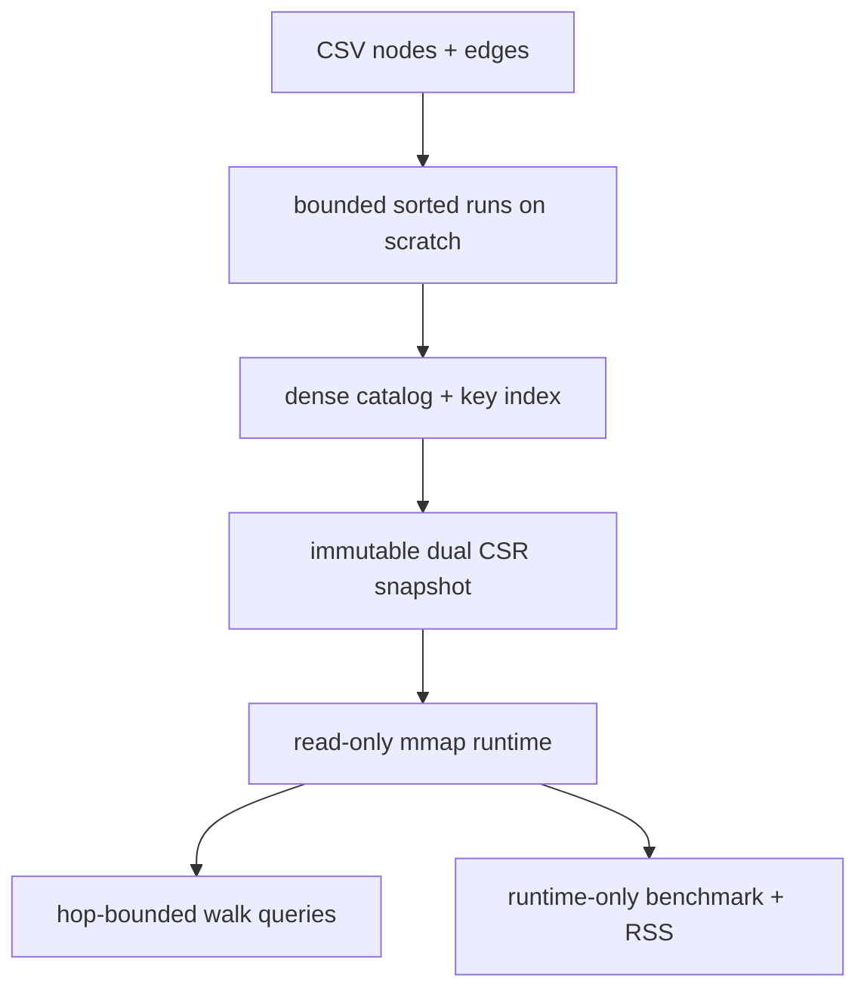

# Current Codebase Low-RAM Patterns

This note is about the current Knight Bus repository itself, not the mirrored
external repos from `Batch 07`.

The low-RAM outcome here does not come from one trick. It comes from a whole
shape:

1. CSV input is turned into bounded sorted runs.
2. Runs are merged with a small heap, not a giant in-memory graph.
3. The canonical graph is written as immutable sidecar files.
4. Query-time reads come from read-only `mmap`, not heap reconstruction.
5. Memory use is measured and reported per phase so the story stays honest.

The result is a file-backed graph runtime that keeps explicit heap use small
and pushes the steady-state graph representation into the OS page cache and the
snapshot files themselves.

## Architecture At A Glance



## What Actually Reduces RAM

| layer | code path | low-RAM mechanism | why it matters |
| --- | --- | --- | --- |
| build budget | [src/types.rs](/Users/amuldotexe/Desktop/personal-repos-lane/knight-bus-graph-walker/src/types.rs:419) | explicit `BuildMemoryBudget` with spill sizing | memory policy is a real object, not an implicit assumption |
| run generation | [src/low_ram.rs](/Users/amuldotexe/Desktop/personal-repos-lane/knight-bus-graph-walker/src/low_ram.rs:600) | estimate per-row heap cost and spill when the buffer crosses the budget | keeps the working set bounded while parsing CSV |
| run merge | [src/low_ram.rs](/Users/amuldotexe/Desktop/personal-repos-lane/knight-bus-graph-walker/src/low_ram.rs:478) | k-way merge over temp files with one live record per run | avoids loading the full input into memory |
| canonical catalog | [src/low_ram.rs](/Users/amuldotexe/Desktop/personal-repos-lane/knight-bus-graph-walker/src/low_ram.rs:670) | node keys are sorted once and written as compact sidecars | the runtime can resolve IDs without a hash map |
| snapshot layout | [src/snapshot.rs](/Users/amuldotexe/Desktop/personal-repos-lane/knight-bus-graph-walker/src/snapshot.rs:104) | immutable dual CSR files plus manifest | the hot path becomes file-backed arrays, not object graphs |
| runtime open | [src/runtime.rs](/Users/amuldotexe/Desktop/personal-repos-lane/knight-bus-graph-walker/src/runtime.rs:41) | read-only `mmap` for all snapshot sidecars | query-time heap stays small |
| query path | [src/runtime.rs](/Users/amuldotexe/Desktop/personal-repos-lane/knight-bus-graph-walker/src/runtime.rs:320) | binary search over key index, then slice peer arrays | query allocates only result vectors |
| measurement | [src/low_ram.rs](/Users/amuldotexe/Desktop/personal-repos-lane/knight-bus-graph-walker/src/low_ram.rs:272) | phase-level RSS sampling | the code can prove where memory spikes happen |

## 1. Budgeted External Sort

The builder does not keep the CSV graph in one giant in-memory structure.
Instead it parses rows into run records, estimates their heap cost, and spills
sorted runs to scratch when the budget is reached.

The policy is explicit in `BuildMemoryBudget`:

```rust
pub fn spill_buffer_bytes(self) -> usize {
    (self.bytes / 4).max(Self::MIN_BUFFER_BYTES)
}
```

That means the builder has a real memory ceiling and a smaller spill threshold
derived from it.

The default budget is 64 MiB, and the spill floor is 1 MiB, so there is a
clear lower bound even if the caller does not pass `--memory-budget-mb`.

The first pass for node IDs shows the pattern clearly:

```rust
let entry = NodeRunEntry {
    key: node_key.into_string(),
    row_index: display_row_index as u64,
};
buffer_bytes += entry.estimated_heap_bytes();
buffer.push(entry);
if buffer_bytes >= memory_budget.spill_buffer_bytes() {
    spill_sorted_records_now(&mut buffer, scratch_root, "node_keys", &mut run_paths)?;
    buffer_bytes = 0;
}
```

The same structure is used for edge source rows and edge target rows.

Why this helps:

- the code bounds live data by estimated bytes, not by total input size
- temp files absorb the overflow
- the live heap never needs to hold the full graph at once

## 2. K-Way Merge Instead Of Heap Reconstruction

Once the sorted runs exist, the code merges them with a small priority queue.
It does not reconstruct a large adjacency map.

```rust
struct SortedRunMerger<T> {
    readers: Vec<RunReader<T>>,
    heap: BinaryHeap<Reverse<HeapItem<T>>>,
}
```

Each run contributes at most one live record to the heap:

```rust
if let Some(record) = reader.next_record_now()? {
    heap.push(Reverse(HeapItem {
        value: record,
        run_index,
    }));
}
```

That is the classic external-merge pattern: low live memory, disk-backed
intermediate state, and predictable scaling.

## 3. Dense Catalog As A Sidecar, Not A Pointer Graph

The current code stores the graph's identity layer separately from the adjacency
layer.

`write_node_catalog_now()` writes three compact artifacts:

- `node_table.bin`
- `strings.bin`
- `key_index.bin`

The core write loop is intentionally simple:

```rust
strings_writer.write_all(entry.key.as_bytes())?;
node_table_writer.write_all(
    &NodeRecord {
        key_offset: string_offset,
        key_len,
        flags: 0,
    }
    .encode_le(),
)?;
key_index_writer.write_all(&node_count.to_le_bytes())?;
```

The important bit is what is *not* present:

- no per-node hash map survives into the runtime
- no object graph of nodes and edges survives into the runtime
- no repeated copies of the same string key are needed once the snapshot is
  written

The runtime later reconstructs keys from offsets into the `strings.bin`
sidecar.

The sidecars are also read through streaming views, not bulk-loaded records:

```rust
struct NodeCatalogStream {
    node_table: Mmap,
    strings: Mmap,
    dense_id_cursor: u32,
    node_count: u32,
}
```

`next_entry_now()` yields one `(dense_id, key)` pair at a time, and the same
shape is used for adjacency through `SnapshotEdgeStream`.

## 4. Immutable Dual CSR Snapshot

The on-disk graph is stored as forward and reverse CSR sidecars, plus a manifest
that says exactly what format is on disk.

The manifest records this explicitly:

```rust
storage_mode: "immutable_dual_csr".to_owned(),
```

The forward emission path writes the forward offsets and peers in one stream and
spools the reverse pairs into a scratch manifest for the second pass:

```rust
write_u64_le_now(&mut offsets_writer, 0, &forward_offsets_path)?;
while let Some(edge_pair) = merger.next_record_now()? {
    if previous_pair == Some(edge_pair) {
        continue;
    }
    while source_dense_id < edge_pair.from_dense {
        write_u64_le_now(&mut offsets_writer, unique_edge_count, &forward_offsets_path)?;
        source_dense_id += 1;
    }
    write_u32_le_now(&mut peers_writer, edge_pair.to_dense, &forward_peers_path)?;
    unique_edge_count += 1;
}
```

The reverse CSR is not a second in-memory graph. It is a second sidecar built
from the reversed edge pairs.

Why this matters:

- adjacency becomes flat arrays
- walk queries can use offset arithmetic instead of graph object traversal
- the runtime can stay mostly file-backed

## 5. Read-Only Mmap Runtime

The runtime opens the snapshot as read-only memory maps:

```rust
forward_offsets: map_file_read_only(snapshot_dir.join(FORWARD_OFFSETS_FILE_NAME))?,
forward_peers: map_file_read_only(snapshot_dir.join(FORWARD_PEERS_FILE_NAME))?,
reverse_offsets: map_file_read_only(snapshot_dir.join(REVERSE_OFFSETS_FILE_NAME))?,
reverse_peers: map_file_read_only(snapshot_dir.join(REVERSE_PEERS_FILE_NAME))?,
node_table: map_file_read_only(snapshot_dir.join(NODE_TABLE_FILE_NAME))?,
strings: map_file_read_only(snapshot_dir.join(STRINGS_FILE_NAME))?,
key_index: map_file_read_only(snapshot_dir.join(KEY_INDEX_FILE_NAME))?,
```

The safety story is also explicit:

```rust
// SAFETY: The file is opened read-only, the mapping is read-only, and the
// runtime stores the file-backed bytes without mutating them.
unsafe { Mmap::map(&file) }
```

The runtime verifies the snapshot before trusting it:

```rust
self.validate_mmap_size(...)?;
self.validate_offsets_mmap(...)?;
self.validate_node_records()?;
self.validate_key_index()?;
```

The seed key lookup is a binary search over the sorted `key_index.bin` sidecar,
not a hash map:

```rust
let mut low = 0_usize;
let mut high = self.manifest.node_count as usize;
let target = entity_key.as_str();

while low < high {
    let middle = low + (high - low) / 2;
    let dense_id = self.read_key_index_value(middle)?;
    let middle_key = self.key_str_for_dense_id(dense_id)?;
    match middle_key.cmp(target) {
        std::cmp::Ordering::Less => low = middle + 1,
        std::cmp::Ordering::Greater => high = middle,
        std::cmp::Ordering::Equal => return Ok(DenseNodeId::new(dense_id)),
    }
}
```

The query path does not rebuild the graph. It resolves the seed key with a
binary search and then walks the mmapped peer arrays:

```rust
let dense_id = self.resolve_dense_id(entity_key)?;
let mut neighbors = collect_neighbors_within_hops(dense_id.get(), hops, |current_dense_id| {
    self.read_neighbor_ids(DenseNodeId::new(current_dense_id), direction)
})
.into_iter()
.map(|neighbor_dense_id| self.key_for_dense_id(neighbor_dense_id))
.collect::<Result<Vec<_>, _>>()?;
neighbors.sort();
```

This is a very small per-query allocation shape:

- one result vector
- one or two hop frontiers
- no full graph materialization

The adjacency read is slice-based too:

```rust
let start = read_u64_from_mmap(offsets_mmap, dense_id.get() as usize) as usize;
let end = read_u64_from_mmap(offsets_mmap, dense_id.get() as usize + 1) as usize;
(start..end)
    .map(|index| read_u32_from_mmap(peers_mmap, index))
    .collect()
```

## 6. Honest RSS Measurement

The code does not just say "we think this is low RAM." It measures phase peaks.

The tracker samples the current process RSS and records a peak per phase:

```rust
fn track_phase_now<T, F>(
    peak_tracker: &mut PhasePeakTracker,
    phase: SnapshotPhase,
    operation: F,
) -> Result<T, KnightBusError>
where
    F: FnOnce(&mut PhasePeakTracker, &mut u64) -> Result<T, KnightBusError>,
{
    let mut phase_peak_rss_bytes = peak_tracker.sample_now();
    let result = operation(peak_tracker, &mut phase_peak_rss_bytes)?;
    peak_tracker.finish_phase_now(phase, phase_peak_rss_bytes);
    Ok(result)
}
```

The build and verify summaries preserve those peaks:

```rust
pub struct SnapshotBuildSummary {
    pub peak_rss_bytes: u64,
    pub peak_rss_source: PeakRssSource,
    pub phase_peaks: Vec<PhasePeakReport>,
}
```

The tests check that the phase accounting is actually populated:

- `BuildNodeRuns`
- `EmitForwardCsr`
- `VerifyForwardCsr`
- `QuerySmokeChecks`

That matters because the low-RAM claim is only useful if the code can say where
the memory went.

## 7. Snapshot-Only Benchmark Discipline

The benchmark path is intentionally separated from rebuild work.

`bench-corpus` now says it measures runtime-only snapshot replay, and the old
CSV flags are ignored:

> warning: `bench-corpus` now measures runtime-only snapshot replay;
> `--nodes-csv` and `--edges-csv` are ignored. Run `knight-bus verify --snapshot ...`
> `--nodes-csv ... --edges-csv ...` separately for correctness.

That separation matters:

- benchmark RSS reflects the runtime process
- correctness checking remains a separate step
- rebuild cost does not get mixed into query-time memory claims

## 8. Secondary In-Memory Oracle Shape

The repo still has a compact in-memory oracle path in `src/graph.rs`, but it is
careful to stay CSR-shaped rather than pointer-graph shaped.

```rust
let mut node_keys = truth_graph
    .nodes
    .iter()
    .map(|row| row.node_id.clone())
    .collect::<Vec<_>>();
node_keys.sort();

let deduped_edges = truth_graph
    .edges
    .iter()
    .map(|edge| (from_id, to_id))
    .collect::<BTreeSet<_>>();

let (forward_offsets, forward_peers) = flatten_adjacency_lists_now(&forward_lists)?;
```

That code is not the steady-state runtime path, but it is still aligned with the
same design language:

- dense IDs
- sorted adjacency
- flat offsets + peers arrays

## The Short Version

If I had to compress the current repo's low-RAM architecture into one sentence:

> Knight Bus keeps RAM low by turning graph work into bounded external sort,
> flat immutable sidecars, and read-only mmap traversal, then measuring the
> process at each phase so the memory story stays real.

## Source Pointers

- [src/low_ram.rs](/Users/amuldotexe/Desktop/personal-repos-lane/knight-bus-graph-walker/src/low_ram.rs:43)
- [src/runtime.rs](/Users/amuldotexe/Desktop/personal-repos-lane/knight-bus-graph-walker/src/runtime.rs:41)
- [src/snapshot.rs](/Users/amuldotexe/Desktop/personal-repos-lane/knight-bus-graph-walker/src/snapshot.rs:23)
- [src/types.rs](/Users/amuldotexe/Desktop/personal-repos-lane/knight-bus-graph-walker/src/types.rs:419)
- [src/main.rs](/Users/amuldotexe/Desktop/personal-repos-lane/knight-bus-graph-walker/src/main.rs:218)
- [src/bench.rs](/Users/amuldotexe/Desktop/personal-repos-lane/knight-bus-graph-walker/src/bench.rs:113)
- [src/graph.rs](/Users/amuldotexe/Desktop/personal-repos-lane/knight-bus-graph-walker/src/graph.rs:8)
- [tests/library_contract.rs](/Users/amuldotexe/Desktop/personal-repos-lane/knight-bus-graph-walker/tests/library_contract.rs:166)
