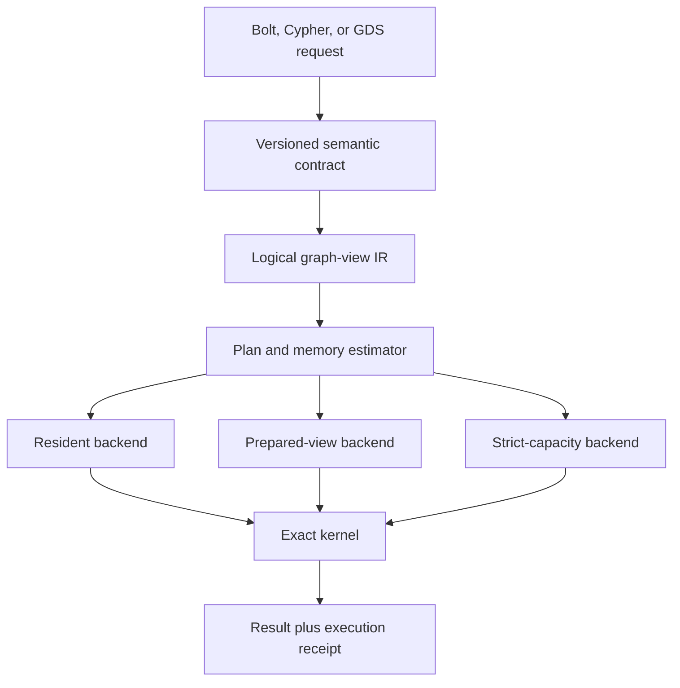
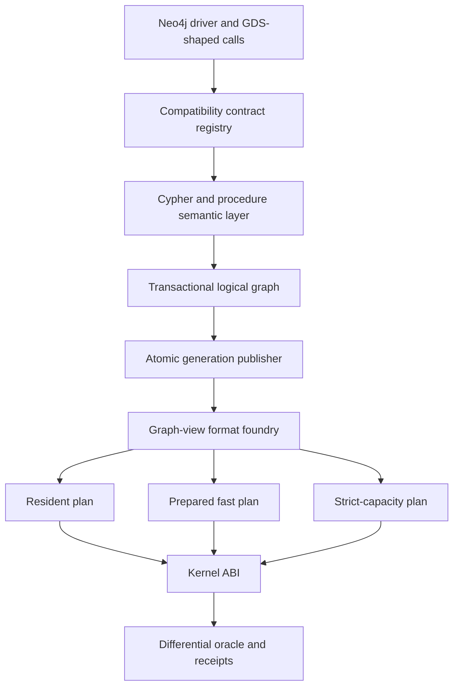
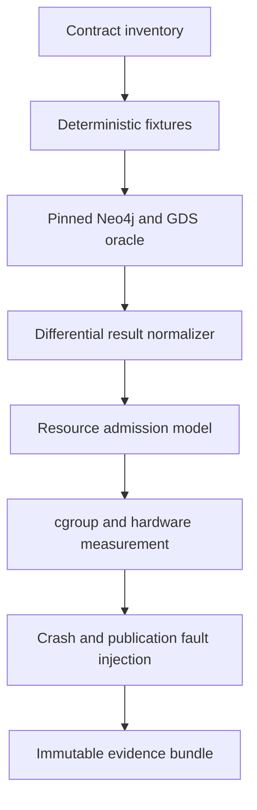

# Neo4j-Compatible Rust: Prior Art, Feasibility, And Risk

<!-- markdownlint-disable MD013 MD024 MD033 MD060 -->

- **Research cutoff:** 2026-07-10
- **Document status:** Decision research, not a performance claim
- **Governing local documents:** [PRD L1](../docs_PRD04/prd-l1.md),
  [Sol-01](Sol-01.md),
  [Rewrite feasibility](Neo4j-Rust-Rewrite-Feasibility.md), and
  [two-scenario estimation](Neo4j-Rust-Two-Scenario-Estimation.md)

## Answer First

The Knight Bus objective is technically possible in a narrower and more useful
sense than "rewrite all of Neo4j in Rust and make everything faster."

The internet and research record show that almost every important mechanism has
already been demonstrated independently:

1. A non-JVM graph database can expose Cypher and Bolt. Memgraph is the mature
   precedent; Grafeo is a young Rust precedent.
2. A transactional OLTP source can publish a graph-shaped analytical copy.
   GART is the closest direct research precedent.
3. Exact graph algorithms can process graphs larger than RAM on one machine.
   GraphChi, X-Stream, FlashGraph, GridGraph, and NXGraph establish this.
4. Immutable snapshots, persistent graph structures, and compressed adjacency
   can reduce memory and support direct graph access. Aspen, WebGraph,
   Zuckerli, Ligra+, and TerminusDB establish different parts of this.
5. Algorithm code can be separated from physical scheduling and layout.
   GraphIt and GraphBLAS establish this design space.
6. Correctness and performance can be judged with public suites. openCypher
   TCK, LDBC SNB, LDBC Graphalytics, and GAPBS provide complementary evidence.

What has **not** been found is one mature, independently audited product that
combines all of the following:

- broad Neo4j client and behavioral compatibility;
- a broad Neo4j GDS-compatible procedural surface;
- a Rust implementation;
- exact algorithm-specific immutable physical views;
- a hard whole-machine RAM contract such as 50 GB logical graph processing on
  an 8 GB-class machine;
- a resident mode that also beats tuned Neo4j/GDS latency;
- production-grade transactions, recovery, observability, security, backup,
  and operational tooling.

That conjunction is the research contribution and the risk. The individual
mechanisms are not speculative. Their composition, compatibility boundary, and
economic value are.

The strongest strategy is therefore **not a line-for-line whole-product port**.
It is a proof-carrying compatibility system with three explicit execution
classes:

| Execution class | Promise | Honest latency position | Main mechanism |
|---|---|---|---|
| Compatible resident | Same accepted semantics with topology and state resident | Compete with GDS; no automatic Rust win | compact native structures, parallel kernels, low allocation |
| Prepared fast view | Same accepted semantics after view preparation | Can beat GDS only when it removes bytes, work, passes, or materialization | algorithm-shaped immutable views and schedule selection |
| Strict capacity | Complete approved jobs inside a hard total-RAM budget | Usually slower than resident execution | streaming, windowing, compression, bounded state, pre-admission |

The immediate decision is **go on the proof, no-go on the broad rewrite**. Build
one exact WCC slice and one iterative PageRank slice, while simultaneously
testing whether Grafeo, Samyama, Memgraph, GraphScope NeuG, or their components
can eliminate years of compatibility work.

## Confidence-Calibrated Verdict

| Question | Verdict | Confidence | Why |
|---|---|---:|---|
| Can Rust implement a useful Neo4j-compatible server? | Yes | High | Mature non-JVM precedents exist; a young Rust implementation already exposes Bolt and Cypher claims. |
| Can selected exact graph algorithms run on data larger than RAM? | Yes | High | Multiple peer-reviewed external and semi-external graph systems demonstrate it. |
| Can a transactional store publish immutable analytical graph generations? | Yes | High | GART, Kineograph, Aspen, GraphOne, LiveGraph, and database snapshot practice establish the mechanisms. |
| Can a prepared representation use less RAM and run faster? | Yes, for selected workloads | Medium-high | Compression, direct access, direction optimization, cache-aware layouts, and schedule compilers show dual wins, but not universally. |
| Can every GDS algorithm be both lower-RAM and faster than resident GDS? | No credible basis | High | Algorithm state, random access, iterative passes, and memory bandwidth impose incompatible requirements. |
| Does moving from Java to Rust itself create a large PageRank speedup? | No | High | Resident PageRank is dominated by topology bytes, memory bandwidth, synchronization, and convergence, not JVM dispatch alone. |
| Is `io_uring` a decisive differentiator? | No | High | It helps storage lifecycle and external-memory plans; it does little in a fully resident kernel, and Neo4j now uses it in selected page-cache paths. |
| Can the complete public Neo4j/GDS product be faithfully recreated from public tests alone? | Not established | High | Public specifications cover parts of the behavior, not every product, enterprise, operational, and compatibility contract. |
| Is a useful proof possible in 90 days? | Yes | Medium-high | A narrow WCC plus PageRank differential harness is tractable; a broad product rewrite is not. |
| Is the complete replacement a weekend project? | No | Very high | The query, transaction, recovery, protocol, operational, and algorithm surfaces are separate systems with distinct test obligations. |

## Phase 0: Premise Check

### The Core Objective

The objective inferred from the local PRD corpus is:

> Preserve an explicitly accepted Neo4j-facing OLTP and client surface, preserve
> exact accepted GDS semantics for selected procedures, and use Rust plus
> algorithm-aligned immutable analytical storage to offer either lower latency,
> lower total RAM, or both, with every claim accompanied by reproducible
> correctness and resource evidence.

This is materially different from four easier projects:

- a fast graph file reader;
- a graph algorithm library;
- an openCypher-like database;
- a benchmark that compares one Rust function with an end-to-end Neo4j query.

Knight Bus only becomes the intended product when those layers are connected by
observable compatibility, generation, memory, and recovery contracts.

### Ambiguity 1: "All The ArXiv Papers"

The request appears to mean arXiv papers. An exhaustive list of all papers that
could somehow relate to graph databases, graph processing, compression,
transactions, compilers, operating systems, and benchmarking is neither finite
nor useful. New papers also arrive continuously.

This document instead performs a **systematic high-relevance scan** across these
query families:

1. external-memory and semi-external graph processing;
2. compressed and succinct graph representations;
3. dynamic graph storage and immutable snapshots;
4. transactional-to-analytical graph publication;
5. graph execution scheduling and sparse algebra;
6. Cypher, Bolt, and non-JVM or Rust graph databases;
7. graph correctness and performance benchmarks;
8. `io_uring` and database I/O;
9. dynamic and incremental PageRank limits;
10. licensing and clean-room compatibility risk.

The source ledger at the end is broad enough to shape architecture and
verification. It does not claim bibliographic completeness.

### Ambiguity 2: "Same Neo4j Surface"

There is no single Neo4j surface. At minimum, the phrase can include:

| Surface | Examples | Public oracle quality |
|---|---|---|
| Wire protocol | Bolt versions, authentication, routing, telemetry, failures | Good protocol documentation; no complete standalone server certification found |
| Driver behavior | sessions, transactions, retries, notifications, value encoding | Official drivers and driver test infrastructure help, but server-side parity remains differential work |
| Query language | Cypher syntax, values, nulls, coercions, updates, plans, errors | openCypher TCK is strong but does not define every Neo4j extension or version behavior |
| OLTP semantics | isolation, locks, constraints, indexes, crash recovery, durability | Public docs plus black-box differential and fault tests are required |
| Administration | users, roles, databases, backup, restore, clustering, monitoring | Large, edition-dependent, and only partly represented by public tests |
| GDS catalog | project, list, drop, mutate, write, stream, estimate | Official manuals and a runnable GDS oracle are the strongest sources |
| GDS algorithms | defaults, orientation, weights, convergence, tie behavior, output schema | Procedure-specific differential tests are required |
| GDS ML | pipelines, models, train/split/catalog lifecycle | A separate product surface, not just graph kernels |

The rewrite must therefore maintain a versioned **compatibility manifest**. A
claim such as "Neo4j-compatible" without that manifest is not falsifiable.

### Ambiguity 3: "Lower RAM"

Lower Java heap, lower Rust allocator bytes, lower RSS, and lower machine memory
are different claims. mmap does not make memory free. File-backed pages still
occupy page cache and count against cgroup memory in the conditions relevant to
the strict lane.

The only acceptable strict-memory claim is:

```text
total observed cgroup or machine peak
  = anonymous memory
  + file-backed resident pages
  + kernel-accounted memory
  + runtime stacks and metadata
  + I/O buffers
  + result buffering
  + all cooperating processes charged by the contract
```

### Ambiguity 4: "Faster"

At least four clocks matter:

```text
T_ingest
T_publish
T_prepare_view
T_execute_until_first_result
T_execute_until_last_result
```

A prepared-view benchmark may report `T_execute` separately, but it must also
report first-request total and amortization count. Otherwise a system can hide
hours of indexing behind a millisecond query.

### Premise Resolution

The central premise is sound after these corrections:

- exact selected algorithms can be served from physical forms different from
  the OLTP representation;
- the product must expose explicit semantic, freshness, memory, and preparation
  contracts;
- lower RAM and lower latency are per-plan claims, not universal properties;
- public evidence can drive a verification-first build, but cannot substitute
  for running a pinned Neo4j/GDS oracle.

Proceeding with the optimized protocol.

## Phase 1: Expert Lenses And Knowledge Scaffolding

This assessment uses five explicit lenses rather than one synthetic opinion.

### 1. Graph Systems Architect

Questions:

- Which topology and property layouts match each algorithm family?
- Which layouts preserve exact semantics?
- What is the minimum resident state?
- Where do multiple orientations or indexes save work versus duplicate bytes?

### 2. Database And Recovery Engineer

Questions:

- How does an OLTP commit become an immutable analytical generation?
- What is the snapshot watermark?
- What survives a crash during build or publication?
- Can old readers continue while a new generation is published?

### 3. Algorithms And Compiler Engineer

Questions:

- Can one logical kernel target push, pull, edge-streaming, compressed, and
  resident schedules?
- Which schedule choices are semantic and which are purely physical?
- Can the planner estimate bytes, passes, synchronization, and working set?

### 4. Verification And Performance Engineer

Questions:

- What is the independent oracle for every output?
- Are preparation, cache state, result materialization, and whole-machine RAM
  charged symmetrically?
- What experiment would falsify each headline claim?

### 5. Skeptical Engineer

Questions:

- Are we rebuilding a mature database to optimize a narrow workload?
- Is the improvement from Rust, from a different contract, or from an unfair
  boundary?
- Does an existing project already solve enough of the problem to fork or use?
- Are licensing, protocol drift, operational scope, and format proliferation
  larger risks than algorithm implementation?

### Required Knowledge Domains

The architecture crosses these domains:

- graph representations: CSR/CSC, edge lists, compressed adjacency, factors;
- graph algorithms: traversal, connectivity, ranking, communities, similarity,
  paths, embeddings, and incremental variants;
- database internals: WAL, MVCC, indexes, locking, recovery, checkpoints;
- query systems: parsing, typing, logical plans, physical plans, vectorization;
- protocols: Bolt framing, values, sessions, transactions, version negotiation;
- operating systems: page cache, mmap, NUMA, cgroups, direct I/O, `io_uring`;
- verification: differential testing, metamorphic properties, fault injection,
  deterministic fixtures, statistical benchmarking;
- product and law: compatibility scope, licensing, trademarks, clean-room
  implementation, ecosystem support.

## Phase 2: Candidate Approaches

### Conventional Approach: Faithful Whole-Product Port

Port the public Neo4j architecture and behavior into Rust, preserve the same
logical layers, then optimize hot paths.

Benefits:

- clear oracle and behavioral target;
- easiest conceptual mapping from upstream code;
- early reuse of tests and fixtures where licensing permits;
- fewer novel mechanisms initially.

Failure modes:

- repeats incumbent physical choices and therefore repeats many memory and
  bandwidth limits;
- spends years on administration, recovery, query edge cases, and tooling
  before testing the low-RAM OLAP thesis;
- assumes public source and tests define closed or edition-specific behavior;
- creates a large moving-target port while upstream continues to evolve.

Verdict: useful as a compatibility reference, poor as the primary delivery
strategy.

### Conceptual Blend A: A Graph Database As A Compiler Toolchain

Blend graph processing with compiler backend design.

The external query or GDS procedure becomes source language. A normalized
logical graph view becomes intermediate representation. Resident CSR, reverse
channels, compressed pages, factor-native incidence, and edge streams become
backend targets. The schedule compiler chooses a legal target from semantic and
resource constraints.



Why the blend matters:

- GraphIt shows that algorithm intent and schedule can be separated.
- GraphBLAS shows many graph operations can target sparse algebra primitives.
- A compiler forces semantic choices to be explicit rather than buried in data
  structures.
- Multiple physical plans stop being separate products.

Risk: the legal schedule space can explode. The first version must support a
small fixed matrix, not an automatic optimizer over every possible layout.

### Conceptual Blend B: Graph Execution As Safety-Critical Resource Admission

Blend graph analytics with avionics-style preflight and proof-carrying systems.

Every run has a declared graph generation, semantic contract, memory budget,
physical plan, estimated bytes, output oracle, and post-run receipt. If the
resource proof does not fit, the job is rejected before touching the hot path.

Why the blend matters:

- GDS already exposes memory estimates; Knight Bus can make admission and
  reconciliation contractual.
- Strict-memory execution is only credible if file-backed pages, buffers, and
  output are included.
- A receipt makes performance evidence durable and machine-checkable.

Risk: estimates can be precise for controlled allocations and still miss OS,
driver, or decompressor behavior. Calibration under cgroup pressure is part of
the contract, not a later benchmark.

### Conceptual Blend C: A Database As An Ecosystem Assembly, Not A Monolith

Blend database construction with modular procurement and clean-room systems
integration.

Treat Bolt, Cypher, OLTP, generation publication, kernels, and benchmark oracles
as buy, borrow, fork, wrap, or build decisions. Grafeo's Bolt implementation,
Samyama's CSR analytics, Memgraph's behavior, Graphalytics, openCypher TCK,
GraphAr, and TerminusDB's succinct layers are research assets, not merely
competitors.

Why the blend matters:

- a compatibility protocol is not the product's differentiating IP;
- a reusable parser or Bolt layer could save months;
- independent projects expose hidden requirements earlier than reading one
  incumbent codebase;
- clean ownership boundaries reduce licensing contamination risk.

Risk: components may have incompatible semantics, licenses, quality, or data
models. Reuse must pass contract tests before becoming architectural.

### Candidate Evaluation

| Approach | Time to falsifiable proof | Differentiation | Compatibility learning | Main risk | Decision |
|---|---:|---:|---:|---|---|
| Faithful whole port | Low | Medium | High | years before OLAP thesis is tested | Reference only |
| Compiler toolchain | High | High | Medium-high | backend and optimizer complexity | Adopt narrowly |
| Proof-carrying admission | High | High | High | measurement completeness | Adopt immediately |
| Ecosystem assembly | High | Medium-high | High | component mismatch | Run before rebuilding |

### Chosen Hybrid

Use ecosystem assembly to reduce undifferentiated surface work, a small
compiler-like IR to support exactly three physical execution classes, and
proof-carrying admission to make every claim testable.

The architecture should begin as:



This is not a commitment to build every box from scratch. Each boundary is a
place to test an existing component first.

## What Has Already Been Done

### 1. OLTP-To-Graph-OLAP Publication: GART

[GART](https://www.usenix.org/conference/atc23/presentation/shen) is the closest
architectural precedent to the proposed plane separation. It extracts a graph
view from relational OLTP data and uses mutable CSR, coarse-grained MVCC, and
property storage to serve fresh graph analytics. Its paper reports graph
analytics improvements over LiveGraph.

What it proves:

- OLTP truth and graph-analytical physical form can be separated;
- transparent extraction and freshness can be designed explicitly;
- graph-specific storage can be published from another transactional model;
- MVCC and analytical scans can coexist.

What it does not prove:

- Neo4j Bolt or Cypher compatibility;
- GDS procedure parity;
- a hard 8 GB whole-system contract;
- Rust implementation;
- one algorithm-shaped view per family.

Implication: the OLTP-to-OLAP split is prior art, not Knight Bus's novelty. The
novel claim must be the accepted Neo4j/GDS contract, exact per-family physical
portfolio, and proof-carrying resource behavior.

### 2. Non-JVM Cypher And Bolt: Memgraph

[Memgraph](https://github.com/memgraph/memgraph) is a mature C++ graph database.
Its official material describes Cypher and Neo4j Bolt compatibility and
multiple storage modes. Its published performance and memory improvements are
vendor claims, not an independent Knight Bus baseline.

What it proves:

- the JVM is not required for a Cypher/Bolt graph server;
- native-memory OLTP graph databases are operationally possible;
- storage modes can expose different durability and performance positions.

Important counterevidence:

- its larger-than-memory documentation still describes transaction working-set
  limitations;
- some analytical queries remain unsuitable when the working set cannot fit;
- moving storage to disk does not erase algorithm-state requirements.

Implication: "native Neo4j-like database" is an established category. Knight
Bus must differentiate with verified GDS semantics and resource-bounded
analytical execution, not with Rust alone.

### 3. Disk-Based Graph-Native Query Processing: Kuzu

[Kuzu](https://www.vldb.org/cidrdb/2023/kuzu-graph-database-management-system.html)
is a disk-based transactional graph database with columnar storage,
compressed-sparse-row-like adjacency and join indexes, vectorized processing,
and factorized query execution.

What it proves:

- a graph database need not represent every graph object as a heap object;
- compressed adjacency and columnar properties can support transactional graph
  querying;
- factorization can avoid intermediate-result blowups.

What it does not prove:

- Bolt or complete Neo4j behavior;
- broad GDS compatibility;
- external-memory iterative algorithms under a hard memory envelope.

Implication: Kuzu should be read for OLTP layout, join indexes, factorized
execution, and properties. It is a stronger architecture reference than a
literal Neo4j class-for-class translation.

### 4. Algebraic Graph Database Backend: FalkorDB

[FalkorDB](https://docs.falkordb.com/design/) combines a GraphBLAS
sparse-matrix representation and an openCypher subset with
[experimental Bolt support](https://docs.falkordb.com/integration/bolt-support.html)
that its own documentation does not recommend for production use.

What it proves:

- Bolt/Cypher and a sparse-algebra physical backend can coexist at least at an
  experimental integration level;
- matrix-oriented representations can support graph query and algorithm work;
- the compatibility shell need not dictate the physical representation.

Limit:

- its architecture is predominantly memory-resident;
- openCypher subset support is not broad Neo4j/GDS parity;
- matrix formats do not automatically minimize memory for every sparse graph or
  every property-heavy operation.

### 5. Multi-Engine Graph Systems: GraphScope And NeuG

[GraphScope](https://graphscope.io/) demonstrates a multi-engine graph platform
rather than a single universal physical engine. The newer
[NeuG](https://graphscope.io/neug/) is a C++ graph database that advertises
Cypher, transactions, analytical extensions, embedded and service use. Its
[2026 GDS extension announcement](https://graphscope.io/blog/tech/2026/07/02/release-v0.1.3-gds)
lists an initial algorithm set.

What it proves:

- current competitors are converging on transactional plus analytical graph
  surfaces;
- extension boundaries can carry graph algorithms;
- multi-engine composition is commercially relevant now, not only academic.

Limit:

- the cited GDS claims are recent vendor material;
- maturity, compatibility depth, failure semantics, and benchmark parity need
  independent testing;
- a nine-algorithm extension is not the full Neo4j GDS product.

Implication: this is a moving market. A multi-year rewrite must expect direct
competitors to improve during development.

### 6. Emerging Rust Neo4j-Like Surface: Grafeo

[Grafeo](https://github.com/GrafeoDB/grafeo) is the closest young Rust project to
the external-surface goal. Its repository advertises multiple graph query
languages, MVCC, persistent and in-memory modes. Its separate
[Bolt server documentation](https://grafeo.dev/ecosystem/grafeo-server/) and
[`boltr` crate](https://docs.rs/crate/boltr/latest) are directly relevant.

Repository observations collected at the research cutoff:

- the project was young but active;
- the GitHub API reported roughly 694 stars, 29 forks, 1,529 commits, and 57
  releases;
- the repository contained substantial Rust code and custom tests;
- no independently audited openCypher TCK, LDBC, or Neo4j driver conformance
  report was established in this research pass.

These are time-sensitive repository observations, not product-quality proof.

What it proves:

- a Rust graph database can plausibly expose Bolt and broad language ambitions;
- `boltr` may be a reusable or at least instructive protocol layer;
- Knight Bus is not the only Rust team targeting this neighborhood.

What remains unproven:

- exact Neo4j behavior across drivers and protocol versions;
- transactional and crash-recovery parity;
- GDS procedure semantics;
- strict-RAM analytical execution;
- production maturity at Neo4j scale.

Decision: treat Grafeo and `boltr` as a P0 build-versus-reuse investigation, not
as a validated dependency or replacement.

### 7. Emerging Rust Analytics And Verification: Samyama

The [Samyama paper](https://arxiv.org/abs/2603.08036) and
[repository](https://github.com/samyama-ai/samyama-graph) describe a Rust graph
database with a transactional store, versioned arena MVCC, Cypher support, and a
dedicated CSR analytics layer.

Its [repository Graphalytics report](https://github.com/samyama-ai/samyama-graph/blob/main/docs/ldbc/GRAPHALYTICS.md)
reports results for six algorithms across several small and medium datasets,
with 28/28 self-reported validation cases. Its
[Cypher compatibility document](https://github.com/samyama-ai/samyama-graph/blob/main/docs/CYPHER_COMPATIBILITY.md)
reports broad but incomplete support and identifies behavioral gaps.

What it proves:

- the exact Rust plus transactional plus CSR-analytics composition is already
  being attempted;
- Graphalytics can be integrated as a development oracle;
- an explicit compatibility-gap document is more credible than an unqualified
  parity claim.

What it does not yet prove:

- an official Graphalytics audit;
- Bolt compatibility;
- complete openCypher or Neo4j semantics;
- GDS procedure compatibility;
- 50 GB-class execution under an 8 GB whole-machine cap.

Decision: Samyama is a P0 source for kernel interfaces, Graphalytics fixtures,
and honest compatibility accounting. It is also evidence that Knight Bus needs
a sharper differentiator than "Rust graph database with CSR algorithms."

### 8. Succinct Immutable Rust Storage: TerminusDB

[TerminusDB's succinct storage write-up](https://terminusdb.org/blog/2023-01-05-succinct-data-structures-for-modern-databases/)
and associated research describe Rust storage built around succinct immutable
structures and content-addressed delta layers.

What it proves:

- Rust can implement production-oriented succinct graph storage;
- immutable layers and content addressing can support versioned graph state;
- the current generation can share unchanged data with prior generations.

Limit:

- its RDF/WOQL model is not Neo4j's property-graph/Cypher model;
- succinctness can increase access or decode cost;
- its architecture is not a broad GDS engine.

Implication: content-addressed generations and succinct pages are grounded
design options, but need algorithm-specific access benchmarks.

### 9. Other Rust References: CozoDB And Raphtory

[CozoDB](https://docs.cozodb.org/en/latest/) is useful for Rust database design,
time travel, and relational-graph-vector composition. It uses Datalog rather
than a Neo4j-compatible surface.

[Raphtory](https://arxiv.org/abs/2306.16309) is useful for Rust graph analytics
and temporal graph abstractions. It is not a Neo4j-compatible transactional
database.

These are architecture and implementation references, not drop-in foundations.

## Direct Precedent For Larger-Than-RAM Graph Algorithms

### GraphChi: Parallel Sliding Windows

[GraphChi](https://www.usenix.org/system/files/conference/osdi12/osdi12-final-126.pdf) showed
billion-edge graph computation on one PC using a disk-oriented shard layout and
parallel sliding windows.

Architecture lesson:

- sort and shard edges so each iteration performs mostly sequential I/O;
- keep bounded vertex state and a controlled window resident;
- accept preparation cost to make repeated scans predictable.

Knight Bus implication:

- strict mode should publish physical blocks for the algorithm's scan order;
- random page faults over a generic mmap CSR are not an external-memory design;
- preparation, iteration count, and bytes read must be reported.

### X-Stream: Edge-Centric Streaming

[X-Stream](https://infoscience.epfl.ch/entities/publication/464b1137-af88-43ec-86e4-2d38f7a14f41)
uses edge-centric streaming and sequential access to support in-memory and
out-of-core graph processing.

Architecture lesson:

- sequential edge streams can be more important than sophisticated random
  access when storage is the bottleneck;
- scatter and gather phases turn an algorithm into bounded passes;
- the layout is naturally suited to some algorithms and poor for others.

Knight Bus implication: a strict WCC or PageRank backend may be an edge-stream
plan rather than a cache-constrained version of the resident plan.

### FlashGraph: Semi-External Memory

[FlashGraph](https://www.usenix.org/system/files/conference/fast15/fast15-paper-zheng.pdf)
keeps vertex state in memory while storing edge lists on SSD and overlaps I/O
with computation. Its paper reports performance up to roughly 80% of the cited
in-memory implementation on evaluated workloads.

Architecture lesson:

- vertex state and topology have different locality and capacity needs;
- asynchronous I/O helps only when there is enough independent work to overlap;
- flash-friendly edge access can be competitive without pretending storage is
  DRAM.

Knight Bus implication: strict PageRank feasibility depends on fitting rank and
message state while streaming topology. At very high vertex counts, even vertex
state becomes the limiting term.

### GridGraph: Two-Level Partitioning

[GridGraph](https://www.usenix.org/conference/atc15/technical-session/presentation/zhu)
uses two-level partitioning, edge blocks, dual sliding windows, and selective
block processing.

Architecture lesson:

- co-shard topology and state so an active block touches bounded ranges;
- skip blocks only when algorithm semantics provide a sound activity test;
- partition dimensions should match both source and destination working sets.

Knight Bus implication: Sol-01's co-sharded state capsules have direct research
precedent. Their value must be tested per algorithm and graph skew.

### NXGraph: Destination-Sorted Subshards

[NXGraph](https://arxiv.org/abs/1510.06916) uses destination-sorted subshards
and changes execution strategy based on available memory.

Architecture lesson:

- the same logical computation may need different schedules at different
  memory budgets;
- destination locality can reduce random updates and working-set pressure;
- the planner must make the memory regime explicit.

### What This Literature Does And Does Not Establish

It establishes:

- selected exact bulk graph algorithms can operate beyond RAM;
- physical preparation and sequential access are central;
- memory regime should select the schedule;
- SSD execution can be practical.

It does not establish:

- universal GDS procedure support;
- low latency for interactive queries;
- faster-than-DRAM strict execution;
- cheap updates to every prepared layout;
- exact Neo4j defaults and output behavior.

The honest Knight Bus claim is therefore **capacity with bounded degradation**,
not "disk is faster than RAM."

## Compression And Direct-Access Prior Art

### WebGraph And Zuckerli

[WebGraph](https://vigna.di.unimi.it/ftp/papers/p595-boldi.pdf) established very
compact representations for web graphs by exploiting locality and similarity
between adjacency lists.

[Zuckerli](https://research.google/pubs/zuckerli-a-new-compressed-representation-for-graphs/)
targets directly addressable compressed adjacency and reports smaller graphs
than WebGraph on evaluated data with comparable decompression resources.

What they support:

- compressed adjacency need not require whole-graph decompression;
- block- or list-level random access can coexist with strong compression;
- real graph structure can remove topology bytes from memory and bandwidth.

What they warn:

- compression ratio depends heavily on ordering and graph structure;
- decode work can dominate small or random traversals;
- property graphs add labels, multiplicity, weights, and property identity that
  a web-link codec may not preserve directly;
- high-degree hubs need explicit indexing and bounds.

### Ligra+ And GBBS

The [Ligra project](https://jshun.csail.mit.edu/ligra.shtml) describes Ligra+ as
compressed graph processing with substantial space reductions while retaining
competitive performance. [GBBS](https://arxiv.org/abs/1805.05208) provides a
shared-memory graph benchmark and algorithm reference base.

Knight Bus implication:

- compressed resident topology is a credible fast-mode option, not only a
  strict-mode option;
- the correct comparison is codec plus kernel plus graph ordering;
- reuse of robust parallel primitives may matter more than rewriting every
  algorithm independently.

### BYO And Dynamic-Structure Counterevidence

[BYO](https://arxiv.org/abs/2405.11671) focuses on standardized comparison of
graph containers and demonstrates that the data structure itself materially
changes algorithm performance.

A [2025 dynamic graph storage study](https://arxiv.org/abs/2502.10959) reports
large memory multipliers for some dynamic structures relative to static CSR and
identifies version checks and contention as performance costs.

Knight Bus implication:

- immutable OLAP forms have a real structural advantage over update-friendly
  dynamic forms;
- publishing generations is a principled way to buy compactness;
- maintaining too many incrementally mutable analytical indexes can destroy the
  intended memory benefit.

## Dynamic Graphs, Snapshots, And Publication

### LiveGraph

[LiveGraph](https://vldb.org/pvldb/vol13/p1020-zhu.pdf) is a transactional graph
storage design that also targets fast sequential adjacency scans. Its central
lesson is that update and analytical access requirements pull storage in
different directions.

Knight Bus implication: a single universal mutable structure is unlikely to be
best for OLTP, interactive traversal, and bulk analytics simultaneously.

### GraphOne

[GraphOne](https://www.usenix.org/conference/fast19/presentation/kumar)
integrates graph updates and analytics in a single evolving representation.

Knight Bus implication: study its update-to-analysis handoff and memory costs,
but do not assume a unified structure beats immutable published views for the
strict lane.

### Aspen

[Aspen](https://arxiv.org/abs/1904.08380) uses compressed purely functional
trees to support fast updates, queries, and snapshots.

Knight Bus implication:

- immutable snapshot handles and structural sharing are practical;
- old readers can retain a generation while publication advances;
- persistent structure metadata and indirection are not free.

### Sortledton And Teseo

[Sortledton](https://www.vldb.org/pvldb/vol15/p1173-fuchs.pdf) and
[Teseo](https://ir.cwi.nl/pub/32921) explore dynamic graph storage that balances
updates and analytics.

Knight Bus implication: these are important baselines for the question "do we
need a separate immutable view at all?" The foundry must beat a strong dynamic
structure after charging publication and freshness.

### Kineograph And LLAMA

[Kineograph](https://istc-cc.cmu.edu/publications/papers/2012/euro065-cheng.pdf)
uses consistent snapshots over a changing graph. [LLAMA](https://www.seltzer.com/assets/publications/LLAMA.pdf)
is a multi-version graph store aimed at analytics.

Knight Bus implication: generation watermarks, snapshot isolation, and
multi-version analytical access are established design patterns. The project
still needs crash-atomic publication and bounded version retention.

## Scheduling, Algebra, And Work Reduction

### GraphIt: Algorithm Plus Schedule

[GraphIt](https://arxiv.org/abs/1805.00923) separates graph algorithm intent
from schedules that choose traversal direction, parallelization, layout,
cache/NUMA behavior, and fusion. Its reported gains show that schedule choices
can dominate framework overhead.

This is the strongest direct support for a Knight Bus graph-view IR and a small
schedule compiler.

The architectural transplant should be conservative:

```text
semantic kernel
  + accepted graph semantics
  + physical view capability set
  + memory budget
  + hardware profile
  -> one of a small number of pre-verified schedules
```

Do not begin with an open-ended optimizer. Begin with a table of legal plans and
executable equivalence tests.

### Direction-Optimizing BFS

[Direction-optimizing BFS](https://www.scottbeamer.net/pubs/beamer-sc2012.pdf)
switches between top-down and bottom-up traversals to reduce edges examined on
appropriate frontiers and graphs.

Knight Bus implication: the best latency win may come from not reading edges,
not from reading the same edges faster in Rust.

The same principle generalizes carefully:

- active-frontier skipping where exactness permits;
- block skipping using sound activity metadata;
- pull layouts for dense frontiers;
- push layouts for sparse frontiers;
- no skipping based on heuristic probability when exact GDS parity is claimed.

### NUMA And Cache-Aware Systems

[Gemini](https://pacman.cs.tsinghua.edu.cn/~cwg/publication/osdi16/),
[Polymer](https://ipads.se.sjtu.edu.cn/zh/publications/ZhangPPoPP15.pdf), and
[Making Caches Work for Graph Analytics](https://arxiv.org/abs/1608.01362)
show that partitioning, NUMA placement, cache behavior, and push/pull schedules
matter greatly on multicore machines.

Knight Bus implication:

- "maximum parallelism" is not a valid objective by itself;
- thread count must be swept because graph kernels often saturate memory
  bandwidth before all cores are useful;
- topology and state should be co-located by shard where possible;
- deterministic memory reservations should include per-worker queues and
  reduction buffers.

### GraphBLAS And GraphMat

[GraphBLAS](https://graphblas.org/) standardizes graph computation through
sparse linear algebra. [GraphMat](https://arxiv.org/abs/1503.07241) and
[Bit-GraphBLAS](https://arxiv.org/abs/2201.08560) demonstrate related execution
and compact bit-level opportunities.

Knight Bus implication:

- a sparse-algebra backend can cover several algorithm families;
- semiring and matrix orientation become explicit plan properties;
- GraphBLAS is a useful differential oracle or backend candidate;
- forcing every algorithm through matrices can be worse for paths, mutable
  properties, or highly specialized compressed layouts.

### EmptyHeaded And Factorized Execution

[EmptyHeaded](https://arxiv.org/abs/1503.02368) combines relational ideas,
factorized structures, SIMD layouts, and compilation for graph workloads.

Knight Bus implication: factor-native datasets in Sol-01 have a serious
theoretical and systems lineage. A bipartite incidence relation can avoid
materializing a quadratic pair graph, but only if the exact target semantics do
not require the omitted pair identities or weights.

## Interchange And Storage Analogies

### Apache GraphAr

[Apache GraphAr's format specification](https://graphar.apache.org/docs/specification/format/)
defines graph metadata and graph-specific organization over columnar file
formats such as Parquet and ORC.

What it contributes:

- a language-neutral graph interchange or build IR;
- separate vertex, edge, property, and adjacency organization;
- an existing ecosystem boundary between transactional truth and analytical
  engines.

What it does not contribute:

- a strict-memory execution engine;
- a Neo4j/GDS compatibility layer;
- one optimal physical format for every algorithm.

### Apache Parquet Page Index

The [Parquet page index](https://parquet.apache.org/docs/file-format/pageindex/)
shows how page-level metadata can skip irrelevant data while preserving a
columnar logical contract.

Knight Bus analogy: exact graph page indexes can summarize source ranges,
destination ranges, labels, property min/max, degree bounds, and block
checksums. A block can be skipped only when the summary proves irrelevance.

### Apache Iggy Segmented Storage

[Apache Iggy's storage engine](https://iggy.apache.org/docs/server/storage-engine/)
uses segmented append-oriented storage, configurable index residency, memory
pools, and zero-copy views.

Knight Bus analogy:

- publish sealed relationship channels;
- separate sparse resident indexes from cold payload;
- bound hot memory with plan-owned pools;
- expose immutable segment handles to readers.

This is an analogy, not graph-algorithm evidence. A log read shape is not
automatically a PageRank or WCC read shape.

## PageRank-Specific Truth

PageRank is the best second proof because it defeats several WCC-friendly
assumptions.

### Why Resident PageRank Does Not Magically Accelerate In Rust

For a conventional exact iterative PageRank, each iteration needs some
combination of:

- topology traversal;
- exact out-degree or normalization data;
- old and new rank state;
- reductions or message accumulation;
- convergence checking;
- synchronization across partitions.

If Java/GDS and Rust read similar numbers of bytes in similar orders, they face
the same DRAM bandwidth ceiling. Rust may improve:

- object and metadata overhead;
- allocation and garbage-collection tails;
- vectorization and data alignment;
- worker scheduling and synchronization;
- compact state widths where semantics permit;
- operational predictability.

It does not remove the mathematical passes. A 2x to 10x claim needs evidence of
fewer bytes, fewer iterations, fewer edges visited, better compression, or a
different accepted semantic contract.

### Why Prepared PageRank Can Be Faster And Smaller

A dual win is plausible when the prepared layout:

- stores exactly the pull orientation needed by the kernel;
- encodes neighbor IDs compactly enough that decode costs less than saved memory
  traffic;
- stores out-degree as a contiguous typed column;
- partitions rank state and topology for NUMA locality;
- skips converged or inactive blocks using sound criteria;
- reuses a previous exact vector as an initial value while retaining the same
  convergence test;
- avoids creating a separate copied projection at request time.

Preparation and freshness costs still apply. The benchmark must show both
ready-view time and first-request total.

### Why Strict PageRank Is Usually Slower

When topology does not fit in the admitted resident set, repeated iterations
must read or decode topology repeatedly. A 20-iteration job can turn one graph
image into roughly 20 graph-image-equivalents of traffic before accounting for
state.

The strict lane is valuable because it can complete where resident GDS cannot
be admitted. It is not expected to beat an otherwise comparable DRAM-resident
engine.

### Incremental PageRank Is Not A Free Escape

Research on [dynamic PageRank lower bounds](https://arxiv.org/abs/2404.16267)
shows that maintaining global PageRank under updates can require substantial
work. [Dynamic Frontier](https://arxiv.org/abs/2401.03256) demonstrates useful
incremental techniques, but workload, tolerance, and update regime matter.

Likewise, [exact top-k PageRank](https://ojs.aaai.org/index.php/AAAI/article/view/8454)
or personalized PageRank can answer different product questions. They are not
automatic drop-in implementations of Neo4j GDS global PageRank.

Knight Bus rule: every optimization must declare whether it preserves global
versus personalized semantics, exact output versus tolerance, convergence
criterion, iteration defaults, damping, dangling-node handling, and output
ordering.

## `io_uring`: Useful Tool, Weak Product Thesis

The Linux [`io_uring` interface](https://man7.org/linux/man-pages/man7/io_uring.7.html)
supports asynchronous submission and completion queues. Registered buffers can
reduce repeated setup but also pin memory, which matters under a hard RAM
contract.

The current [Neo4j operations documentation](https://neo4j.com/docs/operations-manual/current/performance/disks-ram-and-other-tips/)
documents `io_uring` use in selected asynchronous page-cache background paths.
Therefore "we use `io_uring` and Neo4j does not" is no longer a durable claim.

A recent [database `io_uring` study](https://arxiv.org/abs/2512.04859) is also a
useful warning that replacing synchronous I/O naively does not guarantee a win.

Use `io_uring` for:

- WAL and checkpoint pipelines;
- snapshot publication and import;
- backup and restore;
- external-memory topology prefetch;
- bounded spill and result streaming;
- direct/fixed-buffer experiments where alignment and accounting are explicit.

Do not credit it for:

- resident PageRank arithmetic;
- resident WCC union/find work;
- memory bandwidth saved without a layout change;
- lower RAM when registered buffers or queues merely move the allocation.

## Closest-System Matrix

Legend: `Yes` means the cited public source establishes the capability at a
useful level. `Partial` means a subset or related mechanism. `Claimed` means
vendor or project self-report needing independent verification. `No evidence`
means this research pass did not establish it.

| System | Language | Cypher/Bolt | Transactional graph | Dedicated analytics | Larger-than-RAM | Immutable/versioned layer | Most relevant lesson | Main gap versus Knight Bus |
|---|---|---|---|---|---|---|---|---|
| Neo4j + GDS | Java | Yes | Yes | Yes | GDS primarily resident | Projection catalog | Behavioral oracle and incumbent baseline | RAM thesis and Rust target |
| GART | C++/research system | No | Source OLTP plus MVCC graph | Yes | Not the primary claim | Snapshot/MVCC-oriented | Closest OLTP-to-graph-OLAP architecture | Neo4j/GDS surface |
| Memgraph | C++ | Claimed broad Cypher/Bolt | Yes | Partial/built-in procedures | Storage modes with limits | Recovery snapshots | Native compatibility precedent | strict exact GDS breadth |
| Kuzu | C++ | Cypher-like; no broad Bolt proof here | Yes | Analytical query engine | Disk-based | Persistent DB | CSR join indexes and factorization | Neo4j/GDS parity |
| FalkorDB | C | openCypher subset; experimental Bolt | Yes | GraphBLAS-backed | Primarily resident | Persistence through platform | Algebraic backend behind compatible surface | production Bolt, strict memory, and broad parity |
| GraphScope NeuG | C++ | Claimed Cypher service | Yes | Emerging GDS extension | Not established here | Storage-engine dependent | Multi-engine/product competition | maturity and independent parity |
| Grafeo | Rust | Claimed, including `boltr` | Claimed MVCC | Limited versus GDS | Persistent and in-memory modes | MVCC | Closest Rust external-surface precedent | independent conformance and GDS |
| Samyama | Rust | Cypher subset; no Bolt | Yes | CSR and six Graphalytics families | No hard-cap proof found | Versioned arena | Closest Rust analytics/verification precedent | Bolt, GDS, strict scale |
| TerminusDB | Rust storage core | No | Yes, different model | Not GDS | Storage-oriented | Strong succinct immutable layers | Content-addressed graph generations | property graph/Cypher/GDS |
| GraphChi family | Mostly C/C++ | No | No | Yes | Yes | Prepared shards | Strict-capacity algorithm plans | database and compatibility surfaces |
| GraphIt | Compiler/research | No | No | Compiler for kernels | Depends on backend | Schedule representation | Algorithm/schedule separation | database runtime |
| GraphAr | Multi-language format | No | No | Interchange for analytics | File-backed | Immutable files | Graph build/interchange IR | execution and semantics |

## What Is Actually Novel, If Anything

The following are **not** novel by themselves:

- writing a graph database in Rust;
- implementing Cypher outside Neo4j;
- exposing Bolt outside Neo4j;
- using CSR for graph analytics;
- using mmap or `io_uring`;
- processing graphs larger than RAM;
- compressed adjacency;
- immutable graph snapshots;
- separating OLTP and OLAP representations;
- compiling graph algorithms into physical schedules.

Potentially distinctive integration claims are:

### 1. A Versioned Neo4j/GDS Compatibility Contract

Every supported operation records exact protocol, syntax, semantic defaults,
error behavior, graph projection semantics, algorithm output, and unsupported
behavior. The manifest is executable against both Knight Bus and a pinned
Neo4j/GDS oracle.

### 2. A Three-Class Physical Contract Under One Logical Surface

The same accepted operation can choose resident, prepared-fast, or
strict-capacity execution without silently changing semantics. Preparation,
freshness, and resource behavior are visible.

### 3. Exact Algorithm-Shaped Immutable Views

Instead of one generic analytical projection, the system can publish a bounded
portfolio such as:

| View | Exact contents | Primary consumers |
|---|---|---|
| `topology_forward` | selected outgoing adjacency and required identity | push traversal, FastRP, some WCC plans |
| `topology_reverse_degree` | incoming adjacency plus exact source out-degree | PageRank pull |
| `canonical_undirected` | exact normalized undirected edge/multiplicity semantics | WCC, Louvain/Leiden |
| `weighted_neighbor_set` | sorted neighbors plus exact weight aggregation contract | triangles, similarity, clustering |
| `factor_incidence` | exact entity-to-factor incidence without pair explosion | selected similarity/entity-resolution plans |
| `typed_property_plane` | only algorithm-required typed values | weighted paths, ML features, filters |

### 4. Proof-Carrying Graph Execution

Every benchmarkable run emits:

- compatibility contract ID;
- input graph and generation hashes;
- snapshot watermark;
- physical view manifest;
- plan and algorithm versions;
- estimated controlled memory;
- admitted budget;
- measured cgroup/machine peak;
- bytes read and written;
- page faults and cache state;
- preparation and execution clocks;
- normalized output checksum;
- oracle comparison result.

### 5. The Foundry As A Product Boundary

The differentiating component may not be a complete database. It may be the
generation publisher, view compiler, strict planner, kernel ABI, and evidence
ledger behind an existing transactional or compatibility shell.

This narrower boundary is strategically important: it allows the project to
prove unique value without first replacing a decade of database operations.

## Feasibility Decomposition

### Feasibility By Layer

| Layer | Technical feasibility | Effort/risk | Evidence | Recommended posture |
|---|---:|---:|---|---|
| Bolt framing and values | High | Medium | Neo4j spec, Memgraph, Grafeo/boltr | reuse or implement behind exhaustive protocol tests |
| Driver-compatible sessions/transactions | Medium-high | High | official drivers plus differential oracle | narrow versions first |
| openCypher core | High | High | TCK, multiple engines | use TCK and differential tests; do not claim all Neo4j extensions |
| Full Neo4j query behavior | Medium | Very high | incumbent source/docs but many edge cases | versioned subset, expand only from observed demand |
| Production OLTP storage | High in principle | Very high | decades of DB prior art | prefer existing engine/component until differentiation requires ownership |
| Crash recovery and durability | High in principle | Very high | mature patterns, hard testing | fault-injection gate before production claims |
| GDS catalog/projection lifecycle | High | Medium-high | official manual and local registry work | implement around one real algorithm first |
| Exact WCC/BFS | High | Medium | many reference kernels and Graphalytics | first proof |
| Exact PageRank | High | Medium-high | many reference kernels; semantic details matter | second proof and architecture falsifier |
| Louvain/Leiden | High algorithmically | High for parity/determinism | public algorithms, GDS oracle | after WCC/PageRank |
| NodeSimilarity/KNN | High algorithmically | Very high at scale | many algorithmic choices and output policies | hard third-family falsifier |
| Broad GDS catalog | Medium | Very high | many families plus ML/lifecycle | demand-ranked expansion only |
| 50 GB logical WCC under 8 GB | High in principle | Medium-high | external-memory literature | strict cgroup proof required |
| 50 GB logical PageRank under 8 GB | Medium-high for selected vertex counts/precision | High | semi-external literature; state floor matters | pre-admit or reject based on V/E/state |
| Faster and lower RAM for selected prepared views | Medium-high | High | compression/schedule/cache prior art | benchmark after charging preparation |
| Faster and lower RAM universally | Not feasible as stated | Infinite/contradictory | conflicting algorithm needs | reject the claim |

### The Central Physical Constraint

For a graph with `V` vertices and `E` directed edges, a simple 32-bit CSR
orientation is approximately:

```text
offsets  = 8 * (V + 1) bytes   # if 64-bit offsets
targets  = 4 * E bytes         # if dense 32-bit IDs
topology = offsets + targets
```

Two orientations roughly double the edge term. PageRank state may add two or
three vectors, degree data, convergence state, and worker buffers. WCC can often
use a much smaller O(V) state vector.

This arithmetic creates three unavoidable conclusions:

1. WCC is a valid first proof but not evidence for all algorithms.
2. strict PageRank feasibility depends strongly on `V`, not only logical graph
   bytes or `E`;
3. the planner must estimate each physical component before execution.

### Why Rust Still Matters

Rust can contribute materially through:

- compact, explicit ownership of native layouts;
- no mandatory object headers or tracing-GC reserve;
- bounded allocators and typed memory reservations;
- safe concurrent readers over immutable generations;
- predictable FFI and zero-copy boundaries;
- strong types for generation, contract, orientation, and budget identity;
- easier static linking of algorithm kernels and storage components;
- fewer GC-related tail events.

Rust does not waive:

- memory bandwidth;
- disk latency;
- synchronization;
- algorithmic state floors;
- convergence iterations;
- protocol semantics;
- durability proofs;
- operational complexity.

The language is an enabler of the architecture, not the architecture.

## Risk Register

Scales: probability and impact are `Low`, `Medium`, `High`, or `Critical`.

| ID | Risk | Probability | Impact | Early warning | Mitigation or falsifier |
|---|---|---:|---:|---|---|
| R-01 | "Neo4j-compatible" expands without a versioned manifest | High | Critical | unsupported behavior discovered ad hoc | freeze protocol/language/procedure matrix; every row has oracle tests |
| R-02 | Public TCK passes while Neo4j drivers or extensions fail | High | High | driver integration differs from TCK | add official-driver and black-box differential lanes |
| R-03 | OLTP correctness is overshadowed by algorithm benchmarks | High | Critical | no crash/fault suite while performance claims grow | WAL, recovery, isolation, and corruption tests are release gates |
| R-04 | mmap lowers heap but cgroup still OOMs | High | High | RSS looks small while `memory.current` grows | cold/warm cgroup runs, page-cache accounting, hard admission |
| R-05 | strict mode is benchmarked against resident GDS as a speed claim | Medium | High | capacity result presented as latency win | separate compatible-resident, prepared-fast, and strict scoreboards |
| R-06 | view preparation is omitted | High | High | only steady-state query time reported | report publish, prepare, first request, ready view, and amortization |
| R-07 | too many physical views erase RAM/disk savings | Medium-high | High | generation storage multiplier grows | bounded view portfolio, demand counters, eviction and rebuild policy |
| R-08 | incremental maintenance costs more than rebuild | Medium-high | High | high write amplification and version metadata | compare rebuild versus delta at every scale; drop losing deltas |
| R-09 | WCC success is generalized to PageRank/Louvain/similarity | High | High | architecture fixed before iterative/hard family | require PageRank plus one hard third-family falsifier |
| R-10 | compressed topology saves bytes but loses latency | Medium-high | Medium-high | decode dominates random or small queries | per-page codec selection, uncompressed escape, hardware counters |
| R-11 | factorized view changes graph semantics | Medium | Critical | pair multiplicity/weights differ | exact normalization spec and differential edge checksum |
| R-12 | property and result materialization dominates topology savings | High | High | topology benchmark excludes properties/output | typed late materialization and bounded streaming sinks in every test |
| R-13 | maximum thread count reduces throughput or increases tails | High | Medium-high | memory bandwidth saturated, remote NUMA traffic | concurrency sweep; topology/state pinning; plan-selected worker count |
| R-14 | `io_uring` buffers and queues violate memory budget | Medium | Medium | pinned/fixed buffers absent from ledger | account registered memory; compare sync/pread/mmap/io_uring plans |
| R-15 | schedule compiler becomes a research project | Medium-high | High | many unverified combinations | three fixed execution classes and whitelist of plans |
| R-16 | upstream Neo4j/GDS drift invalidates parity | High | High | oracle version changes defaults or outputs | pin versions; contract IDs; scheduled differential upgrade runs |
| R-17 | existing Rust competitor reaches adequacy first | Medium-high | High | Grafeo/Samyama/NeuG close gaps rapidly | use them as components or focus on proof-carrying foundry niche |
| R-18 | GPL or source-derived work conflicts with intended distribution | Medium | Critical | implementation copies protected code or tests without policy | legal review, provenance ledger, clean-room boundary, compatible licenses |
| R-19 | benchmark baseline is weak or asymmetrical | High | Critical | Community compared with tuned Rust, unequal boundaries | same hardware, pinned versions, tuned GDS, equal input/output boundaries |
| R-20 | operational features dominate schedule | High | Critical | backup/security/monitoring work blocks OLAP proof | explicitly choose library, sidecar, or narrow server before full DB |

## Licensing And Clean-Room Risk

This section is engineering risk analysis, not legal advice.

### Relevant Public Licenses

- The [Neo4j Community repository](https://github.com/neo4j/neo4j) is published
  under GPL-3.0 in the cited repository.
- The [Graph Data Science repository](https://github.com/neo4j/graph-data-science)
  is also published under GPL-3.0 in the cited repository, while product
  editions and features have additional commercial context.
- The [openCypher project](https://github.com/opencypher/openCypher) is published
  under Apache-2.0 in the cited repository.
- Candidate components have their own licenses and dependency trees; each must
  be recorded before code reuse.

### API Compatibility Is Not A Blanket Permission

The United States Supreme Court's
[Google v. Oracle opinion](https://www.supremecourt.gov/opinions/20pdf/18-956_new_o7jp.pdf)
is relevant to API reimplementation, but it is fact-specific and jurisdiction-
specific. It does not automatically authorize copying implementation code,
tests, documentation expression, trademarks, or closed product behavior.

### Engineering Controls

If proprietary or permissive distribution is intended:

1. define what upstream materials implementation engineers may inspect;
2. separate specification/oracle extraction from implementation where counsel
   recommends it;
3. store source provenance for every imported fixture, schema, or test;
4. prefer public specifications and independently authored black-box tests;
5. treat GPL code reuse and linking as an explicit product decision;
6. use distinct naming and branding;
7. obtain qualified legal review before release, not after the port is complete.

## Verification Architecture

### The Verification Spine



### Layer 1: Protocol Verification

Inputs:

- [Bolt specification and documentation](https://neo4j.com/docs/bolt/current/);
- [Bolt compatibility matrix](https://neo4j.com/docs/bolt/current/bolt-compatibility/);
- official Neo4j drivers;
- protocol traces against a pinned Neo4j server.

Tests:

- version negotiation;
- value encoding and boundary values;
- authentication and failure states;
- explicit and implicit transactions;
- routing and session behavior for the accepted scope;
- backpressure and result streaming;
- malformed frames and disconnect recovery.

### Layer 2: Language Verification

Inputs:

- [openCypher resources and TCK](https://opencypher.org/resources/);
- [openCypher repository](https://github.com/opencypher/openCypher);
- pinned Neo4j differential oracle.

Tests:

- syntax and typing;
- null and three-valued logic;
- numeric coercions and overflow;
- list, map, path, temporal, spatial, and graph values in accepted scope;
- updates, constraints, indexes, and transaction visibility;
- exact result and error normalization;
- Neo4j extensions represented explicitly outside the TCK.

Passing the TCK is necessary evidence, not complete Neo4j parity.

### Layer 3: OLTP Verification

Inputs:

- [LDBC Social Network Benchmark](https://ldbcouncil.org/benchmarks/snb/);
- official-driver workflows;
- generated transactional histories.

Tests:

- interactive reads and writes;
- isolation anomalies;
- constraint races;
- WAL truncation and torn-write simulation;
- crash during commit/checkpoint/index build;
- restart, backup, restore, and corruption detection;
- bounded memory under concurrent sessions.

### Layer 4: Algorithm Verification

Inputs:

- [LDBC Graphalytics paper](https://arxiv.org/abs/2011.15028);
- [Graphalytics specification](https://ldbcouncil.org/ldbc_graphalytics_docs/graphalytics_spec.pdf);
- [GAP Benchmark Suite](https://arxiv.org/abs/1508.03619);
- pinned Neo4j GDS procedures and `.estimate` calls.

Tests for each accepted procedure:

- normalized graph identity after projection;
- result parity under labels, types, weights, orientation, duplicates, self
  loops, null properties, empty graphs, isolates, and hubs;
- defaults and configuration errors;
- deterministic or equivalence-class comparison where IDs/ties may differ;
- write, mutate, stream, stats, and estimate modes as separately scoped;
- randomized and metamorphic tests in addition to curated fixtures.

### Layer 5: Physical Verification

Every run records:

- graph `V`, `E`, labels, properties, skew, and compression ratio;
- view bytes and build bytes;
- cold and warm cache state;
- workers, NUMA placement, CPU model, RAM, storage, kernel, filesystem;
- `memory.current`, `memory.peak`, RSS, page cache, faults, I/O bytes;
- p50, p95, p99, maximum observed, throughput, and complete wall time;
- preparation and amortization;
- output materialization or streaming boundary.

Do not use P100 as a stable population statistic. Report maximum observed with
sample count and duration, plus high percentiles.

### Layer 6: Publication Verification

Required failpoints:

1. crash before build manifest is durable;
2. crash while blocks are being written;
3. crash after blocks but before publication pointer;
4. crash while advancing generation pointer;
5. restart with incomplete orphan generation;
6. concurrent reader pinned to generation `W` while `W+1` publishes;
7. retention and deletion while a reader holds an old generation;
8. checksum mismatch or missing block.

The only valid visible states are the old complete generation or the new
complete generation, never a hybrid.

## Benchmark Matrix That Can Settle The Thesis

### Systems

At minimum:

- pinned Neo4j Community plus current compatible GDS tier;
- tuned Neo4j/GDS reference configuration;
- Knight Bus resident plan;
- Knight Bus prepared-fast plan;
- Knight Bus strict-capacity plan;
- Grafeo and Samyama where their accepted surfaces permit;
- one robust library reference such as GBBS or GraphBLAS for kernel calibration.

### Algorithms

| Family | First procedure | Why |
|---|---|---|
| Connectivity | WCC | small O(V) state; exact partition oracle; best strict-capacity entry |
| Iterative ranking | PageRank | repeated topology passes; state and convergence expose false RAM/latency claims |
| Hard third family | NodeSimilarity or Louvain/Leiden | stresses intersections or dynamic communities and breaks WCC-specific design |
| Interactive paths | BFS/Dijkstra | exposes point-query latency, weights, and early termination |

### Scale Ladder

Use multiple shapes, not one heroic graph:

1. tiny semantic fixtures;
2. randomized graphs for differential fuzzing;
3. Graphalytics reference datasets;
4. power-law and high-degree synthetic graphs;
5. property-heavy and filtered projections;
6. target graph with separately stated logical, on-disk, and physical-view
   sizes;
7. target strict 8 GB cgroup run.

### Required Scoreboards

Never collapse these into one number:

| Scoreboard | Includes | Decision question |
|---|---|---|
| Compatibility | protocol, query, transaction, projection, algorithm parity | Is it the same accepted product behavior? |
| Ready-view execution | kernel after view exists | Is the physical plan intrinsically fast? |
| First-request total | view build plus execution | Does a user see a win before reuse? |
| Amortized workload | update/publish/build plus N queries | Does the architecture win economically? |
| Strict capacity | hard cgroup peak and completion | Can it do useful work on a smaller machine? |
| Operations | recovery, backup, concurrency, observability | Is it deployable rather than a benchmark? |

## Structured Expert Debate

### Opening Positions

**Graph systems architect:** The physical read-shape thesis is valid. External-
memory, compression, immutable snapshots, and schedule selection all have direct
precedent. Build WCC and PageRank against a small graph-view IR.

**Database engineer:** The view foundry is plausible, but the product fails if
generation publication and transactional truth are hand-waved. Recovery and
watermark semantics must arrive with the first slice.

**Compiler engineer:** Multiple algorithms require multiple schedules. A small
typed IR is justified, but an automatic optimizer is premature. Pre-verified
plans should be selected from explicit capabilities.

**Verification engineer:** No architecture claim is real until compared on the
same graph, machine, semantic configuration, input boundary, output boundary,
and cache state. Receipts are a product feature.

**Skeptical engineer:** Existing systems already cover most individual ideas.
The full rewrite may be a costly way to discover that only the OLAP foundry is
valuable. Test Grafeo, Samyama, Memgraph, and NeuG before building protocol and
query layers.

### Challenges And Responses

#### Challenge 1: "Is This Just GART Plus GraphChi?"

Response: architecturally, those are strong ancestors. The proposed distinction
is a Neo4j/GDS-shaped compatibility contract, multiple exact execution classes,
and proof-carrying memory and semantic evidence. If those are not delivered,
the project is indeed mostly a reintegration of prior art.

#### Challenge 2: "Why Not Fork Grafeo Or Samyama?"

Response: that may be the right decision. First measure protocol, Cypher,
transaction, and algorithm gaps. Forking is preferable if license, architecture,
and quality align. Building from scratch is justified only where the selected
component prevents the strict-memory or compatibility contract.

#### Challenge 3: "Will Multiple Views Create A Storage Explosion?"

Response: yes, unless the portfolio is bounded and demand-driven. Each view must
publish build cost, retained bytes, reuse count, and eviction policy. A view is
promoted only when measured workload value exceeds its lifecycle cost.

#### Challenge 4: "Does Strict Mode Undermine The Low-Latency Goal?"

Response: strict mode and low-latency mode solve different constraints. The
system should not pretend otherwise. Prepared-fast mode must win by reducing
work or bytes; strict mode wins by admission and completion on smaller hardware.

#### Challenge 5: "Can We Call It A Neo4j Rewrite With A Partial Surface?"

Response: only with a precise qualifier. Use language such as "Neo4j-driver-
compatible for contract set X" or "GDS-compatible for procedures Y at oracle
version Z." Unqualified parity should remain prohibited until the manifest is
substantially complete.

### Master Synthesis

The project is neither impossible nor a routine port. It is a systems-integration
research program whose differentiated core is smaller than a complete Neo4j
rewrite: compile accepted graph semantics into proof-carrying physical plans,
publish immutable generations safely, and make RAM/latency/freshness tradeoffs
explicit. Existing engines should supply or teach the undifferentiated surface
where possible.

## Phase 3: Draft, Verification, And Revision

### Initial Draft Thesis

> Because Rust has lower runtime overhead, external-memory algorithms exist,
> and compressed graph formats exist, a Rust rewrite can preserve Neo4j/GDS and
> use less RAM while running faster.

This thesis is directionally attractive but technically overbroad.

### Chain Of Verification Questions

| Question | Evidence-based answer | Effect on thesis |
|---|---|---|
| Has a non-JVM Cypher/Bolt database been built? | Yes; Memgraph is the clearest mature precedent. | external surface is feasible, not novel |
| Has a Rust project attempted Bolt/Cypher graph storage? | Yes; Grafeo/boltr is a current emerging example. | inspect before rebuilding |
| Has a Rust project combined transactions and CSR analytics? | Yes; Samyama reports this architecture. | algorithm layer alone is not differentiating |
| Has OLTP-to-graph-OLAP publication been built? | Yes; GART is a direct precedent. | plane separation is prior art |
| Can graphs larger than RAM be processed exactly? | Yes for selected algorithms and systems such as GraphChi/FlashGraph/GridGraph. | strict-capacity claim is credible per algorithm |
| Does larger-than-RAM imply lower latency? | No; repeated storage traffic usually loses to resident DRAM. | split capacity and speed claims |
| Can compression improve both memory and speed? | Yes on suitable graphs when saved memory traffic exceeds decode cost. | prepared-fast hypothesis remains credible |
| Does Rust alone remove PageRank's topology passes? | No. | language-only speed claim rejected |
| Does `io_uring` accelerate resident kernels? | No direct mechanism. | restrict it to I/O paths |
| Is Neo4j/GDS compatibility fully defined by public TCKs? | No. | require versioned differential contract |
| Can one physical layout dominate every graph algorithm? | No credible evidence; workloads conflict. | bounded view portfolio required |
| Are dynamic/incremental views always cheaper? | No; update amplification and lower-bound results disagree. | compare delta versus rebuild |
| Can public GPL source simply be translated into a permissive product? | Not safely assumed. | legal/provenance controls required |
| Is WCC sufficient to validate the architecture? | No. | add PageRank and a hard third family |
| Is a whole rewrite the only route to the value? | No. | foundry/library/sidecar may be superior product boundary |

### Weaknesses Found In The Initial Draft

1. It confused language/runtime overhead with algorithmic work.
2. It treated lower RAM and lower latency as one mode.
3. It ignored view preparation and freshness.
4. It treated public compatibility tests as complete product specifications.
5. It underweighted recovery and operational surface.
6. It failed to account for emerging Rust competitors.
7. It called established mechanisms novel.
8. It lacked legal and provenance boundaries.
9. It generalized from traversal/WCC to iterative and similarity families.
10. It gave `io_uring` credit in paths that perform no storage I/O.

### Revised Thesis

> A Rust implementation can plausibly preserve a versioned subset of Neo4j and
> GDS behavior while offering selected exact algorithms in three physical
> execution classes. Its resident class may improve memory, tails, and some
> latency through compact native structures. Its prepared-fast class can beat
> GDS only when an algorithm-shaped view removes work, bytes, passes, or
> materialization after preparation is charged. Its strict-capacity class can
> process approved graphs beyond RAM by streaming or windowing, usually at
> higher latency. The project should own the proof-carrying OLAP foundry first
> and should reuse an existing protocol/query/OLTP component wherever contract
> tests show it is adequate.

This revised thesis is narrower, testable, and strongly supported by prior art.

## Highest-Value Code And Paper Reading Order

The goal of reading is not to produce generic repository summaries. Every
source should yield an architecture decision, transplant candidate, risk, and
verification artifact.

### Priority 0: Read Before Building More Surface

| Source | Read completely or deeply | Questions to answer | Saved artifact |
|---|---|---|---|
| Grafeo + `boltr` | protocol server, value codec, sessions, transactions, storage boundary, tests | Can Bolt be reused? Which versions and driver flows pass? What license and coupling apply? | component decision record plus conformance matrix |
| Samyama | CSR analytics, MVCC-to-analytics handoff, Graphalytics harness, Cypher gap file | Can kernels, fixtures, or interfaces be reused? How are snapshots and properties mapped? | algorithm/storage transplant map |
| GART paper/artifact | extraction, mutable CSR, MVCC, freshness, property layout | Which publication and watermark ideas directly map to Knight Bus? | OLTP-to-OLAP ADR |
| Memgraph | Bolt/Cypher boundary, storage modes, transaction/recovery architecture | What did a mature non-JVM system have to implement that our PRD omits? | compatibility and operations gap catalog |
| openCypher TCK | feature structure, fixtures, result/error model | How much accepted Cypher can become executable immediately? | requirement-to-test import plan |
| Graphalytics | harness, formats, reference outputs, monitoring | What exact algorithm evidence can be automated first? | algorithm oracle harness spec |

### Priority 1: Read For The Physical Foundry

| Source | Focus | Decision it informs |
|---|---|---|
| GraphIt | IR, schedule language, legality, generated kernels | minimum viable graph-view and schedule IR |
| GraphChi/X-Stream | sharding, scan order, scatter/gather | strict edge-stream plan |
| FlashGraph/GridGraph/NXGraph | semi-external state, partitioning, adaptive regimes | strict WCC/PageRank layout and admission |
| WebGraph/Zuckerli/Ligra+ | codec, random access, ordering, decode | compressed resident and strict topology pages |
| Aspen/TerminusDB | persistent immutable structures and content addressing | generation sharing, retention, publication |
| LiveGraph/Sortledton/Teseo | dynamic storage baselines | whether a separate view is worth lifecycle cost |
| Kuzu/EmptyHeaded | CSR join indexes, vectorization, factorization | property plane and factor-native query execution |
| GraphAr/Parquet | manifests, chunks, page indexes, interoperability | build IR and exact page-skipping metadata |

### Priority 2: Read For Hard Falsifiers

| Source | Focus | Falsifier |
|---|---|---|
| dynamic PageRank papers | update locality, worst cases, convergence | incremental reuse is not generally cheaper |
| NUMA/cache papers | placement, frontier mode, bandwidth | more threads or generic CSR is not enough |
| BYO/dynamic storage study | container overhead and benchmark fairness | chosen structure is not universally best |
| LDBC SNB | transactional and BI workload boundaries | graph algorithm wins do not imply database wins |
| Neo4j current operations/GDS docs | incumbent memory estimates and current I/O features | baseline is not a naive JVM object graph |

## Required Research-Note Schema

Every deep-reading output should be machine-ingestible and human-readable. Use
one Markdown dossier per source plus normalized SQLite rows.

### Markdown Template

```markdown
# Source Dossier: <name and version>

## Identity
- repository/paper URL:
- commit/version/date:
- license:
- evidence class: peer reviewed | official spec | source | vendor claim

## System Boundary
- owns:
- delegates:
- does not support:

## Data Model And Semantics
- graph identity:
- snapshot/update model:
- duplicate/self-loop/property rules:

## Physical Design
- topology:
- properties:
- indexes:
- memory ownership:
- external-memory path:

## Execution
- algorithms/queries:
- schedule and parallelism:
- output path:

## Verification
- tests:
- benchmarks:
- independent oracle:
- gaps:

## Knight Bus Transplants
| Idea | Exact source span | Benefit | Semantic risk | Experiment |

## Rejected Transplants
| Idea | Why it does not fit |

## Open Questions
```

### SQLite Evidence Tables

```sql
CREATE TABLE sources (
  source_id TEXT PRIMARY KEY,
  kind TEXT NOT NULL,
  title TEXT NOT NULL,
  url TEXT NOT NULL,
  version TEXT,
  license TEXT,
  evidence_class TEXT NOT NULL,
  captured_at TEXT NOT NULL
);

CREATE TABLE claims (
  claim_id TEXT PRIMARY KEY,
  source_id TEXT NOT NULL,
  claim_text TEXT NOT NULL,
  source_span TEXT,
  status TEXT NOT NULL,
  limitation TEXT,
  FOREIGN KEY (source_id) REFERENCES sources(source_id)
);

CREATE TABLE transplant_candidates (
  transplant_id TEXT PRIMARY KEY,
  source_id TEXT NOT NULL,
  subsystem TEXT NOT NULL,
  mechanism TEXT NOT NULL,
  expected_benefit TEXT NOT NULL,
  semantic_risk TEXT NOT NULL,
  license_risk TEXT NOT NULL,
  experiment_id TEXT,
  FOREIGN KEY (source_id) REFERENCES sources(source_id)
);

CREATE TABLE verification_experiments (
  experiment_id TEXT PRIMARY KEY,
  hypothesis TEXT NOT NULL,
  oracle TEXT NOT NULL,
  fixture TEXT NOT NULL,
  metrics TEXT NOT NULL,
  pass_gate TEXT NOT NULL,
  kill_gate TEXT NOT NULL
);
```

The database should never store only summaries. It should preserve source URL,
commit/version, exact span or symbol, evidence class, and limitation.

## Immediate Experiments Before A Broad Rewrite

### Experiment A: Competitive Compatibility Spike

Duration target: 1-2 focused weeks.

Run the same official Neo4j driver workflows against:

- Neo4j oracle;
- Grafeo/boltr;
- Memgraph;
- NeuG if its service is reproducibly installable;
- Knight Bus's current surface where applicable.

Output:

- Bolt version matrix;
- passing/failing driver scenarios;
- query semantic diff;
- transaction and error diff;
- reusable-component recommendation.

Decision gate: do not build a new Bolt server until the gaps in `boltr` and
other candidates are measured.

### Experiment B: Graphalytics Kernel Calibration

Run WCC and PageRank using:

- Graphalytics reference outputs;
- a strong native reference kernel;
- Samyama if reproducible;
- Knight Bus flat CSR prototype;
- GDS differential semantics on equivalent projections.

Output:

- kernel correctness before GDS wrapping;
- state and topology bytes;
- bandwidth and scaling curves;
- semantic adapter gap between Graphalytics and GDS.

### Experiment C: Three Physical PageRank Plans

Use one fixed graph and exact semantic contract:

1. resident forward/reverse CSR;
2. compressed prepared pull view;
3. SSD-streamed/windowed strict plan.

Measure:

- build time and bytes;
- ready-view execution;
- first-request total;
- iteration count;
- topology bytes read per iteration;
- decode throughput;
- total cgroup peak;
- output parity.

Decision gate:

- prepared-fast survives only if it wins a declared RAM/latency Pareto point
  after amortization;
- strict survives only if it remains inside the cap and bounded degradation is
  acceptable;
- no mode is promoted on kernel-only RSS.

### Experiment D: Publication Crash Matrix

Build `W+1` while readers use `W`, inject all publication failpoints, restart,
and prove that readers observe one complete generation. This experiment should
precede claims of an OLTP/OLAP integrated system.

### Experiment E: Hard Third-Family Test

Choose NodeSimilarity for intersection/property pressure or Louvain/Leiden for
iterative mutable community state. If the view IR cannot express a credible
plan without uncontrolled duplication, narrow the architecture rather than
adding abstractions indefinitely.

## Decision Gates

### Continue The Foundry If

- WCC matches normalized GDS output on semantic and randomized fixtures;
- strict WCC completes the target scale inside the hard cgroup cap;
- PageRank matches the pinned semantic contract;
- prepared PageRank produces at least one meaningful Pareto improvement after
  charging preparation and output;
- publication is crash-atomic;
- every run reconciles estimated and measured memory;
- a compatibility component decision is based on measured gaps, not taste.

### Narrow To An OLAP Sidecar Or Library If

- protocol/query/OLTP work dominates value delivery;
- an existing graph DB can host the generation publisher cleanly;
- GDS-shaped calls can be served without owning general transactions;
- the foundry and kernels remain independently valuable.

### Stop Or Reframe If

- strict WCC cannot meet the RAM cap on the agreed graph despite sequential
  physical plans;
- PageRank requires uncontrolled state or topology residency for accepted
  semantics;
- prepared views lose both memory and latency after lifecycle costs;
- driver/TCK gaps make the accepted compatibility scope commercially useless;
- licensing prevents the intended distribution model;
- existing systems already meet the measured target with less integration risk.

## Recommended Product Boundary

The best current boundary is:

> A Rust proof-carrying graph analytical foundry and kernel runtime, exposed
> through a versioned Neo4j/GDS compatibility layer, with the transactional and
> protocol implementation treated as replaceable components until evidence
> justifies owning them.

This boundary preserves the ambitious end state while avoiding premature
commitment to the least differentiated work.

The sequence is:

1. prove compatibility and resource receipts around WCC;
2. disprove WCC-specific optimism with PageRank;
3. test a hard third family;
4. decide whether Bolt/Cypher/OLTP should be reused, forked, wrapped, or built;
5. expand only from a ranked demand and conformance matrix.

## Final Synthesis

The deep prior-art result is encouraging but sobering.

This project is **possible** because the field has already validated every
essential mechanism separately. It is **risky** because no source validates
their entire conjunction under the promised compatibility and resource
contract. The architecture is not magic. It is a disciplined composition of:

- an accepted semantic surface;
- transactional truth;
- atomic immutable generations;
- a small portfolio of exact graph read shapes;
- per-family schedule selection;
- resident and external-memory kernels;
- whole-system resource admission;
- differential and fault-based verification.

The central intellectual correction is this:

> The product should not promise that Rust, mmap, compression, or `io_uring`
> makes every graph job faster and smaller. It should promise that every
> accepted job is assigned an explicit physical contract, that the contract is
> semantically equivalent to a pinned oracle, and that its RAM, latency,
> preparation, and freshness costs are measured rather than hidden.

That is a credible engineering thesis. It is also a useful product even if the
ultimate result is a foundry or sidecar rather than a complete Neo4j clone.

## Open Questions

1. Which exact Bolt versions and official drivers are in the first compatibility
   contract?
2. Is the first product a standalone server, embedded library, GDS-compatible
   sidecar, or analytical accelerator?
3. Which Neo4j edition and GDS tier form the legal and behavioral baseline?
4. What graph defines "50 GB-class": logical source bytes, Neo4j store bytes,
   GDS projected bytes, or Knight Bus view bytes?
5. What are target `V`, `E`, degree skew, labels, weights, and property widths?
6. How stale may an analytical generation be?
7. Which algorithms require exact repeatability versus equivalence under tie
   or floating-point tolerances?
8. Is a compressed prepared view allowed to persist across restarts?
9. What view storage multiplier is acceptable per logical graph?
10. What hardware class, SSD endurance, and NUMA topology define the benchmark?
11. Which component licenses are compatible with the intended product?
12. What measured workload demand justifies broad Neo4j administration and ML
    pipeline parity?

## Primary Source Ledger

### Incumbent Specifications And Baselines

- [Neo4j Graph Data Science manual](https://neo4j.com/docs/graph-data-science/current/)
- [GDS memory estimation](https://neo4j.com/docs/graph-data-science/current/common-usage/memory-estimation/)
- [GDS PageRank](https://neo4j.com/docs/graph-data-science/current/algorithms/page-rank/)
- [GDS Pregel API](https://neo4j.com/docs/graph-data-science/current/algorithms/pregel-api/)
- [Neo4j memory configuration](https://neo4j.com/docs/operations-manual/current/performance/memory-configuration/)
- [Neo4j disk, RAM, and `io_uring` notes](https://neo4j.com/docs/operations-manual/current/performance/disks-ram-and-other-tips/)
- [Bolt documentation](https://neo4j.com/docs/bolt/current/)
- [Bolt compatibility](https://neo4j.com/docs/bolt/current/bolt-compatibility/)
- [Official Neo4j drivers](https://neo4j.com/docs/bolt/current/neo4j-drivers/)

### Direct Graph Database And HTAP Precedents

- [GART, USENIX ATC 2023](https://www.usenix.org/conference/atc23/presentation/shen)
- [Kuzu, CIDR 2023](https://www.vldb.org/cidrdb/2023/kuzu-graph-database-management-system.html)
- [Kuzu documentation](https://kuzudb.github.io/docs/)
- [LiveGraph, PVLDB 2020](https://vldb.org/pvldb/vol13/p1020-zhu.pdf)
- [GraphOne, FAST 2019](https://www.usenix.org/conference/fast19/presentation/kumar)
- [Aspen](https://arxiv.org/abs/1904.08380)
- [Sortledton](https://www.vldb.org/pvldb/vol15/p1173-fuchs.pdf)
- [Teseo](https://ir.cwi.nl/pub/32921)
- [Kineograph](https://istc-cc.cmu.edu/publications/papers/2012/euro065-cheng.pdf)
- [LLAMA](https://www.seltzer.com/assets/publications/LLAMA.pdf)
- [GraphSurge](https://arxiv.org/abs/2004.05297)
- [Poseidon HTAP graph study](https://link.springer.com/chapter/10.1007/978-3-031-74097-8_4)

### Existing And Emerging Products

- [Memgraph repository](https://github.com/memgraph/memgraph)
- [Memgraph 1.0 compatibility announcement](https://memgraph.com/blog/announcing-memgraph-1-0-enterprise-ready-real-time-graph-database)
- [Memgraph larger-than-memory architecture](https://memgraph.com/blog/in-memory-vs-disk-based-databases-larger-than-memory-architecture)
- [Memgraph storage modes](https://memgraph.com/blog/memgraph-storage-modes-explained)
- [FalkorDB documentation](https://docs.falkordb.com/)
- [FalkorDB design](https://docs.falkordb.com/design/)
- [FalkorDB experimental Bolt support](https://docs.falkordb.com/integration/bolt-support.html)
- [FalkorDB repository](https://github.com/FalkorDB/FalkorDB)
- [GraphScope](https://graphscope.io/)
- [NeuG](https://graphscope.io/neug/)
- [NeuG 0.1.3 GDS announcement](https://graphscope.io/blog/tech/2026/07/02/release-v0.1.3-gds)
- [Grafeo repository](https://github.com/GrafeoDB/grafeo)
- [Grafeo server](https://grafeo.dev/ecosystem/grafeo-server/)
- [`boltr` crate](https://docs.rs/crate/boltr/latest)
- [Samyama paper](https://arxiv.org/abs/2603.08036)
- [Samyama repository](https://github.com/samyama-ai/samyama-graph)
- [Samyama Graphalytics report](https://github.com/samyama-ai/samyama-graph/blob/main/docs/ldbc/GRAPHALYTICS.md)
- [Samyama Cypher compatibility](https://github.com/samyama-ai/samyama-graph/blob/main/docs/CYPHER_COMPATIBILITY.md)
- [TerminusDB succinct graph storage](https://terminusdb.org/blog/2023-01-05-succinct-data-structures-for-modern-databases/)
- [TerminusDB research PDF](https://assets.terminusdb.com/research/succinct-data-structures-and-delta-encoding.pdf)
- [CozoDB documentation](https://docs.cozodb.org/en/latest/)
- [Raphtory paper](https://arxiv.org/abs/2306.16309)

### External And Semi-External Graph Processing

- [GraphChi, OSDI 2012](https://www.usenix.org/system/files/conference/osdi12/osdi12-final-126.pdf)
- [X-Stream, SOSP 2013](https://infoscience.epfl.ch/entities/publication/464b1137-af88-43ec-86e4-2d38f7a14f41)
- [FlashGraph, FAST 2015](https://www.usenix.org/system/files/conference/fast15/fast15-paper-zheng.pdf)
- [FlashGraph arXiv](https://arxiv.org/abs/1408.0500)
- [GridGraph, USENIX ATC 2015](https://www.usenix.org/conference/atc15/technical-session/presentation/zhu)
- [NXGraph](https://arxiv.org/abs/1510.06916)

### Compression, Containers, And Scheduling

- [WebGraph](https://vigna.di.unimi.it/ftp/papers/p595-boldi.pdf)
- [Zuckerli](https://research.google/pubs/zuckerli-a-new-compressed-representation-for-graphs/)
- [Zuckerli arXiv](https://arxiv.org/abs/2009.01353)
- [Ligra and Ligra+](https://jshun.csail.mit.edu/ligra.shtml)
- [GBBS](https://arxiv.org/abs/1805.05208)
- [BYO graph containers](https://arxiv.org/abs/2405.11671)
- [Dynamic graph storage comparison](https://arxiv.org/abs/2502.10959)
- [GraphIt](https://arxiv.org/abs/1805.00923)
- [GraphIt publications](https://graphit-lang.org/publications)
- [Direction-optimizing BFS](https://www.scottbeamer.net/pubs/beamer-sc2012.pdf)
- [Gemini](https://pacman.cs.tsinghua.edu.cn/~cwg/publication/osdi16/)
- [Polymer](https://ipads.se.sjtu.edu.cn/zh/publications/ZhangPPoPP15.pdf)
- [Making Caches Work for Graph Analytics](https://arxiv.org/abs/1608.01362)
- [GraphBLAS](https://graphblas.org/)
- [GraphBLAS C++ API](https://graphblas.org/graphblas-api-cpp/)
- [GraphMat](https://arxiv.org/abs/1503.07241)
- [Bit-GraphBLAS](https://arxiv.org/abs/2201.08560)
- [EmptyHeaded](https://arxiv.org/abs/1503.02368)

### Formats And Storage Analogies

- [Apache GraphAr specification](https://graphar.apache.org/docs/specification/format/)
- [Apache GraphAr repository](https://github.com/apache/incubator-graphar)
- [GraphAr paper](https://arxiv.org/abs/2312.09577)
- [Parquet page index](https://parquet.apache.org/docs/file-format/pageindex/)
- [Apache Iggy storage engine](https://iggy.apache.org/docs/server/storage-engine/)

### Verification Standards

- [LDBC Graphalytics paper](https://arxiv.org/abs/2011.15028)
- [LDBC Graphalytics specification](https://ldbcouncil.org/ldbc_graphalytics_docs/graphalytics_spec.pdf)
- [GAP Benchmark Suite](https://arxiv.org/abs/1508.03619)
- [LDBC Social Network Benchmark](https://ldbcouncil.org/benchmarks/snb/)
- [LDBC SNB specification paper](https://arxiv.org/abs/2001.02299)
- [openCypher resources](https://opencypher.org/resources/)
- [openCypher repository](https://github.com/opencypher/openCypher)

### PageRank And I/O Limits

- [Dynamic PageRank lower bounds](https://arxiv.org/abs/2404.16267)
- [Dynamic Frontier PageRank](https://arxiv.org/abs/2401.03256)
- [Exact top-k PageRank](https://ojs.aaai.org/index.php/AAAI/article/view/8454)
- [`io_uring` overview](https://man7.org/linux/man-pages/man7/io_uring.7.html)
- [`io_uring` registered buffers](https://man7.org/linux/man-pages/man7/io_uring_registered_buffers.7.html)
- [Database `io_uring` study](https://arxiv.org/abs/2512.04859)

### Licensing And API Context

- [Neo4j Community repository and license](https://github.com/neo4j/neo4j)
- [Neo4j Graph Data Science repository and license](https://github.com/neo4j/graph-data-science)
- [openCypher repository and license](https://github.com/opencypher/openCypher)
- [Google v. Oracle opinion](https://www.supremecourt.gov/opinions/20pdf/18-956_new_o7jp.pdf)
