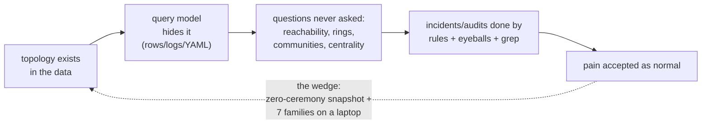
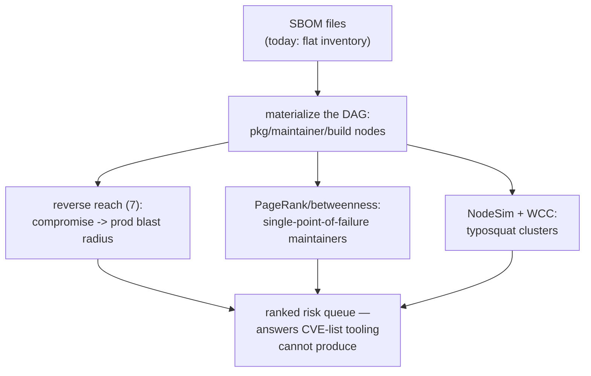
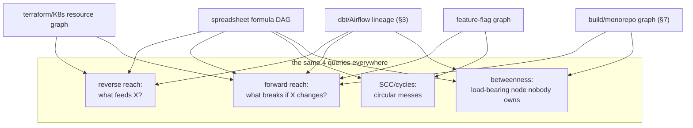
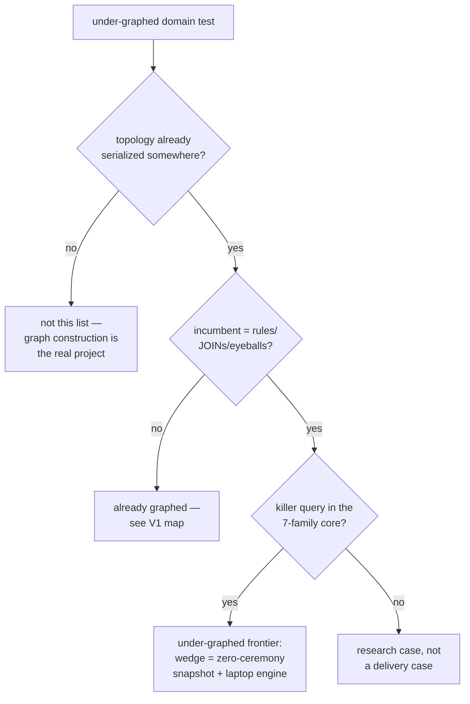

# Application-Domain Map V2 — The Under-Graphed Frontier

> V1 (`algorithm-application-domains-map.md`) mapped where graphs are
> *already* bought: fraud, ER, reco, supply chain, cyber, GraphRAG, bio.
> V2 asks the harder, more valuable question: **where does a genuine
> topology signal exist but almost nobody runs graph algorithms on it —
> usually because they don't know their data IS a graph?**
>
> Selection rule for every domain below: (a) the data is naturally
> nodes+edges, (b) the incumbent tooling is rules/JOINs/eyeballing/grep,
> (c) at least one of the seven adoption families (Arch02 [K2]) would
> produce an answer the incumbent tooling structurally cannot, and
> (d) the graph fits the 50GB-on-8GB regime (docs_PRD04 K1) — i.e. no
> cluster excuse. Industry-practice claims come from internet research
> done for the PMF documents plus general knowledge; verify independently.

---

## 0. Why under-graphing happens at all (the mechanism)

```text
the data lives in a system whose query model hides the topology:

  rows in Postgres      -> JOINs stop at 2-3 hops; recursion is exotic
  logs in a SIEM        -> events correlated by rules, not by reachability
  YAML in a repo        -> dependencies read by humans, not traversed
  spreadsheets          -> the formula graph is invisible to its own users
  IAM policy JSON       -> effective access = a reachability question
                           answered today by manual audit

so the graph EXISTS but is never MATERIALIZED — and once you must stand
up a Neo4j cluster + learn Cypher + buy RAM (PMF01 W1) just to ASK the
question, nobody asks. The under-graphed frontier is therefore also the
embedded/low-ceremony engine's natural market: snapshot-build from CSVs
you already have, run WCC/paths/PageRank, throw the snapshot away.
```



---

## 1. Software supply-chain security (SBOM / dependency confusion)

```text
what exists today: SBOM files (SPDX/CycloneDX) as INVENTORY — flat lists
checked against CVE feeds. what's missing: the SBOM is a DAG, and every
interesting question is a graph question nobody runs:

  nodes: packages@version, maintainers, build steps, registries
  edges: depends-on, published-by, built-from

Q1 "if package X is compromised, what ships to prod?"
    -> reverse reachability from X (dual-CSR backward walk — this
       repo's native operation, pattern 7)
Q2 "which maintainer is a single point of failure?"
    -> betweenness/PageRank over the maintainer-package bipartite graph
Q3 "did a typosquat cluster just appear?"
    -> NodeSimilarity on name-ngrams + shared-maintainer edges, then
       WCC: a fresh component of look-alike packages = the attack
Q4 "blast radius of yanking version Y?"
    -> forward reachability + component diff

scale check: npm ~3M packages, transitive graphs of a monorepo ~1e6-1e7
edges — laptop-sized, no cluster excuse. the xz-utils backdoor (2024)
was a MAINTAINER-graph anomaly (one identity slowly acquiring trust
centrality) that centrality tracking over time would have surfaced.
```



## 2. IAM / cloud permissions (effective-access reachability)

```text
the single most under-graphed high-stakes dataset in every company:
  nodes: principals, roles, groups, policies, resources
  edges: member-of, assumes, grants, can-invoke

"who can read the prod bucket?" is TRANSITIVE REACHABILITY — role
assumption chains 4-6 hops deep — answered today by manual audit or
pairwise checkers. the graph treatment:
  - forward reach from principal  -> effective access set
  - reverse reach from resource   -> the true audit list
  - shortest path                 -> the WHY (the exact grant chain to cut)
  - diff of reach sets across two policy snapshots -> "this PR widens
    access by exactly these 14 principal->resource pairs" (a CI gate!)
  - k-core / centrality           -> over-privileged hub roles

precedent proving the pattern: BloodHound did EXACTLY this for Active
Directory and became the standard AD attack tool — yet cloud IAM,
Kubernetes RBAC, Snowflake grants, and SaaS-app permissions all still
lack the everyday equivalent. Same algorithms, bigger market.
```

## 3. Data lineage & the ETL/warehouse dependency mess

```text
every dbt/Airflow shop HAS a graph (they even render it) but almost
nobody COMPUTES on it:
  Q "this dashboard is wrong — which of 4,000 upstream jobs could be
     the cause?"        -> reverse BFS, ranked by path count
  Q "if we deprecate table T, what breaks?"
                        -> forward reachability + component diff
  Q "which model is the load-bearing hub nobody owns?"
                        -> betweenness on the model DAG
  Q "which pipelines are actually independent (parallelizable)?"
                        -> WCC on the job graph
  Q "duplicate/near-duplicate models across teams?"
                        -> NodeSimilarity on column-lineage overlap

the lineage graph is ~1e4-1e6 nodes — trivially laptop-sized; the block
is ceremony, not scale. incident root-cause on data platforms is today
a Slack archaeology exercise that a 50ms reverse-reach query replaces.
```

## 4. Observability: traces, alerts, and incident root-cause

```text
microservice traces ARE graphs (span trees over a service DAG), yet
on-call practice is dashboard-eyeballing:
  - alert-storm compression: build the alert co-occurrence graph,
    Louvain it -> one community = one incident, not 400 pages
  - root-cause: reverse reachability from failing service through the
    call DAG, weighted by error-rate deltas -> ranked suspect list
  - "what breaks if we deploy S?" -> forward reach on the service graph
  - retry storms / circular deps -> cycle detection (SCC)
freshness matters here -> the dataflow patterns (25-26): maintain the
service graph incrementally from streaming spans instead of rebuilding.
```

## 5. Beneficial ownership, procurement, and public-interest graphs

```text
banks graph fraud (V1 §2.1); the SAME math is barely applied to:
  - corporate ownership chains: "who ultimately owns this vendor?"
    = weighted-path product over ownership edges; shell-company rings
    = WCC on shared directors/addresses/registration agents
    (the ICIJ Panama/Pandora Papers work proved the value — using,
    notably, Neo4j — yet procurement offices and mid-size lenders
    still run rule-based vendor checks)
  - public procurement collusion: bidder co-occurrence graph across
    tenders; Louvain communities that always bid together and
    alternate winners = cartel signature
  - conflict-of-interest: shortest path between official and awardee
    through directorships/family/address edges — a JOIN-killer at
    4+ hops, a trivial BFS on a CSR
these graphs are small (1e5-1e7 edges) and public — the blocker is
tooling ceremony, which is exactly what an embedded engine removes.
```

## 6. The spreadsheet / config / infra dependency underworld

```text
three "dependency hells" people live in WITHOUT graph tools:

a) SPREADSHEETS: a large Excel model is a formula DAG (cells = nodes,
   references = edges). audit questions — "what feeds this number?"
   (reverse reach), "what breaks if I change this input?" (forward
   reach), "circular reference clusters?" (SCC), "the load-bearing
   cell?" (betweenness). Enterprise risk teams audit billion-dollar
   models by hand; graph extraction is a weekend parser away.

b) INFRA-AS-CODE: Terraform state + K8s manifests + Helm values form
   a resource graph; "blast radius of this change" is forward reach;
   terraform's own plan-graph is computed then thrown away instead of
   being queryable history.

c) FEATURE FLAGS / CONFIG: flags gate code paths that reference other
   flags and services; dead-flag detection = unreachable-node pruning;
   "can these two flags interact?" = path existence. Flag-debt cleanup
   is today a grep exercise.
```



## 7. Monorepo build & test selection

```text
CI runs everything because nobody trusts the dependency graph:
  - affected-target selection: forward reach from changed files ->
    minimal test set (Bazel/Nx do this internally — but closed-world;
    the general repo with Makefiles/scripts gets nothing)
  - flaky-test co-failure graph: tests failing together across runs,
    Louvain -> shared broken fixture communities
  - ownership gaps: betweenness hubs in the import graph with no
    CODEOWNERS entry
this repo's own skill shelf (GitNexus/tessera/clarity, and the
graph-database-rewrite-references-202606 blast-radius ledgers) is
proof-of-concept that code graphs answer these — the under-graphed
part is CI/test-selection OUTSIDE the big-tech build systems.
```

## 8. Healthcare operations (not bio — the boring, bigger part)

```text
referral networks: patients flow provider->provider; the referral
graph reveals leakage (paths exiting the network = lost revenue),
gatekeeper centrality, and duplicate-billing rings (WCC on shared
patient/provider/claim attributes — the fraud pipeline of V1 §2.1
applied to claims, where rule-based edits still dominate).
care-pathway mining: patient event sequences as paths through a
treatment graph; community detection finds de-facto protocols that
differ from the official ones. All PHI-sized data (1e6-1e8 edges),
all currently analyzed with SQL and dashboards.
```

## 9. The pattern behind all nine domains

```text
domain            graph already exists as     incumbent tool     killer query
----------------  --------------------------  -----------------  ---------------------
SBOM security     SPDX/CycloneDX files        CVE list matching  reverse reach
IAM/permissions   policy JSON                 manual audit       reach-set diff in CI
data lineage      dbt/Airflow metadata        Slack archaeology  ranked reverse BFS
observability     spans + alerts              dashboard eyeballs Louvain alert compress
ownership/procure registries, tender records  vendor rule checks WCC + path COI
spreadsheets      formula references          cell-by-cell audit SCC + betweenness
infra-as-code     terraform state             plan output        forward reach
monorepo CI       import/build files          run everything     affected-set reach
healthcare ops    claims/referral records     SQL edits          referral centrality

common shape: the graph is ALREADY SERIALIZED somewhere (files, state,
metadata tables). no domain needs >1e8 edges. every killer query is one
of: reachability (7,8), WCC (9), Louvain (10), centrality (11),
NodeSim (12), SCC. that is — deliberately — the same seven-family core
that Arch02 [K2] shows drives the graphed world. The frontier is not
new algorithms; it is DELIVERY: removing the cluster+Cypher+RAM
ceremony (PMF01 W1) between a CSV and a WCC answer.
```



## 10. What this means for the PRDs

- **Delivery, not algorithms, is the moat here too.** V1's markets buy
  RAM relief (PMF01's billing axis); V2's markets buy *ceremony relief* —
  they will never install a graph database, but they would run
  `snapshot build from.csv && wcc` (this repo's CLI shape, per the
  knowledge index) the way they run `jq` or `ripgrep`.
- **The embedded/component strategy** from the Apache PMF analysis
  (DataFusion model) fits V2 exactly: these domains want a graph
  *capability inside their existing tool* (CI, SIEM, dbt, IaC scanner),
  not a graph *product*.
- **gtm relevance (docs_PRD04/gtm-POC-01):** the one-algorithm-swap logic
  generalizes — each V2 domain has ONE entry query (reverse reach for
  SBOM/lineage, reach-diff for IAM) whose answer is checkable in a diff,
  the same partition-exact honesty (pattern 28) that makes the fraud
  wedge auditable.
- **The dual-CSR is the V2 workhorse:** eight of nine domains lead with
  reachability, and reverse reachability specifically — the reason this
  repo stores backward adjacency as a first-class citizen (pattern 7)
  is the reason it is unusually well-shaped for the frontier.
