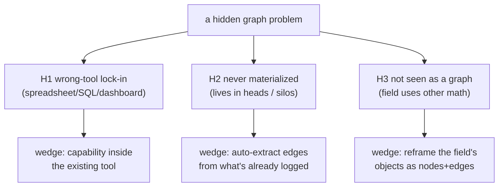
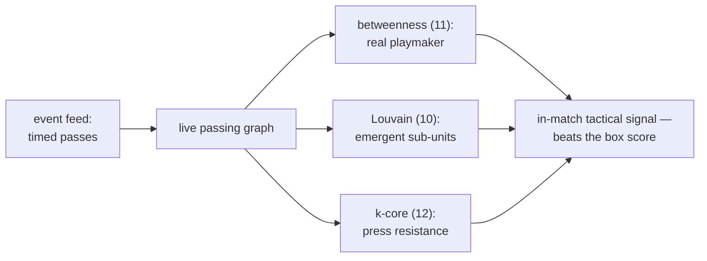
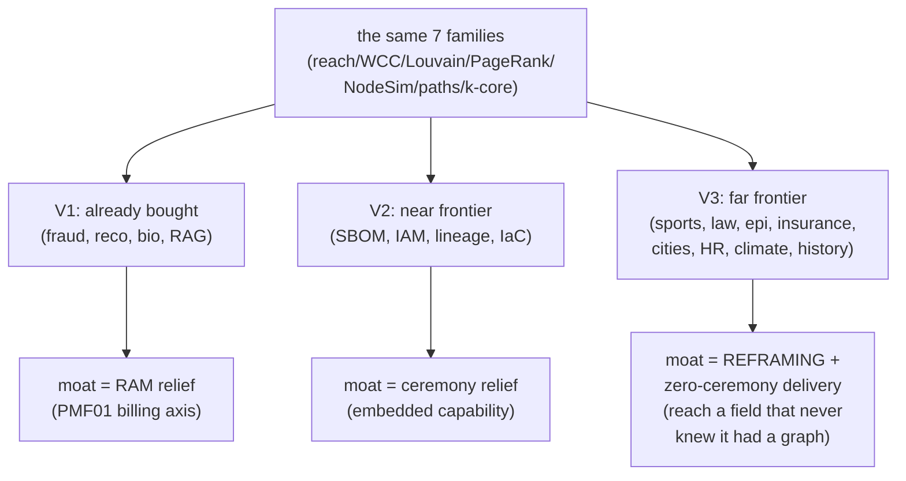

# Application-Domain Map V3 — The Far Frontier of Under-Graphed Problems

> V1 mapped where graphs are *already bought* (fraud, ER, reco, supply
> chain, cyber, GraphRAG, bio). V2 mapped the *near* frontier — engineering
> data that is obviously a graph but queried with rules/JOINs (SBOM, IAM,
> lineage, observability, IaC). **V3 goes far.** It hunts the places almost
> nobody thinks of as graph problems at all — sports, music, personal
> knowledge, physical logistics, law, archaeology, epidemiology, cities,
> insurance, agriculture, HR, climate — and shows the same seven algorithm
> families (Arch02 [K2]) waiting inside each one.
>
> Method note (per the objective): this version pulled ideas from the open
> web — practitioner pain-point writing, research literature, vendor blogs —
> to widen beyond the enterprise-IT default. Every web-sourced claim is
> tagged `[web:...]` and should be independently verified; corpus machinery
> is cited by pattern number from `pattern-index.md`; PRD facts by their
> `docs_PRD04/05` labels.

---

## 0. The discovery lens: three reasons a graph problem stays hidden

```text
V2 found ONE hiding mechanism (the query model hides the topology). Going
far, there are three, and each opens a different frontier:

  H1 WRONG-TOOL LOCK-IN   the data is a graph but the incumbent tool is a
                          spreadsheet / SQL / a solver / a dashboard, and
                          switching cost > perceived benefit
                          -> V2's engineering frontier lives here

  H2 NEVER-MATERIALIZED   the graph exists only in a human's head or across
                          silos; no one has ever written the edges down
                          -> personal knowledge, org expertise, care
                             pathways, deal flow

  H3 NOT-SEEN-AS-A-GRAPH  the field has its OWN math (statistics, physics,
                          optimization, ML) and never framed its objects as
                          nodes+edges at all
                          -> sports, epidemiology, insurance, climate,
                             archaeology, law
```



---

## 1. Sports & performance — the passing network nobody computes on live

```text
finding [web: Springer J.Big Data 2025, "We know who wins"; ~80% of
football events are passes per Cintia et al.]: teams analyze pass COUNTS
(a scalar) when the pass NETWORK is a live graph whose structure predicts
outcomes better than aggregates.

  nodes: players (positions)      edges: completed passes (weighted, timed)
  - centrality (11): the true playmaker (highest betweenness, not most
    passes) — the player whose removal disconnects the attack
  - community detection (10): emergent sub-units (the left-side triangle
    that actually builds attacks) vs the formation on paper
  - k-core / density (12): pressing resistance = how robust the passing
    graph is to edge removal under defensive pressure
  - temporal graphs (Raphtory-class, corpus ledger): the network at
    minute 60 differs from minute 10 — fatigue as topology drift

same math generalizes to basketball (ball-movement), esports (objective
control graphs), and cycling (peloton draft networks). the incumbent is a
stats table; the graph is sitting in the event feed unused.
```



## 2. Physical logistics & scheduling — where LLMs fail and graphs win

```text
finding [web: veriprajna 2026, "Optimization-Execution Gap"]: crew
scheduling, port ops, rail dispatch are network problems where a 99%
answer is illegal (a pilot with 7h59m rest invalidates the schedule).
LLMs lose graph state; the domain needs topology-aware methods.

  the graph: resources (crews, gates, tracks, trucks) x time-expanded
  nodes; edges = feasible transitions
  - shortest / constrained paths (8): feasible crew rotations, reroutes
  - connected components / reachability (7,9): "if gate 12 closes, which
    flights strand?" (blast radius again — the universal query)
  - min-cut / flow (analytics kin): bottleneck identification
  - matching: crew-to-flight, truck-to-load

under-graphed part: mid-size operators (regional rail, 3PL warehouses,
hospital transport) run spreadsheets + a human dispatcher, because the
OR/solver world feels heavyweight. a graph engine that answers
reachability + shortest-feasible-path on a laptop is the missing
middle between "spreadsheet" and "$2M optimization suite."
```

## 3. Personal & organizational knowledge — the graph in everyone's head

```text
finding [web: remlabs 2026, arXiv 2503.07993]: knowledge workers use
5-12 silos (email, calendar, notes, chat, docs); the connections between
them "live only in your head." this is hiding-mechanism H2 at planetary
scale — billions of people, zero materialized edges.

  nodes: people, projects, decisions, docs, meetings, commitments
  edges: mentioned-in, attended, authored, decided, blocks
  - shortest path (8): "how do I know this person?" / warm-intro path
  - PageRank (11): which project/person is actually central to my work
    vs which just feels loud
  - community detection (10): the natural clustering of my work into
    threads (auto-generated project boundaries)
  - reverse reach (7): "this decision — what emails/meetings led to it?"
    (the audit trail nobody can reconstruct today)

org version: EXPERTISE DISCOVERY — "who actually knows about X?" is
centrality over the contribution graph (commits, docs, answered
tickets), not a stale skills spreadsheet. and reachability over the
who-talks-to-whom graph reveals the real org chart vs the drawn one.
```

```mermaid
flowchart TD
    SIL["silos: email, calendar,<br/>notes, chat, docs"] -->|entity+relation<br/>extraction (LLM)| PKG["personal/org<br/>knowledge graph"]
    PKG --> Q1["shortest path (8):<br/>warm intro / 'how do I know them'"]
    PKG --> Q2["PageRank (11):<br/>what's actually central"]
    PKG --> Q3["Louvain (10):<br/>auto project threads"]
    PKG --> Q4["reverse reach (7):<br/>decision audit trail"]
    PKG -.->|new events| INC["incremental maintenance (25)"]
```

## 4. Law & regulation — precedent, contracts, and cross-references

```text
courts and legislatures produce dense citation graphs that lawyers
navigate by keyword search and memory.
  - PageRank on case citations (11): the actually-authoritative precedent
    (this is literally how legal-research tools rank, but in-house counsel
    and smaller firms don't have it)
  - reverse reach (7): "this statute was amended — which regulations,
    contracts, and clauses transitively depend on the old text?"
    (the compliance-update nightmare; today a manual review)
  - contract graphs: cross-references, defined terms, and party
    obligations form a graph; SCC finds circular definitions, path
    existence finds "does obligation A actually bind party C?"
  - shortest path between two cases through the citation web = the
    doctrinal bridge argument

under-graphed because the field's tools are full-text search engines;
the citation STRUCTURE is right there in every document, unindexed as
a graph outside the big legal-data vendors.
```

## 5. Epidemiology & public health beyond the classic SIR model

```text
finding [web: Oxford Handbook 2023; SNAM 2025 Las Vegas mobility study;
Salathe & Jones on modular delay]: contact/mobility networks condition
epidemic dynamics more than aggregate rates, yet most local public-health
practice still uses compartmental (non-network) models.

  nodes: people/places/transit stops   edges: contacts/mobility flows
  - betweenness (11): superspreader locations (major transfer stations)
  - community detection (10): modular structure that localizes outbreaks
    -> targeted vs blanket restrictions
  - shortest path / reachability (8): introduction-to-spread timelines
  - k-core: the densely connected core to vaccinate first

same structure serves veterinary/livestock disease, crop pathogens, and
hospital-acquired-infection tracing (patient-room-staff contact graphs) —
each currently modeled with rates, not networks, at the local level.
```

## 6. Insurance & actuarial — risk correlation is a graph, priced as if independent

```text
insurers price policies largely as independent risks; catastrophe
CORRELATION is a graph they underuse:
  - shared-exposure graph: policies linked by geography, reinsurer,
    supply dependency, or peril -> connected components = true
    accumulation risk ("we thought these were 10,000 independent policies;
    they're one flood component")
  - reinsurance chains: risk ceded through a graph of reinsurers; reverse
    reach = "if reinsurer X fails, what's our net exposure?" (the AIG-2008
    counterparty-contagion question)
  - subrogation & fraud rings: the V1 fraud pipeline applied to claims
  - parametric triggers: correlated triggers form a graph whose SCCs are
    simultaneous-payout clusters

this is H3 (the field has actuarial math and treats dependencies as
copulas/correlation matrices) — reframing accumulation as component
analysis on an exposure graph is the unlock.
```

## 7. Cities, utilities & the built environment

```text
- transit resilience: subway/bus graph; betweenness = critical stations,
  component-after-removal = "which neighborhoods strand if line 3 floods"
  [web: Shanghai/Beijing transit SNA studies]
- water/gas/power networks: reachability for isolation-valve planning
  ("close which 3 valves to isolate this leak with least outage?" =
  min-cut + reachability), cascade analysis for grid contingency
- 15-minute-city / walkability: shortest paths over street graphs to
  amenities; centrality finds under-served blocks
- permitting & zoning dependencies: the approval process is a DAG with
  hidden circular waits (SCC) — a source of the permit delays cities
  complain about, never modeled as a graph

incumbents are GIS + spreadsheets; the network math is a bolt-on nobody
runs at the mid-size-municipality level (H1 + budget).
```

## 8. Media, music & culture — recommendation's under-served cousins

```text
- music: playlist co-occurrence and artist-collaboration graphs;
  community detection finds emergent micro-genres before labels name
  them; PageRank finds bridge artists connecting scenes
- film/TV: cast-crew collaboration graphs (the classic "Bacon number" is
  shortest path) drive casting analytics and IP-franchise mapping
- academic & patent citation: prior-art search is reachability;
  emerging-field detection is new-community formation over time
- newsroom/OSINT: entity co-mention graphs across articles surface
  stories (the ICIJ method, V1 §5) — under-used by regional newsrooms
  that can't afford a data team

all H1/H3: the objects are catalogued in flat databases; the
collaboration/citation EDGES are implicit and rarely traversed.
```

## 9. HR, talent & the informal organization

```text
- referral & hiring networks: who refers whom; centrality finds the
  quiet super-connectors; component analysis finds monoculture risk
- collaboration graphs (from calendar/chat/git): the REAL team structure
  vs the org chart; betweenness finds the single-point-of-failure person
  (the "if she quits, 4 teams stall" risk, unmeasured until she quits)
- skills & internal mobility: skill-adjacency graph -> shortest path =
  realistic reskilling routes ("from support to data analyst passes
  through these 2 skills")
- attrition contagion: resignations cluster in communities; Louvain on
  the collaboration graph predicts the next at-risk cluster

H2 pure: HR has an HRIS (rows), never the edges. the graph is latent in
the collaboration exhaust every company already stores.
```

## 10. Agriculture, climate & earth systems

```text
- food supply webs: farm->processor->distributor->retail graphs;
  reachability = contamination traceback ("this E.coli case — which
  farms are upstream?"), a recall problem that takes days today
- water rights & river basins: allocation is a directed flow graph;
  reachability answers "who downstream loses water if this permit is
  granted?"
- climate teleconnections: regions linked by correlated climate signals
  form a graph; community detection finds coherent climate zones,
  centrality finds tipping-point regions [H3: climate science uses
  fields/PDEs, network framing is emerging]
- pollinator/ecological networks: extinction cascade = reverse
  reachability of dependency ("if this bee species collapses, which
  plants fail, then which dependent species?")
```

## 11. Archaeology & history — reconstructing networks from sparse data

```text
finding [web: Brughmans 2010; JAMT 2021 XTENT]: archaeologists
reconstruct ancient trade/road networks from site locations, and
historians map correspondence networks — an entire methodological
subfield (archaeological network analysis) that most digital-humanities
projects still don't apply.
  - inferred-edge graphs (proximity/artifact-similarity) + centrality =
    "which settlement was the trade hub?"
  - shortest paths over terrain-cost graphs = likely ancient roads
  - community detection on correspondence letters = intellectual
    circles (the Republic of Letters projects)

tiny data (1e3-1e5 nodes), maximally under-tooled (H1: humanities budget)
— a zero-ceremony local engine is the entire unmet need.
```

---

## 12. The far-frontier synthesis — one table, twelve fields

```text
domain           hiding   the latent graph              killer query (family)
---------------  -------  ----------------------------  ----------------------
sports           H1/H3    passing/ball-movement network betweenness playmaker (11)
phys. logistics  H1       time-expanded resource graph  constrained paths (8)
personal/org KM  H2       people-project-decision web   PageRank centrality (11)
law              H1/H3    citation & contract graphs    reverse reach on amend (7)
epidemiology     H3       contact/mobility network      superspreader betweenness(11)
insurance        H3       shared-exposure graph         accumulation components (9)
cities/utilities H1       transit/utility networks      min-cut isolation (8)
media/music      H1/H3    collaboration/citation graphs emerging-community (10)
HR/talent        H2       collaboration exhaust         SPOF betweenness (11)
agri/climate     H3       supply/flow/teleconnection    contamination traceback (7)
archaeology      H1       inferred site networks        trade-hub centrality (11)
(+ V2's 9 eng.   H1       serialized eng. metadata      reverse reach (7)
 domains)

the astonishing invariant: across 21 domains spanning football to floods
to Roman trade routes, the KILLER QUERIES ARE THE SAME SEVEN FAMILIES
Arch02 [K2] found drive Neo4j GDS adoption. The world is not short of
graph algorithms. It is short of graph DELIVERY — the ceremony between a
CSV and a WCC answer.
```



---

## 13. The go-to-market reading (tying back to the PRDs)

```text
Shreyas-lens (docs_PRD04/PMF01-04) triage of the far frontier:

  problem-in-top-3?   most V3 domains: NO today (that's why under-graphed).
                      the exceptions where it IS climbing: personal/org KM
                      (AI-agent memory wave, PMF01 W3), logistics
                      (post-COVID fragility), insurance accumulation
                      (climate-driven cat losses). Start there.

  who feels the pain enough to pay?  the pattern from V1/V2 holds: sell to
                      the row where the incumbent tool visibly fails at a
                      HIGH-STAKES query — insurance accumulation (a
                      solvency question), contamination traceback (a
                      recall-days question), crew feasibility (a legality
                      question). Low-stakes rows (sports, music, history)
                      are credibility/marketing demos, not first revenue.

  the durable strategy (Apache PMF lens): a graph CAPABILITY embeddable
                      inside the tool each field already runs (the actuarial
                      platform, the TMS, the PKM app), not a graph PRODUCT
                      they must adopt. V3 is the widest possible evidence
                      that the DataFusion/component model — a fast,
                      embeddable, zero-ceremony graph engine — has more
                      total addressable surface than any single graph-DB
                      product, because the graph is hiding in every field's
                      data, waiting for delivery cheap enough to try.
```

- **The V1→V2→V3 arc in one line:** graph algorithms are a solved science
  applied to maybe 5% of the problems they fit; the constraint is the
  cost (RAM, ceremony, reframing) of *asking the question*, which is
  exactly the axis this repo's mmap-snapshot, laptop-scale, CSV-in engine
  (knowledge index) attacks.
- **Chain-of-verification caveat:** the V3 domains rest on external and
  general-knowledge claims tagged `[web:...]`; they establish *plausible
  fit*, not validated demand. The honest next step for any single row is
  the V1/V2 discipline — find a real user whose high-stakes query fails
  today, and prove parity on their data.
