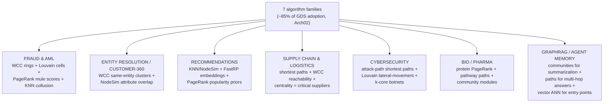
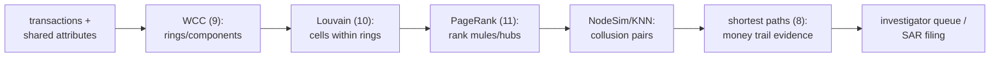
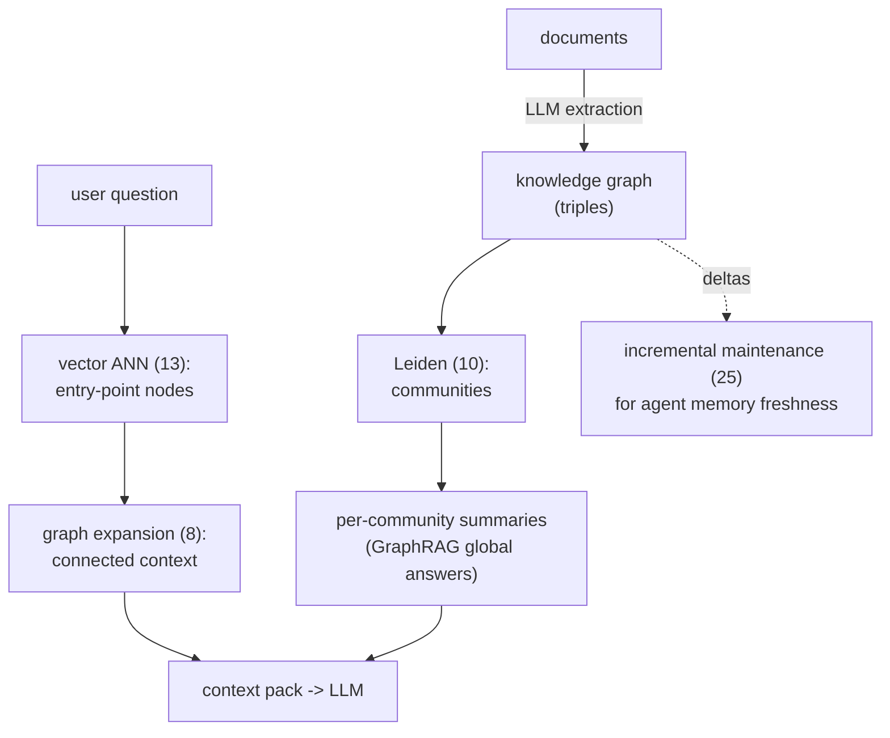
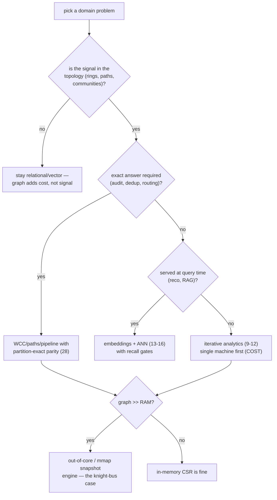

# Where These Algorithms Earn Their Keep — The Application-Domain Map

> The corpus (28 patterns, 8 syntheses) answered *how* the machinery works.
> `docs_PRD04` (Arch02's adoption research, PMF01-04, gtm-POC-01) and
> `docs_PRD05` (Sol-01/02, feasibility) answered *what our product should do*.
> This document answers the middle question: **which real-world domains and
> problems are actually solved by these algorithm families**, drawn from the
> PRD evidence base plus the industry research of the two PMF-lens documents.
>
> Sourcing: domain→algorithm mappings marked [S1..] come from the signal
> inventory in `docs_PRD04/Arch02.md` (Neo4j use-case guides, fraud series,
> configuration guide, GraphAcademy) and the PMF documents' internet research;
> pattern numbers cite `pattern-index.md`. Verify market claims independently.

---

## 1. The master map — seven algorithm families × the domains that pay

Arch02's finding: ~85% of GDS adoption rides on seven families [S1-S3].
Each family below is tied to the corpus pattern that explains its machinery
and to the domains where it is the *billable* workload.

```text
family (adoption ~%)      corpus machinery         domains that pay for it
------------------------  -----------------------  ------------------------------
WCC / connected comps     hooking+shortcutting     fraud rings, entity resolution
(~20%)                    (pattern 9), CSR (7)     / customer-360, dedup, telecom
                                                   outage blast radius
Louvain / Leiden          modularity + refinement  community detection: AML cells,
(~15%)                    (pattern 10)             social cohorts, product families,
                                                   cyber lateral-movement clusters
PageRank / centrality     power iteration (11)     influence: fraud mule scoring,
(~15%)                                             web/citation rank, key-supplier
                                                   criticality, protein importance
NodeSimilarity / KNN      set-overlap + top-k      recommendations, "same person?"
(~12%)                    heaps (12-kin, 13)       ER scoring, substitute products,
                                                   collusion pair detection
shortest paths / BFS      frontier push/pull (8)   logistics routing, network hop
(~10%)                                             analysis, degrees-of-separation,
                                                   dependency chains, impact paths
FastRP / embeddings       SpMV-style passes (11-   ML feature pipelines: churn,
(~8%)                     kin), dense sidecars     link prediction, fraud models
triangles / k-core        intersection counting    social density, bot detection,
(~5%)                     (pattern 12)             graph health metrics
```



The one commercial fact that frames everything (PMF01 W1-W2): **Neo4j meters
by RAM, and these exact workloads are its RAM hogs** — LDBC100 PageRank
needs 45.9-110 GB, Louvain 45.9-119 GB, FastRP 212-254 GB [K3]. Every domain
below is therefore also a *cost-reduction* story for a low-RAM engine.

---

## 2. Domain deep-dives, with the algorithm pipeline drawn

### 2.1 Fraud detection & anti-money-laundering (the #1 GDS deal-closer [S2])

```text
raw events                the graph                 the algorithm pipeline
-----------               ------------------        -------------------------------
accounts, cards,          nodes: account/device/    1. WCC        -> connected rings
devices, IPs,             ip/merchant/email            (shared device/IP components)
transactions       ->     edges: used, paid,   ->   2. Louvain    -> tighter cells
                          shares-attribute             inside big components
                                                    3. PageRank   -> mule/hub scores
                                                       within each cell
                                                    4. NodeSim    -> "these two
                                                       accounts behave alike"
                                                    5. paths      -> money trail
                                                       source->sink for the SAR

why graph beats SQL here: the SIGNAL IS THE TOPOLOGY — a ring of 40
accounts sharing 3 devices is invisible to per-row rules and one JOIN
away from a combinatorial explosion; it is one WCC pass on a CSR (7,9).
scale note: UnitedHealth-class deployments run 120B relationships
(industry reporting, PMF doc §1.2) — this is a 50GB-graph-on-8GB-box
problem, i.e. exactly the knight-bus mission.
```



### 2.2 Entity resolution / customer-360 (the quiet volume seller [S1])

```text
problem: the same human exists 6 times across CRM, billing, support,
web signup, partner feed, and a typo'd import.
pipeline: blocking (FTS/ngram match, patterns 17-19) -> pairwise
NodeSimilarity on attribute-overlap edges -> threshold -> WCC to close
the transitive hull ("A~B, B~C => {A,B,C} is one customer") ->
golden-record ID = min member (the same canonicalization rule the
verification patterns use for label-invariant equality, pattern 28).
this is WHY WCC leads adoption: ER runs it on every refresh, quietly,
at every enterprise with more than one customer table.
```

### 2.3 Recommendations & personalization

```text
bipartite graph: users --interacted--> items
1. co-interaction projection: item-item edges by shared users
2. NodeSimilarity (Jaccard/overlap on adjacency sets — pure pattern-7
   CSR intersection work) -> "customers also bought"
3. FastRP embeddings -> dense vectors -> ANN/HNSW (13) serves
   "more like this" at query time (the corpus's vector-ann category is
   the SERVING half of the same domain)
4. PageRank / personalized PageRank -> popularity and taste priors
memory shape (Arch02 K4): NodeSim's candidate state is the
architecture-breaking spike Sol-01 flags — top-k heaps per node, the
classic RAM cliff; the domain that most needs admission control.
```

### 2.4 Supply chain, logistics, and network infrastructure

```text
nodes: suppliers/plants/DCs/SKUs or routers/switches/fibers
- shortest & k-shortest paths (8): routing, reroute-on-failure,
  lead-time estimation
- WCC after removing a node: "if this port closes, which plants are
  unreachable?" (blast-radius = component diff)
- betweenness/PageRank: single-point-of-failure suppliers, choke links
- temporal variants (Raphtory-class, corpus ledger) for "as of last
  Tuesday" reachability
same math runs telecom outage triage and power-grid contingency —
graph is the native model wherever the asset IS a network.
```

### 2.5 Cybersecurity & IT operations

```text
identity graph: users x machines x privileges x sessions
- attack paths: shortest paths from compromised node to crown jewels
  (BloodHound popularized this; pure BFS/Dijkstra, pattern 8)
- lateral-movement communities: Louvain on auth-event graphs
- k-core/triangles (12): botnet & fake-account density signatures
- code intelligence (this repo's own tooling — GitNexus/tessera/clarity
  skills): call graphs, blast radius = reverse-reachability on the
  dependency CSR; impact analysis is literally reverse BFS (pattern 7's
  dual-CSR is why forward+backward both need to be cheap)
```

### 2.6 GraphRAG / LLM agent memory (the 2024-26 demand wave [W3])

```text
why it revived the whole category (PMF docs): AI answer accuracy became
buyers' top-1 problem, and graph structure demonstrably helps.
- ingestion: LLM extracts (entity)-[relation]->(entity) triples
- Leiden/Louvain (10): community detection drives HIERARCHICAL
  SUMMARIZATION (Microsoft GraphRAG's core trick: summarize per
  community, answer global questions from community summaries)
- multi-hop QA: constrained path search between question entities
- retrieval entry points: vector ANN (13-16) finds semantically similar
  nodes, then graph expansion (8) gathers connected context —
  the corpus's vector-ann and graph-analytics categories in ONE pipeline
- agent memory: incremental updates favor delta-oriented engines
  (pattern 25's arrangements: pay once, answer forever)
```



### 2.7 Bio/pharma & scientific graphs

```text
protein-protein interaction, gene regulation, drug-target networks:
- PageRank-family centrality -> target prioritization
- community modules (10) -> functional pathway discovery
- shortest/weighted paths -> signaling cascade tracing
- embeddings + ANN -> molecule/compound similarity search
these graphs are mid-size (1e6-1e8 edges) but analysis is ITERATIVE and
exploratory — the single-machine COST-paper regime (analytics synthesis)
where a laptop-class engine beats a cluster.
```

---

## 3. The supporting cast — where the non-graph categories serve the same buyers

```text
corpus category      the domain job it does in these SAME applications
-----------------    --------------------------------------------------
full-text search     ER blocking, fraud name/address matching, log/SIEM
(17-19)              triage behind the cyber use case
vector-ann (13-16)   reco serving, GraphRAG retrieval, "similar claim/
                     molecule/customer" across every domain above
storage-engine       the L1 substrate that decides whether the 50GB
(1-6)                fraud graph needs a 512GB box or an mmap'd snapshot
dataflow (25-26)     freshness tier: fraud scores and agent memory that
                     update per-event instead of per-nightly-rebuild
bench-testing        the trust layer: parity receipts (28) are what let
(27-28)              a bank accept a cheaper engine's WCC partition
```

---

## 4. The domain × constraint matrix (what each domain stresses)

```text
domain          graph size    freshness need   correctness bar      RAM pain [K3/W1]
fraud/AML       huge (1e9+)   minutes          audit-grade (SAR)    severe
entity res.     large         daily            partition-exact      high
recommendations large         hours-daily      tolerant (recall)    high (NodeSim)
supply chain    medium        event-driven     path-exact           moderate
cybersecurity   large         near-real-time   path-exact           high
GraphRAG        medium        per-conversation tolerant             moderate
bio/pharma      medium        batch            reproducible         moderate
```

Reading it with the Doshi lens (PMF docs): the rows where *RAM pain* is
severe AND the correctness bar is checkable (fraud, ER) are exactly the
design-partner profile PMF02 names — Neo4j shops with OOMing GDS jobs —
and the rows where freshness dominates (cyber, agent memory) are where
the dataflow category (25) stops being academic.



---

## 5. The through-line back to the PRDs

- **Arch02 [K2]** picked the seven families by *adoption evidence*; this map
  shows the adoption is not abstract — each family is load-bearing in 3+
  domains, which is why the shortlist is stable across sources.
- **gtm-POC-01** chose WCC for the one-algorithm swap; §2.1-2.2 show why
  that is also the right *domain* wedge: WCC is the entry algorithm of the
  two highest-pain domains (fraud, ER), and its partition-exact parity
  (pattern 28's equivalence rule) is a one-line diff a bank can audit.
- **Sol-01's** NodeSimilarity spike is §2.3's RAM cliff — the domain where
  admission control and spill decide honesty.
- **PMF01's** billing-axis thesis lands here as: every domain row with
  "severe/high RAM pain" is a row where the incumbent's price scales with
  the graph and ours scales with the *labels* — the map is, in the end,
  the target-market list.
