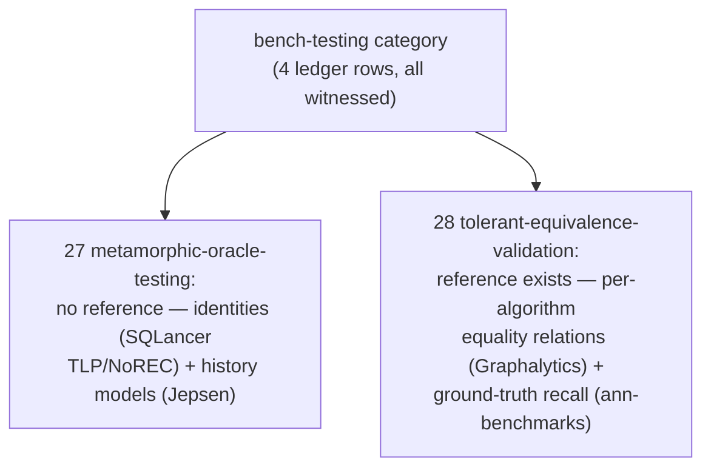
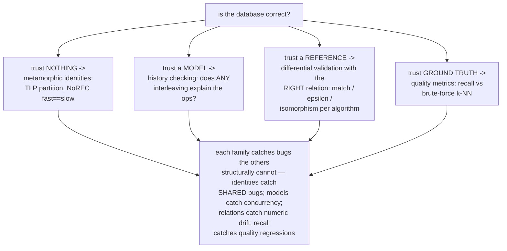
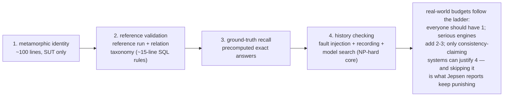
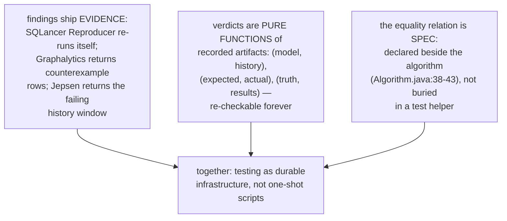
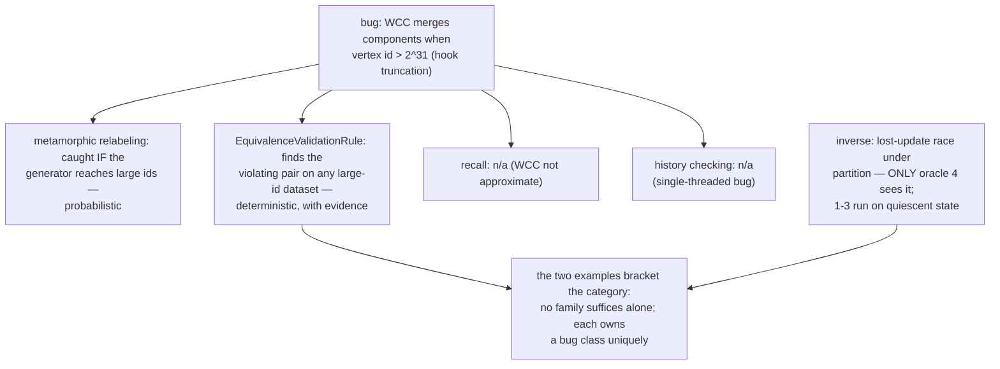
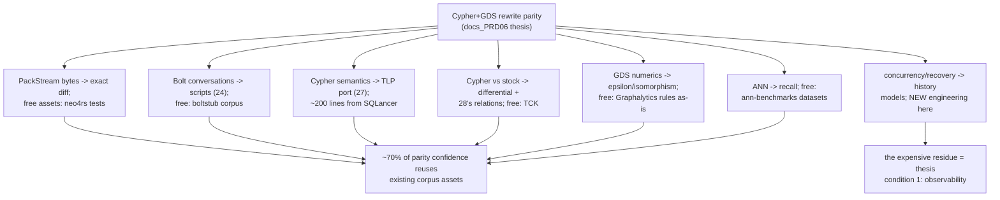
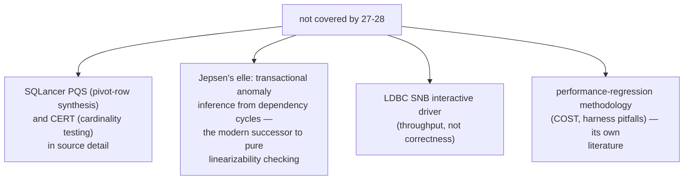
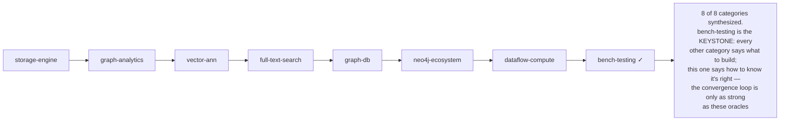
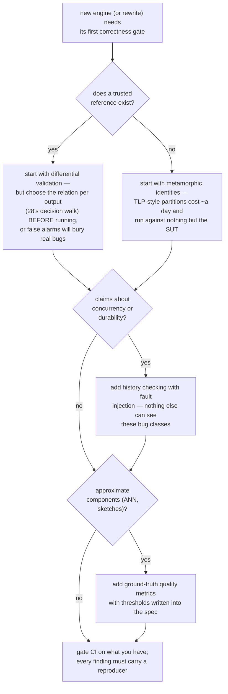

# Bench-Testing Category Synthesis — Mermaid

| Field | Value |
| --- | --- |
| Kind | execution |
| Pair | `bench-testing-pattern-synthesis-ascii.md` / `bench-testing-pattern-synthesis-mermaid.md` |
| One-line job | Roll up patterns 27-28 into the category thesis: a database is only as correct as its cheapest oracle — the category supplies four oracle families (metamorphic identities, history models, reference validation with tolerance, ground-truth recall) that together cover semantics, concurrency, numerics, and approximation |

## 1. Category map

## 2. The thesis: correctness decomposes by what you trust

## 3. The oracle-cost hierarchy

## 4. The three category-wide laws

## 5. One WCC bug through all four oracles

## 6. Sizing a rewrite's test budget

## 7. Honest gaps

## 8. The corpus, closed

## 8b. Which oracle first? — a decision walk

## 9. Citing repos (category roll-up)

| Repo | Path | Role |
| --- | --- | --- |
| sqlancer | `reference-repos-corpus/sqlancer-src/src/sqlancer/common/oracle/TLPWhereOracle.java` | partition identity (27) |
| sqlancer | `reference-repos-corpus/sqlancer-src/src/sqlancer/common/oracle/NoRECOracle.java` | fast==slow invariant (27) |
| jepsen | `reference-repos-corpus/jepsen-src/jepsen/src/jepsen/checker.clj` | history checker protocol (27) |
| ldbc_graphalytics | `reference-repos-corpus/ldbc_graphalytics-src/graphalytics-core/src/main/java/science/atlarge/graphalytics/domain/algorithms/Algorithm.java` | relation-per-algorithm registry (28) |
| ldbc_graphalytics | `reference-repos-corpus/ldbc_graphalytics-src/graphalytics-core/src/main/java/science/atlarge/graphalytics/validation/rule/EquivalenceValidationRule.java` | partition isomorphism (28) |
| ann-benchmarks | `reference-repos-corpus/ann-benchmarks-src/ann_benchmarks/plotting/metrics.py` | distance-threshold recall (28) |

## 10. Cross-references

- Members: `metamorphic-oracle-testing` (27),
  `tolerant-equivalence-validation` (28).
- Prior syntheses: all seven other categories — this one
  supplies the verification lens they are read through.
- Reading order for the category: TLPWhereOracle.java, then
  Graphalytics' three rule files, then metrics.py's recall,
  then checker.clj — ascending oracle cost.
- The ASCII twin carries the same two worked examples with
  full detail plus the test-budget table in row form.
- Terminology bridge across the category: "oracle" = any
  machine-checkable verdict source; "metamorphic relation" =
  transformation with a known output effect; "validation
  rule" = equality relation as a counterexample query;
  "ground truth" = precomputed exact answers; "history" =
  the recorded op sequence that verdicts are computed from.
- Category exam question: given a claimed behavior, name the
  cheapest oracle family that can falsify it, the free corpus
  asset that implements it, and the evidence artifact a
  failure must produce. All three answers come from the
  ladder in §3 and the budget table in §6.
