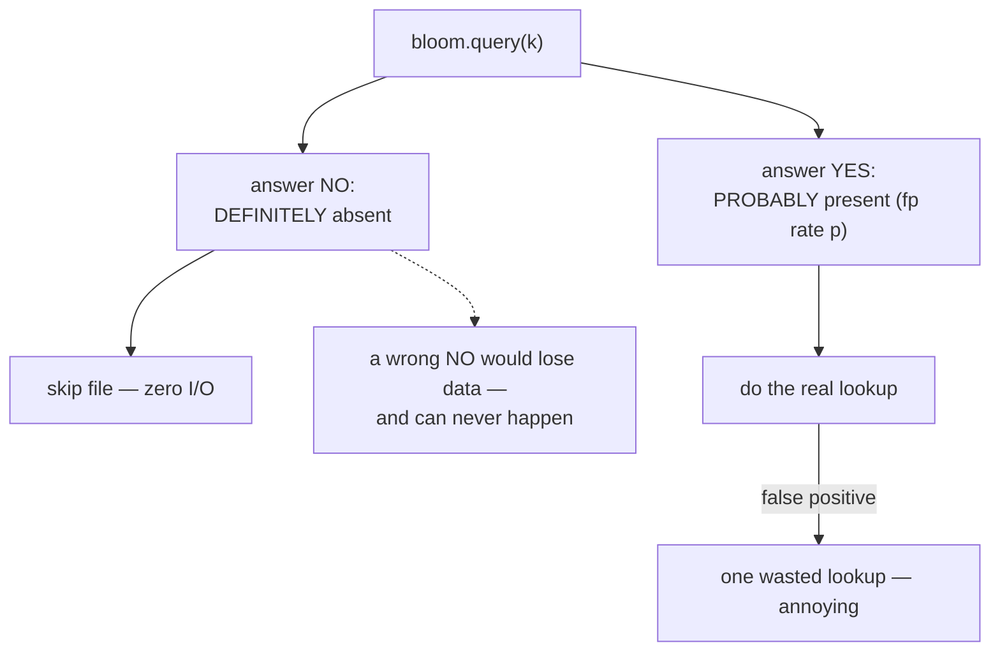
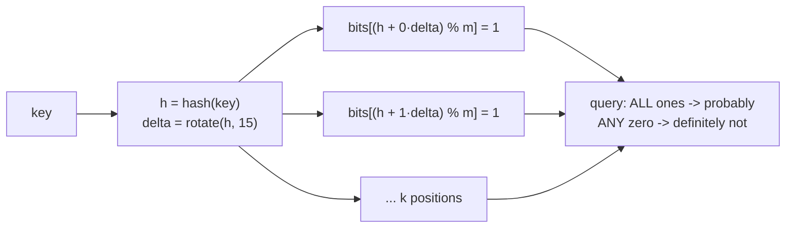
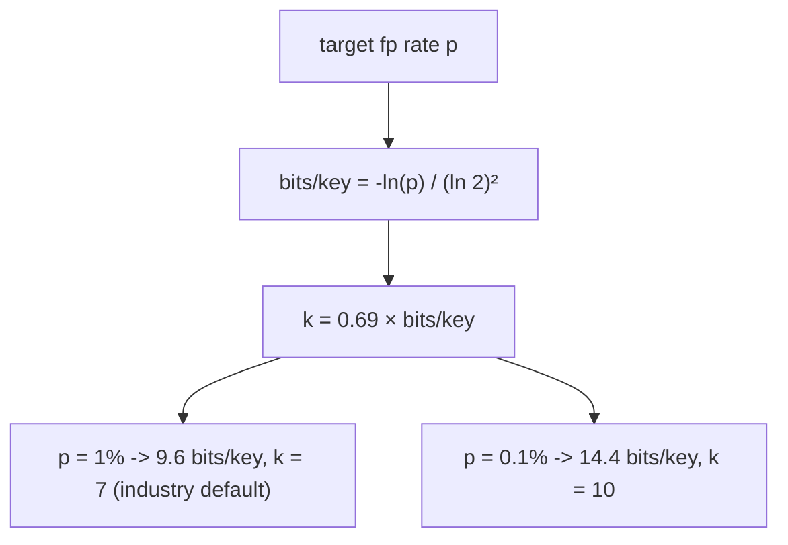
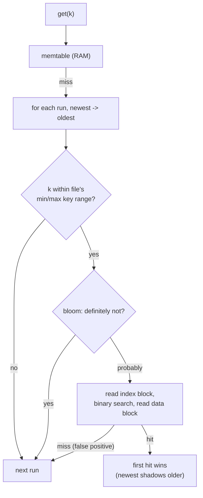
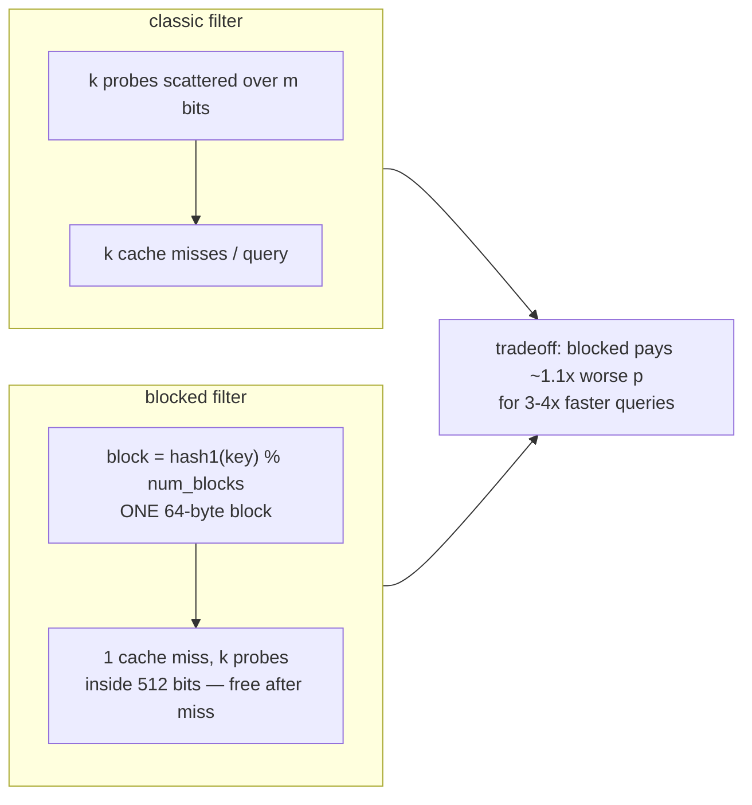
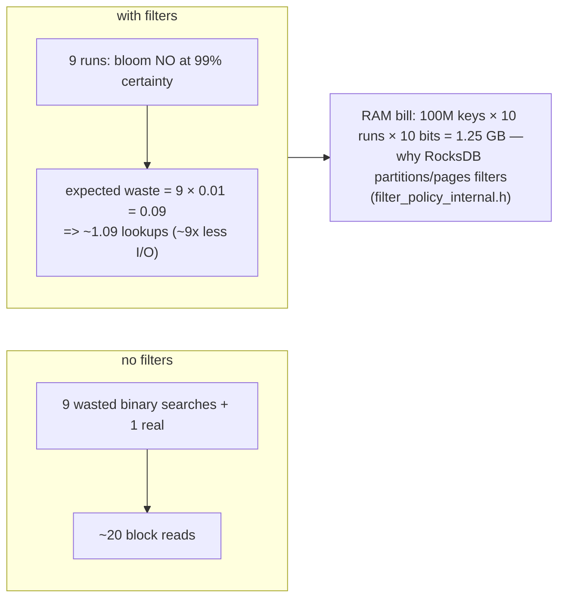
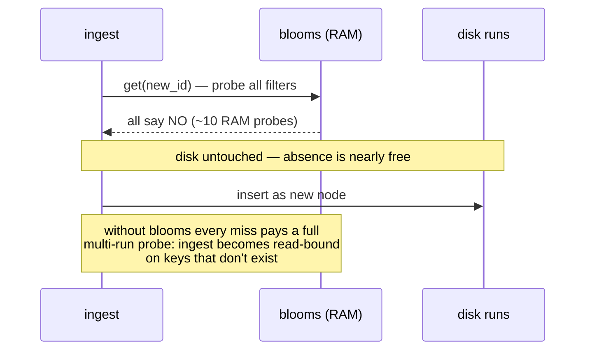
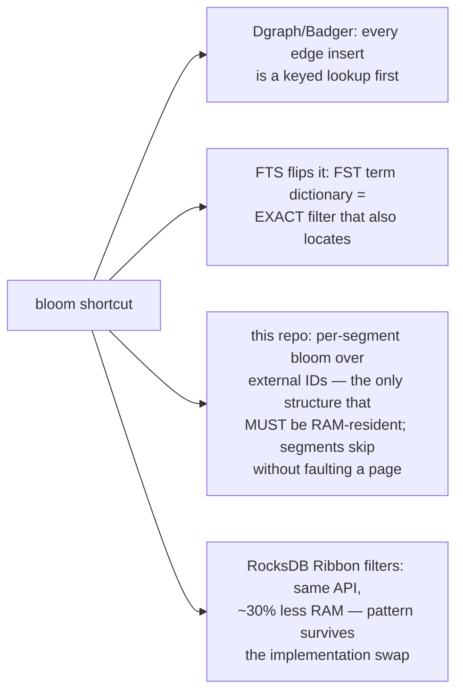

# Bloom Filter Shortcut — Mermaid

| Field | Value |
| --- | --- |
| Kind | storage |
| Pair | `bloom-filter-shortcut-ascii.md` / `bloom-filter-shortcut-mermaid.md` |
| One-line job | Answer "is key k definitely NOT in this file?" from a few bytes of RAM, so the read path can skip disk I/O on the overwhelmingly common negative case |

## 1. One-sided error is the whole trick

## 2. Construction — double hashing over a bit array

All four witnesses use one 32-bit hash offset k times instead of k real
hash functions:

Sizing math (hard-coded in
`reference-repos-corpus/mini-lsm-src/mini-lsm/src/table/bloom.rs`,
lines 86–96):

10 bits of RAM per key regardless of key size — only the hash enters.

## 3. Position in the LSM read path

RocksDB plugs step BF into the table reader via FilterPolicy
(`reference-repos-corpus/rocksdb-src/table/block_based/filter_policy.cc`);
the filter block lives inside the immutable SSTable, built once at
flush/compaction — no deletion support ever needed because files die
whole in compaction.

## 4. Blocked Bloom — the cache-line refinement

Implementations: fjall's
`reference-repos-corpus/lsm-tree-src/src/table/filter/blocked_bloom`
(with `standard_bloom` beside it for contrast); RocksDB's
format_version=5 full filter in
`reference-repos-corpus/rocksdb-src/util/bloom_impl.h`.

## 5. Worked example — the arithmetic of skipping

Tiered LSM, 10 runs, key present only in run 7; 10 bits/key, p = 1%:

## 6. Worked example — negative lookups, the killer use

Graph ingest doing get-or-create by external ID over 1B nodes, 90% of
incoming IDs new (absent everywhere):

Badger's `y/bloom.go` sits on exactly this path — Dgraph's posting-list
writes are get-or-create shaped.

## 7. Inheritance map

## 8. Citing repos

| Repo | Path | Role |
| --- | --- | --- |
| mini-lsm | `reference-repos-corpus/mini-lsm-src/mini-lsm/src/table/bloom.rs` | sizing math (lines 86-96) |
| badger | `reference-repos-corpus/badger-src/y/bloom.go` | double hashing on the hot path |
| RocksDB | `reference-repos-corpus/rocksdb-src/util/bloom_impl.h` | legacy + blocked implementations |
| RocksDB | `reference-repos-corpus/rocksdb-src/table/block_based/filter_policy.cc` | FilterPolicy plug point |
| fjall lsm-tree | `reference-repos-corpus/lsm-tree-src/src/table/filter/blocked_bloom` | Rust blocked Bloom |
| fjall lsm-tree | `reference-repos-corpus/lsm-tree-src/src/table/filter/standard_bloom` | Rust classic Bloom |

## 9. Cross-references

- Sibling patterns: `lsm-compaction-tradeoff` (creates the multi-run
  problem); `roaring-bitmap-idsets` (exact sets for iteration and
  intersection); `mvcc-snapshot-visibility` (newest-first probe order).
- 202606 digest overlap: none — read-path filters were untouched.
- Paper trail: Bloom (1970); RocksDB's Ribbon filter paper — see
  `research-papers-ledger.md` for verified entries.
