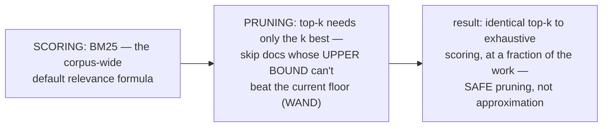
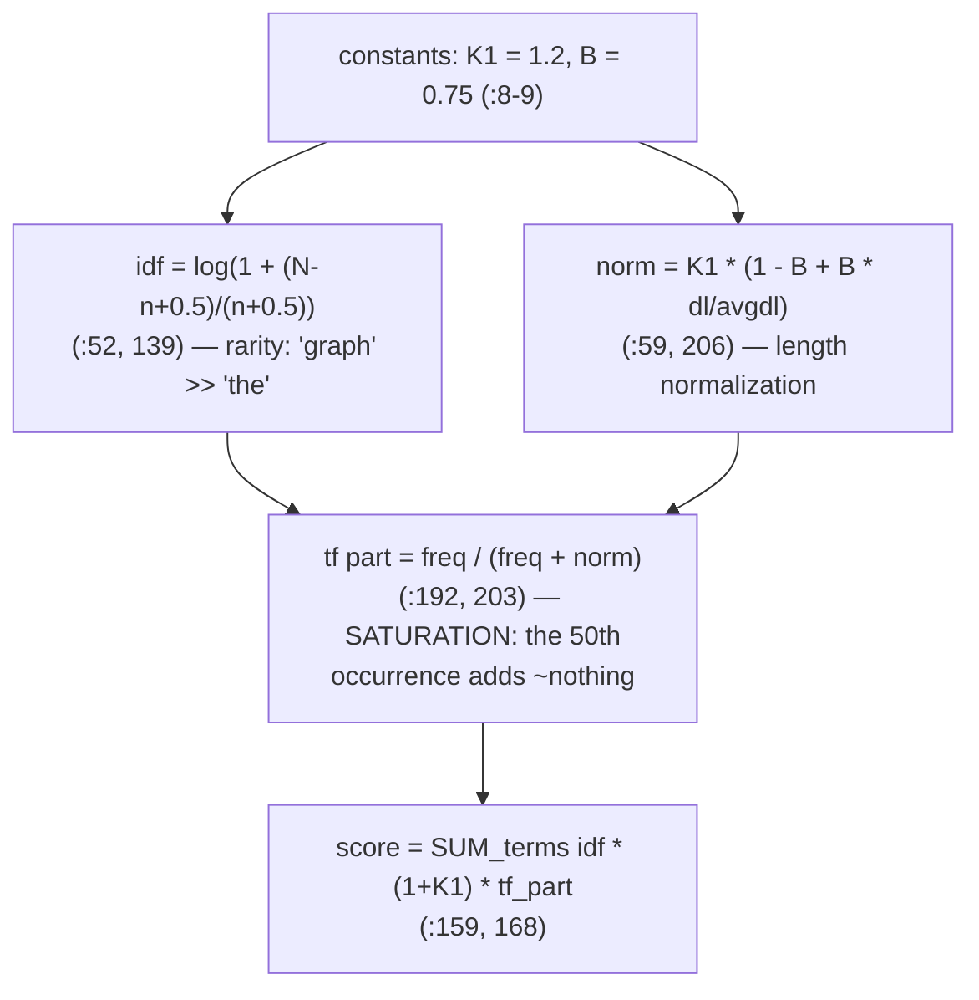
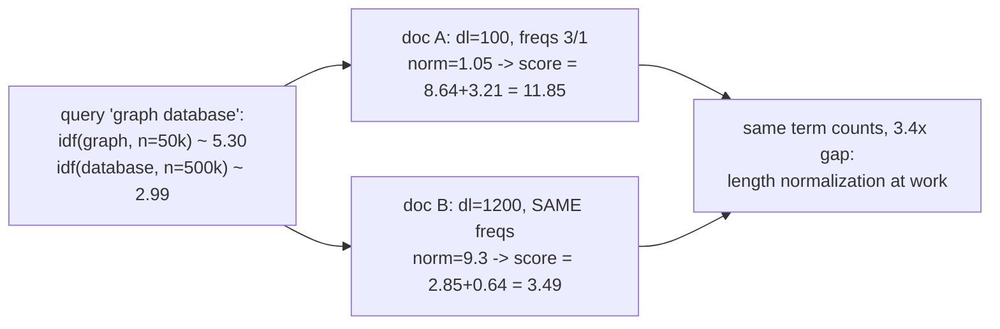
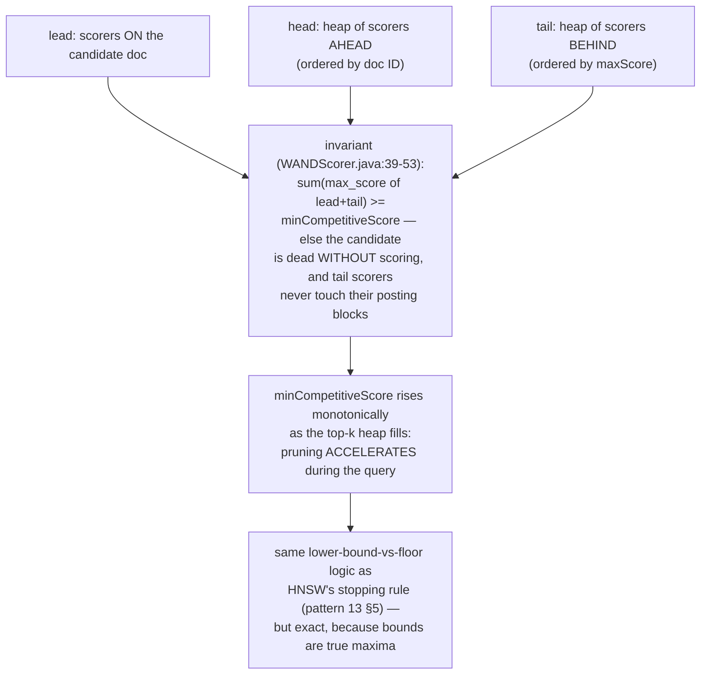
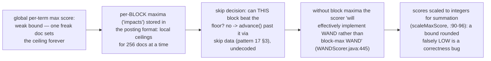
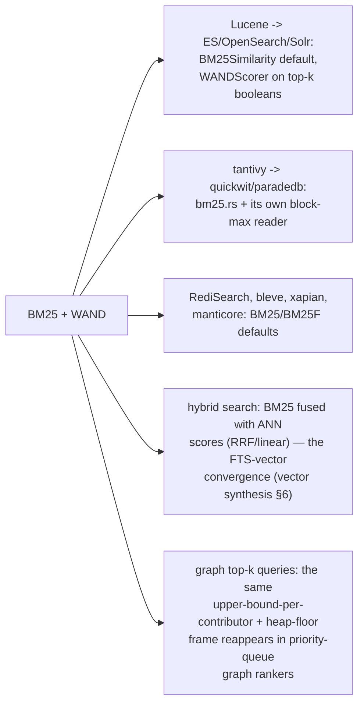
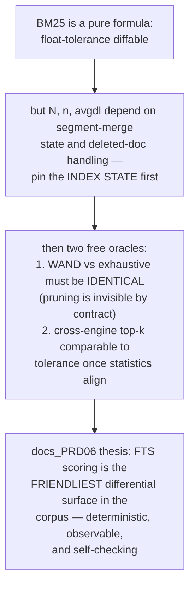
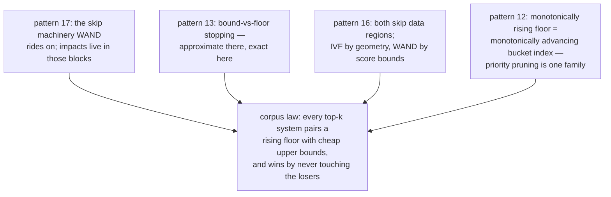

# BM25 WAND Pruning — Mermaid

| Field | Value |
| --- | --- |
| Kind | algorithm |
| Pair | `bm25-wand-pruning-ascii.md` / `bm25-wand-pruning-mermaid.md` |
| One-line job | Rank documents by BM25 (saturating term-frequency x rarity x length-normalization) and skip whole regions of the posting lists whose per-term maximum scores cannot beat the current top-k floor — WAND / block-max WAND |

## 1. Two halves



## 2. BM25 from source (tantivy query/bm25.rs)



## 3. Worked arithmetic (N=10M, avgdl=120)



## 4. WAND — the three-place decomposition



## 5. Block-max WAND



## 6. One query, end to end

```mermaid
sequenceDiagram
    participant Q as 3-term query (k=10)
    participant H as top-k heap / floor
    participant T as tail (by maxScore)
    participant B as posting blocks
    Q->>H: score first candidates exhaustively,<br/>heap fills, floor rises
    loop each candidate doc
        Q->>T: sum available max scores
        alt bound < floor
            Q->>B: advance past doc / whole block —<br/>no decode, no scoring
        else bound >= floor
            Q->>B: position tail scorers, decode,<br/>compute true BM25
            B->>H: if score > floor: replace min,<br/>floor rises
        end
    end
    Note over Q,H: 5M+1M+200k postings -> typically<br/>5-20x fewer scored docs; returned<br/>top-k IDENTICAL to exhaustive
```

## 7. Inheritance map



## 8. The verification angle



## 9. Kinship map



## 9b. Where the statistics come from — the segment problem

```mermaid
sequenceDiagram
    participant W as Bm25Weight (query time)
    participant S1 as segment 1
    participant S2 as segment 2
    participant Q as scorer per segment
    W->>S1: doc_freq(term), doc_count, avg fieldnorm
    W->>S2: same statistics
    Note over W: tantivy sums idf across the searched<br/>segments (bm25.rs:121-127) so the weight<br/>is INDEX-wide, not per-segment —<br/>otherwise the same doc would score<br/>differently depending on which segment<br/>it landed in after merges
    W->>Q: one weight, per-segment norms<br/>(fieldnorm tables)
    Q-->>W: top-k per segment -> global merge<br/>of the k-heaps
    Note over W,Q: deleted docs still count in n and N until<br/>merged away — scores DRIFT as segments<br/>compact; another reason differential<br/>tests must pin the index state
```

The statistics plumbing is where cross-engine score differences
actually come from in practice — the formula is identical
everywhere, the bookkeeping is not.

## 10. Citing repos

| Repo | Path | Role |
| --- | --- | --- |
| tantivy | `reference-repos-corpus/tantivy-src/src/query/bm25.rs` | K1/B (8-9), idf (52, 139), norm (59, 206), saturation (192-206), weight (159-168) |
| lucene | `reference-repos-corpus/lucene-src/lucene/core/src/java/org/apache/lucene/search/WANDScorer.java` | lead/head/tail (39-53, 124-140), integer scaling (90-96), block-max fallback (445) |
| lucene | `reference-repos-corpus/lucene-src/lucene/core/src/java/org/apache/lucene/search/similarities/BM25Similarity.java` | the Lucene-family default similarity |
| quickwit | `reference-repos-corpus/quickwit-src` | tantivy's scoring on object storage |

## 11. Cross-references

- Sibling patterns: see §9 kinship map.
- Next in category: FTS category synthesis (blocks + scoring +
  the Lucene segment lifecycle, leaning on patterns 1/17/18).
- Paper trail: Robertson/Spärck Jones BM25 lineage and the
  Broder et al. WAND paper — queued in
  `research-papers-ledger.md`.
- 202606 digest overlap: digests named BM25 as the standard
  scorer; this pair adds source constants, three-heap mechanics,
  block-max, and worked arithmetic.
