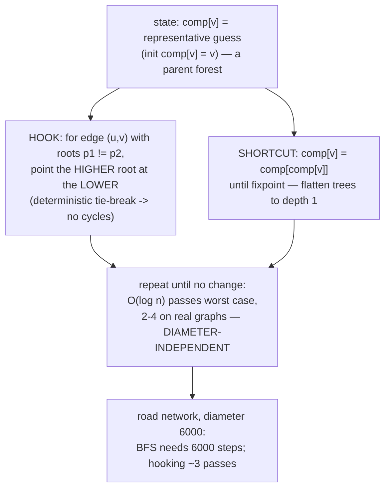
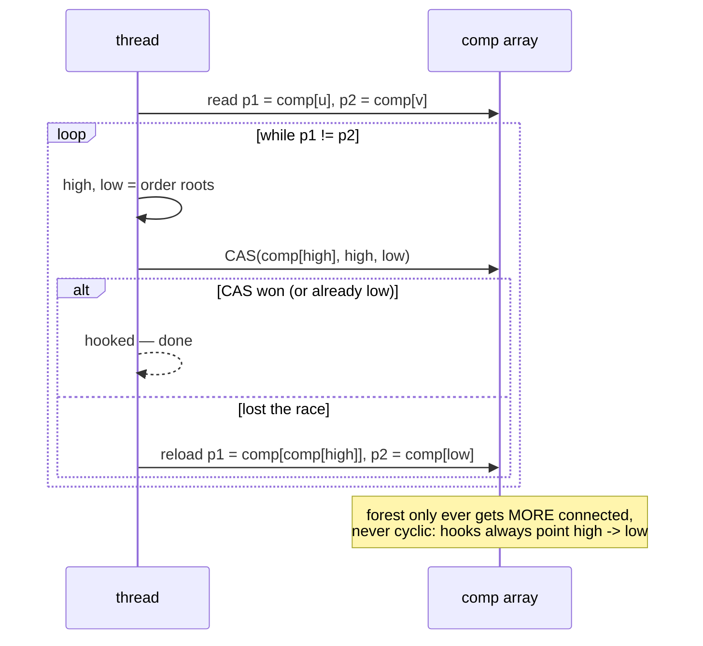
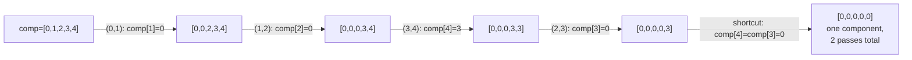
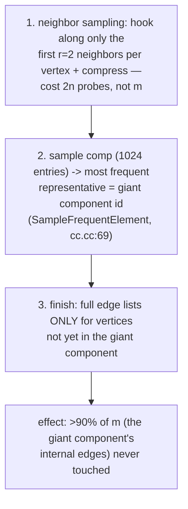
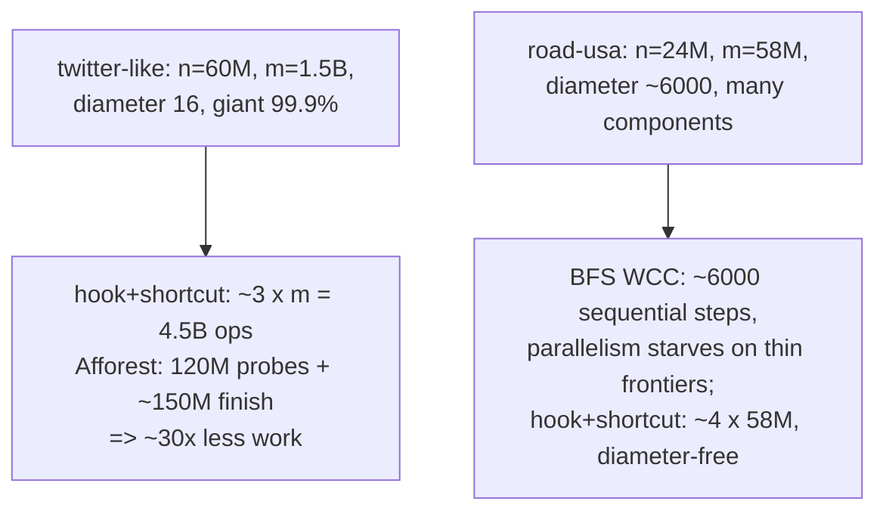
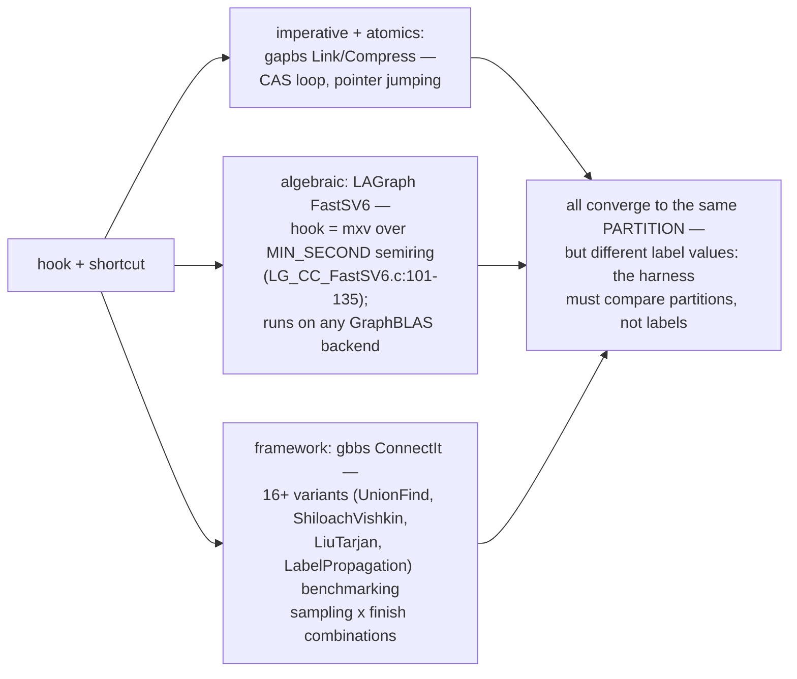
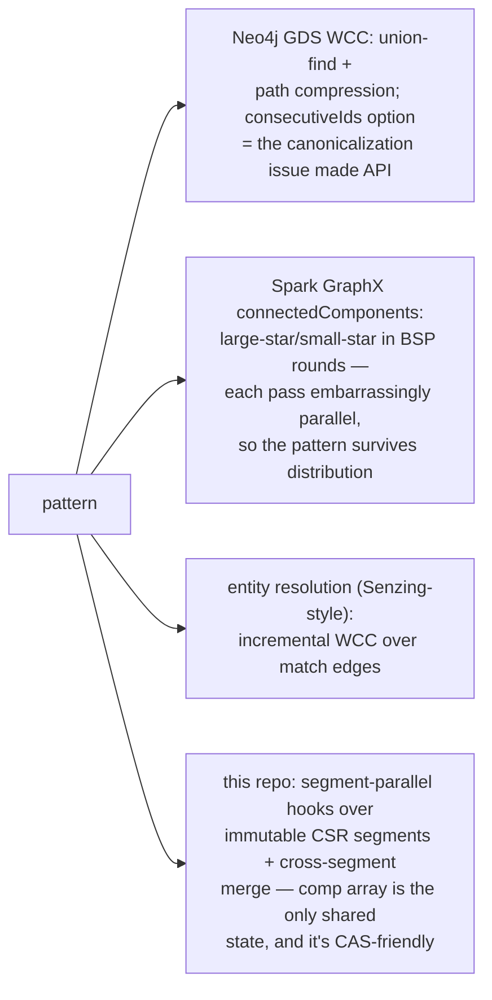
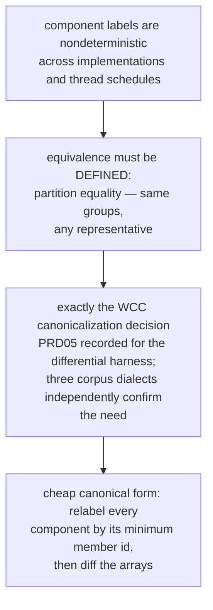
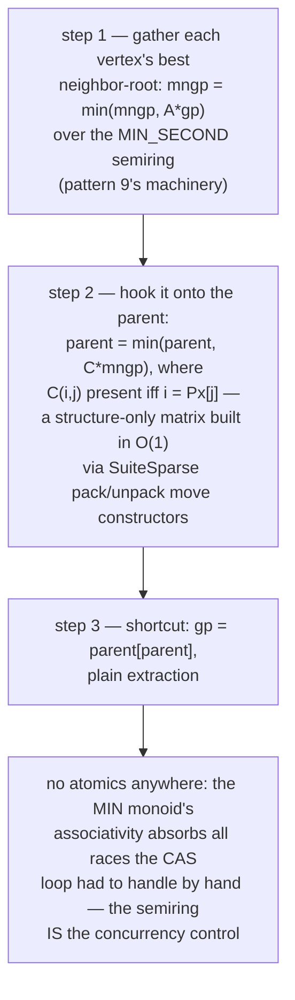
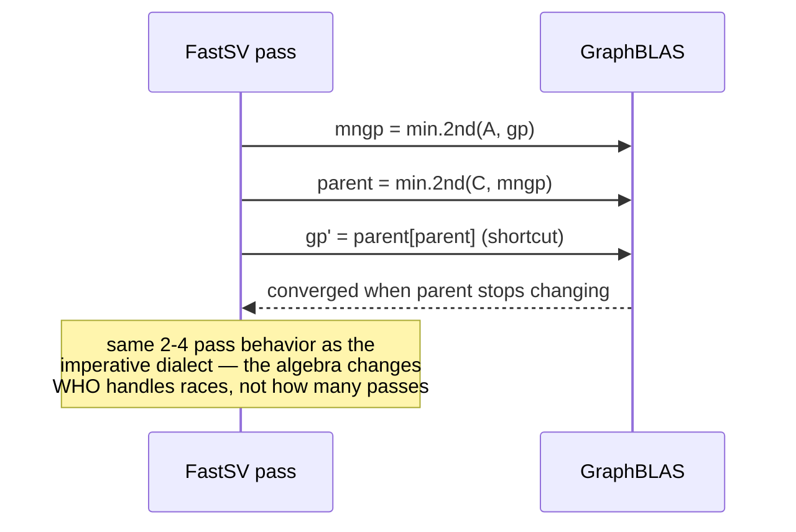

# Component Hooking Shortcutting — Mermaid

| Field | Value |
| --- | --- |
| Kind | algorithm |
| Pair | `component-hooking-shortcutting-ascii.md` / `component-hooking-shortcutting-mermaid.md` |
| One-line job | Find connected components without BFS: hook parent trees together along edges, shortcut them flat — converging in a handful of passes regardless of graph diameter |

## 1. The two moves

## 2. The lock-free hook (gapbs Link, cc.cc:41-55)

## 3. Trace: edges (0,1),(1,2),(3,4),(2,3)

## 4. Afforest — exploiting the giant component (gapbs default)

## 5. Worked example — two topologies

## 6. One algorithm, three dialects

## 7. Inheritance map

## 8. The verification angle

## 8b. FastSV's algebraic hook, unpacked

The most surprising cross-pattern artifact in the corpus: the CAS
loop of section 2 rewritten as two matrix products
(LG_CC_FastSV6.c:101-135).

## 9. Citing repos

| Repo | Path | Role |
| --- | --- | --- |
| gapbs | `reference-repos-corpus/gapbs-src/src/cc.cc` | Afforest reference: Link (41-55), Compress (59), sampling (69, 95-144) |
| LAGraph | `reference-repos-corpus/LAGraph-src/src/algorithm/LG_CC_FastSV6.c` | FastSV as MIN_SECOND algebra (101-135) |
| LAGraph | `reference-repos-corpus/LAGraph-src/src/algorithm/LG_CC_Boruvka.c` | Boruvka-style alternative |
| gbbs | `reference-repos-competitors/gbbs-src/benchmarks/Connectivity` | ConnectIt variant framework |
| ligra | `reference-repos-competitors/ligra-src/apps/Components.C` | label-propagation pole (Components-Shortcut.C adds shortcutting) |

## 10. Cross-references

- Sibling patterns: `semiring-matrix-traversal` (FastSV is its
  flagship application); `frontier-pushpull-switching` (the
  label-propagation pole); `csr-adjacency-layout` (the edge stream).
- Next in category: PageRank iteration structure; delta-stepping
  SSSP (bucketed frontiers — the priority-ordered cousin of the
  unordered edge stream this pattern consumes).
- Storage kinship: Afforest's sample-then-finish is the same
  amortization shape as `bloom-filter-shortcut` — spend a tiny
  probabilistic pre-pass (samples / filter bits) to skip the bulk of
  the expensive work (giant-component edges / disk reads).
- Paper trail: Shiloach-Vishkin (1982), Afforest (Sutton et al.),
  FastSV (Zhang et al.), ConnectIt (Dhulipala et al.) — see
  `research-papers-ledger.md` for verified entries.
- 202606 digest overlap: digests mentioned union-find; this pair
  adds hook/shortcut mechanics, Afforest sampling, and pass-count
  arithmetic.
