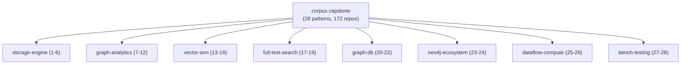
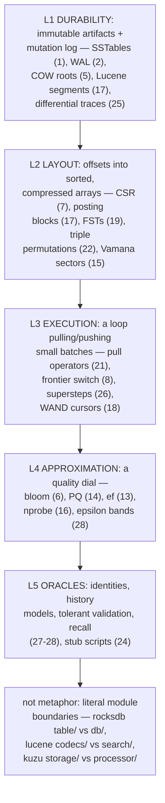
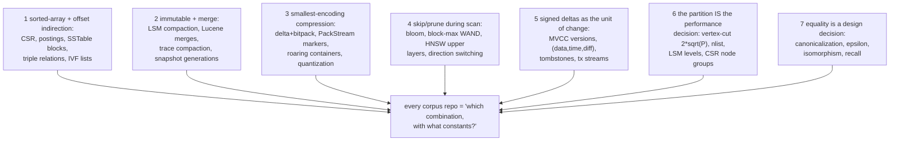
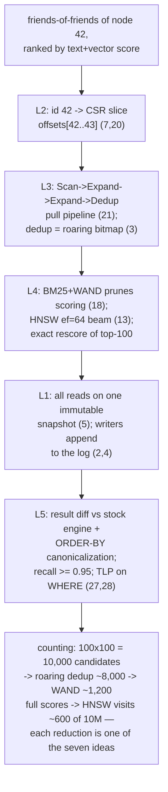
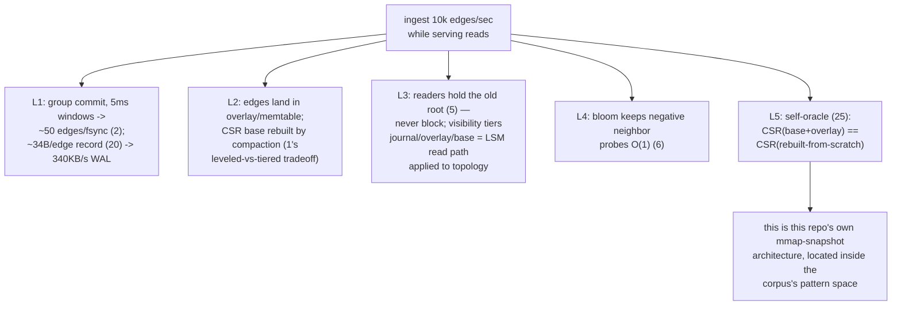
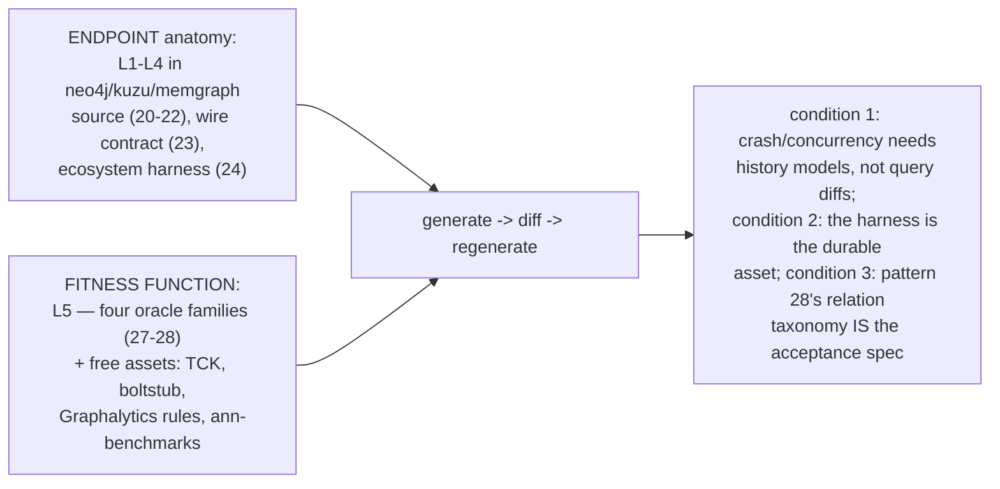
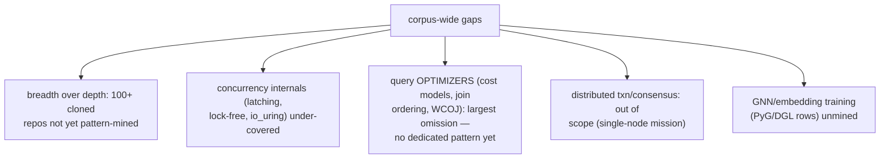
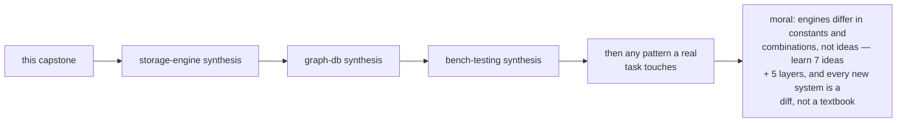
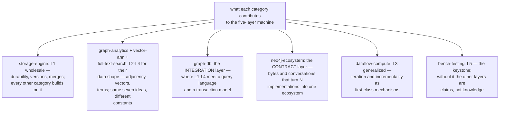

# Corpus Capstone Synthesis — Mermaid

| Field | Value |
| --- | --- |
| Kind | execution |
| Pair | `corpus-capstone-pattern-synthesis-ascii.md` / `corpus-capstone-pattern-synthesis-mermaid.md` |
| One-line job | Distill all 8 categories (28 patterns) into one narrative: every serious data engine is the same five-layer machine — an immutable-artifact storage core, a compressed adjacency/posting layout, a pull-or-frontier execution loop, an approximation dial, and an oracle stack — and the corpus shows the same ~7 ideas reinvented in every category |

## 1. What this rolls up

## 2. The five-layer machine

## 3. The seven ideas every category reinvents

## 4. One query through all layers

## 5. The same engine's write path

## 6. The convergence thesis in corpus terms

## 7. Honest gaps of the whole study

## 8. Reading path

## 8b. Where each category earns its keep

## 9. Citing repos (capstone cross-section)

| Repo | Path | Role |
| --- | --- | --- |
| rocksdb | `reference-repos-corpus/rocksdb-src/db/` | L1 exemplar (LSM, WAL, MVCC) |
| kuzu | `reference-repos-competitors/kuzu-src/src/include/processor/operator/physical_operator.h` | L3 pull pipeline |
| neo4j | `reference-repos-neo4j-family/neo4j-src/community/record-storage-engine/` | endpoint anatomy (records) |
| tantivy | `reference-repos-corpus/tantivy-src/src/` | L2/L4 (postings, FST, WAND kin) |
| faiss | `reference-repos-corpus/faiss-src/faiss/` | L4 (PQ/IVF/HNSW dials) |
| differential-dataflow | `reference-repos-corpus/differential-dataflow-src/differential-dataflow/src/collection.rs` | signed deltas (idea 5) |
| sqlancer | `reference-repos-corpus/sqlancer-src/src/sqlancer/common/oracle/TLPWhereOracle.java` | L5 identity oracle |
| ldbc_graphalytics | `reference-repos-corpus/ldbc_graphalytics-src/graphalytics-core/src/main/java/science/atlarge/graphalytics/validation/rule/EquivalenceValidationRule.java` | L5 equality taxonomy |

## 10. Cross-references

- Members: all 8 category syntheses; via them, patterns 1-28.
- Repo docs: `docs_PRD06/Rewrite-Sampling-And-Convergence-
  Thesis.md` (the why); `docs_PRD02` (the L1/L2 design this
  study contextualizes).
- The ASCII twin carries the same two worked examples with
  full arithmetic and the idea-by-category appearance table.
- Capstone exam: pick any repo in the 172-row ledger and name
  (a) its five layers by module path, (b) which of the seven
  ideas it uses at each layer and with what constants, and
  (c) the oracle family that would gate a rewrite of it —
  if the knowledgebase did its job, all three are answerable
  from the syntheses without opening the repo.
