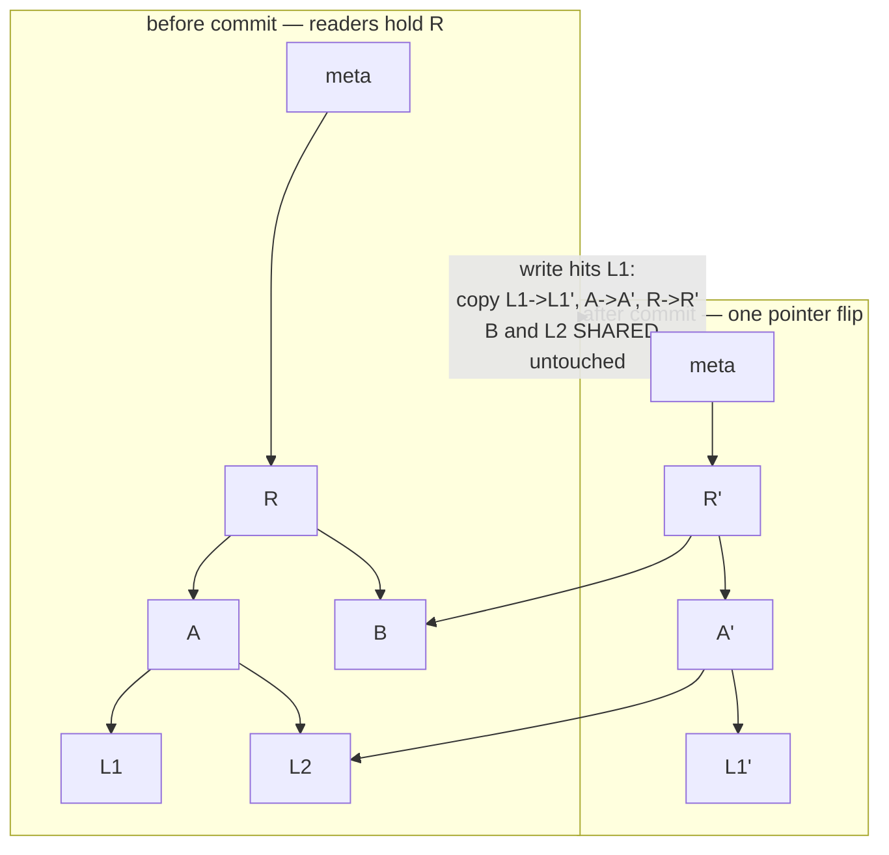
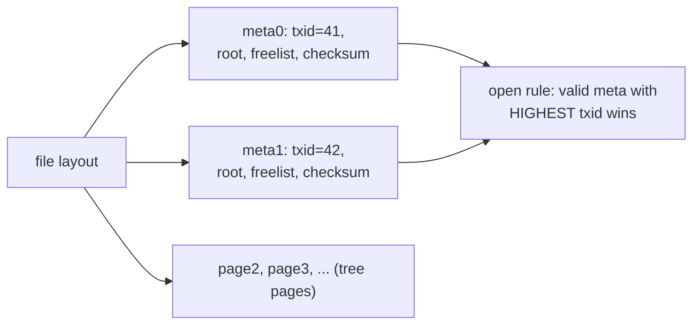
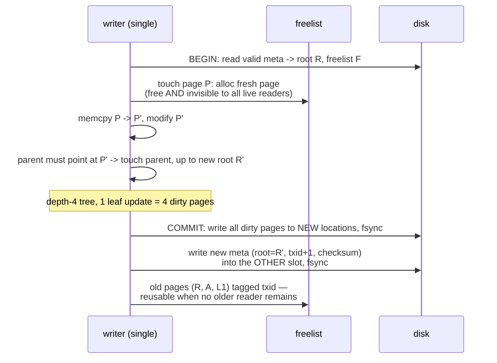
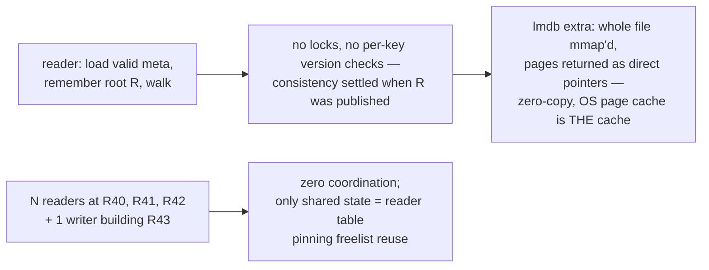
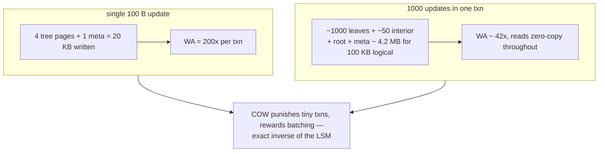
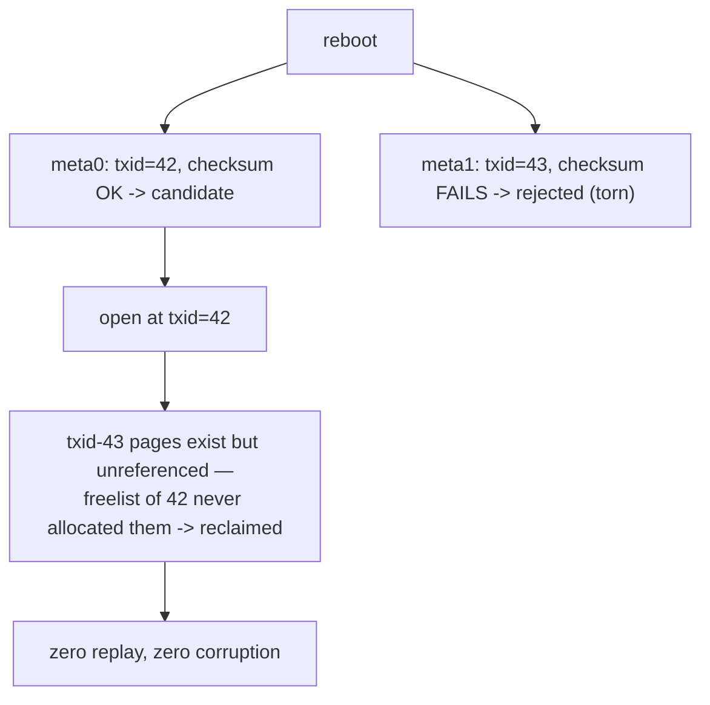
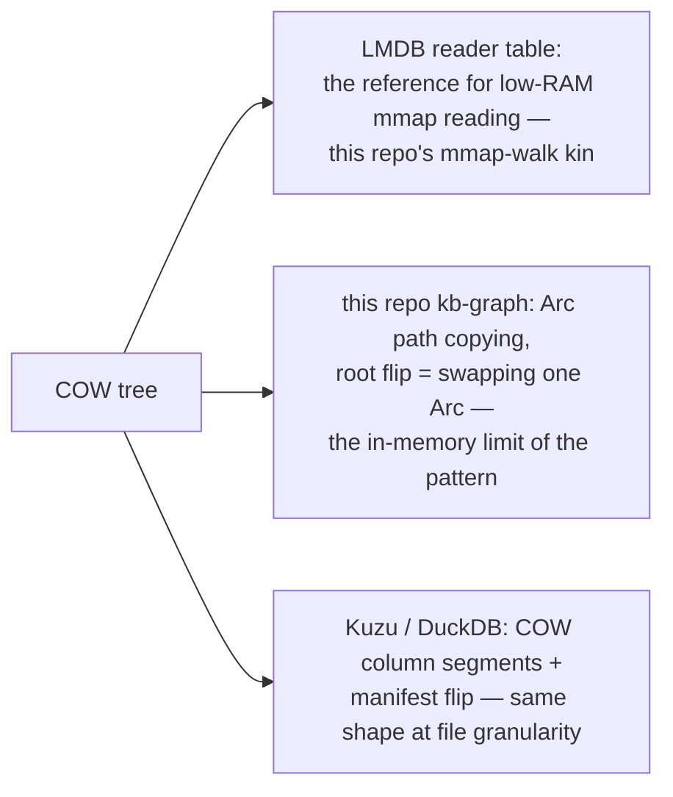

# COW Tree Snapshot — Mermaid

| Field | Value |
| --- | --- |
| Kind | storage |
| Pair | `cow-tree-snapshot-ascii.md` / `cow-tree-snapshot-mermaid.md` |
| One-line job | Make a whole B-tree transactional without any WAL: never modify a live page, copy the path from leaf to root, then flip one root pointer atomically |

## 1. The core move: path copying + root flip

A writer never touches a page a reader might see — it copies every page
it changes. New pages are unreachable garbage until one atomic act
publishes a new root. Crash anywhere: the old root still names a
complete, consistent tree. Recovery = "read the root pointer."

This is MVCC where the version is an entire tree root — compare
`mvcc-snapshot-visibility`, whose versions are per key.

## 2. The dual meta page — where the flip lands

- LMDB: 2 meta pages — "a meta page is the start point for accessing a
  database snapshot"
  (`reference-repos-corpus/lmdb-src/libraries/liblmdb/mdb.c`, line 1355;
  P_META flag at 1066).
- bbolt: metaA/metaB; `db.meta()` returns the higher valid txid
  (`reference-repos-corpus/bbolt-src/db.go`, lines 1141–1144).
- redb: commit slot 0/1 plus a "god byte" naming the primary, per-slot
  checksums
  (`reference-repos-corpus/redb-src/src/tree_store/page_store/header.rs`,
  lines 13–41).

## 3. One write transaction

Anchors: `mdb_page_touch` (mdb.c:3015); bbolt dirty-page write-out
(`reference-repos-corpus/bbolt-src/tx.go`, lines 242, 519); redb's
path-copying mutator
(`reference-repos-corpus/redb-src/src/tree_store/btree_mutator.rs`);
sled's epoch-batched flip
(`reference-repos-corpus/sled-src/src/flush_epoch.rs`).

## 4. The free read path

## 5. Worked example — write amplification of a 100-byte update

Depth-4 tree, 4 KB pages:

## 6. Worked example — crash between the two fsyncs

Writer finished dirty pages (fsync #1), died mid-meta-write (txid=43):

redb's `primary_corrupted` repair path (header.rs:88–91) and bbolt's
highest-valid-txid `meta()` implement exactly this.

## 7. Where graph systems inherit this

## 8. Citing repos

| Repo | Path | Role |
| --- | --- | --- |
| LMDB | `reference-repos-corpus/lmdb-src/libraries/liblmdb/mdb.c` | dual meta (1355), P_META (1066), mdb_page_touch (3015) |
| bbolt | `reference-repos-corpus/bbolt-src/db.go` | highest-valid-txid meta selection (1141-1144) |
| bbolt | `reference-repos-corpus/bbolt-src/tx.go` | dirty-page write-out at commit |
| redb | `reference-repos-corpus/redb-src/src/tree_store/page_store/header.rs` | commit slots + god byte, byte-documented |
| redb | `reference-repos-corpus/redb-src/src/tree_store/btree_mutator.rs` | Rust path-copying mutation |
| sled | `reference-repos-corpus/sled-src/src/flush_epoch.rs` | epoch-batched flip generalization |

## 9. Cross-references

- Sibling patterns: `mvcc-snapshot-visibility` (per-key vs whole-tree
  versions); `lsm-compaction-tradeoff` (opposing write philosophy);
  `wal-group-commit` (what COW eliminates and gives up).
- Paper trail: append-only B-tree lineage — `research-papers-ledger.md`.
- 202606 digest overlap: none — B-tree engines were uncovered before
  this pair.
