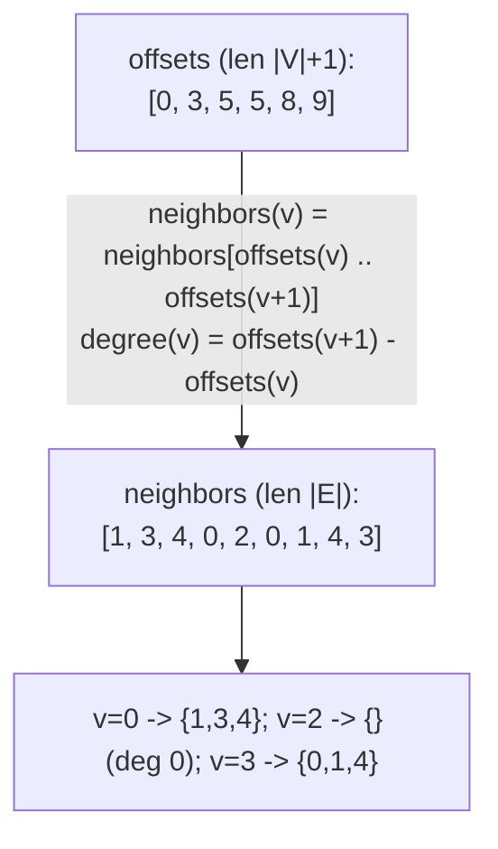
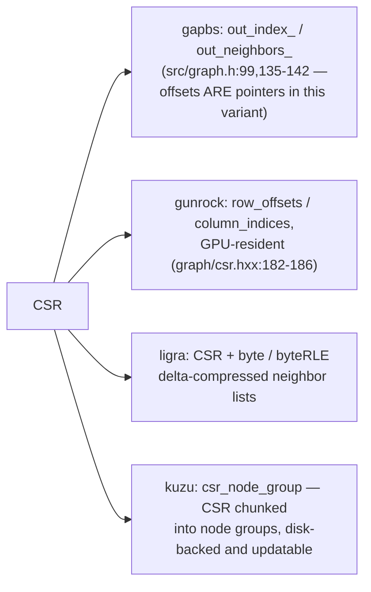
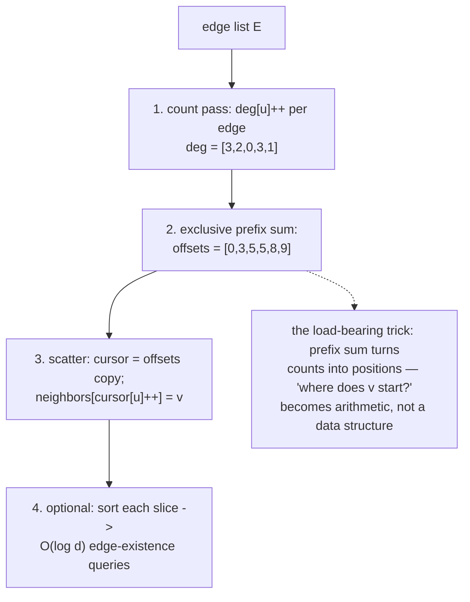
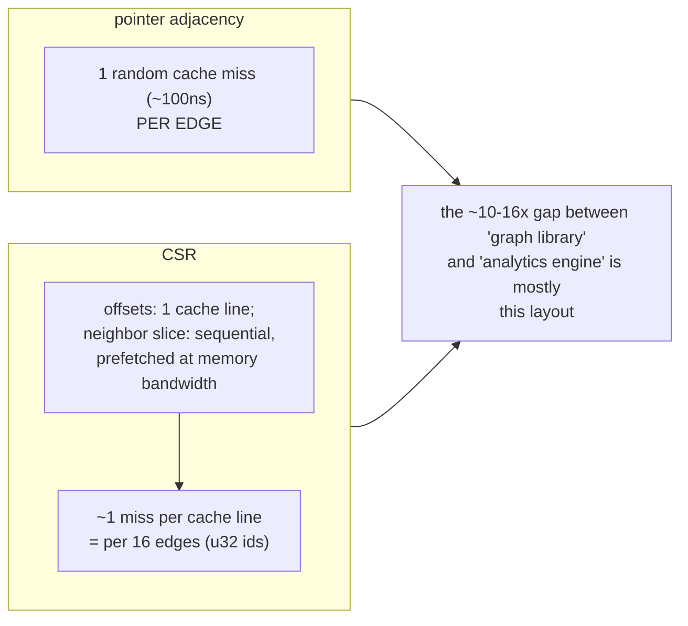
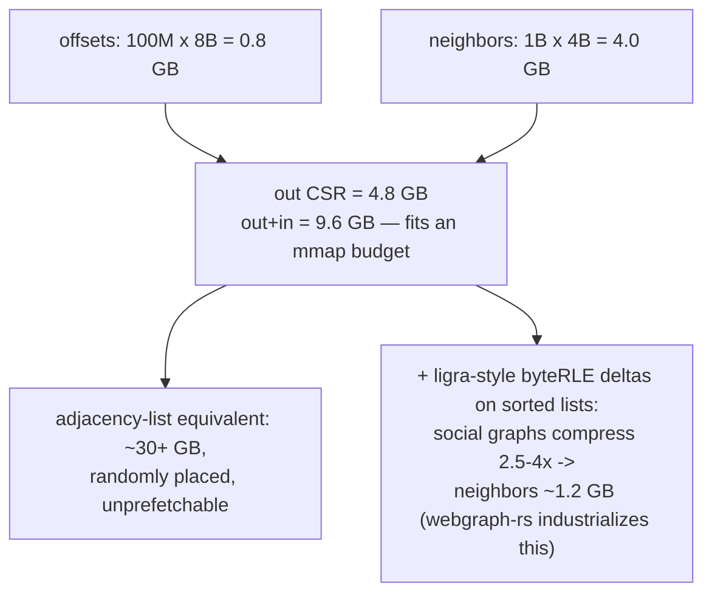
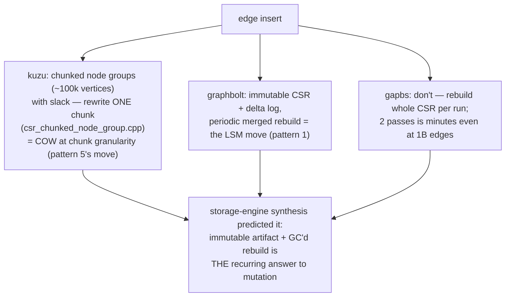
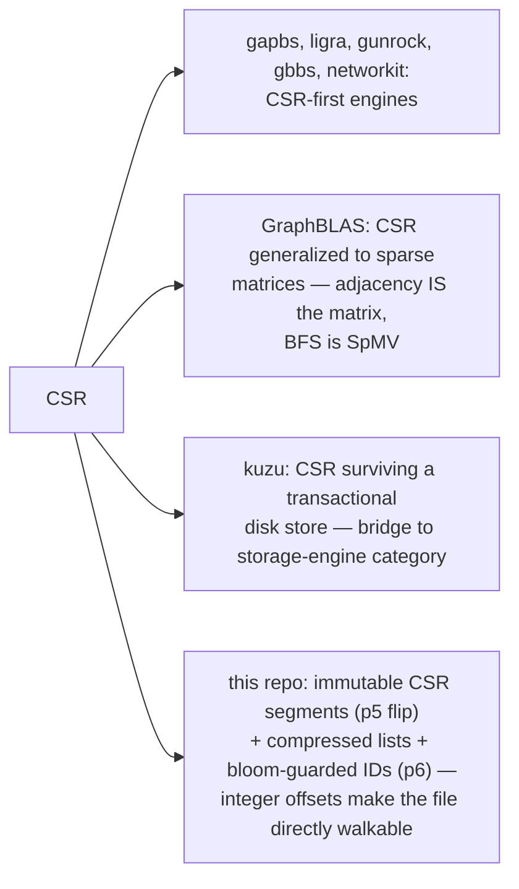
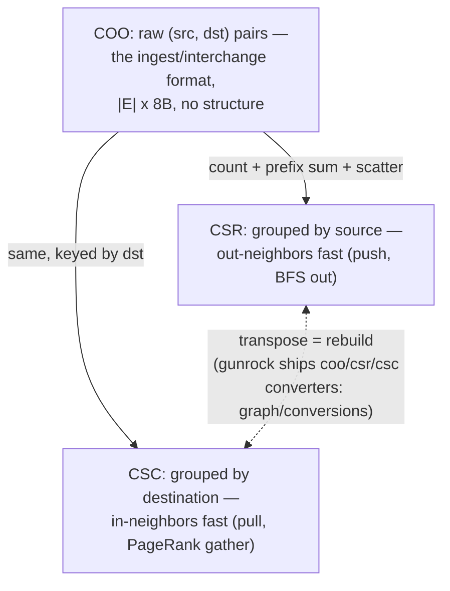
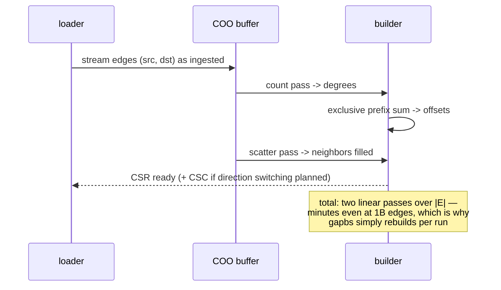

# CSR Adjacency Layout — Mermaid

| Field | Value |
| --- | --- |
| Kind | storage |
| Pair | `csr-adjacency-layout-ascii.md` / `csr-adjacency-layout-mermaid.md` |
| One-line job | Store a graph's adjacency as two flat arrays — offsets and neighbors — so that "give me v's neighbors" is two array reads and a contiguous scan |

## 1. The two arrays

Two loads and a linear scan; no pointers, no per-node allocation;
position-addressed — which is why it mmaps.

## 2. The same arrays across the witnesses

Directed graphs keep two CSRs (out + in = CSR + CSC); weights ride in
a parallel |E|-length array or widen entries to (target, weight).

## 3. Building CSR from an edge list

Two linear passes + a scan — trivially parallel (parlaylib's scan
primitives; gapbs's builder does count/scan/scatter in parallel).

## 4. Why analytics engines refuse anything else

GPU engines are stricter still: gunrock's load-balanced kernels
assign threads to slices of `column_indices` via merge-path search
over `row_offsets` — only possible because slice boundaries are plain
integers.

## 5. Worked example — memory arithmetic at a billion edges

|V| = 100M, |E| = 1B directed, u64 offsets, u32 ids:

## 6. Worked example — the price: updates

Insert one edge into a 1B-edge CSR = memmove ~2 GB on average. The
corpus answers:

## 7. Inheritance map

## 8. CSR vs CSC vs COO — the three sparse siblings

Engines that switch traversal direction at runtime (next pattern:
push/pull) must hold BOTH — doubling memory but unlocking the
direction-optimized BFS that made ligra famous. GraphBLAS hides the
choice behind the matrix abstraction and transposes lazily.

## 9. Citing repos

| Repo | Path | Role |
| --- | --- | --- |
| gapbs | `reference-repos-corpus/gapbs-src/src/graph.h` | reference CSRGraph (99-142), parallel builder |
| gunrock | `reference-repos-corpus/gunrock-src/include/gunrock/graph/csr.hxx` | GPU CSR (182-186) |
| ligra | `reference-repos-competitors/ligra-src/ligra/byte.h` | byte-coded delta-compressed lists |
| ligra | `reference-repos-competitors/ligra-src/ligra/byteRLE.h` | RLE list compression |
| kuzu | `reference-repos-competitors/kuzu-src/src/include/storage/table/csr_node_group.h` | disk-backed chunked updatable CSR |
| webgraph-rs | `reference-repos-corpus/webgraph-rs-src` | industrial compressed CSR for web graphs |
| parlaylib | `reference-repos-corpus/parlaylib-src` | parallel scan/scatter primitives |

## 10. Cross-references

- Sibling patterns: `cow-tree-snapshot` (kuzu's chunk rewrite);
  `lsm-compaction-tradeoff` (graphbolt's delta log);
  `roaring-bitmap-idsets` (bitmaps for membership, CSR for iteration).
- Next in category: frontier push/pull switching (exploits having
  both CSR and CSC); succinct rank/select offsets (sdsl-lite).
- 202606 digest overlap: digests named CSR as "the layout"; this pair
  adds build algorithm, update workarounds, cross-corpus numbers.
