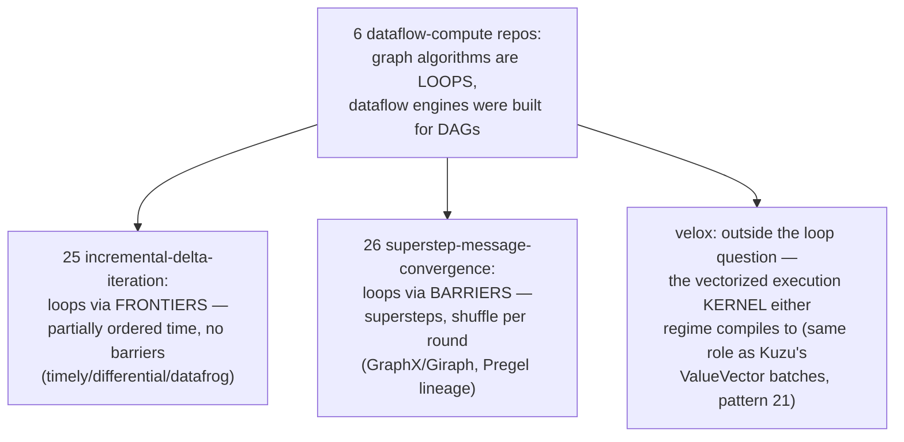
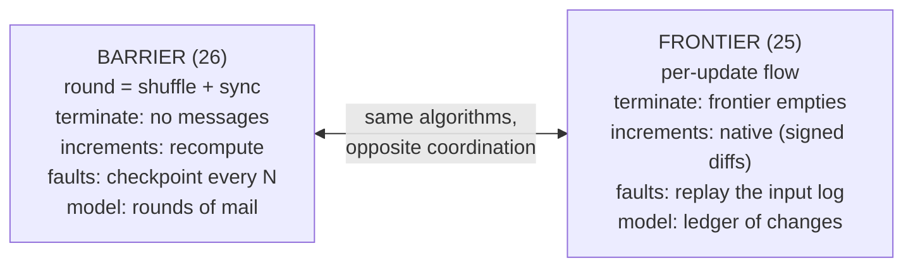
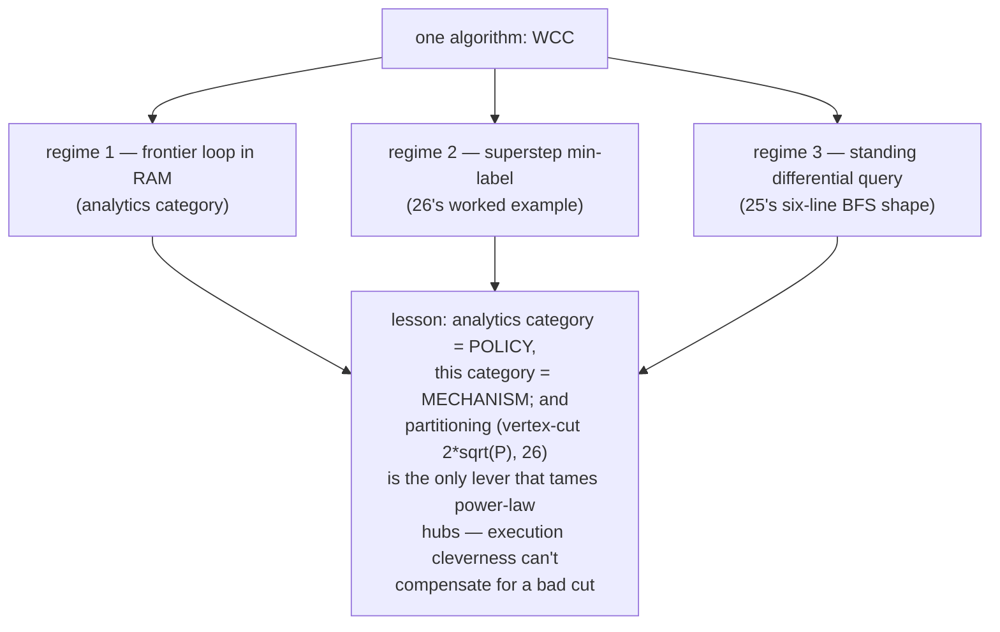
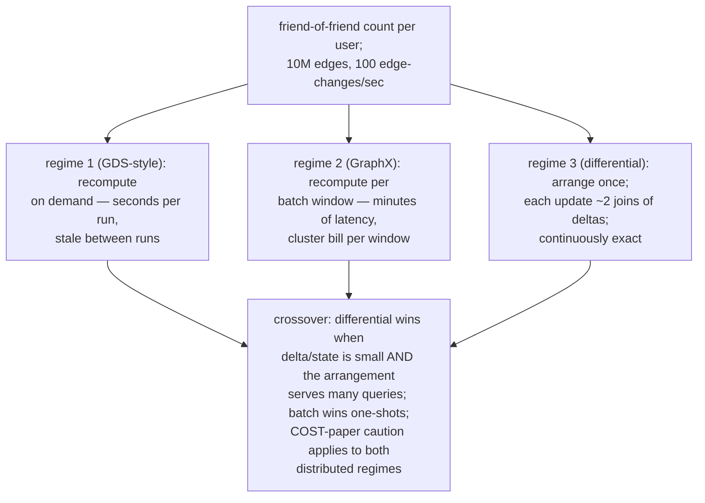
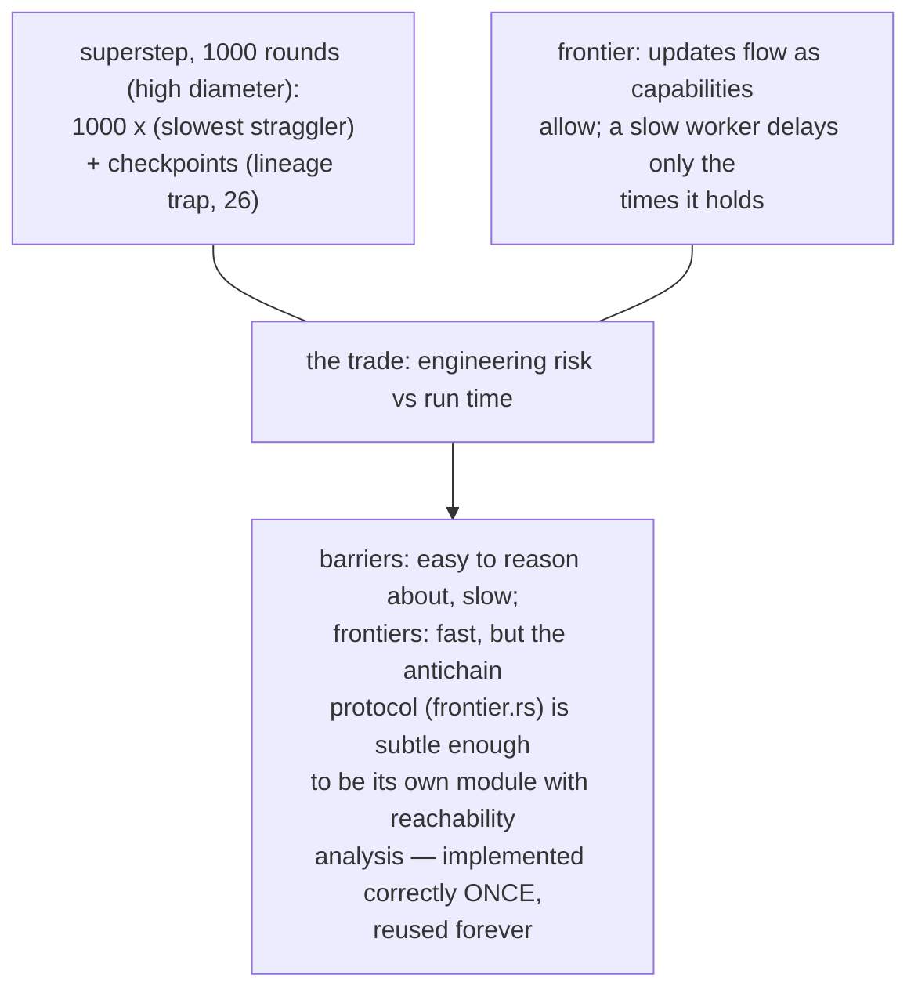
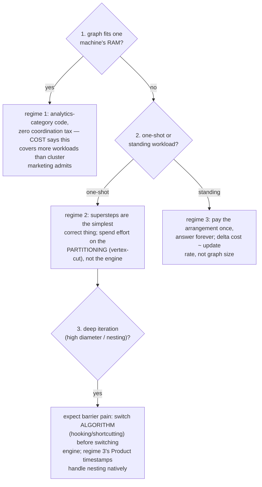
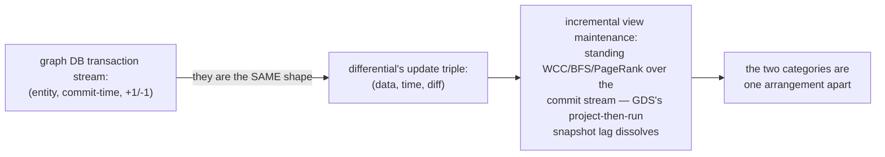
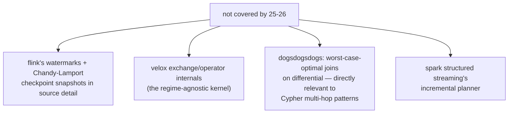
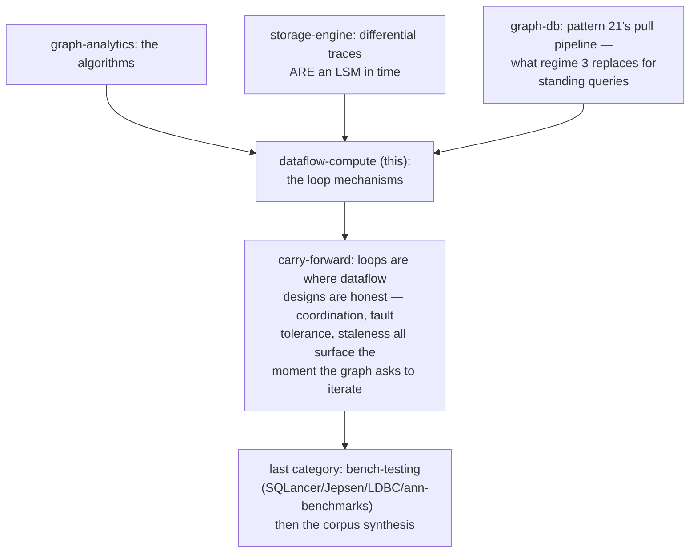
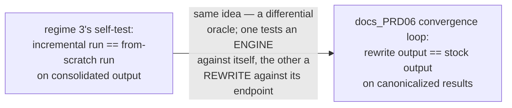

# Dataflow Compute Pattern Synthesis — Mermaid

| Field | Value |
| --- | --- |
| Kind | execution |
| Pair | `dataflow-compute-pattern-synthesis-ascii.md` / `dataflow-compute-pattern-synthesis-mermaid.md` |
| One-line job | Roll up patterns 25-26 into the category's thesis: iteration is the stress test of every dataflow design — barriers make it simple and slow to converge, frontiers make it fast and subtle, and the choice decides fault tolerance, memory, and freshness all at once |

## 1. The category in one map

## 2. One axis explains the category

## 3. Policy vs mechanism

## 4. Worked example — one query, three regimes

## 5. The barrier as fault line

## 5b. Choosing a regime — a decision walk

## 6. The bridge to graph databases

## 7. Honest gaps

## 8. Position in the corpus

## 9. The rewrite-thesis tie-in

## 10. Citing repos (category roll-up)

| Repo | Path | Role |
| --- | --- | --- |
| timely-dataflow | `reference-repos-corpus/timely-dataflow-src/timely/src/progress/frontier.rs` | antichain frontiers (25) |
| differential-dataflow | `reference-repos-corpus/differential-dataflow-src/differential-dataflow/src/algorithms/graphs/bfs.rs` | incremental BFS (25) |
| datafrog | `reference-repos-corpus/datafrog-src/src/variable.rs` | semi-naive miniature (25) |
| spark | `reference-repos-corpus/spark-src/graphx/src/main/scala/org/apache/spark/graphx/Pregel.scala` | superstep driver loop (26) |
| spark | `reference-repos-corpus/spark-src/graphx/src/main/scala/org/apache/spark/graphx/PartitionStrategy.scala` | vertex-cut bound (26) |
| giraph | `reference-repos-corpus/giraph-src/giraph-core/src/main/java/org/apache/giraph/graph/Vertex.java` | voteToHalt (26) |

## 11. Cross-references

- Members: `incremental-delta-iteration` (25),
  `superstep-message-convergence` (26).
- Prior syntheses: graph-analytics, storage-engine, graph-db,
  neo4j-ecosystem — this category supplies the loop mechanisms
  they all presuppose or avoid.
- Reading order: datafrog's variable.rs (200 lines), then
  GraphX's Pregel.scala (the loop with production scars), then
  differential's bfs.rs, then timely's frontier.rs.
- Terminology bridge across the two patterns: 26's "no
  messages left" and 25's "frontier empties" are the same
  termination fact expressed as data vs as capability; 26's
  combiner (merge-associative) and 25's consolidation (sum of
  diffs) are the same algebraic requirement; 26's checkpoint
  interval and 25's compaction frontier are both answers to
  "how much history may I discard?".
- The category's exam question: given a workload, name the
  regime, name the dominant cost (RAM / shuffle /
  arrangements), and name the free differential test it
  affords. All three answers come from the table in §2.
- The ASCII twin adds the same decision walk in prose plus the
  three-regime friend-of-friend worked example with concrete
  latency and cost characterizations.
