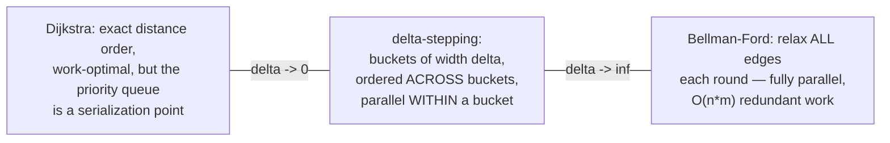
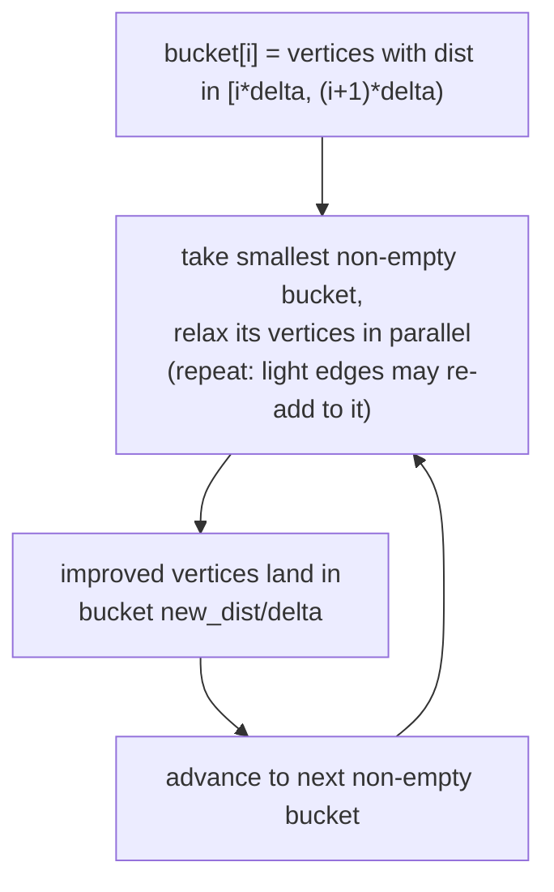
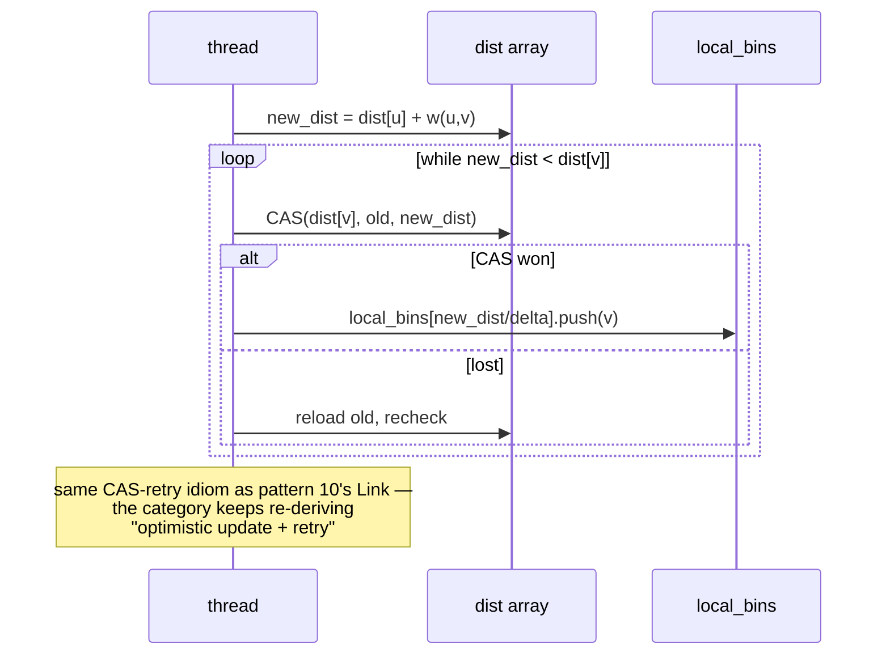
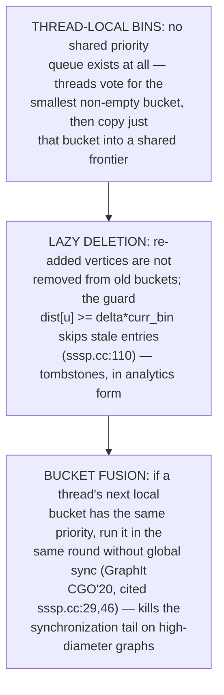
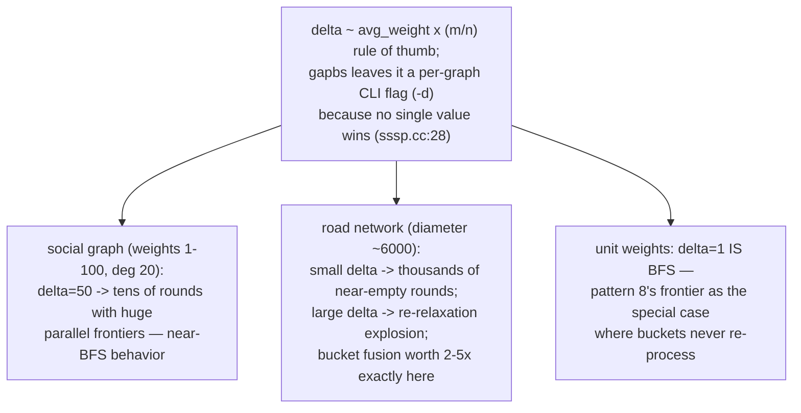
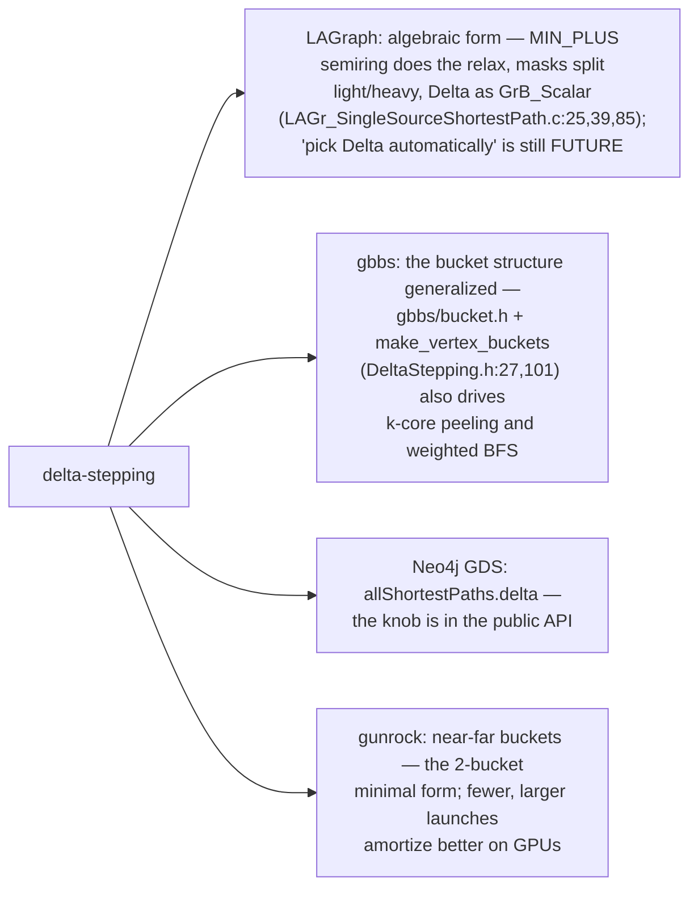
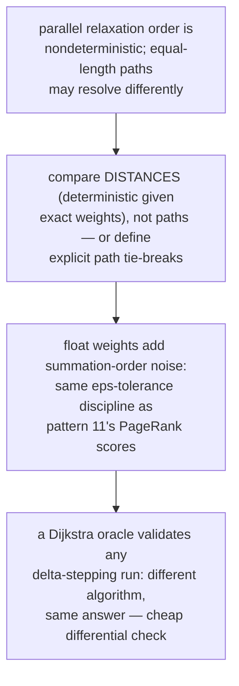
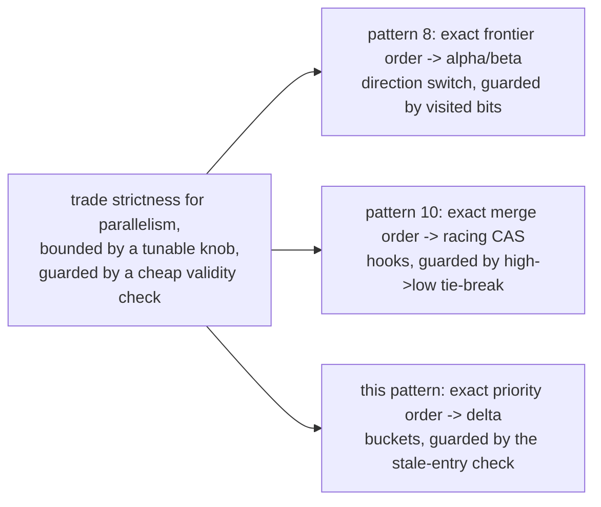
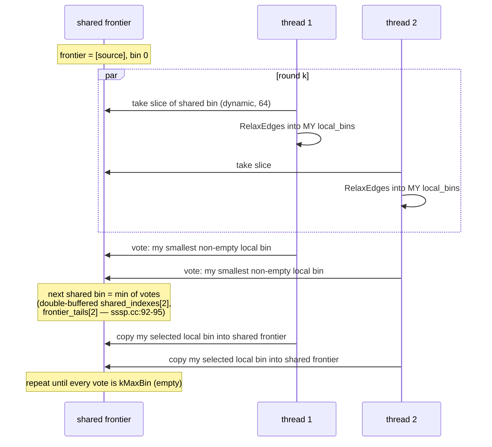

# Delta Stepping Buckets — Mermaid

| Field | Value |
| --- | --- |
| Kind | algorithm |
| Pair | `delta-stepping-buckets-ascii.md` / `delta-stepping-buckets-mermaid.md` |
| One-line job | Parallel shortest paths by relaxing Dijkstra's strict priority order into buckets of width delta — enough order for correctness pruning, enough slack for parallelism |

## 1. The dial between two poles





## 2. The relax kernel (gapbs RelaxEdges, sssp.cc:70-86)



## 3. Three engineering moves (gapbs sssp.cc:32-53)



## 4. Trace: delta=3, edges s->a(2), s->b(5), a->b(1), a->c(4), b->c(1)

```mermaid
sequenceDiagram
    participant B0 as bucket 0 [0,3)
    participant B1 as bucket 1 [3,6)
    participant B2 as bucket 2 [6,9)
    Note over B0: process s(0): a=2 -> B0, b=5 -> B1
    Note over B0: re-run B0: process a(2):<br/>b: 3<5 -> B1; c=6 -> B2
    Note over B1: process b(3): c: 4<6 -> B1 (re-run)
    Note over B1: process c(4): no out-edges
    Note over B2: stale c-entry (dist 6): guard skips it<br/>since dist[c]=4 < 2*delta
    Note over B0,B2: final dist = s:0 a:2 b:3 c:4;<br/>b relaxed twice — the price of parallelism
```

## 5. Choosing delta



## 6. Dialects and inheritance



## 7. The verification angle



## 8. The category's recurring meta-move



## 8b. Round structure end-to-end (gapbs DeltaStep, sssp.cc:87+)



The only shared mutable state per round: the dist array (CAS), one
frontier array, and two index/tail pairs — the entire "priority
queue" is emergent from voting over thread-local vectors.

## 9. Citing repos

| Repo | Path | Role |
| --- | --- | --- |
| gapbs | `reference-repos-corpus/gapbs-src/src/sssp.cc` | RelaxEdges CAS kernel (70-86), thread-local bins (32-39), lazy deletion (41-44), bucket fusion (46-53) |
| gbbs | `reference-repos-competitors/gbbs-src/benchmarks/PositiveWeightSSSP/DeltaStepping/DeltaStepping.h` | generalized bucket structure (27, 80-101) |
| gbbs | `reference-repos-competitors/gbbs-src/benchmarks/GeneralWeightSSSP/BellmanFord/BellmanFord.h` | the all-parallel pole |
| LAGraph | `reference-repos-corpus/LAGraph-src/src/algorithm/LAGr_SingleSourceShortestPath.c` | algebraic delta-stepping (25, 39, 85) |
| graphit | `reference-repos-corpus/graphit-src` | ordered-algorithm scheduling; origin of bucket fusion |

## 10. Cross-references

- Sibling patterns: `frontier-pushpull-switching` (delta=1 special
  case); `semiring-matrix-traversal` (MIN_PLUS relax);
  `component-hooking-shortcutting` (CAS-retry idiom);
  `lsm-compaction-tradeoff` (lazy deletion = tombstones).
- Next in category: graph-analytics synthesis pair rolling up
  patterns 7-12.
- Paper trail: Meyer & Sanders' original delta-stepping paper, the
  GraphIt CGO'20 ordered-algorithms paper (bucket fusion), and the
  GrAPL'19 GraphBLAS delta-stepping paper LAGraph cites — see
  `research-papers-ledger.md`.
- 202606 digest overlap: digests named delta-stepping as GDS's SSSP
  algorithm; this pair adds bucket mechanics, thread-local bins,
  fusion, and delta-tuning arithmetic.
