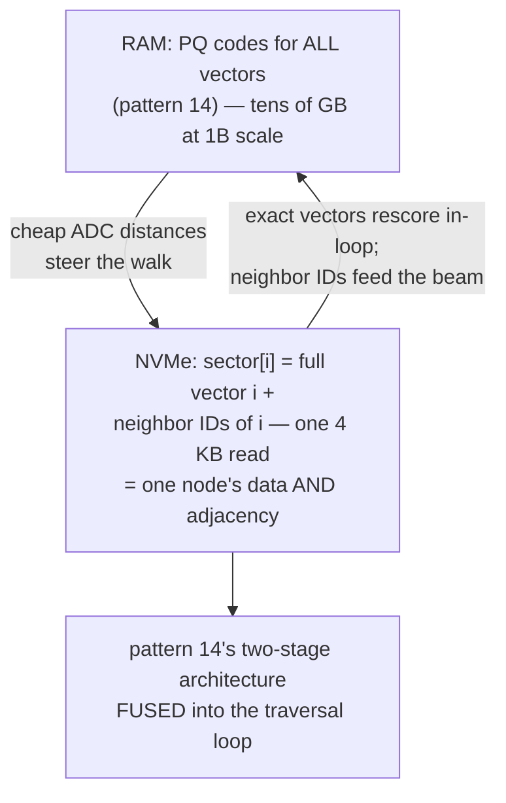
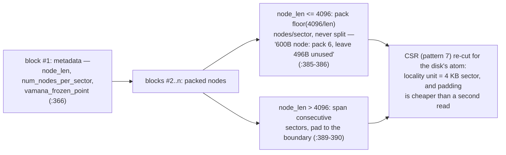
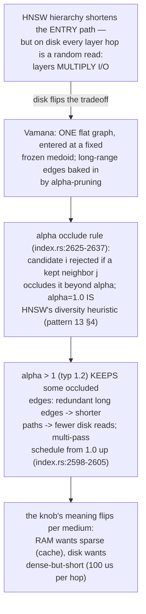
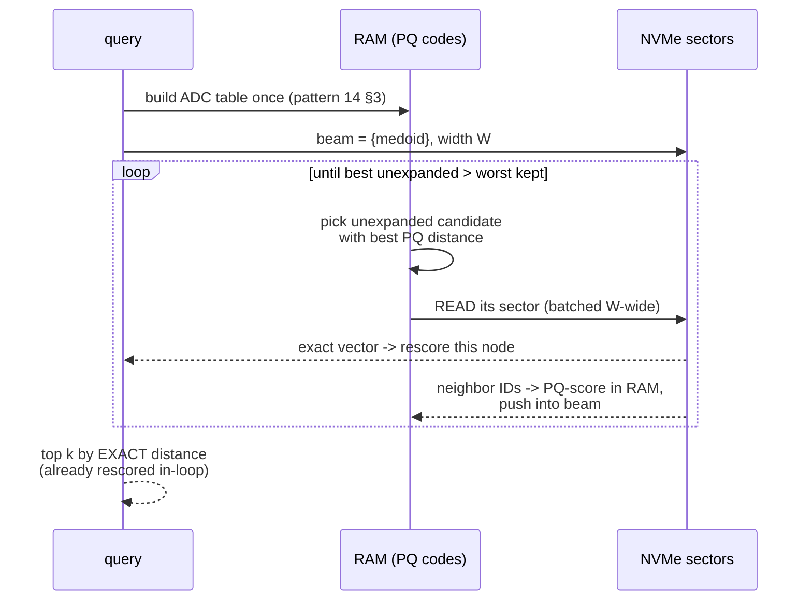
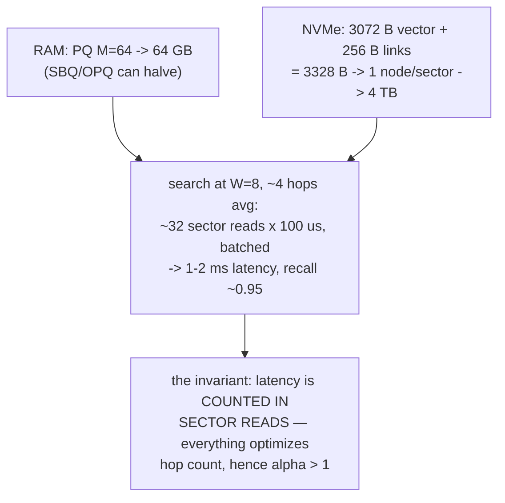
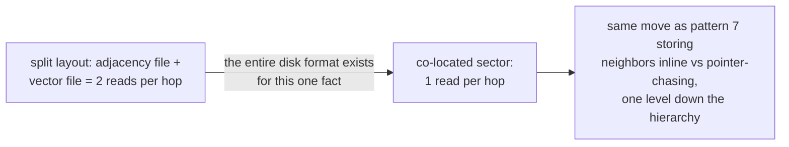
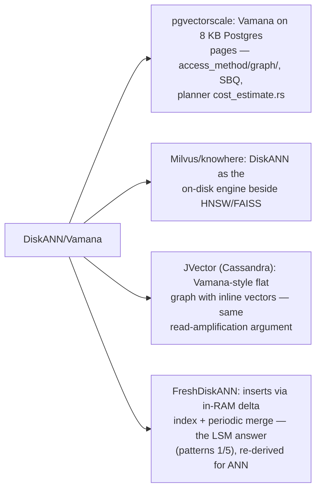
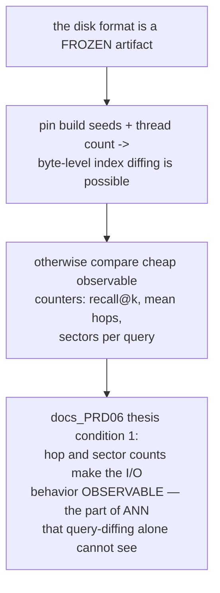
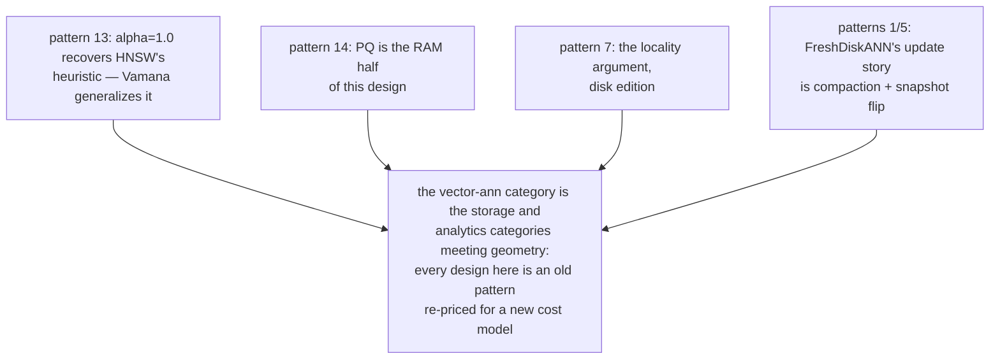

# DiskANN Vamana Layout — Mermaid

| Field | Value |
| --- | --- |
| Kind | storage |
| Pair | `diskann-vamana-layout-ascii.md` / `diskann-vamana-layout-mermaid.md` |
| One-line job | Billion-scale ANN on one machine by co-locating each vector WITH its neighbor list in a 4 KB disk sector: one flat graph (Vamana), alpha-relaxed pruning for short paths, PQ codes in RAM steering which sectors to read |

## 1. The memory split

## 2. The sector format (disk_index_writer.rs:362-390)

## 3. Why one flat graph — Vamana vs HNSW

## 4. Search, end to end

## 5. Budget at 1B x 768-d

## 6. Co-location arithmetic

## 7. Inheritance map

## 8. The verification angle

## 9. Kinship map

## 10. Citing repos

| Repo | Path | Role |
| --- | --- | --- |
| DiskANN | `reference-repos-corpus/DiskANN-src/diskann-disk/src/storage/disk_index_writer.rs` | sector format: metadata (366), packing/padding (385-390) |
| DiskANN | `reference-repos-corpus/DiskANN-src/diskann/src/graph/index.rs` | occlude_list alpha-pruning (2598-2605, 2625-2637, 2675) |
| DiskANN | `reference-repos-corpus/DiskANN-src/diskann-disk/src/search/` | PQ-steered beam over sectors (pq/, search_mode.rs) |
| pgvectorscale | `reference-repos-corpus/pgvectorscale-src/pgvectorscale/src/access_method/` | Vamana on Postgres pages |
| knowhere | `reference-repos-corpus/knowhere-src` | DiskANN inside Milvus |

## 11. Cross-references

- Sibling patterns: see §9 kinship map.
- Next in category: IVF partitioning (the clustering alternative),
  then the vector-ann synthesis pair.
- Paper trail: DiskANN (NeurIPS'19), FreshDiskANN, and the
  original Vamana description — see `research-papers-ledger.md`.
- 202606 digest overlap: digests named DiskANN as the
  billion-scale option; this pair adds sector packing rules,
  occlude arithmetic with line cites, and the I/O cost models.
