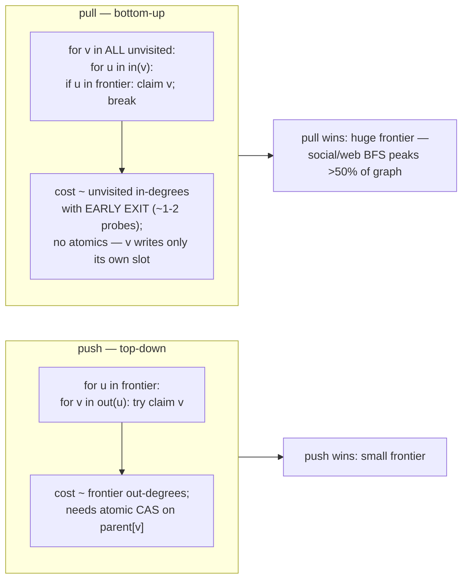
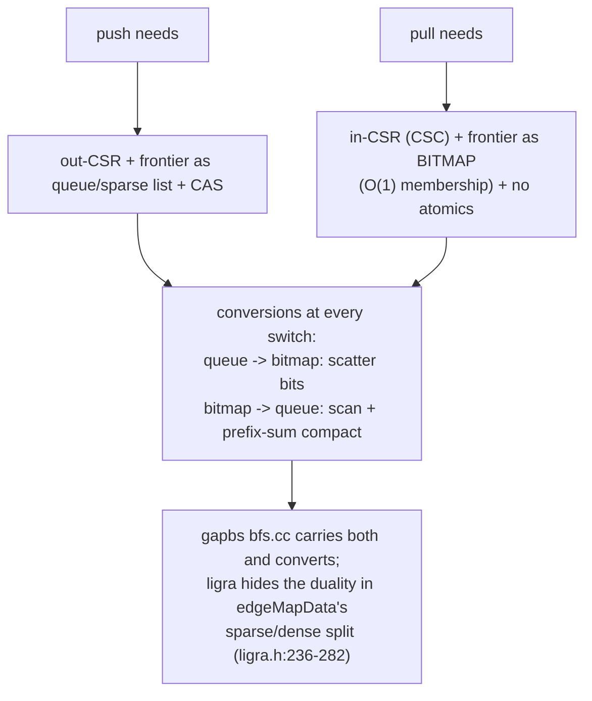
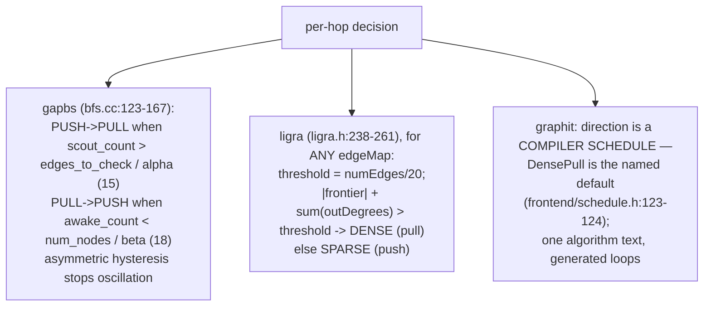
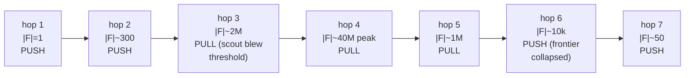
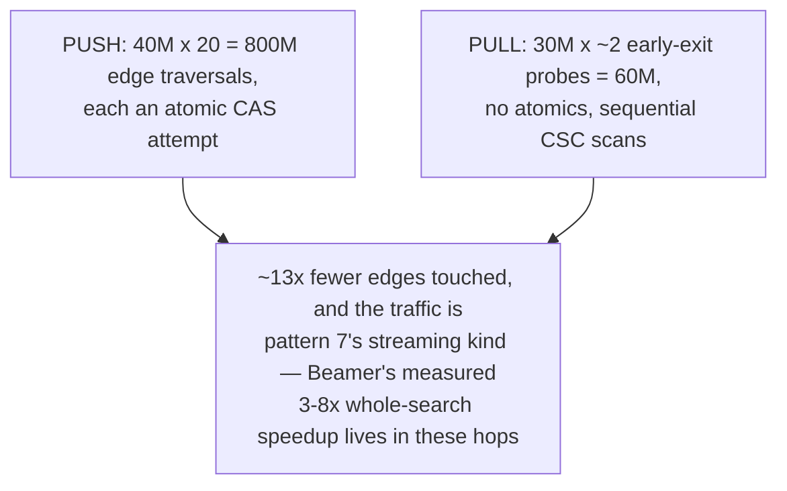
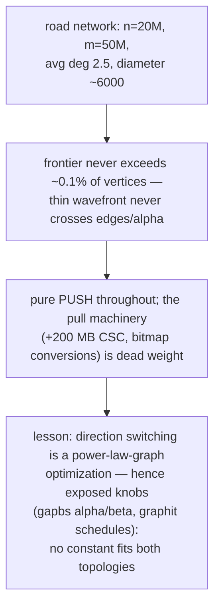
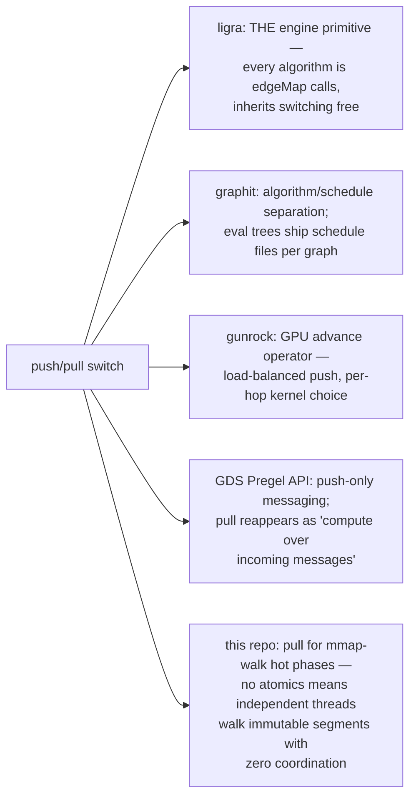
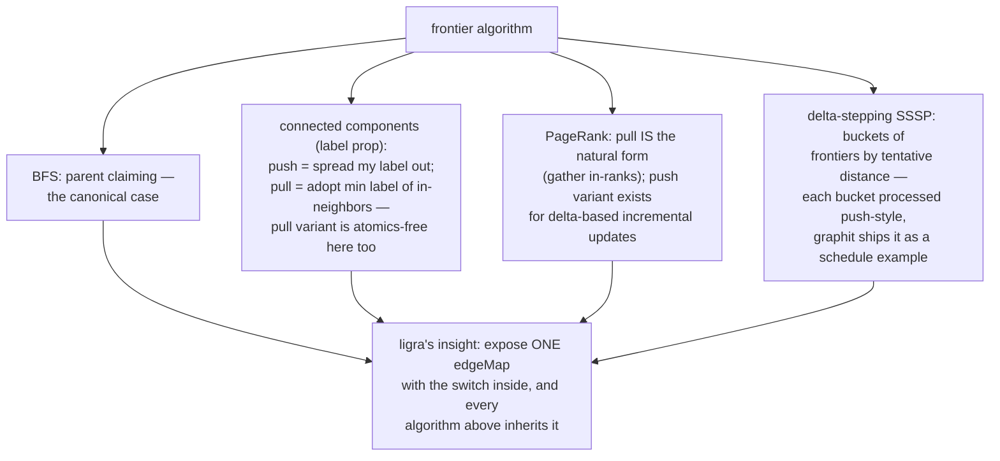

# Frontier PushPull Switching — Mermaid

| Field | Value |
| --- | --- |
| Kind | execution |
| Pair | `frontier-pushpull-switching-ascii.md` / `frontier-pushpull-switching-mermaid.md` |
| One-line job | Run each traversal step in whichever direction touches fewer edges — push from a small frontier, pull into a huge one — switching at a measured threshold |

## 1. The two directions



## 2. Machinery per direction



## 3. The switching rules



## 4. Direction-optimized BFS, hop by hop

Social graph, n = 100M:



## 5. Worked example — the arithmetic of one middle hop

n = 100M, m = 2B (avg deg 20); frontier 40M, unvisited 30M:



## 6. Worked example — when switching is a loss



## 6b. One full hop as a sequence

```mermaid
sequenceDiagram
    participant E as engine
    participant F as frontier
    participant CSR as out-CSR
    participant CSC as in-CSC
    E->>F: measure scout_count = sum out-degrees of frontier
    alt scout_count > edges_to_check / alpha
        E->>F: convert queue -> bitmap (scatter bits)
        loop each unvisited v (parallel, no atomics)
            E->>CSC: probe in(v) until a frontier parent found
            E->>E: parent[v] = u; awake_count++
        end
        Note over E: stay PULL while awake_count > n / beta
    else small frontier
        loop each u in frontier (parallel)
            E->>CSR: scan out(u)
            E->>E: CAS parent[v]: winner enqueues v
        end
    end
    E->>F: swap frontiers, next hop
```

The conversion costs (scatter / prefix-sum compact) are why the
hysteresis constants are asymmetric: switching itself isn't free, so
the engine demands a margin before flipping direction — the same
argument as any amortized-cost switch in the storage category
(compare tiered compaction's trigger margins in
`lsm-compaction-tradeoff`).

## 7. Inheritance map



## 7b. Beyond BFS — the same switch in other algorithms



## 8. Citing repos

| Repo | Path | Role |
| --- | --- | --- |
| gapbs | `reference-repos-corpus/gapbs-src/src/bfs.cc` | alpha/beta hysteresis (123-167), TDStep/BUStep (46-67) |
| ligra | `reference-repos-competitors/ligra-src/ligra/ligra.h` | engine-level sparse/dense edgeMap switch (236-282) |
| graphit | `reference-repos-corpus/graphit-src/include/graphit/frontend/schedule.h` | direction as compiler schedule (123-124) |
| gunrock | `reference-repos-corpus/gunrock-src/include/gunrock/framework/operators/advance/advance.hxx` | GPU advance operator |
| gbbs | `reference-repos-competitors/gbbs-src` | ligra's successor, same edgeMap contract |

## 9. Cross-references

- Sibling patterns: `csr-adjacency-layout` (why CSR + CSC coexist);
  `roaring-bitmap-idsets` (compressed dense-side frontiers).
- Next in category: label-propagation components; delta-stepping SSSP
  (bucketed frontiers).
- Storage kinship: the switch's amortization argument mirrors
  compaction triggers (`lsm-compaction-tradeoff` §scoring) — measure
  cheap proxies (scout_count / level sizes), flip strategy only past
  a margin, keep hysteresis so the system doesn't thrash between the
  two regimes.
- For differential verification (docs_PRD06 thesis): push and pull
  MUST produce identical results — a free self-check every
  direction-switching engine ships implicitly. Running both
  directions and diffing outputs is the cheapest oracle in this
  category.
- 202606 digest overlap: digests named the duality; this pair adds
  thresholds, hysteresis constants, and both topology regimes.
