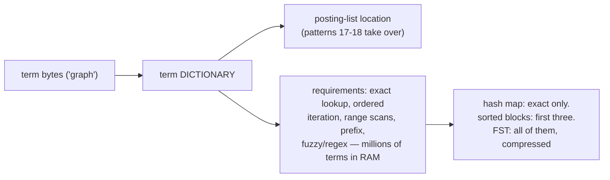
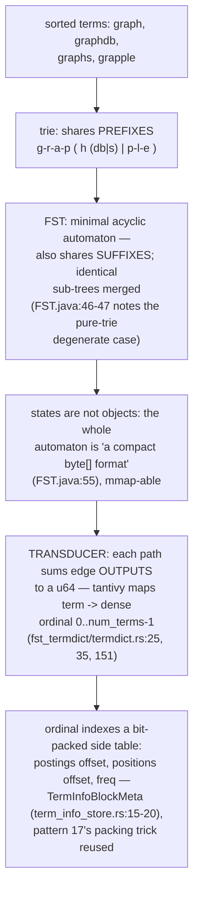
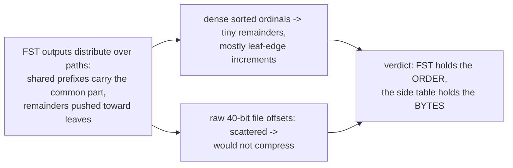
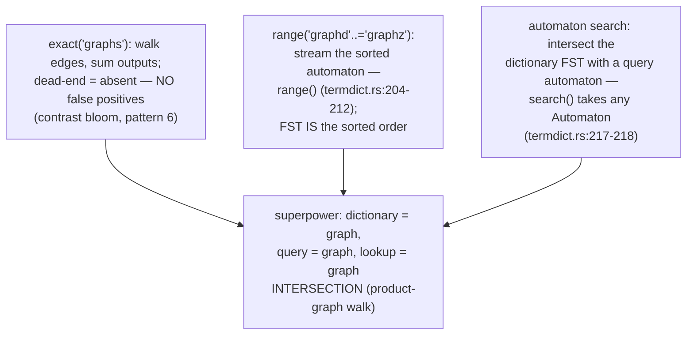
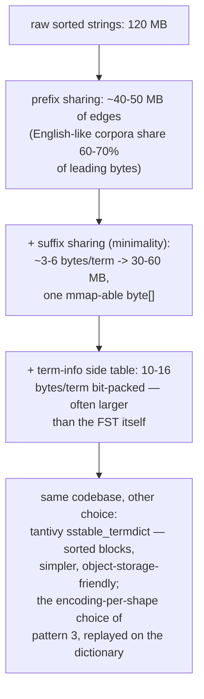
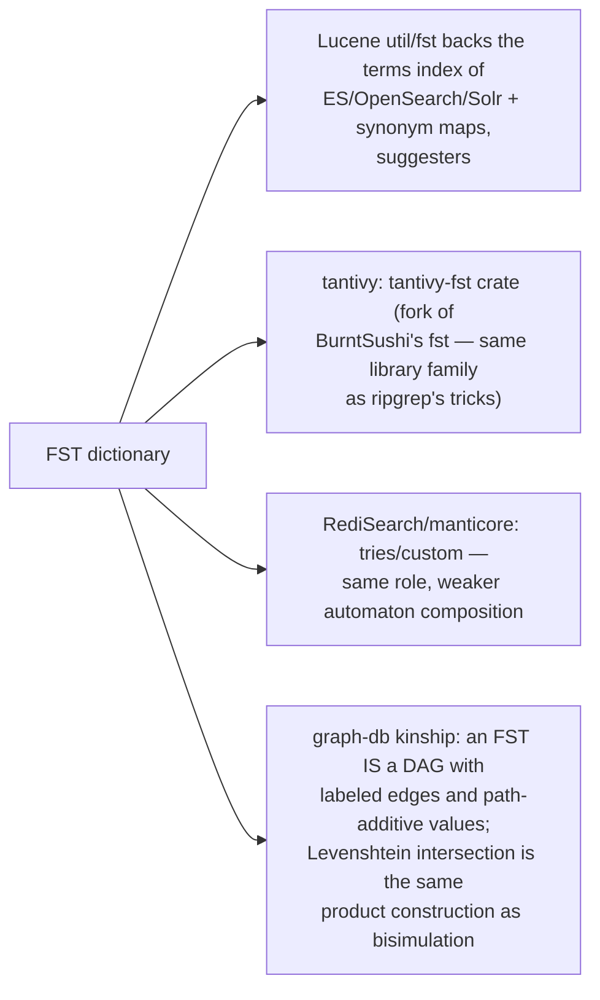
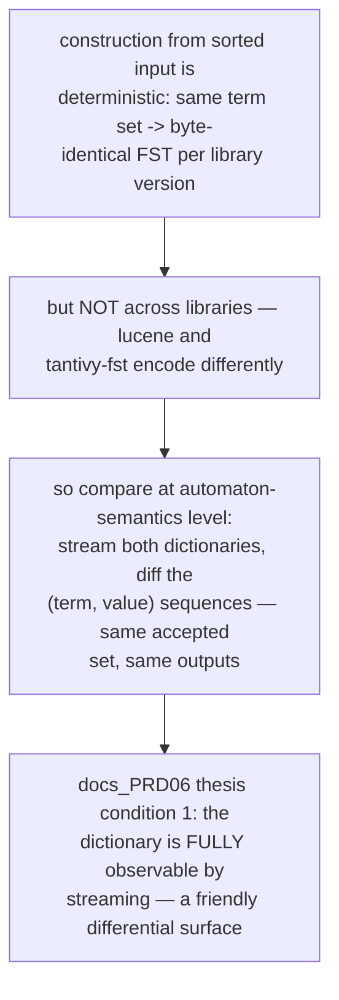
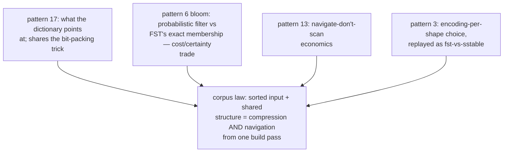

# FST Term Dictionary — Mermaid

| Field | Value |
| --- | --- |
| Kind | storage |
| Pair | `fst-term-dictionary-ascii.md` / `fst-term-dictionary-mermaid.md` |
| One-line job | Map every term in the index to its posting-list location through a finite-state transducer — a minimal automaton that shares both prefixes and suffixes, giving a compressed sorted dictionary that answers exact, range, prefix, and regex lookups in one structure |

## 1. The front door



## 2. From trie to FST



## 3. Why ordinals, not offsets



## 4. Three query shapes, one structure



## 5. Fuzzy search as lockstep walk

```mermaid
sequenceDiagram
    participant L as Levenshtein automaton<br/>(query 'grap', distance 1)
    participant F as dictionary FST (10M terms)
    participant W as lockstep walker
    W->>F: try edge 'g'
    W->>L: does the automaton accept 'g...'?
    Note over W: only paths BOTH machines accept<br/>are explored — pruning at every byte
    W->>F: descend g-r-a-p, branch on h/p/...
    L-->>W: reject branches beyond distance 1
    W-->>W: emit matching terms + ordinals
    Note over L,F: cost scales with the RESULT<br/>neighborhood, not dictionary size —<br/>thousands of edges vs 10M edit-distance<br/>computations; navigate-don't-scan<br/>(patterns 13, 17)
```

## 6. Size arithmetic (10M terms, avg 12 bytes)



## 7. Inheritance map



## 8. The verification angle



## 9. Kinship map



## 10. Citing repos

| Repo | Path | Role |
| --- | --- | --- |
| lucene | `reference-repos-corpus/lucene-src/lucene/core/src/java/org/apache/lucene/util/fst/FST.java` | byte[]-encoded automaton (46-47, 55) |
| lucene | `reference-repos-corpus/lucene-src/lucene/core/src/java/org/apache/lucene/util/fst/FSTCompiler.java` | builds minimal FSTs from sorted input |
| tantivy | `reference-repos-corpus/tantivy-src/src/termdict/fst_termdict/termdict.rs` | MapBuilder (25, 35), ordinals (151), range (204-212), automaton search (217-218) |
| tantivy | `reference-repos-corpus/tantivy-src/src/termdict/fst_termdict/term_info_store.rs` | bit-packed TermInfo side table (15-20) |
| tantivy | `reference-repos-corpus/tantivy-src/src/termdict/sstable_termdict/` | the sorted-block alternative |

## 11. Cross-references

- Sibling patterns: see §9 kinship map.
- Next in category: FTS category synthesis pair (patterns 17-19
  plus segment-lifecycle notes riding on pattern 1).
- Paper trail: Mihov/Schulz Levenshtein-automata paper and the
  Daciuk et al. incremental minimal-automaton construction —
  queued in `research-papers-ledger.md`.
- 202606 digest overlap: digests mentioned "FST term dictionary"
  as a keyword; this pair adds suffix-sharing mechanics, output
  arithmetic, automaton intersection, and size/cost numbers.
