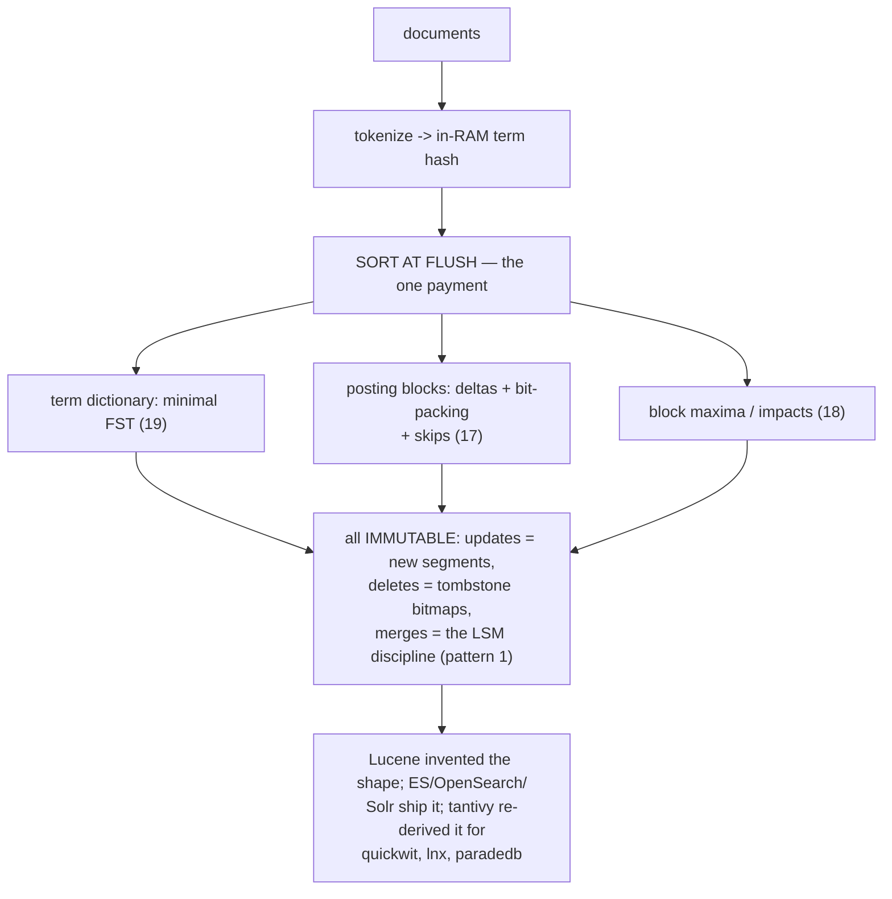
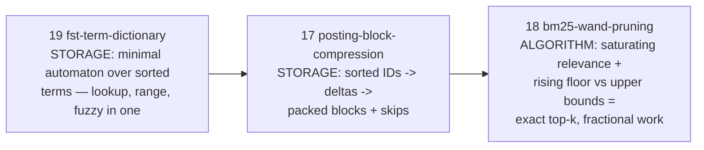
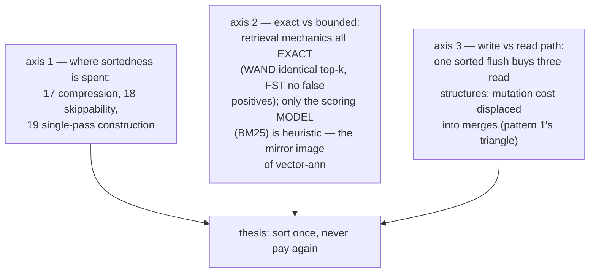
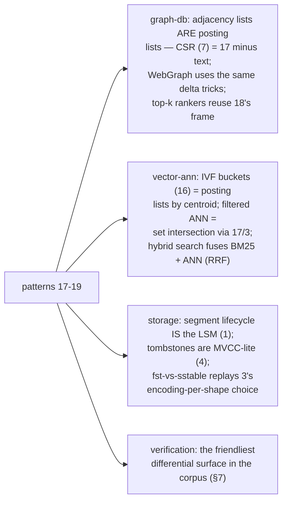
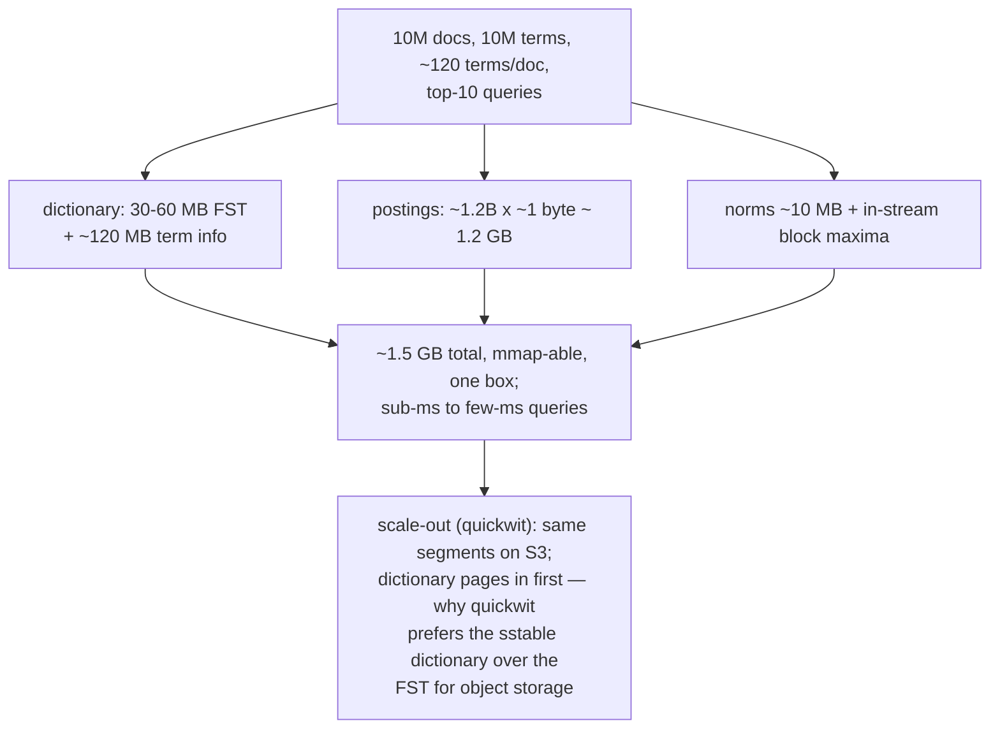
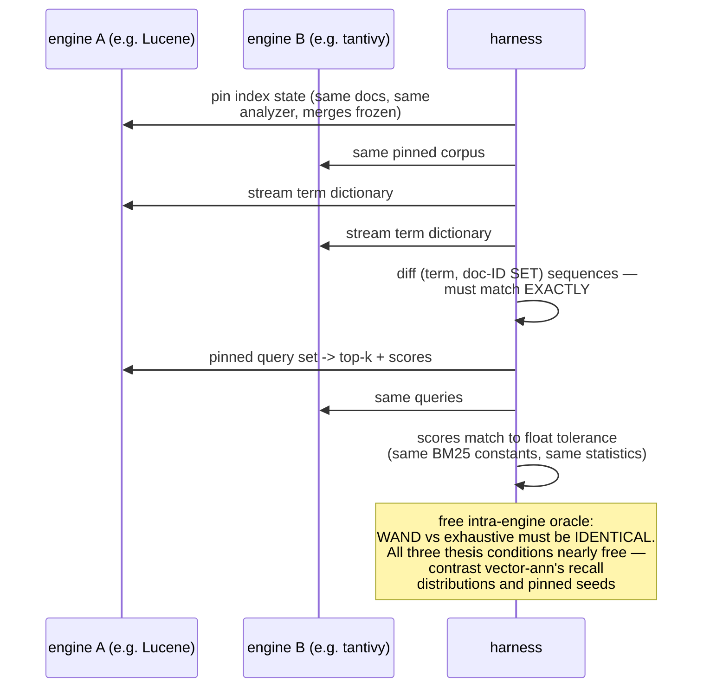
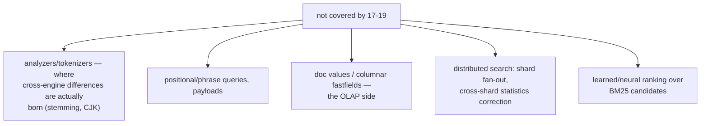
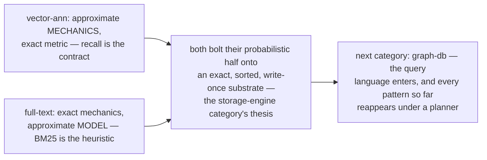

# Full-Text Search Pattern Synthesis — Mermaid

| Field | Value |
| --- | --- |
| Kind | execution |
| Pair | `full-text-search-pattern-synthesis-ascii.md` / `full-text-search-pattern-synthesis-mermaid.md` |
| One-line job | Roll up patterns 17-19 into the category's single thesis: sort once at segment flush, then every structure — posting blocks, score bounds, term automata — is a free consequence of sorted, write-once data |

## 1. The category in one map



## 2. The three patterns



## 3. The organizing axes



## 4. One query, end to end

```mermaid
sequenceDiagram
    participant Q as query "graph database" (k=10)
    participant F as FST dictionary (19)
    participant S as statistics (18 §9b)
    participant P as posting blocks (17)
    participant W as WAND loop (18)
    Q->>F: two automaton walks -> ordinals -><br/>TermInfo (offsets, doc freqs) — microseconds
    F->>S: doc freqs -> index-wide idf
    S->>P: open two block streams, skip data ready
    P->>W: drive the shorter list;<br/>advance() the longer via skips
    W->>W: block-max bounds kill most blocks;<br/>heap floor rises monotonically
    W-->>Q: EXACT top-10, ~5-20x fewer scored<br/>docs; every byte a sequential block read
```

## 5. What the category exports



## 6. One workload, sized



## 7. The verification pipeline



## 8. Honest gaps



## 9. The mirror-image law



## 10. Citing repos (category roll-up)

| Repo | Path | Role |
| --- | --- | --- |
| lucene | `reference-repos-corpus/lucene-src/lucene/core/src/java/org/apache/lucene/codecs/lucene104/` | posting format + ForUtil (17) |
| lucene | `reference-repos-corpus/lucene-src/lucene/core/src/java/org/apache/lucene/search/WANDScorer.java` | WAND / block-max (18) |
| lucene | `reference-repos-corpus/lucene-src/lucene/core/src/java/org/apache/lucene/util/fst/` | FST terms index (19) |
| tantivy | `reference-repos-corpus/tantivy-src/src/postings/` | Rust posting blocks (17) |
| tantivy | `reference-repos-corpus/tantivy-src/src/query/bm25.rs` | BM25 constants/formula (18) |
| tantivy | `reference-repos-corpus/tantivy-src/src/termdict/` | FST + sstable dictionaries (19) |
| quickwit | `reference-repos-corpus/quickwit-src` | segments on object storage |
| elasticsearch | `reference-repos-corpus/elasticsearch-src` | Lucene shipped at scale |
| OpenSearch | `reference-repos-corpus/OpenSearch-src` | the fork, same core |
| paradedb | `reference-repos-corpus/paradedb-src` | tantivy inside Postgres |

## 11. Cross-references

- Members: `posting-block-compression` (17), `bm25-wand-pruning`
  (18), `fst-term-dictionary` (19).
- Prior syntheses: storage-engine (1/4 wearing text clothes),
  graph-analytics (CSR kinship, 7), vector-ann (the mirror-image
  approximation contract, 13-16).
- Verification carry-forward: an index-state pin is the ONLY
  precondition FTS needs; a Lucene-vs-tantivy harness is a
  weekend project — the cheapest place to practice the
  docs_PRD06 convergence loop before pointing it at Neo4j.
- Category coverage note: 17 of 17 full-text-search ledger rows
  are shallow-cloned; patterns were extracted from the two
  reference implementations (lucene, tantivy) and inheritance
  verified against the downstream engines' dependency on them
  (ES/OpenSearch/Solr vendor lucene; quickwit/lnx/paradedb
  vendor tantivy).
