# Graph Analytics Pattern Synthesis — Mermaid

| Field | Value |
| --- | --- |
| Kind | execution |
| Pair | `graph-analytics-pattern-synthesis-ascii.md` / `graph-analytics-pattern-synthesis-mermaid.md` |
| One-line job | Roll up patterns 7-12: what the graph-analytics category teaches as a whole — one layout, one duality, one algebra, and one recurring meta-move |

## 1. The category stack

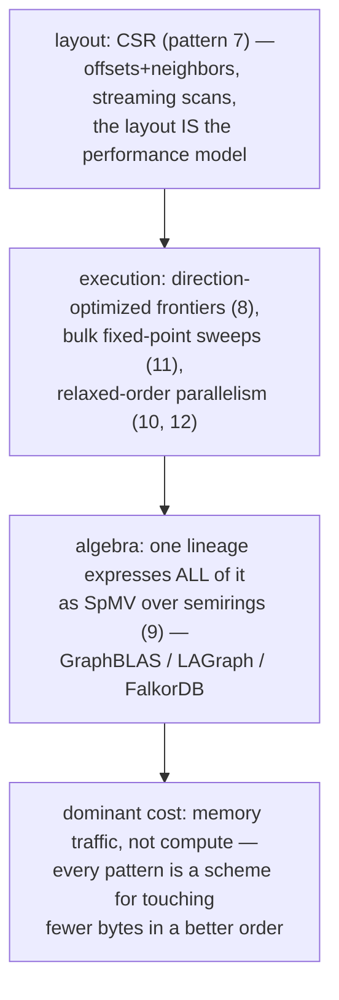

## 2. Six patterns, one map

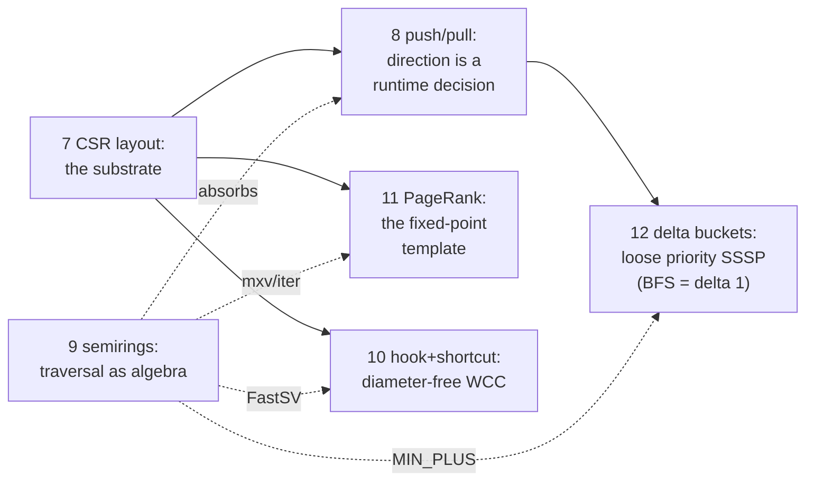

## 3. Axis 1 — ordering strictness

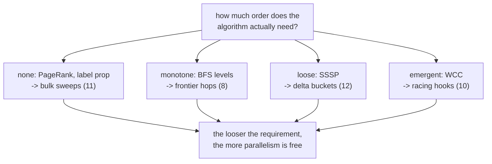

## 4. Axis 2 — frontier density; Axis 3 — dialect

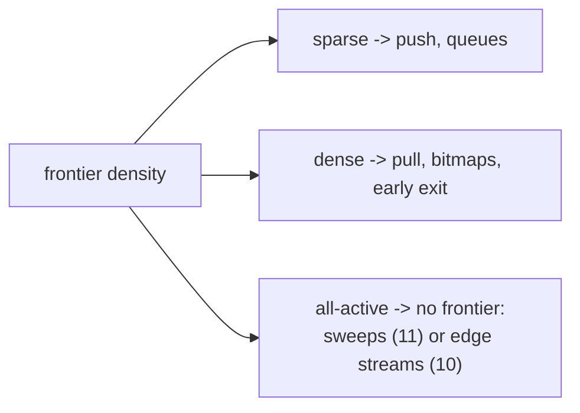

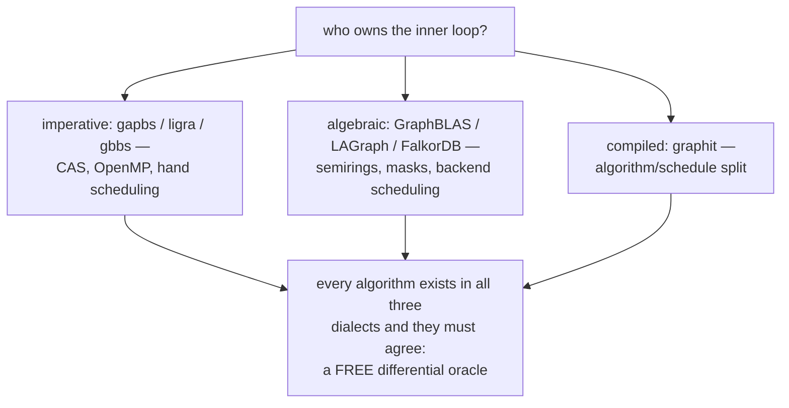

## 5. The recurring meta-move

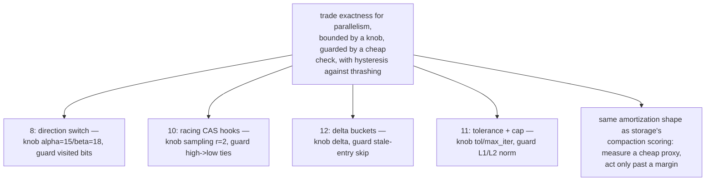

## 6. One graph, four costs (n=100M, m=1B, deg 10)

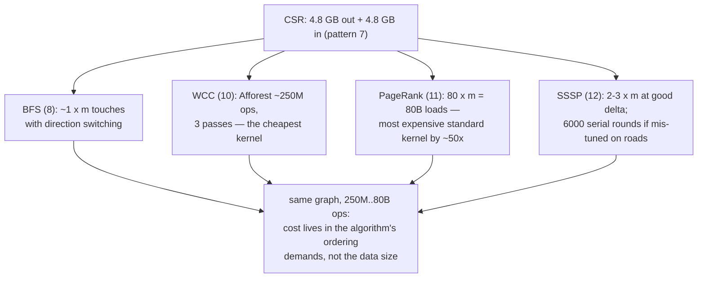

## 7. Exports to the other categories

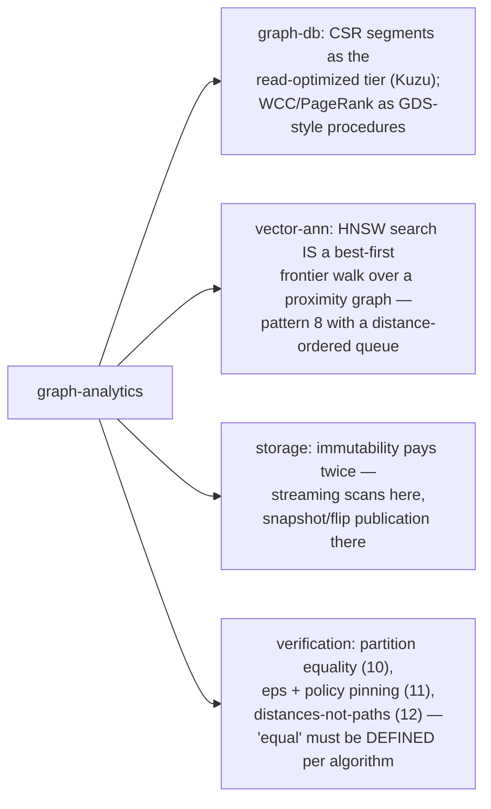

## 8. The verification roll-up (docs_PRD06 thesis)

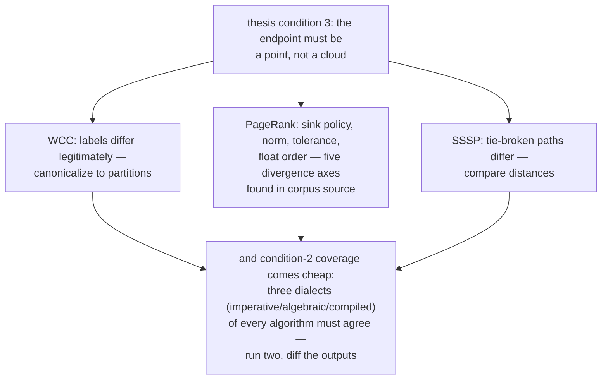

## 9. Honest gaps

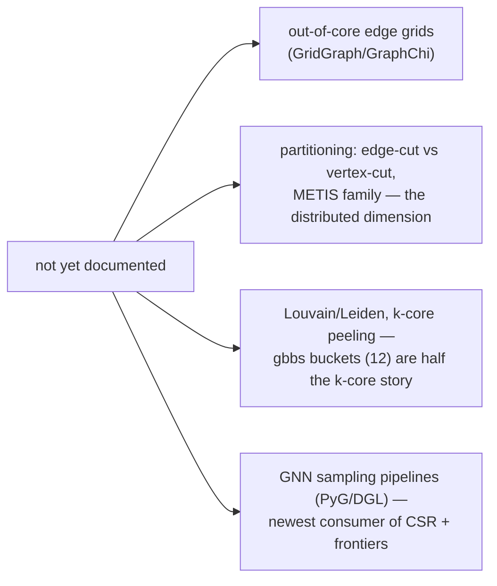

## 9b. How a query would flow through the integrated stack

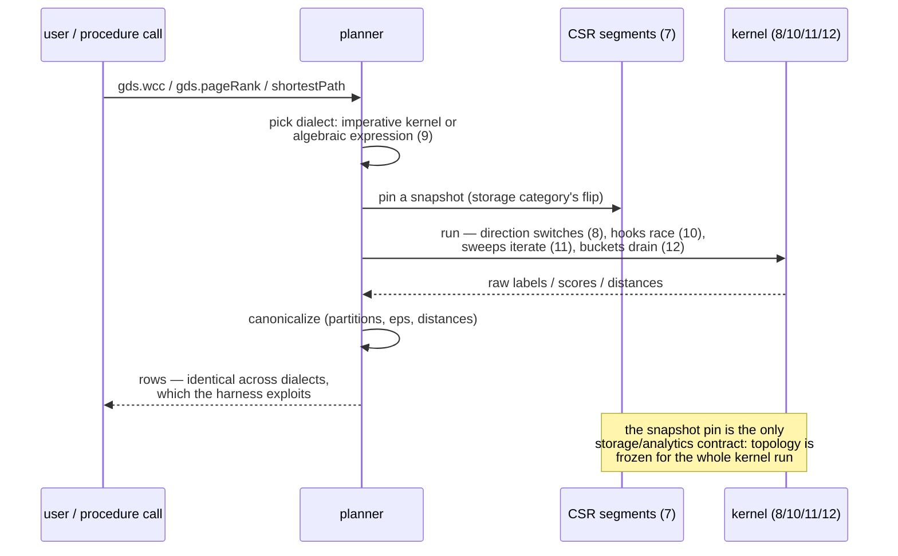

## 10. Citing repos (category roll-up)

| Repo | Path | Role |
| --- | --- | --- |
| gapbs | `reference-repos-corpus/gapbs-src/src/` | reference kernels: bfs.cc, cc.cc, pr.cc, sssp.cc, graph.h |
| ligra | `reference-repos-competitors/ligra-src/` | frontier abstraction, compressed CSR, label-prop CC |
| gbbs | `reference-repos-competitors/gbbs-src/` | buckets, ConnectIt, theory-backed variants |
| LAGraph | `reference-repos-corpus/LAGraph-src/src/algorithm/` | algebraic dialect of patterns 9-12 |
| GraphBLAS | `reference-repos-corpus/GraphBLAS-src` | semiring kernel engine |
| graphit | `reference-repos-corpus/graphit-src` | compiled dialect: algorithm/schedule split |
| gunrock | `reference-repos-corpus/gunrock-src` | GPU forms: load-balanced advance, near-far |
| falkordb | `reference-repos-competitors/falkordb-src/src/` | production DB on the algebraic dialect |

## 11. Cross-references

- Storage synthesis: `storage-engine-pattern-synthesis-{ascii,mermaid}.md`
  — supplier of the immutable-segment discipline and the
  amortization meta-move this category reuses.
- Individual pairs: patterns 7-12 in `pattern-index.md`.
- Next category per spec order: vector-ann — where the frontier walk
  meets distance metrics and recall/latency Pareto frontiers.
