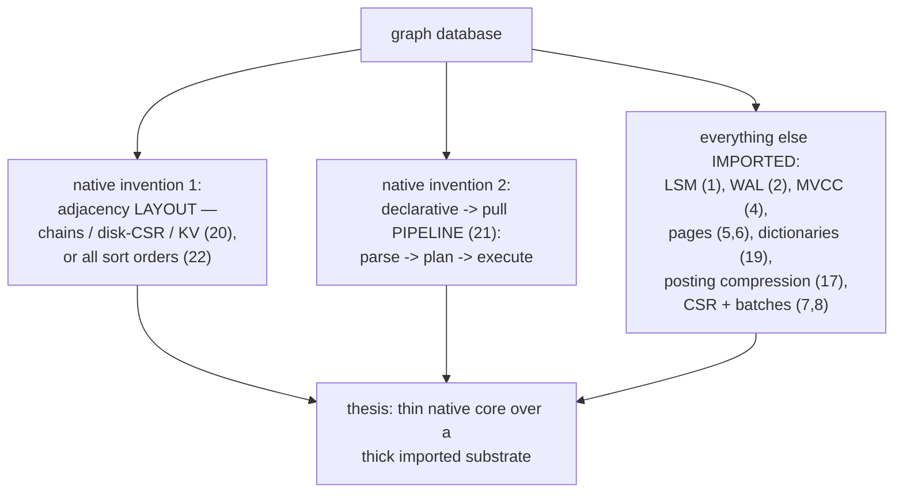
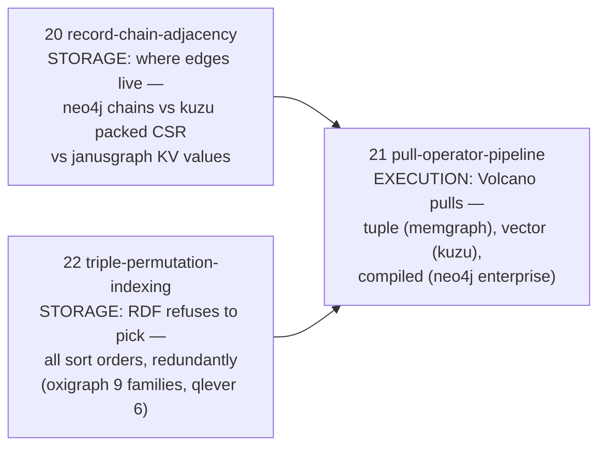
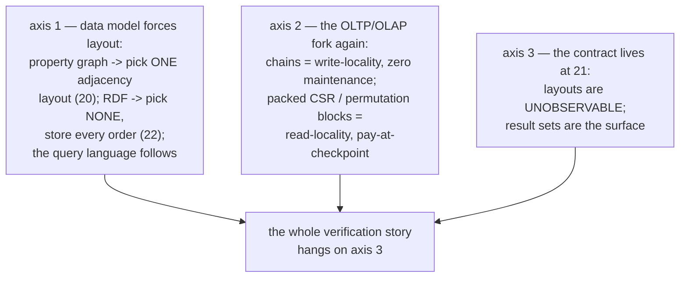
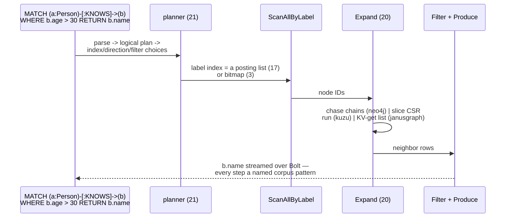
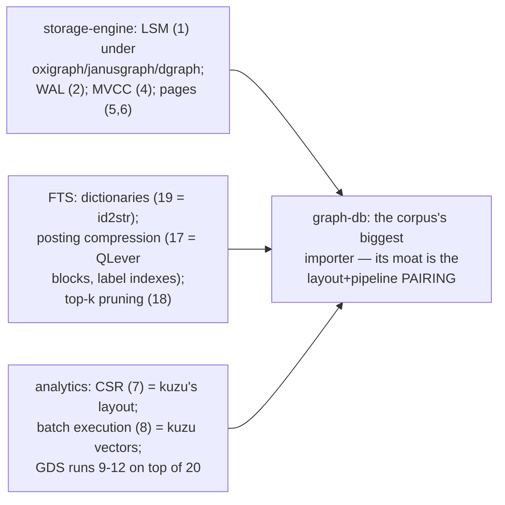
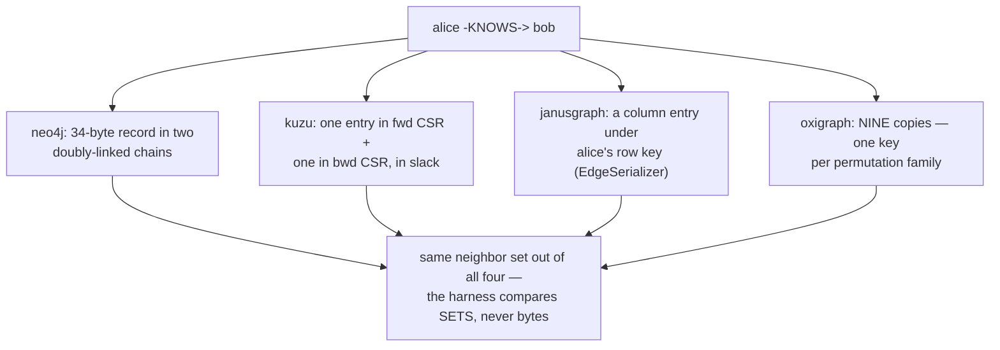
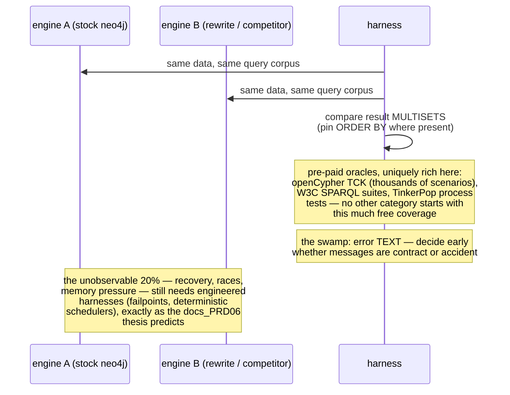
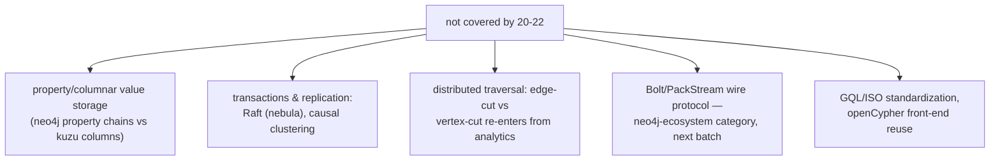
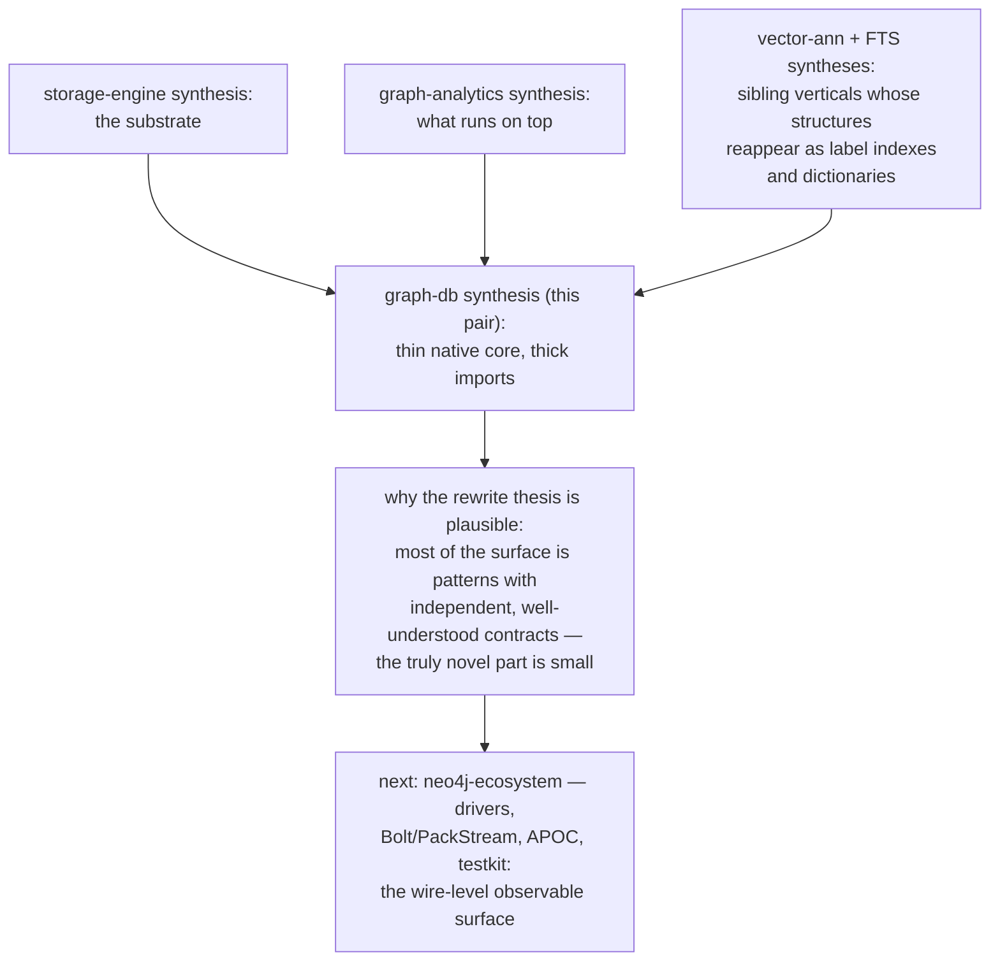
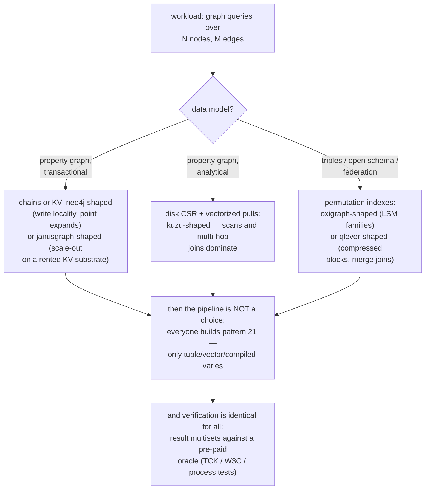

# Graph DB Pattern Synthesis — Mermaid

| Field | Value |
| --- | --- |
| Kind | execution |
| Pair | `graph-db-pattern-synthesis-ascii.md` / `graph-db-pattern-synthesis-mermaid.md` |
| One-line job | Roll up patterns 20-22 into the category's thesis: a graph database = one adjacency-layout decision + one query pipeline, and everything else it does is imported wholesale from the other categories of this corpus |

## 1. The category in one map

## 2. The three patterns

## 3. The organizing axes

## 4. The golden path

## 5. The import bill

## 6. One edge, four physical lives

## 7. The verification pipeline

## 8. Honest gaps

## 9. The corpus position

## 9b. The design walk (pick your engine shape)

## 10. Citing repos (category roll-up)

| Repo | Path | Role |
| --- | --- | --- |
| neo4j | `reference-repos-neo4j-family/neo4j-src/community/record-storage-engine/src/main/java/org/neo4j/kernel/impl/store/format/standard/NodeRecordFormat.java` | record chains (20) |
| neo4j | `reference-repos-neo4j-family/neo4j-src/community/cypher/cypher-logical-plans/src/main/scala/org/neo4j/cypher/internal/logical/plans/LogicalPlan.scala` | plan-as-data (21) |
| kuzu | `reference-repos-competitors/kuzu-src/src/include/storage/table/csr_node_group.h` | packed disk CSR (20) |
| kuzu | `reference-repos-competitors/kuzu-src/src/include/processor/operator/physical_operator.h` | vectorized pull (21) |
| memgraph | `reference-repos-competitors/memgraph-src/src/query/plan/operator.hpp` | tuple pull (21) |
| janusgraph | `reference-repos-competitors/janusgraph-src/janusgraph-core/src/main/java/org/janusgraph/graphdb/database/EdgeSerializer.java` | KV camp (20) |
| oxigraph | `reference-repos-corpus/oxigraph-src/lib/oxigraph/src/storage/rocksdb.rs` | permutation families (22) |
| qlever | `reference-repos-corpus/qlever-src/src/index/Permutation.h` | six orders (22) |

## 11. Cross-references

- Members: `record-chain-adjacency` (20),
  `pull-operator-pipeline` (21),
  `triple-permutation-indexing` (22).
- The carry-forward sentence: a graph database is a THIN native
  core (layout + pipeline) over a THICK imported substrate.
- Next category: neo4j-ecosystem (Bolt, drivers, APOC,
  testkit), then dataflow-compute and bench-testing to close
  the corpus.
