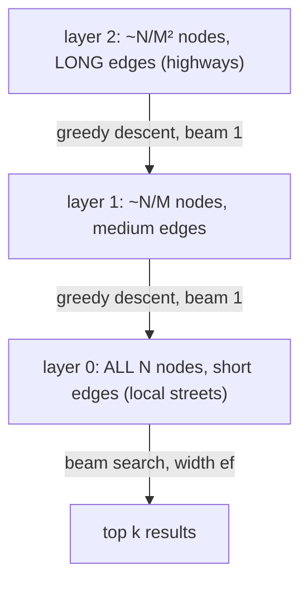
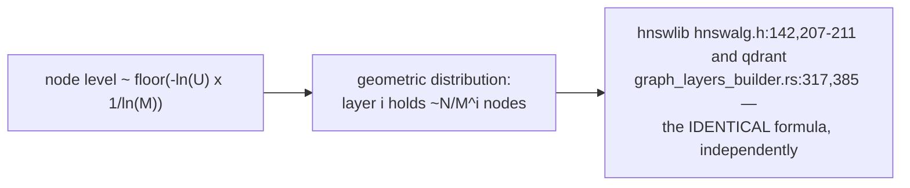
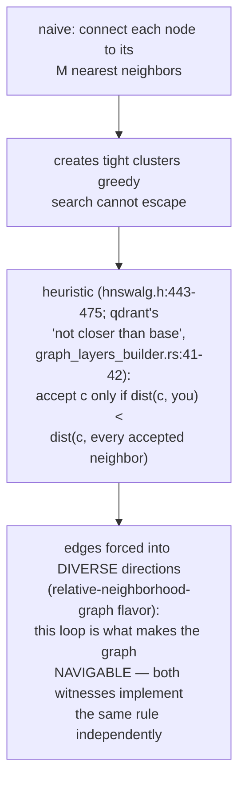
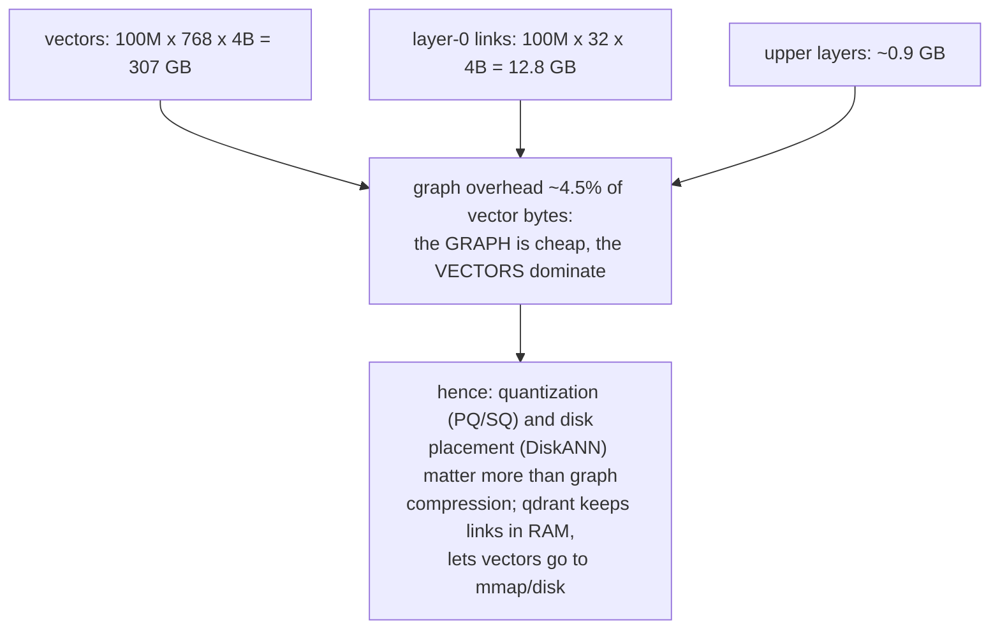
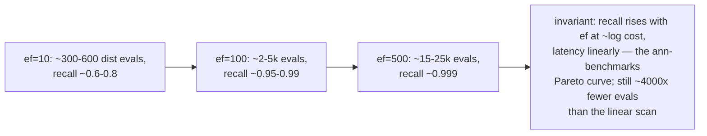
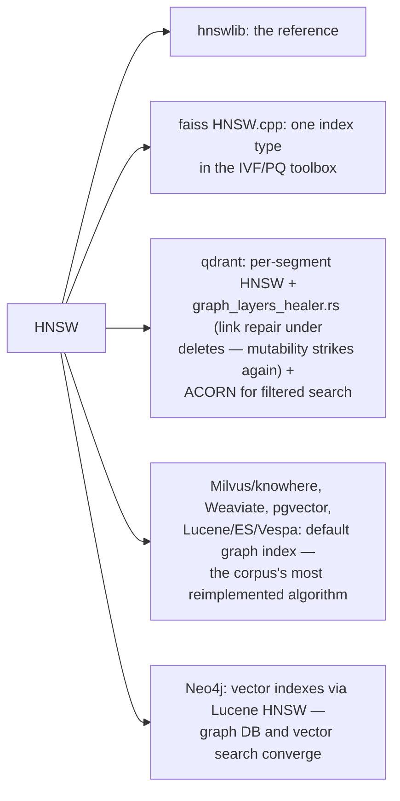
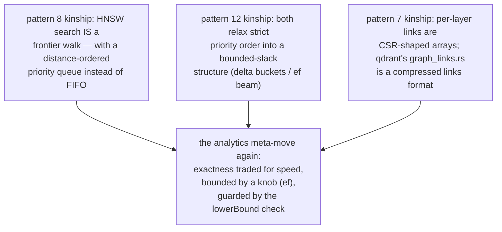
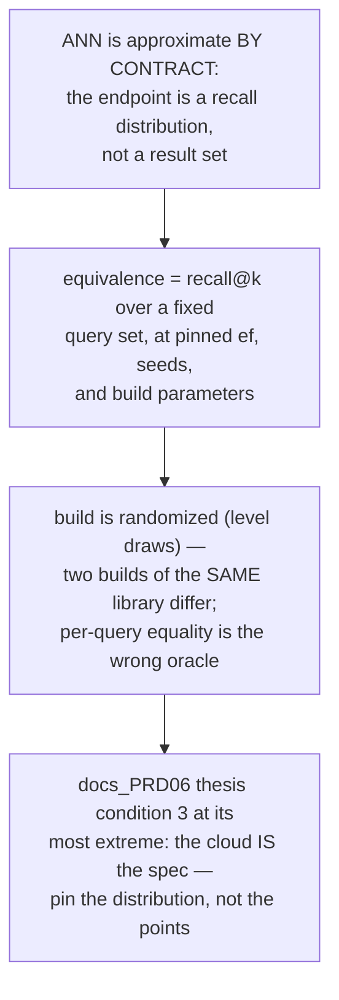

# HNSW Layered Greedy — Mermaid

| Field | Value |
| --- | --- |
| Kind | algorithm |
| Pair | `hnsw-layered-greedy-ascii.md` / `hnsw-layered-greedy-mermaid.md` |
| One-line job | Approximate nearest-neighbor search as a greedy walk over a hierarchy of proximity graphs: coarse upper layers teleport near the target, layer 0 runs a beam search — recall is bought with a queue-width knob (ef) |

## 1. The hierarchy





## 2. Search, end to end

```mermaid
sequenceDiagram
    participant Q as query
    participant U as upper layers
    participant B as layer-0 beam
    Q->>U: start at global entry point (hnswalg.h:45)
    loop each layer maxlevel..1
        U->>U: move to any closer neighbor;<br/>stop at local minimum (beam width 1 —<br/>qdrant search_entry_on_level,<br/>graph_layers.rs:15-17)
    end
    U->>B: descend with best-found entry
    loop until closest unexpanded candidate ><br/>worst kept result (hnswalg.h:248)
        B->>B: pop nearest candidate (min-heap),<br/>expand links, push improvements<br/>into results (max-heap, capped ef)
    end
    B-->>Q: top k of the ef kept
```

The termination rule is the economy: prune exactly when no frontier
node can provably improve the result set.

## 3. The diversity heuristic — why not just kNN edges



## 4. Memory arithmetic at 100M vectors (768-d f32, M=16)



## 5. The ef dial (k=10, 100M vectors)



## 6. Inheritance map



## 7. Kinship with the analytics category



## 8. The verification angle



## 8b. Insertion — building while searching

```mermaid
sequenceDiagram
    participant N as new vector
    participant U as upper layers
    participant L as target layers
    N->>N: draw level L ~ geometric (mult = 1/ln M)
    N->>U: greedy descent from entry point to layer L
    loop each layer L..0
        N->>L: beam search width ef_construction (~200)
        L->>L: shrink candidates to M via the<br/>diversity heuristic (hnswalg.h:513)
        L->>L: connect BOTH directions;<br/>if a neighbor now exceeds Mcurmax,<br/>re-run the heuristic on ITS list<br/>(hnswalg.h:603)
    end
    Note over N,U: if L > maxlevel, the new node becomes<br/>the global entry point (hnswalg.h:135-136) —<br/>insertion IS a search plus bidirectional<br/>pruned wiring; build and query share<br/>the same kernel
```

The bidirectional-connect-then-prune step is why concurrent inserts
need per-node locks (hnswlib) or why qdrant builds per-segment
immutable graphs and heals links on merges instead — the storage
category's mutation dilemma, replayed in the index layer.

## 9. Citing repos

| Repo | Path | Role |
| --- | --- | --- |
| hnswlib | `reference-repos-corpus/hnswlib-src/hnswlib/hnswalg.h` | level draw (142, 207-211), beam search (226-311), diversity heuristic (443-475), knobs (31-32, 93-115) |
| qdrant | `reference-repos-corpus/qdrant-src/lib/segment/src/index/hnsw_index/graph_layers.rs` | search-on-level family, beam-1 upper layers (7-23) |
| qdrant | `reference-repos-corpus/qdrant-src/lib/segment/src/index/hnsw_index/graph_layers_builder.rs` | level_factor (317, 385), m/m0 (239, 305), heuristic flag (41-42) |
| faiss | `reference-repos-corpus/faiss-src/faiss/impl/HNSW.cpp` | independent third implementation |
| milvus/knowhere | `reference-repos-corpus/knowhere-src` | HNSW among FAISS/DiskANN backends |

## 10. Cross-references

- Sibling patterns: `frontier-pushpull-switching`,
  `csr-adjacency-layout`, `delta-stepping-buckets` (see §7).
- Next in category: quantization ladders (PQ/SQ/binary), then
  DiskANN's on-disk Vamana graph as the counter-design.
- Paper trail: Malkov & Yashunin's HNSW paper (verified in
  `research-papers-ledger.md`), the NSW predecessor, and the
  ACORN filtered-search paper qdrant implements.
- 202606 digest overlap: digests named HNSW as the standard vector
  index; this pair adds level math, beam mechanics, the diversity
  heuristic with dual-witness cites, and memory/ef arithmetic.
