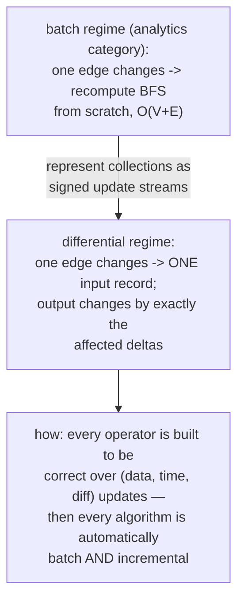
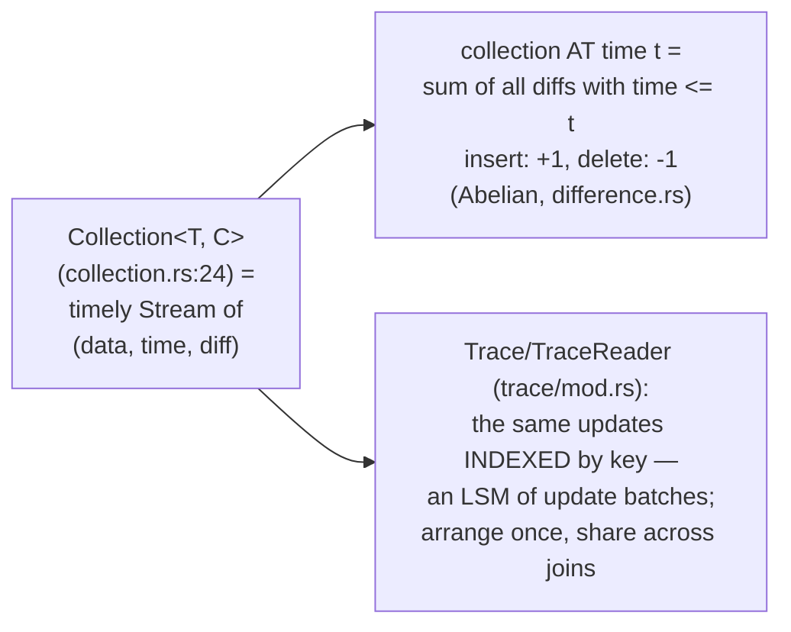
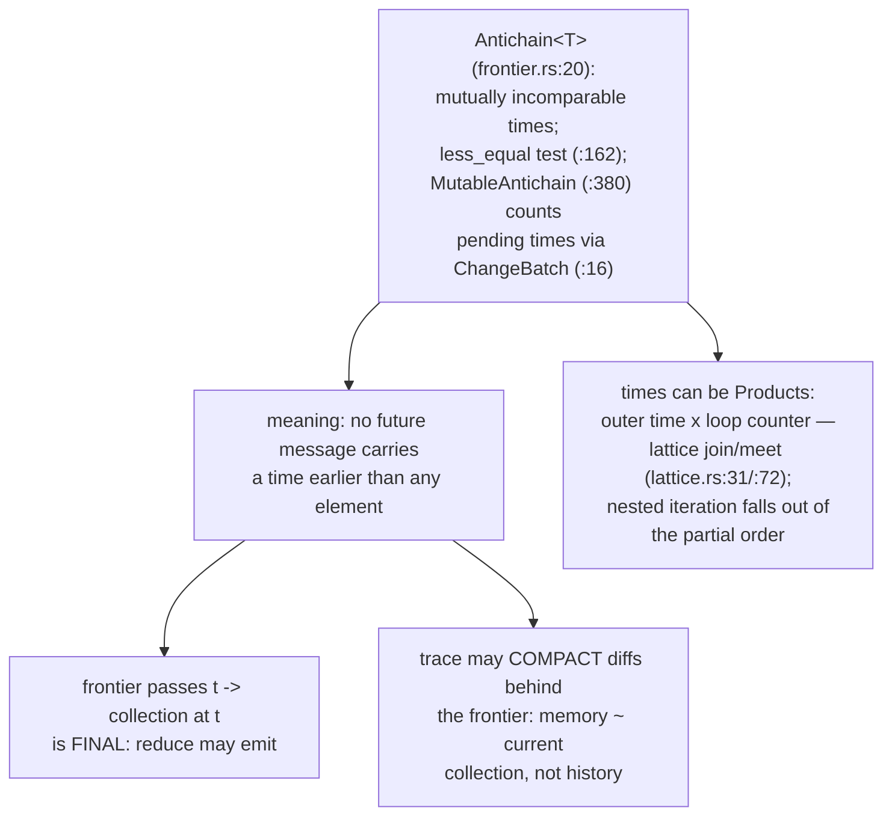
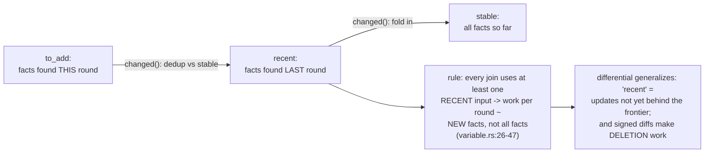
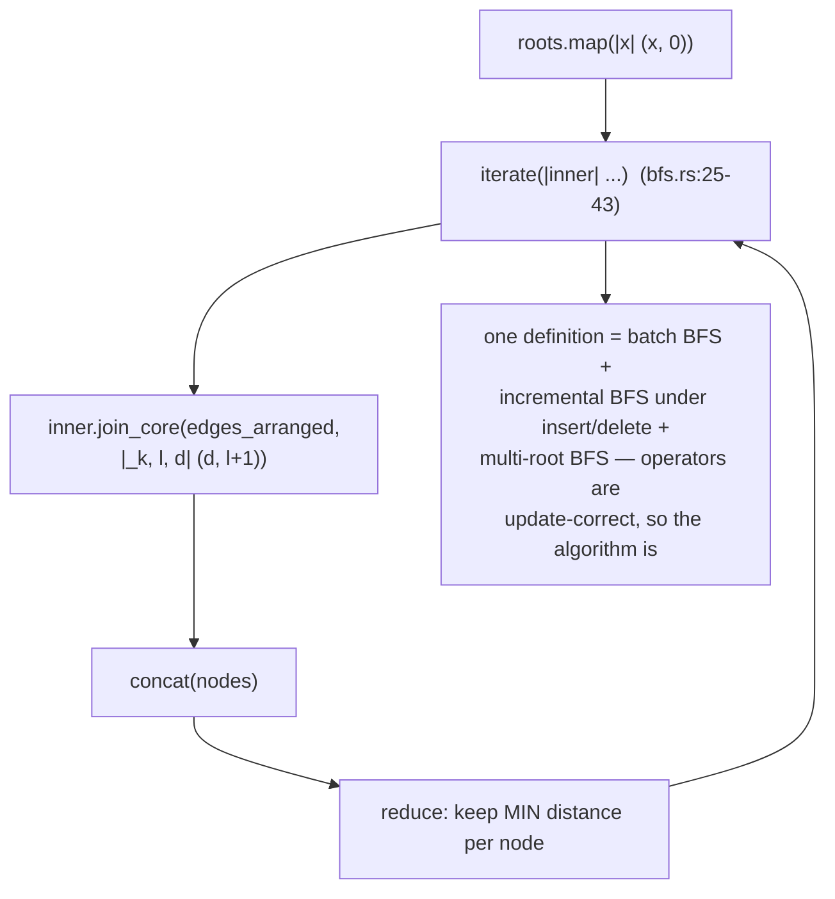
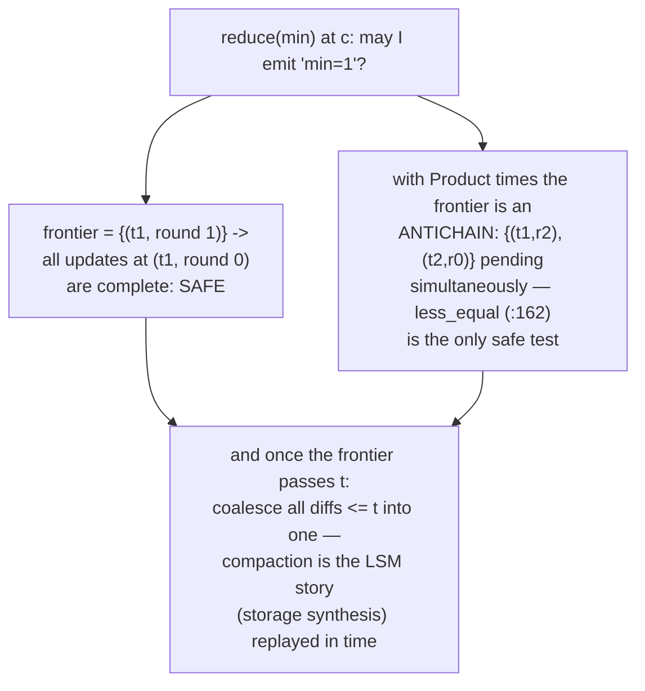
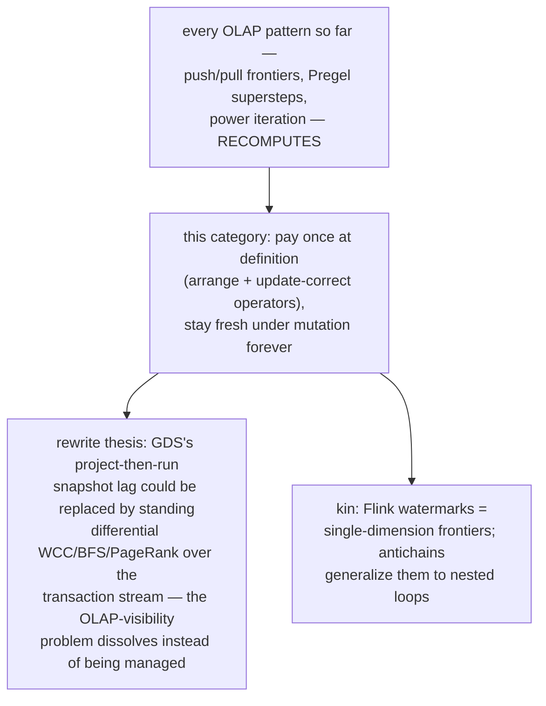
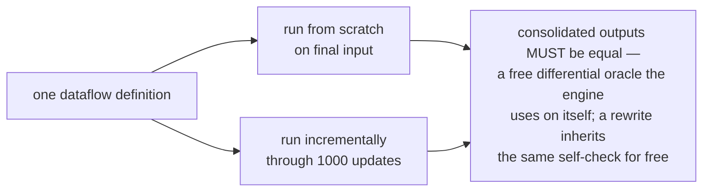
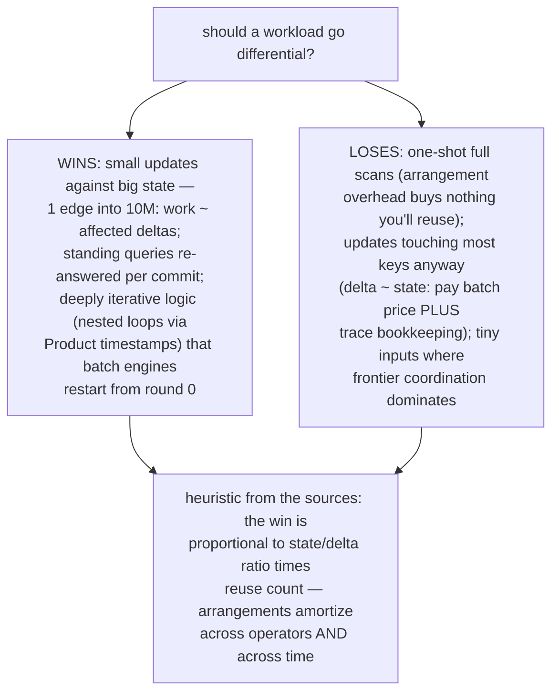

# Incremental Delta Iteration — Mermaid

| Field | Value |
| --- | --- |
| Kind | execution |
| Pair | `incremental-delta-iteration-ascii.md` / `incremental-delta-iteration-mermaid.md` |
| One-line job | Compute over CHANGES instead of states: collections are streams of (data, time, diff) updates, iteration is semi-naive (only recent tuples drive the next round), and progress is tracked by antichain frontiers — so a graph algorithm updates in milliseconds when one edge changes |

## 1. The regime change



## 2. The data shape



## 3. Frontiers: knowing when a time is done



## 4. Semi-naive iteration (the datafrog miniature)



## 5. BFS in six lines



## 6. Worked example — one edge insertion

```mermaid
sequenceDiagram
    participant I as input
    participant J as join (round 1)
    participant R as reduce at c
    participant O as output
    Note over I: graph a->b->c, root a;<br/>dists a:0 b:1 c:2
    I->>J: ((a,c), t1, +1)
    J->>R: (c, 1) at (t1, round 1)
    R->>O: ((c,2), t1, -1)  retract old min
    R->>O: ((c,1), t1, +1)  assert new min
    Note over O: total work ~ 2 changed tuples;<br/>the untouched million nodes cost ZERO —<br/>batch engines pay O(V+E) again
```

## 7. Worked example — frontiers gate emission



## 8. Position in the corpus



## 9. The self-testing property



## 9b. Cost model — when incremental wins and loses



## 10. Citing repos

| Repo | Path | Role |
| --- | --- | --- |
| timely-dataflow | `reference-repos-corpus/timely-dataflow-src/timely/src/progress/frontier.rs` | Antichain/MutableAntichain (20, 162, 380) |
| timely-dataflow | `reference-repos-corpus/timely-dataflow-src/timely/src/progress/change_batch.rs` | counted progress changes (16) |
| differential-dataflow | `reference-repos-corpus/differential-dataflow-src/differential-dataflow/src/collection.rs` | Collection = update stream (24) |
| differential-dataflow | `reference-repos-corpus/differential-dataflow-src/differential-dataflow/src/lattice.rs` | Product-time join/meet (31, 72) |
| differential-dataflow | `reference-repos-corpus/differential-dataflow-src/differential-dataflow/src/algorithms/graphs/bfs.rs` | six-line incremental BFS (12-43) |
| datafrog | `reference-repos-corpus/datafrog-src/src/variable.rs` | semi-naive stable/recent/to_add (26-47) |

## 11. Cross-references

- Sibling patterns: `frontier-push-pull-switching` (the batch
  regime), `pull-operator-pipeline` (21 — one query vs one
  standing computation), `lsm-compaction-leveling` (traces
  compact like LSMs).
- Reading order: datafrog's variable.rs first (the 200-line
  miniature), then differential's bfs.rs, then frontier.rs
  when the "when may I emit?" question bites.
- Next: bench-testing (SQLancer/Jepsen/LDBC) closes the
  corpus categories.
- Repo layout note for readers: the differential crate lives at
  `differential-dataflow-src/differential-dataflow/` (workspace
  root also carries dogsdogsdogs — worst-case-optimal joins —
  and the SIGMOD/OSDI paper PDFs, worth reading beside the
  code); timely's progress machinery is all under
  `timely-dataflow-src/timely/src/progress/`.
- Terminology bridge: "arrangement" = shared index of update
  batches; "trace" = its storage; "frontier" = watermark
  generalized to partially ordered time; "consolidation" =
  summing diffs at equal (data, time) — canonicalization,
  in the corpus's verification vocabulary.
