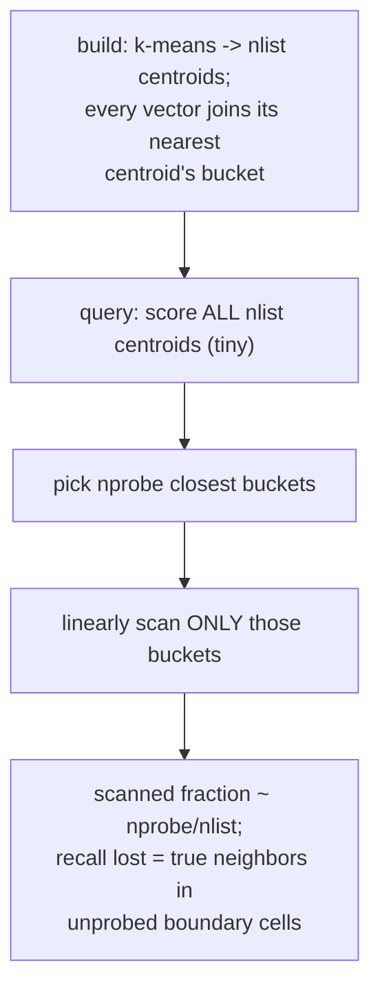
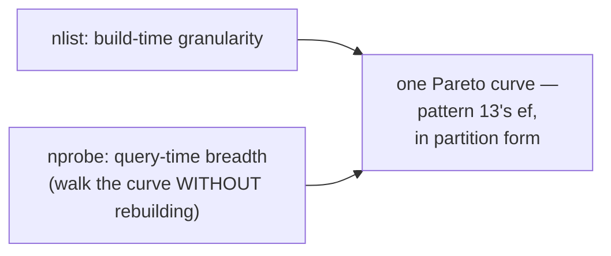
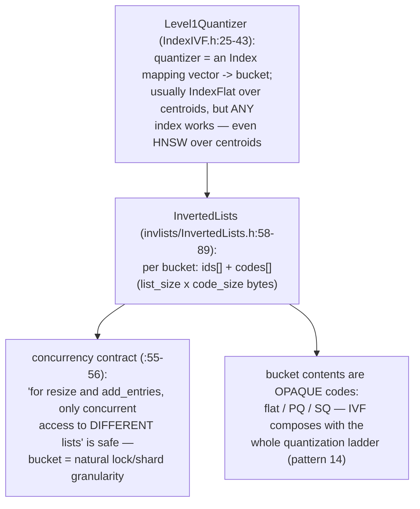
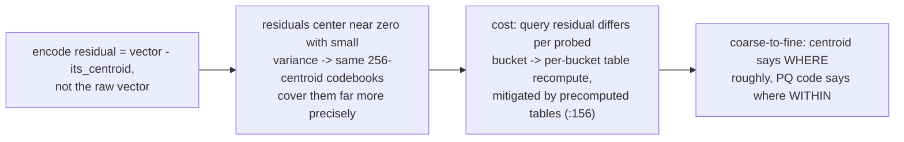
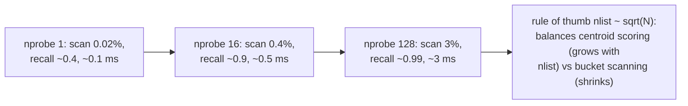
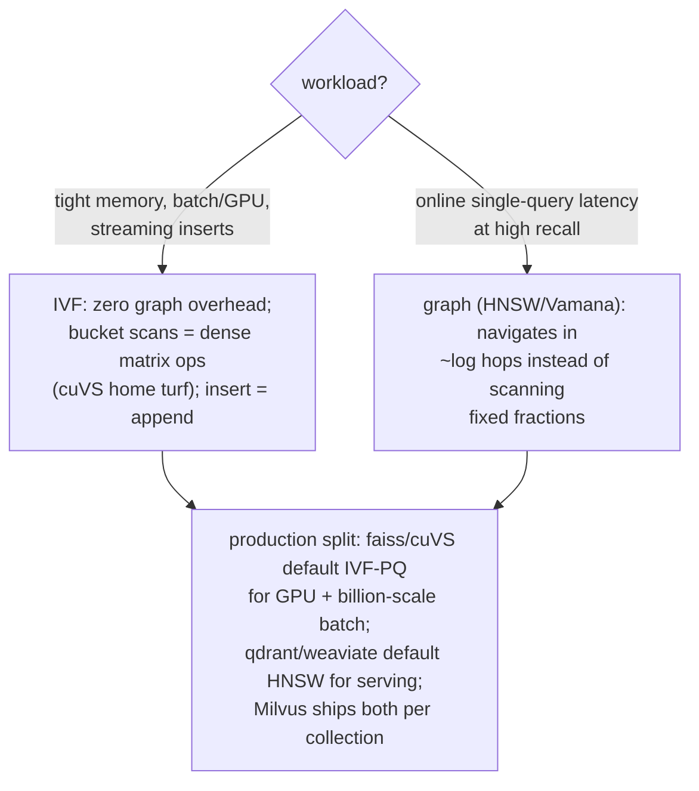
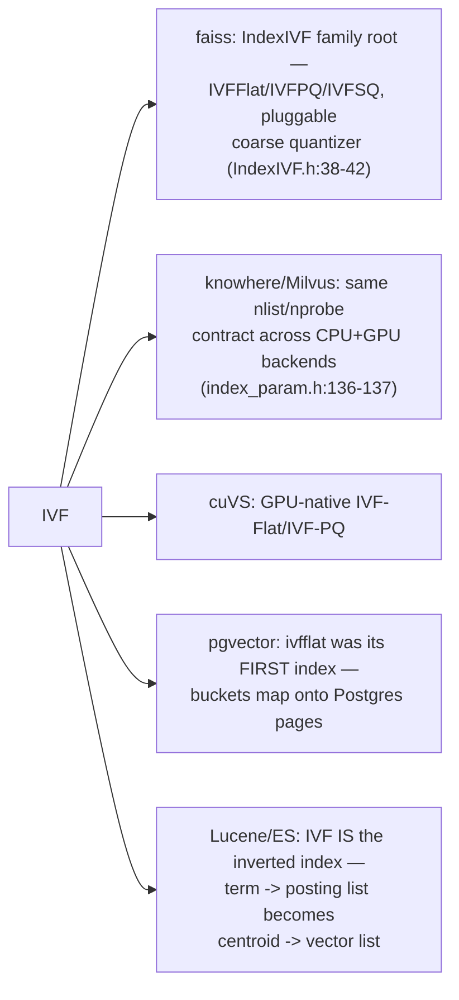
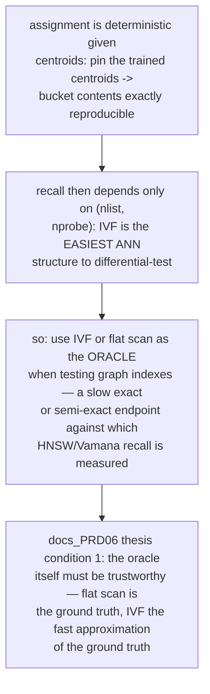
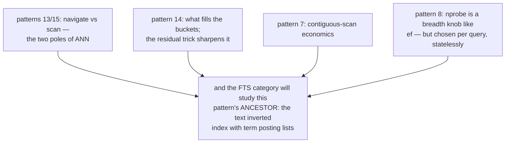

# IVF Partitioned Probe — Mermaid

| Field | Value |
| --- | --- |
| Kind | execution |
| Pair | `ivf-partitioned-probe-ascii.md` / `ivf-partitioned-probe-mermaid.md` |
| One-line job | Skip most of the dataset by clustering vectors into nlist buckets at build time and scanning only the nprobe closest buckets at query time — the inverted-index idea from text search, applied to geometry |

## 1. Partition, don't navigate





## 2. The data structures (faiss)



## 3. The residual trick (IndexIVFPQ.h:31, 156-172)



## 4. One query, end to end

```mermaid
sequenceDiagram
    participant Q as query
    participant C as centroids (4096)
    participant B as probed buckets (16)
    participant H as k-heap
    Q->>C: 4096 distances (~0.1 ms)
    C-->>Q: 16 nearest buckets (~39k of 10M vectors)
    loop each probed bucket
        Q->>B: residual-adjusted ADC table
        B->>H: scan contiguous codes with table<br/>lookups; push improvements
    end
    H-->>Q: top k
    Note over B: buckets are CONTIGUOUS arrays —<br/>pure sequential scans, SIMD-friendly<br/>(pattern 7's argument again)
```

## 5. The two dials (10M vectors, recall@10 shape)



## 6. IVF vs graph — the decision table



## 7. Inheritance map



## 8. The verification angle



## 9. Kinship map



## 9b. The mutation story — why streaming favors IVF

```mermaid
sequenceDiagram
    participant W as writer
    participant B as bucket b
    participant G as graph index (contrast)
    W->>B: insert v: one centroid scoring pass,<br/>then append (id, code) to bucket b
    Note over B: per-list concurrency contract<br/>(InvertedLists.h:55-56): appends to<br/>DIFFERENT buckets need no coordination
    W->>B: delete v: tombstone the id, or<br/>compact the bucket offline
    Note over B: no rewiring — the structure is<br/>a partition, not a topology
    W->>G: contrast: graph insert = beam search +<br/>bidirectional wiring + neighbor re-pruning<br/>(patterns 13 §8b, 15 §9b); delete = link<br/>healing (qdrant graph_layers_healer.rs)
    Note over W,G: IVF degrades differently: as data drifts,<br/>centroids go STALE — buckets bloat unevenly<br/>and recall decays silently; the fix is<br/>periodic re-training + re-assignment,<br/>i.e. compaction (pattern 1) at the<br/>clustering level
```

Both families thus reinvent the storage category's maintenance
loop: graphs pay per-write (wiring), partitions pay per-epoch
(re-clustering). There is no mutation-free index — only a choice
of when to pay.

## 10. Citing repos

| Repo | Path | Role |
| --- | --- | --- |
| faiss | `reference-repos-corpus/faiss-src/faiss/IndexIVF.h` | Level1Quantizer (25-43), nprobe (69, 105) |
| faiss | `reference-repos-corpus/faiss-src/faiss/invlists/InvertedLists.h` | bucket storage (58-89), concurrency contract (55-56) |
| faiss | `reference-repos-corpus/faiss-src/faiss/IndexIVFPQ.h` | residual encoding (31), precomputed tables (156-172) |
| knowhere | `reference-repos-corpus/knowhere-src/include/knowhere/comp/index_param.h` | NPROBE/NLIST cross-backend contract (136-137) |
| cuvs | `reference-repos-corpus/cuvs-src` | GPU-native IVF variants |

## 11. Cross-references

- Sibling patterns: see §9 kinship map.
- Next in category: the vector-ann synthesis pair rolling up
  patterns 13-16.
- Paper trail: Jégou et al.'s PQ paper introduced IVFADC (IVF +
  PQ + ADC in one system); the faiss library paper documents the
  family — see `research-papers-ledger.md`.
- 202606 digest overlap: digests mentioned IVF as faiss's other
  index; this pair adds residual arithmetic, the concurrency
  contract, sqrt(N) sizing, and the IVF-vs-graph decision table.
