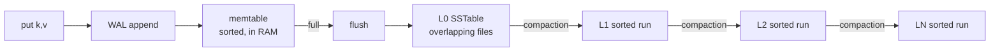
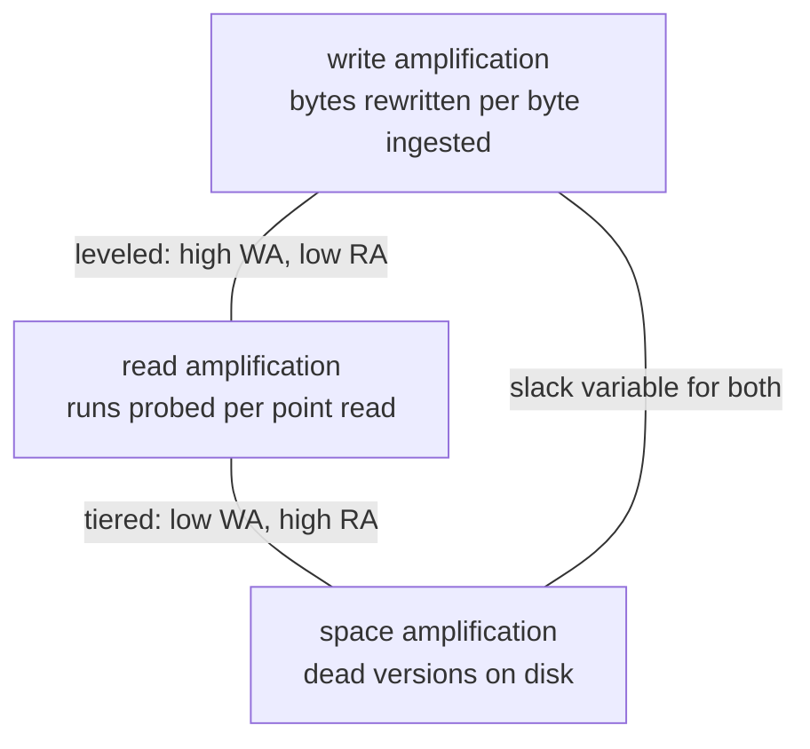
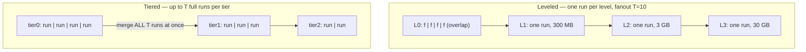
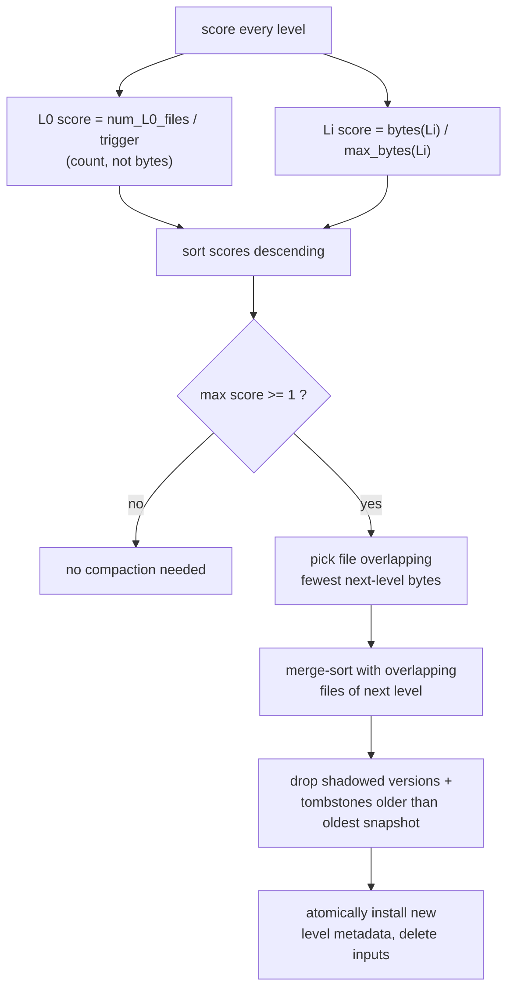
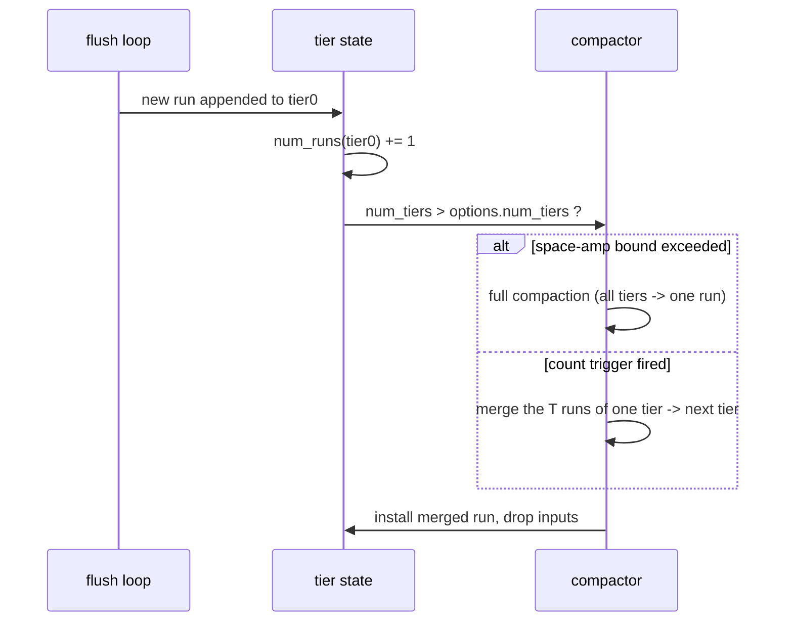
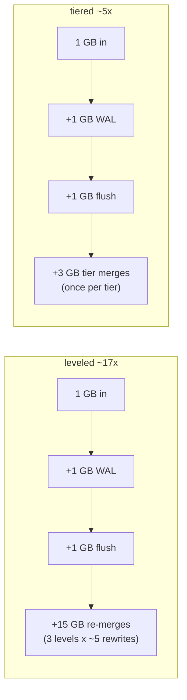
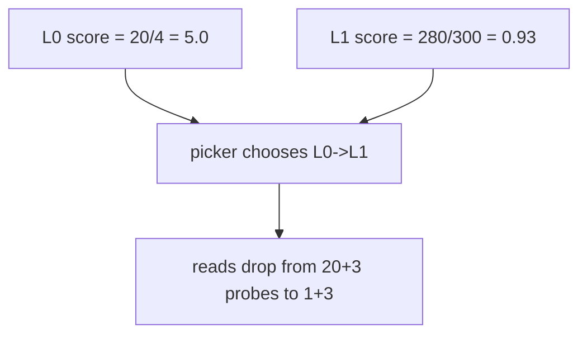
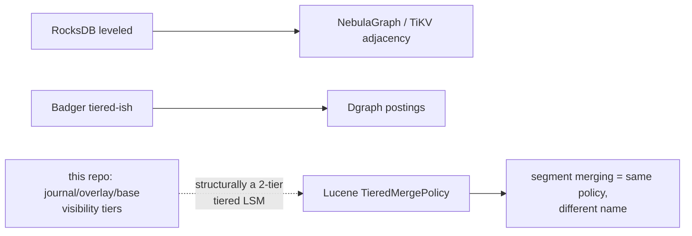

# LSM Compaction Tradeoff — Mermaid

| Field | Value |
| --- | --- |
| Kind | storage |
| Pair | `lsm-compaction-tradeoff-ascii.md` / `lsm-compaction-tradeoff-mermaid.md` |
| One-line job | Decide when and how to merge immutable sorted runs so reads stay fast without writes drowning in rewrite work |

## 1. The write path that creates the problem

An LSM tree never updates in place; flushes pile up immutable sorted
files, and every reader must consult every file that might hold its key.
Compaction merges the pile down — at the price of rewriting bytes.

## 2. The triangle

Every engine picks a point trading three amplifications:

## 3. Leveled vs tiered — structure

- Leveled read: memtable + each L0 file + one file per level (bounded).
- Tiered read: every run in every tier (T × tiers probes).
- Leveled write: each byte re-merged ~T/2 times per level it descends.
- Tiered write: each byte rewritten once per tier.

## 4. The leveled picker decision (RocksDB / Pebble shape)

Source anchors: score formula in
`reference-repos-corpus/rocksdb-src/db/compaction/compaction_picker_level.cc`
(lines 229–232); Pebble's per-level fill factors in
`reference-repos-corpus/pebble-src/compaction_picker.go` (~line 994, with
a dedicated `scores[0]` L0 entry at line 1000).

## 5. The tiered trigger (mini-lsm / SlateDB shape)

Source anchors: `generate_compaction_task` in
`reference-repos-corpus/mini-lsm-src/mini-lsm/src/compact/tiered.rs`
(count trigger + `max_size_amplification_percent` guard);
`reference-repos-corpus/slatedb-src/slatedb/src/size_tiered_compaction.rs`
(same policy where write amp costs object-store money);
`reference-repos-corpus/lsm-tree-src/src/compaction/tiered.rs`
(fjall's production Rust strategy).

## 6. Worked example — 1 GB ingested, T=10, 4 levels

The read side inverts: the leveled store answers a point read in ≤ 8 file
probes; the tiered store may touch 16 runs — which is why tiered engines
lean hard on bloom filters (sibling pattern).

## 7. Why L0 is count-triggered — worked example

20 L0 files of 2 MB each (40 MB total), trigger = 4; L1 at 280/300 MB:

L0 files overlap, so their cost to readers is per-file regardless of
size — bytes-based scoring would starve exactly the level that hurts
reads most.

## 8. Where graph systems inherit this

## 9. Citing repos

| Repo | Path | Role |
| --- | --- | --- |
| RocksDB | `reference-repos-corpus/rocksdb-src/db/compaction/compaction_picker_level.cc` | production leveled picker; score formula |
| RocksDB | `reference-repos-corpus/rocksdb-src/db/compaction/compaction_picker_fifo.cc` | FIFO contrast policy (pure deletion) |
| Pebble | `reference-repos-corpus/pebble-src/compaction_picker.go` | Go leveled picker, per-level fill factors |
| mini-lsm | `reference-repos-corpus/mini-lsm-src/mini-lsm/src/compact/leveled.rs` | teaching-scale leveled tasks |
| mini-lsm | `reference-repos-corpus/mini-lsm-src/mini-lsm/src/compact/tiered.rs` | teaching-scale tiered engine |
| fjall lsm-tree | `reference-repos-corpus/lsm-tree-src/src/compaction/tiered.rs` | Rust production tiered strategy |
| fjall lsm-tree | `reference-repos-corpus/lsm-tree-src/src/compaction/leveled` | Rust production leveled strategy |
| SlateDB | `reference-repos-corpus/slatedb-src/slatedb/src/size_tiered_compaction.rs` | tiered on object storage |
| SlateDB | `reference-repos-corpus/slatedb-src/slatedb/src/compactor_state.rs` | compaction as state machine |

## 10. Cross-references

- Paper: O'Neil et al., "The Log-Structured Merge-Tree" — see
  `research-papers-ledger.md`.
- Prior 202606 digest covered LSM only as Dgraph's substrate; this pair
  adds the picker mechanics and the leveled/tiered duality.
- Sibling patterns: WAL group commit; bloom-filter read shortcut;
  immutable segment merging (FTS twin of this policy).
