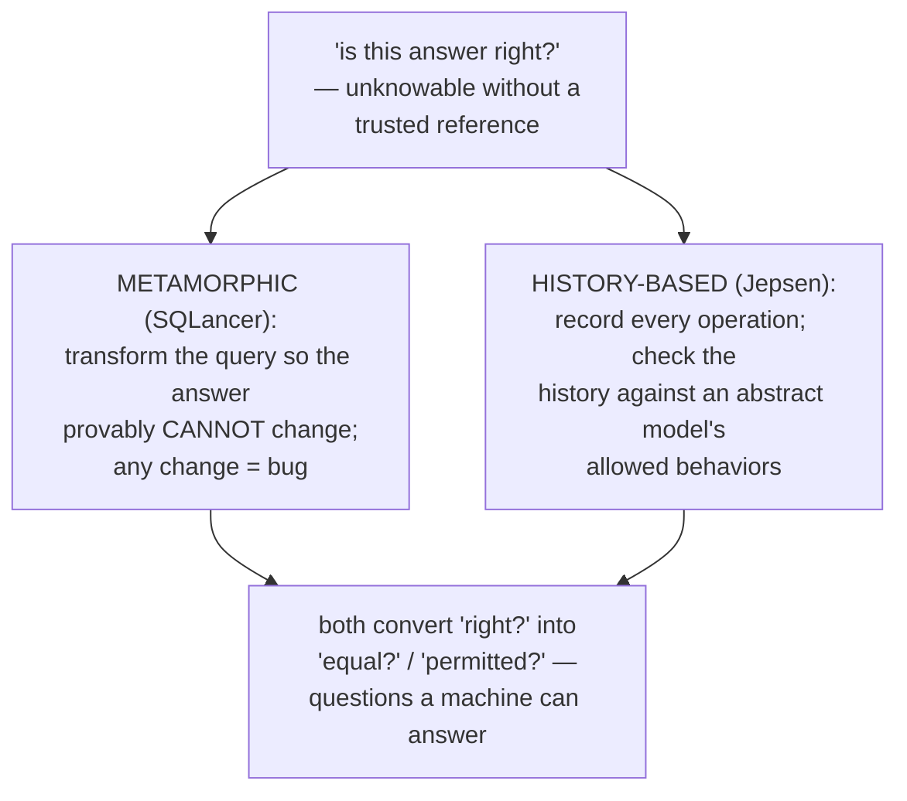
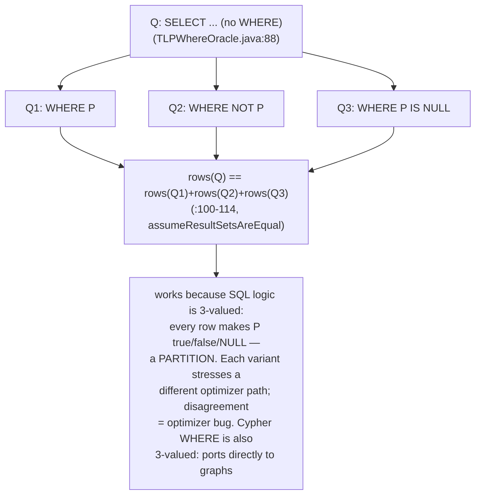
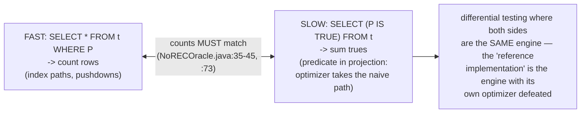
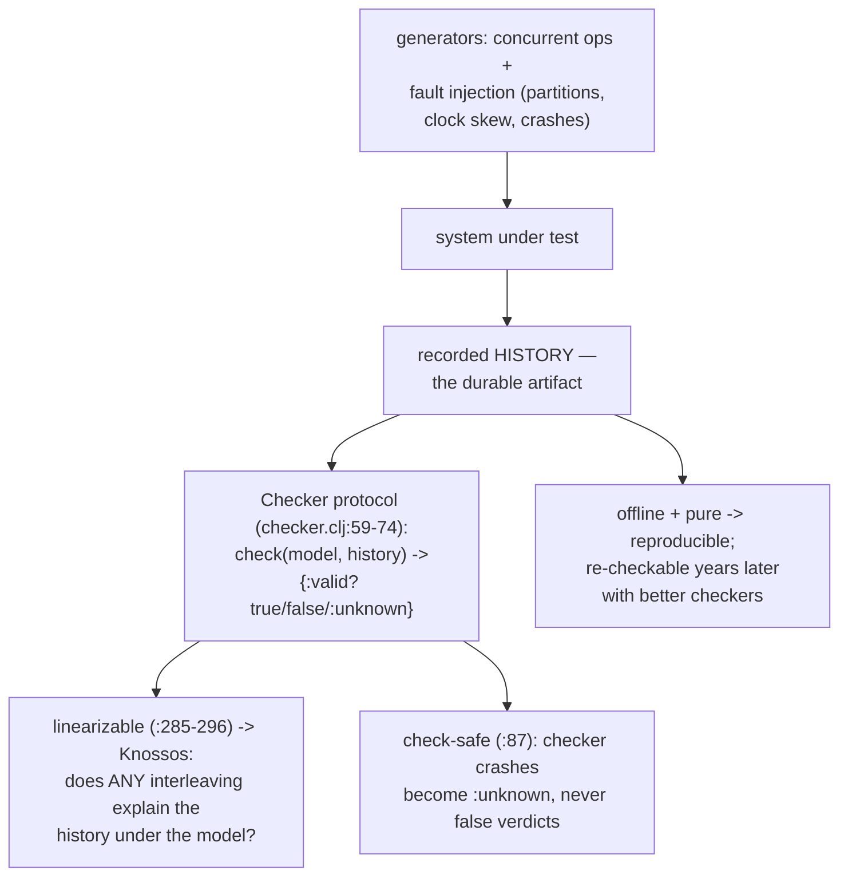
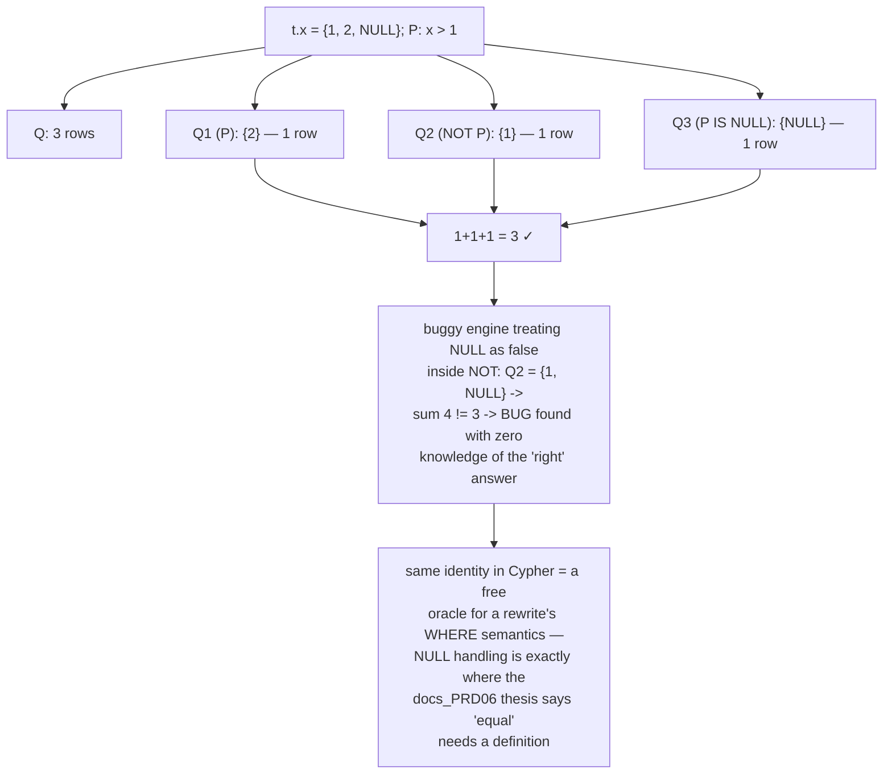
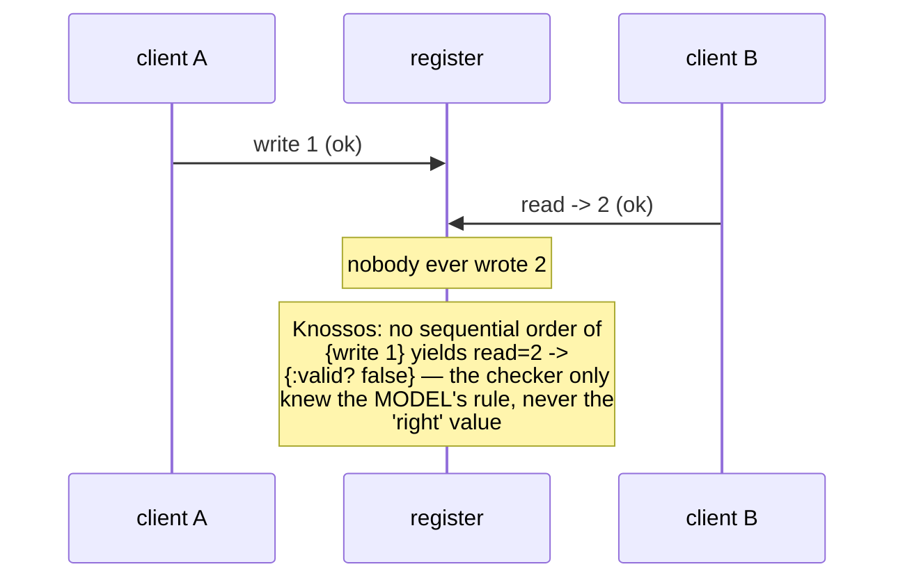
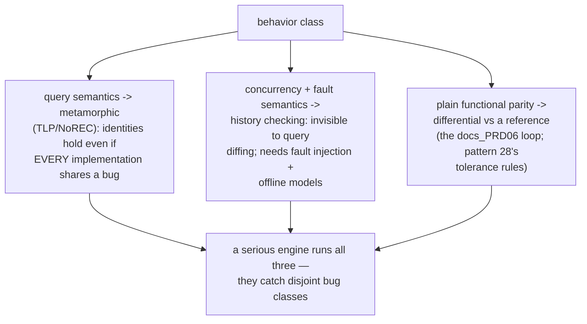
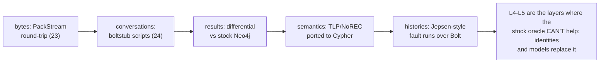
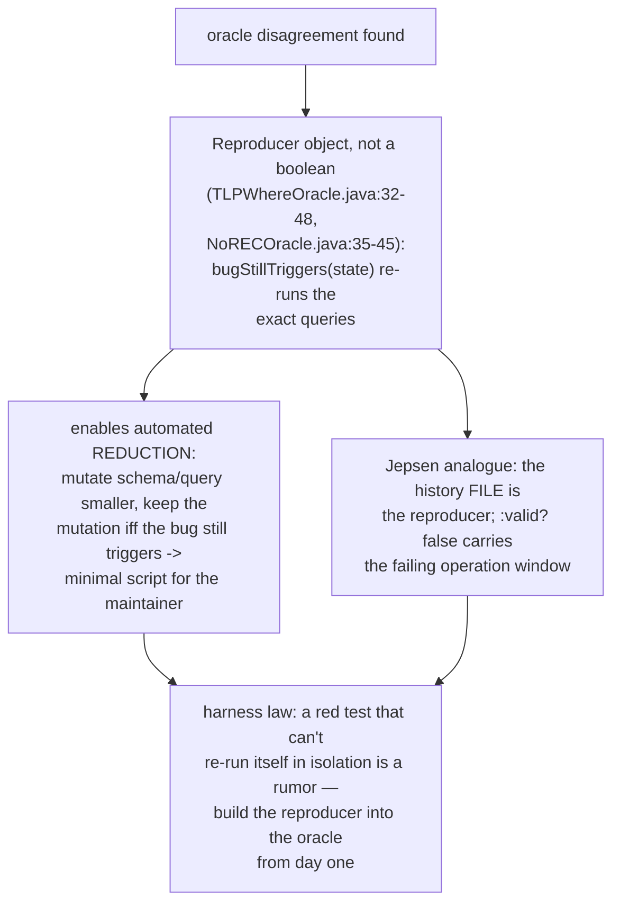

# Metamorphic Oracle Testing — Mermaid

| Field | Value |
| --- | --- |
| Kind | execution |
| Pair | `metamorphic-oracle-testing-ascii.md` / `metamorphic-oracle-testing-mermaid.md` |
| One-line job | Find correctness bugs WITHOUT a reference implementation: derive queries that must agree by construction (TLP's P/NOT P/IS NULL partition, NoREC's optimized-vs-unoptimized count) or check recorded histories against an abstract model (Jepsen) — the oracle is a mathematical identity, not a second system |

## 1. The oracle problem and its two escapes

## 2. TLP: ternary logic partitioning

## 3. NoREC: conjure a second implementation by syntax

## 4. Jepsen: verification as a pure function

## 5. Worked example — TLP catches a NULL bug

## 6. Worked example — a non-linearizable history

## 7. Where each oracle family applies

## 8. The rewrite test stack, extended

## 8b. Reproducers — a finding must re-run itself

## 9. Citing repos

| Repo | Path | Role |
| --- | --- | --- |
| sqlancer | `reference-repos-corpus/sqlancer-src/src/sqlancer/common/oracle/TLPWhereOracle.java` | ternary partition identity (88-114) |
| sqlancer | `reference-repos-corpus/sqlancer-src/src/sqlancer/common/oracle/NoRECOracle.java` | optimized-vs-unoptimized invariant (35-73) |
| jepsen | `reference-repos-corpus/jepsen-src/jepsen/src/jepsen/checker.clj` | Checker protocol, linearizable/Knossos (59-296) |

## 10. Cross-references

- Sibling pattern: `tolerant-equivalence-validation` (28 —
  when a reference exists but equality needs tolerance).
- Kin: `stub-script-conformance` (24) oracles WIRE behavior;
  this pattern oracles SEMANTICS; 28 oracles NUMERICS.
- Papers ledger: PQS/NoREC/TLP papers; Jepsen's decade of
  per-database analyses.
- Reading order: TLPWhereOracle.java first (the identity is
  visible in ~30 lines of the check method), then NoREC's
  Reproducer, then checker.clj's protocol docstring — three
  files, three complete testing philosophies.
- Terminology bridge: "metamorphic relation" = a transformation
  with a known effect on the output (here: none); "oracle" =
  any machine-checkable verdict source; "linearizable" = the
  history has SOME sequential explanation respecting real-time
  order; "reproducer" = the finding packaged as a re-runnable
  check.
- Scope note: SQLancer's common/oracle also holds PQS
  (PivotedQuerySynthesisBase.java — pick a row, synthesize a
  query that MUST return it), CERT (cardinality-estimation
  restriction testing) and CODDTest — the same identity-based
  idea aimed at different engine subsystems; TLP and NoREC are
  the two with the highest bug yield per line of harness.
- The ASCII twin adds the reproducer-and-reduction walk in
  prose plus the numeric TLP example (x = {1, 2, NULL}) traced
  row by row through all three partitions.
