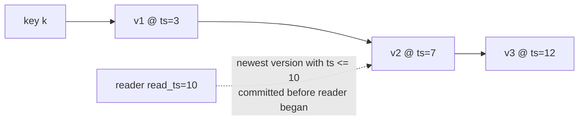
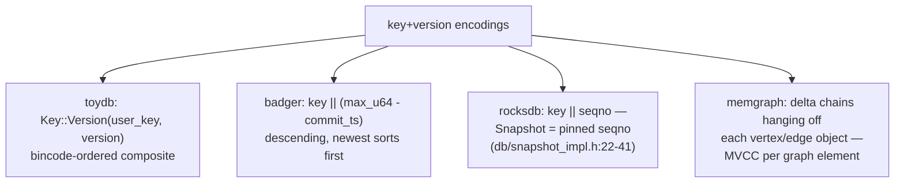
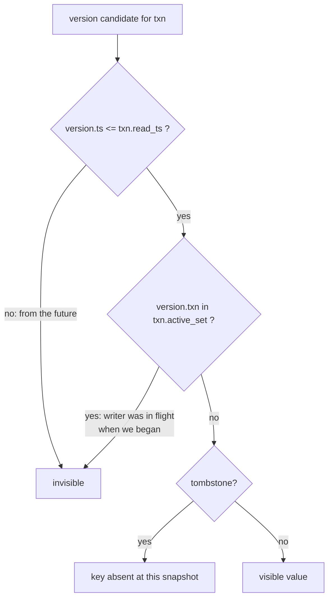
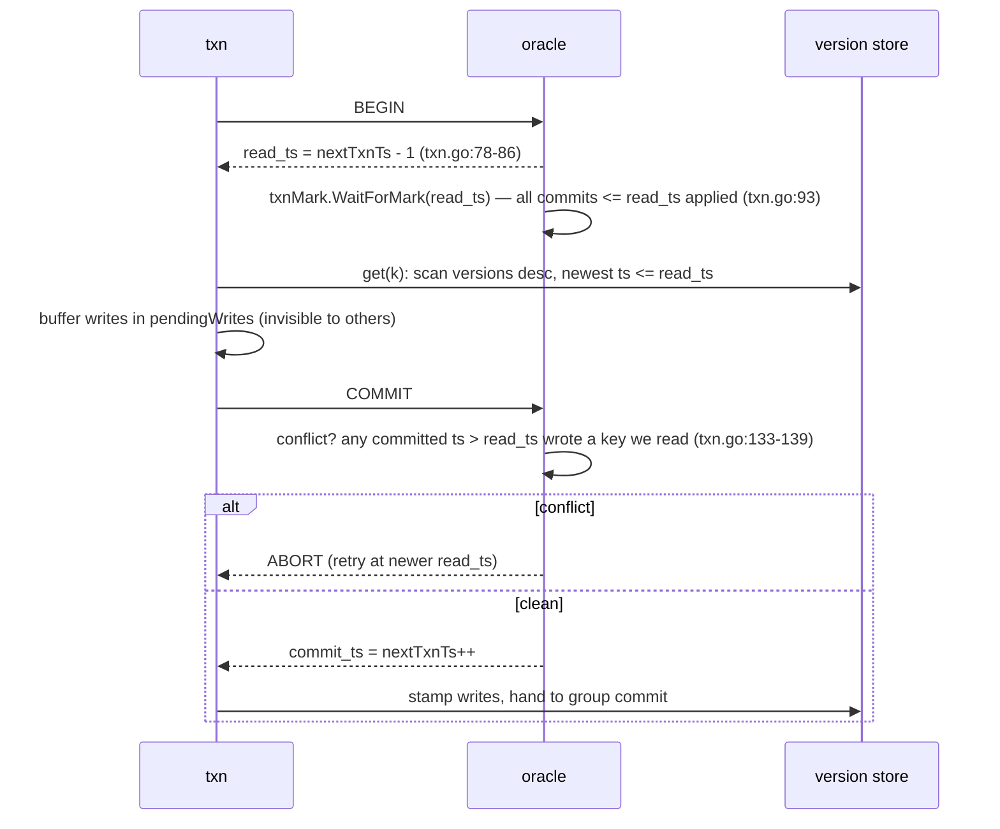
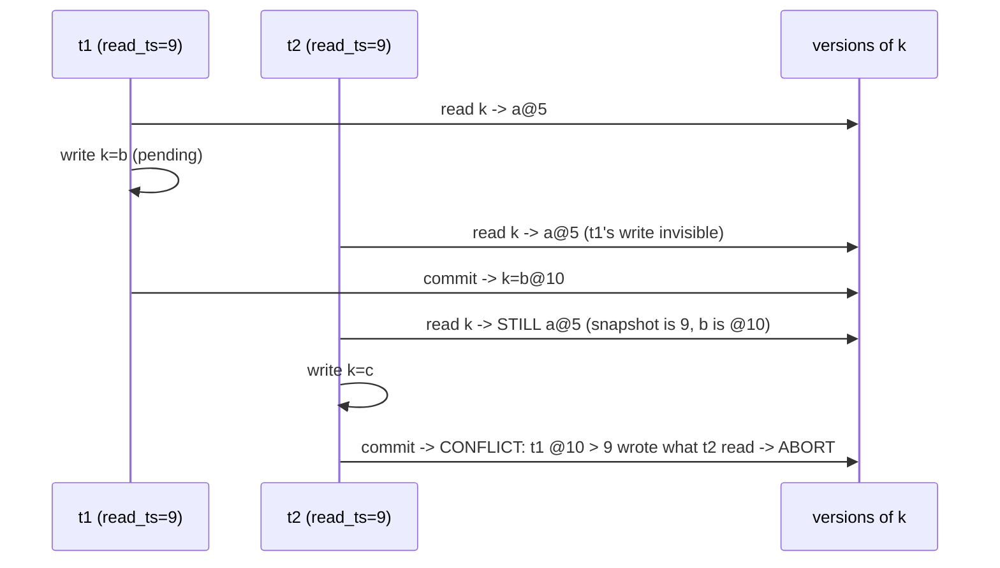
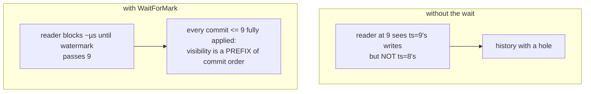
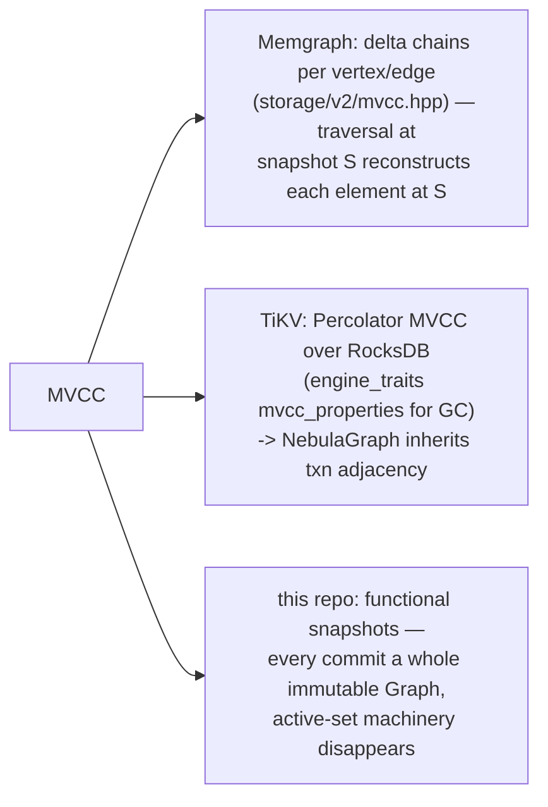
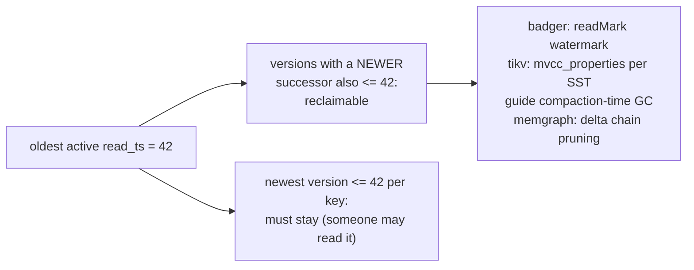

# MVCC Snapshot Visibility — Mermaid

| Field | Value |
| --- | --- |
| Kind | storage |
| Pair | `mvcc-snapshot-visibility-ascii.md` / `mvcc-snapshot-visibility-mermaid.md` |
| One-line job | Let readers see a frozen, consistent world while writers keep writing — multiple timestamped versions per key plus a per-transaction rule for which version is visible |

## 1. The core move

A write never overwrites — it appends a version tagged with a
timestamp; a reader carries a snapshot timestamp selecting the newest
version it may see. Readers never block writers and vice versa; the
price is old versions lingering until GC.

## 2. How each engine encodes key+version

## 3. The visibility rule

toydb spells the active-set variant out in
`reference-repos-corpus/toydb-src/src/storage/mvcc.rs` (module doc,
lines 39–107). RocksDB needs no active set: sequence numbers publish in
commit order, so a pinned seqno alone suffices.

## 4. One read-write transaction (badger's oracle)

GC: versions older than the oldest active read_ts are reclaimable
(badger's readMark watermark).

## 5. Worked example — two transactions, one key

Initial: `k=a @ ts=5`; both txns begin at read_ts=9.

Disk afterward: `k=a@5, k=b@10` — append-only, no overwrite. The abort
is the serializability guard; plain snapshot isolation (RocksDB
WriteCommitted, memgraph default) would let t2 commit `k=c@11` — the
classic write-skew difference.

## 6. Worked example — why read_ts waits for the commit mark

Commits assigned at ts=8 and ts=9; ts=8's writes still being applied
when a reader takes read_ts=9:

Same invariant as Pebble's in-order seqnum publication
(`wal-group-commit` pair) — two mechanisms, one rule.

## 7. Where graph systems inherit this

## 8. Garbage collection — the bill for never overwriting

Old versions accumulate until no active snapshot can see them. Every
engine tracks the oldest live read timestamp (a watermark) and reclaims
below it:

TiKV's trick is worth noting: it stores per-SST MVCC statistics
(`mvcc_properties.rs`) so compaction — the LSM's rewrite pass — doubles
as the MVCC garbage collector, folding two costs into one I/O.

## 9. Citing repos

| Repo | Path | Role |
| --- | --- | --- |
| toydb | `reference-repos-corpus/toydb-src/src/storage/mvcc.rs` | clearest active-set visibility rule (doc lines 39-107) |
| badger | `reference-repos-corpus/badger-src/txn.go` | oracle: watermark wait (78-93), conflict check (133-139) |
| RocksDB | `reference-repos-corpus/rocksdb-src/db/snapshot_impl.h` | snapshot = pinned seqno in linked list |
| TiKV | `reference-repos-corpus/tikv-src/components/engine_traits/src/mvcc_properties.rs` | MVCC version stats for GC |
| Memgraph | `reference-repos-competitors/memgraph-src/src/storage/v2/mvcc.hpp` | per-graph-element delta chains |

## 10. Cross-references

- Sibling patterns: `wal-group-commit` (in-order publication, one level
  down); planned copy-on-write tree snapshots (LMDB/sled road to the
  same reader isolation).
- Papers: ARIES; Percolator — see `research-papers-ledger.md`.
- 202606 digest overlap: prior study had "Memgraph is in-memory MVCC"
  as a one-liner; this pair supplies the rule and worked schedules.
