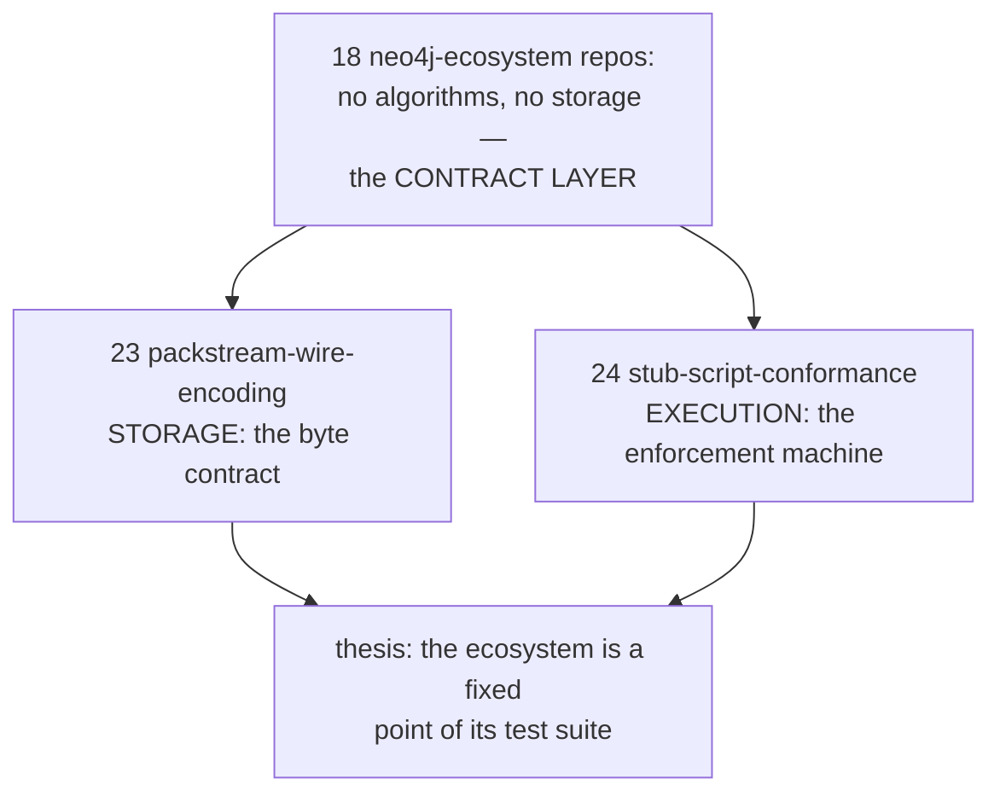
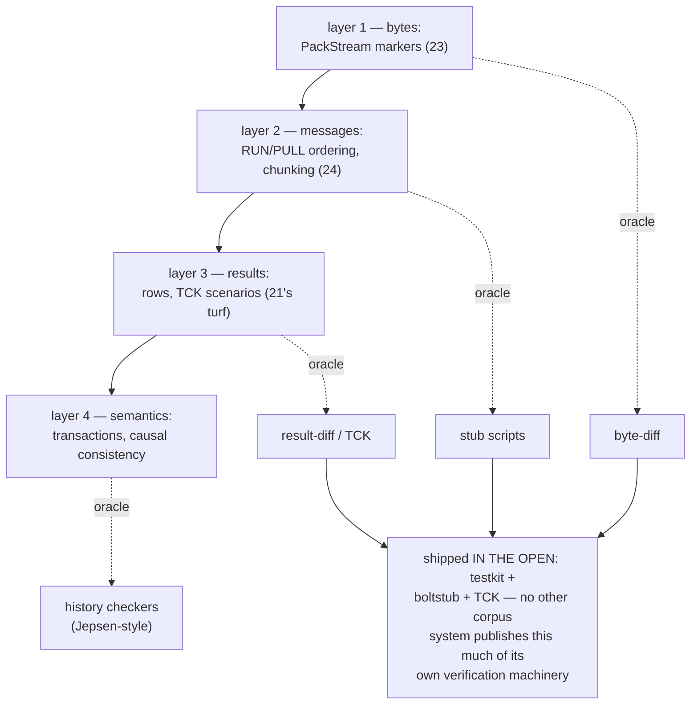
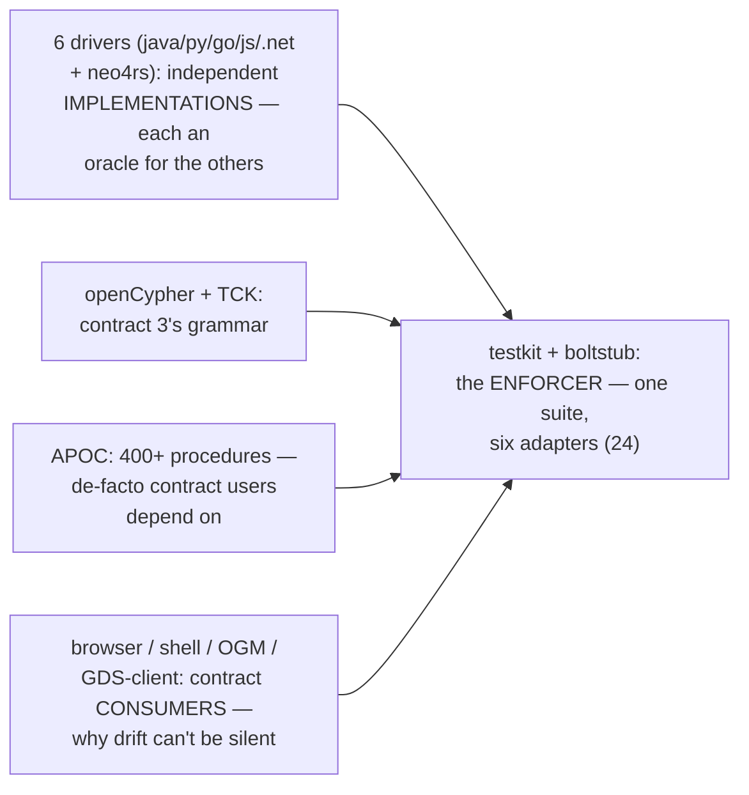
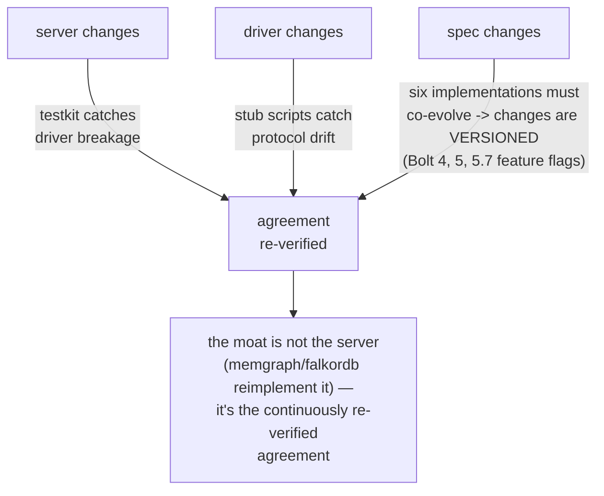
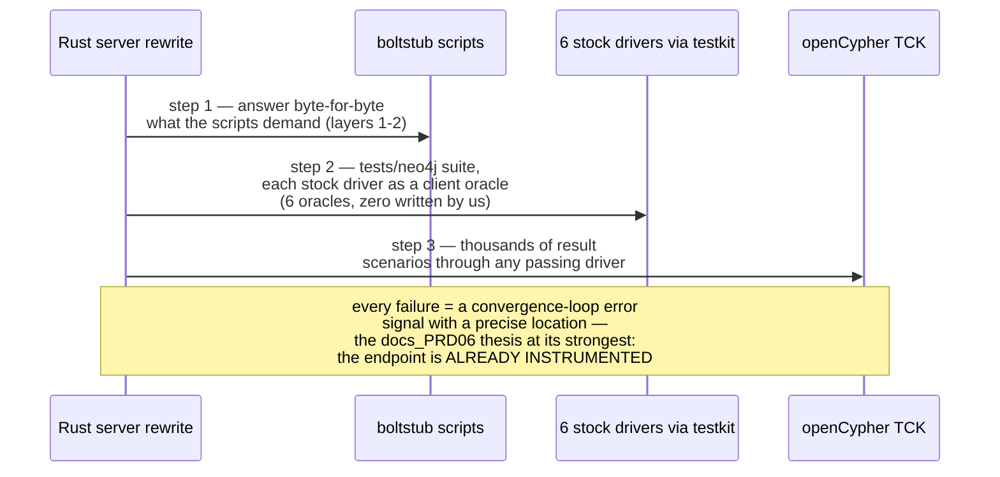
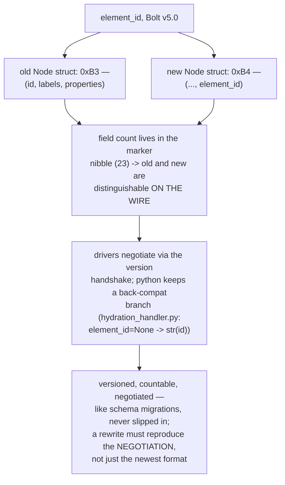
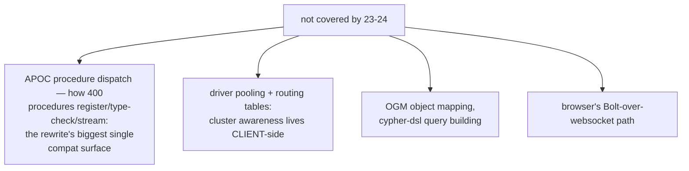
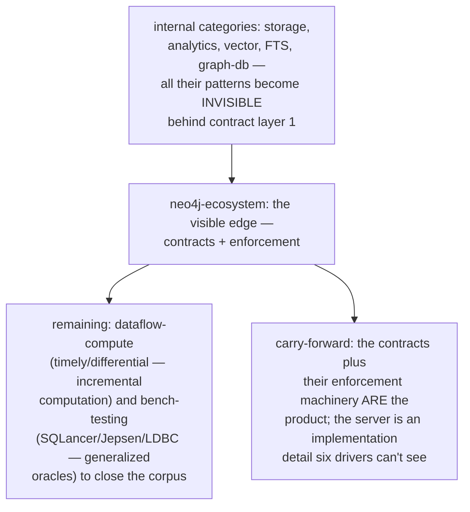
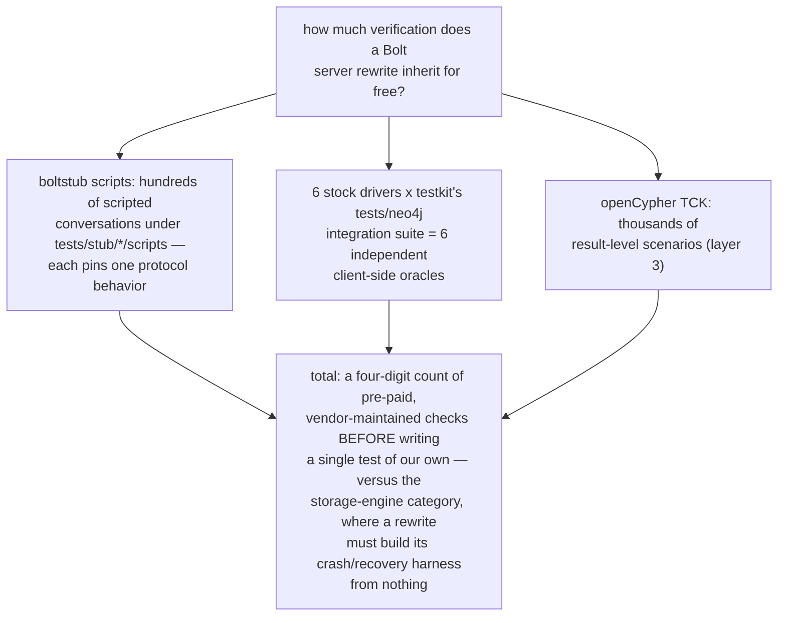
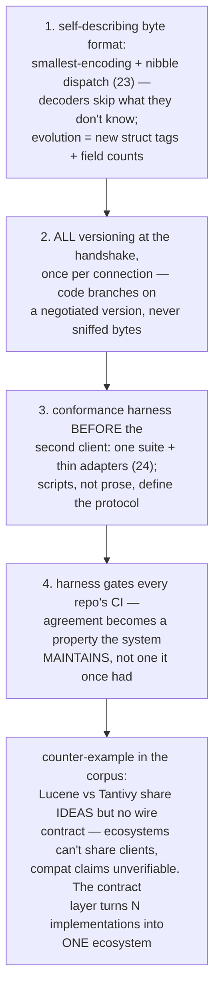

# Neo4j Ecosystem Pattern Synthesis — Mermaid

| Field | Value |
| --- | --- |
| Kind | execution |
| Pair | `neo4j-ecosystem-pattern-synthesis-ascii.md` / `neo4j-ecosystem-pattern-synthesis-mermaid.md` |
| One-line job | Roll up patterns 23-24 into the category's thesis: an ecosystem is held together not by the server but by its CONTRACTS — a byte format, a message protocol, and the harness that enforces them across six independent codebases |

## 1. The category in one map

## 2. The contract stack

## 3. The satellites, contract-wise

## 4. The fixed-point loop

## 5. The rewrite's free test stack

## 6. Contract evolution done right

## 7. Honest gaps

## 8. Position in the corpus

## 7c. Worked example — counting the free oracles

## 8b. Design walk — building an ecosystem edge from scratch

## 9. Citing repos (category roll-up)

| Repo | Path | Role |
| --- | --- | --- |
| neo4rs | `reference-repos-neo4j-family/neo4rs-src/lib/src/packstream/de.rs` | byte contract, Rust witness (23) |
| python-driver | `reference-repos-neo4j-family/neo4j-python-driver-src/src/neo4j/_codec/packstream/v1/__init__.py` | byte contract, canonical writer (23) |
| python-driver | `reference-repos-neo4j-family/neo4j-python-driver-src/src/neo4j/_codec/hydration/v1/hydration_handler.py` | hydration + back-compat (23) |
| testkit | `reference-repos-neo4j-family/neo4j-testkit-src/boltstub/README.md` | conversation DSL (24) |
| testkit | `reference-repos-neo4j-family/neo4j-testkit-src/tests/stub/basic_query/scripts/single_result.script` | scripted conversation (24) |
| go-driver | `reference-repos-neo4j-family/neo4j-go-driver-src/testkit-backend/backend.go` | per-driver adapter (24) |

## 10. Cross-references

- Members: `packstream-wire-encoding` (23),
  `stub-script-conformance` (24).
- Prior syntheses: graph-db (the server whose edge this
  category defines); storage/analytics/vector/FTS (the
  internals the contracts hide).
- The one-sentence takeaway: six independent codebases agreeing
  on bytes, messages, and semantics — continuously re-verified
  by a public harness — is the hardest part of Neo4j to
  compete with, and the easiest part to REUSE for a rewrite.
- Reading order for this category: 23 (bytes) then 24 (the
  machine that checks them) then this synthesis; the ASCII
  twin adds the same design walk in prose plus the APOC /
  routing-table gap list for future passes.
