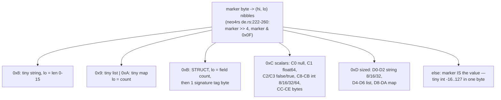
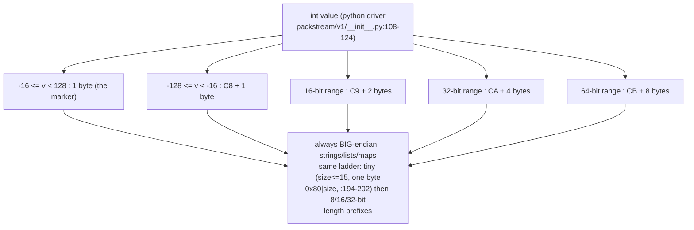
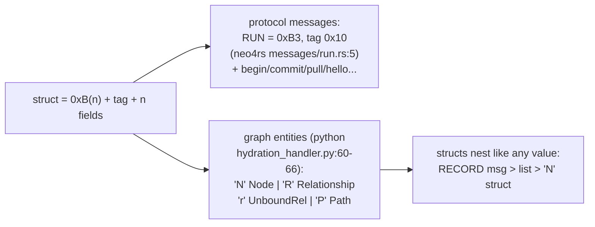
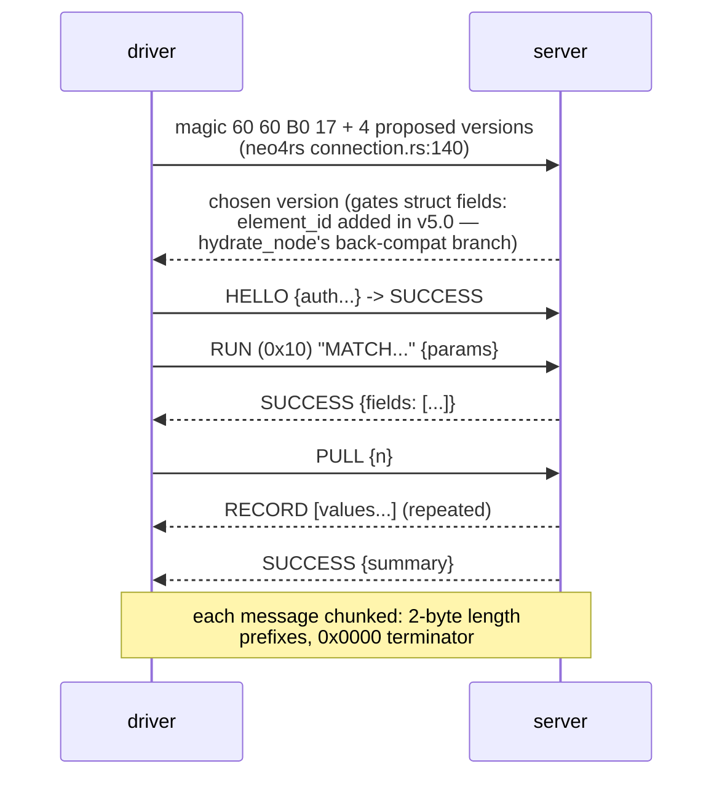
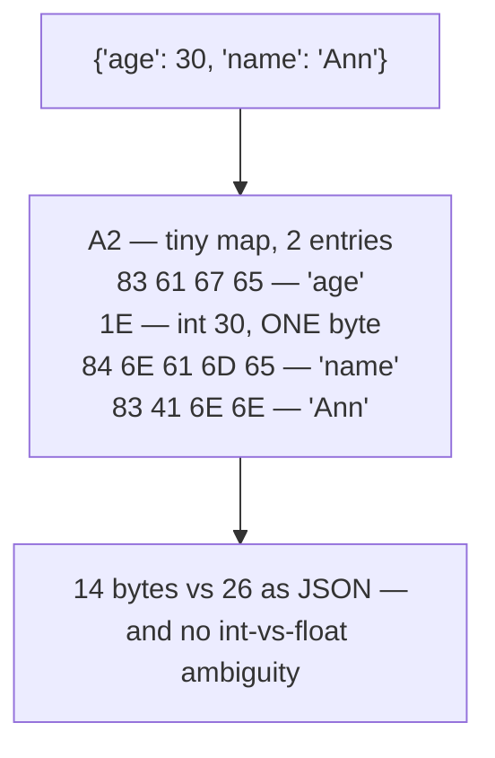
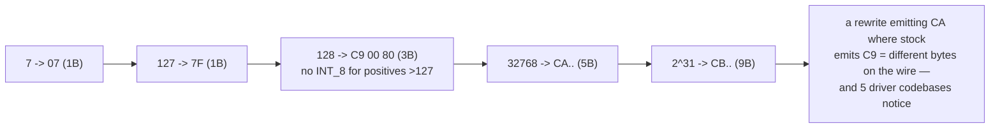
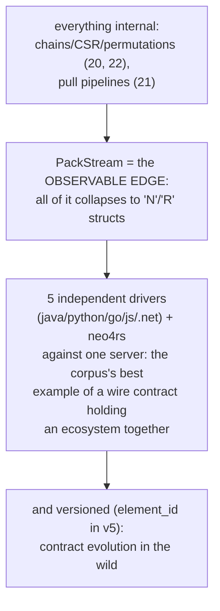
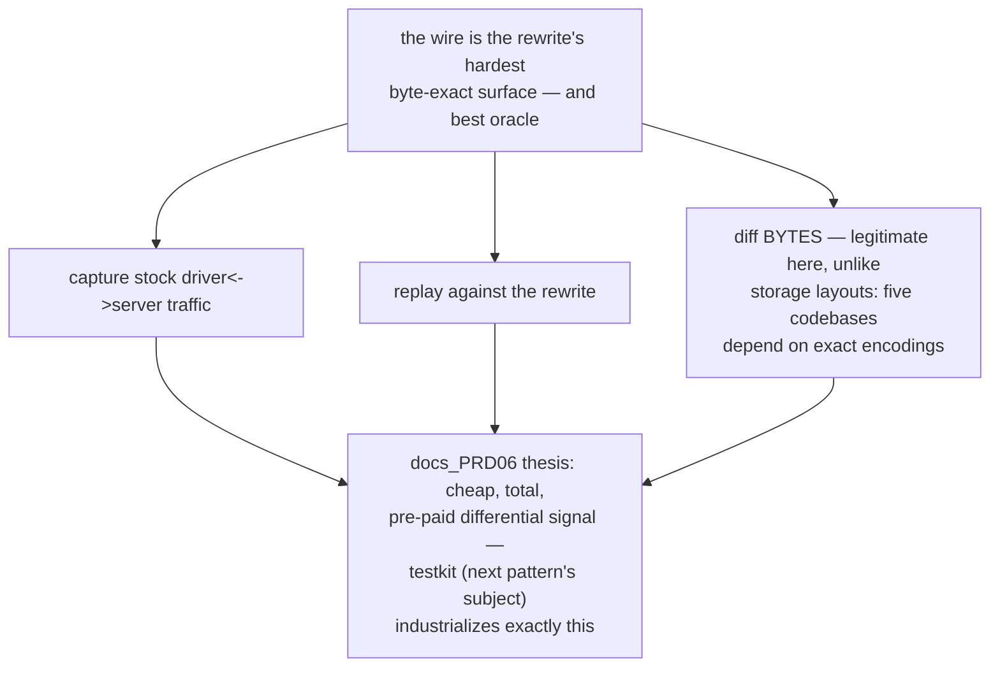
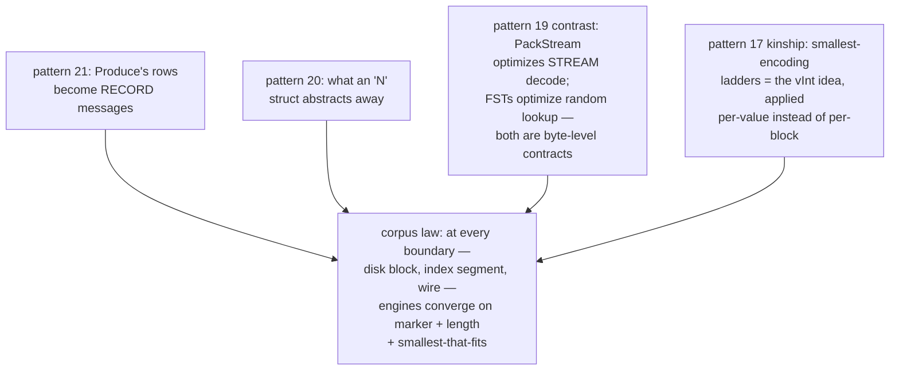
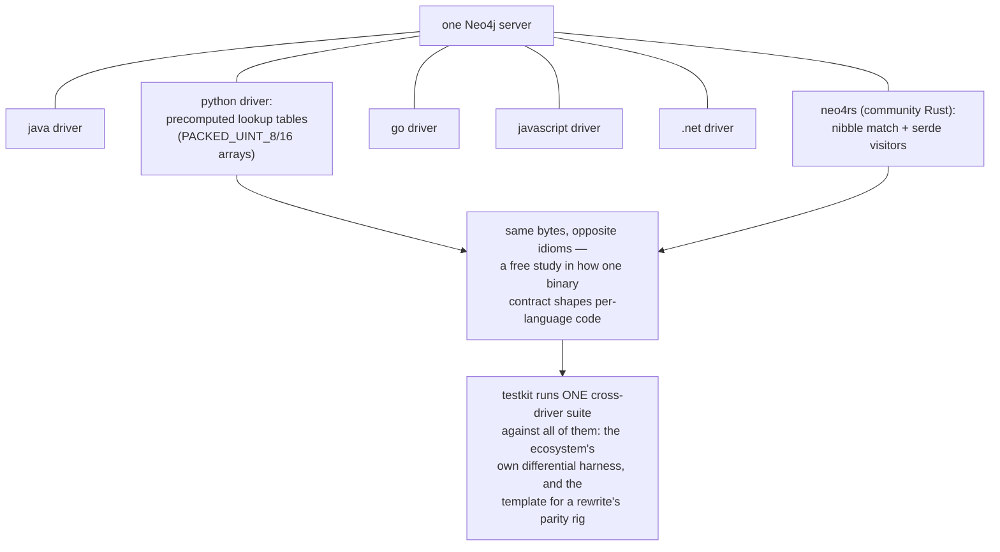

# PackStream Wire Encoding — Mermaid

| Field | Value |
| --- | --- |
| Kind | storage |
| Pair | `packstream-wire-encoding-ascii.md` / `packstream-wire-encoding-mermaid.md` |
| One-line job | Neo4j's binary serialization: a nibble-tagged, big-endian, size-prefixed format where every value starts with one marker byte, and graph entities (Node, Relationship, Path) ride as tagged structs inside ordinary Bolt messages |

## 1. The one-byte dispatch

## 2. The writer picks the smallest encoding

## 3. Structs: protocol and graph share one shape

## 4. The Bolt session around it

## 5. Worked example — a 14-byte map

## 6. Worked example — integer boundaries are contract

## 7. Position in the corpus

## 8. The verification angle

## 9. Kinship map

## 9b. Five drivers, one contract (the ecosystem test)

## 10. Citing repos

| Repo | Path | Role |
| --- | --- | --- |
| neo4rs | `reference-repos-neo4j-family/neo4rs-src/lib/src/packstream/de.rs` | nibble-dispatch decoder (222-260) |
| neo4rs | `reference-repos-neo4j-family/neo4rs-src/lib/src/connection.rs` | Bolt magic handshake (140) |
| neo4rs | `reference-repos-neo4j-family/neo4rs-src/lib/src/messages/run.rs` | RUN struct sig 0xB3/0x10 (5) |
| python-driver | `reference-repos-neo4j-family/neo4j-python-driver-src/src/neo4j/_codec/packstream/v1/__init__.py` | smallest-encoding writer (100-124, 194-202) |
| python-driver | `reference-repos-neo4j-family/neo4j-python-driver-src/src/neo4j/_codec/hydration/v1/hydration_handler.py` | N/R/r/P hydration (60-66) |

## 11. Cross-references

- Sibling patterns: `pull-operator-pipeline` (21),
  `record-chain-adjacency` (20), `fst-term-dictionary` (19),
  `posting-block-compression` (17).
- The ecosystem angle: the same PackStream logic exists five
  times in five languages in this corpus — comparing the
  implementations (e.g. python's lookup tables vs neo4rs's
  nibble match) is a free study in how one binary contract
  shapes idiomatic code differently per language.
- Next: neo4j-ecosystem synthesis (drivers, testkit, APOC as
  the compatibility test bed), then dataflow-compute and
  bench-testing to close the corpus.
