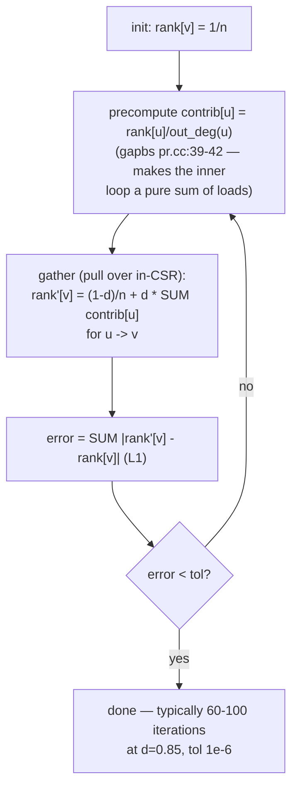
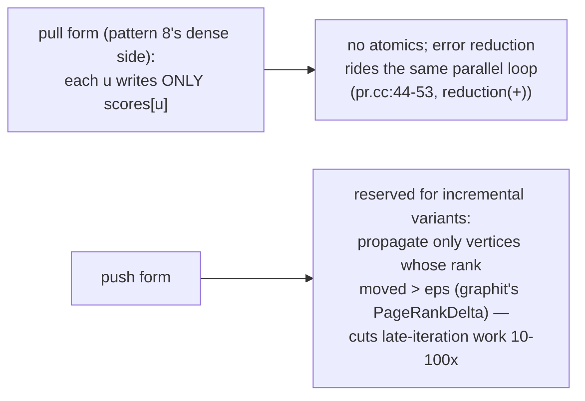
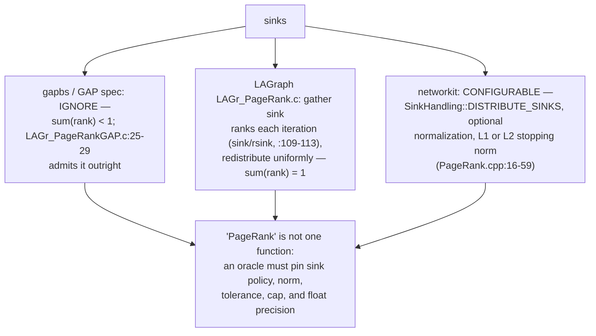
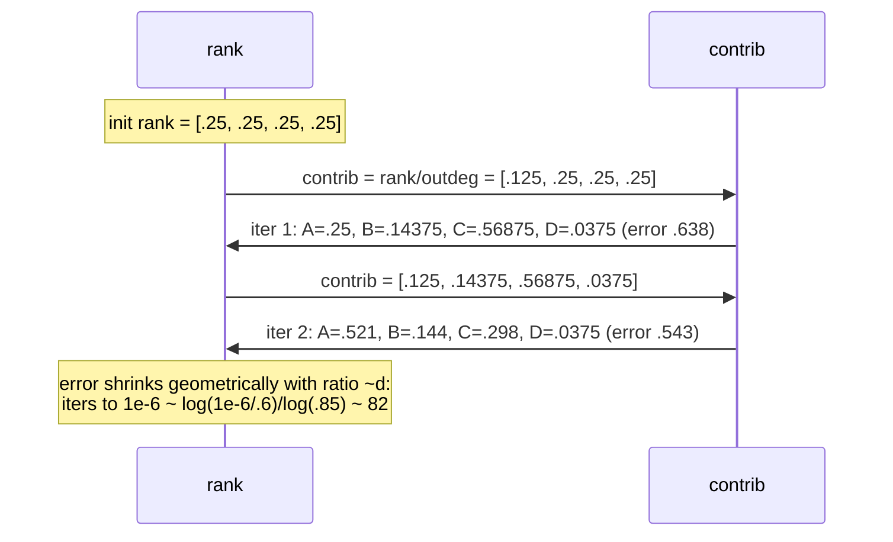
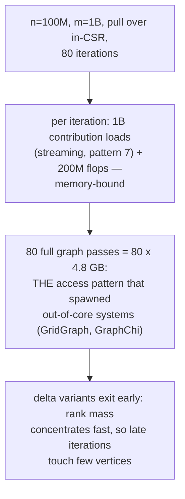
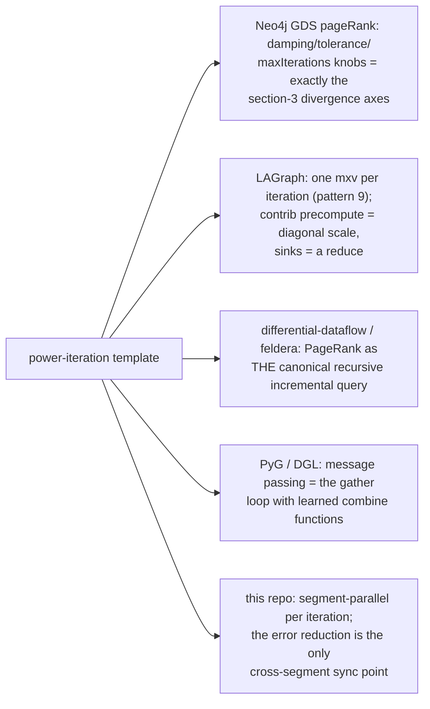
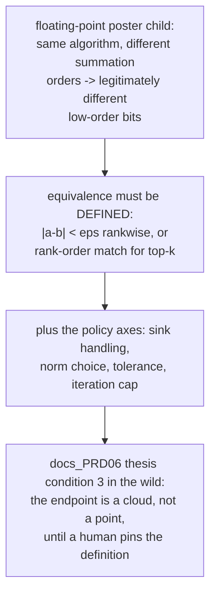
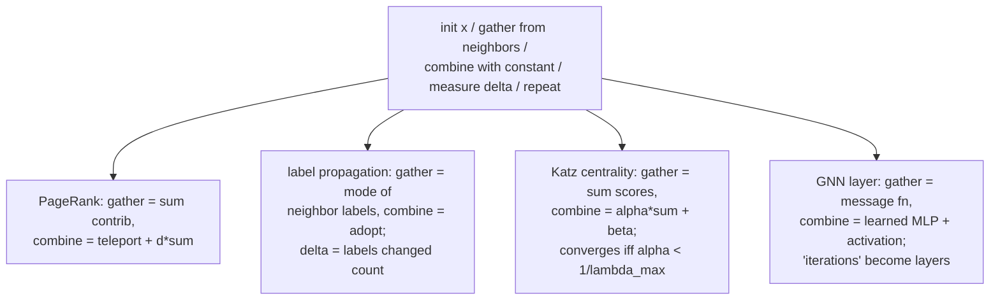
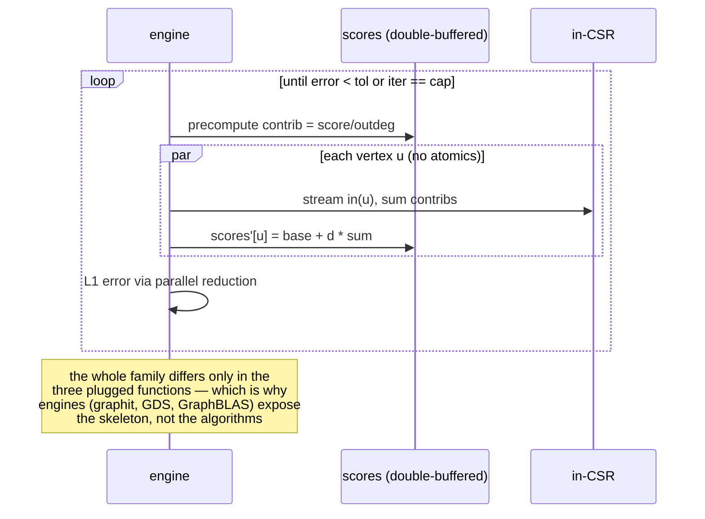

# PageRank Iteration Convergence — Mermaid

| Field | Value |
| --- | --- |
| Kind | algorithm |
| Pair | `pagerank-iteration-convergence-ascii.md` / `pagerank-iteration-convergence-mermaid.md` |
| One-line job | Iterate rank = teleport + damping x (pulled in-neighbor contributions) until an error norm drops below tolerance — the template every fixed-point graph algorithm copies |

## 1. The power iteration

The skeleton (init, gather, combine with constant, measure change,
repeat) is reused by label propagation, Katz, HITS, belief
propagation, and GNN message passing.

## 2. Why pull, why no atomics

## 3. The dangling-node schism

Sinks (out_deg = 0) leak probability. Three corpus policies:

## 4. Three iterations traced

Graph A->B, A->C, B->C, C->A, D->C; n=4, d=0.85, base=0.0375:

d = 0.85 is universal because it balances fidelity to link structure
(bigger d) against convergence speed (smaller d).

## 5. Worked example — cost at a billion edges

## 6. Inheritance map

## 7. The verification angle

## 7b. The template instantiated — four algorithms, one skeleton

## 8. Citing repos

| Repo | Path | Role |
| --- | --- | --- |
| gapbs | `reference-repos-corpus/gapbs-src/src/pr.cc` | pull PageRank: contrib precompute (39-42), fused error reduction (44-53), kDamp (31) |
| LAGraph | `reference-repos-corpus/LAGraph-src/src/algorithm/LAGr_PageRankGAP.c` | GAP variant, sinks ignored (25-29), damping prescale (99-114) |
| LAGraph | `reference-repos-corpus/LAGraph-src/src/algorithm/LAGr_PageRank.c` | sink-correct variant (109-113) |
| networkit | `reference-repos-competitors/networkit-src/networkit/cpp/centrality/PageRank.cpp` | configurable sinks/norms (16-59) |
| graphit | `reference-repos-corpus/graphit-src` | PageRank + PageRankDelta as schedulable algorithms |

## 9. Cross-references

- Sibling patterns: `frontier-pushpull-switching` (pull direction;
  delta variants re-frontier); `semiring-matrix-traversal` (mxv per
  iteration); `csr-adjacency-layout` (the streaming access pattern).
- Next in category: out-of-core edge-grid execution (the systems the
  section-5 cost model motivates), delta-stepping SSSP, or the
  graph-analytics category synthesis pair rolling up patterns 7-11.
- Storage kinship: the double-buffered scores array is the same
  publish-atomically instinct as the storage category's root flips —
  readers of iteration k never see a half-written k+1; gapbs gets
  away with in-place updates only because power iteration tolerates
  (and Gauss-Seidel-style even accelerates on) stale-mixed reads,
  a freedom transactional systems never have.
- Paper trail: Brin & Page (1998), the GAP benchmark specification
  (which LAGr_PageRankGAP names in its header), and the
  incremental-PageRank line in differential dataflow — see
  `research-papers-ledger.md` for verified entries.
- 202606 digest overlap: digests listed PageRank among GDS
  algorithms; this pair adds iteration mechanics, the sink schism
  with file evidence, and convergence arithmetic.
