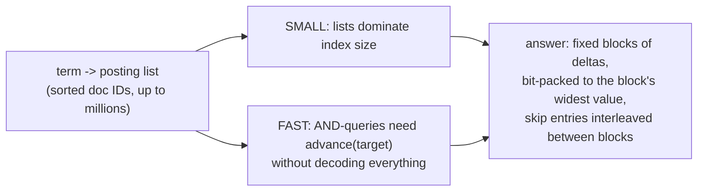
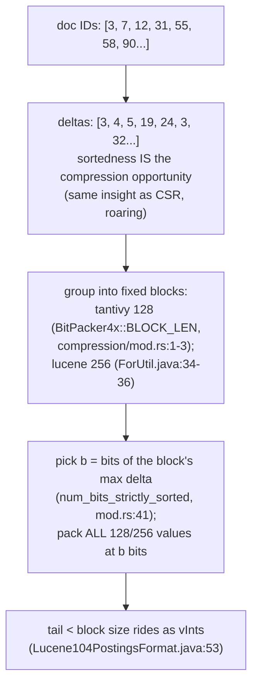
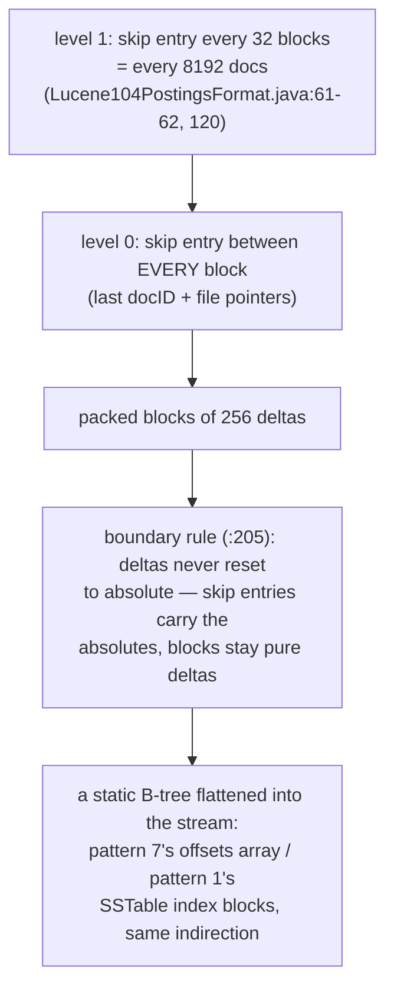
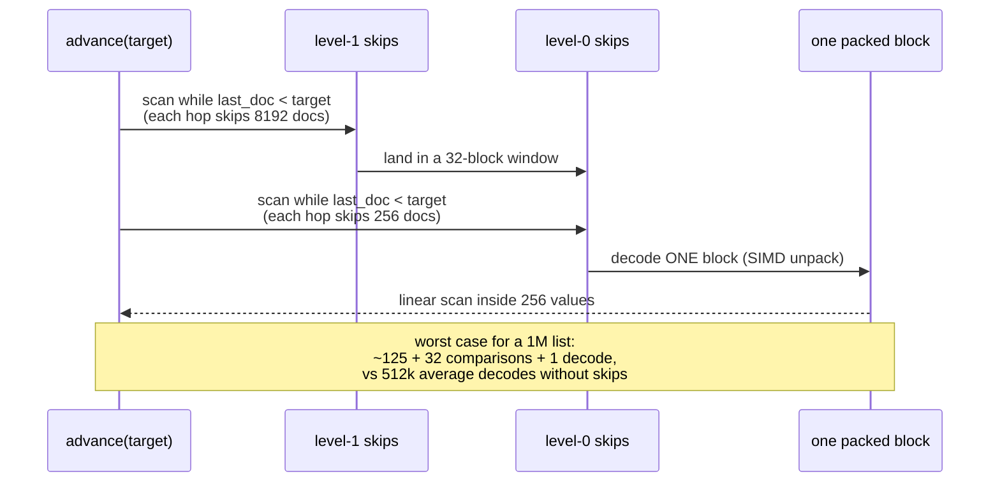
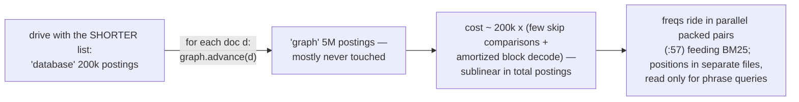
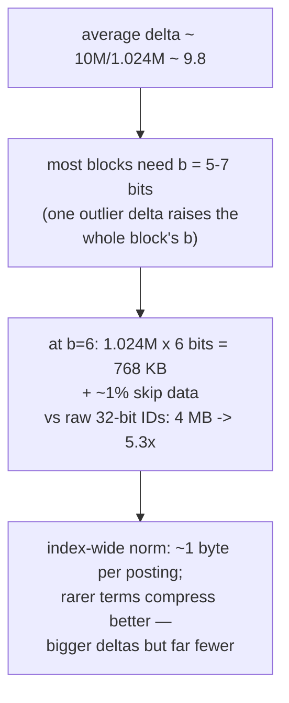
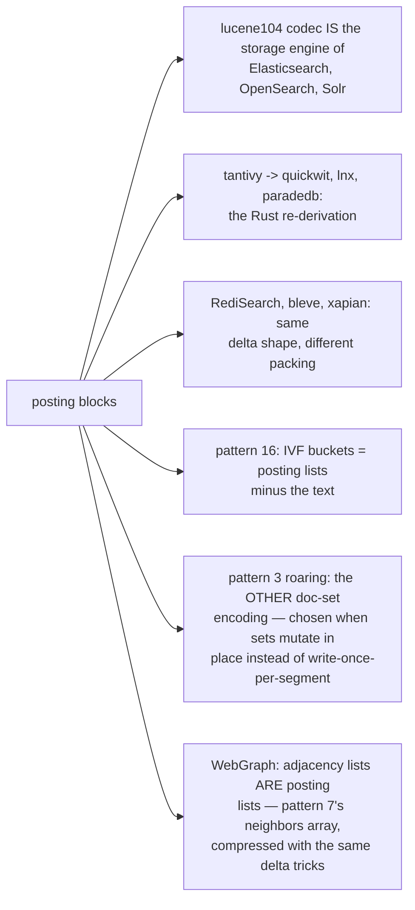
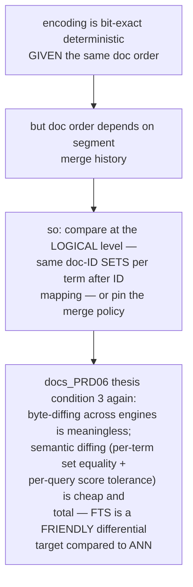
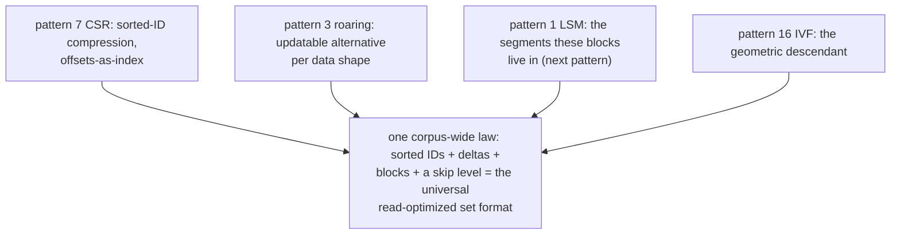

# Posting Block Compression — Mermaid

| Field | Value |
| --- | --- |
| Kind | storage |
| Pair | `posting-block-compression-ascii.md` / `posting-block-compression-mermaid.md` |
| One-line job | Store each term's sorted doc-ID list as delta-encoded, bit-packed fixed-size blocks with interleaved skip data — so a list of millions of IDs costs ~1 byte each and can jump forward without decoding |

## 1. The two pulling requirements



## 2. The encoding pipeline



## 3. Skip data — the flattened B-tree



## 4. advance(target) walk



## 5. Intersection economics



## 6. Size arithmetic (1.024M postings, 10M-doc corpus)



## 7. Inheritance map



## 8. The verification angle



## 9. Kinship map



## 9b. The write path — how blocks get built

```mermaid
sequenceDiagram
    participant D as documents
    participant W as postings_writer (in RAM)
    participant S as segment files (immutable)
    D->>W: tokenize; per term, append<br/>(doc_id, freq, positions) —<br/>tantivy postings_writer.rs
    Note over W: per-term buffers keep doc IDs in<br/>arrival order = already sorted<br/>(doc IDs are assigned monotonically)
    W->>S: on segment flush: for each term,<br/>delta-encode, cut 128/256-blocks,<br/>pick per-block num_bits, pack,<br/>interleave skip entries
    Note over S: the encoding happens ONCE, at flush —<br/>blocks are never edited in place;<br/>updates create new segments and<br/>deletes are tombstone bitmaps<br/>(the LSM discipline, patterns 1/4)
    S->>S: merges re-decode, re-map doc IDs,<br/>re-encode — cheap because decode is<br/>a linear SIMD pass
```

Write-once is why the format can afford per-block optimal bit
widths and interleaved skips: no update path ever has to patch a
packed block. Mutable-set workloads flip to roaring bitmaps
(pattern 3) precisely because they cannot make this promise.

## 10. Citing repos

| Repo | Path | Role |
| --- | --- | --- |
| lucene | `reference-repos-corpus/lucene-src/lucene/core/src/java/org/apache/lucene/codecs/lucene104/Lucene104PostingsFormat.java` | format contract: 256-blocks + vInt tail (53-57), 2-level skips (61-62, 120), boundary rule (205) |
| lucene | `reference-repos-corpus/lucene-src/lucene/core/src/java/org/apache/lucene/codecs/lucene104/ForUtil.java` | bit-packing kernel: BLOCK_SIZE=256 (34-36), size arithmetic (160) |
| tantivy | `reference-repos-corpus/tantivy-src/src/postings/compression/mod.rs` | BitPacker4x 128-blocks, per-block num_bits (1-14, 41) |
| tantivy | `reference-repos-corpus/tantivy-src/src/postings/` | read/write paths around the blocks |
| quickwit | `reference-repos-corpus/quickwit-src` | tantivy's blocks on object storage |

## 11. Cross-references

- Sibling patterns: see §9 kinship map.
- Next in category: segment merge lifecycle (Lucene's LSM), then
  BM25 + WAND early termination.
- Paper trail: FOR/PForDelta compression literature and the BM25 /
  WAND papers queued in `research-papers-ledger.md`.
- 202606 digest overlap: digests covered FTS at the "inverted
  index exists" level; this pair adds block/skip mechanics with
  line cites and the cost arithmetic.
