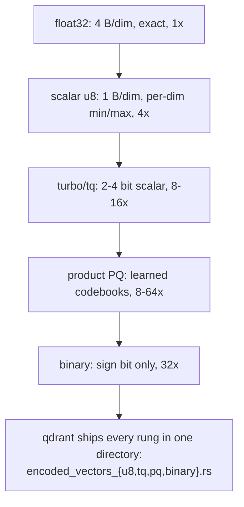
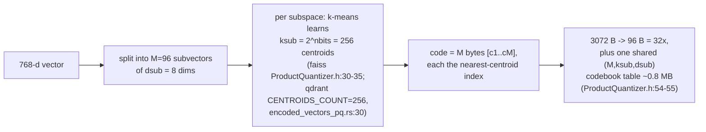
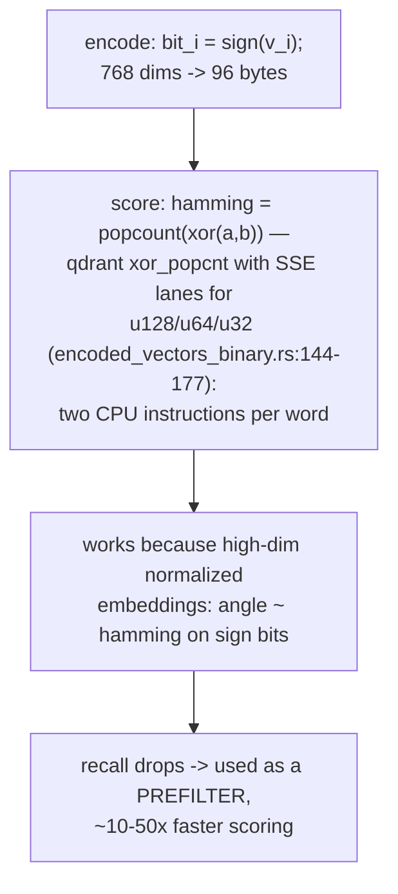
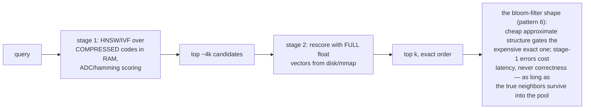
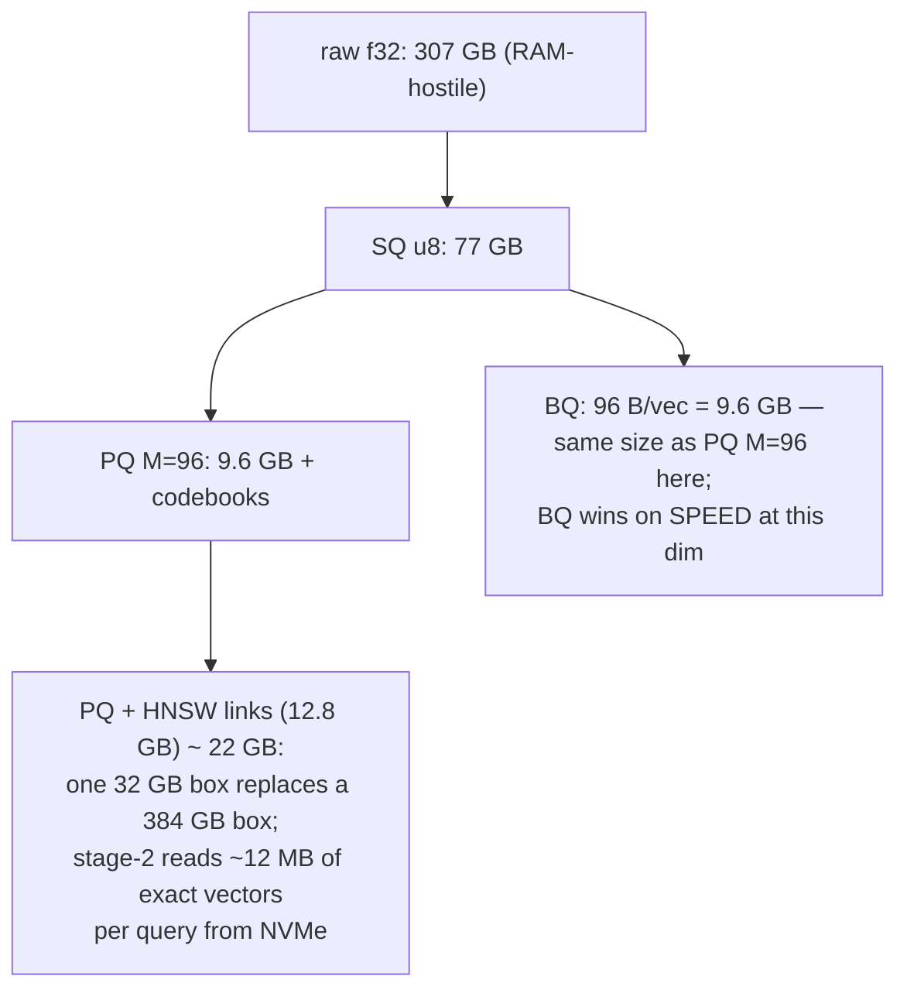
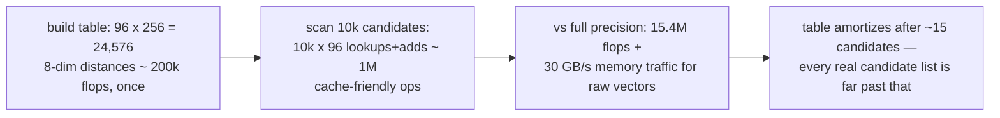
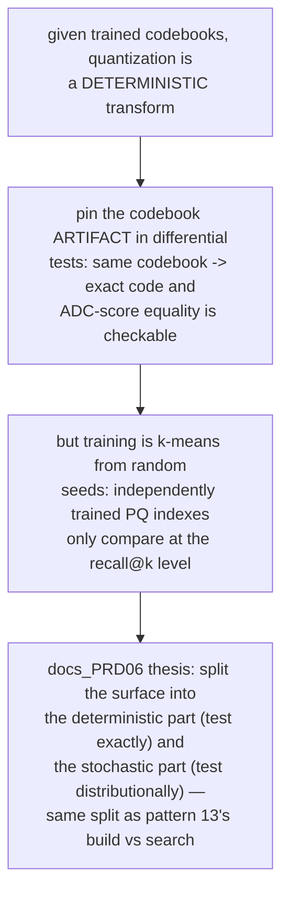
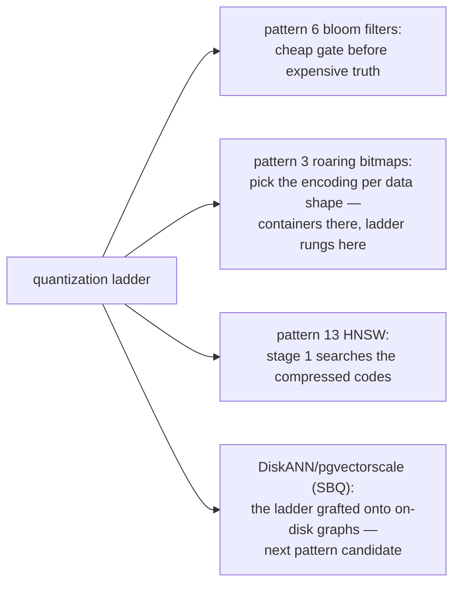
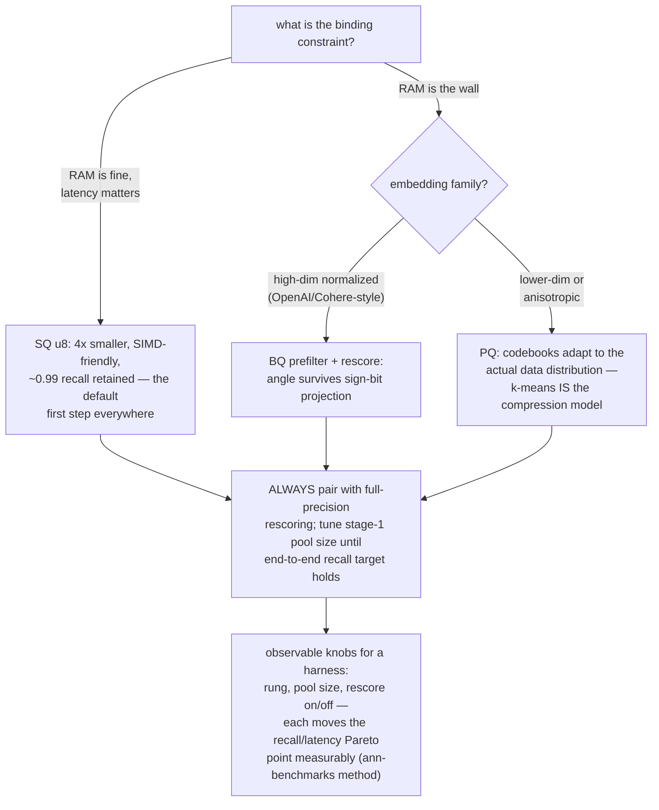

# Product Quantization Ladder — Mermaid

| Field | Value |
| --- | --- |
| Kind | storage |
| Pair | `product-quantization-ladder-ascii.md` / `product-quantization-ladder-mermaid.md` |
| One-line job | Compress vectors 4x-192x by encoding them against small learned codebooks, and score compressed codes against a query with table lookups instead of float arithmetic — accuracy traded for memory on an explicit ladder |

## 1. The ladder



Distances are computed IN the compressed domain — decompression
never happens on the hot path. That is the pattern.

## 2. PQ encoding



## 3. ADC scoring — the lookup-table trick

```mermaid
sequenceDiagram
    participant Q as query (exact floats)
    participant T as dis_table (M x ksub)
    participant DB as encoded codes
    Q->>T: ONCE per query: dis_table[m][j] =<br/>||query_sub_m - centroid[m][j]||²<br/>(ProductQuantizer.h:118-126;<br/>qdrant lut, encoded_vectors_pq.rs:38-42)
    loop each candidate code
        DB->>T: dist ~ SUM_m dis_table[m][code[m]]
        Note over T: M lookups + M adds,<br/>ZERO multiplies per candidate
    end
    Note over Q,DB: ASYMMETRIC: query stays exact, only the<br/>database side is quantized — half the error<br/>of symmetric SDC (whose table faiss also<br/>keeps, ProductQuantizer.h:167)
```

## 4. Binary quantization — the extreme rung



## 5. The two-stage rescoring architecture



## 6. Budget arithmetic — 100M x 768-d



## 7. ADC cost per query



## 8. The verification angle



## 9. Kinship map



## 9b. Choosing a rung — the decision procedure



The rung choice is pattern 8's direction switch at architecture
scale: measure the workload's shape, pick the representation whose
cost model fits, keep a guard (rescoring) so the wrong choice
degrades gracefully instead of failing.

## 10. Citing repos

| Repo | Path | Role |
| --- | --- | --- |
| faiss | `reference-repos-corpus/faiss-src/faiss/impl/ProductQuantizer.h` | canonical PQ: M/nbits/dsub/ksub (30-35), centroid layout (54-63), ADC tables (118-138), SDC (167) |
| qdrant | `reference-repos-corpus/qdrant-src/lib/quantization/src/encoded_vectors_pq.rs` | production PQ: 256 centroids (30), LUT (38-42), chunk division (63-88, 160) |
| qdrant | `reference-repos-corpus/qdrant-src/lib/quantization/src/encoded_vectors_binary.rs` | BQ with SIMD xor_popcnt (100, 144-177) |
| qdrant | `reference-repos-corpus/qdrant-src/lib/quantization/src/` | the full ladder: u8, tq, pq, binary + kmeans.rs |
| pgvectorscale | `reference-repos-corpus/pgvectorscale-src` | the ladder inside Postgres (SBQ) over a DiskANN graph |

## 11. Cross-references

- Sibling patterns: `hnsw-layered-greedy`, `bloom-filter-shortcuts`,
  `roaring-bitmap-sets` (see §9).
- Next in category: DiskANN/Vamana on-disk graphs (where stage-2
  vectors live), then IVF partitioning as the HNSW alternative.
- Paper trail: Jégou et al.'s PQ paper and the faiss library paper
  (verified in `research-papers-ledger.md`).
- 202606 digest overlap: digests mentioned PQ as Milvus/faiss
  compression; this pair adds ADC table mechanics, the BQ popcount
  kernel with line cites, the rescoring architecture, and the
  budget arithmetic.
