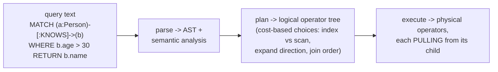
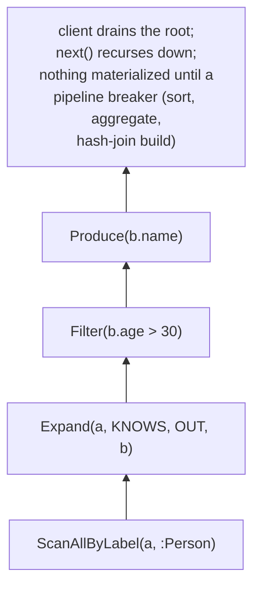
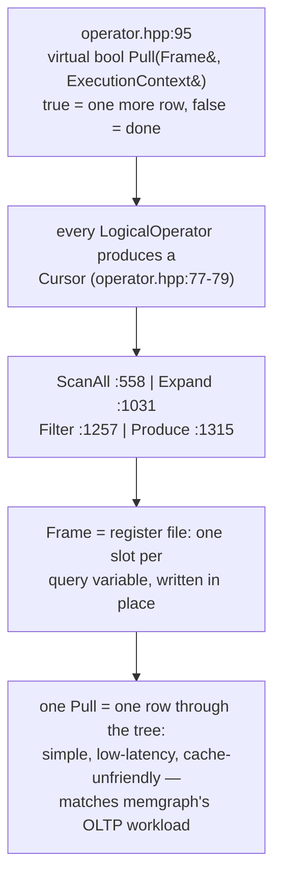
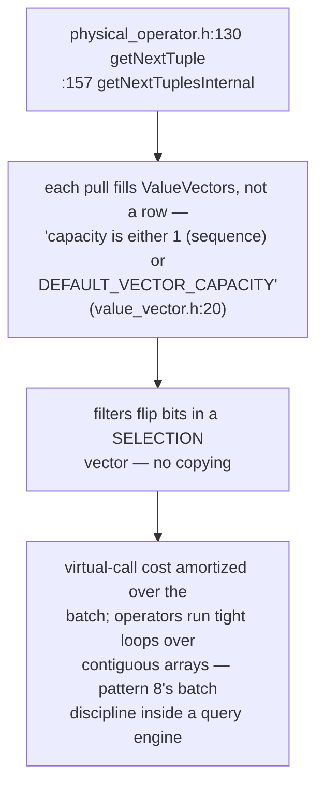
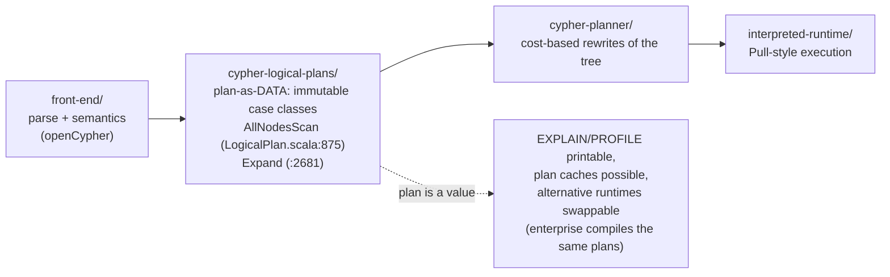
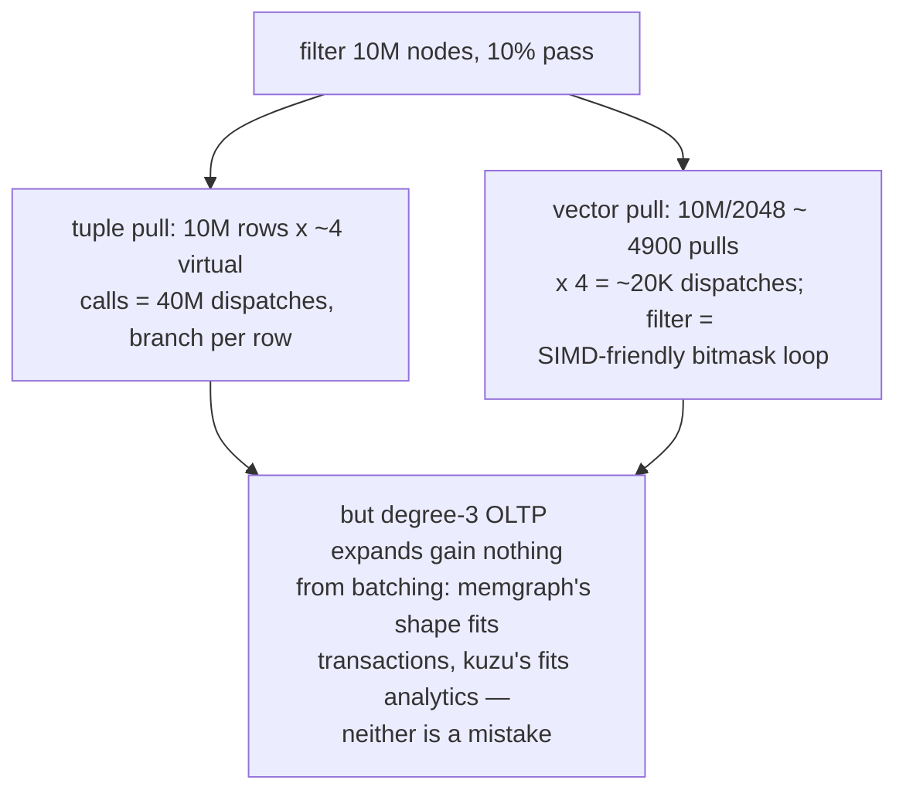
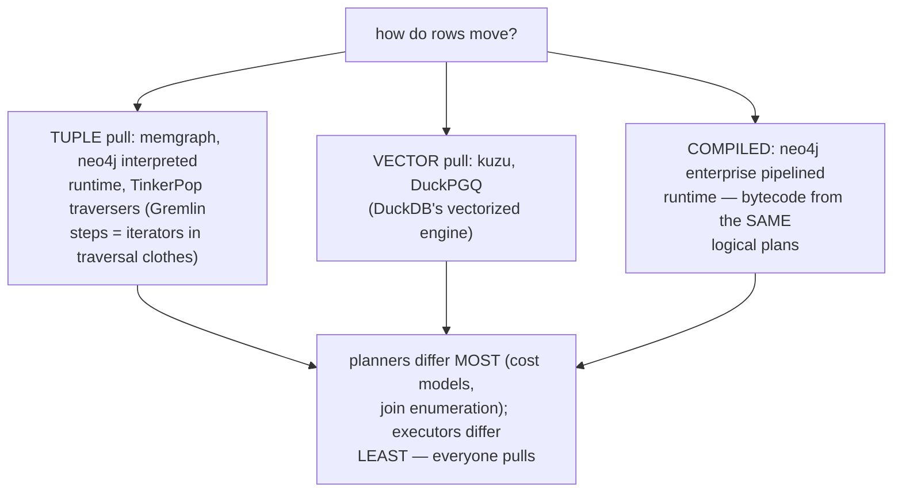
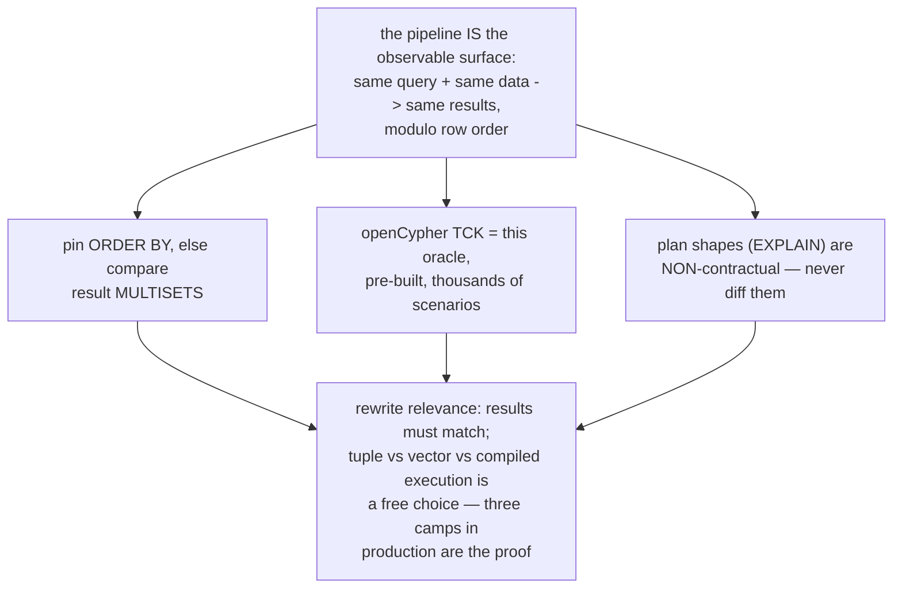
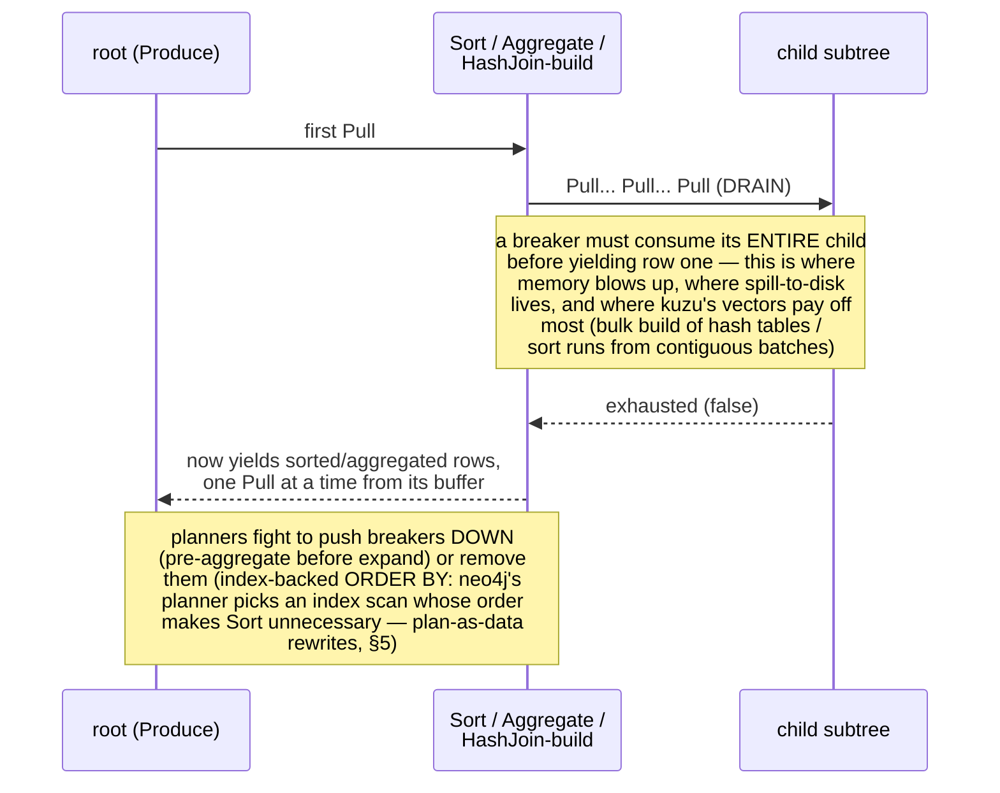

# Pull Operator Pipeline — Mermaid

| Field | Value |
| --- | --- |
| Kind | execution |
| Pair | `pull-operator-pipeline-ascii.md` / `pull-operator-pipeline-mermaid.md` |
| One-line job | Turn a declarative graph query into a tree of operators that PULL rows from their children — the Volcano iterator model as every graph database's execution spine, tuple-at-a-time (memgraph) or vector-at-a-time (kuzu) |

## 1. The three-stage pipe



## 2. The operator tree



## 3. Memgraph: tuple-at-a-time



## 4. Kuzu: vector-at-a-time



## 5. Neo4j: planning made explicit



## 6. One row through the tree

```mermaid
sequenceDiagram
    participant C as client
    participant PR as Produce
    participant F as Filter(b.age>30)
    participant E as Expand
    participant S as ScanAll
    C->>PR: Pull
    PR->>F: Pull
    F->>E: Pull
    E->>S: Pull
    S-->>E: Frame[a=alice] (true)
    E-->>F: Frame[b=bob] (true)
    F-->>PR: bob.age=35 > 30 (true)
    PR-->>C: "bob"
    C->>PR: Pull
    Note over F,E: Expand yields carol; 28 > 30 FAILS —<br/>Filter silently pulls again;<br/>Expand exhausted; ScanAll exhausted
    PR-->>C: false — query done
```

## 7. Why vectors win on scans (and don't on lookups)



## 8. The corpus on this axis



## 9. The verification angle



## 9b. Pipeline breakers — where pull stops streaming



## 10. Citing repos

| Repo | Path | Role |
| --- | --- | --- |
| memgraph | `reference-repos-competitors/memgraph-src/src/query/plan/operator.hpp` | Cursor::Pull (77-95), ScanAll/Expand/Filter/Produce (558, 1031, 1257, 1315) |
| kuzu | `reference-repos-competitors/kuzu-src/src/include/processor/operator/physical_operator.h` | getNextTuple/getNextTuplesInternal (130, 157) |
| kuzu | `reference-repos-competitors/kuzu-src/src/include/common/vector/value_vector.h` | ValueVector batch capacity (20) |
| neo4j | `reference-repos-neo4j-family/neo4j-src/community/cypher/cypher-logical-plans/src/main/scala/org/neo4j/cypher/internal/logical/plans/LogicalPlan.scala` | plan-as-data: AllNodesScan (875), Expand (2681) |

## 11. Cross-references

- Sibling patterns: `record-chain-adjacency` (20 — what Expand
  reads), `frontier-push-pull` (8 — the batch discipline kuzu
  imports), `bm25-wand-pruning` (18 — scorer trees are pull
  pipelines with score-ordered heaps).
- Kinship law: Volcano's next() is the same shape as pattern
  17's advance() and HNSW's candidate pop (13) — demand-driven
  iteration is the corpus's universal execution idiom.
- Paper trail: Graefe's Volcano paper and MonetDB/X100
  ("vectorized execution") — the two poles of §7 — queued in
  `research-papers-ledger.md`.
- Next in category: property/columnar value storage, then the
  graph-db category synthesis.
