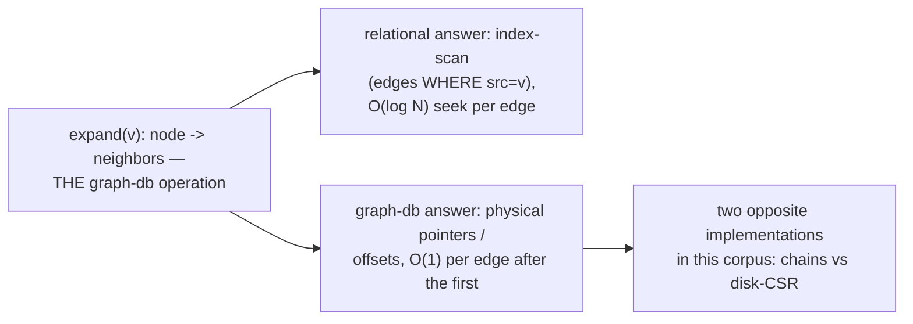
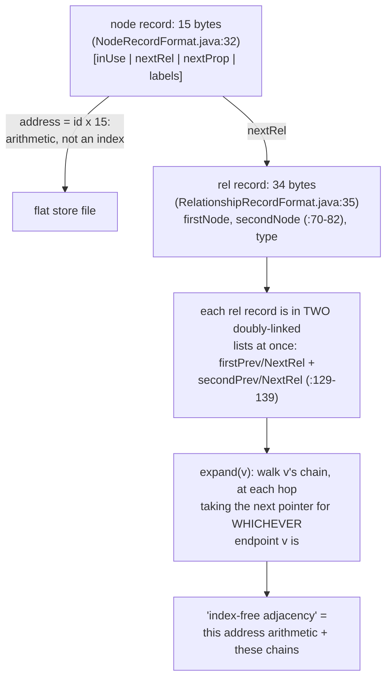
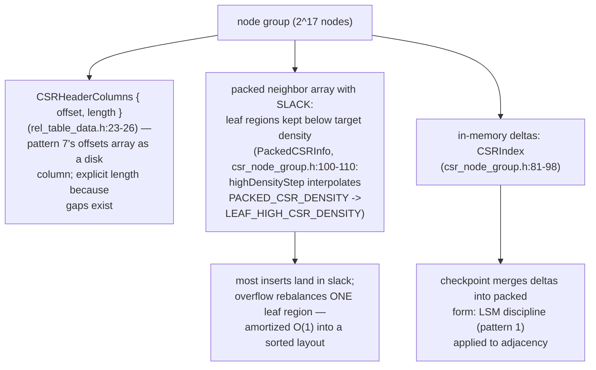
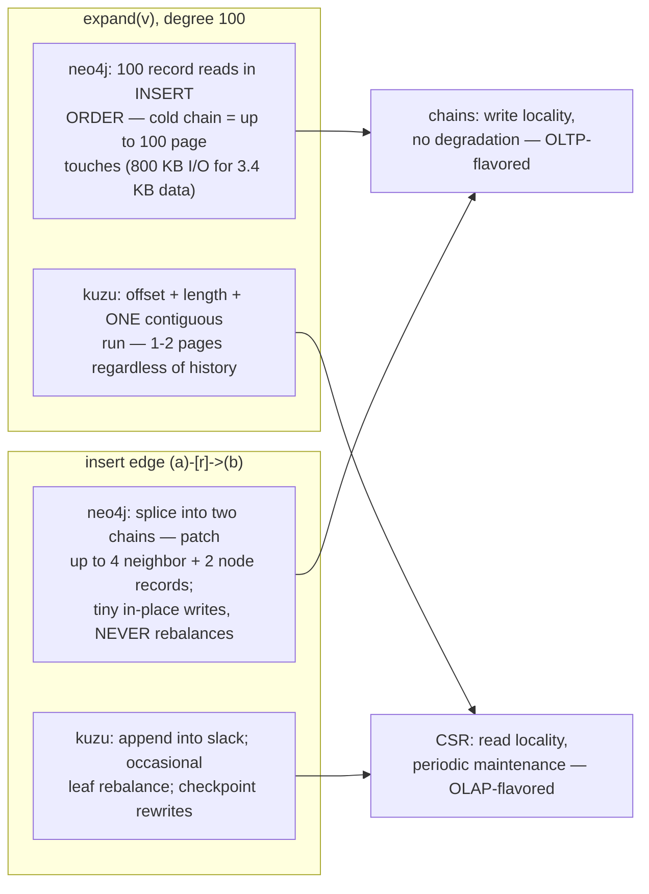
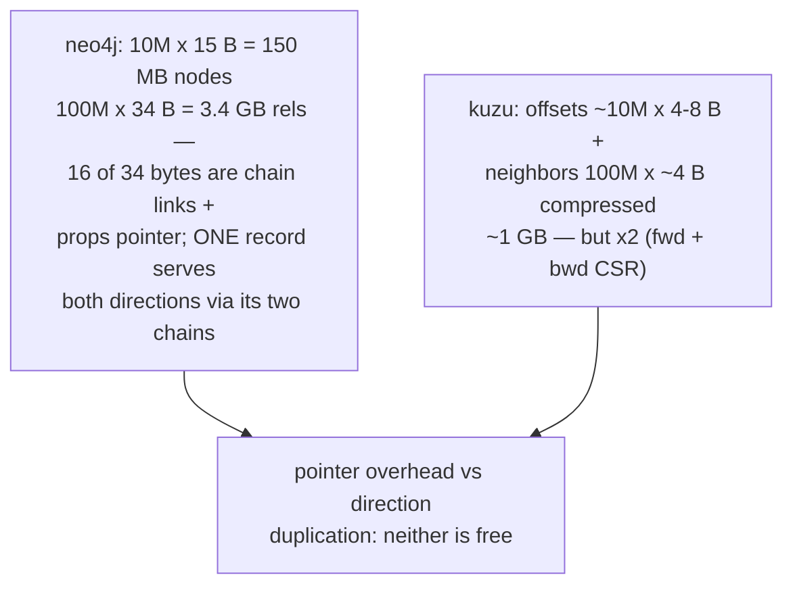
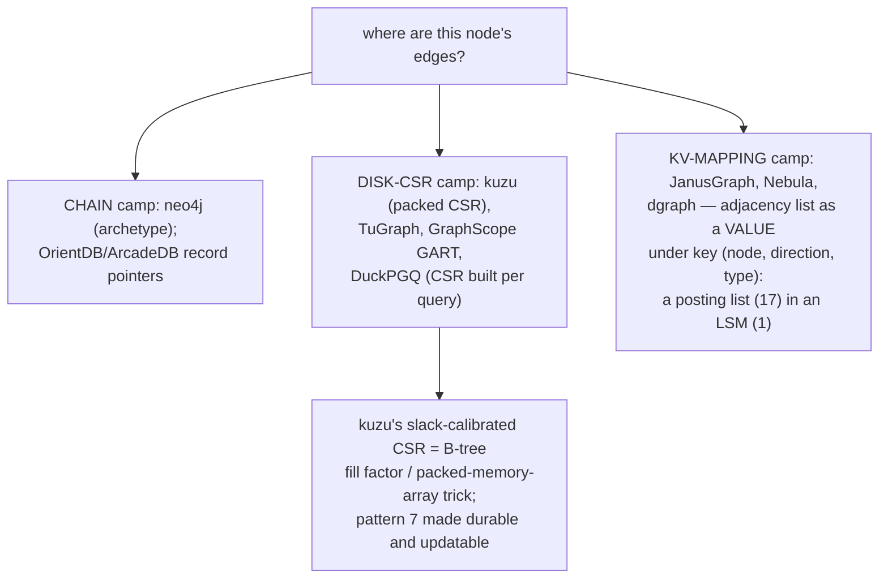
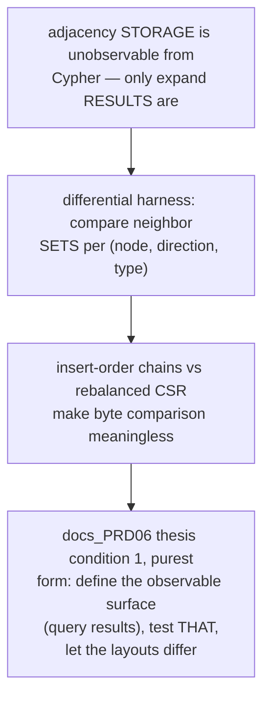
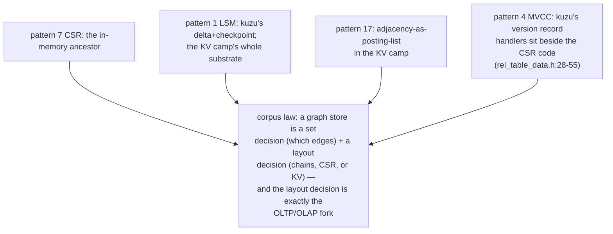

# Record Chain Adjacency — Mermaid

| Field | Value |
| --- | --- |
| Kind | storage |
| Pair | `record-chain-adjacency-ascii.md` / `record-chain-adjacency-mermaid.md` |
| One-line job | Make edge traversal a pointer chase instead of an index lookup — Neo4j's fixed-size record chains ("index-free adjacency") versus Kuzu's disk-resident packed CSR: two on-disk answers to "where are this node's edges?" |

## 1. The defining read



## 2. Neo4j: fixed-size records + chains



## 3. Kuzu: packed CSR in node groups



## 4. The trade



## 5. Size arithmetic (10M nodes, 100M rels)



## 6. 2-hop traversal (degree 50, 2500 leaves)

```mermaid
sequenceDiagram
    participant Q as friends-of-friends(v)
    participant N as neo4j chains
    participant K as kuzu CSR
    Q->>N: 51 chain walks
    N-->>Q: worst case ~2550 random page touches —<br/>page-cache hit rate decides everything:<br/>hot graphs fly, cold graphs thrash
    Q->>K: 51 offset lookups + 51 contiguous runs
    K-->>Q: ~100-150 mostly-sequential page touches;<br/>output arrives as vectors ready for<br/>pattern 8-style batch processing
```

## 7. The corpus on this axis



## 8. The verification angle



## 9. Kinship map



## 10. Citing repos

| Repo | Path | Role |
| --- | --- | --- |
| neo4j | `reference-repos-neo4j-family/neo4j-src/community/record-storage-engine/src/main/java/org/neo4j/kernel/impl/store/format/standard/NodeRecordFormat.java` | 15-byte node record (32, 59-76) |
| neo4j | `reference-repos-neo4j-family/neo4j-src/community/record-storage-engine/src/main/java/org/neo4j/kernel/impl/store/format/standard/RelationshipRecordFormat.java` | 34-byte rel record, dual chains (35, 70-82, 129-139) |
| kuzu | `reference-repos-competitors/kuzu-src/src/include/storage/table/rel_table_data.h` | CSRHeaderColumns (23-26) |
| kuzu | `reference-repos-competitors/kuzu-src/src/include/storage/table/csr_node_group.h` | CSRIndex (81-98), PackedCSRInfo (100-110) |

## 11. Cross-references

- Sibling patterns: see §9 kinship map.
- Next in category: property/columnar storage and the Cypher
  query pipeline (parse -> plan -> execute).
- Paper trail: the Kuzu CIDR paper and PMA (packed memory array)
  literature — queued in `research-papers-ledger.md`.
- 202606 digest overlap: digests recorded "index-free adjacency"
  as a slogan; this pair adds record byte layouts, the
  chain-splice write path, density-calibrated packed CSR, and
  the numeric read/write trade.
