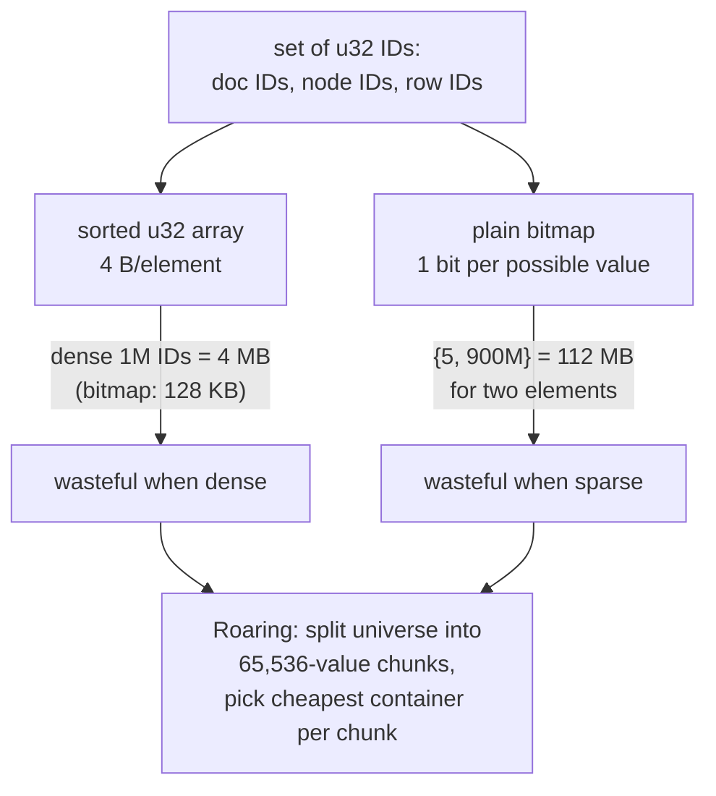
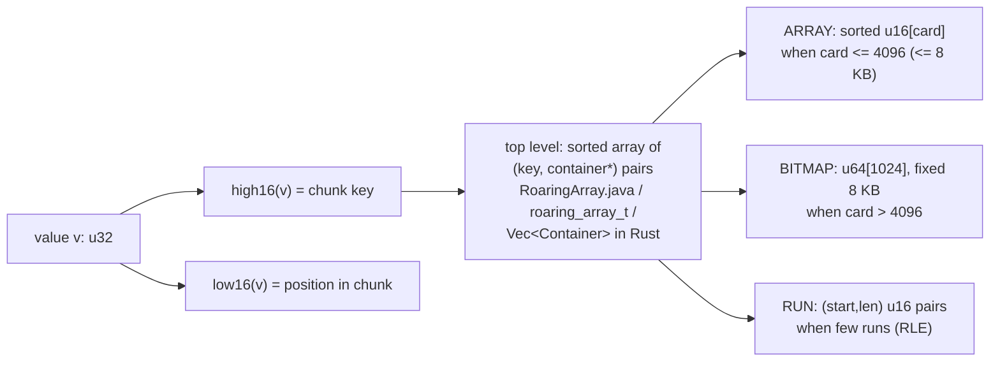
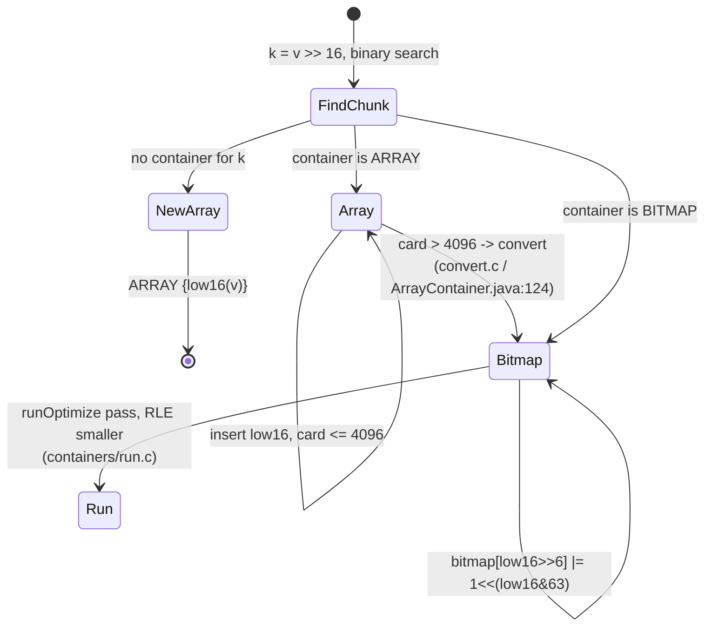
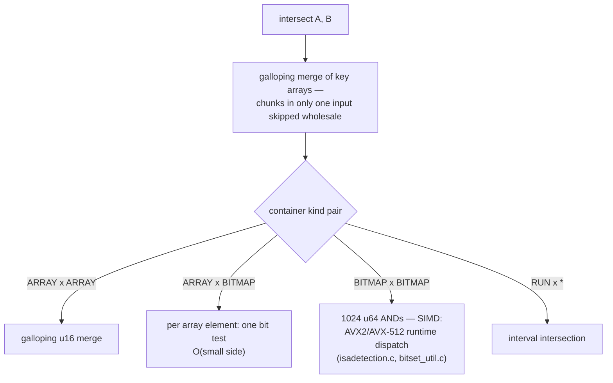
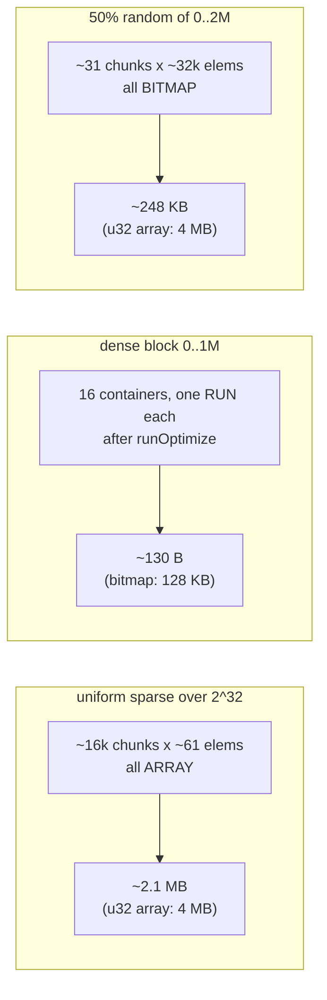
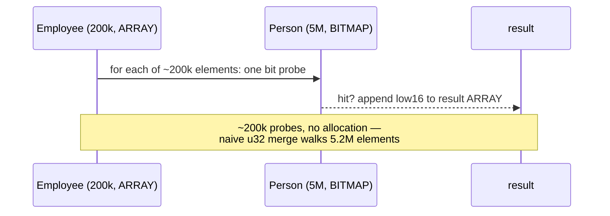
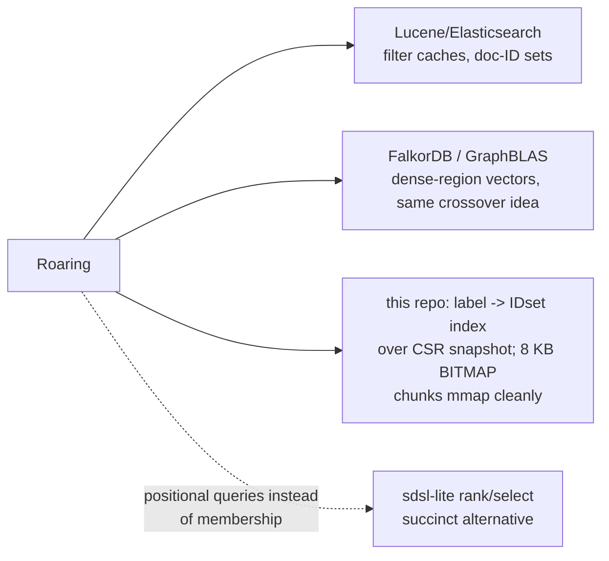
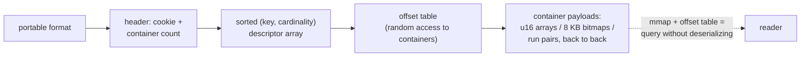

# Roaring Bitmap IDsets — Mermaid

| Field | Value |
| --- | --- |
| Kind | storage |
| Pair | `roaring-bitmap-idsets-ascii.md` / `roaring-bitmap-idsets-mermaid.md` |
| One-line job | Store sets of 32-bit IDs in a form that is simultaneously small, fast to intersect, and fast to iterate — a different physical container per 65,536-value chunk |

## 1. Why neither naive layout works

## 2. The two-level structure

The crossover 4096: array of 4096 u16 = 8 KB = the fixed bitmap size —
hard-coded as `DEFAULT_MAX_SIZE` in
`reference-repos-corpus/RoaringBitmap-src/roaringbitmap/src/main/java/org/roaringbitmap/ArrayContainer.java`
(line 28; upgrade at line 124).

## 3. add(v) state machine

## 4. intersect(A, B) — kind-pair dispatch

The dispatch table is the heart of every implementation: CRoaring's
`containers/mixed_*.c` family, Java's `Container` subclasses, Rust's
`ops.rs` over the container enum.

## 5. Worked example — three shapes, three costs

1,000,000 IDs stored, three distributions:

Same API, three physical layouts, each within ~2x of the entropy floor
for its shape.

## 6. Worked example — graph label intersection

`MATCH (n:Person:Employee)`: Person = 5M dense IDs (BITMAP chunks),
Employee = 200k sparse IDs (ARRAY chunks).

Cost follows the SMALL side, not the universe — that is the asymmetric
(ARRAY, BITMAP) kernel's gift.

## 7. Corpus usage map

## 8. Serialization — why the format is the structure

Roaring's portable serialization is essentially the in-memory layout
written out — which is why the format is interoperable across the C,
Java, and Rust implementations and why BITMAP containers can be
memory-mapped in place:

Cross-implementation compatibility is exercised in each repo's test
suites (`reference-repos-corpus/roaring-rs-src/roaring/src/bitmap/ops_with_serialized.rs`
even implements set operations directly against the serialized form —
the zero-copy endpoint of this design).

## 9. Citing repos

| Repo | Path | Role |
| --- | --- | --- |
| CRoaring | `reference-repos-corpus/CRoaring-src/src/containers` | three container kinds + convert.c crossover |
| CRoaring | `reference-repos-corpus/CRoaring-src/src/containers/mixed_intersection.c` | kind-pair kernels |
| CRoaring | `reference-repos-corpus/CRoaring-src/src/isadetection.c` | runtime SIMD dispatch |
| RoaringBitmap (Java) | `reference-repos-corpus/RoaringBitmap-src/roaringbitmap/src/main/java/org/roaringbitmap/ArrayContainer.java` | DEFAULT_MAX_SIZE=4096 crossover |
| RoaringBitmap (Java) | `reference-repos-corpus/RoaringBitmap-src/roaringbitmap/src/main/java/org/roaringbitmap/RoaringArray.java` | top-level key→container array |
| roaring-rs | `reference-repos-corpus/roaring-rs-src/roaring/src/bitmap/container.rs` | Rust container enum |
| roaring-rs | `reference-repos-corpus/roaring-rs-src/roaring/src/bitmap/ops.rs` | Rust set-op dispatch |

## 10. Cross-references

- Sibling patterns: posting-list compression (Roaring vs delta-varint
  blocks); CSR adjacency layout (shared dense-ID prerequisite).
- 202606 digest overlap: none — bitmap kernels were a gap closed in
  corpus research round 3.
