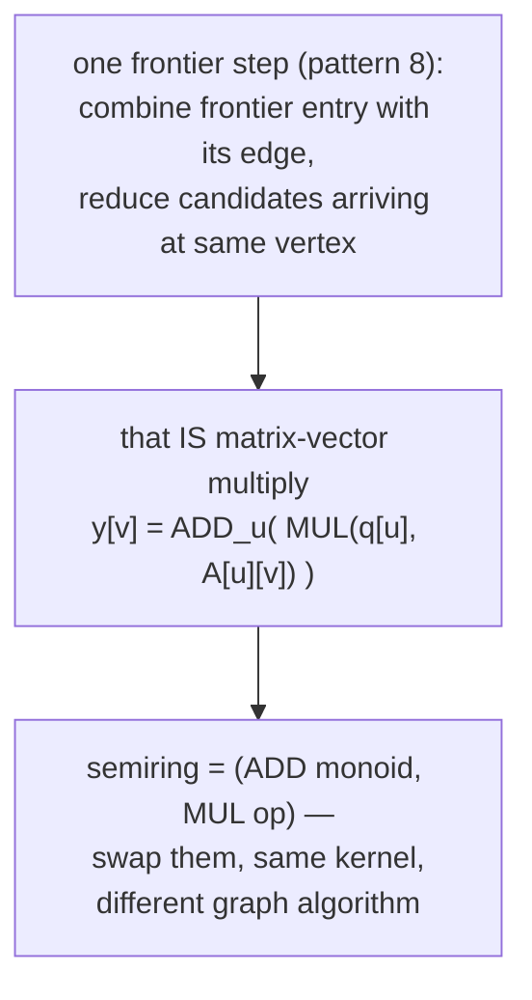
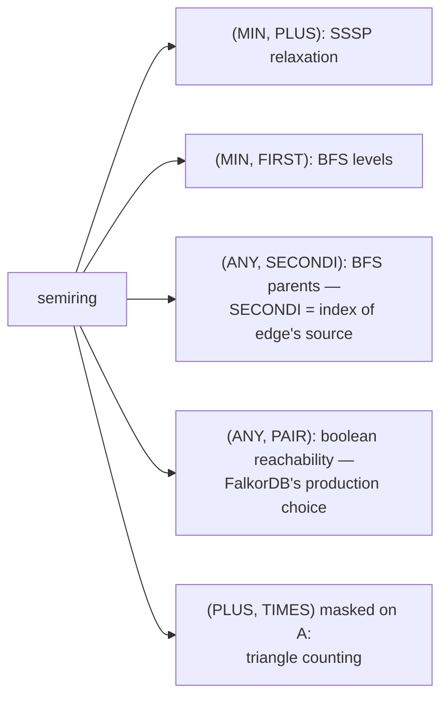
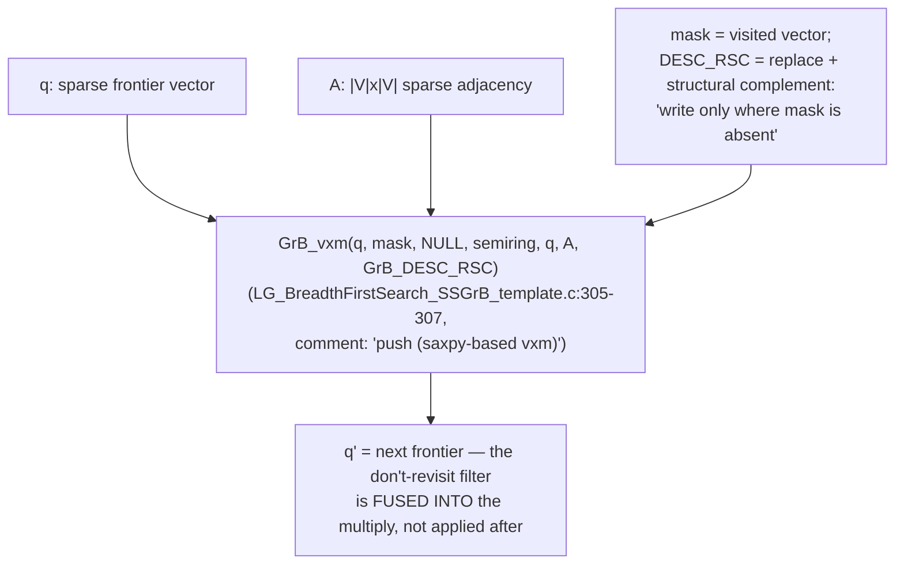
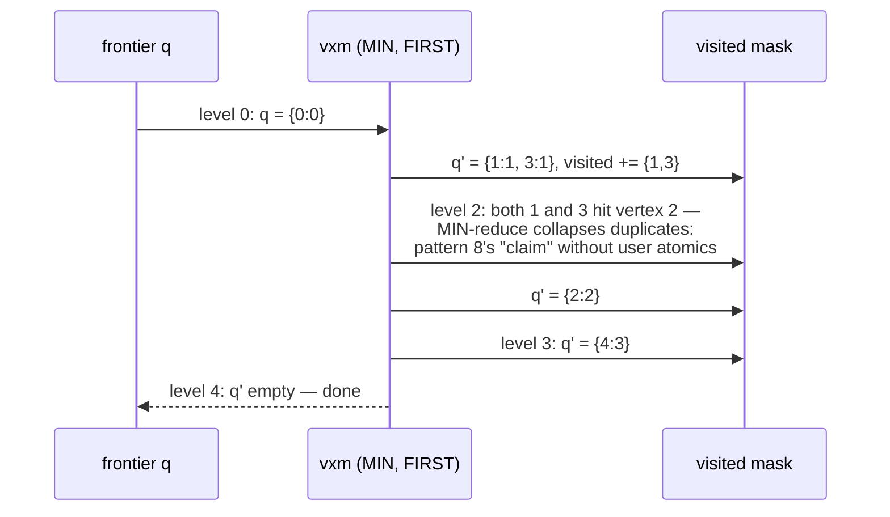
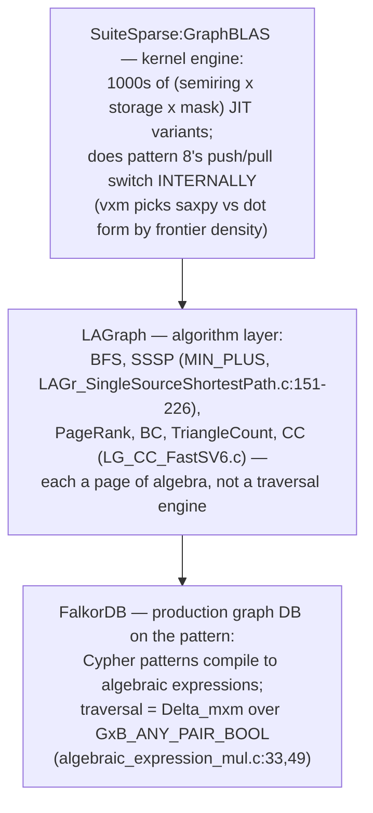
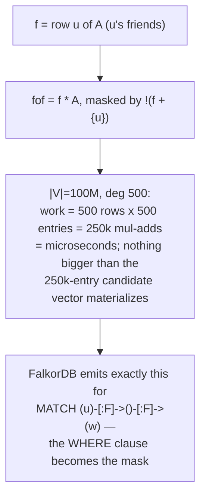
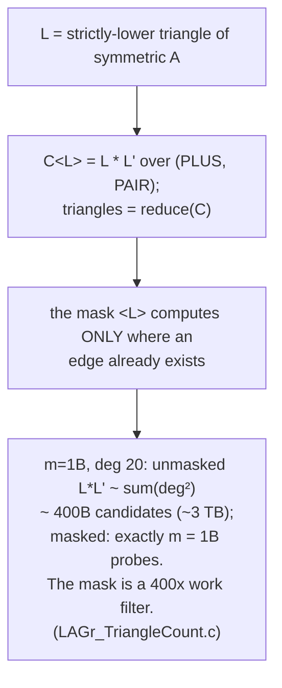
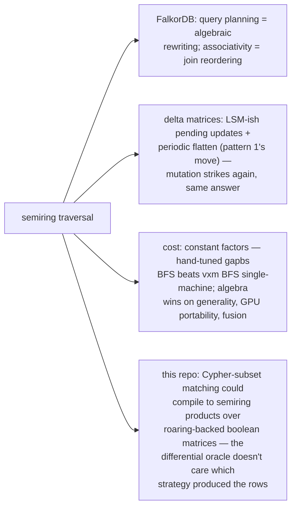
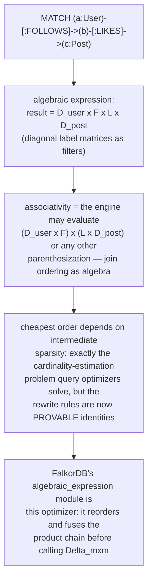
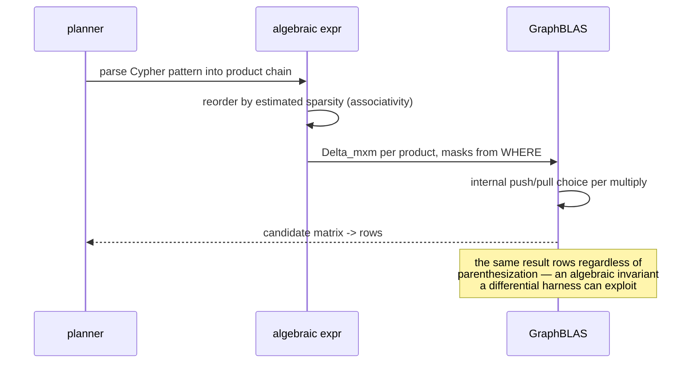

# Semiring Matrix Traversal — Mermaid

| Field | Value |
| --- | --- |
| Kind | algorithm |
| Pair | `semiring-matrix-traversal-ascii.md` / `semiring-matrix-traversal-mermaid.md` |
| One-line job | Replace the traversal loop with sparse matrix-vector multiply over a custom (+,x) algebra — pick the semiring and one kernel becomes BFS, SSSP, reachability, or triangle counting |

## 1. The generalization

## 2. The semiring table

The GraphBLAS thesis: graphs ARE sparse matrices (pattern 7 showed
the layouts are identical), so traversal is algebra and decades of
sparse-kernel engineering apply free.

## 3. One BFS step, exactly as LAGraph writes it

## 4. BFS trace: 0->1, 0->3, 1->2, 3->2, 2->4, source 0

For parents, swap in `GxB_ANY_SECONDI` (template:140-143): MUL yields
the frontier vertex's index, ADD takes ANY winner — "any parent is
fine" as algebra.

## 5. The three witnesses, three layers

## 6. Worked example — 2-hop friends-of-friends

## 7. Worked example — masked triangle counting

## 8. Inheritance and the honest cost

## 8b. Multi-hop paths as matrix products

The pattern's deepest payoff: a whole path pattern is ONE algebraic
expression, and the engine gets to choose evaluation order.

## 9. Citing repos

| Repo | Path | Role |
| --- | --- | --- |
| LAGraph | `reference-repos-corpus/LAGraph-src/src/algorithm/template/LG_BreadthFirstSearch_SSGrB_template.c` | BFS as masked vxm (305-307), ANY_SECONDI parents (140-143) |
| LAGraph | `reference-repos-corpus/LAGraph-src/src/algorithm/LAGr_SingleSourceShortestPath.c` | SSSP over MIN_PLUS (151-226) |
| LAGraph | `reference-repos-corpus/LAGraph-src/src/algorithm/LAGr_TriangleCount.c` | masked-multiply triangles |
| GraphBLAS | `reference-repos-corpus/GraphBLAS-src` | SuiteSparse kernel engine, internal push/pull |
| falkordb | `reference-repos-competitors/falkordb-src/src/arithmetic/algebraic_expression/algebraic_expression_mul.c` | production Delta_mxm over ANY_PAIR_BOOL (33, 49) |
| falkordb | `reference-repos-competitors/falkordb-src/src/graph/delta_matrix/delta_mxm.c` | delta-matrix multiply (mutability layer) |

## 10. Cross-references

- Sibling patterns: `csr-adjacency-layout` (the matrix IS that
  layout); `frontier-pushpull-switching` (reappears inside vxm);
  `lsm-compaction-tradeoff` (delta matrices); `roaring-bitmap-idsets`
  (boolean matrices over compressed bitmaps).
- Next in category: connected-components hooking/shortcutting
  (FastSV) and PageRank iteration structure.
- 202606 digest overlap: digests named GraphBLAS as FalkorDB's
  engine; this pair adds the semiring table, mask semantics, and the
  masked-triangle arithmetic.
