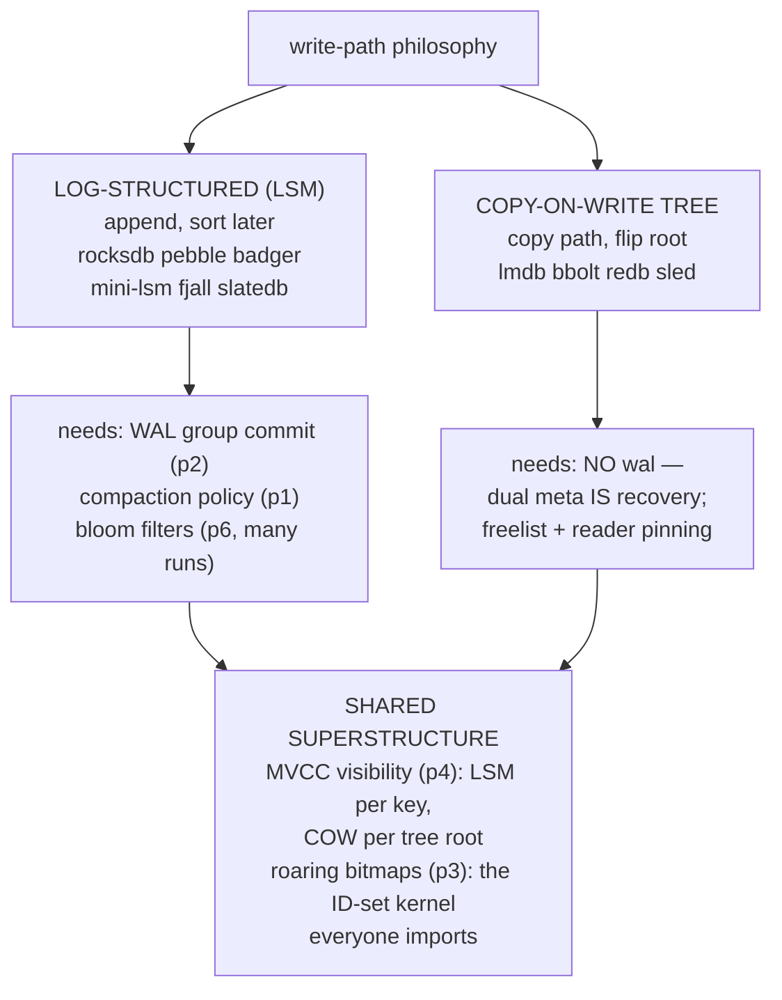
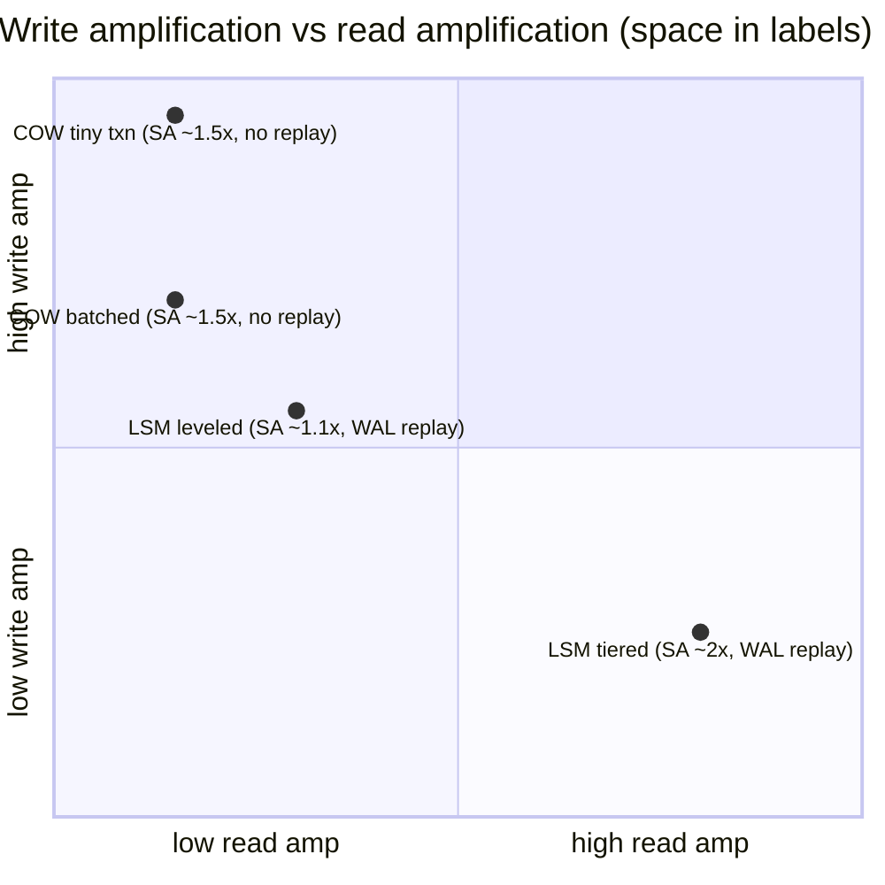
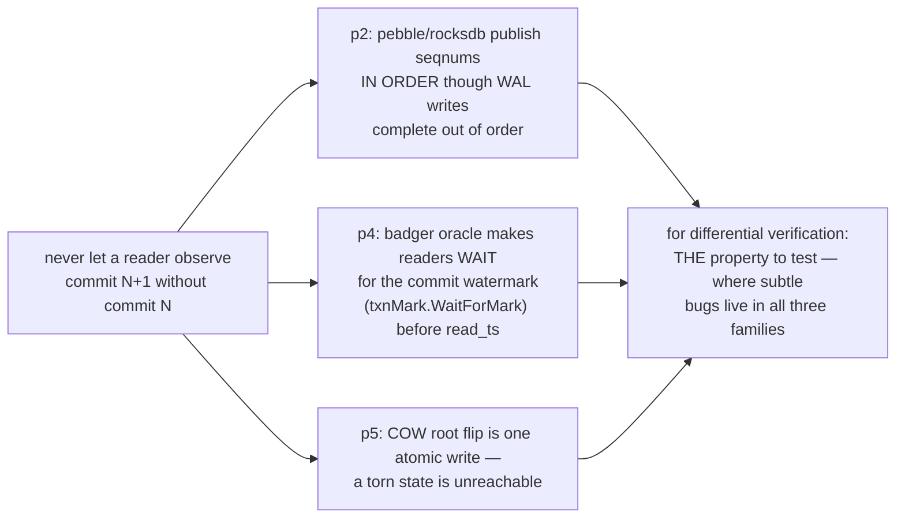
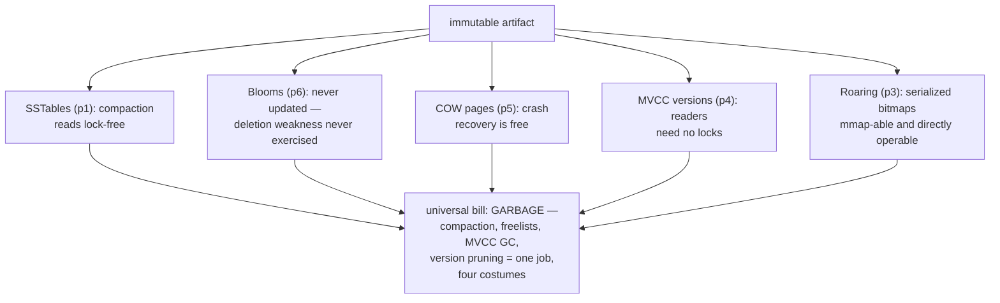
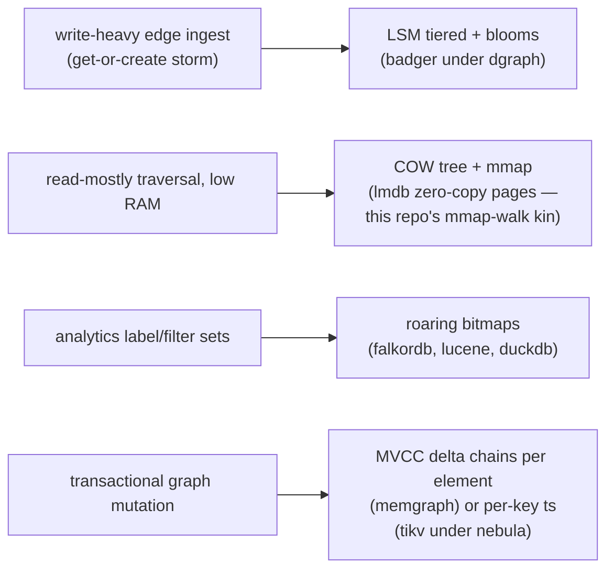
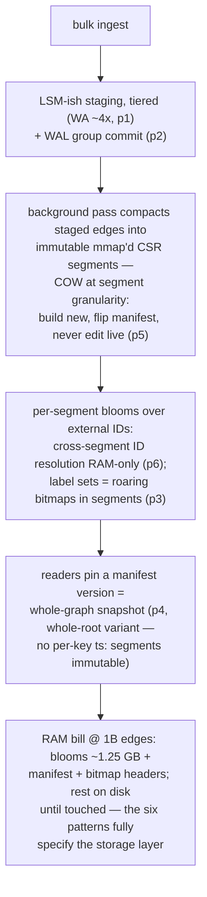
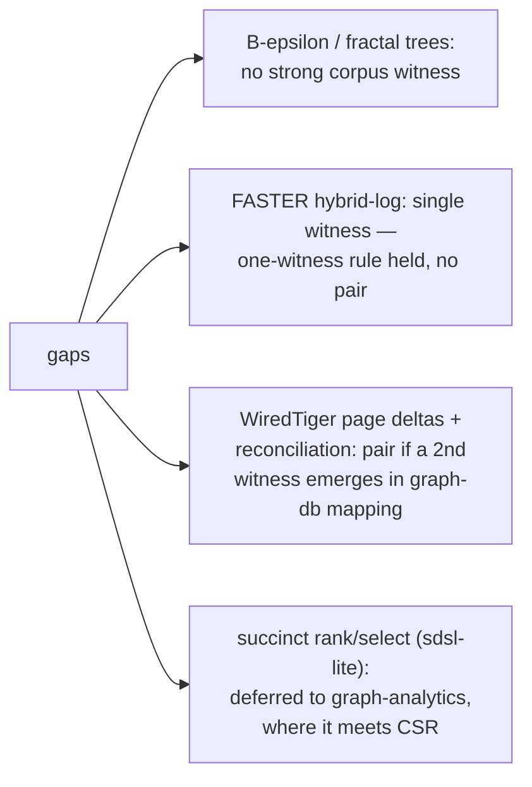
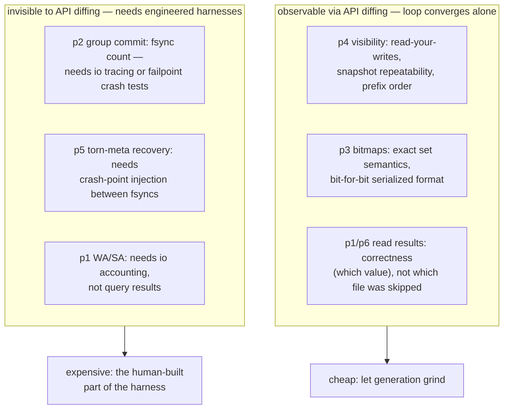

# Storage-Engine Pattern Synthesis — Mermaid

| Field | Value |
| --- | --- |
| Kind | category synthesis (storage) |
| Covers | patterns 1-6: LSM compaction, WAL group commit, roaring bitmaps, MVCC visibility, COW trees, Bloom filters |
| One-line thesis | Every storage engine is one answer to the same question — how do you make disk look atomic, versioned, and fast when it is none of those things — and the six patterns are the recurring answer parts |

## 1. The category in one picture

## 2. The grand tradeoff

Numbers from patterns 1 and 5 worked examples (leveled ~17x WA, tiered
~4x, COW tiny-txn ~200x, COW batched ~40x). No engine escapes the
WA/RA/SA triangle — each picks a corner, then softens the abandoned
corners with the shared tools (blooms, bitmaps, MVCC).

## 3. One invariant, three appearances

**Visibility must be a prefix of commit order** — independently
rediscovered by three mechanisms:

## 4. What immutability buys, four ways

## 5. Which engine for which graph job

## 6. Worked example — composing the patterns into one design

Target: billion-edge graph, 8 GB RAM, read-dominant, bulk ingest.

## 7. Honest gaps (not covered)

## 8. The category as a verification target

For the convergence-loop thesis (docs_PRD06 README): if generated code
must match a storage engine, these are the observable surfaces per
pattern — what a differential harness can and cannot see:

This split — which pattern properties are free to verify and which
need instrumentation — is the category's direct payment toward the
rewrite program.

## 9. Citing repos (category roll-up)

| Repo | Patterns witnessed | Signature path |
| --- | --- | --- |
| rocksdb | 1, 2, 4, 6 | `reference-repos-corpus/rocksdb-src/db/compaction/compaction_picker_level.cc` |
| pebble | 1, 2 | `reference-repos-corpus/pebble-src/commit.go` |
| mini-lsm | 1, 6 | `reference-repos-corpus/mini-lsm-src/mini-lsm/src/table/bloom.rs` |
| fjall lsm-tree | 1, 6 | `reference-repos-corpus/lsm-tree-src/src/table/filter/blocked_bloom` |
| slatedb | 1, 2 | `reference-repos-corpus/slatedb-src/slatedb/src/wal_buffer.rs` |
| badger | 4, 6 | `reference-repos-corpus/badger-src/txn.go` |
| toydb | 4 | `reference-repos-corpus/toydb-src/src/storage/mvcc.rs` |
| tikv | 4 | `reference-repos-corpus/tikv-src/components/engine_traits/src/mvcc_properties.rs` |
| lmdb | 5 | `reference-repos-corpus/lmdb-src/libraries/liblmdb/mdb.c` |
| bbolt | 5 | `reference-repos-corpus/bbolt-src/db.go` |
| redb | 5 | `reference-repos-corpus/redb-src/src/tree_store/page_store/header.rs` |
| sled | 5 | `reference-repos-corpus/sled-src/src/flush_epoch.rs` |
| CRoaring | 3 | `reference-repos-corpus/CRoaring-src/src/containers` |
| roaring-rs | 3 | `reference-repos-corpus/roaring-rs-src/roaring/src/bitmap/container.rs` |
| sqlite | 2 | `reference-repos-corpus/sqlite-src/src/wal.c` |
| turso | 2 | `reference-repos-corpus/turso-src/core/storage/wal.rs` |

## 10. Cross-references

- Pattern pairs 1-6 in `pattern-index.md`.
- Next category (graph-analytics): CSR layout, rank/select, frontier
  management — the structures these engines store.
