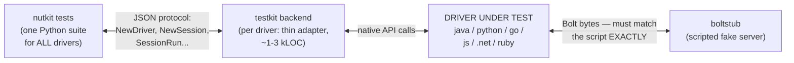
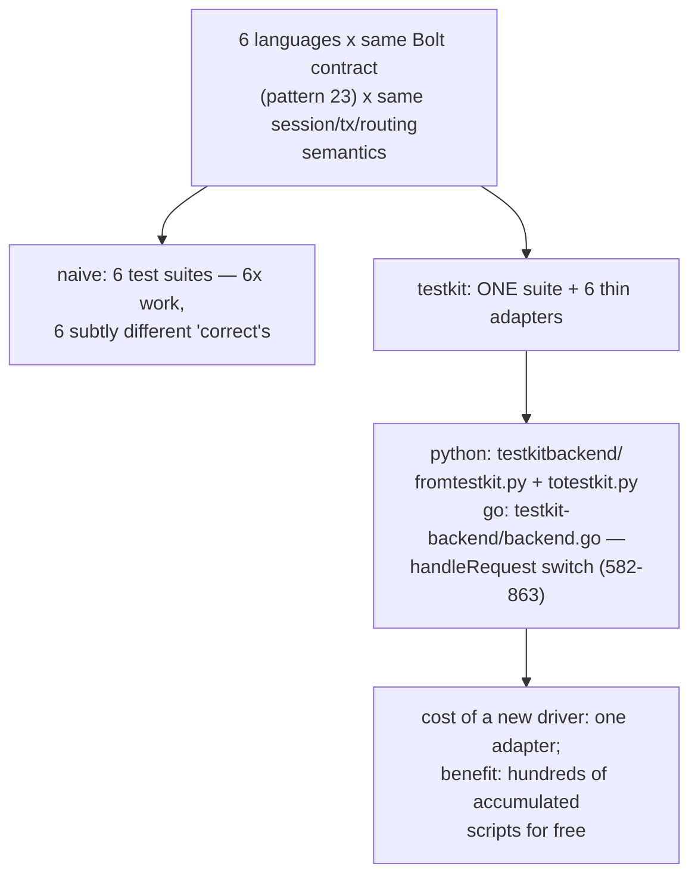
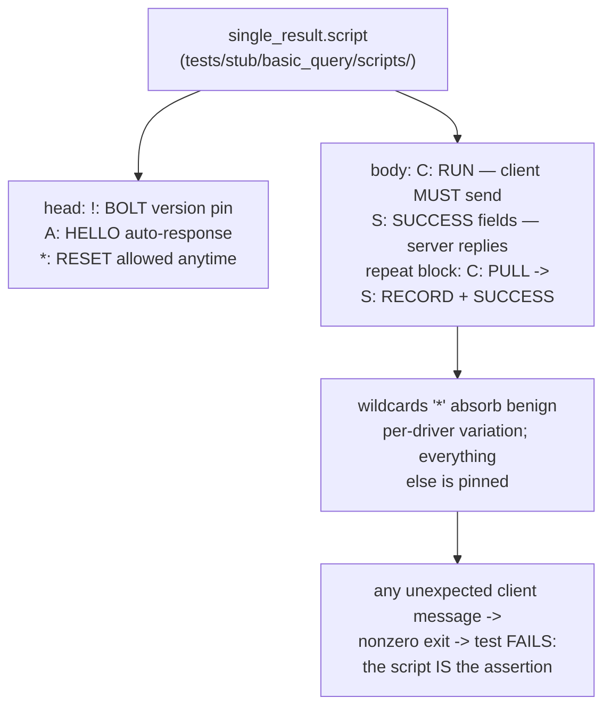
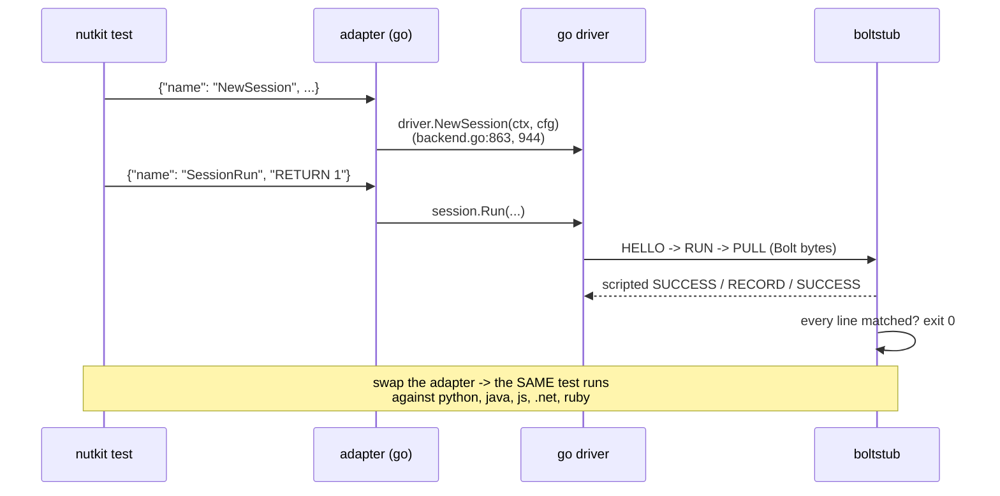
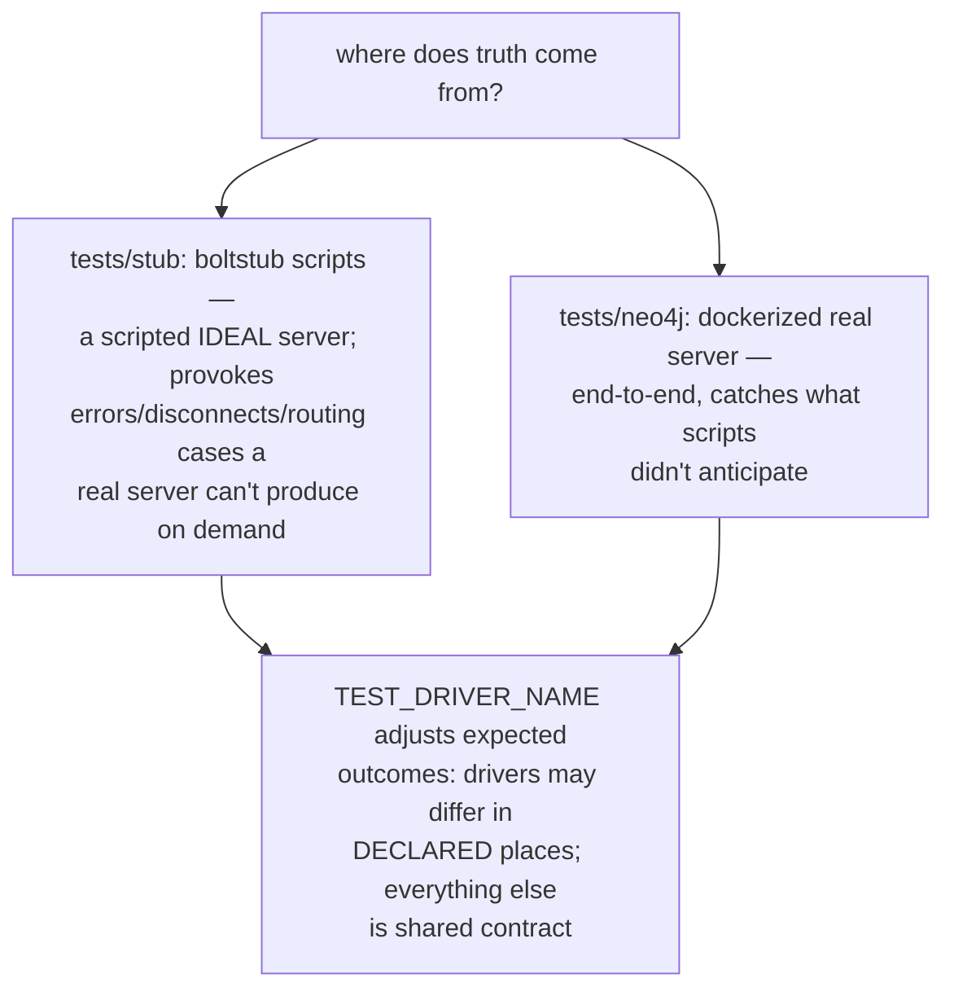
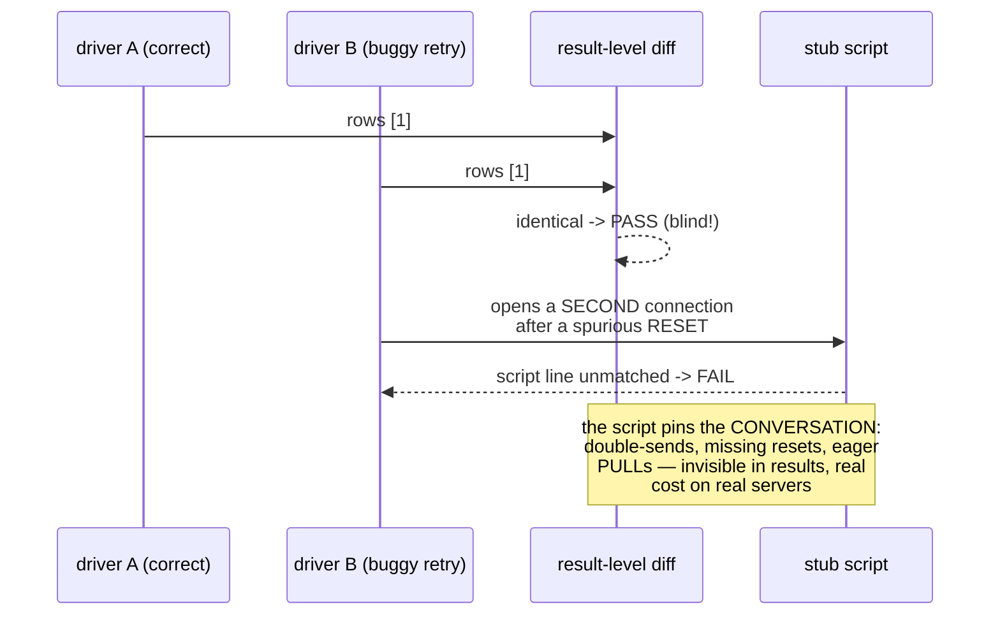
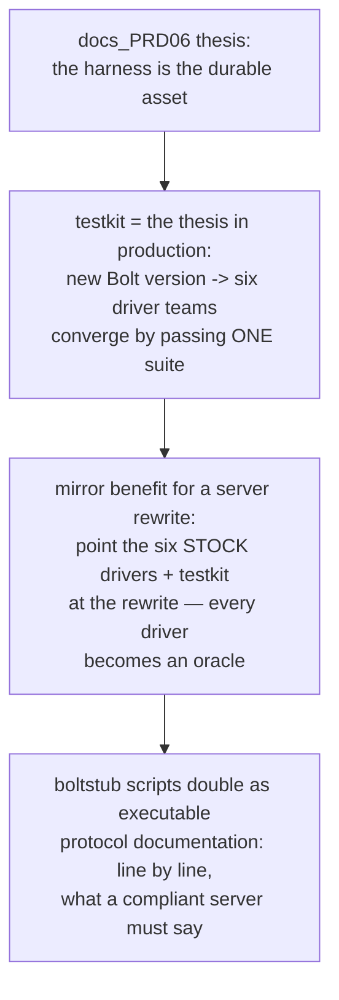
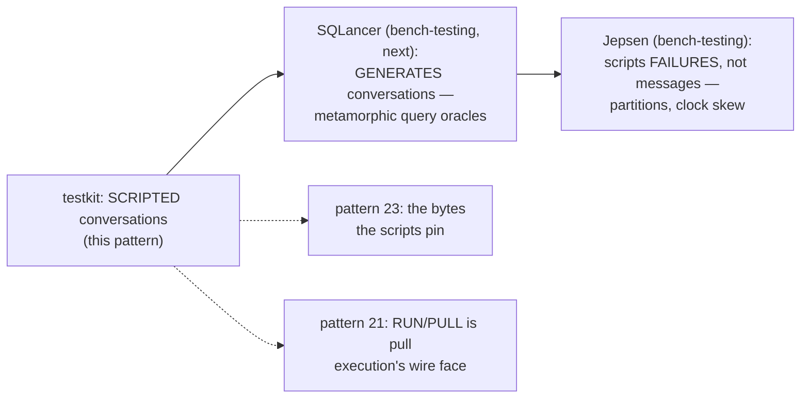
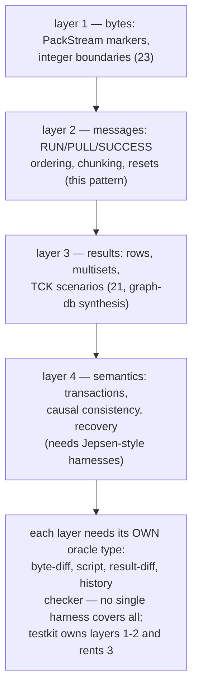
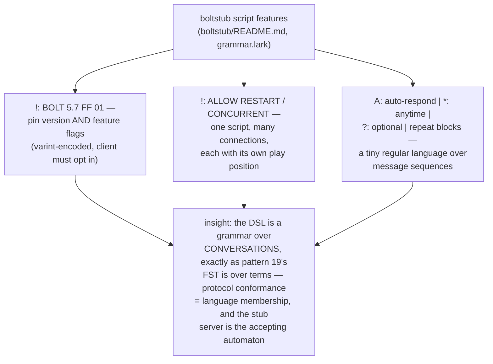

# Stub Script Conformance — Mermaid

| Field | Value |
| --- | --- |
| Kind | execution |
| Pair | `stub-script-conformance-ascii.md` / `stub-script-conformance-mermaid.md` |
| One-line job | Testkit's architecture for testing six driver codebases with ONE test suite: tests speak a JSON protocol to a thin per-driver backend, and a scripted fake server (boltstub) plays exact Bolt byte conversations — conformance testing industrialized |

## 1. The four boxes

## 2. The economics

## 3. The stub script DSL

## 4. One test through six drivers

## 5. The two oracle modes

## 6. What scripts catch that results can't

## 7. The corpus's verification keystone

## 8. Corpus kin

## 9. The layered contract picture

## 9b. Anatomy of a script feature set

## 10. Citing repos

| Repo | Path | Role |
| --- | --- | --- |
| testkit | `reference-repos-neo4j-family/neo4j-testkit-src/boltstub/README.md` | stub-script DSL spec |
| testkit | `reference-repos-neo4j-family/neo4j-testkit-src/tests/stub/basic_query/scripts/single_result.script` | example scripted conversation |
| testkit | `reference-repos-neo4j-family/neo4j-testkit-src/nutkit/protocol/__init__.py` | frontend JSON protocol |
| python-driver | `reference-repos-neo4j-family/neo4j-python-driver-src/testkitbackend/fromtestkit.py` | adapter: JSON -> native API |
| go-driver | `reference-repos-neo4j-family/neo4j-go-driver-src/testkit-backend/backend.go` | adapter dispatch (582-863) |

## 11. Cross-references

- Sibling patterns: `packstream-wire-encoding` (23),
  `pull-operator-pipeline` (21).
- The rewrite play: adopt testkit BEFORE writing the server —
  its scripts are a pre-paid, behavior-complete, vendor-
  maintained spec of "speaks Bolt correctly".
- Next: neo4j-ecosystem synthesis, then dataflow-compute and
  bench-testing to close the corpus.
