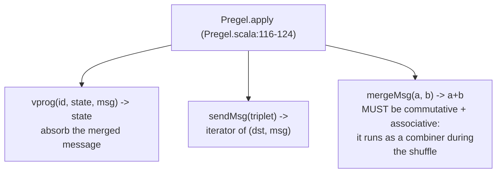
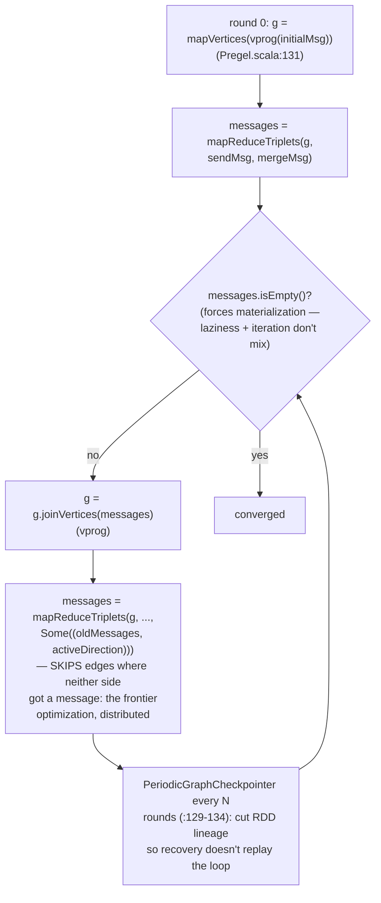
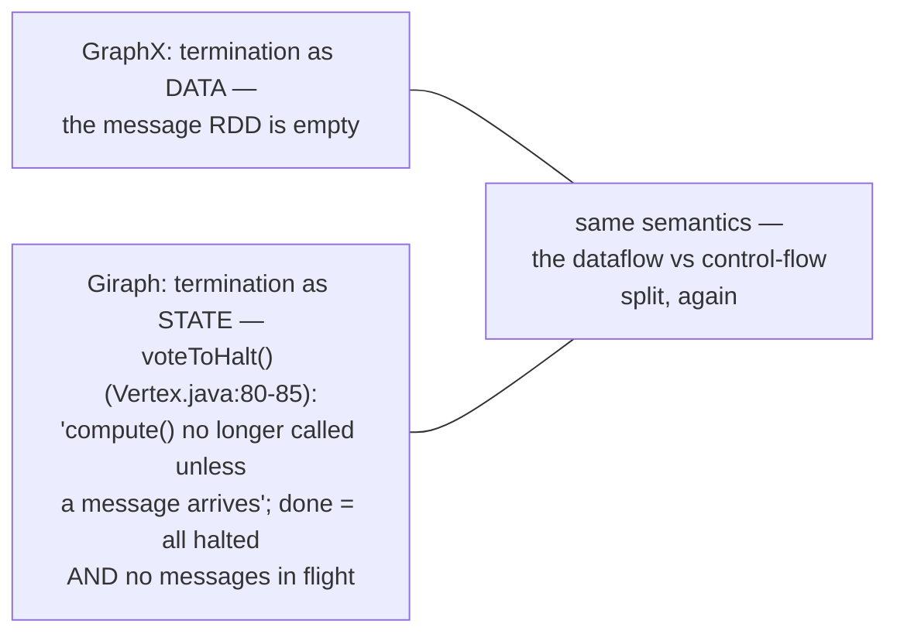
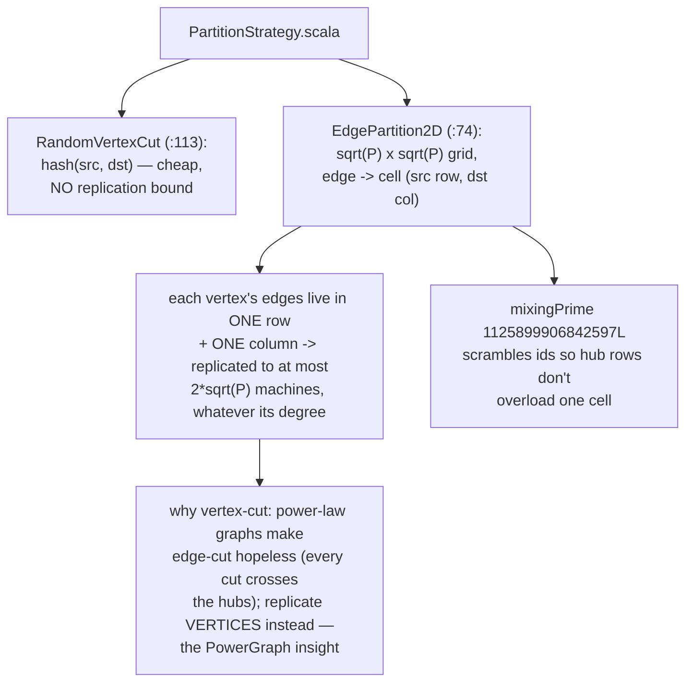
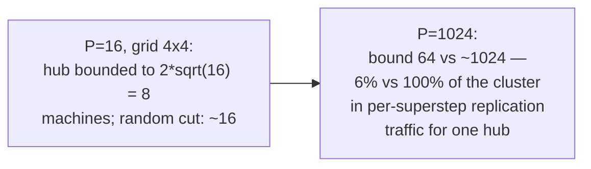
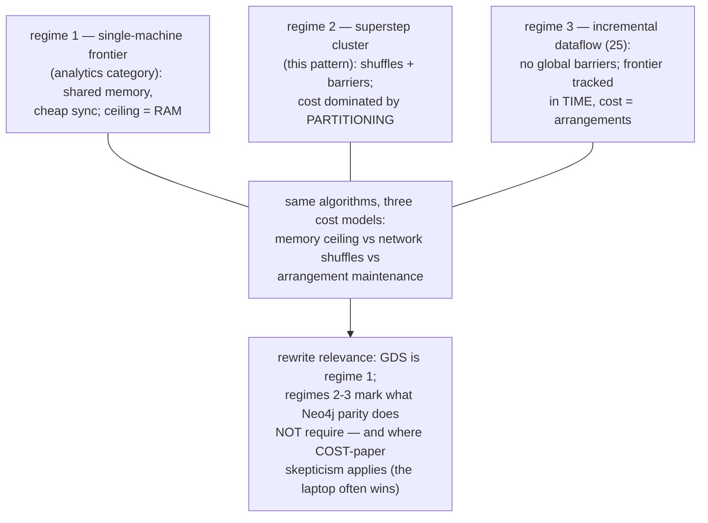
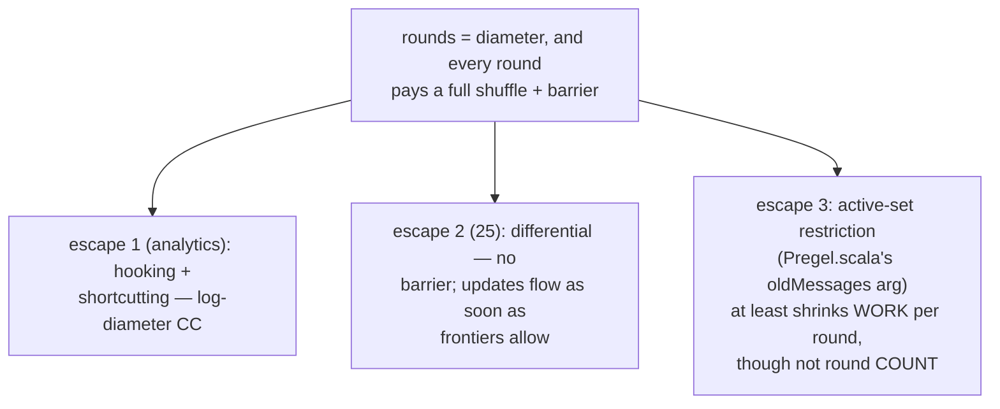
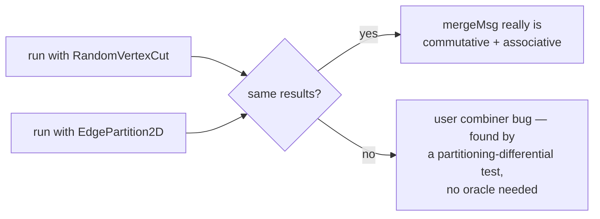
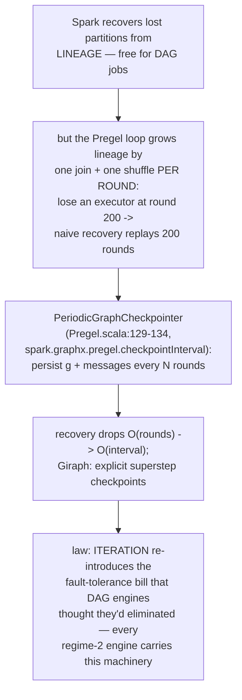

# Superstep Message Convergence — Mermaid

| Field | Value |
| --- | --- |
| Kind | execution |
| Pair | `superstep-message-convergence-ascii.md` / `superstep-message-convergence-mermaid.md` |
| One-line job | Distributed Pregel at production scale: a driver loop alternates join-vertices and send-messages rounds, vertices vote to halt, termination is "no messages left", and a vertex-cut partitioning bounds how many machines each vertex is replicated to |

## 1. The contract: three functions



## 2. The driver loop



## 3. Halting: two encodings, one semantics



## 4. Vertex-cut partitioning



## 5. Worked example — replication arithmetic



## 6. Worked example — CC by min-label, path a-b-c-d

```mermaid
sequenceDiagram
    participant G as graph (labels)
    participant S as shuffle (messages, merged by min)
    Note over G: start {a:1, b:2, c:3, d:4}
    G->>S: round 1 — all edges send
    S->>G: {a:1, b:1, c:2, d:3}
    G->>S: round 2 — only edges next to<br/>CHANGED vertices are active
    S->>G: {a:1, b:1, c:1, d:2}
    G->>S: round 3
    S->>G: {a:1, b:1, c:1, d:1}
    Note over S: round 4 — no messages -> exit.<br/>rounds = diameter; each round = one<br/>shuffle + one barrier
```

## 7. The three execution regimes



## 8. Why high diameter hurts — and the escape hatches



## 9. Determinism as a free test



## 9b. Failure recovery — lineage vs checkpoints



## 10. Citing repos

| Repo | Path | Role |
| --- | --- | --- |
| spark | `reference-repos-corpus/spark-src/graphx/src/main/scala/org/apache/spark/graphx/Pregel.scala` | driver loop, active sets, checkpointing (116-163) |
| spark | `reference-repos-corpus/spark-src/graphx/src/main/scala/org/apache/spark/graphx/PartitionStrategy.scala` | vertex-cut strategies, 2D bound (74-140) |
| giraph | `reference-repos-corpus/giraph-src/giraph-core/src/main/java/org/apache/giraph/graph/Vertex.java` | voteToHalt contract (80-85) |

## 11. Cross-references

- Sibling patterns: `incremental-delta-iteration` (25),
  the analytics category's frontier/hooking patterns (regime 1
  versions), `graph-analytics-pattern-synthesis`.
- Papers ledger: Pregel, PowerGraph (vertex-cut), COST (the
  standing caution against cluster-first thinking).
- Amusing source note: PartitionStrategy.scala:40-70 contains
  the 2D-grid explanation as ASCII art IN the comments — the
  corpus documenting itself in this knowledgebase's own format.
- Next: bench-testing category, then the dataflow-compute
  synthesis closes batch 7.
- Reading order for this pattern: Pregel.scala top comment
  (PageRank example) first, then the loop body (:131-163),
  then PartitionStrategy.scala's grid comment; Giraph's
  Vertex.java last — it shows how small the user-facing
  contract really is (compute + voteToHalt).
- Terminology bridge: "superstep" = one barrier-to-barrier
  round; "combiner" = mergeMsg run shuffle-side; "active
  direction" = which endpoint's activity keeps an edge live;
  "vertex-cut" = partition edges, replicate vertices (the
  inverse of the edge-cut most textbooks draw first).
