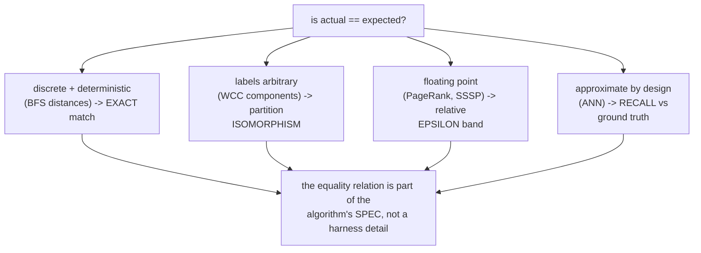
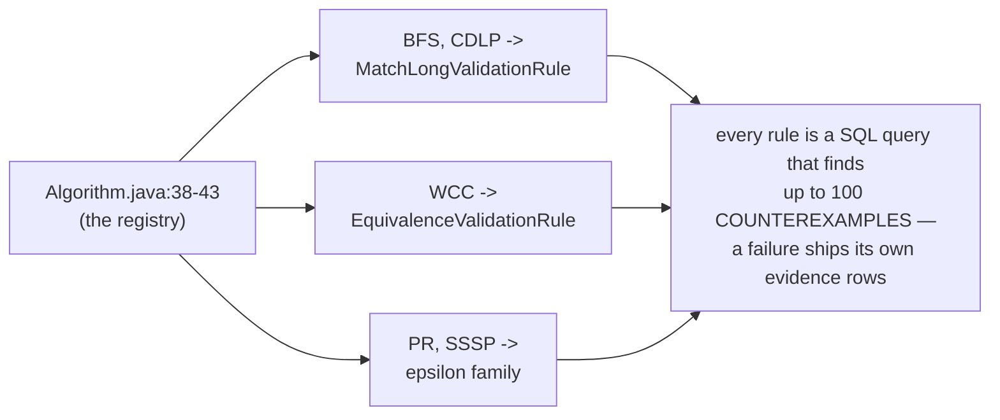
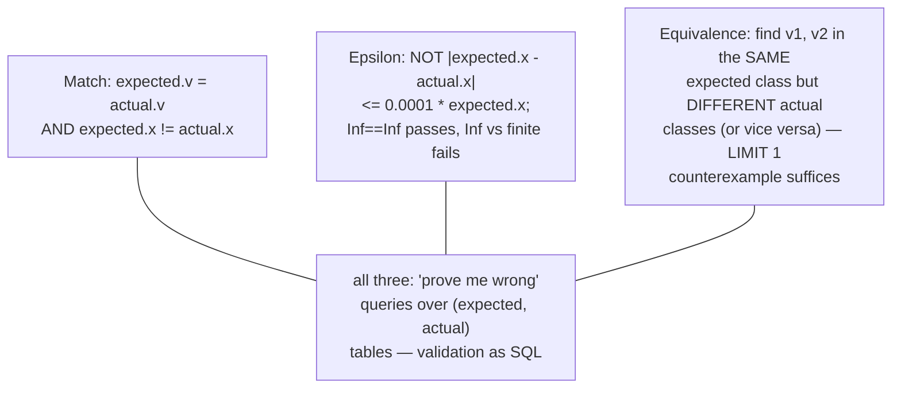
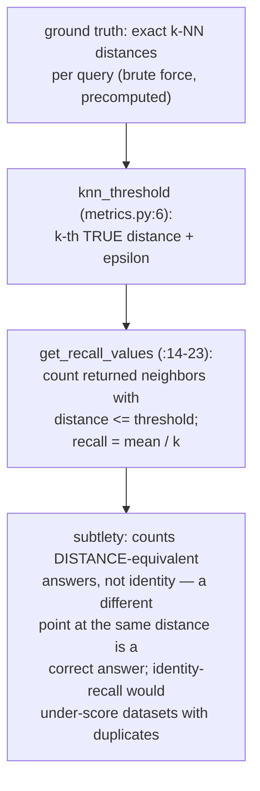
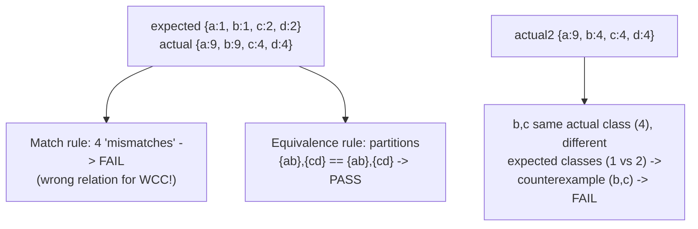
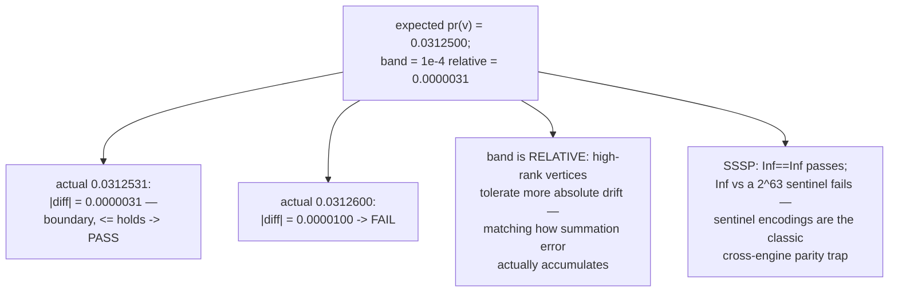
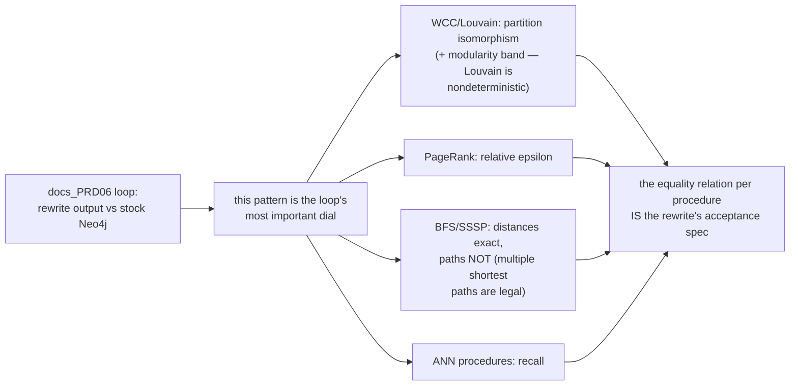
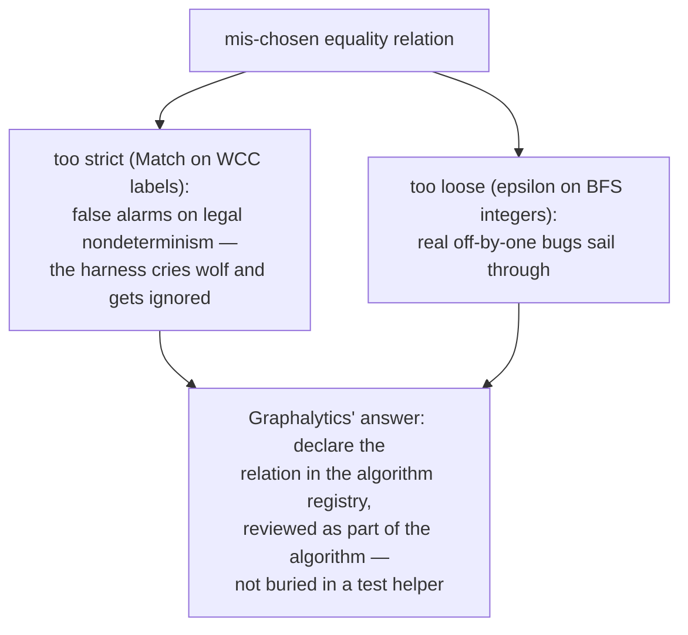
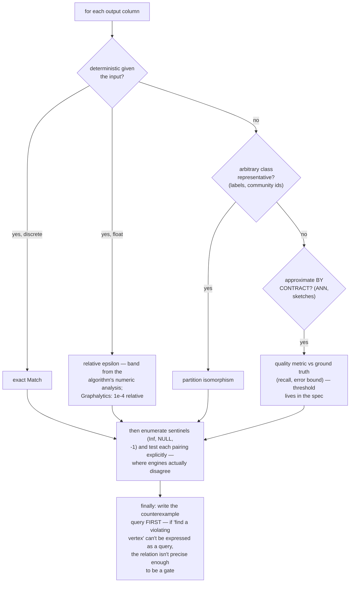

# Tolerant Equivalence Validation — Mermaid

| Field | Value |
| --- | --- |
| Kind | execution |
| Pair | `tolerant-equivalence-validation-ascii.md` / `tolerant-equivalence-validation-mermaid.md` |
| One-line job | Compare an implementation's output against a reference when naive equality is wrong: exact match for discrete outputs, epsilon bands for floating point, partition-isomorphism for label-renaming algorithms, and distance-threshold recall for approximate ANN — each algorithm gets the equality relation its mathematics permits |

## 1. Four questions hiding in "same answer"

## 2. Graphalytics: rules declared beside algorithms

## 3. The three rules as counterexample queries

## 4. ann-benchmarks: equality becomes recall

## 5. Worked example — WCC isomorphism

## 6. Worked example — epsilon band arithmetic

## 7. The dial on the convergence loop

## 8. Failure modes of getting the relation wrong

## 8b. Choosing the relation — a decision walk

## 9. Citing repos

| Repo | Path | Role |
| --- | --- | --- |
| ldbc_graphalytics | `reference-repos-corpus/ldbc_graphalytics-src/graphalytics-core/src/main/java/science/atlarge/graphalytics/domain/algorithms/Algorithm.java` | rule-per-algorithm registry (38-43) |
| ldbc_graphalytics | `reference-repos-corpus/ldbc_graphalytics-src/graphalytics-core/src/main/java/science/atlarge/graphalytics/validation/rule/EpsilonValidationRule.java` | relative 1e-4 band + Infinity cases |
| ldbc_graphalytics | `reference-repos-corpus/ldbc_graphalytics-src/graphalytics-core/src/main/java/science/atlarge/graphalytics/validation/rule/EquivalenceValidationRule.java` | partition isomorphism counterexample |
| ann-benchmarks | `reference-repos-corpus/ann-benchmarks-src/ann_benchmarks/plotting/metrics.py` | distance-threshold recall (6-23) |

## 10. Cross-references

- Sibling pattern: `metamorphic-oracle-testing` (27 — no
  reference at all); together they cover the oracle spectrum.
- Kin: `component-hooking-shortcutting` (WCC — the isomorphism
  case), the vector synthesis (recall as the quality axis),
  `graph-analytics-pattern-synthesis`.
- Papers ledger: LDBC Graphalytics; ann-benchmarks
  (Aumüller et al.).
- The moral, one line: "equal" is a per-algorithm design
  decision with a counterexample query attached — never a
  default `==`.
- The ASCII twin adds the same worked examples with full
  arithmetic and the sentence-form rule taxonomy.
- Terminology bridge: "validation rule" (Graphalytics) =
  "equality relation" (this doc) = "acceptance predicate"
  (spec language); "ground truth" (ann-benchmarks) = the
  reference outputs a rule compares against; "counterexample
  query" = the rule expressed as a search for violations
  rather than a proof of agreement.
- Implementation note: Graphalytics runs its rules as SQL over
  (expected, actual) vertex tables — meaning any engine that
  can dump `(vertex, value)` pairs gets validation for free,
  no per-engine checker code. The rules live in ~15 lines of
  SQL each; the taxonomy, not the code, is the asset.
- Nondeterminism boundary: these rules assume a deterministic
  reference. For Louvain-class algorithms even the reference
  varies run to run — there the relation must weaken further,
  to quality bands (modularity within delta of the reference's
  distribution), which is pattern 27's territory: an identity
  about the OUTPUT's quality, not its values.
