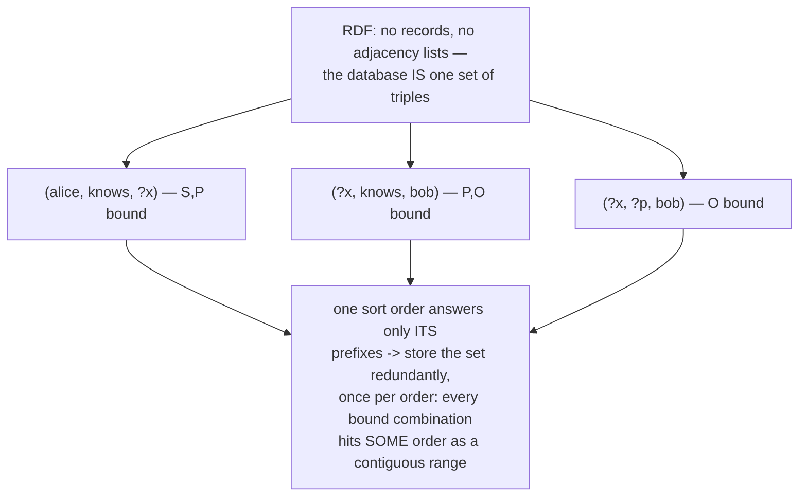
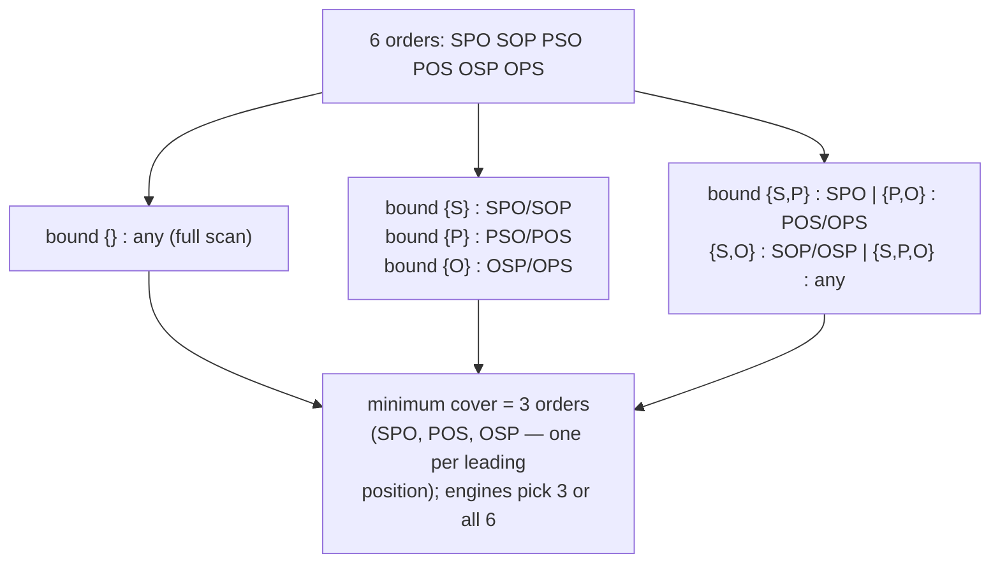
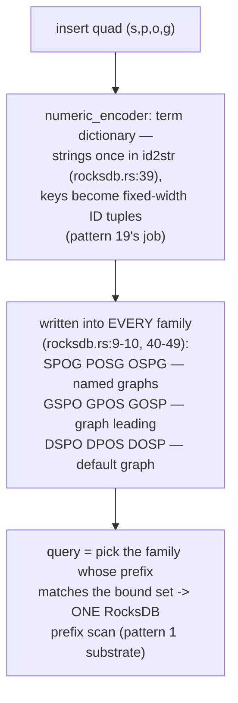
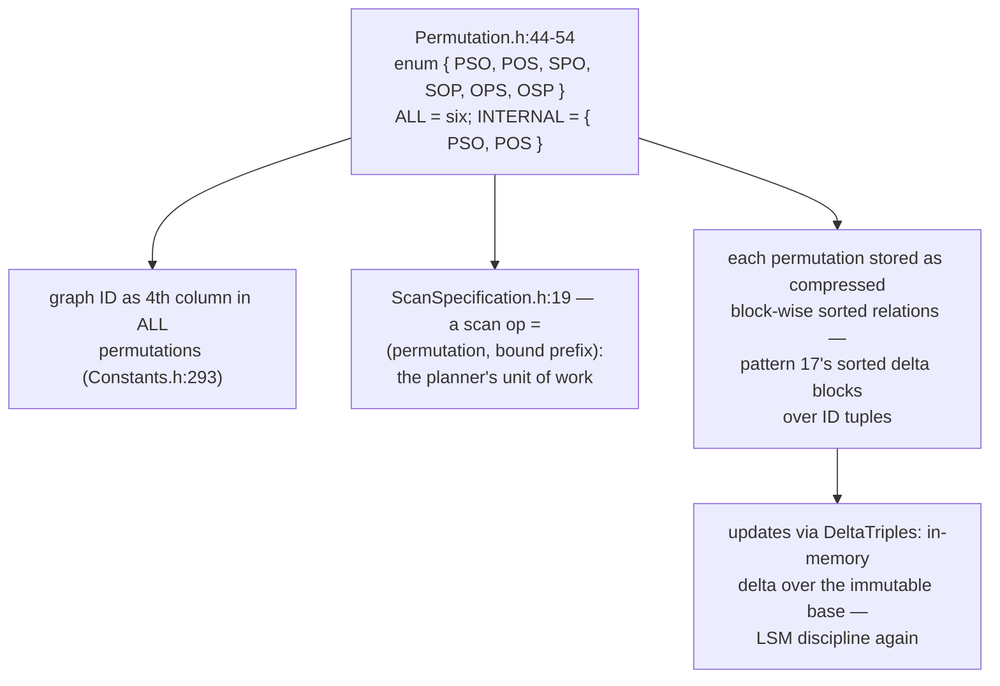
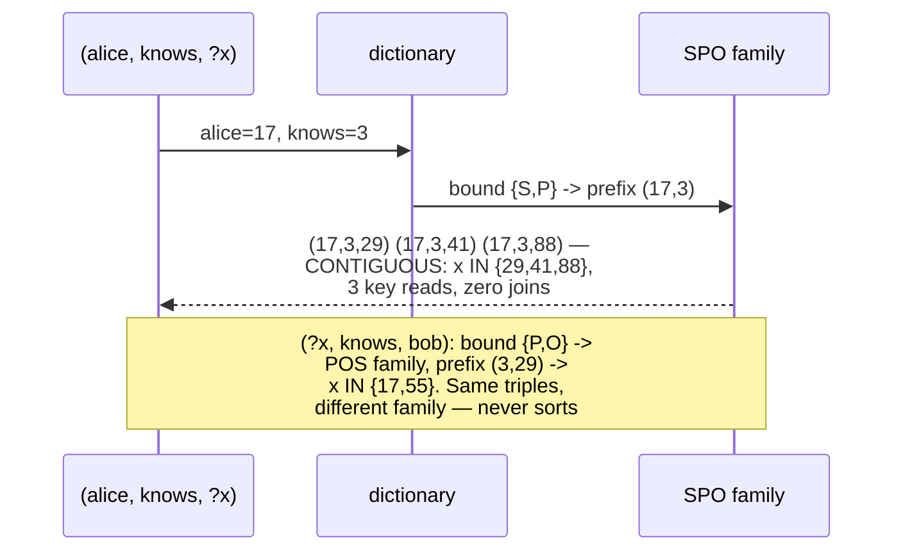
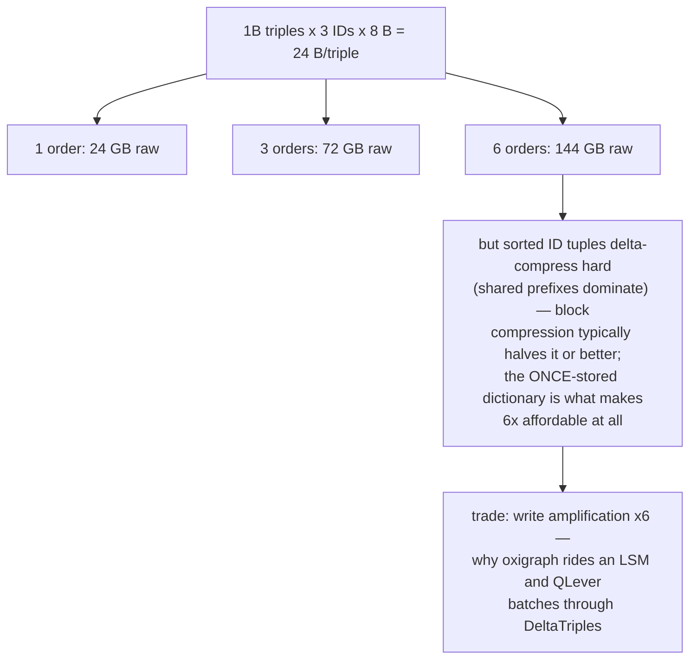
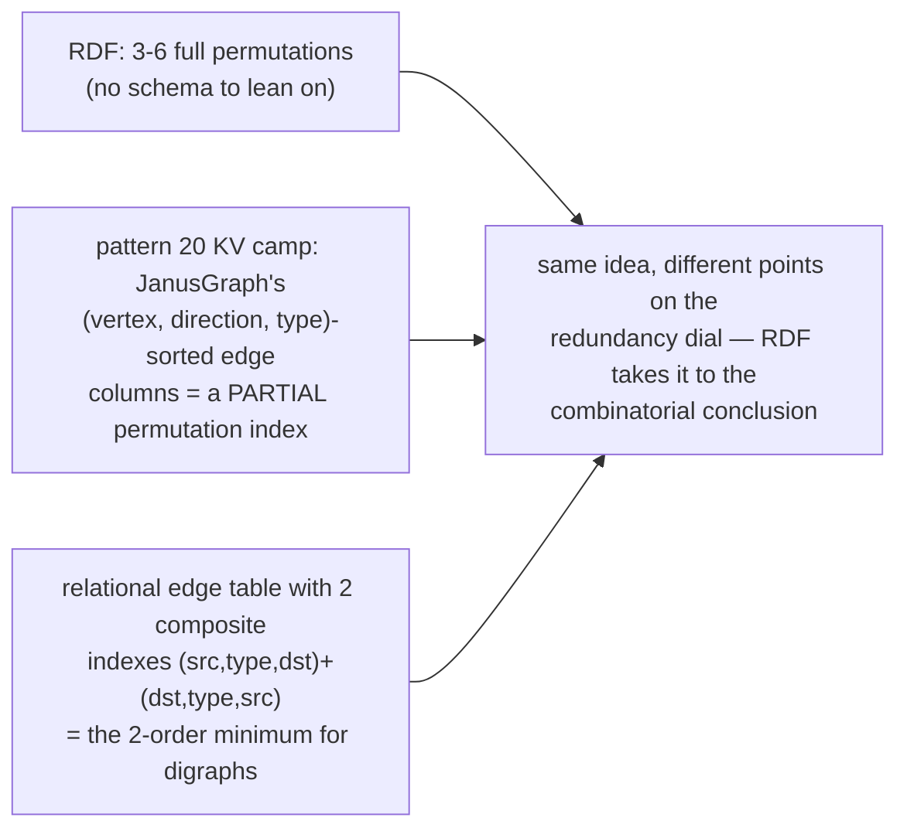
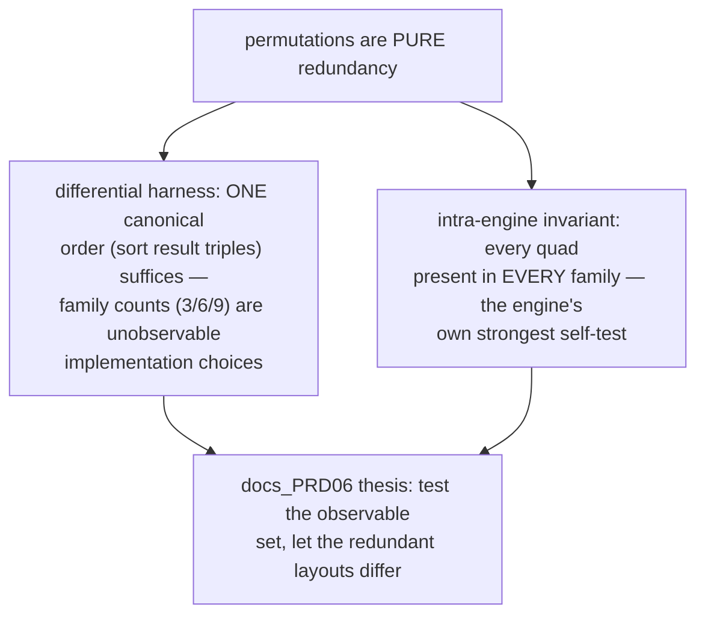
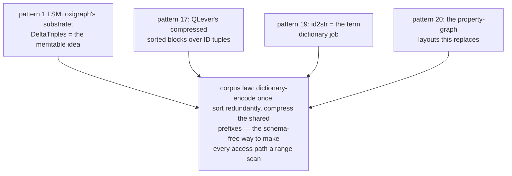

# Triple Permutation Indexing — Mermaid

| Field | Value |
| --- | --- |
| Kind | storage |
| Pair | `triple-permutation-indexing-ascii.md` / `triple-permutation-indexing-mermaid.md` |
| One-line job | Store the SAME set of (subject, predicate, object) triples in several sort orders, so that any query pattern with any bound/unbound combination becomes one sorted range scan — the RDF world's answer to adjacency |

## 1. The problem

## 2. The permutation lattice

## 3. Oxigraph: column families over an LSM

## 4. QLever: six permutations, compressed blocks

## 5. Pattern to range, worked

## 6. The redundancy bill

## 7. Property-graph mirror

## 8. The verification angle

## 9. Kinship map

## 10. Citing repos

| Repo | Path | Role |
| --- | --- | --- |
| oxigraph | `reference-repos-corpus/oxigraph-src/lib/oxigraph/src/storage/rocksdb.rs` | 9 permutation column families + encoders (9-10, 39-49) |
| oxigraph | `reference-repos-corpus/oxigraph-src/lib/oxigraph/src/storage/numeric_encoder.rs` | term dictionary encoding |
| qlever | `reference-repos-corpus/qlever-src/src/index/Permutation.h` | the six orders (44-54) |
| qlever | `reference-repos-corpus/qlever-src/src/index/ScanSpecification.h` | scan = (permutation, bound prefix) (19) |
| qlever | `reference-repos-corpus/qlever-src/src/global/Constants.h` | graph as 4th column everywhere (293) |

## 11. Cross-references

- Sibling patterns: see §9 kinship map.
- Contrast with pattern 20: property graphs pick ONE physical
  adjacency layout and optimize it; RDF engines refuse to pick
  and store all orders — schema freedom paid for in write
  amplification and disk.
- Paper trail: Hexastore (the 6-permutation paper) and RDF-3X
  (compressed permutation blocks) — queued in
  `research-papers-ledger.md`.
- Next in category: the graph-db category synthesis pair
  rolling up patterns 20-22.
