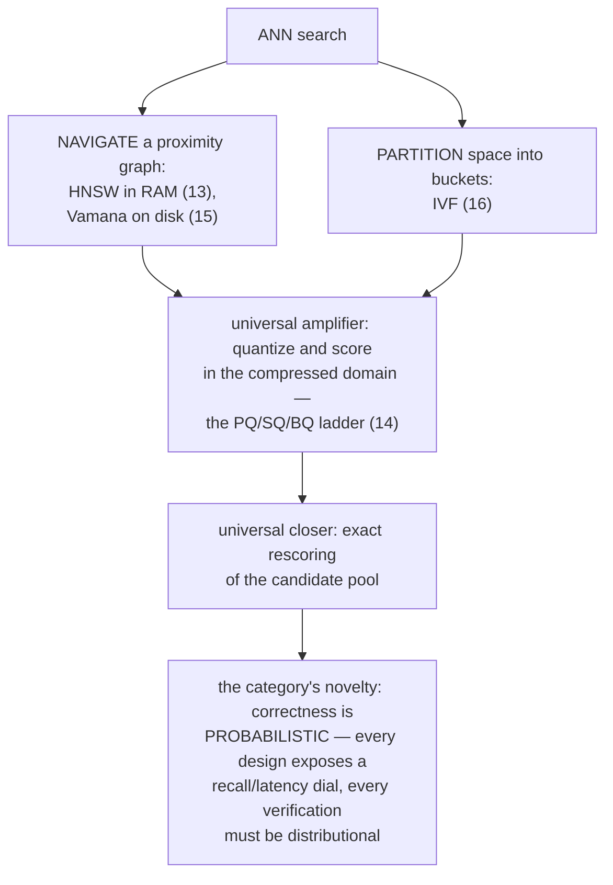
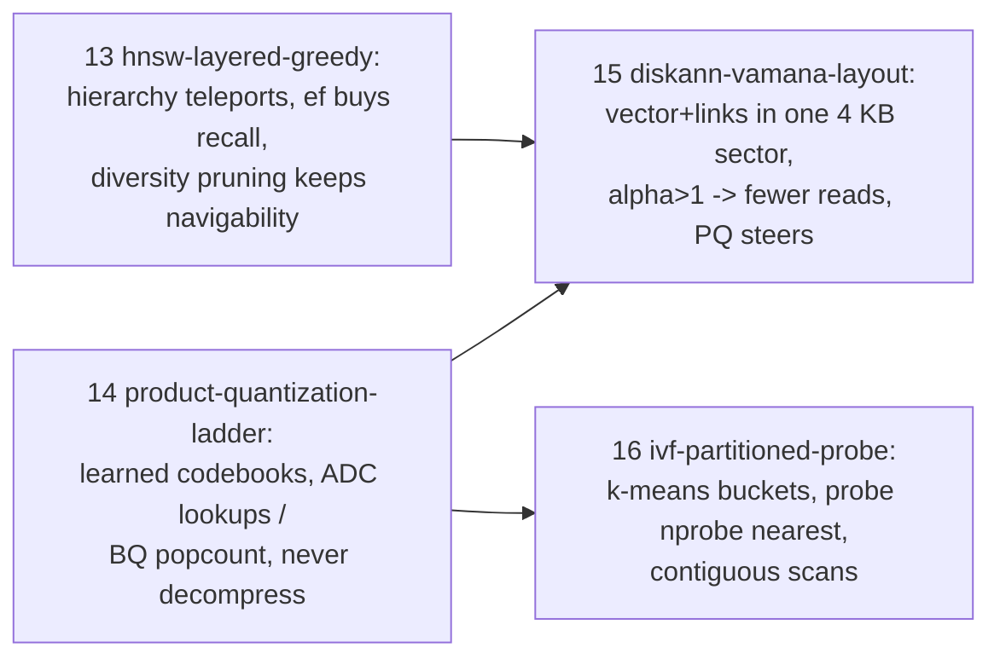
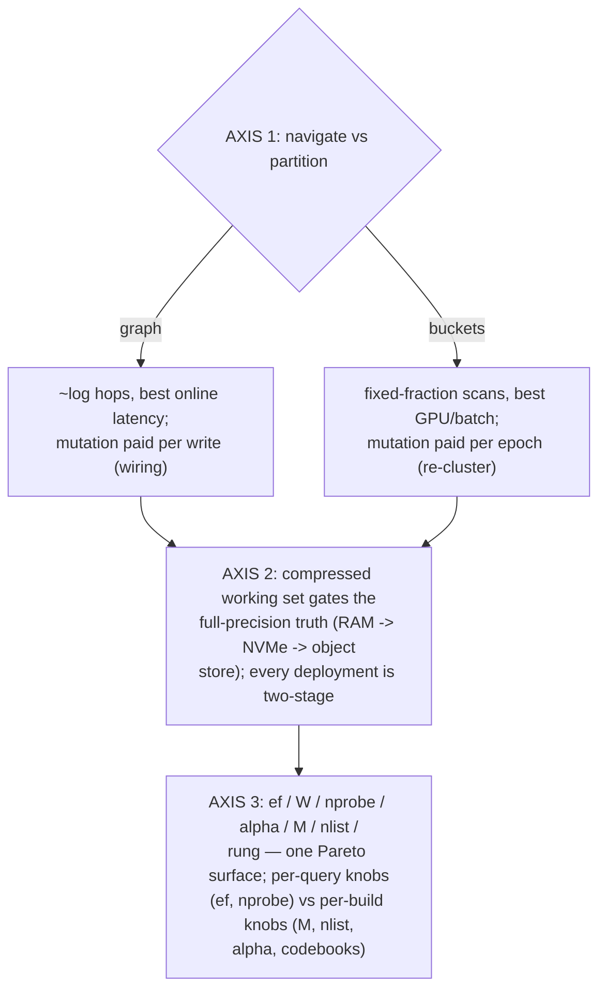
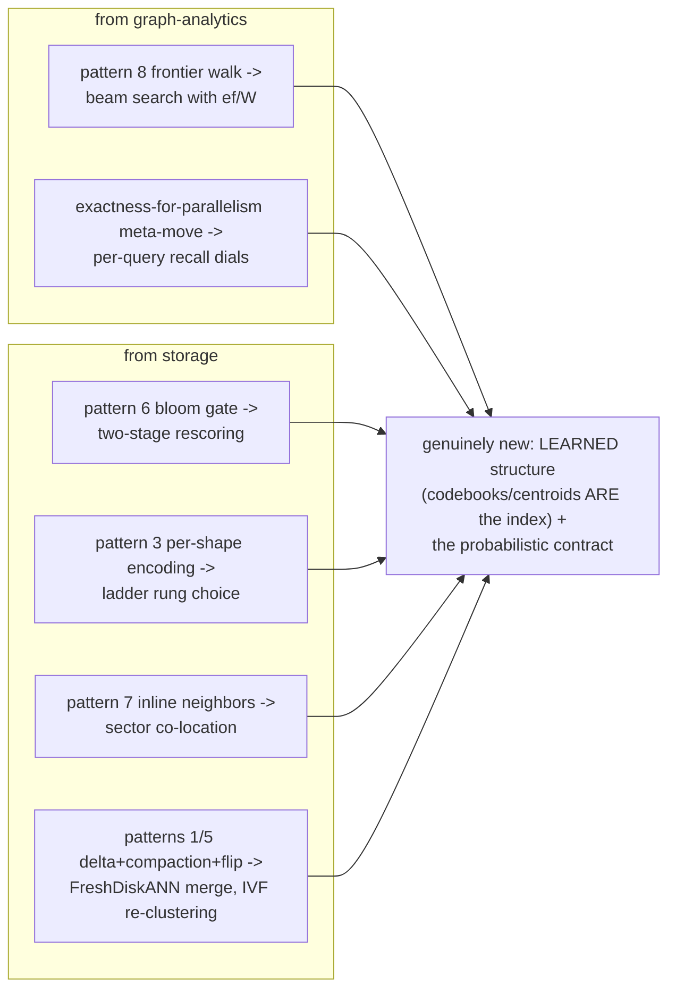
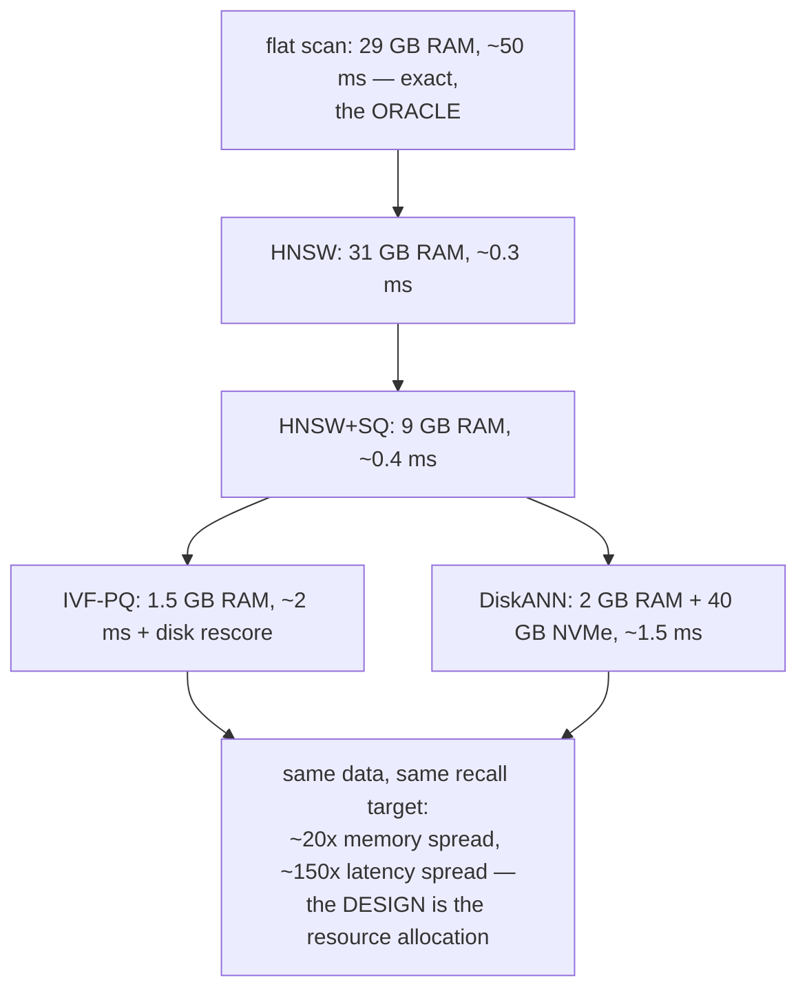
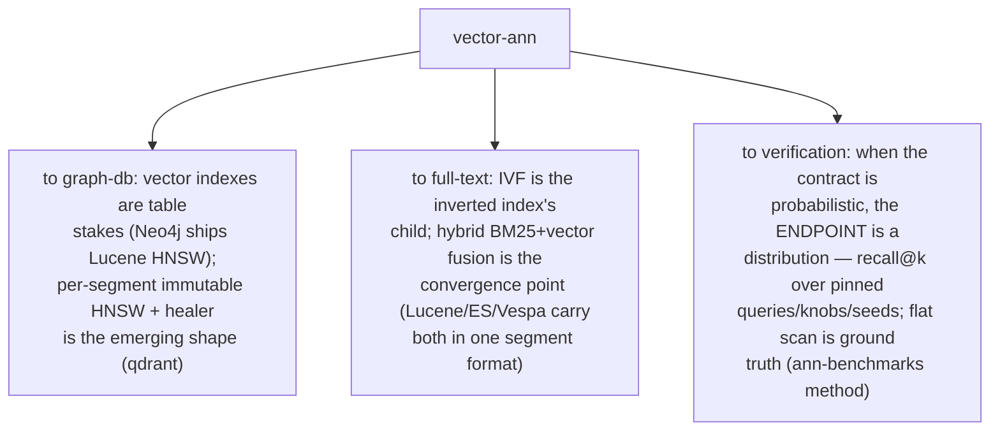
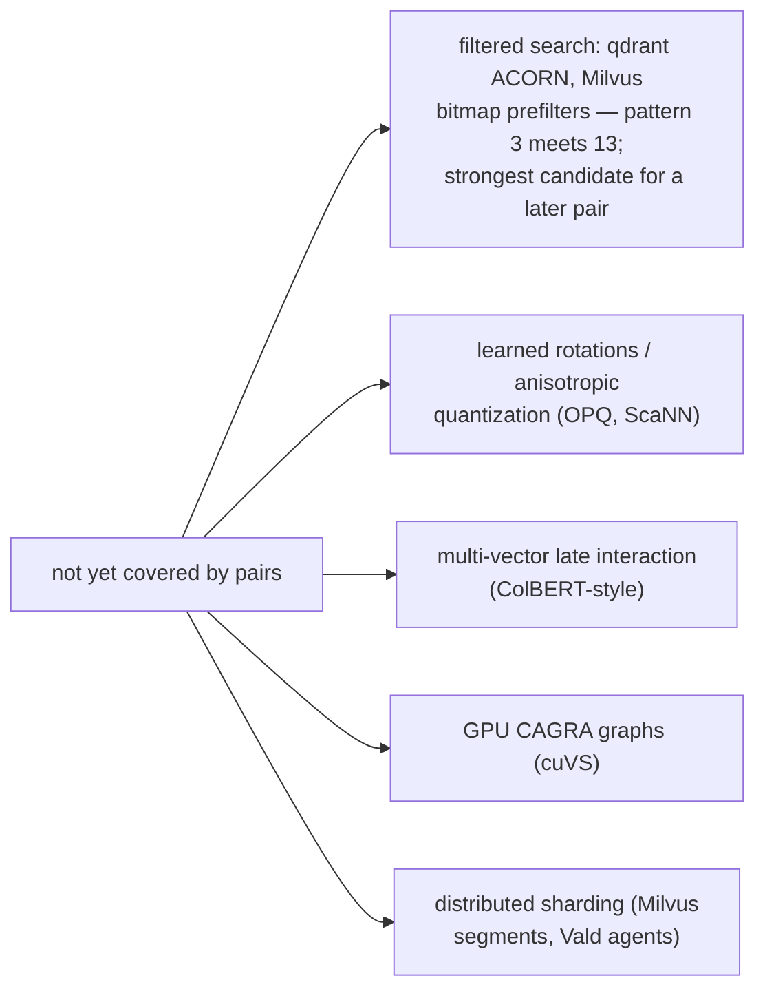
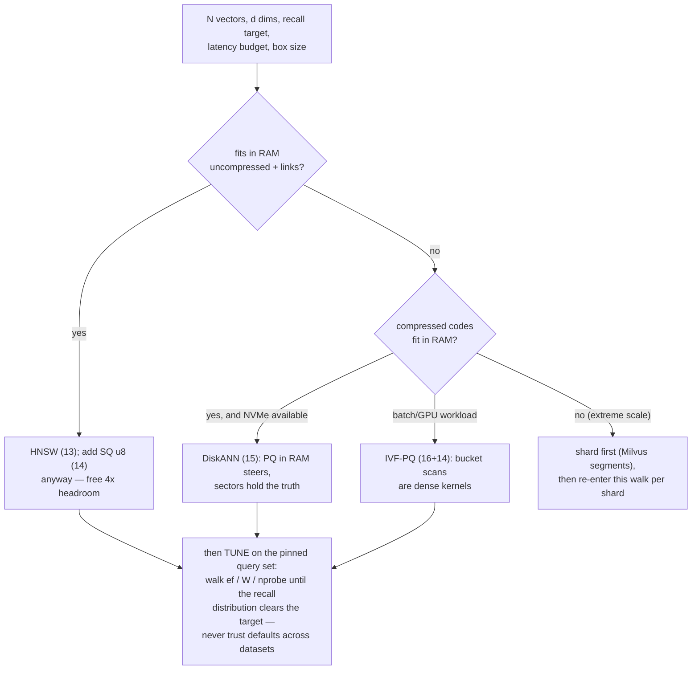

# Vector ANN Pattern Synthesis — Mermaid

| Field | Value |
| --- | --- |
| Kind | execution |
| Pair | `vector-ann-pattern-synthesis-ascii.md` / `vector-ann-pattern-synthesis-mermaid.md` |
| One-line job | Roll up patterns 13-16: vector search as the meeting point of the graph-analytics and storage categories — navigate or partition, compress everywhere, rescore at the end, and accept that the contract itself is probabilistic |

## 1. The category in one map



## 2. The four patterns



## 3. The organizing axes



## 4. Old patterns, re-priced



## 5. One workload, four designs

10M x 768-d f32 (29 GB raw), recall@10 >= 0.95, one box:



## 6. What the category exports



## 7. The verification pipeline, end to end

```mermaid
sequenceDiagram
    participant O as oracle (flat scan)
    participant S as system under test
    participant H as harness
    H->>O: pinned query set -> exact top-k per query
    H->>S: same queries at pinned (ef | nprobe | W),<br/>pinned build params + seeds
    S-->>H: approximate top-k per query
    H->>H: recall@k per query -> DISTRIBUTION,<br/>not a boolean
    H->>H: also collect counters: distance evals,<br/>hops, sectors read (pattern 15 §8)
    Note over H: pass = distribution dominates the<br/>agreed Pareto point; a single bad query<br/>is signal for triage, not failure —<br/>docs_PRD06 thesis condition 3 made concrete:<br/>EQUIVALENCE IS DEFINED, not assumed
```

## 8. Honest gaps



## 8b. Choosing a design — the integrated decision walk



Every production engine in the corpus is a packaging of this walk:
qdrant/weaviate pin the top branch, Milvus/knowhere expose all
three, pgvector grew from IVF to HNSW as RAM got cheap, and
pgvectorscale exists because Postgres pages made the DiskANN
branch natural. Reading the four pairs equips you to predict each
vendor's next move from their storage substrate alone.

## 9. Citing repos (category roll-up)

| Repo | Path | Role |
| --- | --- | --- |
| hnswlib | `reference-repos-corpus/hnswlib-src/hnswlib/hnswalg.h` | reference HNSW (13) |
| qdrant | `reference-repos-corpus/qdrant-src/lib/segment/src/index/hnsw_index/` + `lib/quantization/src/` | production HNSW + full ladder (13, 14) |
| faiss | `reference-repos-corpus/faiss-src/faiss/` | PQ/ADC, IVF family, HNSW toolbox (14, 16) |
| DiskANN | `reference-repos-corpus/DiskANN-src/` | sector layout + alpha pruning (15) |
| pgvectorscale | `reference-repos-corpus/pgvectorscale-src/pgvectorscale/src/access_method/` | Vamana+SBQ in Postgres (15) |
| knowhere | `reference-repos-corpus/knowhere-src` | HNSW/IVF/DiskANN behind one contract |
| cuvs | `reference-repos-corpus/cuvs-src` | GPU IVF + CAGRA |

## 10. Cross-references

- Prior syntheses: `storage-engine-pattern-synthesis-*` (1-6),
  `graph-analytics-pattern-synthesis-*` (7-12) — this category
  consumes both, as §4 shows.
- Individual pairs: patterns 13-16 in `pattern-index.md`.
- Next category per spec order: full-text-search — the ancestor:
  inverted indexes, posting-list compression, BM25, and the
  Lucene segment architecture everyone inherited.
