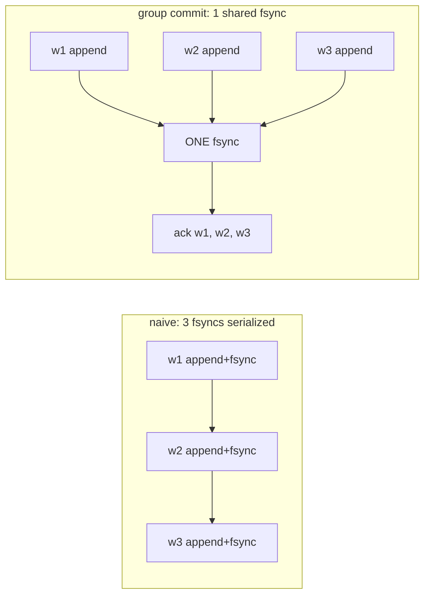
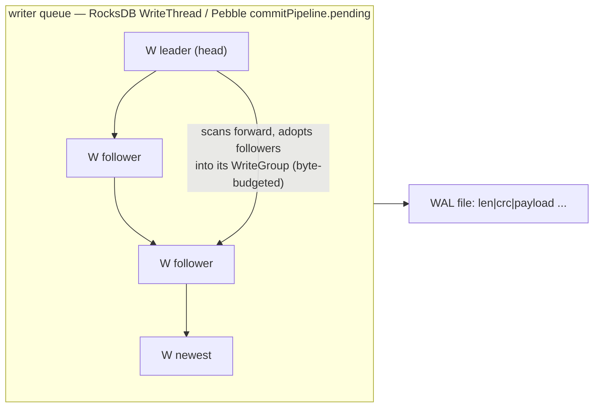
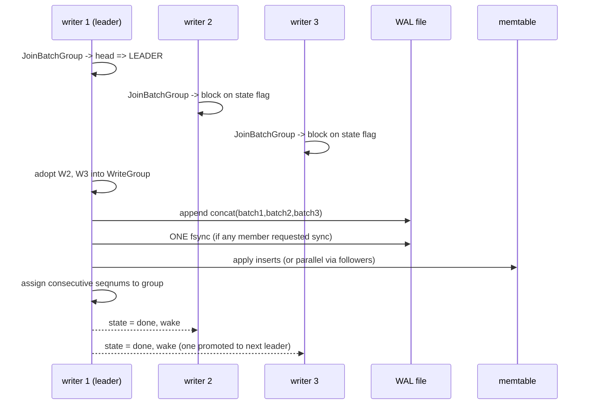
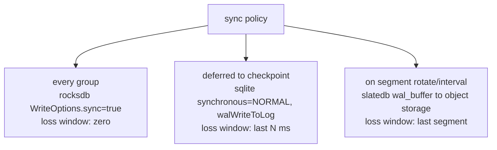
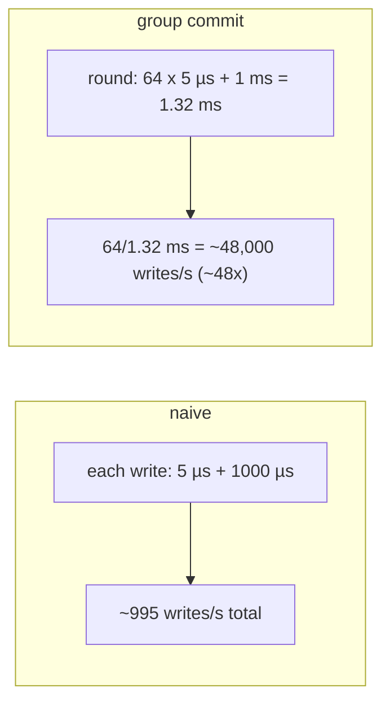
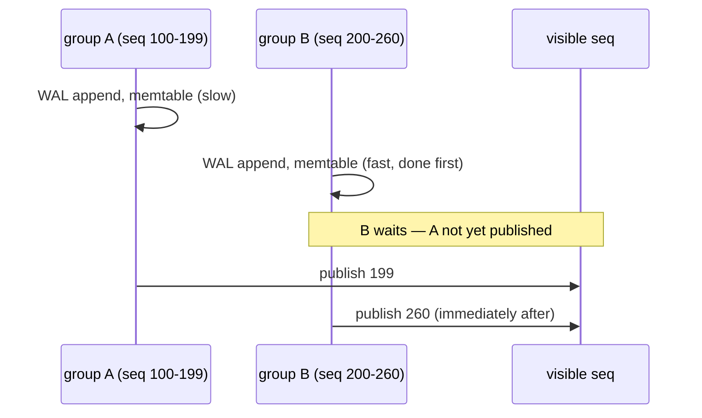
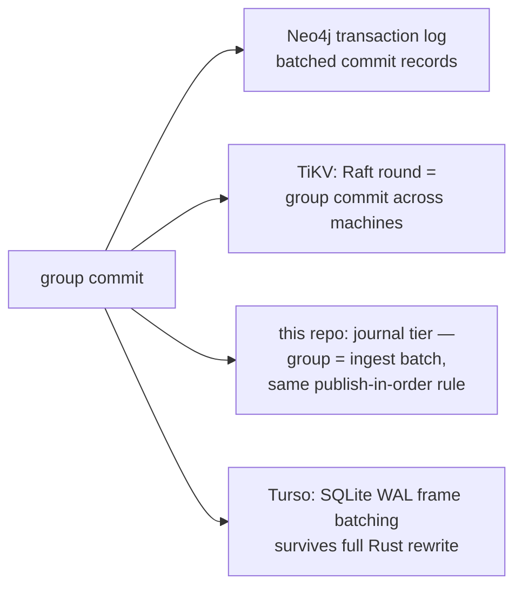

# WAL Group Commit — Mermaid

| Field | Value |
| --- | --- |
| Kind | storage |
| Pair | `wal-group-commit-ascii.md` / `wal-group-commit-mermaid.md` |
| One-line job | Amortize the fsync — many concurrent writers share one log append + one disk flush, turning per-write durability cost into per-batch cost |

## 1. The problem

Durability requires `fsync`, and fsync (~50 µs NVMe, ~10 ms HDD) costs
thousands of appends. Paying it per write caps throughput at
`1/fsync_latency` regardless of CPUs. One fsync durably persists
*everything appended before it* — so writers can share one.

## 2. The coordination structure

Each writer carries its batch, a state flag, and a wait condvar. Source:
`reference-repos-corpus/rocksdb-src/db/write_thread.h` (WriteGroup at
line 145, JoinBatchGroup contract near line 308).

## 3. One commit round (RocksDB shape)

Pebble reshapes this as a two-stage pipeline — stage 1 WAL append under
a semaphore, stage 2 in-order seqnum publication
(`reference-repos-corpus/pebble-src/commit.go`, `commitPipeline.Commit`
at line 299, pending-queue invariants at lines 228–240).

## 4. Sync policy spectrum

The group shrinks cost *per sync*; when to sync is a durability policy:

Source anchors: `reference-repos-corpus/sqlite-src/src/wal.c`
(walWriteToLog, ~line 3938);
`reference-repos-corpus/slatedb-src/slatedb/src/wal_buffer.rs`.

## 5. Worked example — throughput arithmetic

fsync = 1 ms, append = 5 µs, 64 concurrent writers:

Worst-case latency waits one full round (~2.6 ms): a bounded latency bump
buys order-of-magnitude throughput.

## 6. Worked example — in-order publication

Groups overlap in the pipeline. If group B (seq 200–260) finished its
memtable writes before group A (seq 100–199), a reader at snapshot 260
would see B without A — a hole in history. Pebble's pending queue
releases visibility strictly in enqueue order:

This is MVCC snapshot publication in miniature — generalized by the
sibling `mvcc-snapshot-visibility` pattern.

## 7. Where graph systems inherit this

## 8. Citing repos

| Repo | Path | Role |
| --- | --- | --- |
| RocksDB | `reference-repos-corpus/rocksdb-src/db/write_thread.h` | leader/follower states, WriteGroup, JoinBatchGroup |
| RocksDB | `reference-repos-corpus/rocksdb-src/db/db_impl/db_impl_write.cc` | write-group consume loop |
| Pebble | `reference-repos-corpus/pebble-src/commit.go` | two-stage pipeline; in-order publication |
| SQLite | `reference-repos-corpus/sqlite-src/src/wal.c` | frame-batched WAL, deferred fsync |
| SlateDB | `reference-repos-corpus/slatedb-src/slatedb/src/wal_buffer.rs` | interval-flushed WAL to object storage |
| Turso | `reference-repos-corpus/turso-src/core/storage/wal.rs` | Rust rewrite preserving frame batching |

## 9. Cross-references

- Paper: ARIES (recovery side of the log) — `research-papers-ledger.md`.
- Sibling patterns: `lsm-compaction-tradeoff` (downstream of the WAL);
  `mvcc-snapshot-visibility` (generalizes in-order publication).
- 202606 digest overlap: none — prior study never opened a write path.
