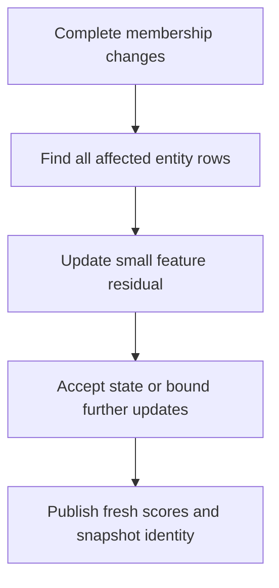

# Small State Survives Snapshot Changes

Date: 2026-09-20 local. Candidate D17. Status: new mathematical/storage proposal in this research run, with small numerical oracle checks. Not a production implementation, a current GDS compatibility guarantee, a measured performance result, or a claim of global originality.

## Product Motivation

[Feature-state PageRank](Feature-State-PageRank.md) can replace changing entity-sized rank vectors with much smaller feature vectors for a precisely defined incidence-derived graph. Its first-run limitation is repeated full incidence scans. The next question is whether a newer snapshot can reuse the previous small state without blindly repeating all those scans.

The proposal is to update the **feature residual** using a complete set of changed entity rows. The residual says whether the old solver state already gives an acceptable answer under the new operator, or how many additional updates suffice. This is not a claim that the old scores remain unchanged. Reconstruct the answer against the new snapshot and charge its output work.



This targets recurring analysis of shared-device, shared-group or other membership-derived graphs where a real application requests the shared-feature-count operator. It does not turn an arbitrary security permission graph into that operator. The required incidence relation must be available and semantically correct.

## Restricted Contract

Inherit D16's binary membership matrix B, symmetric entity adjacency `A=B*B^T-diag(q)`, shared-feature-count weights, no self edges, fixed damping `0<=a<1`, and dangling redistribution to the same normalized nonnegative personalization p.

For this initial refresh derivation, entity and feature universes and their IDs are fixed, a is fixed, and p is fixed. Memberships may change. New/deleted entities, remapped IDs, changed personalization and changed damping are outside this refresh profile until their additional terms are derived and charged. They can use a full newly admitted solve instead.

Maintain the same singleton-pruning convention for each version. A feature becoming singleton can affect several stored rows, not merely the row named in the input edit. A newly usable feature has the converse effect. Inactive feature slots may remain in a fixed dictionary, but are zero columns in that version's effective B.

**Raw membership provenance is mandatory for reactivation.** Effective singleton-pruned B alone is insufficient. A raw singleton {1} and a raw singleton {3} both become the same empty analytical column; the identical insertion of entity 2 must produce different new columns, {1,2} versus {2,3}. Preserve matching-version raw cardinalities and singleton owners, or obtain complete raw membership lists from a declared available source. Effective k in the norm is zero for a raw singleton and must not be confused with raw cardinality one. A fixed feature dictionary does not recover the discarded owner.

One possible fixed-universe sidecar is raw cardinality:u64 plus singleton owner:u32 per feature, with the owner meaningful only when cardinality is one and all entity IDs fitting u32. At F=1M that is 12 MB of selected payload if stored additionally; sharing an existing count plane can reduce the increment only after the format explicitly defines it. Metadata, source retention and rebuild costs remain additional. This is a design option, not a measured footprint. Active members still need complete postings or equivalent source access.

Use old quantities without a prime and new quantities with a prime. From D16:

```text
w_i = 1/(d_i + a*q_i) for active entities; otherwise 0
p0 = personalization mass on dangling entities
c = (1-a)/(1-a*p0)
b = B^T*diag(w)*p
M = a*B^T*diag(w)*B
delta_old = c*b + M*s - s
```

The retained feature state s need not be an exact stationary solution. Its old residual must be available or recomputed. D16's current/next checkpoint pair can supply it by a feature-order subtraction if both refer to the same old operator and state. A checkpoint whose parameters or snapshot do not match is not usable evidence.

## The Residual Update Identity

Let S contain every entity whose effective B row or w changes. For row i write B_i for its row vector. Define:

```text
Delta_b = sum over i in S of p_i * (w'_i * B'_i^T - w_i * B_i^T)

Delta_M_s = a * sum over i in S of (
  w'_i * B'_i^T * (B'_i*s) - w_i * B_i^T * (B_i*s)
)

delta_new = delta_old + (c'-c)*b + c'*Delta_b + Delta_M_s
```

Expanding `c'*(b+Delta_b) + (M+Delta_M)*s - s` gives exactly this identity. Rows outside S cancel. No dense F-by-F matrix is materialized in the execution design; each row contributes through a dot product followed by a scatter into feature entries.

The global dangling correction is essential. Even a local edit can make an entity isolated and change c. With fixed p, update p0 from all entities whose dangling status changes, then calculate c'. The `(c'-c)*b` term touches the feature vector globally but not an N-element resident vector. Omitting it gives wrong answers when dangling mass changes.

Reconstruct x' from s using the **new** d', w', c' and B'. Its exact-arithmetic error bound is:

```text
E_new = a/(1-a) * sum_h k'_h * abs(delta_new[h])
norm1(x'(s)-x'_star) <= E_new
```

This follows directly from the D16 entity residual identity for the new operator. Inactive columns have k'=0 and contribute neither to reconstruction nor the bound. Evaluate the contraction on the active feature subspace; all-dangling and a=0 have the explicit p-return branch.

If E_new is within the requested tolerance, skip further solving and return the correctly reconstructed new-version answer. Otherwise the new operator's beta' gives `E_after_n <= beta'^n * E_new`. This supplies a conservative further-update count in exact arithmetic. The first new update can be formed as `s_next=s+delta_new`; it need not repeat a full incidence scan merely to rediscover the residual just computed.

This is an additive L1 stationary-error contract. It does not preserve a GDS fixed-iteration trajectory, bitwise identity, normalized finite output without its additional bound, or top-k ordering when score gaps are smaller than the uncertainty.

## Discovering S Is Real Work

The formulas do not grant a free complete change set. A source membership change alters counts of its old/new features. Those count changes alter degrees, and hence w, of other members of those features. The affected set includes the changed entities and members impacted by changed feature counts or pruning eligibility.

With an exact membership change feed, stable IDs, old/new feature counts and feature-to-entity postings, construct the union by a bounded external merge/deduplication. Fetch old and new row images with the matching versions. Postings, row lookup indexes and delta overlays require storage, construction and compaction. Without those indexes, a complete row scan may be the cheaper and only supported way to find S.

Finding members from only the new feature list misses removed members. Reading old/new lists from inconsistent snapshots also invalidates the certificate. Tests must include those failures rather than assuming a reliable change feed. Time-dependent predicates, permissions and pair-specific filters are outside this profile unless their complete dependencies are represented.

One change can affect a very large group. Small input delta therefore does not imply small S or small I/O. If S is broad, scanning the whole canonical incidence file can beat many random row lookups. That is a plan choice within the same semantics, not a reason to report every update as local.

## Bounded State And File Lifetimes

A simple serial baseline can use three F-element f64 arrays: s, a working residual initialized from delta_old, and Delta_b. Accumulate Delta_M_s directly into the residual, then stream old b to apply the c terms and emit b'. At F=1M the named mutable payload is 24 MB. This excludes numerical-error state, counts, runtime, input/output buffers, changed-row lookup and external merge state; it is not whole-machine RAM.

If rigorous floating certification needs per-entry error bounds, those arrays are charged as well. Cancellation in subtracting old/new contributions can make apparent zero residuals unreliable. Carry outward errors, periodically rebuild/audit the residual under an admitted schedule, or report an uncertified estimate. The small f64 tests below are not a substitute for this work.

Never allocate the entire changed group or its unbounded row-image list in RAM. Stream postings, deduplicate external runs, and process bounded row chunks. A wide row needs a bounded buffer or paid rereads to finish its dot product before scattering. Parallel updates need deterministic ownership/reduction and cannot allocate F-element buffers per unbounded worker.

Publication must atomically connect the membership snapshot, counts, row deltas, solver parameters, feature state, residual provenance and result version. A crash between updating counts and rows must not expose a mixed operator. Shared blocks remain charged until old readers release them. Checkpoint and delta-log retention have explicit byte quotas.

## A Conditional Score-Plane Reuse

Skipping a solve does not generally permit reusing every old score. However, if c'=c, s is unchanged, p is fixed, and an entity's B row, d and w are unchanged, its raw reconstructed score is algebraically unchanged. In that narrower branch, an immutable raw-score plane can reuse unaffected blocks and patch changed rows. The new global certificate still determines whether that reconstructed vector is accurate enough.

If c changes, s advances, or output normalization changes, scores outside S may change too. A full output scan may be required. Every full all-entity export still has N rows even when most score blocks are shared. A changed score may also affect a global sort/top-k index; its maintenance is a separate charged operation. Do not advertise this conditional plane reuse as exact unchanged PageRank after arbitrary edits.

## Favorable Example And Losing Branch

Use D16's constructed fixed-two-membership example: 1B entities, 1M features, 2B memberships, and initially 2,000 members per feature. Replace one entity's endpoint feature with another existing feature, preserving valid binary membership and stable entity identity. Away from singleton thresholds, only the departing and arriving feature counts change. The changed entity plus the old/new feature member sets contain at most about 4,001 entities; a conservative bound is 8,002 memberships to examine in those rows.

That is roughly 250,000 times fewer row memberships than a complete 2B-membership pass **for the row-difference portion only**. A full F-entry residual/count reduction, source change discovery, posting retrieval, row-image access, numerical accounting and publication still remain. This is not a 250,000x query, refresh or Neo4j speedup, and no latency has been measured.

The optional reverse-posting payload is `4I+8(F+1)` bytes with u32 entity IDs and u64 offsets: about 8.008 GB in this example. Added to D16's named 36.032 GB portfolio, that is about 44.040 GB before additional metadata, overlays, personalization and retention. Fixed two-slot rows can support direct row addressing, but a general variable-membership profile needs a charged locator or sequential join.

A passing no-extra-iteration branch with unchanged c may reuse most raw-score blocks. A failed gate can require new feature iterations and a completely new 8 GB score plane. Keeping that beside the 44.040 GB old portfolio exceeds the strict 50 GB prepared allowance before metadata. The failure branch therefore needs a predeclared retention schedule, a smaller portfolio, omission of an optional saved score plane, or sufficient sharing. It cannot discover halfway through that fallback was never resource-feasible.

### A Passing Error Gate Still Needs A Storage Gate

The independent [D17 review](03-feature-refresh-Review.md) identified two important additions: singleton reactivation provenance, now required above, and physical replacement cost even when no further iteration is needed. The original 44.040 GB example omits any newly required raw-provenance sidecar.

Keeping a new full reverse-posting index beside the old named portfolio costs 52,048,000,016 bytes before other additions. A packed posting insertion/deletion can shift many later entries, so a small changed-membership count does not establish a small file rewrite. Likewise, one changed score in each of 4,000 two-million-byte blocks can require replacing an entire 8 GB plane despite only 4,000 changed rows. These are losing layout cases, not typical-workload estimates.

A concrete conditional publication schedule is:

1. Pin the old immutable generation. Record actual retained bytes, raw provenance availability, reader pins, numerical state provenance and the separate scratch/output allowance. No source mutation is performed.
2. Stream complete changes through bounded external runs. Build versioned posting insert/delete overlays, complete replacement row images and the candidate feature residual. Charge raw-count/singleton updates too. Do not rewrite a full packed posting file implicitly.
3. Check the numerical gate and the physical plan. With retained bytes R, planned distinct persistent additions U and reserved persistent overhead H, require R+U+H <= 50,000,000,000. Independently check peak device bytes including input, incomplete files and scratch. U includes all overlays, checkpoints, directories and result changes, not just membership payload. Count the additions once when incomplete and once in the appropriate retained category after sealing, never twice simultaneously.
4. In the no-extra-iteration, unchanged-c/s branch, write a keyed score overlay only for rows whose raw score may change. Serve the newest row value over the shared old plane. This avoids requiring a large copy-on-write block for each changed score, but introduces charged lookup/merge work. Preserve the old plane's matching-state provenance. A full exported answer still requires complete delivery.
5. Seal the candidate files and atomically publish one manifest referencing shared base blocks plus the new overlays. Old readers retain the old manifest; shared blocks remain charged once. Reclaim unique obsolete files only after their final reader releases them. Recovery retains either a complete old generation or a complete new one, never a mixed operator.
6. Bound overlay count/bytes and admit compaction separately. When its replacement blocks plus pinned predecessors cannot fit, keep the last valid snapshot and decline/pause the proposed refresh or use an explicitly chosen maintenance/smaller-portfolio plan. Do not let successful local updates accumulate an unbounded lookup chain or silently destroy availability.

If c or s changes, a sparse score overlay is not generally sufficient. A separately admitted option can omit the new saved score plane and reconstruct from the new feature state on demand, accepting the paid row scans. Retaining a full new plane or compacting postings requires its actual overlap budget. A failed candidate assessment must be visible as an unperformed refresh with older source freshness, not as a successfully updated answer. Before promising completion of an accepted refresh, admit its chosen numerical and storage fallback or explicitly expose the conditional assessment phase.

This schedule specifies the required lifetimes and failure branches; it is not evidence that an overlay implementation already satisfies them. The two separate gates express the distinction between cheap algebra and feasible publication.

## Small Numerical Checks Executed

The lead executed a pure JavaScript mathematical oracle on 2026-09-20 local. No runtime source file or graph engine was implemented.

- All 64 binary three-entity/two-feature membership matrices, paired in every old/new combination.
- Three damping values: 0.2, 0.85 and 0.99.
- Uniform, nonuniform and single-seed personalization.
- 36,864 old/new/parameter cases, including 23,328 with changed dangling mass.
- Three old-state scales: zero, one-half of the old feature solution, and the old feature solution, totaling 110,592 checks.
- Changed-row residual identity compared with directly applying the complete new feature operator: maximum discrepancy about 2.78e-16.
- New reconstructed scores and one further update compared with an independent dense expanded-entity stationary solve. No error-bound violation above the explicit 1e-10 test allowance; maximum raw numerical shortfall about 3.25e-14.

The oracle constructs small dense matrices and discovers changed rows by comparing every row. Those are independent test conveniences, not the proposed disk execution algorithm or evidence that production change discovery is cheap. The checks do not verify complete CDC, source consistency, file publication, floating intervals, top-k, physical RAM or performance.

### Exact Rational Fixture For The Next Implementation

Keep three entities and one feature. Initially the feature contains entities 1 and 2; after the edit it contains 2 and 3. Set a=1/2 and fixed p=(1/2,1/2,0). The old stationary feature state is s=1, old c=1/2, b=2/3 and M=2/3. The new values are c'=2/3, b'=1/3 and M'=2/3. Consequently:

```text
delta_old = 0
(c'-c)*b = 1/9
c'*Delta_b = -2/9
Delta_M_s = 0
delta_new = -1/9
E_new = 2/9

x'(s) = (1/3, 5/9, 1/3)
x'_star = (1/3, 4/9, 2/9)
actual L1 error = 2/9
```

This is a derived rational fixture, separate from the executed finite f64 sweep. It verifies the global c term and illustrates that a valid warm-state reconstruction can have mass greater than one. Returning the old score plane or silently normalizing the new one is not the same operation as returning the vector whose error was bounded.

## Prior Art And Scope Of Contribution

Incremental PageRank is established prior art. [Bahmani, Chowdhury and Goel](https://arxiv.org/abs/1006.2880) study Monte Carlo incremental/personalized PageRank under explicit update/access assumptions. [DF* PageRank](https://arxiv.org/abs/2401.15870) studies incrementally expanding affected frontiers. Their primary abstracts were inspected for positioning, not every proof or experiment; their reported speedups are not adopted here.

[Dynamic PageRank: Algorithms and Lower Bounds](https://arxiv.org/abs/2404.16267) makes approximation type, directedness and explicit vector maintenance important parts of its complexity claims. Its abstract does not license a universal constant-time update claim for our system. Nor do its directed explicit-maintenance lower bounds directly rule out this restricted symmetric implicit-state proposal. Full theorem assumptions must be examined before a formal comparison.

Our proposed refinement is the combination of D16's eliminated state with an exact changed-row feature-residual identity, a sufficient iteration budget, complete affected-set obligations and conditional score-block reuse under the actual retention cap. It builds on standard linear algebra and incremental maintenance, and may have closer precedents. This research has not established worldwide novelty.

## Next Verification Gate

Before implementation promotion, specify one real membership-derived customer job and its error/output contract. Compare a full newly built D16 solve with the refresh path on identical old/new snapshots, including failed residual gates, very large groups, isolated-node transitions, missing/reordered changes, stale postings, crash recovery and reader-pinned generations. Add the review's indistinguishable pruned-singleton worlds, unchanged-membership/changed-degree rows, omitted-global-term false-zero fixture, widely scattered score patches, posting-offset shifts, overlay-limit and compaction-overlap cases. Measure all build, index, change-discovery, solve, output and retention costs on the constrained machine. Promote only if the second complete useful answer is materially better in capacity/economics or time, without weakening its semantics.
