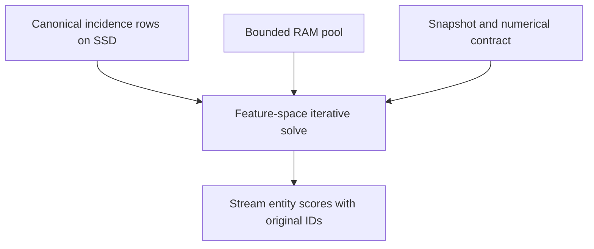

# Feature State Replaces Entity State

Date: 2026-09-20 local. Candidate D16. Status: mathematical research proposal with small numerical checks, not a production implementation, a GDS compatibility claim, a measured large-graph result or an established globally novel algorithm.

## The Useful Idea

For a particular kind of graph, do not keep one changing PageRank value per entity in RAM. Express each entity score as a formula involving a much smaller set of feature/group values. Iterate only those feature values. Read entity/group rows from disk to perform each iteration, then stream the requested entity scores when finished.

This goes beyond Candidate4's avoided-clique execution: that candidate still carries entity-sized rank state. Here we eliminate that mutable state for the declared stationary PageRank problem. It does not depend on finding identical entity neighborhoods. The trade is repeated sequential incidence processing and a different iterative solve, not a promise of no I/O.

This is an extension of the repository's existing factorized-incidence direction, using established matrix elimination. The algebra and storage schedule below are the proposed experiment. Related projected-graph and line-graph PageRank factorizations are already published; worldwide novelty has not been established.



## Exact Supported Graph

Let B be a binary N-by-F entity/feature incidence matrix. B[i,h]=1 means entity i belongs to feature h. Attributes are domain-qualified and duplicate membership records follow a declared binary-deduplication policy. Keep isolated entities in a separate explicit entity universe.

The requested entity graph has symmetric edge weight equal to the number of shared features, and no self edge:

```text
A = B B^T - diag(q)
q_i = number of features attached to entity i
k_h = number of entities attached to feature h
d_i = sum_h B[i,h] * (k_h - 1)
```

Remove empty and singleton feature columns first. They induce no entity-to-entity edge, so removing them and updating q leaves A unchanged. This simplifies the solve and its convergence bound. The removal is not safe for unrelated queries that explicitly ask about singleton group membership; retain source provenance or advertise the narrower analytical artifact.

PageRank uses damping 0<=a<1, nonnegative normalized personalization p, and dangling redistribution to that same p. Its target is the stationary solution of:

```text
x = (1-a)*p + a*A*D^-1*x + a*z*p
z = sum over d_i=0 of x_i
```

D^-1 is zero at d_i=0. Because A is symmetric, every zero-degree entity also has no incoming graph contribution. This fact is essential to the simple dangling correction below. Do not transfer the formula to a general directed graph with incoming edges to dangling vertices.

Handle empty state explicitly: a=0 returns p directly. If every entity is dangling after pruning, the feature system is empty, c=1, and the answer is also p. Do not evaluate a maximum over the empty active set. Personalization supported entirely on dangling entities likewise yields p without a feature iteration.

This is not automatically the same as GDS's delta/Pregel stopping, scaling or finite-iteration output. Establish a stationary numerical-error contract and normalize the incumbent comparison appropriately. Bitwise identity is not claimed.

## Eliminate Entity Unknowns

Define p0 as personalization mass on zero-degree entities. Such entities have x_i=c*p_i, where c=(1-a)+a*z. Therefore:

```text
p0 = sum over d_i=0 of p_i
c  = (1-a)/(1-a*p0)
```

For an active entity, define y_i=x_i/d_i and feature state s_h=sum_i B[i,h]*y_i. The original equation becomes:

```text
x_i = c*p_i + a*sum_h B[i,h]*s_h - a*q_i*x_i/d_i

w_i = 1/(d_i + a*q_i)
y_i = w_i * (c*p_i + a*sum_h B[i,h]*s_h)
```

Set w_i=0 for inactive entities. Substituting y into the definition of s yields the F-dimensional system:

```text
b = B^T * diag(w) * p
K = B^T * diag(w) * B
s = c*b + a*K*s
```

Once s is solved, reconstruct scores in one entity-order pass:

```text
if d_i > 0:
    x_i = d_i*w_i*(c*p_i + a*sum_h B[i,h]*s_h)
else:
    x_i = c*p_i
```

There is no need to retain an N-element rank vector to iterate or to stream the final answer. A full score artifact is still N values on disk, and full client output still has N rows. A sparse personalization vector can be merged with the entity stream; arbitrary dense personalization is an additional persisted column and read cost.

Finite reconstructed iterates generally have total mass different from one. The error contract below initially applies to the raw reconstructed x, returned unchanged. Renormalizing it is a separate output transformation with its own error bound and, where needed, an additional mass-computation pass. This matters even if the stationary target is a normalized probability vector.

## Never Materialize The Feature Matrix Either

K may be dense with F squared entries. Building it would merely move the materialization problem. Apply K through the incidence rows instead:

1. Initialize next[h] from the precomputed c*b[h] stream.
2. For entity i, compute t_i=sum of current[h] over its features.
3. For each feature h of that entity, accumulate a*w_i*t_i into next[h].
4. Finish the pass, inspect the convergence certificate, then swap current and next when another iteration is required.

The mutable payload is two F-element vectors. Keep b on disk and stream it when initializing next, or charge a third F-element resident array. Member counts for the certificate can also be streamed. Feature-vector gathers and updates occur in RAM; entity rows remain on disk.

A row with very many features cannot be assumed to fit a local vector. Either retain it within a declared row-buffer cap or reread its bounded chunks after computing t_i. The latter adds row I/O but not unbounded RAM. Parallel scatter needs a separately verified ownership/reduction schedule; per-thread F-element vectors would multiply the principal state. Start with a deterministic single-owner or explicitly partitioned baseline.

## Why The Iteration Converges

For active entities let C=diag(d_i+a*q_i). The nonzero eigenvalues of `a*B^T*C^-1*B` equal those of `a*C^-1*B*B^T`. The latter nonnegative matrix has row sums:

```text
rho_bound = max_i a*(d_i + q_i)/(d_i + a*q_i)
```

Every active d_i is positive, so each displayed ratio is less than one for a<1. After singleton-column removal, d_i>=q_i, yielding `rho_bound <= 2*a/(1+a) < 1`. Hence the feature fixed-point iteration converges in exact arithmetic. This is a spectral convergence bound, not a measured wall-clock or iteration-count promise for arbitrary norms, floating arithmetic and implementations.

An equivalent nonsingularity argument uses `C-a*B*B^T = D-a*A`, which is positive definite on active entities because `D-a*A = (1-a)*D + a*(D-A)` and D-A is their weighted graph Laplacian. These are standard linear-algebra arguments, not new theorems claimed by this study.

For groups of size two, the bound can approach 2a/(1+a), worse than a. For large groups with q_i much smaller than d_i, it is close to a. Fewer mutable variables do not imply fewer iterations.

## A Small-State Error Certificate

Let next=c*b+a*K*s and reconstruct x from the current s, not next. The original entity residual is:

```text
r = (1-a)*p + a*P*x - x
  = a*B*(next-s)

norm1(r) <= a*sum_h k_h*abs(next[h]-s[h])
norm1(x-x_star) <= norm1(r)/(1-a)
```

P includes the chosen dangling redistribution. Thus a feature-sized reduction gives a conservative entity-space L1 error bound without keeping a full entity residual vector. From s=0 with nonnegative inputs, exact arithmetic gives monotone updates; the bound may be tight because residual terms are nonnegative. Do not assume that monotonicity survives arbitrary floating implementations without validation.

The returned x must correspond to the state whose bound was checked. Testing next-s and then returning reconstruction from next without another justified bound is an off-by-one contract error. One option is to return the current state when its bound passes; another is to compute the next residual before returning the newer state.

Production certification requires outward numerical error accounting for normalization, row sums, products, summation and stored precision. The small f64 checks below allow a stated numerical margin and are not interval proofs. If numerical uncertainty prevents certification, report that honestly or perform a priced independent residual audit.

### Stronger Bound From Independent Review

The [independent review](02-feature-state-Review.md) strengthens the spectral argument into a directly useful norm contraction. Let M=a*K and define `norm_k(v)=sum_h k_h*abs(v_h)`. With beta equal to the maximum row ratio above:

```text
(k^T M)_h = sum_i B[i,h] * a*(d_i+q_i)/(d_i+a*q_i)
          <= beta*k_h

norm_k(M*v) <= beta*norm_k(v)
E(s) = a/(1-a) * norm_k(next-s)
E(next) <= beta*E(s)
```

Thus a newer-state reconstruction can carry the justified bound beta*E(s), without another incidence scan solely to recalculate its residual. Do not replace beta with a: on two entities sharing one feature with a=1/2, beta=2/3, so that substitution underestimates the next error.

For zero initialization and nonnegative inputs in exact arithmetic, monotonicity gives a sharper identity:

```text
E(s_t) = 1 - sum_i x_i(s_t) = norm1(x_star - x(s_t)).
```

This is not valid for arbitrary warm starts, extrapolation or an unaccounted floating implementation. In production, numerical uncertainty must be propagated through beta and the certificate rather than rounded away.

The normalization hazard has an exact fixture. For one feature joining entities 1 and 2, isolated entity 3, a=1/2 and p=(1/10,0,9/10), the stationary vector is (4/33,2/33,9/11). The zero-state reconstruction (2/33,0,9/11) has L1 error 4/33. Renormalizing it gives (2/29,0,27/29), whose error is 72/319, larger than the old certificate. For a nonnegative reconstruction with positive mass and certified error E, a simple valid general bound for the normalized output is 2E. Numerical rounding and computation of the normalization mass still need accounting.

### A Conditional Work Budget Before Running

This contraction allows a plan to quote a data-pass upper bound, not merely hope that convergence is quick. If E0 is a valid initial error bound, choose n such that `beta^n * E0 <= epsilon`, then perform n feature updates before reconstruction. E0 can be calculated during initial row preparation, or the conservative E0<=1 can be used for the zero-start exact iteration. Use an exact or outward-safe threshold calculation; a rounded logarithm at the boundary is not a certificate.

For the universal pruned beta=2a/(1+a), E0<=1, and epsilon=1e-8, sufficient update counts are 17 at a=0.2, 218 at a=0.85, and 3,657 at a=0.99. These three thresholds were checked by exact integer power comparisons using beta=1/3,34/37,198/199 respectively. They are conservative exact-arithmetic counts for this particular solver, not lower bounds on every PageRank algorithm or measured runtime predictions. Near-one damping makes the simple fallback very costly.

For very wide rows, one nominal update can require extra bounded-chunk rereads; account for physical bytes, not just logical passes. Dense personalization processing, initial b construction, final reconstruction, original-ID delivery and checkpoint writes are additional work. This is a concrete route from a known algorithm family and accuracy requirement to bounded work; it does not require fixing every future personalization query in advance.

## Custom Storage Shape

For a sequential PageRank profile, persist block-framed entity rows with packed fields:

```text
weighted_degree: u64
feature_count:   u32
feature_ids:     feature_count * u32
```

Also retain the dense-to-original ID mapping, feature dictionary/ID mapping where needed, feature member counts, semantic manifest, selected personalization input, and optional score/checkpoint artifacts. The row payload above is 12N+4I bytes for I incidences, not a Rust struct-size assertion. Wider identifiers or degrees require a different declared encoding. Arbitrary strings and properties add their actual bytes.

This profile does not require an entity-to-entity adjacency file, feature-major incidence copy, dense K, or a resident per-entity rank array. Optional random-access row/score indexes must earn and pay their storage. A streaming-only output profile can omit them; an interactive lookup promise cannot silently assume them.

Build remains substantial: validate IDs and membership, externally deduplicate, establish feature counts, filter singleton memberships, map IDs, compute degrees and assemble rows using bounded sorting/joins. If F count state itself does not fit, feature counts also require external aggregation. Building on a large hidden machine does not satisfy the four-GB lifecycle target.

## A Favorable Billion-Entity Example

This is a constructed size model, not a customer dataset or measured benchmark. Let F=1,000,000 feature vertices form a simple 2,000-regular undirected feature graph. Treat its edges as N=1,000,000,000 entities, each incident to its two endpoint features. The entity graph is that feature graph's line graph. Every feature has 2,000 members, and every entity has 3,998 projected neighbors. Any two entities share at most one feature, so no duplicate-pair ambiguity affects these counts.

Use a nonuniform or sparse personalization query. Uniform PageRank on a regular graph is trivial and would be a misleading showcase for a solver.

| Selected quantity | Bytes or count |
| --- | ---: |
| Entities N | 1,000,000,000 |
| Features F | 1,000,000 |
| Incidences I | 2,000,000,000 |
| Explicit directed entity adjacency entries | 3,998,000,000,000 |
| Explicit u32 neighbor payload alone | 15,992,000,000,000 B, or 15.992 TB |
| Sequential incidence row payload, including degree/count fields | 20,000,000,000 B |
| u64 dense-to-original entity map | 8,000,000,000 B |
| Two mutable f64 feature vectors | 16,000,000 B |
| Feature member-count column | 8,000,000 B |
| Persisted feature b column | 8,000,000 B |
| Optional full f64 entity score plane | 8,000,000,000 B |

The named prepared components with score plane and two checkpoint vectors total about 36.032 GB. Headers, dictionaries, integrity metadata, chosen personalization, output indexes and any retained generations are additional. With simple numeric feature IDs and sparse personalization this leaves a plausible allowance below the strict 50 GB prepared cap, not a proof of a complete fit. A full ID-plus-score binary export is 16 GB before protocol framing; storing that separately duplicates IDs and consumes extra space. CSV output may be larger.

The changing vector payload drops from 16 GB for two entity f64 arrays to 16 MB for two feature arrays, a 1,000x reduction of that selected state. This is NOT a 1,000x whole-process RAM ratio against Neo4j. The expanded 15.992 TB edge payload is also not a measured GDS footprint: compressed or factor-aware competitors can avoid much of it.

The incidence rows are 20 GB per full scan in this example. They have only two feature IDs each, so each row can be processed once with a tiny bounded row buffer. One hundred passes would read roughly 2 TB of row payload; at an assumed achieved 500 MB/s mixed workload rate, that alone is about 4,000 seconds of I/O service. CPU, feature-state access, parsing/decoding, initialization, build, output and stalls are additional. The convergence ratio bound here is about 0.850064 at a=0.85; no hundred-pass completion guarantee follows from this illustrative service calculation.

The stronger norm bound makes this example more precise. For this regular shape beta=34000/39997, zero initialization gives E(s_t)=beta^(t+1), independent of which normalized active personalization is selected. The following thresholds were independently confirmed by exact integer power comparisons in the review and by the lead. A current-state residual calculation would require one further update/certificate scan; the propagated bound permits returning the already bounded state without it.

| Requested L1 error | Feature updates using known E0=beta | Update row bytes | Row service alone at assumed 500 MB/s |
| --- | ---: | ---: | ---: |
| 1e-6 | 85 | 1.70 TB | 3,400 seconds |
| 1e-8 | 113 | 2.26 TB | 4,520 seconds |
| 1e-10 | 141 | 2.82 TB | 5,640 seconds |

The initial b/degree work, reconstruction and output are excluded from this table and must be added to the full job. In particular, one hour is not an established SLA: the assumed row service alone exceeds it at 1e-8. A scheduled batch is a more plausible category than millisecond global PageRank, but the customer's actual deadline decides usefulness. A competent incidence-native baseline with entity state, and other low-rank solvers, must also be measured.

## Refresh And Query Changes

Changing personalization reuses incidence topology and degrees but changes b and c, so the feature solve reruns. A sparse personalization change can make b construction cheaper only when a suitable ID/row lookup mechanism exists; otherwise scanning the rows is still paid work. Changing damping changes w, b and K's implicit operator even when the physical incidence rows remain reusable.

A membership edit changes the source relation, affected group counts and potentially many entities' degrees. It may affect all stationary scores. Complete delta coverage, source consistency and a separately proved update strategy are prerequisites for reuse. The first version may rebuild and solve from a fresh snapshot. Do not call the total analytics update constant-time merely because one incidence record changed.

Two unrelated 36 GB prepared generations exceed a strict 50 GB retained-prepared cap. Share unchanged immutable blocks only when their encoding/identity permits it, choose smaller retained portfolios, or use an explicitly accepted one-job-at-a-time retention/availability policy. New-build scratch and source retention still have separate peak-space limits. No refresh design here grants free disk or permission to delete the only valid result.

## Cases Where It Does Not Apply Or Loses

- The input is an arbitrary directed edge graph with no known exact incidence operator.
- The requested edge is binary "shares at least one" while some pairs share several features. This solver uses shared-feature counts unless the data proves those coincide.
- Pair-specific filters, time-window correlations, negative weights or arbitrary similarity weights change the operator.
- F is as large as N or larger. Feature state may not save memory, and K is never assumed sparse.
- High-degree incidence rows require rereads, or repeated scans exceed the customer's deadline.
- A strict finite-iteration GDS answer is required. This stationary solve has a different iteration trajectory.
- Full dense personalization, large external IDs, many optional indexes or retained score exports exhaust the disk allowance.
- A uniform-ranking or highly trivial synthetic case is used to manufacture an impressive speedup.

## Executed Small Checks

Pure tool-runtime JavaScript on 2026-09-19 UTC. Independent dense Gaussian solve of the expanded entity PageRank system versus the eliminated feature system:

- All 4,096 binary four-entity/three-feature incidence relations.
- Damping 0.2, 0.85 and 0.99.
- Uniform, nonuniform and single-seed personalization.
- Empty/singleton features removed in the candidate; original expanded graph built from the unpruned incidence.
- 36,864 stationary comparisons; maximum absolute entity-score discrepancy 1.83e-14.
- Twenty streaming feature updates per case, giving 737,280 residual-bound comparisons against the dense stationary oracle.
- No bound shortfall larger than the explicit 1e-10 numerical test allowance; largest numerical shortfall was about 1.39e-14.

These checks validate a small finite domain of the derived formulas with f64 arithmetic. They do not validate a rigorous floating bound, GDS RNG/stopping/scaling, source extraction, big integers, physical four-GB execution, parallel reduction, I/O or performance. The theoretical derivation supplies the general exact-arithmetic argument; production implementation still needs verification.

## Prior Art And Claim Boundary

[Matrix-based PageRank control in hypergraphs for semantic text summaries](https://doi.org/10.1038/s41598-025-32380-5), published online in December 2025 with a 2026 volume record, explicitly studies shared-feature-count projected adjacency, matrix decomposition and relationships between PageRank on related graph representations. Its indexed primary text and author-repository abstract were inspected, not every proof. This is direct evidence against claiming that projected PageRank factorization itself is new.

A [2015 Computer Science and Information Systems paper](https://doiserbia.nb.rs/img/doi/1820-0214/2015/1820-02141400092K.pdf) describes avoiding explicit line-graph adjacency through sparse matrix decomposition. Indexed primary excerpts were available; direct PDF opening timed out. Its full operator and equivalence must be read before claiming a distinct algorithmic contribution. [BiRank](https://arxiv.org/abs/1708.04396) is another related bipartite-ranking approach, not automatically the same projected-graph stationary contract.

Within this run, the useful additional proposal is the explicit diagonal-corrected entity elimination, matrix-free feature iteration, feature-sized entity-error certificate, and a complete small-host storage/build/output schedule. It is a candidate refinement beyond the earlier retained entity-vector incidence plan. Remaining corpus reading could reveal closer repository precedents. Do not claim a patentable or globally first algorithm.

## Verification-First Next Experiment

1. Preserve this precise graph/operator contract and add exact rational small fixtures, singleton pruning, all-dangling inputs, sparse/dense personalization and a near-one damping case. Derive conservative floating error propagation before advertising a certificate.
2. Implement a simple full-entity incidence oracle and this feature-state plan with identical numeric contracts. Compare every output and residual, not only top-k overlap. Keep a separate pinned GDS comparison after normalizing its actual semantics.
3. Build both from the same unsorted source on the constrained machine. Include numeric and arbitrary string IDs, duplicates, isolated entities, feature count overflow and an oversized incidence row.
4. Sweep N/F, membership count, group size, singleton fraction, personalization density, compression, stripe/replay policy and source updates. Include F>=N as a losing case and nonuniform ranking on regular synthetic graphs.
5. Measure complete build, every iteration's physical I/O, resident peak, original-ID result delivery, cold/warm behavior and refreshed results. Require a useful job to finish under both the physical RAM and admitted disk budgets before promotion.

Promote only if this removes a real bottleneck on a representative customer workload and beats the relevant exact alternatives on capacity/economics or elapsed time within the agreed deadline. The equations make it a credible experiment, not a finished product.
